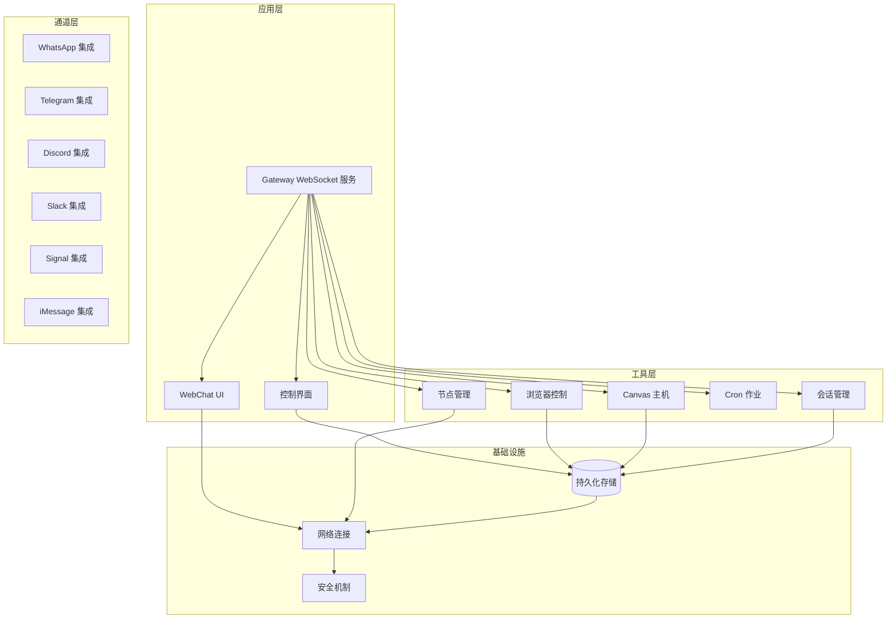
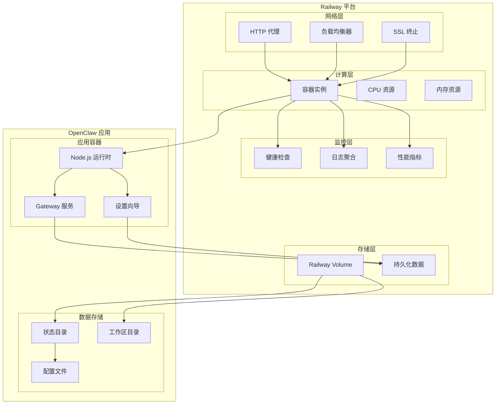
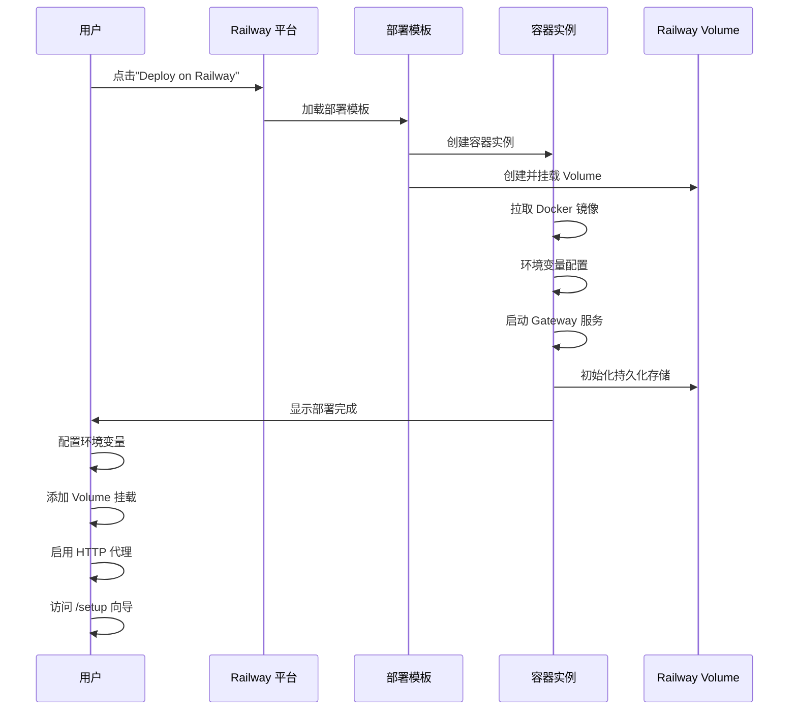
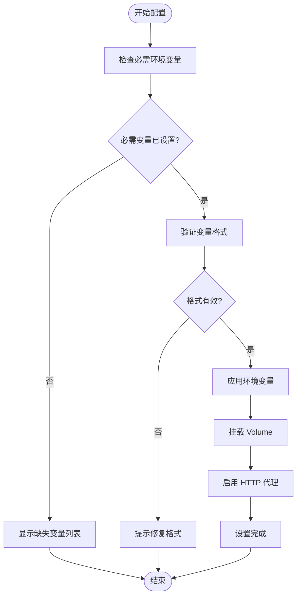
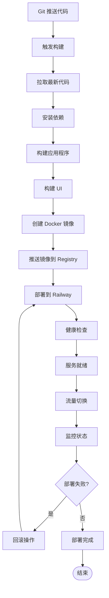
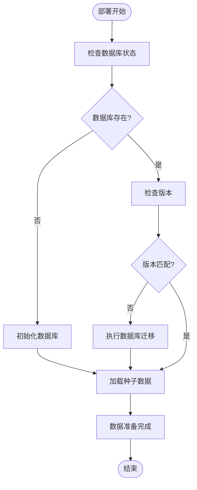
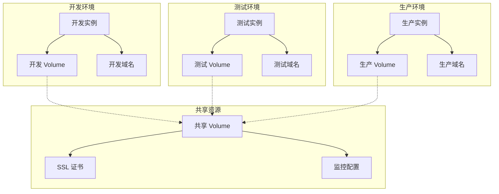
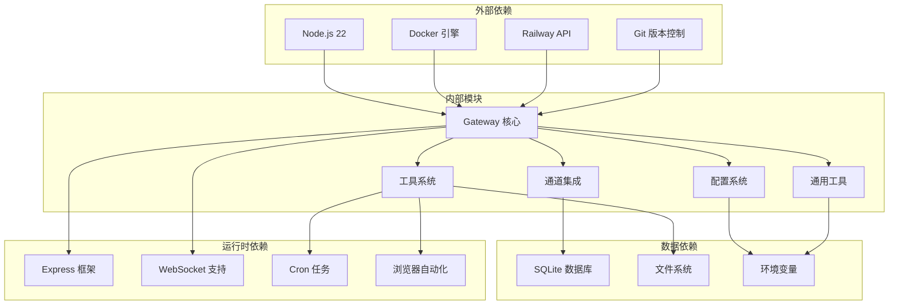
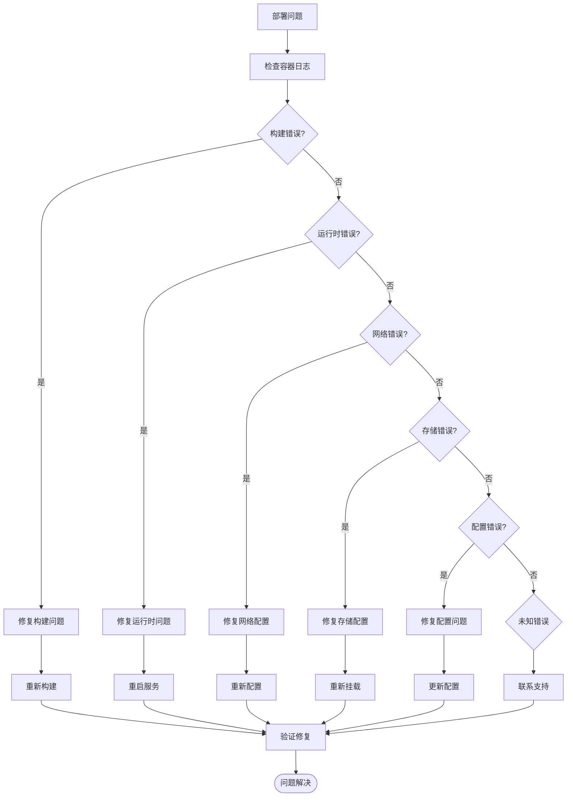
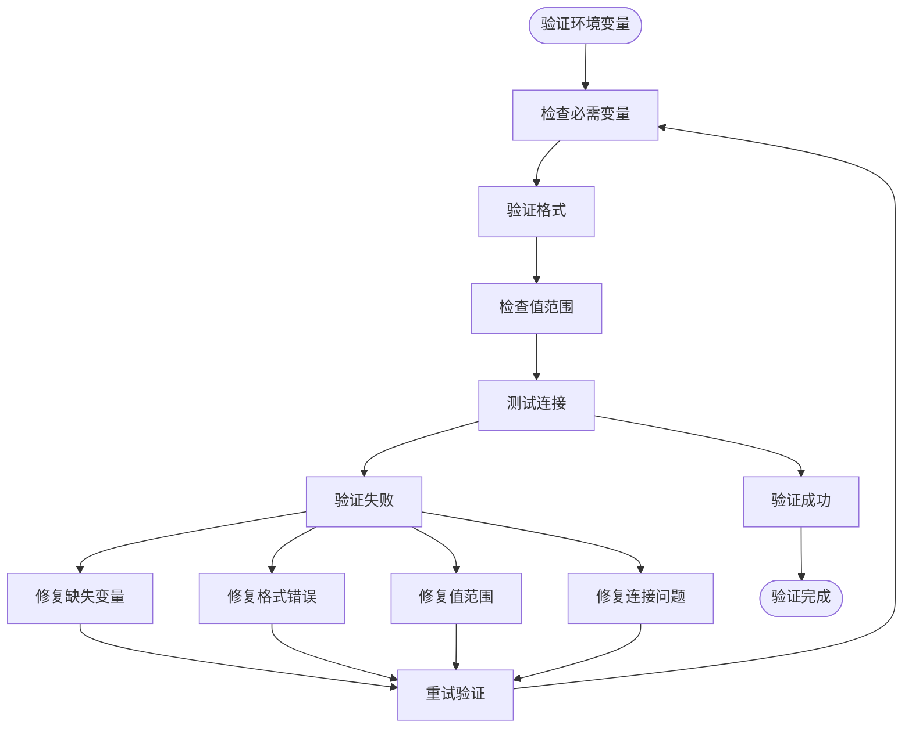

# Railway部署

<cite>
**本文档引用的文件**
- [README.md](file://README.md)
- [package.json](file://package.json)
- [Dockerfile](file://Dockerfile)
- [render.yaml](file://render.yaml)
- [fly.toml](file://fly.toml)
- [fly.private.toml](file://fly.private.toml)
- [docs/install/railway.mdx](file://docs/install/railway.mdx)
- [docs/zh-CN/install/railway.mdx](file://docs/zh-CN/install/railway.mdx)
- [src/config/env-substitution.ts](file://src/config/env-substitution.ts)
- [src/config/env-substitution.test.ts](file://src/config/env-substitution.test.ts)
- [src/commands/daemon-install-helpers.test.ts](file://src/commands/daemon-install-helpers.test.ts)
</cite>

## 目录

1. [简介](#简介)
2. [项目结构](#项目结构)
3. [核心组件](#核心组件)
4. [架构概览](#架构概览)
5. [详细组件分析](#详细组件分析)
6. [依赖关系分析](#依赖关系分析)
7. [性能考虑](#性能考虑)
8. [故障排除指南](#故障排除指南)
9. [结论](#结论)
10. [附录](#附录)

## 简介

Railway 是一个现代化的应用程序托管平台，提供了一键部署、自动构建和快速迭代能力。对于 OpenClaw 项目而言，Railway 提供了最简单的部署路径——通过一键模板在 Railway 上部署 OpenClaw，然后通过浏览器中的 `/setup` 向导完成所有配置。

Railway 的主要优势包括：

- **零服务器管理**：无需在服务器上使用终端
- **一键部署**：通过模板快速启动
- **自动构建**：Git 集成触发自动构建和部署
- **持久化存储**：通过 Volume 实现数据持久化
- **浏览器设置向导**：通过 `/setup` 页面完成配置
- **快速迭代**：支持快速部署和回滚

## 项目结构

OpenClaw 项目采用模块化架构，包含多个子系统：



**图表来源**

- [README.md](file://README.md#L185-L238)
- [package.json](file://package.json#L151-L228)

**章节来源**

- [README.md](file://README.md#L185-L238)
- [package.json](file://package.json#L1-L268)

## 核心组件

### Gateway 服务

Gateway 是 OpenClaw 的核心控制平面，提供 WebSocket 通信、会话管理和事件处理功能。它作为单一路由器，协调所有客户端、工具和事件。

### 控制界面 (Control UI)

提供 Web 界面用于监控和管理 OpenClaw 实例，包括状态查看、配置管理和日志监控。

### 通道集成

支持多种消息渠道的集成，包括 WhatsApp、Telegram、Discord、Slack、Signal 和 iMessage 等。

### 工具系统

包含浏览器控制、Canvas 主机、节点管理、Cron 作业和会话管理等工具组件。

**章节来源**

- [README.md](file://README.md#L144-L176)
- [package.json](file://package.json#L151-L228)

## 架构概览



**图表来源**

- [docs/install/railway.mdx](file://docs/install/railway.mdx#L42-L72)
- [render.yaml](file://render.yaml#L1-L22)

## 详细组件分析

### Railway 一键部署流程



**图表来源**

- [docs/install/railway.mdx](file://docs/install/railway.mdx#L17-L33)
- [docs/zh-CN/install/railway.mdx](file://docs/zh-CN/install/railway.mdx#L24-L40)

### 环境变量配置系统



**图表来源**

- [docs/install/railway.mdx](file://docs/install/railway.mdx#L56-L71)
- [src/config/env-substitution.ts](file://src/config/env-substitution.ts#L1-L49)

### 数据持久化架构

```mermaid
graph LR
subgraph "Railway Volume 结构"
Root[/data]
StateDir[.openclaw]
WorkspaceDir[workspace]
ConfigFile[配置文件]
Credentials[凭据存储]
Logs[日志文件]
end
subgraph "应用数据流"
GatewayData[Gateway 状态]
SessionData[会话数据]
SkillData[技能数据]
MediaData[媒体文件]
end
Root --> StateDir
Root --> WorkspaceDir
StateDir --> ConfigFile
StateDir --> Credentials
StateDir --> Logs
GatewayData --> StateDir
SessionData --> StateDir
SkillData --> WorkspaceDir
MediaData --> WorkspaceDir
```

**图表来源**

- [docs/install/railway.mdx](file://docs/install/railway.mdx#L11-L15)
- [render.yaml](file://render.yaml#L18-L21)

**章节来源**

- [docs/install/railway.mdx](file://docs/install/railway.mdx#L9-L71)
- [docs/zh-CN/install/railway.mdx](file://docs/zh-CN/install/railway.mdx#L16-L80)
- [src/config/env-substitution.ts](file://src/config/env-substitution.ts#L1-L49)

### 自动构建和部署管道



**图表来源**

- [Dockerfile](file://Dockerfile#L1-L73)
- [package.json](file://package.json#L49-L149)

**章节来源**

- [Dockerfile](file://Dockerfile#L1-L73)
- [package.json](file://package.json#L49-L149)

### 数据库迁移和种子数据处理

虽然 OpenClaw 主要使用本地 SQLite 存储，但 Railway 部署支持以下数据管理策略：



**图表来源**

- [docs/install/railway.mdx](file://docs/install/railway.mdx#L93-L106)

**章节来源**

- [docs/install/railway.mdx](file://docs/install/railway.mdx#L93-L106)

### 环境隔离和多环境管理



**图表来源**

- [docs/install/railway.mdx](file://docs/install/railway.mdx#L11-L15)

**章节来源**

- [docs/install/railway.mdx](file://docs/install/railway.mdx#L11-L15)

### Railway 特有功能

#### 快照备份

Railway 提供自动快照功能，可以在部署前自动创建应用状态的快照，确保部署过程中的数据安全。

#### 回滚功能

支持一键回滚到之前的稳定版本，通过点击按钮即可恢复到上一个成功部署的状态。

#### 蓝绿部署

Railway 支持蓝绿部署策略，通过并行运行两个完全相同的环境，实现零停机部署和快速回滚。

**章节来源**

- [docs/install/railway.mdx](file://docs/install/railway.mdx#L35-L41)

## 依赖关系分析



**图表来源**

- [package.json](file://package.json#L151-L228)
- [Dockerfile](file://Dockerfile#L1-L73)

**章节来源**

- [package.json](file://package.json#L151-L228)
- [Dockerfile](file://Dockerfile#L1-L73)

## 性能考虑

### 内存优化

- **Node.js 内存限制**：通过 `NODE_OPTIONS="--max-old-space-size=1536"` 限制内存使用
- **垃圾回收优化**：合理配置垃圾回收参数以避免内存泄漏
- **连接池管理**：优化数据库连接池大小

### 网络性能

- **HTTP 代理配置**：正确配置 Railway HTTP 代理端口 (8080)
- **WebSocket 连接**：优化长连接管理和心跳机制
- **静态资源缓存**：利用 Railway 的 CDN 缓存静态资源

### 存储性能

- **Volume 性能**：选择合适的 Railway Volume 类型
- **数据压缩**：对大型数据进行压缩存储
- **索引优化**：为常用查询字段建立索引

## 故障排除指南

### 常见部署问题



**图表来源**

- [src/config/env-substitution.test.ts](file://src/config/env-substitution.test.ts#L1-L351)

### 环境变量验证



**图表来源**

- [src/commands/daemon-install-helpers.test.ts](file://src/commands/daemon-install-helpers.test.ts#L143-L204)

**章节来源**

- [src/config/env-substitution.test.ts](file://src/config/env-substitution.test.ts#L1-L351)
- [src/commands/daemon-install-helpers.test.ts](file://src/commands/daemon-install-helpers.test.ts#L143-L204)

## 结论

Railway 为 OpenClaw 提供了一个强大而易用的部署平台，具有以下优势：

1. **简化部署流程**：通过一键模板和浏览器向导，无需复杂的服务器管理
2. **自动构建和部署**：Git 集成触发自动构建，支持快速迭代
3. **数据持久化**：通过 Railway Volume 确保配置和数据的持久性
4. **环境隔离**：支持多环境管理，便于开发、测试和生产分离
5. **运维友好**：提供健康检查、日志聚合和监控功能

对于 OpenClaw 这样的复杂应用，Railway 的优势在于其简化的运维模型和强大的平台功能，使得开发者可以专注于业务逻辑而非基础设施管理。

## 附录

### 部署最佳实践

1. **环境变量管理**
   - 使用 Railway 的环境变量管理功能
   - 区分开发、测试和生产环境的变量
   - 定期轮换敏感变量

2. **监控和告警**
   - 配置健康检查端点
   - 设置适当的告警阈值
   - 监控资源使用情况

3. **备份策略**
   - 定期导出配置和数据
   - 测试备份恢复流程
   - 跨环境数据同步

4. **性能优化**
   - 监控应用响应时间
   - 优化数据库查询
   - 调整容器资源配置

**章节来源**

- [docs/install/railway.mdx](file://docs/install/railway.mdx#L93-L106)
- [render.yaml](file://render.yaml#L1-L22)
