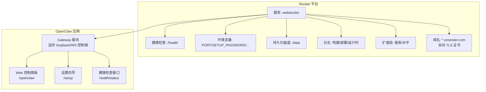
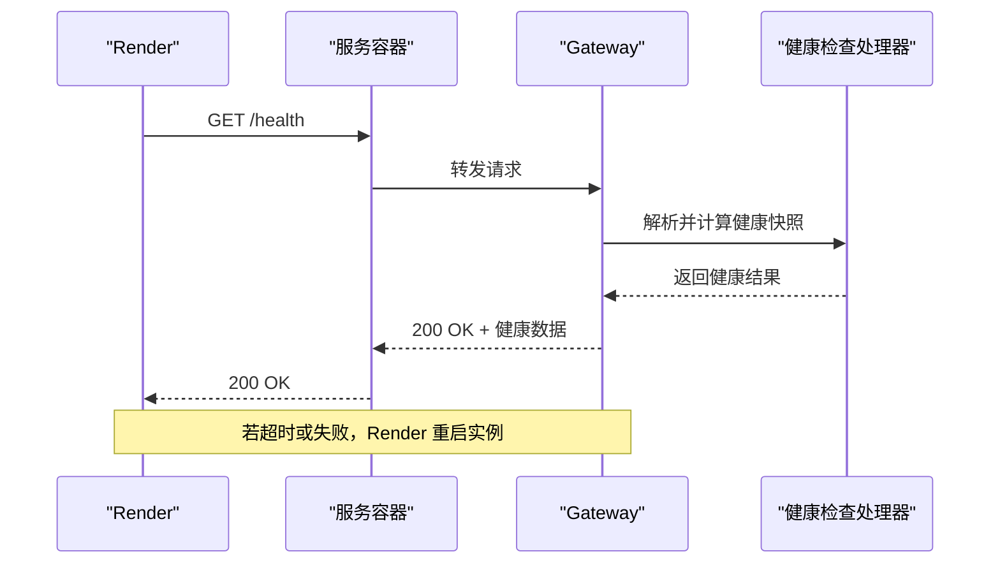

# Render部署

<cite>
**本文档引用的文件**
- [render.yaml](file://render.yaml)
- [Dockerfile](file://Dockerfile)
- [README.md](file://README.md)
- [docs/zh-CN/install/render.mdx](file://docs/zh-CN/install/render.mdx)
- [docs/install/render.mdx](file://docs/install/render.mdx)
- [src/gateway/server-methods/health.ts](file://src/gateway/server-methods/health.ts)
- [src/commands/health.ts](file://src/commands/health.ts)
- [docs/cli/health.md](file://docs/cli/health.md)
- [docs/zh-CN/gateway/health.md](file://docs/zh-CN/gateway/health.md)
- [src/config/env-vars.ts](file://src/config/env-vars.ts)
- [src/commands/daemon-install-helpers.test.ts](file://src/commands/daemon-install-helpers.test.ts)
- [apps/macos/Sources/OpenClawMacCLI/ConnectCommand.swift](file://apps/macos/Sources/OpenClawMacCLI/ConnectCommand.swift)
- [extensions/open-prose/skills/prose/state/postgres.md](file://extensions/open-prose/skills/prose/state/postgres.md)
</cite>

## 目录

1. [简介](#简介)
2. [项目结构](#项目结构)
3. [核心组件](#核心组件)
4. [架构总览](#架构总览)
5. [详细组件分析](#详细组件分析)
6. [依赖关系分析](#依赖关系分析)
7. [性能考虑](#性能考虑)
8. [故障排查指南](#故障排查指南)
9. [结论](#结论)
10. [附录](#附录)

## 简介

本指南面向在 Render 平台上部署 OpenClaw 的用户，重点说明 Render 的无服务器架构优势与自动扩缩容能力，以及如何基于仓库内的 render.yaml Blueprint 快速完成部署。文档涵盖以下主题：

- Render Blueprint 的关键字段与行为（健康检查、环境变量、持久化磁盘、计划选择）
- 环境变量、数据库连接与静态资源处理的配置要点
- 自动 HTTPS 证书与域名绑定流程
- Web 服务与 Worker 进程的配置差异
- 性能监控、日志查看与错误排查操作
- 成本控制与资源优化最佳实践

## 项目结构

OpenClaw 通过 render.yaml 声明式地定义在 Render 上的基础设施，配合 Dockerfile 实现容器化构建与运行。README 提供整体项目背景与运行方式，相关文档页面覆盖部署、健康检查、日志与故障排查等运维主题。

```mermaid
graph TB
A["仓库根目录"] --> B["render.yaml<br/>定义服务/磁盘/环境变量/健康检查"]
A --> C["Dockerfile<br/>Node 22 基础镜像/安装依赖/构建产物"]
A --> D["README.md<br/>项目说明/运行方式/文档索引"]
A --> E["docs/zh-CN/install/render.mdx<br/>中文部署指南"]
A --> F["docs/install/render.mdx<br/>英文部署指南"]
A --> G["src/gateway/server-methods/health.ts<br/>健康检查接口实现"]
A --> H["src/commands/health.ts<br/>健康快照逻辑"]
A --> I["docs/cli/health.md<br/>CLI 健康命令参考"]
A --> J["docs/zh-CN/gateway/health.md<br/>中文健康检查说明"]
A --> K["src/config/env-vars.ts<br/>环境变量收集与注入"]
A --> L["src/commands/daemon-install-helpers.test.ts<br/>环境变量安全处理测试"]
A --> M["apps/macos/Sources/OpenClawMacCLI/ConnectCommand.swift<br/>客户端调用 health 接口"]
A --> N["extensions/open-prose/skills/prose/state/postgres.md<br/>PostgreSQL 连接示例"]
```

图表来源

- [render.yaml](file://render.yaml#L1-L22)
- [Dockerfile](file://Dockerfile#L1-L73)
- [README.md](file://README.md#L1-L556)
- [docs/zh-CN/install/render.mdx](file://docs/zh-CN/install/render.mdx#L1-L170)
- [docs/install/render.mdx](file://docs/install/render.mdx#L1-L160)
- [src/gateway/server-methods/health.ts](file://src/gateway/server-methods/health.ts#L1-L37)
- [src/commands/health.ts](file://src/commands/health.ts#L348-L375)
- [docs/cli/health.md](file://docs/cli/health.md#L1-L22)
- [docs/zh-CN/gateway/health.md](file://docs/zh-CN/gateway/health.md#L34-L43)
- [src/config/env-vars.ts](file://src/config/env-vars.ts#L56-L80)
- [src/commands/daemon-install-helpers.test.ts](file://src/commands/daemon-install-helpers.test.ts#L143-L204)
- [apps/macos/Sources/OpenClawMacCLI/ConnectCommand.swift](file://apps/macos/Sources/OpenClawMacCLI/ConnectCommand.swift#L142-L161)
- [extensions/open-prose/skills/prose/state/postgres.md](file://extensions/open-prose/skills/prose/state/postgres.md#L156-L204)

章节来源

- [render.yaml](file://render.yaml#L1-L22)
- [Dockerfile](file://Dockerfile#L1-L73)
- [README.md](file://README.md#L1-L556)
- [docs/zh-CN/install/render.mdx](file://docs/zh-CN/install/render.mdx#L1-L170)
- [docs/install/render.mdx](file://docs/install/render.mdx#L1-L160)

## 核心组件

- Render Blueprint（render.yaml）
  - 类型：web 服务
  - 运行时：docker（基于仓库 Dockerfile 构建）
  - 健康检查路径：/health
  - 环境变量：PORT、SETUP_PASSWORD、OPENCLAW_STATE_DIR、OPENCLAW_WORKSPACE_DIR、OPENCLAW_GATEWAY_TOKEN
  - 持久化磁盘：/data 目录挂载
  - 计划：starter（可按需调整）

- Dockerfile
  - 基于 node:22-bookworm
  - 安装 Bun 与 Playwright 可选组件
  - 生产环境运行用户为非 root
  - CMD 启动 Gateway，默认绑定 loopback

- 健康检查
  - Gateway 提供 health/status 方法，Render 通过 /health 触发
  - 支持带探测参数的健康查询与缓存刷新

- 环境变量
  - 支持从配置注入环境变量，同时对危险变量进行过滤
  - 变量同步与生成策略：sync=false（部署时提示）、generateValue=true（自动生成安全值）

章节来源

- [render.yaml](file://render.yaml#L1-L22)
- [Dockerfile](file://Dockerfile#L1-L73)
- [src/gateway/server-methods/health.ts](file://src/gateway/server-methods/health.ts#L1-L37)
- [src/commands/health.ts](file://src/commands/health.ts#L348-L375)
- [src/config/env-vars.ts](file://src/config/env-vars.ts#L56-L80)
- [src/commands/daemon-install-helpers.test.ts](file://src/commands/daemon-install-helpers.test.ts#L143-L204)

## 架构总览

下图展示 Render Blueprint 如何驱动 OpenClaw 在 Render 上的部署与运行，以及健康检查与日志流：

图表来源

- [render.yaml](file://render.yaml#L1-L22)
- [Dockerfile](file://Dockerfile#L66-L73)
- [src/gateway/server-methods/health.ts](file://src/gateway/server-methods/health.ts#L10-L37)
- [docs/zh-CN/install/render.mdx](file://docs/zh-CN/install/render.mdx#L101-L116)
- [docs/install/render.mdx](file://docs/install/render.mdx#L88-L116)

## 详细组件分析

### Render Blueprint 配置详解

- 关键字段说明
  - runtime: docker —— 使用仓库 Dockerfile 构建镜像
  - healthCheckPath: /health —— Render 将轮询该路径以判断实例健康
  - envVars:
    - PORT: 8080（需与 Dockerfile 暴露端口一致）
    - SETUP_PASSWORD: sync=false（部署时提示输入）
    - OPENCLAW_STATE_DIR、OPENCLAW_WORKSPACE_DIR：指向持久化磁盘路径
    - OPENCLAW_GATEWAY_TOKEN: generateValue=true（自动生成安全令牌）
  - disk: name/mountPath/sizeGB —— 持久化存储，避免重新部署丢失配置

- 计划选择
  - Free：空闲 15 分钟后休眠，无持久化磁盘
  - Starter：永不休眠，1GB+ 磁盘，适合个人/小团队
  - Standard+：永不休眠，1GB+ 磁盘，适合生产/多渠道

章节来源

- [render.yaml](file://render.yaml#L1-L22)
- [docs/zh-CN/install/render.mdx](file://docs/zh-CN/install/render.mdx#L75-L83)
- [docs/install/render.mdx](file://docs/install/render.mdx#L63-L73)

### 环境变量与安全

- 注入策略
  - 从配置收集环境变量并合并到运行时环境
  - 对危险变量进行过滤，避免注入恶意选项
  - 空值或仅空白字符的变量不会覆盖已有环境

- 常用变量
  - PORT：服务监听端口
  - SETUP_PASSWORD：首次设置向导密码
  - OPENCLAW_STATE_DIR、OPENCLAW_WORKSPACE_DIR：状态与工作区持久化路径
  - OPENCLAW_GATEWAY_TOKEN：网关访问令牌（建议开启自动生成）

章节来源

- [src/config/env-vars.ts](file://src/config/env-vars.ts#L56-L80)
- [src/commands/daemon-install-helpers.test.ts](file://src/commands/daemon-install-helpers.test.ts#L143-L204)
- [render.yaml](file://render.yaml#L7-L17)

### 健康检查与自动扩缩容

- 健康检查
  - Render 期望在 30 秒内收到 /health 的 200 响应
  - Gateway 提供 health 与 status 方法，支持探测与缓存
  - 客户端可通过 RPC 调用 health，返回健康快照

- 自动扩缩容
  - 垂直扩展：提升 CPU/内存（推荐用于 OpenClaw）
  - 水平扩展：增加实例数（需粘性会话或外部状态管理）

图表来源

- [docs/install/render.mdx](file://docs/install/render.mdx#L154-L159)
- [src/gateway/server-methods/health.ts](file://src/gateway/server-methods/health.ts#L10-L37)
- [src/commands/health.ts](file://src/commands/health.ts#L348-L375)
- [apps/macos/Sources/OpenClawMacCLI/ConnectCommand.swift](file://apps/macos/Sources/OpenClawMacCLI/ConnectCommand.swift#L154-L161)

章节来源

- [docs/install/render.mdx](file://docs/install/render.mdx#L117-L125)
- [src/gateway/server-methods/health.ts](file://src/gateway/server-methods/health.ts#L1-L37)
- [src/commands/health.ts](file://src/commands/health.ts#L348-L375)
- [apps/macos/Sources/OpenClawMacCLI/ConnectCommand.swift](file://apps/macos/Sources/OpenClawMacCLI/ConnectCommand.swift#L142-L161)

### 自动 HTTPS 证书与域名绑定

- 自定义域名流程
  - 在 Render 仪表盘添加域名并按指示配置 DNS（CNAME 到 \*.onrender.com）
  - Render 自动签发并配置 TLS 证书

- 证书与安全
  - Render 提供自动 TLS 证书
  - 可结合网关安全头策略与客户端证书固定策略（适用于其他场景）

章节来源

- [docs/zh-CN/install/render.mdx](file://docs/zh-CN/install/render.mdx#L121-L127)
- [docs/install/render.mdx](file://docs/install/render.mdx#L110-L116)

### 数据库与静态资源处理

- PostgreSQL 连接
  - 文档提供了本地/云 PostgreSQL 的连接示例与环境变量设置方法
  - 可根据团队协作与生产需求选择 Neon、Supabase、Railway 等云服务

- Redis 连接
  - 文档未直接给出 Redis 配置示例，可参考 PostgreSQL 的模式进行环境变量注入与连接字符串设置

- 静态资源
  - UI 构建产物由 Dockerfile 在构建阶段生成并随应用运行
  - 控制面板与 WebChat 由 Gateway 直接提供

章节来源

- [extensions/open-prose/skills/prose/state/postgres.md](file://extensions/open-prose/skills/prose/state/postgres.md#L156-L204)
- [Dockerfile](file://Dockerfile#L47-L53)

### Web 服务与 Worker 进程配置差异

- Web 服务（render.yaml 中的 web 类型）
  - 通过 Dockerfile 构建并运行 Gateway
  - 绑定 loopback（默认），通过 Render 的健康检查与负载均衡暴露
  - 适合对外提供 Web 控制面板与设置向导

- Worker 进程
  - 仓库未提供独立的 worker 服务 Blueprint
  - 若需后台任务/定时任务，可在同一容器内通过 Cron 或子进程方式运行（需自行扩展）

章节来源

- [render.yaml](file://render.yaml#L1-L22)
- [Dockerfile](file://Dockerfile#L66-L73)

## 依赖关系分析

- Blueprint 与 Dockerfile 的耦合
  - Blueprint 的 runtime: docker 与 Dockerfile 的构建步骤强关联
  - 环境变量（如 PORT）需与 Dockerfile 暴露端口一致

- 健康检查链路
  - Render -> 容器 -> Gateway -> 健康处理器 -> 返回结果
  - 健康快照包含会话、通道与代理状态摘要

图表来源

- [docs/install/render.mdx](file://docs/install/render.mdx#L154-L159)
- [src/gateway/server-methods/health.ts](file://src/gateway/server-methods/health.ts#L10-L37)
- [src/commands/health.ts](file://src/commands/health.ts#L348-L375)

章节来源

- [render.yaml](file://render.yaml#L1-L22)
- [Dockerfile](file://Dockerfile#L1-L73)
- [src/gateway/server-methods/health.ts](file://src/gateway/server-methods/health.ts#L1-L37)

## 性能考虑

- 垂直扩展优先
  - OpenClaw 以单进程 Gateway 为主，垂直扩展通常足以满足需求
  - 水平扩展需考虑粘性会话或外部状态管理

- 冷启动与休眠
  - 免费套餐会在 15 分钟无活动后休眠，首次请求会有冷启动延迟
  - 升级至 Starter/Standard+ 可实现常驻在线

- 构建与运行时优化
  - Dockerfile 已针对低内存主机降低 OOM 风险
  - 可选预装浏览器组件以减少启动时依赖安装时间

章节来源

- [docs/zh-CN/install/render.mdx](file://docs/zh-CN/install/render.mdx#L128-L136)
- [docs/install/render.mdx](file://docs/install/render.mdx#L117-L125)
- [Dockerfile](file://Dockerfile#L26-L28)
- [Dockerfile](file://Dockerfile#L34-L45)

## 故障排查指南

- 服务无法启动
  - 检查部署日志，确认是否缺少 SETUP_PASSWORD 或端口不匹配
  - 本地验证：docker build && docker run 是否能正常启动

- 健康检查失败
  - 确认 /health 能在 30 秒内返回 200
  - 查看构建日志与容器本地运行情况

- 重新部署后数据丢失
  - 免费套餐无持久化磁盘，升级套餐或定期导出配置（/setup/export）

- 冷启动缓慢
  - 升级套餐至 Starter/Standard+ 以获得常驻在线

- 日志与 Shell 访问
  - 在 Render 仪表盘查看构建/部署/运行时日志
  - 通过 Shell 进入容器调试，持久化磁盘挂载在 /data

章节来源

- [docs/zh-CN/install/render.mdx](file://docs/zh-CN/install/render.mdx#L147-L170)
- [docs/install/render.mdx](file://docs/install/render.mdx#L136-L160)

## 结论

通过 render.yaml Blueprint，OpenClaw 可在 Render 上实现声明式的基础设施与应用部署。结合健康检查、自动扩缩容与持久化磁盘，用户可以快速搭建稳定、可扩展的个人 AI 助手服务。建议优先采用垂直扩展与合适的套餐计划，并利用 Render 的日志与 Shell 能力进行日常运维与故障排查。

## 附录

### A. 环境变量清单与用途

- PORT：服务监听端口（需与 Dockerfile 暴露端口一致）
- SETUP_PASSWORD：首次设置向导密码（部署时提示输入）
- OPENCLAW_STATE_DIR：状态目录持久化路径
- OPENCLAW_WORKSPACE_DIR：工作区持久化路径
- OPENCLAW_GATEWAY_TOKEN：网关访问令牌（建议自动生成）

章节来源

- [render.yaml](file://render.yaml#L7-L17)
- [src/config/env-vars.ts](file://src/config/env-vars.ts#L56-L80)

### B. 健康检查接口参考

- 方法：health
  - 支持参数：probe（是否强制探测）
  - 返回：健康快照（含会话、通道与代理状态摘要）
- 方法：status
  - 返回：运行状态摘要（管理员作用域可见敏感信息）

章节来源

- [src/gateway/server-methods/health.ts](file://src/gateway/server-methods/health.ts#L10-L37)
- [src/commands/health.ts](file://src/commands/health.ts#L348-L375)
- [docs/cli/health.md](file://docs/cli/health.md#L1-L22)
- [docs/zh-CN/gateway/health.md](file://docs/zh-CN/gateway/health.md#L34-L43)
