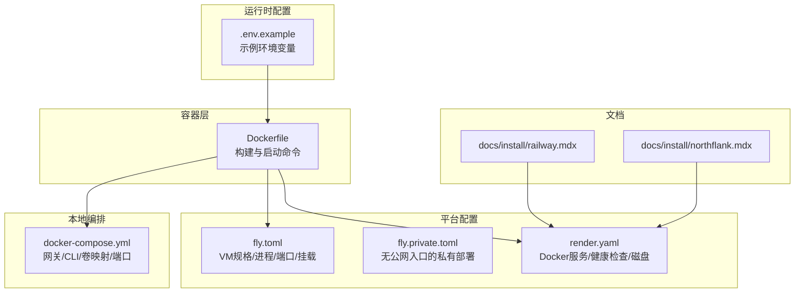
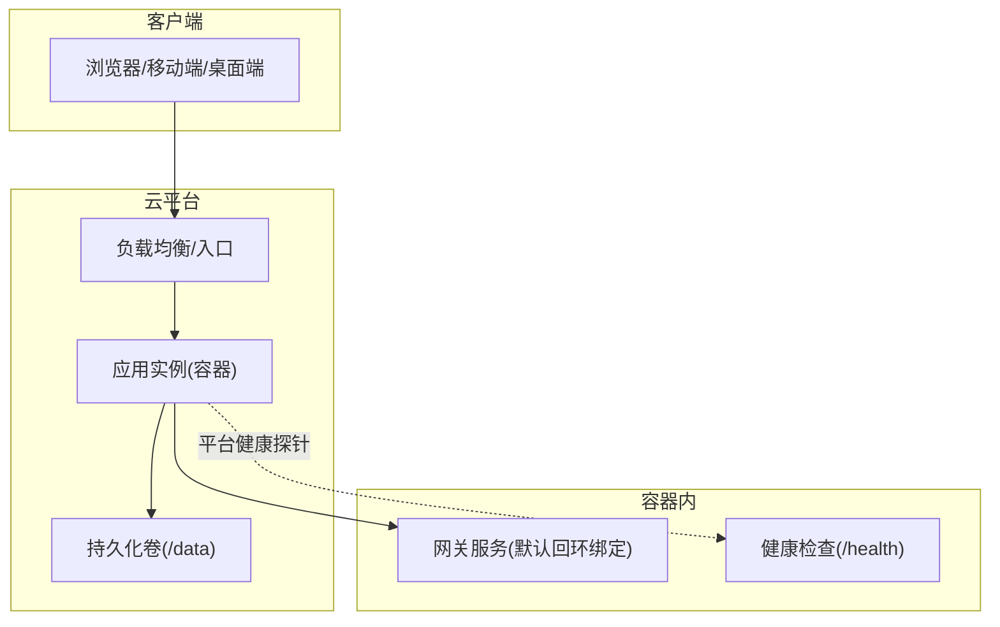
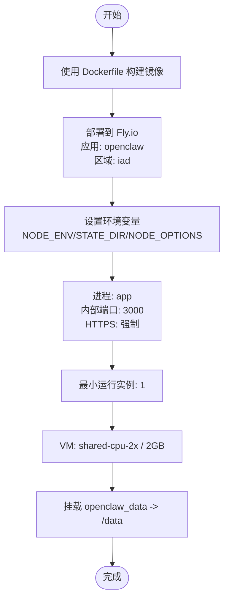
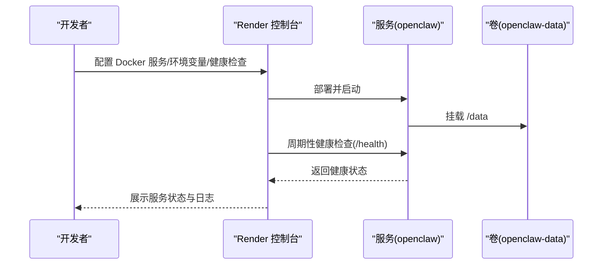
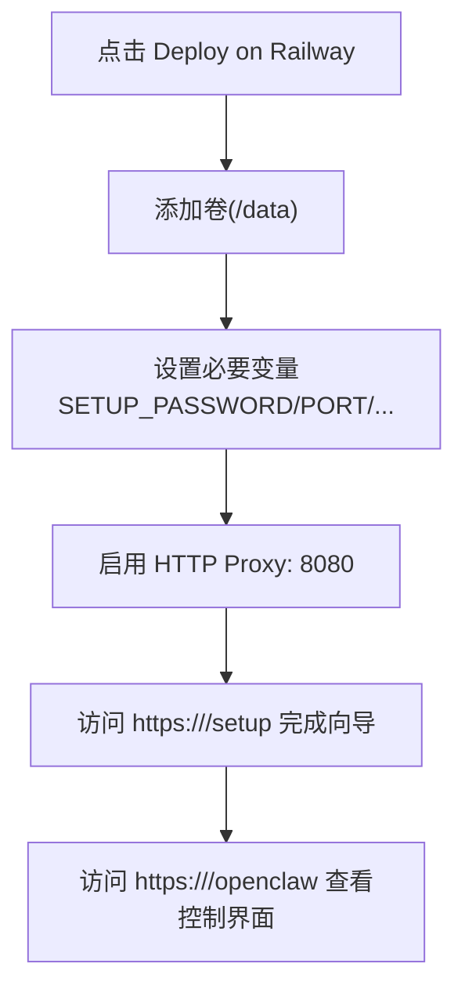
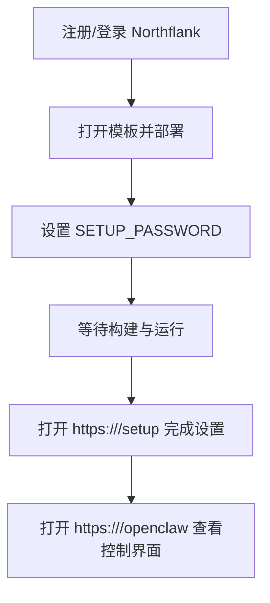
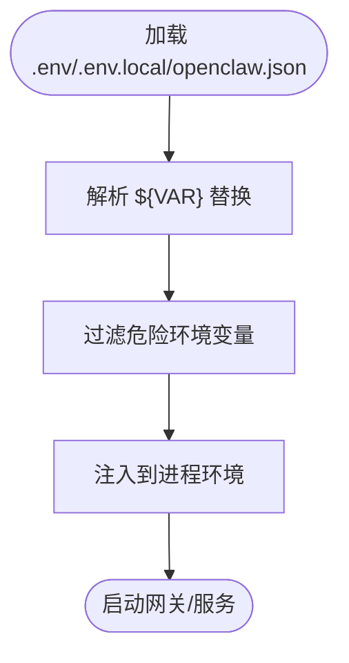
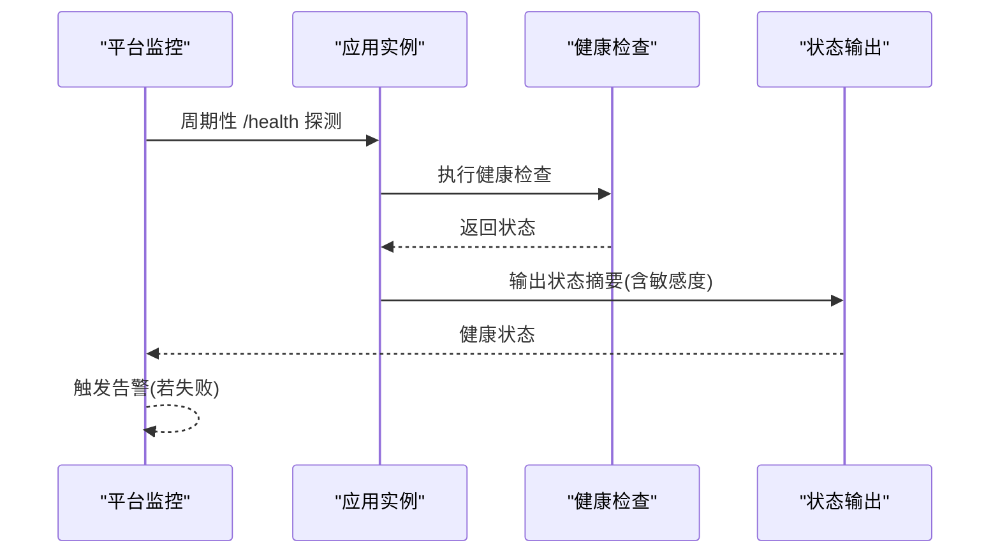
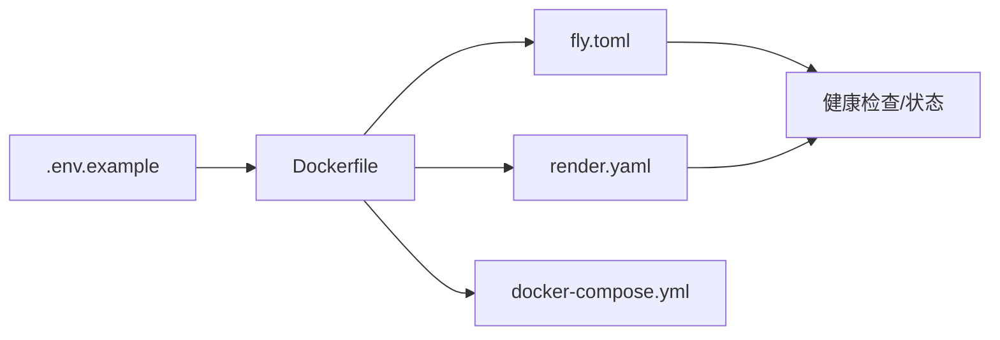

# 云平台部署

<cite>
**本文引用的文件**
- [fly.toml](file://fly.toml)
- [fly.private.toml](file://fly.private.toml)
- [render.yaml](file://render.yaml)
- [Dockerfile](file://Dockerfile)
- [docker-compose.yml](file://docker-compose.yml)
- [.env.example](file://.env.example)
- [docs/install/railway.mdx](file://docs/install/railway.mdx)
- [docs/install/northflank.mdx](file://docs/install/northflank.mdx)
- [src/commands/health-format.ts](file://src/commands/health-format.ts)
- [src/gateway/server-methods/server-methods.test.ts](file://src/gateway/server-methods/server-methods.test.ts)
- [src/commands/health.ts](file://src/commands/health.ts)
- [src/gateway/channel-health-monitor.ts](file://src/gateway/channel-health-monitor.ts)
- [src/commands/status.command.ts](file://src/commands/status.command.ts)
- [src/config/env-substitution.test.ts](file://src/config/env-substitution.test.ts)
- [src/config/env-vars.ts](file://src/config/env-vars.ts)
- [src/commands/daemon-install-helpers.test.ts](file://src/commands/daemon-install-helpers.test.ts)
</cite>

## 目录

1. [简介](#简介)
2. [项目结构](#项目结构)
3. [核心组件](#核心组件)
4. [架构总览](#架构总览)
5. [详细组件分析](#详细组件分析)
6. [依赖关系分析](#依赖关系分析)
7. [性能与资源规划](#性能与资源规划)
8. [故障排查指南](#故障排查指南)
9. [结论](#结论)
10. [附录](#附录)

## 简介

本指南面向在主流云平台（Fly.io、Render、Railway、Northflank）部署 OpenClaw 的用户，覆盖从环境变量配置、数据库与存储挂载、域名与健康检查，到自动部署、蓝绿/滚动更新策略、监控与日志聚合、告警配置以及不同规模企业推荐方案。文档基于仓库中现有的部署配置与文档文件进行整理，确保可操作性与一致性。

## 项目结构

OpenClaw 提供了多平台部署所需的基础设施与配置文件：

- 容器镜像构建：Dockerfile
- 平台配置：fly.toml、fly.private.toml、render.yaml
- 本地/开发编排：docker-compose.yml
- 环境变量示例：.env.example
- 平台部署文档：docs/install/railway.mdx、docs/install/northflank.mdx
- 健康检查与状态输出：src/commands/health.ts、src/commands/health-format.ts、src/commands/status.command.ts
- 环境变量解析与注入：src/config/env-substitution.test.ts、src/config/env-vars.ts、src/commands/daemon-install-helpers.test.ts

图表来源

- [Dockerfile](file://Dockerfile#L1-L73)
- [fly.toml](file://fly.toml#L1-L35)
- [fly.private.toml](file://fly.private.toml#L1-L40)
- [render.yaml](file://render.yaml#L1-L22)
- [docker-compose.yml](file://docker-compose.yml#L1-L47)
- [.env.example](file://.env.example#L1-L81)
- [docs/install/railway.mdx](file://docs/install/railway.mdx#L1-L100)
- [docs/install/northflank.mdx](file://docs/install/northflank.mdx#L1-L54)

章节来源

- [Dockerfile](file://Dockerfile#L1-L73)
- [fly.toml](file://fly.toml#L1-L35)
- [fly.private.toml](file://fly.private.toml#L1-L40)
- [render.yaml](file://render.yaml#L1-L22)
- [docker-compose.yml](file://docker-compose.yml#L1-L47)
- [.env.example](file://.env.example#L1-L81)
- [docs/install/railway.mdx](file://docs/install/railway.mdx#L1-L100)
- [docs/install/northflank.mdx](file://docs/install/northflank.mdx#L1-L54)

## 核心组件

- 容器镜像与启动
  - 使用 Node.js 22 基础镜像，启用 Corepack，安装 Bun 以支持构建脚本；默认以非 root 用户运行，提升安全性。
  - 构建阶段执行 pnpm 安装与 UI 打包，并在可选参数下预装浏览器依赖以降低冷启动时间。
  - 启动命令默认运行网关服务，绑定回环地址，可通过环境变量与参数调整端口与绑定方式。
- 平台配置
  - Fly.io：定义应用名、主区域、Dockerfile、环境变量、进程类型、HTTP 服务内部端口、强制 HTTPS、最小运行实例数、VM 规格与持久化挂载。
  - Render：定义 Docker 运行时、starter 计划、健康检查路径、环境变量（含自动生成密钥）、磁盘挂载与容量。
  - Railway/Northflank：通过文档说明一键模板部署、公共网络、卷挂载、环境变量与控制界面访问路径。
- 本地编排
  - docker-compose 提供网关与 CLI 服务，支持将配置目录与工作空间目录映射到容器内，便于本地调试与开发。

章节来源

- [Dockerfile](file://Dockerfile#L1-L73)
- [fly.toml](file://fly.toml#L1-L35)
- [fly.private.toml](file://fly.private.toml#L1-L40)
- [render.yaml](file://render.yaml#L1-L22)
- [docker-compose.yml](file://docker-compose.yml#L1-L47)
- [docs/install/railway.mdx](file://docs/install/railway.mdx#L1-L100)
- [docs/install/northflank.mdx](file://docs/install/northflank.mdx#L1-L54)

## 架构总览

OpenClaw 在云平台上的运行由“容器镜像 + 平台编排 + 持久化存储 + 健康检查”构成。容器内运行网关服务，平台负责：

- 自动扩缩容与实例管理（如 Fly.io 的最小运行实例）
- 公网入口与 TLS 终止（如 Fly.io 的强制 HTTPS）
- 存储挂载（/data）以持久化配置与工作空间
- 健康检查与重启策略（平台与内置健康探针）

图表来源

- [fly.toml](file://fly.toml#L20-L26)
- [render.yaml](file://render.yaml#L6-L6)
- [Dockerfile](file://Dockerfile#L69-L72)

## 详细组件分析

### Fly.io 部署

- 应用与区域
  - 应用名为 openclaw，主区域可按就近选择。
- 构建与镜像
  - 使用根目录 Dockerfile 构建。
- 环境变量
  - 生产环境、偏好 pnpm、状态目录、Node 内存上限等。
- 进程与端口
  - 进程类型为 app，内部监听 3000 端口，强制 HTTPS，保持机器常驻以便长连接。
  - 最小运行实例为 1，避免空闲缩容导致的延迟。
- VM 规格
  - 使用共享 CPU 双核与 2GB 内存。
- 挂载
  - 将平台卷 openclaw_data 挂载至 /data，持久化配置与工作空间。
- 私有部署
  - fly.private.toml 示例展示了不暴露公网入口的部署方式，仅通过隧道或代理访问。

图表来源

- [fly.toml](file://fly.toml#L4-L34)
- [fly.private.toml](file://fly.private.toml#L12-L39)

章节来源

- [fly.toml](file://fly.toml#L1-L35)
- [fly.private.toml](file://fly.private.toml#L1-L40)

### Render 部署

- 运行时与计划
  - Docker 运行时，starter 计划。
- 健康检查
  - 健康检查路径为 /health。
- 环境变量
  - PORT=8080、SETUP_PASSWORD（敏感值不同步）、OPENCLAW_STATE_DIR、OPENCLAW_WORKSPACE_DIR、OPENCLAW_GATEWAY_TOKEN（自动生成）。
- 存储
  - 创建名为 openclaw-data 的磁盘，挂载路径 /data，容量 1GB。

图表来源

- [render.yaml](file://render.yaml#L1-L22)

章节来源

- [render.yaml](file://render.yaml#L1-L22)

### Railway 部署（一键模板）

- 一键部署
  - 提供 Railway 模板，一键部署后通过浏览器完成配置向导。
- 公共网络
  - 启用 HTTP 代理，端口 8080。
- 卷
  - 添加卷并挂载至 /data，保证配置与工作空间持久化。
- 环境变量
  - 至少设置 SETUP_PASSWORD；建议设置 PORT、OPENCLAW_STATE_DIR、OPENCLAW_WORKSPACE_DIR、OPENCLAW_GATEWAY_TOKEN。
- 控制界面
  - /setup：设置向导（受密码保护）
  - /openclaw：控制 UI

图表来源

- [docs/install/railway.mdx](file://docs/install/railway.mdx#L17-L33)

章节来源

- [docs/install/railway.mdx](file://docs/install/railway.mdx#L1-L100)

### Northflank 部署（一键模板）

- 一键部署
  - 提供 Northflank 模板，注册账号后一键部署。
- 环境变量
  - 至少设置 SETUP_PASSWORD。
- 控制界面
  - /setup：设置向导
  - /openclaw：控制 UI

图表来源

- [docs/install/northflank.mdx](file://docs/install/northflank.mdx#L9-L33)

章节来源

- [docs/install/northflank.mdx](file://docs/install/northflank.mdx#L1-L54)

### 环境变量与安全

- 关键环境变量
  - 网关认证：OPENCLAW_GATEWAY_TOKEN 或 OPENCLAW_GATEWAY_PASSWORD
  - 路径覆盖：OPENCLAW_STATE_DIR、OPENCLAW_CONFIG_PATH、OPENCLAW_HOME
  - 模型提供商密钥：OPENAI_API_KEY、ANTHROPIC_API_KEY、GEMINI_API_KEY 等
  - 渠道令牌：TELEGRAM_BOT_TOKEN、DISCORD_BOT_TOKEN、SLACK_BOT_TOKEN 等
  - 工具与媒体：ELEVENLABS_API_KEY、DEEPGRAM_API_KEY 等
- 注入与替换
  - 支持在配置中使用 ${VAR} 形式的环境变量替换，且对嵌套结构与数组均有效。
  - 在服务安装计划中会过滤危险环境变量（如 NODE_OPTIONS 中的恶意 require），避免注入风险。

图表来源

- [.env.example](file://.env.example#L14-L81)
- [src/config/env-substitution.test.ts](file://src/config/env-substitution.test.ts#L1-L89)
- [src/config/env-vars.ts](file://src/config/env-vars.ts#L56-L80)
- [src/commands/daemon-install-helpers.test.ts](file://src/commands/daemon-install-helpers.test.ts#L143-L204)

章节来源

- [.env.example](file://.env.example#L1-L81)
- [src/config/env-substitution.test.ts](file://src/config/env-substitution.test.ts#L1-L89)
- [src/config/env-vars.ts](file://src/config/env-vars.ts#L56-L80)
- [src/commands/daemon-install-helpers.test.ts](file://src/commands/daemon-install-helpers.test.ts#L143-L204)

### 数据库与存储

- 存储挂载
  - Fly.io：通过 mounts 将平台卷挂载到 /data
  - Render：通过 disk 字段声明卷并挂载到 /data
  - Railway/Northflank：文档明确要求添加卷并挂载至 /data
- 工作空间与状态目录
  - 建议将 OPENCLAW_STATE_DIR 与 OPENCLAW_WORKSPACE_DIR 指向 /data 下的子目录，确保重启与迁移时数据不丢失。
- 外部数据库
  - 若需外部数据库（如 PostgreSQL），可在平台提供的云数据库服务中创建实例，并将连接字符串作为环境变量注入。

章节来源

- [fly.toml](file://fly.toml#L32-L34)
- [render.yaml](file://render.yaml#L18-L21)
- [docs/install/railway.mdx](file://docs/install/railway.mdx#L50-L54)
- [docs/install/northflank.mdx](file://docs/install/northflank.mdx#L14-L15)

### 域名与 HTTPS

- Fly.io
  - 强制 HTTPS，适合直接使用平台分配的域名或自定义域名。
- Render
  - 通过健康检查路径 /health 与平台集成，建议配合自定义域名与 SSL。
- Railway/Northflank
  - 文档显示部署后提供公开 URL，可直接用于 /setup 与 /openclaw 访问。

章节来源

- [fly.toml](file://fly.toml#L22-L22)
- [render.yaml](file://render.yaml#L6-L6)
- [docs/install/railway.mdx](file://docs/install/railway.mdx#L23-L28)
- [docs/install/northflank.mdx](file://docs/install/northflank.mdx#L11-L18)

### 自动部署与更新策略

- 自动部署
  - Render/Railway/Northflank 均支持 Git 集成触发自动构建与部署。
- 更新策略
  - 蓝绿/滚动更新：Fly.io 支持多实例与最小运行实例配置；Render 的 starter 计划通常以滚动更新为主；Railway/Northflank 的一键模板由平台决定，建议结合平台文档确认具体行为。
  - 建议在生产环境开启最小运行实例，避免更新期间的短暂不可用。

章节来源

- [fly.toml](file://fly.toml#L25-L25)
- [render.yaml](file://render.yaml#L5-L5)
- [docs/install/railway.mdx](file://docs/install/railway.mdx#L1-L16)
- [docs/install/northflank.mdx](file://docs/install/northflank.mdx#L1-L18)

### 监控、日志与告警

- 健康检查
  - 平台健康检查路径为 /health；容器内也提供健康状态输出与格式化。
  - 健康检查支持区分只读与管理员范围，敏感信息仅在管理员权限下返回。
- 日志
  - 平台日志聚合能力取决于具体平台；容器内日志输出由运行时记录，建议结合平台日志查看器定位问题。
- 告警
  - 建议在平台侧配置健康检查失败告警与错误日志阈值；针对通道异常，可利用内置通道健康监控进行自动重启与限流。

图表来源

- [render.yaml](file://render.yaml#L6-L6)
- [src/commands/health-format.ts](file://src/commands/health-format.ts#L21-L49)
- [src/gateway/server-methods/server-methods.test.ts](file://src/gateway/server-methods/server-methods.test.ts#L673-L712)
- [src/commands/status.command.ts](file://src/commands/status.command.ts#L295-L335)

章节来源

- [src/commands/health.ts](file://src/commands/health.ts#L634-L673)
- [src/gateway/channel-health-monitor.ts](file://src/gateway/channel-health-monitor.ts#L53-L177)
- [src/commands/health-format.ts](file://src/commands/health-format.ts#L1-L49)
- [src/gateway/server-methods/server-methods.test.ts](file://src/gateway/server-methods/server-methods.test.ts#L673-L712)
- [src/commands/status.command.ts](file://src/commands/status.command.ts#L295-L335)

## 依赖关系分析

- 容器镜像依赖
  - Node.js 22、Corepack、Bun、可选 Playwright 浏览器缓存。
- 平台依赖
  - Fly.io：VM 规格、挂载卷、HTTP 服务配置。
  - Render：Docker 运行时、starter 计划、健康检查路径、卷与容量。
  - Railway/Northflank：一键模板、公共网络、卷与环境变量。
- 运行时依赖
  - 环境变量解析与注入、危险变量过滤、健康检查与状态输出。

图表来源

- [Dockerfile](file://Dockerfile#L1-L73)
- [fly.toml](file://fly.toml#L1-L35)
- [render.yaml](file://render.yaml#L1-L22)
- [docker-compose.yml](file://docker-compose.yml#L1-L47)
- [.env.example](file://.env.example#L1-L81)

章节来源

- [Dockerfile](file://Dockerfile#L1-L73)
- [fly.toml](file://fly.toml#L1-L35)
- [render.yaml](file://render.yaml#L1-L22)
- [docker-compose.yml](file://docker-compose.yml#L1-L47)
- [.env.example](file://.env.example#L1-L81)

## 性能与资源规划

- 内存与并发
  - 建议为容器设置合理的 Node 内存上限，避免 OOM；Fly.io 与 Render 的默认配置已包含内存参数，可根据业务量调整。
- 浏览器自动化
  - 如需浏览器自动化，可在构建时预装浏览器与 Xvfb，减少容器启动时的下载开销。
- 实例数量
  - 生产环境建议至少 1 个最小运行实例，避免更新或突发流量导致的服务中断。
- 存储容量
  - 根据工作空间大小与历史数据需求，适当提高卷容量，避免磁盘不足导致的写入失败。

章节来源

- [Dockerfile](file://Dockerfile#L26-L45)
- [fly.toml](file://fly.toml#L25-L25)
- [render.yaml](file://render.yaml#L18-L21)

## 故障排查指南

- 健康检查失败
  - 使用平台健康检查路径 /health 进行验证；根据健康状态输出中的摘要与详细信息定位问题。
  - 对于通道异常，通道健康监控会在一定周期内自动重启，避免单点故障扩大。
- 环境变量问题
  - 确认 .env 与平台环境变量优先级；检查配置中是否正确使用 ${VAR} 替换。
  - 平台安装计划会过滤危险环境变量，避免注入攻击。
- 日志定位
  - 结合平台日志与容器内日志输出，定位错误堆栈与超时信息；必要时开启更详细的日志级别。

章节来源

- [src/commands/health-format.ts](file://src/commands/health-format.ts#L21-L49)
- [src/gateway/channel-health-monitor.ts](file://src/gateway/channel-health-monitor.ts#L53-L177)
- [src/config/env-substitution.test.ts](file://src/config/env-substitution.test.ts#L1-L89)
- [src/commands/daemon-install-helpers.test.ts](file://src/commands/daemon-install-helpers.test.ts#L143-L204)

## 结论

通过统一的 Dockerfile 与平台配置文件，OpenClaw 能够在 Fly.io、Render、Railway、Northflank 等平台上实现一致的部署体验。建议在生产环境中启用最小运行实例、持久化存储、健康检查与告警，并结合环境变量注入与危险变量过滤机制保障安全与稳定性。

## 附录

- 快速对照表
  - Fly.io：应用名、主区域、Dockerfile、环境变量、HTTP 服务、VM 规格、挂载卷
  - Render：Docker 运行时、starter 计划、健康检查路径、环境变量、卷与容量
  - Railway/Northflank：一键模板、公共网络、卷与环境变量、控制界面访问路径
- 最佳实践
  - 使用 /data 持久化配置与工作空间
  - 设置 OPENCLAW_GATEWAY_TOKEN 或 OPENCLAW_GATEWAY_PASSWORD 保护网关
  - 开启最小运行实例与健康检查
  - 预装浏览器自动化以降低冷启动时间
  - 配置平台日志与告警，关注通道健康监控事件
