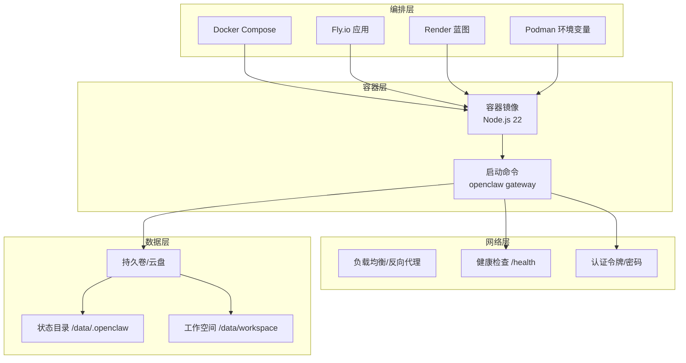
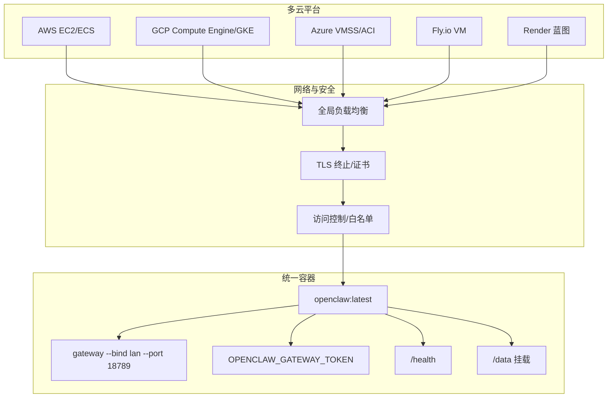
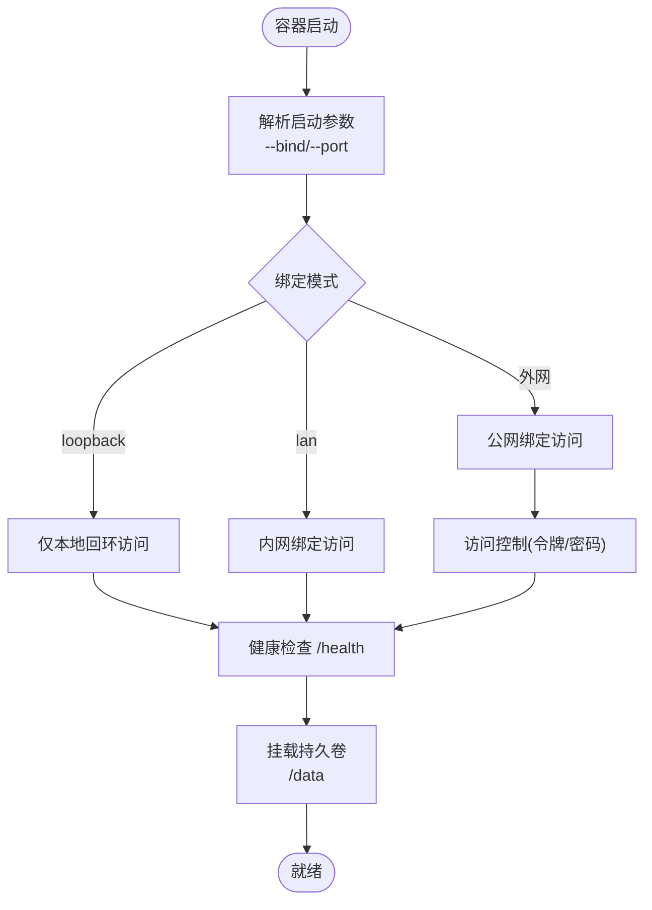
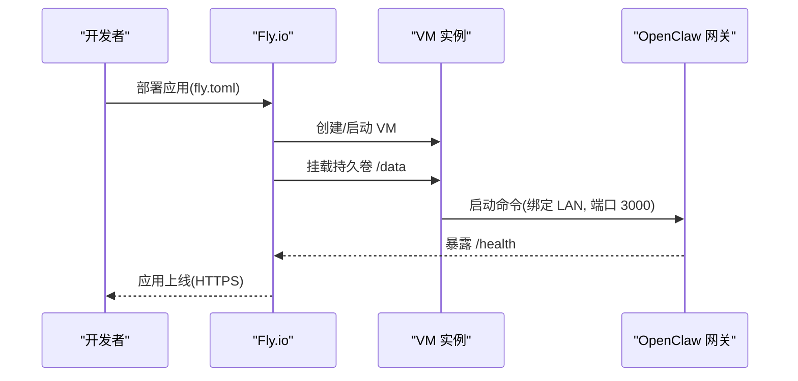
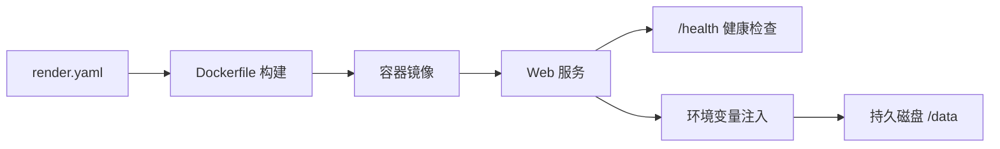
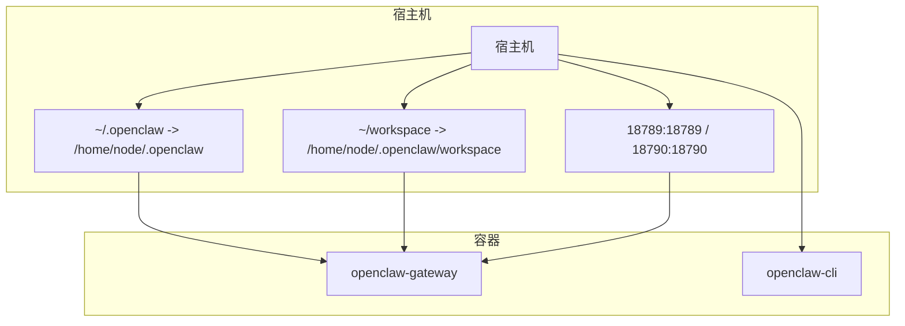
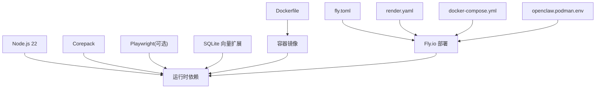

# 多云部署策略

<cite>
**本文引用的文件**
- [README.md](file://README.md)
- [Dockerfile](file://Dockerfile)
- [docker-compose.yml](file://docker-compose.yml)
- [fly.toml](file://fly.toml)
- [fly.private.toml](file://fly.private.toml)
- [render.yaml](file://render.yaml)
- [openclaw.podman.env](file://openclaw.podman.env)
- [package.json](file://package.json)
- [docs/install/render.mdx](file://docs/install/render.mdx)
</cite>

## 目录

1. [引言](#引言)
2. [项目结构](#项目结构)
3. [核心组件](#核心组件)
4. [架构总览](#架构总览)
5. [详细组件分析](#详细组件分析)
6. [依赖关系分析](#依赖关系分析)
7. [性能考量](#性能考量)
8. [故障排查指南](#故障排查指南)
9. [结论](#结论)
10. [附录](#附录)

## 引言

本指南面向需要在多个云平台进行 OpenClaw 多云部署与运营的工程团队，目标是帮助您：

- 对比主流云平台的优缺点、价格与 SLA 特性
- 基于业务需求制定平台选择标准（地理、合规、性能）
- 设计主备切换、负载分发与数据同步等多云架构模式
- 规范跨平台配置管理（环境变量标准化、密钥轮换）
- 统一监控与运维流程
- 制定灾难恢复与业务连续性计划
- 提供成本控制与资源优化的综合策略

## 项目结构

OpenClaw 提供容器化与编排化的部署基线，便于在多云环境中复用：

- 容器镜像：基于 Node.js 22 的官方镜像，内置构建与运行时能力
- 编排模板：Fly.io、Render、Docker Compose、Podman 等
- 网关暴露：支持本地回环绑定、内网绑定与健康检查端点
- 数据持久化：通过卷或云盘挂载状态目录与工作空间目录

图表来源

- [Dockerfile](file://Dockerfile#L1-L73)
- [docker-compose.yml](file://docker-compose.yml#L1-L47)
- [fly.toml](file://fly.toml#L1-L35)
- [render.yaml](file://render.yaml#L1-L22)
- [openclaw.podman.env](file://openclaw.podman.env#L1-L25)

章节来源

- [Dockerfile](file://Dockerfile#L1-L73)
- [docker-compose.yml](file://docker-compose.yml#L1-L47)
- [fly.toml](file://fly.toml#L1-L35)
- [fly.private.toml](file://fly.private.toml#L1-L40)
- [render.yaml](file://render.yaml#L1-L22)
- [openclaw.podman.env](file://openclaw.podman.env#L1-L25)

## 核心组件

- 容器镜像与构建
  - 使用 Node.js 22 官方镜像，启用 Corepack，安装 Playwright 可选浏览器以减少冷启动开销
  - 默认以非 root 用户运行，降低逃逸风险
- 网关服务
  - 默认绑定 loopback，可通过参数改为 LAN 或外网绑定；支持健康检查端点
  - 支持通过令牌或密码进行访问控制
- 数据持久化
  - 通过卷或云盘挂载状态目录与工作空间目录，确保重启与迁移后数据不丢失
- 编排与平台适配
  - Docker Compose：适合本地开发与小规模自管
  - Fly.io：全球边缘节点、VM 规格与自动扩缩容
  - Render：蓝图即基础设施，健康检查与自动重启
  - Podman：本地容器运行时，适合边缘或私有环境

章节来源

- [Dockerfile](file://Dockerfile#L1-L73)
- [fly.toml](file://fly.toml#L1-L35)
- [fly.private.toml](file://fly.private.toml#L1-L40)
- [render.yaml](file://render.yaml#L1-L22)
- [docker-compose.yml](file://docker-compose.yml#L1-L47)
- [openclaw.podman.env](file://openclaw.podman.env#L1-L25)

## 架构总览

多云部署建议采用“统一容器 + 多平台编排”的模式，结合以下关键要素：

- 统一的容器镜像与启动参数，保证一致性
- 各平台的健康检查与自动重启策略
- 认证与访问控制（令牌/密码），避免公网直连
- 数据持久化与备份策略
- 主备与跨区域冗余，实现高可用与灾备

图表来源

- [Dockerfile](file://Dockerfile#L66-L73)
- [fly.toml](file://fly.toml#L20-L26)
- [render.yaml](file://render.yaml#L6-L17)
- [docker-compose.yml](file://docker-compose.yml#L19-L28)

## 详细组件分析

### 容器与启动参数

- 容器镜像
  - 基于 Node.js 22，启用 Corepack，可选安装 Playwright 浏览器缓存
  - 非 root 用户运行，提升安全性
- 启动命令
  - 默认绑定 loopback，适合内网/隧道访问
  - 支持通过参数改为 LAN 或外网绑定，并设置端口
- 健康检查
  - Render 蓝图中定义了健康检查路径，用于自动重启异常实例

图表来源

- [Dockerfile](file://Dockerfile#L66-L73)
- [render.yaml](file://render.yaml#L6-L17)

章节来源

- [Dockerfile](file://Dockerfile#L1-L73)
- [render.yaml](file://render.yaml#L1-L22)

### Fly.io 部署配置

- 应用与区域：应用名、首选区域
- 构建：使用仓库 Dockerfile
- 环境变量：生产模式、状态目录、内存上限
- 进程：启动网关服务，绑定 LAN，端口 3000
- HTTP 服务：内部端口 3000，强制 HTTPS，保持机器运行
- VM：共享 CPU、2核、2GB 内存
- 存储：挂载持久卷 openclaw_data 到 /data

图表来源

- [fly.toml](file://fly.toml#L1-L35)

章节来源

- [fly.toml](file://fly.toml#L1-L35)
- [fly.private.toml](file://fly.private.toml#L1-L40)

### Render 蓝图配置

- 服务类型：web，Docker 运行时
- 健康检查路径：/health
- 环境变量：
  - PORT：8080
  - SETUP_PASSWORD：部署时提示输入
  - OPENCLAW_STATE_DIR：/data/.openclaw
  - OPENCLAW_WORKSPACE_DIR：/data/workspace
  - OPENCLAW_GATEWAY_TOKEN：自动生成
- 磁盘：名称 openclaw-data，挂载 /data，容量 1GB

图表来源

- [render.yaml](file://render.yaml#L1-L22)
- [docs/install/render.mdx](file://docs/install/render.mdx#L26-L75)

章节来源

- [render.yaml](file://render.yaml#L1-L22)
- [docs/install/render.mdx](file://docs/install/render.mdx#L26-L75)

### Docker Compose 本地编排

- 服务：openclaw-gateway、openclaw-cli
- 环境变量：HOME、TERM、OPENCLAW_GATEWAY_TOKEN、第三方模型密钥
- 卷：映射用户配置与工作空间到容器
- 端口：默认 18789/18790 映射到宿主机
- 命令：启动网关并指定绑定模式与端口

图表来源

- [docker-compose.yml](file://docker-compose.yml#L1-L47)

章节来源

- [docker-compose.yml](file://docker-compose.yml#L1-L47)

### Podman 环境变量

- 必填：OPENCLAW_GATEWAY_TOKEN（建议使用 openssl rand -hex 32 生成）
- 可选：Claude 会话/Cookie、本地 LLM 密钥（如 Ollama/Groq）
- 端口映射：默认 18789/18790
- 绑定模式：默认 LAN

章节来源

- [openclaw.podman.env](file://openclaw.podman.env#L1-L25)

### 平台选择标准与对比

- 地理位置与延迟
  - Fly.io：全球边缘节点，就近接入
  - Render：按区域选择，适合北美/欧洲/亚太
  - 自管平台：根据业务用户分布选择区域
- 成本与计费
  - Fly.io：VM 模式，按小时计费，适合稳定运行
  - Render：蓝图计费，starter 套餐起步，适合中小规模
  - 自管平台：按实例规格与存储计费，适合长期稳定场景
- SLA 与可用性
  - Fly.io：自动扩缩容与健康检查
  - Render：健康检查路径与自动重启
  - 自管平台：由自身运维保障
- 安全与合规
  - 默认绑定 loopback，配合隧道或内网访问
  - Fly.io 私有部署模板支持隐藏公网入口
  - 访问控制通过令牌/密码实现

章节来源

- [fly.private.toml](file://fly.private.toml#L1-L40)
- [render.yaml](file://render.yaml#L1-L22)

### 多云架构模式

- 主备切换
  - 通过全局负载均衡器将流量导向主站点；当主站点不可用时自动切换至备用站点
  - 建议使用健康检查路径与 DNS/负载均衡器联动
- 负载分发
  - 同一平台多副本横向扩展；跨平台多活部署
  - 使用反向代理或云负载均衡器进行请求分发
- 数据同步
  - 使用持久卷/云盘实现状态与工作空间的跨实例共享
  - 对于关键数据，建议引入数据库或对象存储进行备份与同步

章节来源

- [Dockerfile](file://Dockerfile#L66-L73)
- [fly.toml](file://fly.toml#L20-L26)
- [render.yaml](file://render.yaml#L6-L17)

### 跨平台配置管理最佳实践

- 环境变量标准化
  - 统一命名：OPENCLAW_GATEWAY_TOKEN、OPENCLAW_STATE_DIR、OPENCLAW_WORKSPACE_DIR、PORT
  - 平台差异：Fly.io 使用 NODE_ENV、NODE_OPTIONS；Render 使用健康检查路径；Compose 使用卷映射
- 密钥轮换
  - 使用平台提供的密钥管理服务或环境变量注入机制
  - 通过滚动更新与健康检查验证新密钥生效
- 配置注入与模板
  - 使用平台蓝图/应用配置集中管理环境变量
  - 通过 CI/CD 自动注入敏感信息，避免硬编码

章节来源

- [fly.toml](file://fly.toml#L10-L15)
- [render.yaml](file://render.yaml#L7-L17)
- [docker-compose.yml](file://docker-compose.yml#L4-L18)

### 监控与运维一致性

- 健康检查
  - Render：/health 路径
  - Fly.io：HTTP 服务健康检查与最小运行实例数
- 日志与可观测性
  - 建议统一日志采集与告警策略
  - 结合平台自带日志与外部监控系统
- 自动化运维
  - 使用 CI/CD 自动构建镜像与发布
  - 通过编排模板实现一键部署与回滚

章节来源

- [render.yaml](file://render.yaml#L6-L17)
- [fly.toml](file://fly.toml#L20-L26)

### 灾难恢复与业务连续性

- 数据备份
  - 定期备份 /data 目录（状态目录与工作空间）
  - 使用对象存储或数据库备份方案
- 故障切换
  - 通过负载均衡器与健康检查实现自动切换
  - Fly.io 私有模板支持隐藏公网入口，必要时通过隧道访问
- 业务连续性
  - 多区域部署，跨平台冗余
  - 通过令牌/密码与访问控制限制未授权访问

章节来源

- [fly.private.toml](file://fly.private.toml#L27-L31)
- [Dockerfile](file://Dockerfile#L66-L73)

### 成本控制与资源优化

- 容器镜像优化
  - 预装 Playwright 浏览器缓存，减少容器启动时间
  - 使用非 root 用户运行，降低安全加固成本
- 运行时资源
  - 设置内存上限（NODE_OPTIONS），避免 OOM
  - 合理选择 VM/实例规格，按需扩容
- 平台选择
  - Render starter 套餐适合起步；Fly.io VM 适合稳定运行
  - 自管平台适合长期稳定场景与合规要求

章节来源

- [Dockerfile](file://Dockerfile#L26-L45)
- [fly.toml](file://fly.toml#L15-L15)
- [package.json](file://package.json#L236-L238)

## 依赖关系分析

- 容器镜像依赖 Node.js 22 与 Corepack
- 运行时依赖 Playwright（可选）与 SQLite 向量扩展
- 编排依赖 Dockerfile 与各平台配置文件

图表来源

- [Dockerfile](file://Dockerfile#L1-L73)
- [fly.toml](file://fly.toml#L1-L35)
- [render.yaml](file://render.yaml#L1-L22)
- [docker-compose.yml](file://docker-compose.yml#L1-L47)
- [openclaw.podman.env](file://openclaw.podman.env#L1-L25)

章节来源

- [Dockerfile](file://Dockerfile#L1-L73)
- [package.json](file://package.json#L151-L206)

## 性能考量

- 冷启动优化：预装浏览器缓存，减少首次启动等待
- 内存管理：合理设置 NODE_OPTIONS，避免容器被杀
- 网络与绑定：默认 loopback 绑定，通过隧道或内网访问，减少公网暴露带来的延迟与安全风险

## 故障排查指南

- 健康检查失败
  - 检查 /health 路径是否可达
  - 确认环境变量与端口配置正确
- 认证失败
  - 确认 OPENCLAW_GATEWAY_TOKEN 是否正确注入
  - 如使用密码，请确认密码配置
- 数据丢失
  - 检查持久卷挂载路径与权限
  - 确认 /data 目录下状态与工作空间存在

章节来源

- [render.yaml](file://render.yaml#L6-L17)
- [fly.toml](file://fly.toml#L20-L26)
- [docker-compose.yml](file://docker-compose.yml#L11-L13)

## 结论

通过统一容器与多平台编排，OpenClaw 可在多云环境中实现一致的部署体验与运维流程。建议优先采用健康检查与令牌/密码访问控制，结合持久化存储与跨区域冗余，构建高可用、可扩展且合规的多云体系。

## 附录

- 参考文档与示例
  - Fly.io 配置参考：[fly.toml](file://fly.toml#L1-L35)、[fly.private.toml](file://fly.private.toml#L1-L40)
  - Render 蓝图参考：[render.yaml](file://render.yaml#L1-L22)、[docs/install/render.mdx](file://docs/install/render.mdx#L26-L75)
  - Docker Compose 参考：[docker-compose.yml](file://docker-compose.yml#L1-L47)
  - Podman 环境变量参考：[openclaw.podman.env](file://openclaw.podman.env#L1-L25)
  - 容器与运行时参考：[Dockerfile](file://Dockerfile#L1-L73)、[package.json](file://package.json#L151-L206)
