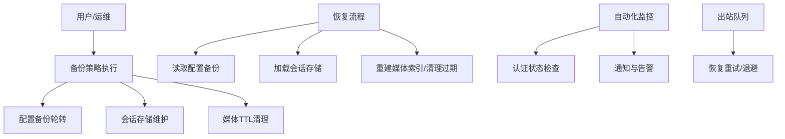
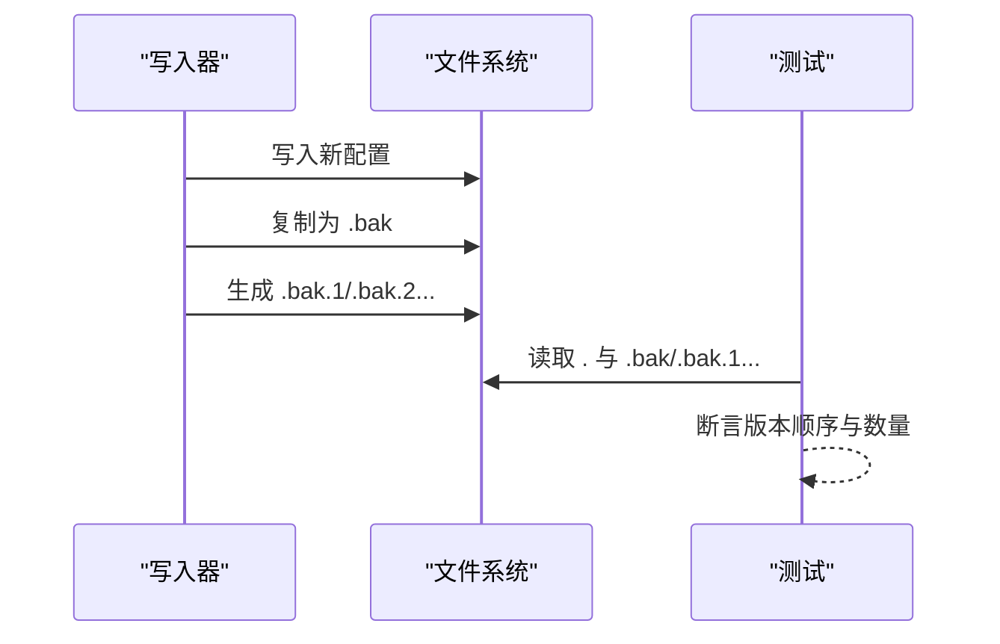
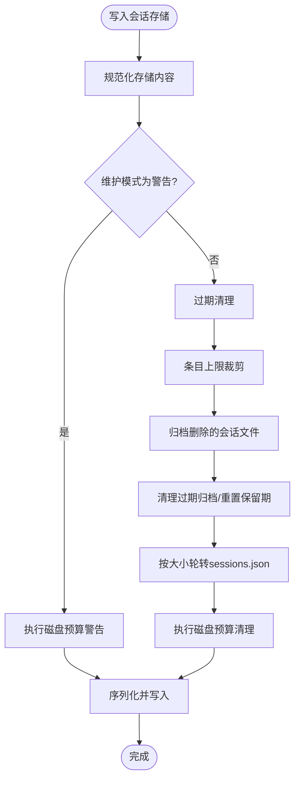
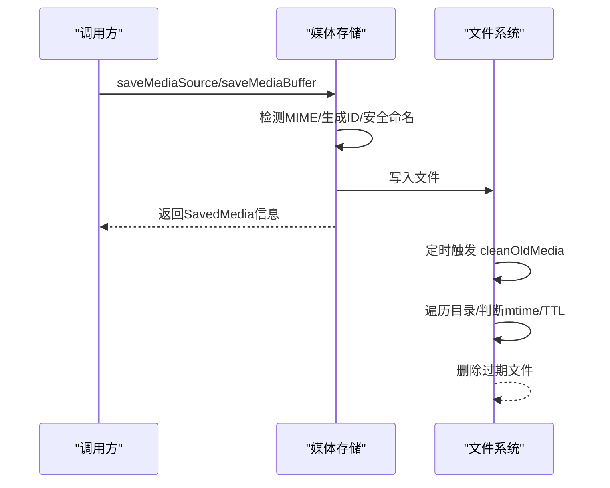
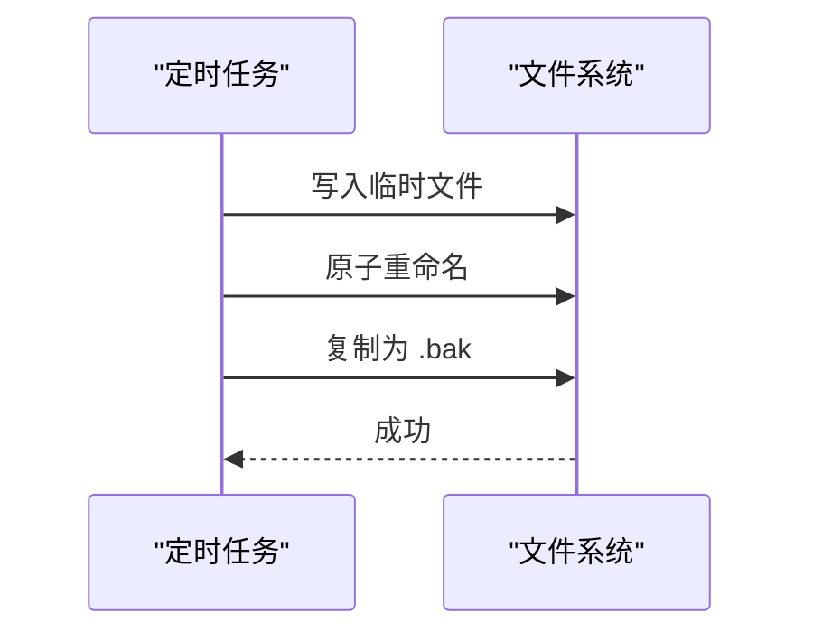
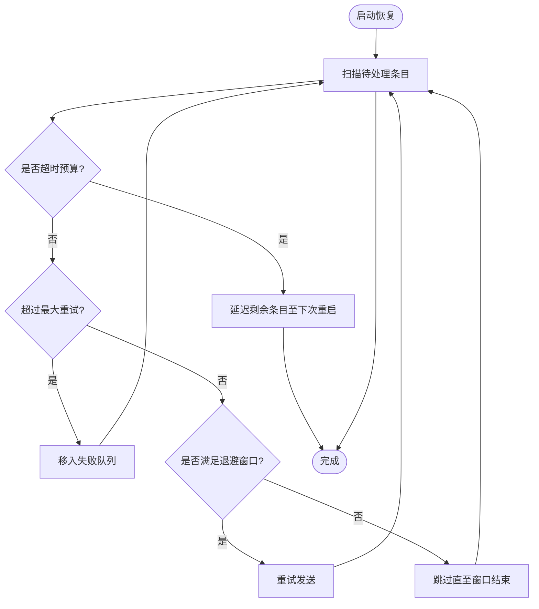
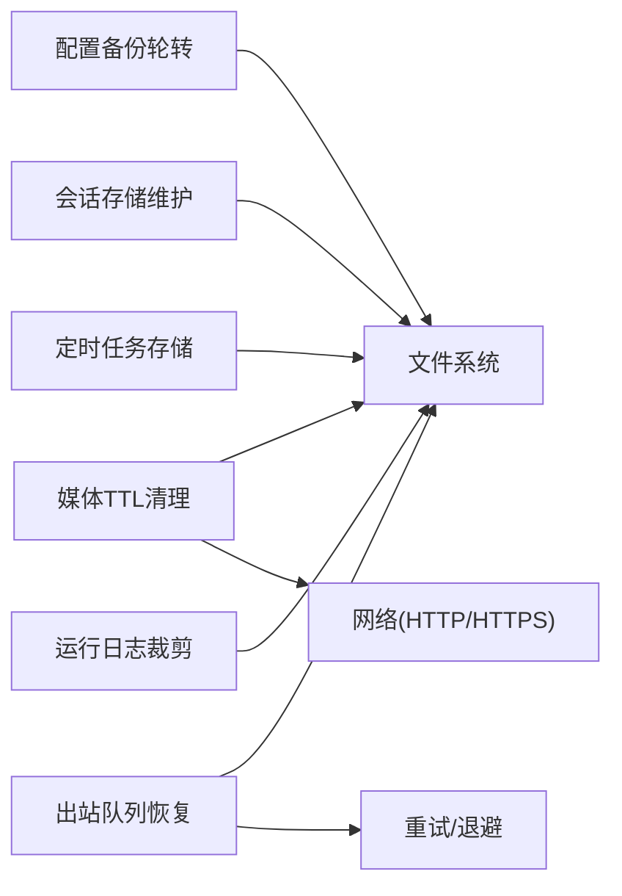

# 备份与恢复

<cite>
**本文引用的文件**
- [src/config/backup-rotation.ts](file://src/config/backup-rotation.ts)
- [src/config/config.backup-rotation.test.ts](file://src/config/config.backup-rotation.test.ts)
- [src/config/sessions/store.ts](file://src/config/sessions/store.ts)
- [src/config/sessions/disk-budget.ts](file://src/config/sessions/disk-budget.ts)
- [src/media/store.ts](file://src/media/store.ts)
- [src/media/server.ts](file://src/media/server.ts)
- [src/cron/store.ts](file://src/cron/store.ts)
- [src/cron/run-log.ts](file://src/cron/run-log.ts)
- [src/infra/outbound/delivery-queue.ts](file://src/infra/outbound/delivery-queue.ts)
- [scripts/auth-monitor.sh](file://scripts/auth-monitor.sh)
- [apps/android/app/src/main/res/xml/backup_rules.xml](file://apps/android/app/src/main/res/xml/backup_rules.xml)
- [apps/macos/Sources/OpenClaw/HealthStore.swift](file://apps/macos/Sources/OpenClaw/HealthStore.swift)
</cite>

## 目录

1. [简介](#简介)
2. [项目结构](#项目结构)
3. [核心组件](#核心组件)
4. [架构总览](#架构总览)
5. [详细组件分析](#详细组件分析)
6. [依赖关系分析](#依赖关系分析)
7. [性能考量](#性能考量)
8. [故障排查指南](#故障排查指南)
9. [结论](#结论)
10. [附录](#附录)

## 简介

本指南面向OpenClaw系统的备份与恢复，覆盖配置文件备份、会话数据备份与媒体文件备份策略，解释增量/全量/差异备份在系统中的实现方式与最佳实践，并提供自动化备份脚本、备份验证与恢复测试流程，以及灾难恢复计划、RTO/RPO目标设定、业务连续性保障、数据迁移与版本升级回滚策略，帮助关键业务系统获得可靠的数据保护方案。

## 项目结构

围绕备份与恢复的关键模块包括：

- 配置备份轮转：对配置文件进行多层级备份轮转，确保可追溯与可恢复
- 会话存储维护：定期清理过期会话、限制条目数量、按大小轮转文件
- 媒体存储与过期清理：下载/保存媒体文件，按TTL清理过期文件
- 定时任务与运行日志：定时任务持久化与日志裁剪，便于审计与恢复
- 出站消息投递队列：崩溃后自动恢复重试，结合退避策略
- 自动化监控脚本：认证状态监控与预警，保障业务连续性
- 平台侧备份规则：Android全量备份规则；macOS健康快照用于诊断

图表来源

- [src/config/backup-rotation.ts](file://src/config/backup-rotation.ts#L1-L200)
- [src/config/config.backup-rotation.test.ts](file://src/config/config.backup-rotation.test.ts#L1-L53)
- [src/config/sessions/store.ts](file://src/config/sessions/store.ts#L450-L770)
- [src/config/sessions/disk-budget.ts](file://src/config/sessions/disk-budget.ts#L50-L89)
- [src/media/store.ts](file://src/media/store.ts#L88-L124)
- [src/media/server.ts](file://src/media/server.ts#L91-L95)
- [src/cron/store.ts](file://src/cron/store.ts#L50-L62)
- [src/cron/run-log.ts](file://src/cron/run-log.ts#L112-L149)
- [src/infra/outbound/delivery-queue.ts](file://src/infra/outbound/delivery-queue.ts#L298-L330)

章节来源

- [src/config/backup-rotation.ts](file://src/config/backup-rotation.ts#L1-L200)
- [src/config/config.backup-rotation.test.ts](file://src/config/config.backup-rotation.test.ts#L1-L53)
- [src/config/sessions/store.ts](file://src/config/sessions/store.ts#L450-L770)
- [src/config/sessions/disk-budget.ts](file://src/config/sessions/disk-budget.ts#L50-L89)
- [src/media/store.ts](file://src/media/store.ts#L88-L124)
- [src/media/server.ts](file://src/media/server.ts#L91-L95)
- [src/cron/store.ts](file://src/cron/store.ts#L50-L62)
- [src/cron/run-log.ts](file://src/cron/run-log.ts#L112-L149)
- [src/infra/outbound/delivery-queue.ts](file://src/infra/outbound/delivery-queue.ts#L298-L330)

## 核心组件

- 配置备份轮转：对配置文件执行多层级备份（.bak、.bak.1、.bak.2…），最多保留固定层级，确保历史版本可回溯
- 会话存储维护：包含过期清理、条目上限控制、文件大小轮转与磁盘预算清理，避免无限增长
- 媒体存储与TTL：下载/保存媒体文件，支持从URL或本地路径导入，按TTL清理过期文件，防止磁盘膨胀
- 定时任务与运行日志：定时任务存储与运行日志裁剪，保障审计与可恢复性
- 出站队列恢复：崩溃后根据重试计数与退避窗口自动恢复重试，超过最大重试则移入失败队列
- 自动化监控：认证状态监控脚本，提前预警即将过期或已过期，避免服务中断
- 平台备份规则：Android全量备份规则；macOS健康快照辅助诊断

章节来源

- [src/config/backup-rotation.ts](file://src/config/backup-rotation.ts#L1-L200)
- [src/config/config.backup-rotation.test.ts](file://src/config/config.backup-rotation.test.ts#L1-L53)
- [src/config/sessions/store.ts](file://src/config/sessions/store.ts#L450-L770)
- [src/config/sessions/disk-budget.ts](file://src/config/sessions/disk-budget.ts#L50-L89)
- [src/media/store.ts](file://src/media/store.ts#L88-L124)
- [src/cron/store.ts](file://src/cron/store.ts#L50-L62)
- [src/cron/run-log.ts](file://src/cron/run-log.ts#L112-L149)
- [src/infra/outbound/delivery-queue.ts](file://src/infra/outbound/delivery-queue.ts#L298-L330)
- [scripts/auth-monitor.sh](file://scripts/auth-monitor.sh#L1-L90)
- [apps/android/app/src/main/res/xml/backup_rules.xml](file://apps/android/app/src/main/res/xml/backup_rules.xml#L1-L4)
- [apps/macos/Sources/OpenClaw/HealthStore.swift](file://apps/macos/Sources/OpenClaw/HealthStore.swift#L267-L301)

## 架构总览

下图展示OpenClaw备份与恢复相关组件之间的交互关系，强调数据流向与恢复路径：

图表来源

- [src/config/backup-rotation.ts](file://src/config/backup-rotation.ts#L1-L200)
- [src/config/sessions/store.ts](file://src/config/sessions/store.ts#L450-L770)
- [src/media/store.ts](file://src/media/store.ts#L88-L124)
- [src/infra/outbound/delivery-queue.ts](file://src/infra/outbound/delivery-queue.ts#L298-L330)
- [scripts/auth-monitor.sh](file://scripts/auth-monitor.sh#L1-L90)

## 详细组件分析

### 配置文件备份与轮转

- 多层级备份：写入新版本前复制当前配置为.bak，再依次生成.bak.1、.bak.2…，最多保留固定层级
- 测试验证：通过单元测试验证轮转层级与命名规则，确保最新版本与历史版本可正确读取
- 恢复流程：优先使用最新版本；若异常则回退到最近的历史版本

图表来源

- [src/config/backup-rotation.ts](file://src/config/backup-rotation.ts#L1-L200)
- [src/config/config.backup-rotation.test.ts](file://src/config/config.backup-rotation.test.ts#L1-L53)

章节来源

- [src/config/backup-rotation.ts](file://src/config/backup-rotation.ts#L1-L200)
- [src/config/config.backup-rotation.test.ts](file://src/config/config.backup-rotation.test.ts#L1-L53)

### 会话数据备份与维护

- 过期清理：基于updatedAt阈值删除陈旧会话条目
- 条目上限：按最近更新时间排序，超过上限的条目被裁剪
- 文件轮转：当sessions.json超过阈值大小时重命名为sessions.json.bak.{timestamp}，并清理旧备份
- 磁盘预算：在维护阶段执行磁盘预算清理，确保占用不超过高水位线
- 归档与清理：删除的会话文件会被归档，随后清理过期归档与重置归档保留期

图表来源

- [src/config/sessions/store.ts](file://src/config/sessions/store.ts#L450-L770)
- [src/config/sessions/disk-budget.ts](file://src/config/sessions/disk-budget.ts#L50-L89)

章节来源

- [src/config/sessions/store.ts](file://src/config/sessions/store.ts#L450-L770)
- [src/config/sessions/disk-budget.ts](file://src/config/sessions/disk-budget.ts#L50-L89)

### 媒体文件备份与TTL清理

- 下载与保存：支持从URL下载或从本地安全读取，自动检测MIME类型并生成唯一ID
- 原始文件名处理：保留原始文件名并进行跨平台安全处理，必要时嵌入UUID避免冲突
- TTL清理：定期扫描媒体目录，删除超过TTL的文件，支持子目录清理
- 服务器路由：提供媒体访问路由与错误处理，配合TTL清理保证资源回收

图表来源

- [src/media/store.ts](file://src/media/store.ts#L252-L291)
- [src/media/store.ts](file://src/media/store.ts#L293-L324)
- [src/media/store.ts](file://src/media/store.ts#L88-L124)
- [src/media/server.ts](file://src/media/server.ts#L91-L95)

章节来源

- [src/media/store.ts](file://src/media/store.ts#L252-L291)
- [src/media/store.ts](file://src/media/store.ts#L293-L324)
- [src/media/store.ts](file://src/media/store.ts#L88-L124)
- [src/media/server.ts](file://src/media/server.ts#L91-L95)

### 定时任务与运行日志

- 定时任务存储：写入采用临时文件+原子重命名，同时生成.bak备份
- 运行日志裁剪：按行数与字节上限裁剪，避免日志无限增长

图表来源

- [src/cron/store.ts](file://src/cron/store.ts#L50-L62)
- [src/cron/run-log.ts](file://src/cron/run-log.ts#L112-L149)

章节来源

- [src/cron/store.ts](file://src/cron/store.ts#L50-L62)
- [src/cron/run-log.ts](file://src/cron/run-log.ts#L112-L149)

### 出站消息投递队列恢复

- 恢复策略：崩溃重启后扫描待处理条目，根据重试次数与退避窗口决定是否重试
- 超限处理：超过最大重试次数的条目移入失败队列，避免无限重试
- 时间预算：在恢复预算耗尽时延迟至下次重启，确保系统稳定

图表来源

- [src/infra/outbound/delivery-queue.ts](file://src/infra/outbound/delivery-queue.ts#L298-L330)

章节来源

- [src/infra/outbound/delivery-queue.ts](file://src/infra/outbound/delivery-queue.ts#L298-L330)

### 自动化监控与业务连续性

- 认证状态监控：定期检查外部认证状态，临近过期或已过期时通过OpenClaw或ntfy推送告警
- 通知策略：限制通知频率，避免刷屏；支持电话与推送两种通道

```mermaid
sequenceDiagram
participant Mon as "监控脚本"
participant Ext as "外部认证"
participant OC as "OpenClaw CLI"
participant Ntfy as "ntfy.sh"
Mon->>Ext : 检查认证状态/有效期
alt 已过期
Mon->>OC : 发送告警消息
Mon->>Ntfy : 推送紧急告警
else 即将过期
Mon->>OC : 发送提醒消息
Mon->>Ntfy : 推送高优提醒
else 正常
Mon-->>Mon : 记录状态并退出
end
```

图表来源

- [scripts/auth-monitor.sh](file://scripts/auth-monitor.sh#L1-L90)

章节来源

- [scripts/auth-monitor.sh](file://scripts/auth-monitor.sh#L1-L90)

### 平台侧备份规则

- Android：启用全量备份规则，包含应用文件域下的所有内容
- macOS：健康快照用于诊断与状态描述，辅助快速定位问题

章节来源

- [apps/android/app/src/main/res/xml/backup_rules.xml](file://apps/android/app/src/main/res/xml/backup_rules.xml#L1-L4)
- [apps/macos/Sources/OpenClaw/HealthStore.swift](file://apps/macos/Sources/OpenClaw/HealthStore.swift#L267-L301)

## 依赖关系分析

- 组件耦合
  - 会话存储与磁盘预算：维护阶段依赖磁盘预算清理以控制占用
  - 媒体存储与TTL：TTL清理依赖媒体目录结构与文件时间戳
  - 定时任务与日志：运行日志裁剪依赖定时任务存储路径
  - 出站队列与恢复：恢复逻辑依赖重试计数与退避策略
- 外部依赖
  - 文件系统：所有持久化操作均依赖文件系统原子写入与权限控制
  - 网络：媒体下载依赖HTTP/HTTPS请求与主机名解析

图表来源

- [src/config/backup-rotation.ts](file://src/config/backup-rotation.ts#L1-L200)
- [src/config/sessions/store.ts](file://src/config/sessions/store.ts#L450-L770)
- [src/media/store.ts](file://src/media/store.ts#L130-L202)
- [src/cron/store.ts](file://src/cron/store.ts#L50-L62)
- [src/cron/run-log.ts](file://src/cron/run-log.ts#L112-L149)
- [src/infra/outbound/delivery-queue.ts](file://src/infra/outbound/delivery-queue.ts#L298-L330)

章节来源

- [src/config/backup-rotation.ts](file://src/config/backup-rotation.ts#L1-L200)
- [src/config/sessions/store.ts](file://src/config/sessions/store.ts#L450-L770)
- [src/media/store.ts](file://src/media/store.ts#L130-L202)
- [src/cron/store.ts](file://src/cron/store.ts#L50-L62)
- [src/cron/run-log.ts](file://src/cron/run-log.ts#L112-L149)
- [src/infra/outbound/delivery-queue.ts](file://src/infra/outbound/delivery-queue.ts#L298-L330)

## 性能考量

- 写入一致性与竞态
  - Windows平台采用临时文件+重命名的原子写入，减少并发读取空文件的风险
  - 会话存储写入前失效缓存，确保一致性
- 清理与轮转
  - TTL清理与文件轮转采用异步并行处理，降低阻塞
  - 会话存储轮转仅在超过阈值时触发，避免频繁重命名
- I/O优化
  - 媒体下载时限制最大大小与MIME嗅探缓冲区，减少内存与磁盘压力
  - 日志裁剪按行数与字节上限，避免无限增长

章节来源

- [src/config/sessions/store.ts](file://src/config/sessions/store.ts#L770-L800)
- [src/media/store.ts](file://src/media/store.ts#L130-L202)
- [src/cron/run-log.ts](file://src/cron/run-log.ts#L112-L149)

## 故障排查指南

- 配置备份异常
  - 症状：无法读取历史版本或层级过多
  - 排查：确认轮转函数是否正确生成.bak与.bak.N；检查测试用例断言
- 会话存储损坏
  - 症状：加载为空或解析失败
  - 排查：Windows平台可能遇到中间态文件，检查临时文件+重命名流程；查看缓存失效逻辑
- 媒体文件缺失或过期
  - 症状：媒体无法访问或被清理
  - 排查：确认TTL设置与清理周期；检查原始文件名处理与扩展名推断
- 定时任务丢失
  - 症状：任务未执行或重复执行
  - 排查：检查原子写入与.bak备份；核对裁剪策略
- 出站消息积压
  - 症状：消息长时间未送达
  - 排查：检查重试计数与退避窗口；确认失败队列迁移

章节来源

- [src/config/config.backup-rotation.test.ts](file://src/config/config.backup-rotation.test.ts#L1-L53)
- [src/config/sessions/store.ts](file://src/config/sessions/store.ts#L215-L247)
- [src/media/store.ts](file://src/media/store.ts#L88-L124)
- [src/cron/store.ts](file://src/cron/store.ts#L50-L62)
- [src/infra/outbound/delivery-queue.ts](file://src/infra/outbound/delivery-queue.ts#L298-L330)

## 结论

OpenClaw在配置、会话与媒体三大数据域建立了完善的备份与恢复机制：多层级配置轮转、会话存储维护与文件轮转、媒体TTL清理与服务器路由、定时任务与日志裁剪、出站队列恢复重试与退避策略，辅以认证状态监控脚本与平台侧备份规则，形成从数据采集到恢复验证的闭环。建议结合RTO/RPO目标制定自动化备份与演练计划，持续优化磁盘预算与清理策略，确保业务连续性与数据安全。

## 附录

- RTO/RPO目标建议
  - RTO：关键业务消息投递与会话恢复应在分钟级；配置与媒体恢复可在小时级
  - RPO：配置与会话应尽可能接近实时；媒体可接受一定延迟
- 自动化备份脚本
  - 参考：认证状态监控脚本，支持定时执行与通知通道配置
- 恢复测试流程
  - 验证配置轮转层级与读取顺序
  - 验证会话存储维护与文件轮转
  - 验证媒体TTL清理与访问
  - 验证定时任务与日志裁剪
  - 验证出站队列恢复与失败队列迁移

章节来源

- [scripts/auth-monitor.sh](file://scripts/auth-monitor.sh#L1-L90)
- [src/config/config.backup-rotation.test.ts](file://src/config/config.backup-rotation.test.ts#L1-L53)
- [src/config/sessions/store.ts](file://src/config/sessions/store.ts#L450-L770)
- [src/media/store.ts](file://src/media/store.ts#L88-L124)
- [src/cron/store.ts](file://src/cron/store.ts#L50-L62)
- [src/cron/run-log.ts](file://src/cron/run-log.ts#L112-L149)
- [src/infra/outbound/delivery-queue.ts](file://src/infra/outbound/delivery-queue.ts#L298-L330)
