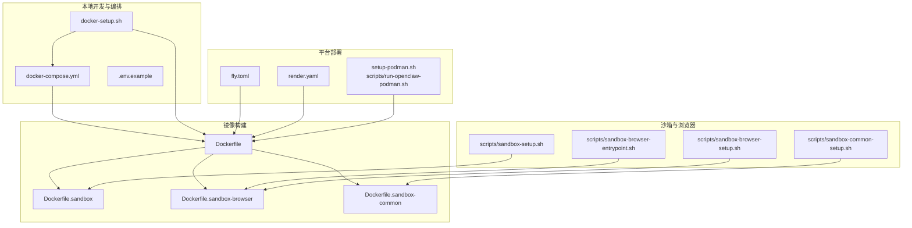
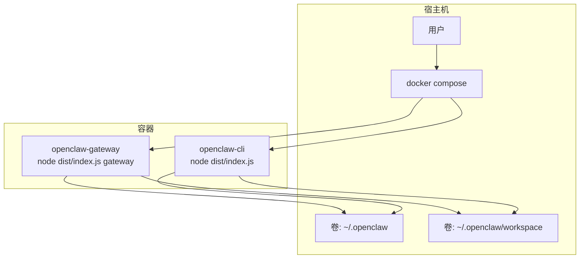
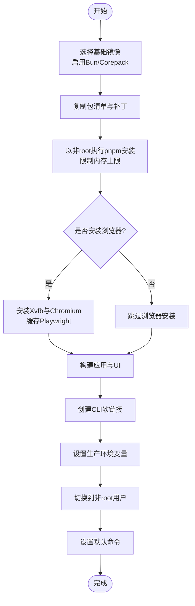
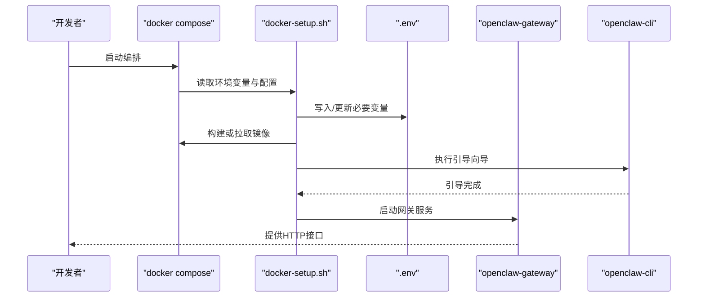
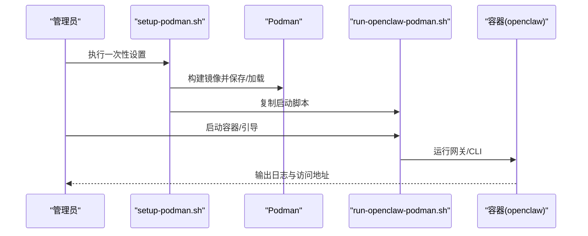
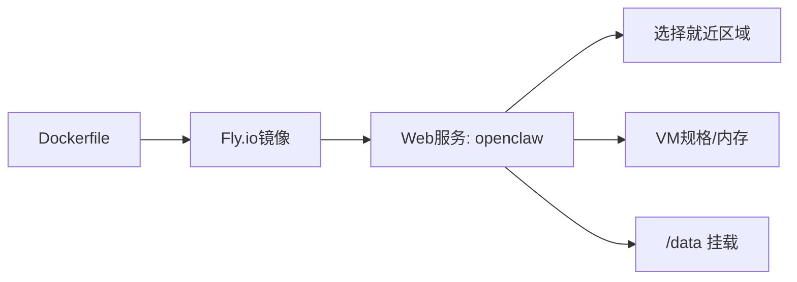
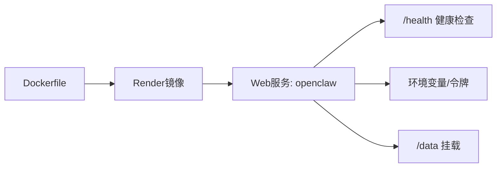
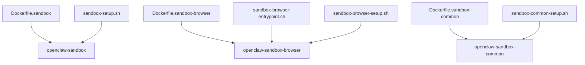
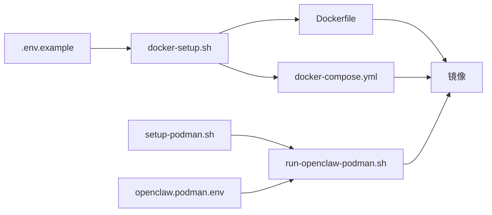

# 容器化部署

<cite>
**本文引用的文件**
- [Dockerfile](file://Dockerfile)
- [Dockerfile.sandbox](file://Dockerfile.sandbox)
- [Dockerfile.sandbox-browser](file://Dockerfile.sandbox-browser)
- [Dockerfile.sandbox-common](file://Dockerfile.sandbox-common)
- [docker-compose.yml](file://docker-compose.yml)
- [.env.example](file://.env.example)
- [docker-setup.sh](file://docker-setup.sh)
- [setup-podman.sh](file://setup-podman.sh)
- [scripts/run-openclaw-podman.sh](file://scripts/run-openclaw-podman.sh)
- [scripts/sandbox-browser-entrypoint.sh](file://scripts/sandbox-browser-entrypoint.sh)
- [scripts/sandbox-browser-setup.sh](file://scripts/sandbox-browser-setup.sh)
- [scripts/sandbox-common-setup.sh](file://scripts/sandbox-common-setup.sh)
- [scripts/sandbox-setup.sh](file://scripts/sandbox-setup.sh)
- [fly.toml](file://fly.toml)
- [render.yaml](file://render.yaml)
- [openclaw.podman.env](file://openclaw.podman.env)
</cite>

## 目录

1. [简介](#简介)
2. [项目结构](#项目结构)
3. [核心组件](#核心组件)
4. [架构总览](#架构总览)
5. [详细组件分析](#详细组件分析)
6. [依赖关系分析](#依赖关系分析)
7. [性能与资源优化](#性能与资源优化)
8. [故障排查指南](#故障排查指南)
9. [结论](#结论)
10. [附录](#附录)

## 简介

本指南面向DevOps团队与运维工程师，提供OpenClaw在容器平台上的完整部署方案，覆盖以下要点：

- Docker镜像构建流程与多阶段优化
- 安全加固与非root运行
- docker-compose编排、环境变量与卷挂载策略
- 不同容器平台（Docker、Fly.io、Render、Podman）的部署示例
- 容器安全最佳实践、资源限制与健康检查
- 浏览器自动化沙箱配置与性能优化
- 可靠的容器化交付与运维建议

## 项目结构

OpenClaw仓库中与容器化直接相关的文件主要集中在根目录与scripts目录下，包括：

- 镜像构建：Dockerfile及沙箱相关Dockerfile
- 编排与启动：docker-compose.yml、docker-setup.sh、setup-podman.sh、scripts/run-openclaw-podman.sh
- 平台配置：fly.toml（Fly.io）、render.yaml（Render）
- 环境模板：.env.example、openclaw.podman.env
- 沙箱浏览器入口脚本：scripts/sandbox-browser-entrypoint.sh

图表来源

- [docker-compose.yml](file://docker-compose.yml#L1-L47)
- [docker-setup.sh](file://docker-setup.sh#L1-L380)
- [Dockerfile](file://Dockerfile#L1-L73)
- [Dockerfile.sandbox](file://Dockerfile.sandbox#L1-L21)
- [Dockerfile.sandbox-browser](file://Dockerfile.sandbox-browser#L1-L33)
- [Dockerfile.sandbox-common](file://Dockerfile.sandbox-common#L1-L46)
- [fly.toml](file://fly.toml#L1-L35)
- [render.yaml](file://render.yaml#L1-L22)
- [setup-podman.sh](file://setup-podman.sh#L1-L252)
- [scripts/run-openclaw-podman.sh](file://scripts/run-openclaw-podman.sh#L1-L214)
- [scripts/sandbox-browser-entrypoint.sh](file://scripts/sandbox-browser-entrypoint.sh#L1-L89)
- [scripts/sandbox-browser-setup.sh](file://scripts/sandbox-browser-setup.sh#L1-L8)
- [scripts/sandbox-common-setup.sh](file://scripts/sandbox-common-setup.sh#L1-L41)
- [scripts/sandbox-setup.sh](file://scripts/sandbox-setup.sh#L1-L8)

章节来源

- [docker-compose.yml](file://docker-compose.yml#L1-L47)
- [docker-setup.sh](file://docker-setup.sh#L1-L380)
- [Dockerfile](file://Dockerfile#L1-L73)

## 核心组件

- 基础网关镜像（Dockerfile）：基于Node官方镜像，启用Bun与Corepack，支持可选安装Chromium与Xvfb以加速浏览器自动化；默认以非root用户运行，暴露网关端口并提供命令入口。
- 沙箱基础镜像（Dockerfile.sandbox）：最小化Debian Slim，预装常用工具与Python3，创建sandbox用户，适合作为Agent沙箱运行的基础。
- 浏览器沙箱镜像（Dockerfile.sandbox-browser）：在沙箱基础上安装Chromium、Xvfb、novnc、x11vnc等，提供Chromium远程调试端口与VNC/HTML5 VNC访问能力。
- 沙箱通用镜像（Dockerfile.sandbox-common）：通过ARG参数注入包列表、包管理器与工具链，支持安装pnpm、bun、Linuxbrew，最终切换到指定用户。
- 编排与启动（docker-compose.yml + docker-setup.sh）：定义服务、端口映射、卷挂载与环境变量；docker-setup.sh负责生成/更新.env、构建或拉取镜像、执行引导向导、设置控制面板允许来源等。
- 平台部署（fly.toml、render.yaml）：Fly.io与Render的容器部署配置，含健康检查路径、磁盘挂载、进程与内存限制。
- Podman部署（setup-podman.sh + scripts/run-openclaw-podman.sh）：为Rootless Podman创建专用用户、构建镜像、加载到目标用户命名空间，并提供启动脚本与可选systemd Quadlet。

章节来源

- [Dockerfile](file://Dockerfile#L1-L73)
- [Dockerfile.sandbox](file://Dockerfile.sandbox#L1-L21)
- [Dockerfile.sandbox-browser](file://Dockerfile.sandbox-browser#L1-L33)
- [Dockerfile.sandbox-common](file://Dockerfile.sandbox-common#L1-L46)
- [docker-compose.yml](file://docker-compose.yml#L1-L47)
- [docker-setup.sh](file://docker-setup.sh#L1-L380)
- [fly.toml](file://fly.toml#L1-L35)
- [render.yaml](file://render.yaml#L1-L22)
- [setup-podman.sh](file://setup-podman.sh#L1-L252)
- [scripts/run-openclaw-podman.sh](file://scripts/run-openclaw-podman.sh#L1-L214)

## 架构总览

OpenClaw容器化部署采用“单镜像双服务”的编排模式：

- openclaw-gateway：运行网关进程，绑定LAN或回环，暴露网关与桥接端口，持久化配置与工作区。
- openclaw-cli：交互式CLI容器，复用相同镜像，挂载相同卷，用于首次引导、配置管理与诊断。

图表来源

- [docker-compose.yml](file://docker-compose.yml#L1-L47)

章节来源

- [docker-compose.yml](file://docker-compose.yml#L1-L47)

## 详细组件分析

### Docker镜像构建与多阶段优化

- 基础层：使用Node官方镜像，启用Bun与Corepack，确保构建工具链可用。
- 依赖安装：以非root用户执行pnpm安装，降低OOM风险；可选安装Chromium与Xvfb，避免容器启动时重复下载Playwright二进制。
- 构建与产物：执行应用构建与UI构建，导出CLI可执行链接，设置生产环境变量。
- 运行安全：切换到非root用户，减少逃逸风险；默认仅监听回环地址，如需外部访问需显式配置。

图表来源

- [Dockerfile](file://Dockerfile#L1-L73)

章节来源

- [Dockerfile](file://Dockerfile#L1-L73)

### docker-compose编排与环境变量

- 服务定义：openclaw-gateway与openclaw-cli共享镜像，分别设置命令与入口点。
- 环境变量：HOME、TERM、网关认证令牌与各渠道/提供商密钥等。
- 卷挂载：将配置目录与工作区目录挂载到容器内固定路径，便于持久化与跨平台兼容。
- 端口映射：默认映射网关与桥接端口，可通过环境变量覆盖。
- 初始化与重启策略：启用init与unless-stopped，提升稳定性。

图表来源

- [docker-compose.yml](file://docker-compose.yml#L1-L47)
- [docker-setup.sh](file://docker-setup.sh#L1-L380)

章节来源

- [docker-compose.yml](file://docker-compose.yml#L1-L47)
- [docker-setup.sh](file://docker-setup.sh#L1-L380)
- [.env.example](file://.env.example#L1-L81)

### Podman部署与用户隔离

- 一次性设置：创建专用用户、生成/写入.env、构建镜像并加载到目标用户命名空间。
- 启动脚本：run-openclaw-podman.sh负责解析HOME、端口、绑定模式、用户命名空间参数，以及首次引导与日志输出。
- 可选systemd Quadlet：为用户服务自动启停提供systemd集成。

图表来源

- [setup-podman.sh](file://setup-podman.sh#L1-L252)
- [scripts/run-openclaw-podman.sh](file://scripts/run-openclaw-podman.sh#L1-L214)

章节来源

- [setup-podman.sh](file://setup-podman.sh#L1-L252)
- [scripts/run-openclaw-podman.sh](file://scripts/run-openclaw-podman.sh#L1-L214)
- [openclaw.podman.env](file://openclaw.podman.env#L1-L25)

### 平台部署示例

#### Fly.io（容器即服务）

- 使用Dockerfile构建镜像，设置进程为网关命令，启用健康检查与持久化磁盘挂载至/data。
- 调整区域、VM规格与内存，确保长连接稳定运行。

图表来源

- [fly.toml](file://fly.toml#L1-L35)

章节来源

- [fly.toml](file://fly.toml#L1-L35)

#### Render（容器即服务）

- 定义Web服务类型，设置健康检查路径、环境变量（含自动生成的令牌）、磁盘挂载与大小。
- 将状态目录与工作区目录指向挂载路径，保障数据持久化。

图表来源

- [render.yaml](file://render.yaml#L1-L22)

章节来源

- [render.yaml](file://render.yaml#L1-L22)

### 浏览器自动化沙箱

- 沙箱基础镜像：最小Debian Slim，预装常用工具与Python3。
- 浏览器沙箱镜像：安装Chromium、Xvfb、novnc、x11vnc、socat，提供Chromium远程调试端口与VNC/HTML5 VNC访问。
- 入口脚本：设置DISPLAY、用户数据目录、远程调试端口、可选无沙箱模式、VNC密码与端口映射，等待子进程退出。
- 构建脚本：提供一键构建脚本，便于快速生成镜像。

图表来源

- [Dockerfile.sandbox](file://Dockerfile.sandbox#L1-L21)
- [Dockerfile.sandbox-browser](file://Dockerfile.sandbox-browser#L1-L33)
- [Dockerfile.sandbox-common](file://Dockerfile.sandbox-common#L1-L46)
- [scripts/sandbox-browser-entrypoint.sh](file://scripts/sandbox-browser-entrypoint.sh#L1-L89)
- [scripts/sandbox-browser-setup.sh](file://scripts/sandbox-browser-setup.sh#L1-L8)
- [scripts/sandbox-common-setup.sh](file://scripts/sandbox-common-setup.sh#L1-L41)
- [scripts/sandbox-setup.sh](file://scripts/sandbox-setup.sh#L1-L8)

章节来源

- [Dockerfile.sandbox](file://Dockerfile.sandbox#L1-L21)
- [Dockerfile.sandbox-browser](file://Dockerfile.sandbox-browser#L1-L33)
- [Dockerfile.sandbox-common](file://Dockerfile.sandbox-common#L1-L46)
- [scripts/sandbox-browser-entrypoint.sh](file://scripts/sandbox-browser-entrypoint.sh#L1-L89)
- [scripts/sandbox-browser-setup.sh](file://scripts/sandbox-browser-setup.sh#L1-L8)
- [scripts/sandbox-common-setup.sh](file://scripts/sandbox-common-setup.sh#L1-L41)
- [scripts/sandbox-setup.sh](file://scripts/sandbox-setup.sh#L1-L8)

## 依赖关系分析

- 组件耦合：docker-compose.yml依赖Dockerfile构建的镜像；docker-setup.sh负责镜像生命周期与环境准备；Podman路径依赖setup-podman.sh与run脚本。
- 外部依赖：Docker、Docker Compose、Podman（可选），以及可选的openssl/python3/od等生成令牌工具。
- 环境变量来源：优先级遵循.env示例中的说明，支持进程环境、项目.env与全局配置文件。

图表来源

- [Dockerfile](file://Dockerfile#L1-L73)
- [docker-compose.yml](file://docker-compose.yml#L1-L47)
- [docker-setup.sh](file://docker-setup.sh#L1-L380)
- [setup-podman.sh](file://setup-podman.sh#L1-L252)
- [scripts/run-openclaw-podman.sh](file://scripts/run-openclaw-podman.sh#L1-L214)
- [.env.example](file://.env.example#L1-L81)
- [openclaw.podman.env](file://openclaw.podman.env#L1-L25)

章节来源

- [docker-compose.yml](file://docker-compose.yml#L1-L47)
- [docker-setup.sh](file://docker-setup.sh#L1-L380)
- [setup-podman.sh](file://setup-podman.sh#L1-L252)
- [scripts/run-openclaw-podman.sh](file://scripts/run-openclaw-podman.sh#L1-L214)
- [.env.example](file://.env.example#L1-L81)
- [openclaw.podman.env](file://openclaw.podman.env#L1-L25)

## 性能与资源优化

- 构建期内存限制：在pnpm安装阶段设置最大堆大小，避免小规格CI/VM上OOM失败。
- 浏览器自动化预热：通过构建参数安装Chromium与Xvfb，缓存Playwright二进制，显著缩短容器启动时间。
- 运行期内存上限：Fly.io配置了NODE_OPTIONS以限制内存，避免突发负载导致被系统回收。
- 端口与网络：默认回环绑定，外部访问需显式配置绑定模式与控制面板允许来源，减少不必要的暴露面。
- 持久化卷：将状态目录与工作区目录挂载到宿主机或云盘，避免数据丢失并提升I/O稳定性。

章节来源

- [Dockerfile](file://Dockerfile#L25-L52)
- [fly.toml](file://fly.toml#L10-L16)

## 故障排查指南

- 网关无法访问或跨域问题：若绑定LAN，请确保已设置控制面板允许来源，docker-setup.sh会自动处理。
- 端口冲突：通过环境变量覆盖默认端口映射，确保宿主机端口未被占用。
- 权限与卷挂载：确认宿主机目录存在且权限正确；Podman场景下注意用户命名空间与UID/GID匹配。
- 令牌缺失：docker-setup.sh会尝试从配置读取或生成新令牌；Podman场景下run脚本也会生成并写入.env。
- 浏览器沙箱：检查Chromium远程调试端口、VNC端口与NOVNC端口映射，确认防火墙放行。

章节来源

- [docker-setup.sh](file://docker-setup.sh#L71-L93)
- [docker-setup.sh](file://docker-setup.sh#L171-L186)
- [scripts/run-openclaw-podman.sh](file://scripts/run-openclaw-podman.sh#L143-L148)
- [scripts/sandbox-browser-entrypoint.sh](file://scripts/sandbox-browser-entrypoint.sh#L9-L16)
- [scripts/sandbox-browser-entrypoint.sh](file://scripts/sandbox-browser-entrypoint.sh#L31-L35)

## 结论

通过统一的Dockerfile与编排脚本，OpenClaw实现了从本地开发到多平台部署的一致化容器化方案。结合安全加固、资源限制与浏览器自动化优化，可为DevOps团队提供稳定可靠的交付基线。建议在生产环境中：

- 明确绑定模式与鉴权策略，严格控制暴露面
- 使用持久化卷与平台磁盘，定期备份状态目录
- 在CI中缓存依赖与浏览器二进制，缩短构建时间
- 利用健康检查与日志聚合，持续监控服务可用性

## 附录

### 环境变量一览（节选）

- 网关鉴权与路径：OPENCLAW_GATEWAY_TOKEN、OPENCLAW_GATEWAY_PASSWORD、OPENCLAW_STATE_DIR、OPENCLAW_CONFIG_PATH、OPENCLAW_HOME
- 模型提供商API密钥：OPENAI_API_KEY、ANTHROPIC_API_KEY、GEMINI_API_KEY等
- 渠道令牌：TELEGRAM_BOT_TOKEN、DISCORD_BOT_TOKEN、SLACK_BOT_TOKEN等
- 工具与媒体：BRAVE_API_KEY、PERPLEXITY_API_KEY、FIRECRAWL_API_KEY、ELEVENLABS_API_KEY、XI_API_KEY、DEEPGRAM_API_KEY
- Podman相关：OPENCLAW_PODMAN_GATEWAY_HOST_PORT、OPENCLAW_PODMAN_BRIDGE_HOST_PORT、OPENCLAW_GATEWAY_BIND等

章节来源

- [.env.example](file://.env.example#L17-L81)
- [openclaw.podman.env](file://openclaw.podman.env#L6-L25)
