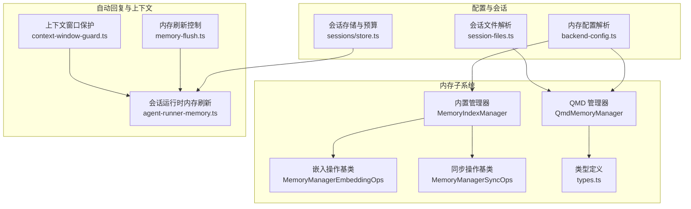
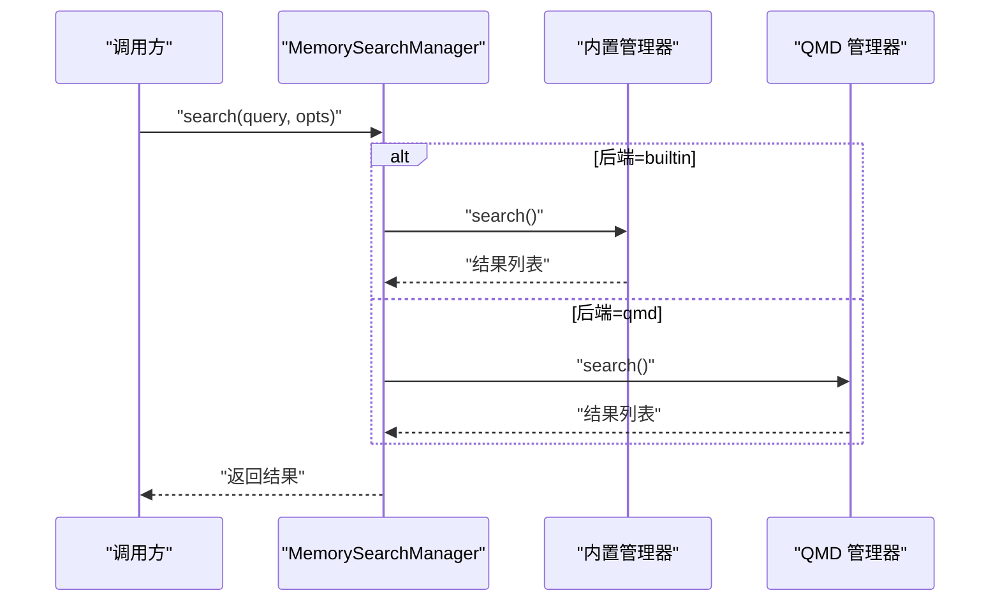
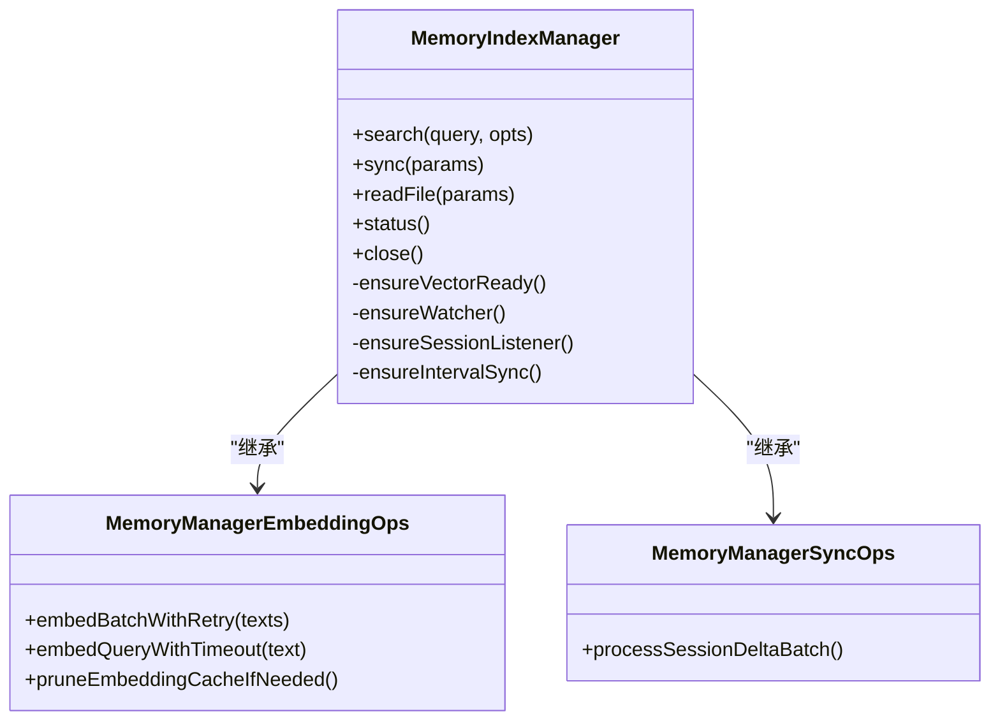
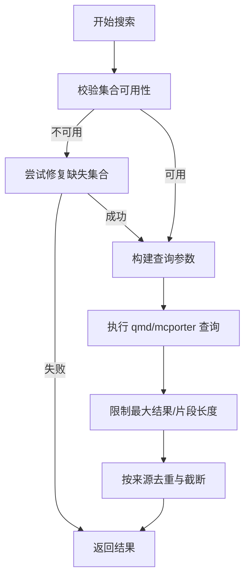
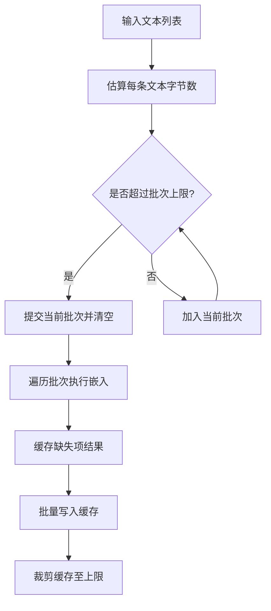
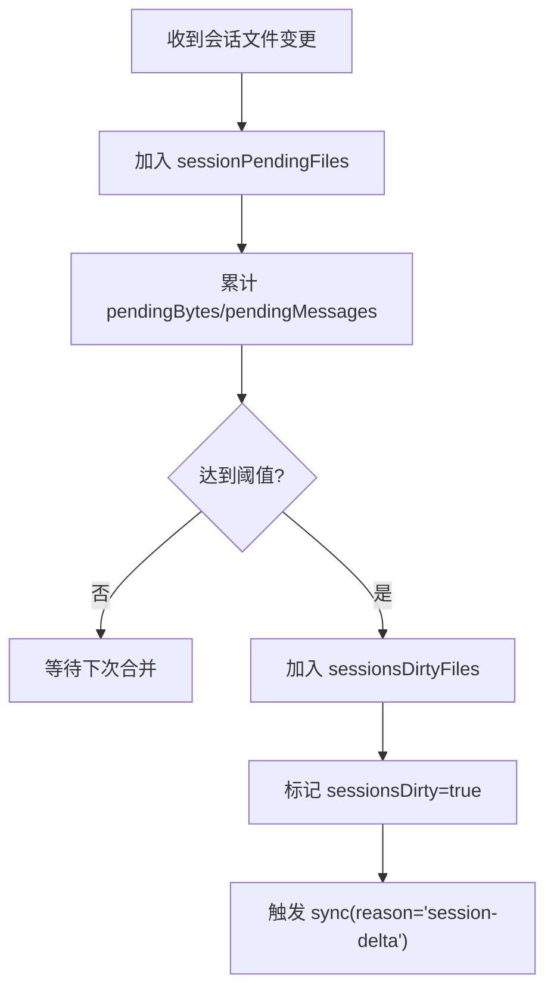
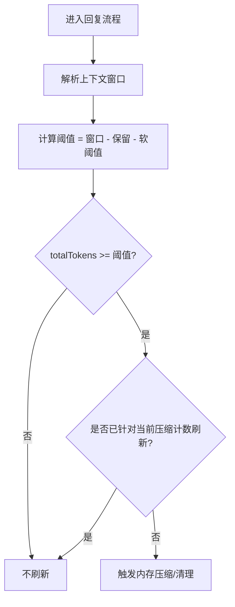
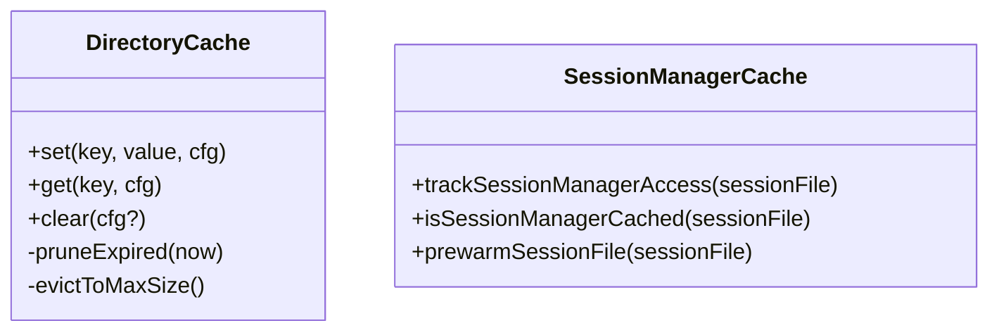
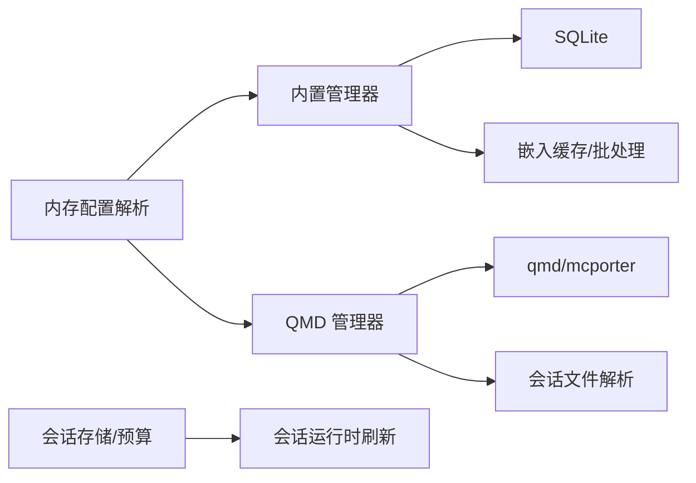

# 内存使用优化

<cite>
**本文引用的文件**
- [src/memory/manager.ts](file://src/memory/manager.ts)
- [src/memory/manager-embedding-ops.ts](file://src/memory/manager-embedding-ops.ts)
- [src/memory/manager-sync-ops.ts](file://src/memory/manager-sync-ops.ts)
- [src/memory/qmd-manager.ts](file://src/memory/qmd-manager.ts)
- [src/memory/backend-config.ts](file://src/memory/backend-config.ts)
- [src/memory/types.ts](file://src/memory/types.ts)
- [src/memory/session-files.ts](file://src/memory/session-files.ts)
- [src/config/types.memory.ts](file://src/config/types.memory.ts)
- [src/auto-reply/reply/agent-runner-memory.ts](file://src/auto-reply/reply/agent-runner-memory.ts)
- [src/auto-reply/reply/memory-flush.ts](file://src/auto-reply/reply/memory-flush.ts)
- [src/agents/context-window-guard.ts](file://src/agents/context-window-guard.ts)
- [src/agents/pi-embedded-runner/compaction-safety-timeout.ts](file://src/agents/pi-embedded-runner/compaction-safety-timeout.ts)
- [src/infra/outbound/directory-cache.ts](file://src/infra/outbound/directory-cache.ts)
- [src/agents/pi-embedded-runner/session-manager-cache.ts](file://src/agents/pi-embedded-runner/session-manager-cache.ts)
- [src/config/sessions/store.ts](file://src/config/sessions/store.ts)
- [src/cli/memory-cli.ts](file://src/cli/memory-cli.ts)
</cite>

## 目录

1. [引言](#引言)
2. [项目结构](#项目结构)
3. [核心组件](#核心组件)
4. [架构总览](#架构总览)
5. [详细组件分析](#详细组件分析)
6. [依赖关系分析](#依赖关系分析)
7. [性能考量](#性能考量)
8. [故障排查指南](#故障排查指南)
9. [结论](#结论)
10. [附录：内存配置参数与调优建议](#附录内存配置参数与调优建议)

## 引言

本指南聚焦于 OpenClaw 的内存使用优化，围绕“内存池管理、对象复用、垃圾回收优化”三大主题，系统阐述会话内存管理、代理状态存储、消息缓冲区优化、缓存策略、内存映射文件使用以及大对象处理技术，并提供可操作的内存配置参数调整与性能对比思路，帮助在高并发场景下实现稳定、低峰值、可预测的内存占用。

## 项目结构

OpenClaw 的内存子系统由两类后端构成：

- 内置后端（builtin）：基于 SQLite 的向量/全文索引、嵌入缓存与批处理队列，支持增量同步与会话监听。
- QMD 后端（qmd）：通过外部 qmd 工具构建索引，支持 mcporter 管道加速与集合管理，具备会话导出能力。

图表来源

- [src/memory/manager.ts](file://src/memory/manager.ts#L43-L189)
- [src/memory/manager-embedding-ops.ts](file://src/memory/manager-embedding-ops.ts#L43-L80)
- [src/memory/manager-sync-ops.ts](file://src/memory/manager-sync-ops.ts#L1-L50)
- [src/memory/qmd-manager.ts](file://src/memory/qmd-manager.ts#L141-L242)
- [src/memory/backend-config.ts](file://src/memory/backend-config.ts#L297-L354)
- [src/memory/types.ts](file://src/memory/types.ts#L61-L81)
- [src/memory/session-files.ts](file://src/memory/session-files.ts#L74-L132)
- [src/config/sessions/store.ts](file://src/config/sessions/store.ts#L1-L35)

章节来源

- [src/memory/manager.ts](file://src/memory/manager.ts#L1-L120)
- [src/memory/qmd-manager.ts](file://src/memory/qmd-manager.ts#L141-L242)
- [src/memory/backend-config.ts](file://src/memory/backend-config.ts#L297-L354)

## 核心组件

- 内置管理器（MemoryIndexManager）
  - 负责向量/全文索引、嵌入缓存、批处理队列、增量同步、会话监听与定时任务。
  - 关键特性：索引缓存（进程内 Map）、嵌入缓存（SQLite 表）、批处理失败熔断、超时与重试。
- QMD 管理器（QmdMemoryManager）
  - 通过外部 qmd/mcporter 构建索引，支持集合管理、会话导出、缺失集合修复、空字节错误自愈。
  - 关键特性：集合绑定与迁移、命令超时控制、输出大小限制、嵌入队列串行化。
- 嵌入操作基类（MemoryManagerEmbeddingOps）
  - 提供嵌入批次构建、缓存读写、批处理执行与回退、超时包装、失败计数与熔断。
- 同步操作基类（MemoryManagerSyncOps）
  - 提供会话增量阈值判断、批量同步触发、脏页与待同步集合维护。
- 类型与配置
  - types.ts 定义搜索结果、状态、进度等接口；backend-config.ts 解析内存后端配置与默认值；types.memory.ts 定义配置项。

章节来源

- [src/memory/manager.ts](file://src/memory/manager.ts#L43-L189)
- [src/memory/manager-embedding-ops.ts](file://src/memory/manager-embedding-ops.ts#L43-L80)
- [src/memory/manager-sync-ops.ts](file://src/memory/manager-sync-ops.ts#L429-L465)
- [src/memory/types.ts](file://src/memory/types.ts#L1-L81)
- [src/memory/backend-config.ts](file://src/memory/backend-config.ts#L1-L120)

## 架构总览

内置与 QMD 两大路径在“搜索/读取/状态/同步”层面统一抽象为 MemorySearchManager 接口，便于按需切换后端。内置路径以 SQLite 为中心，QMD 路径以外部工具为中心，二者均通过会话文件与会话存储进行上下文联动。

图表来源

- [src/memory/types.ts](file://src/memory/types.ts#L61-L81)
- [src/memory/manager.ts](file://src/memory/manager.ts#L207-L293)
- [src/memory/qmd-manager.ts](file://src/memory/qmd-manager.ts#L608-L745)

## 详细组件分析

### 组件A：内置内存管理器（MemoryIndexManager）

- 内存池与对象复用
  - 进程级索引缓存（INDEX_CACHE Map），避免重复初始化。
  - 嵌入缓存（SQLite 表 embedding_cache），按 provider/model/provider_key 分组，支持分批查询与上限裁剪。
  - 批处理失败熔断（batchFailureCount/BATCH_FAILURE_LIMIT），超过阈值禁用批处理并回退到逐条嵌入。
- 垃圾回收优化
  - 嵌入缓存按更新时间裁剪至 maxEntries。
  - 搜索前根据 dirty/sessionsDirty 触发增量同步，减少全量重建。
- 会话内存管理
  - 会话监听与增量阈值（pendingBytes/pendingMessages），批量触发同步。
  - warmSession 在会话开始时预热索引，降低首次查询延迟。
- 消息缓冲区优化
  - 搜索结果片段长度限制（SNIPPET_MAX_CHARS），避免单条结果过大。
  - 合并混合检索结果时去重与按分数排序，减少中间对象数量。

图表来源

- [src/memory/manager.ts](file://src/memory/manager.ts#L43-L189)
- [src/memory/manager-embedding-ops.ts](file://src/memory/manager-embedding-ops.ts#L43-L80)
- [src/memory/manager-sync-ops.ts](file://src/memory/manager-sync-ops.ts#L429-L465)

章节来源

- [src/memory/manager.ts](file://src/memory/manager.ts#L191-L205)
- [src/memory/manager.ts](file://src/memory/manager.ts#L207-L293)
- [src/memory/manager.ts](file://src/memory/manager.ts#L380-L395)
- [src/memory/manager.ts](file://src/memory/manager.ts#L470-L576)
- [src/memory/manager.ts](file://src/memory/manager.ts#L606-L640)

### 组件B：QMD 内存管理器（QmdMemoryManager）

- 集合管理与自愈
  - 集合存在性检查与重新绑定，缺失集合自动修复。
  - 空字节导致的 ENOTDIR 错误识别与集合重建自愈。
- 命令与超时控制
  - 命令超时、更新超时、嵌入超时三档控制，避免阻塞。
  - 输出大小上限（MAX_QMD_OUTPUT_CHARS），防止大响应占用内存。
- 会话导出与增量
  - 可选会话导出目录与保留期，作为独立集合参与索引。
  - 查询跨集合聚合与去重，注入字符数上限（maxInjectedChars）。
- 对象复用与串行化
  - 嵌入请求串行化（qmdEmbedQueueTail），避免并发冲突。
  - 文档路径缓存（docPathCache）与集合名称缓存，减少重复计算。

图表来源

- [src/memory/qmd-manager.ts](file://src/memory/qmd-manager.ts#L608-L745)
- [src/memory/qmd-manager.ts](file://src/memory/qmd-manager.ts#L567-L606)
- [src/memory/backend-config.ts](file://src/memory/backend-config.ts#L180-L195)

章节来源

- [src/memory/qmd-manager.ts](file://src/memory/qmd-manager.ts#L244-L286)
- [src/memory/qmd-manager.ts](file://src/memory/qmd-manager.ts#L345-L398)
- [src/memory/qmd-manager.ts](file://src/memory/qmd-manager.ts#L567-L606)
- [src/memory/qmd-manager.ts](file://src/memory/qmd-manager.ts#L608-L745)

### 组件C：嵌入批处理与缓存（MemoryManagerEmbeddingOps）

- 批次构建与令牌估算
  - 基于 EMBEDDING_BATCH_MAX_TOKENS 估算每条文本的 UTF-8 字节数，动态拼装批次。
- 缓存读写与裁剪
  - 读取：按 provider/model/provider_key 与哈希批量查询，分批拉取。
  - 写入：UPSERT 更新，记录 dims 与 updated_at。
  - 裁剪：超过 maxEntries 时按更新时间淘汰最旧条目。
- 超时与重试
  - 单条查询与批次查询分别设置本地/远程超时阈值。
  - 速率限制类错误指数退避重试，最多 EMBEDDING_RETRY_MAX_ATTEMPTS 次。
- 失败熔断与回退
  - 记录失败次数与最后错误，超过 BATCH_FAILURE_LIMIT 禁用批处理，回退到逐条嵌入。
  - 针对特定错误（如 asyncBatchEmbedContent 不可用）强制禁用批处理。

图表来源

- [src/memory/manager-embedding-ops.ts](file://src/memory/manager-embedding-ops.ts#L49-L75)
- [src/memory/manager-embedding-ops.ts](file://src/memory/manager-embedding-ops.ts#L119-L147)
- [src/memory/manager-embedding-ops.ts](file://src/memory/manager-embedding-ops.ts#L149-L175)
- [src/memory/manager-embedding-ops.ts](file://src/memory/manager-embedding-ops.ts#L495-L532)
- [src/memory/manager-embedding-ops.ts](file://src/memory/manager-embedding-ops.ts#L607-L629)

章节来源

- [src/memory/manager-embedding-ops.ts](file://src/memory/manager-embedding-ops.ts#L49-L75)
- [src/memory/manager-embedding-ops.ts](file://src/memory/manager-embedding-ops.ts#L119-L147)
- [src/memory/manager-embedding-ops.ts](file://src/memory/manager-embedding-ops.ts#L149-L175)
- [src/memory/manager-embedding-ops.ts](file://src/memory/manager-embedding-ops.ts#L495-L532)
- [src/memory/manager-embedding-ops.ts](file://src/memory/manager-embedding-ops.ts#L607-L629)

### 组件D：会话增量同步与阈值（MemoryManagerSyncOps）

- 会话增量阈值
  - 维护 sessionPendingFiles 与 sessionDeltas，按字节与消息数阈值触发批量同步。
  - 达标后将文件加入 sessionsDirtyFiles 并标记 sessionsDirty，随后异步触发 sync。
- 会话文件解析
  - 从会话 JSONL 中抽取 user/assistant 文本，标准化并生成内容摘要与行映射，用于向量化与溯源。

图表来源

- [src/memory/manager-sync-ops.ts](file://src/memory/manager-sync-ops.ts#L429-L465)
- [src/memory/session-files.ts](file://src/memory/session-files.ts#L74-L132)

章节来源

- [src/memory/manager-sync-ops.ts](file://src/memory/manager-sync-ops.ts#L429-L465)
- [src/memory/session-files.ts](file://src/memory/session-files.ts#L74-L132)

### 组件E：自动回复中的内存刷新与上下文窗口

- 内存刷新触发条件
  - 基于会话总 token 数、上下文窗口、保留 token 下限与软阈值共同决定是否触发压缩/清理。
  - 避免重复刷新：当 compactionCount 与 memoryFlushCompactionCount 相等时不重复刷新。
- 上下文窗口保护
  - 从模型配置、默认值、代理配置中解析上下文窗口，提供警告与硬阈值拦截。
- 安全超时
  - 嵌入式压缩设置安全超时，防止长时间卡顿。

图表来源

- [src/auto-reply/reply/memory-flush.ts](file://src/auto-reply/reply/memory-flush.ts#L104-L144)
- [src/agents/context-window-guard.ts](file://src/agents/context-window-guard.ts#L21-L50)
- [src/agents/pi-embedded-runner/compaction-safety-timeout.ts](file://src/agents/pi-embedded-runner/compaction-safety-timeout.ts#L5-L10)

章节来源

- [src/auto-reply/reply/agent-runner-memory.ts](file://src/auto-reply/reply/agent-runner-memory.ts#L27-L172)
- [src/auto-reply/reply/memory-flush.ts](file://src/auto-reply/reply/memory-flush.ts#L104-L144)
- [src/agents/context-window-guard.ts](file://src/agents/context-window-guard.ts#L21-L50)
- [src/agents/pi-embedded-runner/compaction-safety-timeout.ts](file://src/agents/pi-embedded-runner/compaction-safety-timeout.ts#L5-L10)

### 组件F：缓存策略与对象复用

- 目录缓存（DirectoryCache）
  - LRU 风格：容量超限时淘汰最早插入项；访问刷新插入顺序，活跃键更不易被驱逐。
  - TTL 清理：按配置过期时间定期清理。
- 会话管理器缓存（Session Manager Cache）
  - 通过 Map 缓存会话文件加载时间，结合 TTL 控制复用范围。
- CLI 内存诊断
  - 校验额外内存路径可读性与权限，辅助定位内存目录问题。

图表来源

- [src/infra/outbound/directory-cache.ts](file://src/infra/outbound/directory-cache.ts#L44-L98)
- [src/agents/pi-embedded-runner/session-manager-cache.ts](file://src/agents/pi-embedded-runner/session-manager-cache.ts#L24-L54)

章节来源

- [src/infra/outbound/directory-cache.ts](file://src/infra/outbound/directory-cache.ts#L44-L98)
- [src/agents/pi-embedded-runner/session-manager-cache.ts](file://src/agents/pi-embedded-runner/session-manager-cache.ts#L24-L54)
- [src/cli/memory-cli.ts](file://src/cli/memory-cli.ts#L167-L205)

## 依赖关系分析

- 组件耦合
  - MemoryIndexManager 继承自嵌入与同步操作基类，职责清晰、内聚度高。
  - QmdMemoryManager 与 backend-config、session-files 紧密耦合，确保集合与会话一致性。
- 外部依赖
  - SQLite（内置索引与缓存）、外部 qmd/mcporter（QMD 后端）、会话存储（磁盘预算与清理）。
- 循环依赖
  - 未见直接循环依赖；类型接口通过 types.ts 统一暴露。

图表来源

- [src/memory/manager.ts](file://src/memory/manager.ts#L166-L189)
- [src/memory/qmd-manager.ts](file://src/memory/qmd-manager.ts#L244-L286)
- [src/memory/backend-config.ts](file://src/memory/backend-config.ts#L297-L354)
- [src/memory/session-files.ts](file://src/memory/session-files.ts#L74-L132)
- [src/config/sessions/store.ts](file://src/config/sessions/store.ts#L380-L424)

章节来源

- [src/memory/manager.ts](file://src/memory/manager.ts#L166-L189)
- [src/memory/qmd-manager.ts](file://src/memory/qmd-manager.ts#L244-L286)
- [src/memory/backend-config.ts](file://src/memory/backend-config.ts#L297-L354)
- [src/config/sessions/store.ts](file://src/config/sessions/store.ts#L380-L424)

## 性能考量

- 批处理与并发
  - 批处理启用时，通过并发与轮询间隔控制吞吐；失败熔断后回退，避免雪崩。
  - 嵌入队列串行化（QMD）避免外部工具并发冲突。
- 索引与缓存
  - 嵌入缓存上限裁剪与 TTL 清理，平衡命中率与内存占用。
  - 搜索前的增量同步与 warmSession 预热，显著降低首查延迟。
- 结果与片段
  - 片段长度与注入字符数限制，避免单次输出过大。
- 会话增量
  - 基于字节/消息阈值的批量同步，减少频繁写入与碎片化。

[本节为通用指导，无需列出具体文件来源]

## 故障排查指南

- QMD 集合缺失或空字节错误
  - 现象：搜索报错提示集合缺失或 ENOTDIR/nul byte。
  - 处理：自动尝试修复缺失集合；对空字节错误重建集合后重试一次。
- 嵌入批处理失败
  - 现象：批处理超时或速率限制。
  - 处理：记录失败次数，超过阈值禁用批处理并回退；对特定错误强制禁用。
- 会话增量未触发
  - 现象：会话增长但未落盘。
  - 处理：检查阈值配置与 pendingBytes/pendingMessages 是否达标；确认 sessionsDirty 标记。
- 内存刷新未生效
  - 现象：上下文窗口紧张但未压缩。
  - 处理：确认 totalTokens、阈值计算与 compactionCount 是否一致；检查安全超时与运行时权限。

章节来源

- [src/memory/qmd-manager.ts](file://src/memory/qmd-manager.ts#L567-L606)
- [src/memory/manager-embedding-ops.ts](file://src/memory/manager-embedding-ops.ts#L607-L629)
- [src/memory/manager-sync-ops.ts](file://src/memory/manager-sync-ops.ts#L429-L465)
- [src/auto-reply/reply/agent-runner-memory.ts](file://src/auto-reply/reply/agent-runner-memory.ts#L27-L172)

## 结论

通过“内置 SQLite 索引 + 嵌入缓存 + 批处理熔断 + QMD 外部索引 + 会话增量阈值”的组合，OpenClaw 在保证检索质量的同时实现了可控的内存占用与稳定的高并发表现。建议在生产环境优先启用批处理与嵌入缓存，并结合会话增量阈值与上下文窗口保护，配合 CLI 诊断工具与日志级别，持续监控内存使用与性能指标。

[本节为总结，无需列出具体文件来源]

## 附录：内存配置参数与调优建议

- 内置后端（builtin）
  - cache.enabled / cache.maxEntries：开启嵌入缓存并设置最大条目数，建议按模型维度与历史使用量评估。
  - query.hybrid.\* / query.maxResults / query.minScore：混合检索权重与候选倍数影响中间结果规模，建议先调小 maxResults 与候选倍数观察内存峰值。
  - store.vector.enabled / vector extensionPath：向量可用性与扩展加载失败会影响索引路径，建议启用并确保扩展路径正确。
  - chunking 与 SNIPPET_MAX_CHARS：影响索引规模与单次检索片段大小，建议与 maxInjectedChars 协同调整。
- QMD 后端（qmd）
  - command / mcporter.enabled / serverName / startDaemon：选择 mcporter 可降低进程启动开销，建议在高并发场景启用。
  - update.intervalMs / debounceMs / onBoot / waitForBootSync：控制索引更新频率与启动等待，建议在启动阶段等待完成后再对外服务。
  - update.commandTimeoutMs / update.updateTimeoutMs / update.embedTimeoutMs：严格控制外部命令超时，避免阻塞。
  - limits.maxResults / maxSnippetChars / maxInjectedChars / timeoutMs：限制单次查询规模与耗时，建议从默认值下调观察内存峰值。
  - includeDefaultMemory / paths / sessions.enabled / sessions.exportDir / sessions.retentionDays：合理规划集合范围与会话导出，避免无用文件膨胀。
- 会话与磁盘预算
  - sessions.maintenance.maxDiskBytes / highWaterBytes：设置磁盘上限与水位线，结合清理策略控制内存与磁盘压力。
- 自动回复与上下文
  - memory.flush.reserveTokensFloor / memory.flush.softThresholdTokens：调整刷新阈值，避免过度压缩或不足。
  - contextTokens（模型/配置/默认）：结合上下文窗口保护，避免过小导致频繁刷新或过大导致内存压力。

章节来源

- [src/memory/backend-config.ts](file://src/memory/backend-config.ts#L30-L70)
- [src/memory/backend-config.ts](file://src/memory/backend-config.ts#L180-L195)
- [src/memory/backend-config.ts](file://src/memory/backend-config.ts#L319-L347)
- [src/config/sessions/store.ts](file://src/config/sessions/store.ts#L380-L424)
- [src/auto-reply/reply/memory-flush.ts](file://src/auto-reply/reply/memory-flush.ts#L104-L144)
- [src/agents/context-window-guard.ts](file://src/agents/context-window-guard.ts#L21-L50)
