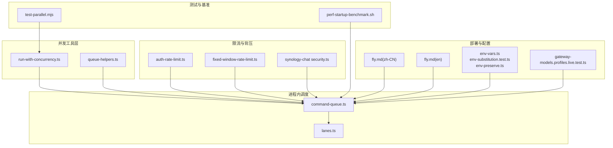
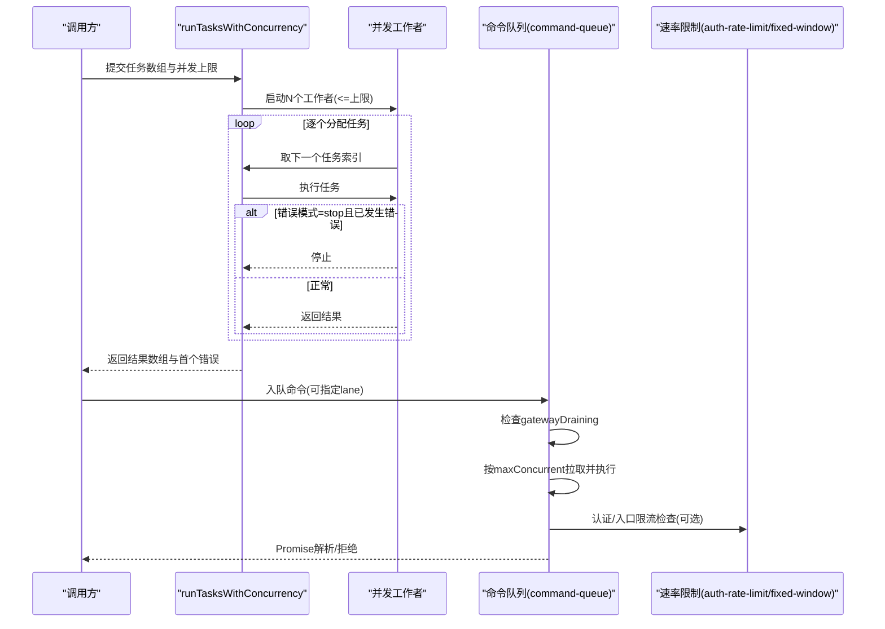
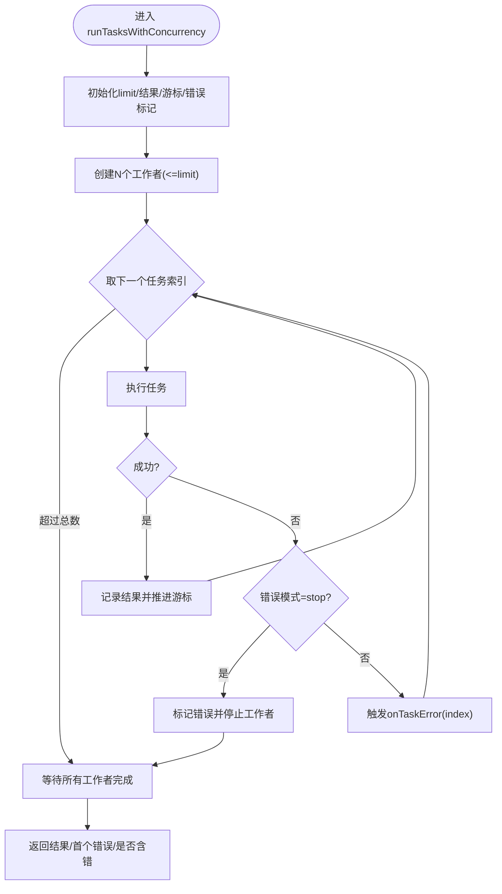
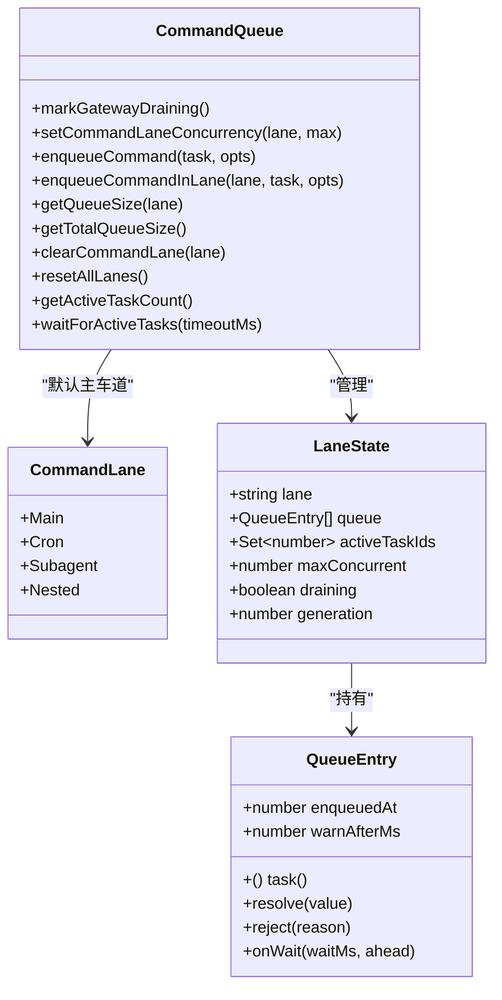
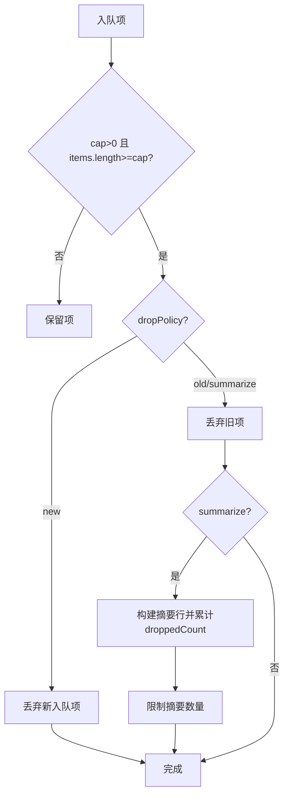
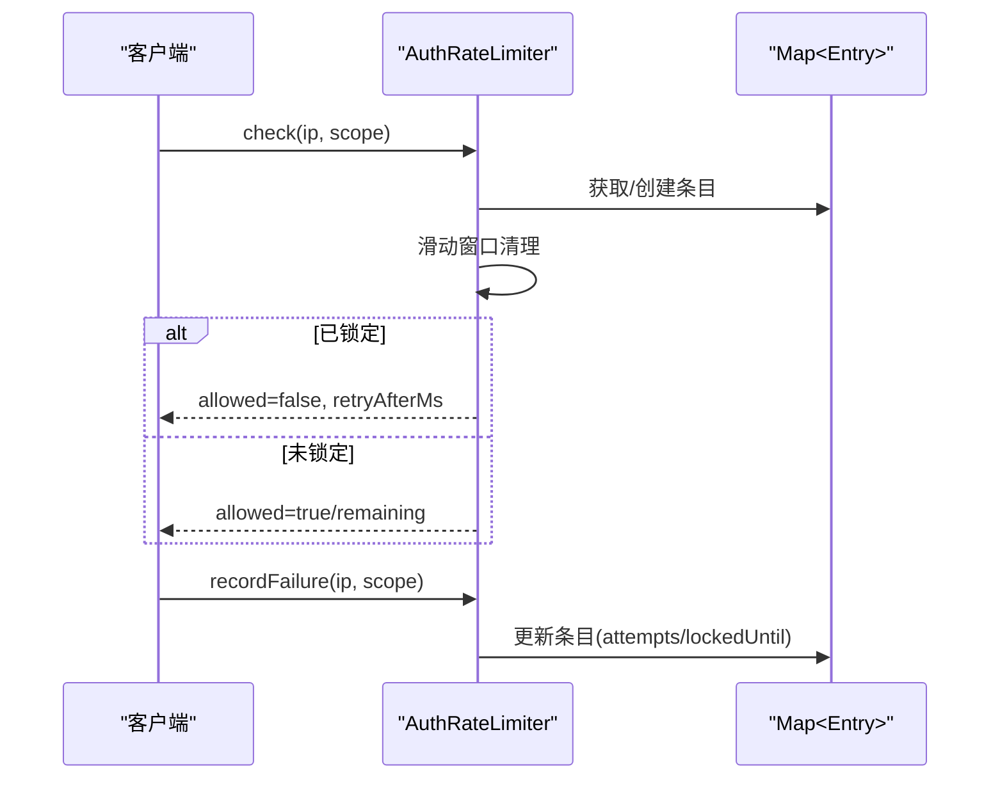
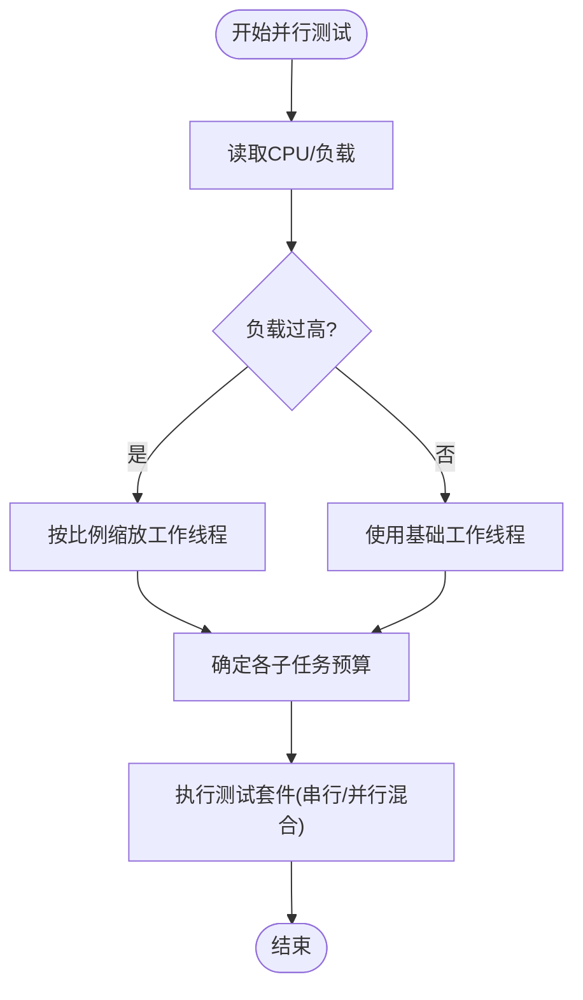
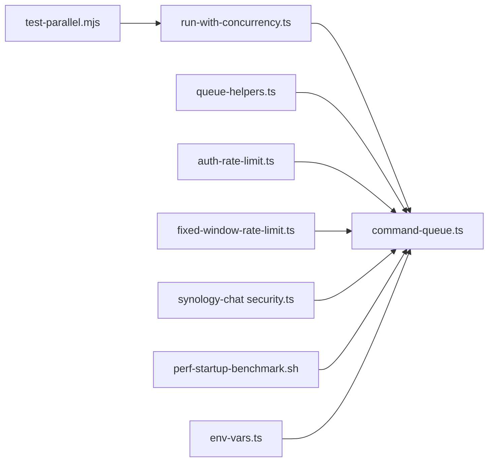

# 并发处理优化

<cite>
**本文引用的文件**
- [src/utils/run-with-concurrency.ts](file://src/utils/run-with-concurrency.ts)
- [src/process/command-queue.ts](file://src/process/command-queue.ts)
- [src/process/lanes.ts](file://src/process/lanes.ts)
- [src/utils/queue-helpers.ts](file://src/utils/queue-helpers.ts)
- [src/gateway/auth-rate-limit.ts](file://src/gateway/auth-rate-limit.ts)
- [src/infra/fixed-window-rate-limit.ts](file://src/infra/fixed-window-rate-limit.ts)
- [extensions/synology-chat/src/security.ts](file://extensions/synology-chat/src/security.ts)
- [scripts/test-parallel.mjs](file://scripts/test-parallel.mjs)
- [apps/android/scripts/perf-startup-benchmark.sh](file://apps/android/scripts/perf-startup-benchmark.sh)
- [src/gateway/gateway-models.profiles.live.test.ts](file://src/gateway/gateway-models.profiles.live.test.ts)
- [docs/zh-CN/install/fly.md](file://docs/zh-CN/install/fly.md)
- [docs/install/fly.md](file://docs/install/fly.md)
- [src/config/env-vars.ts](file://src/config/env-vars.ts)
- [src/config/env-substitution.test.ts](file://src/config/env-substitution.test.ts)
- [src/config/env-preserve.ts](file://src/config/env-preserve.ts)
</cite>

## 目录

1. [简介](#简介)
2. [项目结构](#项目结构)
3. [核心组件](#核心组件)
4. [架构总览](#架构总览)
5. [详细组件分析](#详细组件分析)
6. [依赖关系分析](#依赖关系分析)
7. [性能考量](#性能考量)
8. [故障排查指南](#故障排查指南)
9. [结论](#结论)
10. [附录](#附录)

## 简介

本指南聚焦于OpenClaw在并发处理方面的工程化实践，覆盖多线程、多进程与异步I/O优化策略，系统性阐述消息队列处理、任务调度与资源竞争规避技术，并给出锁优化与无锁编程思路、背压与限流策略、资源池管理建议以及可落地的并发配置参数调优与性能测试方法。同时提供分布式部署场景下的并发扩展指导，帮助在高负载与跨平台环境中稳定提升吞吐与响应。

## 项目结构

围绕并发处理的关键模块主要分布在以下路径：

- 工具与通用并发：src/utils/run-with-concurrency.ts、src/utils/queue-helpers.ts
- 进程内命令队列与车道：src/process/command-queue.ts、src/process/lanes.ts
- 速率限制与背压：src/gateway/auth-rate-limit.ts、src/infra/fixed-window-rate-limit.ts、extensions/synology-chat/src/security.ts
- 性能测试与基准：scripts/test-parallel.mjs、apps/android/scripts/perf-startup-benchmark.sh
- 分布式部署与环境变量：docs/install/fly.md、docs/zh-CN/install/fly.md、src/config/env-vars.ts、src/config/env-substitution.test.ts、src/config/env-preserve.ts
- 模型与并发上限：src/gateway/gateway-models.profiles.live.test.ts

图表来源

- [src/utils/run-with-concurrency.ts](file://src/utils/run-with-concurrency.ts#L1-L49)
- [src/utils/queue-helpers.ts](file://src/utils/queue-helpers.ts#L1-L260)
- [src/process/command-queue.ts](file://src/process/command-queue.ts#L1-L325)
- [src/process/lanes.ts](file://src/process/lanes.ts#L1-L7)
- [src/gateway/auth-rate-limit.ts](file://src/gateway/auth-rate-limit.ts#L1-L233)
- [src/infra/fixed-window-rate-limit.ts](file://src/infra/fixed-window-rate-limit.ts#L1-L49)
- [extensions/synology-chat/src/security.ts](file://extensions/synology-chat/src/security.ts#L82-L140)
- [scripts/test-parallel.mjs](file://scripts/test-parallel.mjs#L208-L243)
- [apps/android/scripts/perf-startup-benchmark.sh](file://apps/android/scripts/perf-startup-benchmark.sh#L1-L86)
- [src/gateway/gateway-models.profiles.live.test.ts](file://src/gateway/gateway-models.profiles.live.test.ts#L63-L112)
- [docs/zh-CN/install/fly.md](file://docs/zh-CN/install/fly.md#L51-L436)
- [docs/install/fly.md](file://docs/install/fly.md#L365-L433)
- [src/config/env-vars.ts](file://src/config/env-vars.ts#L56-L80)
- [src/config/env-substitution.test.ts](file://src/config/env-substitution.test.ts#L1-L286)
- [src/config/env-preserve.ts](file://src/config/env-preserve.ts#L1-L38)

章节来源

- [src/utils/run-with-concurrency.ts](file://src/utils/run-with-concurrency.ts#L1-L49)
- [src/process/command-queue.ts](file://src/process/command-queue.ts#L1-L325)
- [src/utils/queue-helpers.ts](file://src/utils/queue-helpers.ts#L1-L260)
- [src/gateway/auth-rate-limit.ts](file://src/gateway/auth-rate-limit.ts#L1-L233)
- [src/infra/fixed-window-rate-limit.ts](file://src/infra/fixed-window-rate-limit.ts#L1-L49)
- [extensions/synology-chat/src/security.ts](file://extensions/synology-chat/src/security.ts#L82-L140)
- [scripts/test-parallel.mjs](file://scripts/test-parallel.mjs#L208-L243)
- [apps/android/scripts/perf-startup-benchmark.sh](file://apps/android/scripts/perf-startup-benchmark.sh#L1-L86)
- [src/gateway/gateway-models.profiles.live.test.ts](file://src/gateway/gateway-models.profiles.live.test.ts#L63-L112)
- [docs/zh-CN/install/fly.md](file://docs/zh-CN/install/fly.md#L51-L436)
- [docs/install/fly.md](file://docs/install/fly.md#L365-L433)
- [src/config/env-vars.ts](file://src/config/env-vars.ts#L56-L80)
- [src/config/env-substitution.test.ts](file://src/config/env-substitution.test.ts#L1-L286)
- [src/config/env-preserve.ts](file://src/config/env-preserve.ts#L1-L38)

## 核心组件

- 并发执行器：用于按限流并发度运行一组任务，支持错误模式与回调，保证结果顺序与错误聚合。
- 命令队列与车道：基于“车道”隔离不同类型的命令执行，支持每车道并发上限、排队与等待告警、清空与重启恢复。
- 队列辅助：容量控制、丢弃策略、去重、防抖、汇总提示等，支撑背压与可观测性。
- 速率限制：滑动窗口与固定窗口两种实现，支持作用域与清理周期，用于认证与Webhook等入口限流。
- 测试与基准：并行测试工作负载自适应、极端主机负载缩放、Android冷启动宏基准脚本。
- 部署与环境：Fly.io部署模板与私有化配置、环境变量注入与保留策略，保障分布式一致性。

章节来源

- [src/utils/run-with-concurrency.ts](file://src/utils/run-with-concurrency.ts#L1-L49)
- [src/process/command-queue.ts](file://src/process/command-queue.ts#L1-L325)
- [src/process/lanes.ts](file://src/process/lanes.ts#L1-L7)
- [src/utils/queue-helpers.ts](file://src/utils/queue-helpers.ts#L1-L260)
- [src/gateway/auth-rate-limit.ts](file://src/gateway/auth-rate-limit.ts#L1-L233)
- [src/infra/fixed-window-rate-limit.ts](file://src/infra/fixed-window-rate-limit.ts#L1-L49)
- [extensions/synology-chat/src/security.ts](file://extensions/synology-chat/src/security.ts#L82-L140)
- [scripts/test-parallel.mjs](file://scripts/test-parallel.mjs#L208-L243)
- [apps/android/scripts/perf-startup-benchmark.sh](file://apps/android/scripts/perf-startup-benchmark.sh#L1-L86)
- [src/gateway/gateway-models.profiles.live.test.ts](file://src/gateway/gateway-models.profiles.live.test.ts#L63-L112)
- [docs/zh-CN/install/fly.md](file://docs/zh-CN/install/fly.md#L51-L436)
- [docs/install/fly.md](file://docs/install/fly.md#L365-L433)
- [src/config/env-vars.ts](file://src/config/env-vars.ts#L56-L80)
- [src/config/env-substitution.test.ts](file://src/config/env-substitution.test.ts#L1-L286)
- [src/config/env-preserve.ts](file://src/config/env-preserve.ts#L1-L38)

## 架构总览

下图展示从任务提交到执行完成的端到端流程，包括队列、并发控制、限流与错误处理：

图表来源

- [src/utils/run-with-concurrency.ts](file://src/utils/run-with-concurrency.ts#L3-L48)
- [src/process/command-queue.ts](file://src/process/command-queue.ts#L161-L197)
- [src/gateway/auth-rate-limit.ts](file://src/gateway/auth-rate-limit.ts#L141-L172)
- [src/infra/fixed-window-rate-limit.ts](file://src/infra/fixed-window-rate-limit.ts#L22-L47)

## 详细组件分析

### 并发执行器：runTasksWithConcurrency

- 设计要点
  - 通过固定数量的工作者并发执行任务，保证结果顺序与索引映射。
  - 支持错误模式：继续执行或遇错停止；提供单任务错误回调。
  - 自动裁剪并发上限，避免越界。
- 关键行为
  - 初始化结果数组与游标，循环取任务执行，捕获异常并按模式处理。
  - 使用Promise.allSettled等待所有工作者结束，返回聚合结果。
- 适用场景
  - 批量数据处理、外部服务批量请求、资源受限的批处理任务。

图表来源

- [src/utils/run-with-concurrency.ts](file://src/utils/run-with-concurrency.ts#L3-L48)

章节来源

- [src/utils/run-with-concurrency.ts](file://src/utils/run-with-concurrency.ts#L1-L49)

### 命令队列与车道：command-queue + lanes

- 设计要点
  - 基于Map维护多个“车道”，每个车道独立维护队列、活跃任务集合、最大并发与生成号。
  - 支持全局网关“排水”标记，新入队直接失败，避免重启过程中的悬挂。
  - 提供清空车道、重置所有车道、等待活跃任务完成等运维能力。
- 关键行为
  - enqueueCommand/InLane：入队并尝试拉取执行；超时等待告警；记录等待时长与队列长度。
  - drainLane：当活跃数小于maxConcurrent且队列非空时持续出队执行。
  - 完成/错误处理：更新活跃任务集合，日志记录，必要时继续泵出。
- 适用场景
  - 主流程串行、后台任务并行、定时任务隔离、重启平滑过渡。

图表来源

- [src/process/command-queue.ts](file://src/process/command-queue.ts#L43-L197)
- [src/process/lanes.ts](file://src/process/lanes.ts#L1-L7)

章节来源

- [src/process/command-queue.ts](file://src/process/command-queue.ts#L1-L325)
- [src/process/lanes.ts](file://src/process/lanes.ts#L1-L7)

### 队列辅助：容量、丢弃、去重与防抖

- 设计要点
  - QueueState封装容量、丢弃策略(dropPolicy)、摘要统计与项列表。
  - applyQueueDropPolicy：根据容量与策略丢弃旧/新项，支持“summarize”策略记录摘要。
  - waitForQueueDebounce：基于最后入队时间的防抖等待，支持测试快速路径。
  - hasCrossChannelItems/drainCollect\*：跨通道收集与强制逐项执行的策略。
- 适用场景
  - 输入风暴防护、消息聚合、跨渠道一致性与背压控制。

图表来源

- [src/utils/queue-helpers.ts](file://src/utils/queue-helpers.ts#L84-L133)

章节来源

- [src/utils/queue-helpers.ts](file://src/utils/queue-helpers.ts#L1-L260)

### 速率限制：滑动窗口与固定窗口

- 滑动窗口（认证入口）
  - 以Map存储每个{scope, ip}的失败时间戳，按窗口滑动清理。
  - 超限时锁定一段时间，期间拒绝请求并返回剩余重试时间。
  - 支持后台定时清理，避免内存膨胀。
- 固定窗口
  - 简单计数器+窗口起始时间，超过阈值阻塞直到窗口重置。
- 扩展示例（聊天扩展）
  - 基于用户ID的滑动窗口，定期清理过期条目，防止内存泄漏。

图表来源

- [src/gateway/auth-rate-limit.ts](file://src/gateway/auth-rate-limit.ts#L141-L204)
- [src/infra/fixed-window-rate-limit.ts](file://src/infra/fixed-window-rate-limit.ts#L22-L47)
- [extensions/synology-chat/src/security.ts](file://extensions/synology-chat/src/security.ts#L102-L140)

章节来源

- [src/gateway/auth-rate-limit.ts](file://src/gateway/auth-rate-limit.ts#L1-L233)
- [src/infra/fixed-window-rate-limit.ts](file://src/infra/fixed-window-rate-limit.ts#L1-L49)
- [extensions/synology-chat/src/security.ts](file://extensions/synology-chat/src/security.ts#L82-L140)

### 测试与基准：并行与性能

- 并行测试
  - 根据主机CPU与负载情况动态调整工作线程预算，极端负载下缩放系数降低。
  - 支持串行/低配/最大三种测试档位，控制单元测试、扩展测试与网关测试的并发度。
- Android冷启动基准
  - 自动运行冷启动宏基准，保存快照JSON，便于对比与回归。

图表来源

- [scripts/test-parallel.mjs](file://scripts/test-parallel.mjs#L208-L243)
- [apps/android/scripts/perf-startup-benchmark.sh](file://apps/android/scripts/perf-startup-benchmark.sh#L62-L86)

章节来源

- [scripts/test-parallel.mjs](file://scripts/test-parallel.mjs#L208-L243)
- [apps/android/scripts/perf-startup-benchmark.sh](file://apps/android/scripts/perf-startup-benchmark.sh#L1-L86)

### 分布式部署与环境变量

- Fly.io部署
  - 提供公开与私有部署模板，绑定LAN、最小运行实例、内存与状态卷挂载。
  - 私有部署释放公网IP、仅分配私有IPv6，结合WireGuard或本地代理访问。
- 环境变量
  - 配置注入与保留策略：在写回配置时保留`${VAR}`引用，避免丢失环境变量来源。
  - 支持嵌套结构与缺失变量检测，便于在分布式节点统一注入。

章节来源

- [docs/zh-CN/install/fly.md](file://docs/zh-CN/install/fly.md#L51-L436)
- [docs/install/fly.md](file://docs/install/fly.md#L365-L433)
- [src/config/env-vars.ts](file://src/config/env-vars.ts#L56-L80)
- [src/config/env-substitution.test.ts](file://src/config/env-substitution.test.ts#L1-L286)
- [src/config/env-preserve.ts](file://src/config/env-preserve.ts#L1-L38)

## 依赖关系分析

- 组件耦合
  - run-with-concurrency与command-queue在“任务执行”层面解耦，前者负责并发度与错误聚合，后者负责队列与车道。
  - queue-helpers被命令队列与自动回复等模块复用，提供容量与丢弃策略。
  - 速率限制模块作为横切关注点，可被网关、Webhook与扩展共同使用。
- 外部依赖
  - Node.js原生能力（定时器、Map、Promise）；测试框架（Vitest）；Android Benchmark（Gradle插件）。
- 循环依赖
  - 当前模块间无明显循环依赖，职责边界清晰。

图表来源

- [src/utils/run-with-concurrency.ts](file://src/utils/run-with-concurrency.ts#L1-L49)
- [src/process/command-queue.ts](file://src/process/command-queue.ts#L1-L325)
- [src/utils/queue-helpers.ts](file://src/utils/queue-helpers.ts#L1-L260)
- [src/gateway/auth-rate-limit.ts](file://src/gateway/auth-rate-limit.ts#L1-L233)
- [src/infra/fixed-window-rate-limit.ts](file://src/infra/fixed-window-rate-limit.ts#L1-L49)
- [extensions/synology-chat/src/security.ts](file://extensions/synology-chat/src/security.ts#L82-L140)
- [scripts/test-parallel.mjs](file://scripts/test-parallel.mjs#L208-L243)
- [apps/android/scripts/perf-startup-benchmark.sh](file://apps/android/scripts/perf-startup-benchmark.sh#L1-L86)
- [src/config/env-vars.ts](file://src/config/env-vars.ts#L56-L80)

章节来源

- [src/process/command-queue.ts](file://src/process/command-queue.ts#L1-L325)
- [src/utils/run-with-concurrency.ts](file://src/utils/run-with-concurrency.ts#L1-L49)
- [src/utils/queue-helpers.ts](file://src/utils/queue-helpers.ts#L1-L260)
- [src/gateway/auth-rate-limit.ts](file://src/gateway/auth-rate-limit.ts#L1-L233)
- [src/infra/fixed-window-rate-limit.ts](file://src/infra/fixed-window-rate-limit.ts#L1-L49)
- [extensions/synology-chat/src/security.ts](file://extensions/synology-chat/src/security.ts#L82-L140)
- [scripts/test-parallel.mjs](file://scripts/test-parallel.mjs#L208-L243)
- [apps/android/scripts/perf-startup-benchmark.sh](file://apps/android/scripts/perf-startup-benchmark.sh#L1-L86)
- [src/config/env-vars.ts](file://src/config/env-vars.ts#L56-L80)

## 性能考量

- 并发度选择
  - CPU密集型任务：建议与CPU核数或核数±2，避免过度上下文切换。
  - IO密集型任务：可适度提高并发度，但需配合队列容量与限流，防止放大背压。
  - runTasksWithConcurrency的limit应与下游服务的并发上限相匹配。
- 队列与背压
  - 合理设置cap与dropPolicy，优先采用“summarize”记录关键信息，减少日志噪音。
  - 使用waitForQueueDebounce在高频事件中合并处理，降低瞬时压力。
- 限流策略
  - 认证入口：滑动窗口+锁定，兼顾攻击防护与用户体验。
  - Webhook/第三方接口：固定窗口或令牌桶（可扩展），明确retryAfter与重试策略。
- 资源池管理
  - 数据库连接池、HTTP客户端池：并发度与池大小协同配置，避免连接争用。
  - 缓存命中率与失效策略：预热与降级，避免缓存穿透放大并发。
- 分布式扩展
  - Fly.io：最小运行实例≥1，内存充足，状态持久化；私有部署隐藏公网暴露面。
  - 模型并发上限：根据环境变量与测试估算合理设置最大模型数与超时。

章节来源

- [src/utils/run-with-concurrency.ts](file://src/utils/run-with-concurrency.ts#L1-L49)
- [src/utils/queue-helpers.ts](file://src/utils/queue-helpers.ts#L84-L133)
- [src/gateway/auth-rate-limit.ts](file://src/gateway/auth-rate-limit.ts#L141-L204)
- [src/infra/fixed-window-rate-limit.ts](file://src/infra/fixed-window-rate-limit.ts#L22-L47)
- [src/gateway/gateway-models.profiles.live.test.ts](file://src/gateway/gateway-models.profiles.live.test.ts#L63-L112)
- [docs/zh-CN/install/fly.md](file://docs/zh-CN/install/fly.md#L51-L436)
- [docs/install/fly.md](file://docs/install/fly.md#L365-L433)

## 故障排查指南

- 命令队列卡顿
  - 检查draining标志与activeTaskIds是否为0但仍有队列，定位阻塞点。
  - 使用resetAllLanes在重启后恢复执行，确保队列被泵出。
- 速率限制误判
  - 校验scope与IP归一化逻辑，确认是否被豁免（如本地回环）。
  - 定期调用prune清理过期条目，避免Map膨胀。
- 并发执行异常
  - 错误模式=stop时，首个错误会导致工作者提前退出；改为continue以收集全部错误。
  - 使用onTaskError回调定位具体任务索引，结合日志定位根因。
- 队列溢出
  - 启用summarize策略记录摘要，结合cap与dropPolicy评估吞吐与丢弃比率。
  - 对高频事件启用debounce，降低瞬时峰值。

章节来源

- [src/process/command-queue.ts](file://src/process/command-queue.ts#L80-L144)
- [src/process/command-queue.ts](file://src/process/command-queue.ts#L244-L259)
- [src/gateway/auth-rate-limit.ts](file://src/gateway/auth-rate-limit.ts#L206-L218)
- [src/utils/run-with-concurrency.ts](file://src/utils/run-with-concurrency.ts#L3-L48)
- [src/utils/queue-helpers.ts](file://src/utils/queue-helpers.ts#L84-L133)

## 结论

OpenClaw通过“并发执行器+命令队列+速率限制+队列辅助”的组合拳，在保证任务正确性的同时实现了高吞吐与强可观测性。实践中应结合业务特征选择合适的并发度与限流策略，利用队列容量与丢弃策略实现背压控制，并在分布式部署中通过Fly.io模板与环境变量策略确保一致性与安全性。配合自动化测试与基准脚本，可形成闭环的性能验证与回归保障体系。

## 附录

- 并发配置参数建议
  - 并发上限：runTasksWithConcurrency(limit)、setCommandLaneConcurrency(lane, max)。
  - 队列容量与丢弃：cap、dropPolicy、debounceMs。
  - 速率限制：maxAttempts、windowMs、lockoutMs、scope。
- 性能测试与回归
  - 并行测试：scripts/test-parallel.mjs，支持档位与负载感知缩放。
  - Android冷启动：apps/android/scripts/perf-startup-benchmark.sh，输出快照JSON。
- 分布式部署要点
  - Fly.io：最小运行实例、私有IP、状态卷；私有部署隐藏公网暴露面。
  - 环境变量：保留${VAR}引用，支持嵌套结构与缺失检测。

章节来源

- [scripts/test-parallel.mjs](file://scripts/test-parallel.mjs#L208-L243)
- [apps/android/scripts/perf-startup-benchmark.sh](file://apps/android/scripts/perf-startup-benchmark.sh#L1-L86)
- [docs/zh-CN/install/fly.md](file://docs/zh-CN/install/fly.md#L51-L436)
- [docs/install/fly.md](file://docs/install/fly.md#L365-L433)
- [src/config/env-vars.ts](file://src/config/env-vars.ts#L56-L80)
- [src/config/env-substitution.test.ts](file://src/config/env-substitution.test.ts#L1-L286)
- [src/config/env-preserve.ts](file://src/config/env-preserve.ts#L1-L38)
