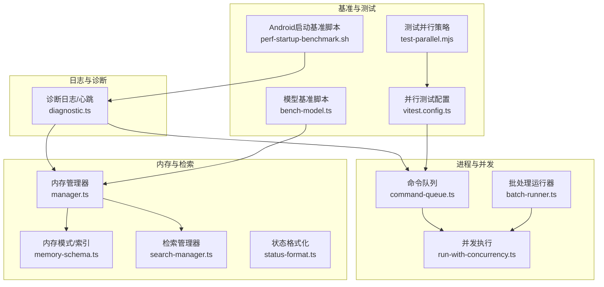
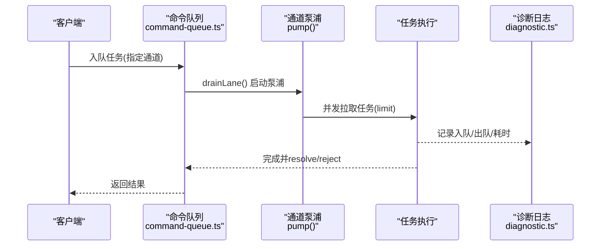
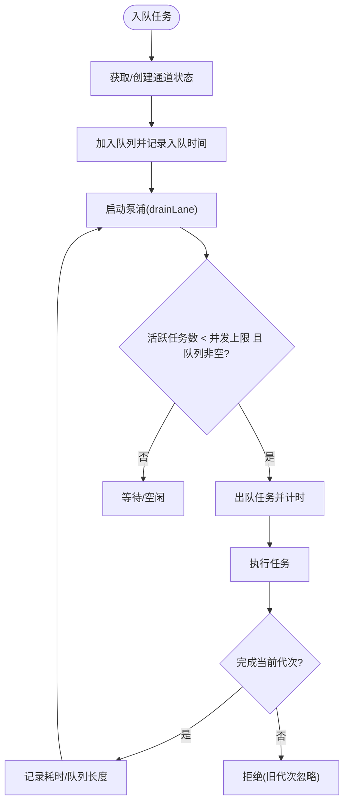
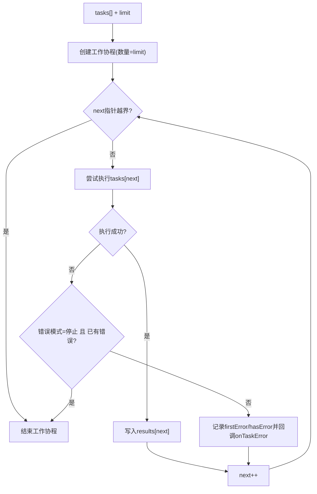
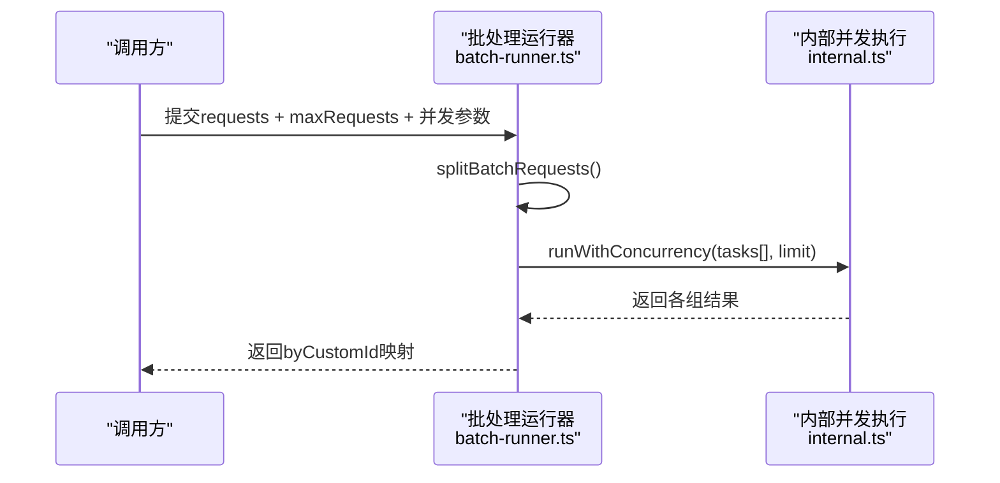
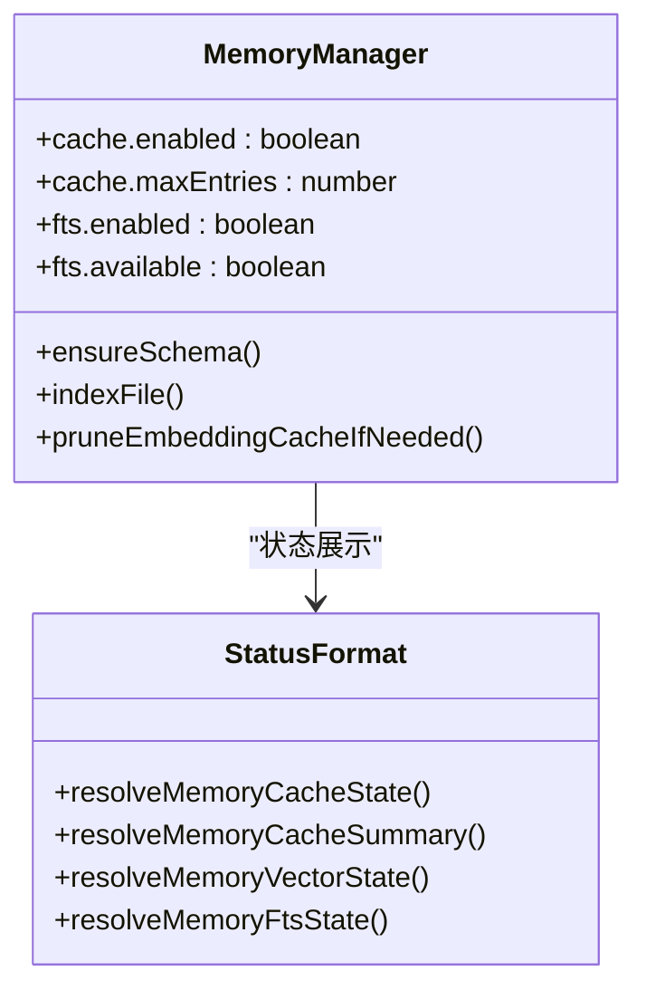
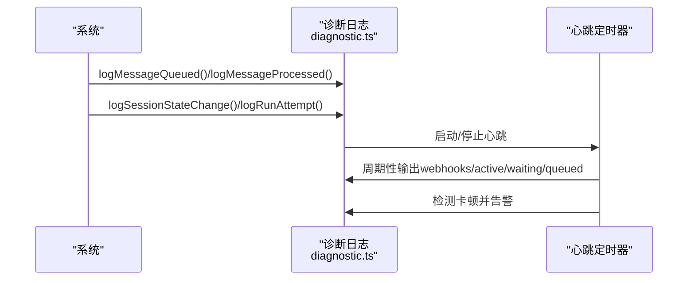
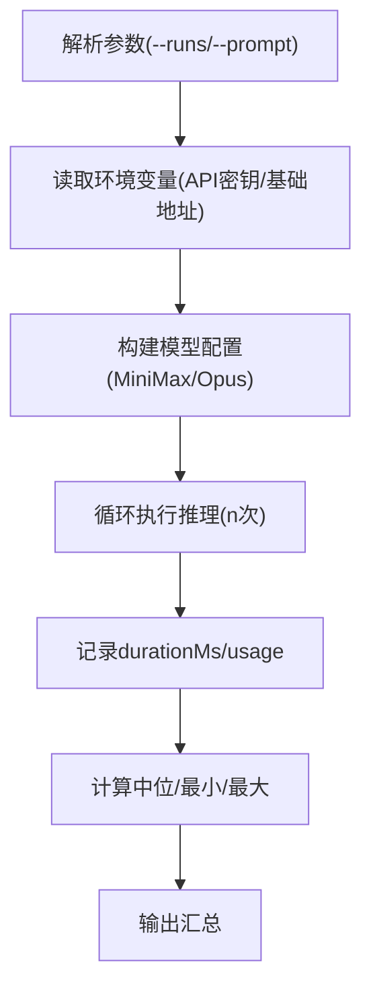
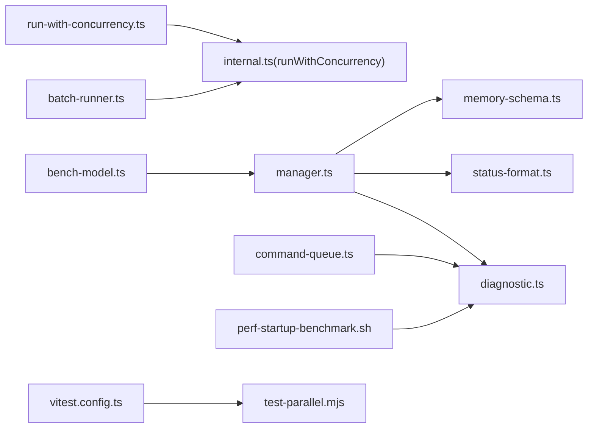

# 性能优化

<cite>
**本文引用的文件**
- [bench-model.ts](file://scripts/bench-model.ts)
- [perf-startup-benchmark.sh](file://apps/android/scripts/perf-startup-benchmark.sh)
- [android README](file://apps/android/README.md)
- [run-with-concurrency.ts](file://src/utils/run-with-concurrency.ts)
- [batch-runner.ts](file://src/memory/batch-runner.ts)
- [internal.ts](file://src/memory/internal.ts)
- [command-queue.ts](file://src/process/command-queue.ts)
- [diagnostic.ts](file://src/logging/diagnostic.ts)
- [memory-schema.ts](file://src/memory/memory-schema.ts)
- [manager.ts](file://src/memory/manager.ts)
- [search-manager.ts](file://src/memory/search-manager.ts)
- [status-format.ts](file://src/memory/status-format.ts)
- [pi-settings.ts](file://src/agents/pi-settings.ts)
- [pi-settings.test.ts](file://src/agents/pi-settings.test.ts)
- [package.json](file://package.json)
- [vitest.config.ts](file://vitest.config.ts)
- [test-parallel.mjs](file://scripts/test-parallel.mjs)
- [service.ts](file://extensions/diagnostics-otel/src/service.ts)
</cite>

## 目录

1. [简介](#简介)
2. [项目结构](#项目结构)
3. [核心组件](#核心组件)
4. [架构总览](#架构总览)
5. [详细组件分析](#详细组件分析)
6. [依赖关系分析](#依赖关系分析)
7. [性能考量](#性能考量)
8. [故障排查指南](#故障排查指南)
9. [结论](#结论)
10. [附录](#附录)

## 简介

本指南面向OpenClaw系统的性能优化，聚焦以下目标：

- 系统性能瓶颈识别：通过诊断日志、队列状态与心跳机制定位阻塞点。
- 内存使用优化：向量索引与全文检索的缓存策略、嵌入缓存表与索引并发控制。
- CPU资源管理：并发执行限制、批处理与分组运行、任务错误传播与停止策略。
- 并发处理优化：命令队列多通道（lane）并发、任务限流与等待告警。
- 缓存策略：嵌入缓存TTL、最大条目数、键规范化与过期清理。
- 数据库查询优化：SQLite向量扩展、索引与元数据表设计、FTS可用性检测。
- 模型推理加速：批量化、并发度、超时与重试策略；基准脚本与对比方法。
- 批量处理与异步任务：分组拆分、并发执行、进度回调与超时控制。
- 负载测试、压力测试与基准测试：Android冷启动宏基准、模型推理基准、并行测试配置。
- 硬件资源配置建议：CPU核数、内存容量与磁盘I/O；网络优化与存储性能提升。
- 高并发场景调优：队列长度与等待阈值、并发上限、会话卡顿检测与清理。

## 项目结构

OpenClaw采用模块化与插件化架构，核心性能相关能力分布在以下模块：

- 进程与并发：命令队列与任务并发控制
- 内存与检索：向量索引、全文检索、嵌入缓存与批处理
- 日志与诊断：诊断事件、心跳与会话状态
- 基准与测试：模型推理基准、Android启动基准、并行测试配置
- 配置与默认值：压缩与保留令牌、缓存开关与并发参数

图表来源

- [command-queue.ts](file://src/process/command-queue.ts#L92-L144)
- [run-with-concurrency.ts](file://src/utils/run-with-concurrency.ts#L3-L48)
- [batch-runner.ts](file://src/memory/batch-runner.ts#L12-L48)
- [manager.ts](file://src/memory/manager.ts#L141-L175)
- [memory-schema.ts](file://src/memory/memory-schema.ts#L3-L52)
- [search-manager.ts](file://src/memory/search-manager.ts#L75-L121)
- [status-format.ts](file://src/memory/status-format.ts#L1-L45)
- [diagnostic.ts](file://src/logging/diagnostic.ts#L222-L241)
- [bench-model.ts](file://scripts/bench-model.ts#L50-L79)
- [perf-startup-benchmark.sh](file://apps/android/scripts/perf-startup-benchmark.sh#L115-L124)
- [vitest.config.ts](file://vitest.config.ts#L26-L55)
- [test-parallel.mjs](file://scripts/test-parallel.mjs#L239-L269)

章节来源

- [command-queue.ts](file://src/process/command-queue.ts#L1-L325)
- [run-with-concurrency.ts](file://src/utils/run-with-concurrency.ts#L1-L49)
- [batch-runner.ts](file://src/memory/batch-runner.ts#L1-L65)
- [manager.ts](file://src/memory/manager.ts#L141-L175)
- [memory-schema.ts](file://src/memory/memory-schema.ts#L1-L52)
- [search-manager.ts](file://src/memory/search-manager.ts#L65-L121)
- [status-format.ts](file://src/memory/status-format.ts#L1-L45)
- [diagnostic.ts](file://src/logging/diagnostic.ts#L1-L400)
- [bench-model.ts](file://scripts/bench-model.ts#L1-L147)
- [perf-startup-benchmark.sh](file://apps/android/scripts/perf-startup-benchmark.sh#L58-L110)
- [vitest.config.ts](file://vitest.config.ts#L1-L158)
- [test-parallel.mjs](file://scripts/test-parallel.mjs#L239-L269)

## 核心组件

- 命令队列与多通道并发：支持主通道与其他专用通道，按通道并发上限调度，记录排队等待与完成耗时，提供清空通道、重启后重置等运维能力。
- 并发执行与错误传播：统一的任务并发执行器，支持“继续”或“停止”两种错误模式，确保失败快速反馈与资源回收。
- 批处理运行器：将请求分组、并发执行组内任务，并维护自定义ID到索引映射，便于结果回填与调试。
- 内存管理与检索：管理嵌入缓存开关与最大条目数、FTS可用性、向量索引并发与超时，提供降级检索与缓存清理。
- 诊断日志与心跳：记录消息入队/出队、会话状态变化、卡顿检测与心跳统计，辅助定位瓶颈与异常。
- 基准与测试：模型推理基准脚本用于对比不同模型的延迟分布；Android启动宏基准用于评估应用启动性能；并行测试配置与策略用于大规模测试场景下的资源分配。

章节来源

- [command-queue.ts](file://src/process/command-queue.ts#L92-L144)
- [run-with-concurrency.ts](file://src/utils/run-with-concurrency.ts#L3-L48)
- [batch-runner.ts](file://src/memory/batch-runner.ts#L12-L48)
- [manager.ts](file://src/memory/manager.ts#L168-L171)
- [diagnostic.ts](file://src/logging/diagnostic.ts#L222-L241)
- [bench-model.ts](file://scripts/bench-model.ts#L50-L79)
- [perf-startup-benchmark.sh](file://apps/android/scripts/perf-startup-benchmark.sh#L58-L110)
- [vitest.config.ts](file://vitest.config.ts#L26-L55)
- [test-parallel.mjs](file://scripts/test-parallel.mjs#L239-L269)

## 架构总览

下图展示从外部请求到内部处理的关键路径，包括并发控制、批处理与诊断事件：

图表来源

- [command-queue.ts](file://src/process/command-queue.ts#L92-L144)
- [diagnostic.ts](file://src/logging/diagnostic.ts#L222-L241)

## 详细组件分析

### 命令队列与通道并发

- 多通道隔离：每个通道维护独立队列与活跃任务集合，避免相互干扰。
- 并发上限：每通道可设置最大并发数，超过则排队等待。
- 等待告警：超过阈值自动触发onWait回调与诊断日志，便于观察瓶颈。
- 清理与重启：支持清空通道、重启后生成新代次并重置状态，防止僵尸任务阻塞。

图表来源

- [command-queue.ts](file://src/process/command-queue.ts#L92-L144)

章节来源

- [command-queue.ts](file://src/process/command-queue.ts#L154-L228)

### 并发执行与错误传播

- 统一并发执行器：按limit并发拉取下一个任务，支持“继续”或“停止”两种错误模式。
- 错误收集：首次错误记录并传播，停止策略下后续任务不再执行。
- 结果聚合：返回完整结果数组与错误状态，便于上层判断。

图表来源

- [run-with-concurrency.ts](file://src/utils/run-with-concurrency.ts#L3-L48)

章节来源

- [run-with-concurrency.ts](file://src/utils/run-with-concurrency.ts#L1-L49)

### 批处理运行器

- 分组策略：根据maxRequests拆分请求为多个组，降低单次负载。
- 并发执行：对各组并发执行，支持wait/pollIntervalMs/timeoutMs控制。
- 结果回填：通过byCustomId映射回原始请求索引，便于后续处理。

图表来源

- [batch-runner.ts](file://src/memory/batch-runner.ts#L12-L48)
- [internal.ts](file://src/memory/internal.ts#L318-L331)

章节来源

- [batch-runner.ts](file://src/memory/batch-runner.ts#L1-L65)
- [internal.ts](file://src/memory/internal.ts#L318-L331)

### 内存管理与检索

- 缓存配置：启用/禁用嵌入缓存、最大条目数，支持缓存清理与降级检索。
- FTS可用性：通过状态格式化函数输出“就绪/不可用/禁用/未知”，便于运维面板展示。
- 模式与索引：确保SQLite模式与索引存在，创建嵌入缓存表并建立更新时间索引，提升查询效率。

图表来源

- [manager.ts](file://src/memory/manager.ts#L168-L171)
- [memory-schema.ts](file://src/memory/memory-schema.ts#L3-L52)
- [status-format.ts](file://src/memory/status-format.ts#L1-L45)

章节来源

- [manager.ts](file://src/memory/manager.ts#L141-L175)
- [memory-schema.ts](file://src/memory/memory-schema.ts#L1-L52)
- [status-format.ts](file://src/memory/status-format.ts#L1-L45)

### 诊断日志与心跳

- 事件记录：消息入队/出队、会话状态变更、运行尝试、工具循环检测、Webhook统计。
- 心跳与卡顿：周期性输出活动统计，检测长时间无活动或处理卡顿的会话并发出告警。
- 通道事件：记录通道入队/出队与等待时长，辅助定位瓶颈。

图表来源

- [diagnostic.ts](file://src/logging/diagnostic.ts#L222-L241)
- [diagnostic.ts](file://src/logging/diagnostic.ts#L308-L376)

章节来源

- [diagnostic.ts](file://src/logging/diagnostic.ts#L1-L400)

### 模型推理基准

- 多轮运行：支持指定运行次数，记录每次耗时与用量。
- 统计汇总：计算中位数、最小值、最大值，便于对比不同模型/配置。
- 环境变量：通过环境变量配置API密钥与基础地址，保证脚本可复现。

图表来源

- [bench-model.ts](file://scripts/bench-model.ts#L19-L79)
- [bench-model.ts](file://scripts/bench-model.ts#L130-L144)

章节来源

- [bench-model.ts](file://scripts/bench-model.ts#L1-L147)

### Android启动宏基准

- 行为说明：仅运行冷启动宏基准，输出中位/最小/最大与变异系数，并与基线比较。
- 使用方式：在真机上安装调试版应用并通过adb反向端口连接本地网关进行测试。

章节来源

- [perf-startup-benchmark.sh](file://apps/android/scripts/perf-startup-benchmark.sh#L58-L124)
- [android README](file://apps/android/README.md#L58-L110)

### 并行测试配置与策略

- Vitest并行：基于CPU核心数动态确定最大worker数，区分CI与本地环境。
- 测试并行策略：针对不同主机内存容量（低/高/常规）分配单元测试、扩展与网关测试的并发比例，避免OOM。

章节来源

- [vitest.config.ts](file://vitest.config.ts#L9-L10)
- [vitest.config.ts](file://vitest.config.ts#L26-L55)
- [test-parallel.mjs](file://scripts/test-parallel.mjs#L239-L269)

## 依赖关系分析

- 并发执行依赖：批处理运行器依赖内部并发执行器；内部并发执行器封装通用并发逻辑。
- 内存模块依赖：管理器依赖模式/索引创建与状态格式化；检索管理器提供主/备检索切换。
- 诊断依赖：命令队列与内存管理均通过诊断日志上报事件，形成统一可观测性。
- 基准与测试：基准脚本与Android脚本分别服务于模型与启动性能；并行测试配置与策略保障大规模测试稳定性。

图表来源

- [run-with-concurrency.ts](file://src/utils/run-with-concurrency.ts#L3-L48)
- [internal.ts](file://src/memory/internal.ts#L318-L331)
- [batch-runner.ts](file://src/memory/batch-runner.ts#L1-L65)
- [manager.ts](file://src/memory/manager.ts#L141-L175)
- [memory-schema.ts](file://src/memory/memory-schema.ts#L1-L52)
- [status-format.ts](file://src/memory/status-format.ts#L1-L45)
- [command-queue.ts](file://src/process/command-queue.ts#L92-L144)
- [diagnostic.ts](file://src/logging/diagnostic.ts#L222-L241)
- [bench-model.ts](file://scripts/bench-model.ts#L50-L79)
- [perf-startup-benchmark.sh](file://apps/android/scripts/perf-startup-benchmark.sh#L58-L110)
- [vitest.config.ts](file://vitest.config.ts#L26-L55)
- [test-parallel.mjs](file://scripts/test-parallel.mjs#L239-L269)

章节来源

- [package.json](file://package.json#L151-L206)

## 性能考量

- CPU资源管理
  - 通过命令队列的通道并发上限与等待阈值，避免CPU过度竞争与上下文切换开销。
  - 并发执行器的“停止”模式可在任务失败时快速回收资源，减少无效重试。
- 内存使用优化
  - 嵌入缓存的最大条目数与TTL控制，结合过期清理与降级检索，平衡命中率与内存占用。
  - SQLite向量扩展与索引设计（如更新时间索引）提升查询性能。
- 数据库查询优化
  - 确保模式与索引存在，避免重复DDL开销；FTS可用性检测与状态格式化便于运维监控。
- 并发处理优化
  - 将大任务拆分为小批次，配合并发上限，提升吞吐同时降低峰值内存。
- 模型推理加速
  - 基于基准脚本对比不同模型/配置的延迟分布，选择最优组合；合理设置超时与重试策略。
- 异步任务优化
  - 使用通道隔离与等待告警，及时发现积压与卡顿；通过诊断事件定位慢任务。

[本节为通用指导，不直接分析具体文件]

## 故障排查指南

- 会话卡顿与积压
  - 通过诊断心跳检测长时间无活动或处理卡顿的会话，必要时清理通道或调整并发。
- 命令队列阻塞
  - 观察通道等待告警与队列长度，检查是否有任务长时间未完成或错误未传播。
- 检索不可用
  - 查看FTS状态与向量状态，确认是否处于“不可用/禁用/未知”，并触发降级检索。
- 嵌入缓存问题
  - 检查缓存开关与最大条目数，确认缓存清理策略是否生效；必要时增大上限或缩短TTL。
- 基准对比异常
  - 核对环境变量与模型配置，确保API密钥与基础地址正确；多次运行取中位数以排除抖动。

章节来源

- [diagnostic.ts](file://src/logging/diagnostic.ts#L308-L376)
- [command-queue.ts](file://src/process/command-queue.ts#L92-L144)
- [status-format.ts](file://src/memory/status-format.ts#L1-L45)
- [bench-model.ts](file://scripts/bench-model.ts#L81-L92)

## 结论

OpenClaw通过命令队列的通道并发、统一的并发执行器、批处理与降级检索等机制，在保证稳定性的同时实现了良好的性能弹性。结合诊断日志与基准脚本，可以系统性地识别瓶颈、优化内存与CPU使用，并在高并发场景下保持响应与吞吐。建议在生产环境中：

- 合理设置通道并发上限与等待阈值；
- 针对内存与数据库查询启用合适的缓存与索引；
- 使用批处理与并发控制降低峰值负载；
- 建立持续的基准与监控体系，定期回归性能指标。

[本节为总结性内容，不直接分析具体文件]

## 附录

- 硬件资源配置建议
  - CPU：根据任务类型与并发需求选择足够核心数，优先保证I/O密集型任务的并发上限。
  - 内存：为嵌入缓存与批处理预留充足空间，避免频繁GC与OOM。
  - 存储：使用SSD并开启预读与顺序写策略；对SQLite使用wal模式与合适的同步策略。
- 网络优化
  - 对外部模型服务设置合理的超时与重试；在移动设备上使用连接池与HTTP/2。
- 负载测试与压力测试
  - 使用Android宏基准与模型基准脚本进行回归；在CI中启用并行测试配置，结合测试并行策略避免资源争用。

[本节为通用指导，不直接分析具体文件]
