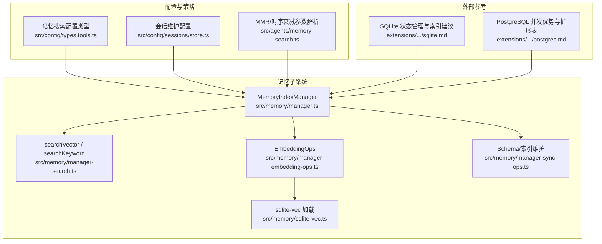
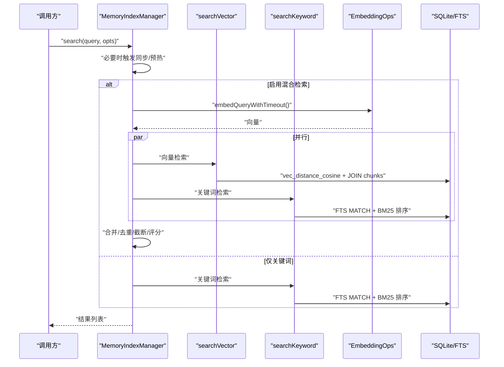
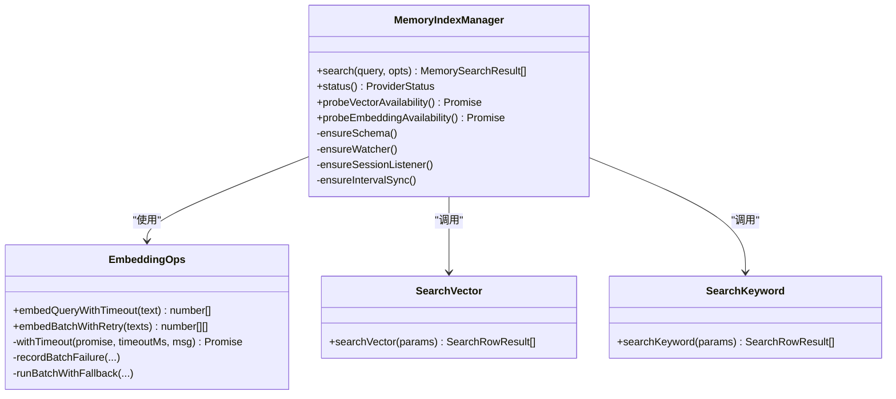
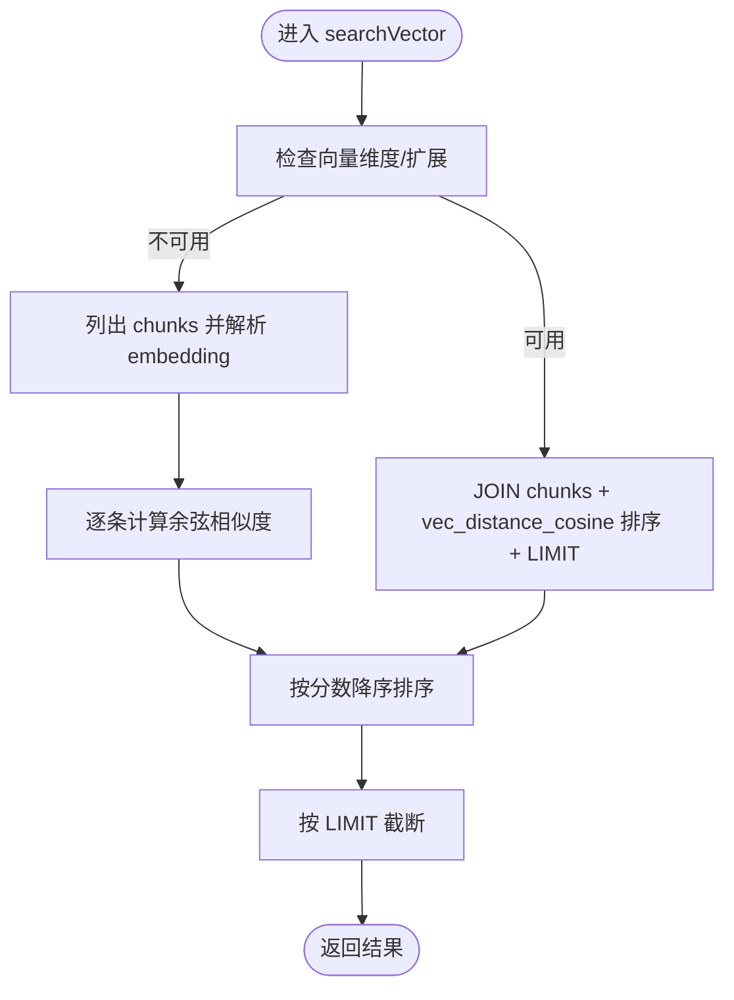
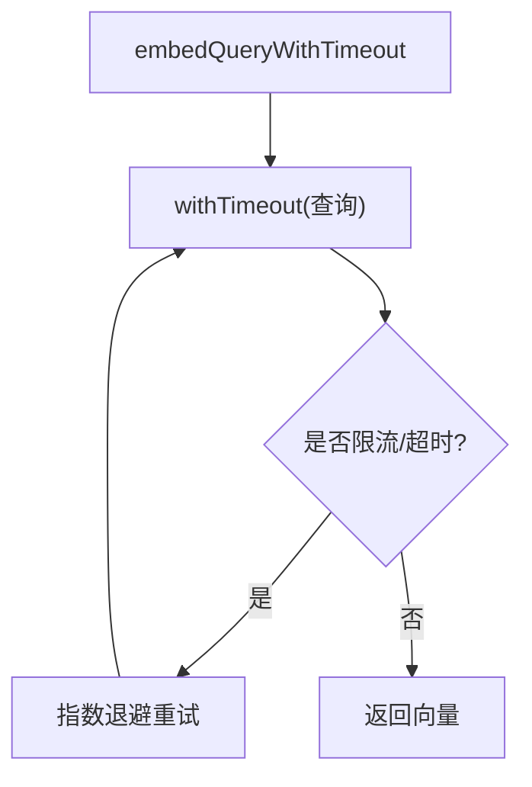
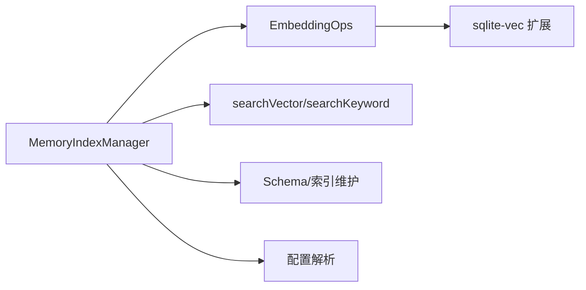

# 数据库查询优化

<cite>
**本文引用的文件**
- [src/memory/manager.ts](file://src/memory/manager.ts)
- [src/memory/manager-search.ts](file://src/memory/manager-search.ts)
- [src/memory/manager-embedding-ops.ts](file://src/memory/manager-embedding-ops.ts)
- [src/memory/sqlite-vec.ts](file://src/memory/sqlite-vec.ts)
- [src/memory/manager-sync-ops.ts](file://src/memory/manager-sync-ops.ts)
- [src/config/types.tools.ts](file://src/config/types.tools.ts)
- [src/agents/memory-search.ts](file://src/agents/memory-search.ts)
- [src/config/sessions/store.ts](file://src/config/sessions/store.ts)
- [extensions/open-prose/skills/prose/state/sqlite.md](file://extensions/open-prose/skills/prose/state/sqlite.md)
- [extensions/open-prose/skills/prose/state/postgres.md](file://extensions/open-prose/skills/prose/state/postgres.md)
- [src/memory/qmd-manager.ts](file://src/memory/qmd-manager.ts)
</cite>

## 目录

1. [简介](#简介)
2. [项目结构](#项目结构)
3. [核心组件](#核心组件)
4. [架构总览](#架构总览)
5. [详细组件分析](#详细组件分析)
6. [依赖关系分析](#依赖关系分析)
7. [性能考量](#性能考量)
8. [故障排查指南](#故障排查指南)
9. [结论](#结论)
10. [附录](#附录)

## 简介

本指南聚焦于 OpenClaw 的数据库查询优化实践，围绕 SQLite 向量检索、混合检索（BM25 + 向量）、缓存层设计、批处理与重试、慢查询检测与执行计划分析、以及数据维护（分区/归档/清理）展开。文档结合实际源码路径，给出可操作的优化建议与最佳实践，帮助在大规模数据场景下稳定、高效地运行内存检索与会话管理。

## 项目结构

OpenClaw 的数据库相关能力主要集中在“记忆”子系统中，采用 SQLite 作为本地索引存储，并通过 sqlite-vec 扩展支持向量相似度计算。同时提供 FTS（全文搜索）作为降级与补充方案。配置项集中于工具配置类型定义中，便于统一治理。

图表来源

- [src/memory/manager.ts](file://src/memory/manager.ts#L1-L641)
- [src/memory/manager-search.ts](file://src/memory/manager-search.ts#L1-L192)
- [src/memory/manager-embedding-ops.ts](file://src/memory/manager-embedding-ops.ts#L1-L808)
- [src/memory/sqlite-vec.ts](file://src/memory/sqlite-vec.ts#L1-L24)
- [src/memory/manager-sync-ops.ts](file://src/memory/manager-sync-ops.ts#L342-L1123)
- [src/config/types.tools.ts](file://src/config/types.tools.ts#L304-L418)
- [src/agents/memory-search.ts](file://src/agents/memory-search.ts#L316-L361)
- [src/config/sessions/store.ts](file://src/config/sessions/store.ts#L328-L656)
- [extensions/open-prose/skills/prose/state/sqlite.md](file://extensions/open-prose/skills/prose/state/sqlite.md#L515-L546)
- [extensions/open-prose/skills/prose/state/postgres.md](file://extensions/open-prose/skills/prose/state/postgres.md#L652-L668)

章节来源

- [src/memory/manager.ts](file://src/memory/manager.ts#L1-L641)
- [src/memory/manager-search.ts](file://src/memory/manager-search.ts#L1-L192)
- [src/memory/manager-embedding-ops.ts](file://src/memory/manager-embedding-ops.ts#L1-L808)
- [src/memory/sqlite-vec.ts](file://src/memory/sqlite-vec.ts#L1-L24)
- [src/memory/manager-sync-ops.ts](file://src/memory/manager-sync-ops.ts#L342-L1123)
- [src/config/types.tools.ts](file://src/config/types.tools.ts#L304-L418)
- [src/agents/memory-search.ts](file://src/agents/memory-search.ts#L316-L361)
- [src/config/sessions/store.ts](file://src/config/sessions/store.ts#L328-L656)
- [extensions/open-prose/skills/prose/state/sqlite.md](file://extensions/open-prose/skills/prose/state/sqlite.md#L515-L546)
- [extensions/open-prose/skills/prose/state/postgres.md](file://extensions/open-prose/skills/prose/state/postgres.md#L652-L668)

## 核心组件

- MemoryIndexManager：负责打开数据库、构建/校验模式、监听文件变化、按需同步、执行混合检索（向量+关键词），并提供状态查询。
- 检索函数：searchVector（向量相似度）、searchKeyword（FTS/BM25）。
- EmbeddingOps：封装嵌入生成、批处理、缓存、超时与重试、并发控制、回退策略。
- sqlite-vec：加载向量扩展，启用向量距离函数。
- Schema/索引维护：确保表结构、FTS 可用性、重建与原子切换。
- 配置：记忆搜索、批处理、缓存、查询权重、候选倍数、MMR、时序衰减等。
- 会话维护：会话文件轮转、裁剪、保留期控制。

章节来源

- [src/memory/manager.ts](file://src/memory/manager.ts#L43-L641)
- [src/memory/manager-search.ts](file://src/memory/manager-search.ts#L20-L192)
- [src/memory/manager-embedding-ops.ts](file://src/memory/manager-embedding-ops.ts#L43-L808)
- [src/memory/sqlite-vec.ts](file://src/memory/sqlite-vec.ts#L1-L24)
- [src/memory/manager-sync-ops.ts](file://src/memory/manager-sync-ops.ts#L342-L1123)
- [src/config/types.tools.ts](file://src/config/types.tools.ts#L304-L418)
- [src/config/sessions/store.ts](file://src/config/sessions/store.ts#L328-L656)

## 架构总览

OpenClaw 的检索链路由“查询预处理（关键词抽取/扩展）→ 向量检索（sqlite-vec）+ 关键词检索（FTS/BM25）→ 结果合并（权重/去重/排序）→ 截断与返回”构成。嵌入生成支持批处理与缓存，具备超时与重试、失败回退至非批处理路径的能力。

图表来源

- [src/memory/manager.ts](file://src/memory/manager.ts#L207-L293)
- [src/memory/manager-search.ts](file://src/memory/manager-search.ts#L20-L192)
- [src/memory/manager-embedding-ops.ts](file://src/memory/manager-embedding-ops.ts#L548-L559)

## 详细组件分析

### 组件A：MemoryIndexManager（检索入口与状态）

- 职责
  - 打开/迁移数据库、确保模式与 FTS 可用、监听与定时同步。
  - 混合检索：向量检索 + 关键词检索，支持候选倍数、最小分数、最大结果数。
  - 提供状态接口：文件/块计数、缓存条目、向量可用性、批处理失败统计等。
- 关键点
  - 搜索前根据配置决定是否触发同步（按需/启动/会话开始）。
  - FTS-only 模式下仅关键词检索，并对查询进行关键词抽取增强匹配。
  - 混合检索时，候选集大小受“候选倍数”限制，避免无界扫描。
  - 截断与评分：文本分数经 BM25 到 Score 映射，最终按 minScore 与 maxResults 截断。

图表来源

- [src/memory/manager.ts](file://src/memory/manager.ts#L207-L293)
- [src/memory/manager-embedding-ops.ts](file://src/memory/manager-embedding-ops.ts#L495-L559)
- [src/memory/manager-search.ts](file://src/memory/manager-search.ts#L20-L94)

章节来源

- [src/memory/manager.ts](file://src/memory/manager.ts#L207-L293)
- [src/memory/manager.ts](file://src/memory/manager.ts#L470-L576)

### 组件B：向量检索与 FTS 检索

- 向量检索
  - 使用 sqlite-vec 的向量距离函数，先 JOIN chunks 获取文本片段，再按余弦距离升序排序，限制返回数量。
  - 当向量维度未知或扩展未加载时，回退到从 chunks 表读取 embedding 字段并计算余弦相似度。
- 关键词检索（FTS/BM25）
  - 构造 FTS 查询，按 BM25 排名字段排序，支持模型过滤（FTS-only 模式下不过滤）。
- 候选集与截断
  - 候选集大小 = maxResults × 候选倍数，避免全表扫描。
  - 最终按 minScore 截断，保证质量阈值。

图表来源

- [src/memory/manager-search.ts](file://src/memory/manager-search.ts#L20-L94)

章节来源

- [src/memory/manager-search.ts](file://src/memory/manager-search.ts#L20-L94)

### 组件C：嵌入生成、批处理与缓存

- 批处理
  - 将文本切分为批次，按令牌预算上限分组，支持 OpenAI/Gemini/Voyage 批处理 API。
  - 支持等待完成、并发度、轮询间隔、超时时间等参数。
- 缓存
  - 嵌入结果按 provider/model/providerKey/hash 建立缓存，插入时 ON CONFLICT 更新时间戳。
  - 支持按最大条目数进行淘汰（按更新时间升序删除）。
- 超时与重试
  - 单次查询/批量均有限时，超时或限流错误自动指数退避重试，失败次数超过阈值则禁用批处理并回退。
- 并发与回退
  - 批处理失败时记录失败计数与原因，必要时禁用批处理并回退到逐条生成路径。

图表来源

- [src/memory/manager-embedding-ops.ts](file://src/memory/manager-embedding-ops.ts#L548-L559)
- [src/memory/manager-embedding-ops.ts](file://src/memory/manager-embedding-ops.ts#L561-L580)
- [src/memory/manager-embedding-ops.ts](file://src/memory/manager-embedding-ops.ts#L534-L538)

章节来源

- [src/memory/manager-embedding-ops.ts](file://src/memory/manager-embedding-ops.ts#L495-L559)
- [src/memory/manager-embedding-ops.ts](file://src/memory/manager-embedding-ops.ts#L561-L580)
- [src/memory/manager-embedding-ops.ts](file://src/memory/manager-embedding-ops.ts#L582-L687)

### 组件D：配置与查询策略

- 记忆搜索配置
  - 启用/禁用、来源（memory/sessions）、额外路径、提供者（openai/gemini/local/voyage/mistral）、远程/本地/回退策略、模型、存储驱动（sqlite）、向量扩展、缓存容量、分块策略、同步策略、查询权重（向量/文本）、候选倍数、MMR、时序衰减。
- 查询参数解析
  - 归一化向量/文本权重、候选倍数、MMR λ、时序半衰期天数、缓存开关与最大条目。
- 会话维护配置
  - 清理窗口（按时间/字节）、轮转阈值、归档保留期、磁盘上限、高水位线等。

章节来源

- [src/config/types.tools.ts](file://src/config/types.tools.ts#L304-L418)
- [src/agents/memory-search.ts](file://src/agents/memory-search.ts#L316-L361)
- [src/config/sessions/store.ts](file://src/config/sessions/store.ts#L328-L378)
- [src/config/sessions/store.ts](file://src/config/sessions/store.ts#L570-L627)

### 组件E：索引模式与向量扩展

- 模式校验与 FTS 可用性
  - 初始化时确保表结构、FTS 可用性，记录错误信息。
- 向量扩展加载
  - 自动或指定路径加载 sqlite-vec，启用向量距离函数，用于高性能相似度检索。
- 原子重建与切换
  - 通过临时文件与原子替换方式重建索引，避免并发写锁导致的不一致。

章节来源

- [src/memory/manager-sync-ops.ts](file://src/memory/manager-sync-ops.ts#L342-L354)
- [src/memory/sqlite-vec.ts](file://src/memory/sqlite-vec.ts#L1-L24)
- [src/memory/manager-sync-ops.ts](file://src/memory/manager-sync-ops.ts#L1083-L1103)

### 组件F：慢查询检测与执行计划分析

- 慢查询识别
  - 嵌入查询/批处理均设置超时，超时即视为慢查询，记录错误消息。
  - 批处理失败（含超时）会增加失败计数，达到阈值后禁用批处理并回退，有助于定位瓶颈。
- 执行计划分析
  - 向量检索使用 JOIN chunks 与向量距离函数，建议在 chunks/id/model/source 上建立合适索引以减少全表扫描。
  - 关键词检索使用 FTS MATCH + BM25 排序，建议确保 FTS 表存在且可用。
- 外部参考
  - SQLite 状态文档建议为常见查询模式创建索引（如执行状态）。
  - PostgreSQL 文档强调行级锁带来的并发优势，可借鉴其索引与查询模式设计思路。

章节来源

- [src/memory/manager-embedding-ops.ts](file://src/memory/manager-embedding-ops.ts#L540-L546)
- [src/memory/manager-search.ts](file://src/memory/manager-search.ts#L35-L44)
- [extensions/open-prose/skills/prose/state/sqlite.md](file://extensions/open-prose/skills/prose/state/sqlite.md#L515-L546)
- [extensions/open-prose/skills/prose/state/postgres.md](file://extensions/open-prose/skills/prose/state/postgres.md#L652-L668)

### 组件G：数据分区、归档与清理

- 会话文件轮转
  - 超过阈值字节时重命名当前文件为备份，并清理旧备份（默认保留最近 3 份）。
- 会话维护策略
  - 清理窗口（按时间/字节）、归档保留期、磁盘上限、高水位线等，支持“告警模式”仅警告不强制执行。
- 内存索引维护
  - 支持安全重建索引、原子切换、失败回滚，确保一致性与可用性。

章节来源

- [src/config/sessions/store.ts](file://src/config/sessions/store.ts#L570-L627)
- [src/config/sessions/store.ts](file://src/config/sessions/store.ts#L328-L378)
- [src/memory/manager-sync-ops.ts](file://src/memory/manager-sync-ops.ts#L1105-L1123)

## 依赖关系分析

- 组件耦合
  - MemoryIndexManager 依赖 EmbeddingOps（生成向量）、manager-search（向量/关键词检索）、sqlite-vec（向量扩展）、manager-sync-ops（模式/索引维护）。
- 外部依赖
  - sqlite-vec 扩展加载失败不影响 FTS-only 模式下的关键词检索。
- 循环依赖
  - 未发现直接循环依赖；模块职责清晰，通过函数调用解耦。

图表来源

- [src/memory/manager.ts](file://src/memory/manager.ts#L1-L641)
- [src/memory/manager-embedding-ops.ts](file://src/memory/manager-embedding-ops.ts#L1-L808)
- [src/memory/manager-search.ts](file://src/memory/manager-search.ts#L1-L192)
- [src/memory/sqlite-vec.ts](file://src/memory/sqlite-vec.ts#L1-L24)
- [src/memory/manager-sync-ops.ts](file://src/memory/manager-sync-ops.ts#L342-L1123)
- [src/config/types.tools.ts](file://src/config/types.tools.ts#L304-L418)

章节来源

- [src/memory/manager.ts](file://src/memory/manager.ts#L1-L641)
- [src/memory/manager-embedding-ops.ts](file://src/memory/manager-embedding-ops.ts#L1-L808)
- [src/memory/manager-search.ts](file://src/memory/manager-search.ts#L1-L192)
- [src/memory/sqlite-vec.ts](file://src/memory/sqlite-vec.ts#L1-L24)
- [src/memory/manager-sync-ops.ts](file://src/memory/manager-sync-ops.ts#L342-L1123)
- [src/config/types.tools.ts](file://src/config/types.tools.ts#L304-L418)

## 性能考量

- 向量检索
  - 使用 sqlite-vec 的向量距离函数，避免纯 JS 计算；确保 chunks/id/model/source 上有合适索引。
  - 候选倍数与 LIMIT 控制扫描规模，避免全表遍历。
- 关键词检索
  - FTS MATCH + BM25 排序，建议保持 FTS 表可用并在常用列上维持索引。
- 嵌入生成
  - 批处理显著降低 API 调用次数与延迟；缓存命中可大幅减少重复请求。
  - 超时与重试策略避免单点阻塞；失败回退保障稳定性。
- 并发与锁
  - SQLite 事务与 WAL 模式提升并发写入能力；注意避免长时间持有长事务。
- 会话与索引维护
  - 定时重建与原子切换减少碎片与锁竞争；轮转与裁剪控制磁盘占用。

[本节为通用指导，不直接分析具体文件]

## 故障排查指南

- “数据库被锁定/忙”
  - 现象：SQLite Busy 错误，通常由并发写入或长时间事务导致。
  - 处理：降低并发、缩短事务、启用 WAL、避免长时间持有锁；必要时重试或降级为只读查询。
  - 参考：内部错误判断与等待逻辑。
- 向量扩展加载失败
  - 现象：sqlite-vec 无法加载，向量检索回退到 CPU 计算。
  - 处理：检查扩展路径、权限与兼容性；确认已启用扩展加载。
- 批处理失败/超时
  - 现象：批处理任务超时或限流，失败计数上升，最终禁用批处理。
  - 处理：调整并发、轮询间隔、超时；检查网络与配额；观察回退路径是否正常。
- 慢查询
  - 现象：嵌入查询/批处理超时，或检索响应缓慢。
  - 处理：查看超时日志与失败计数；评估候选倍数与 LIMIT；检查索引与查询计划。

章节来源

- [src/memory/qmd-manager.ts](file://src/memory/qmd-manager.ts#L1746-L1778)
- [src/memory/sqlite-vec.ts](file://src/memory/sqlite-vec.ts#L1-L24)
- [src/memory/manager-embedding-ops.ts](file://src/memory/manager-embedding-ops.ts#L631-L687)
- [src/memory/manager-embedding-ops.ts](file://src/memory/manager-embedding-ops.ts#L540-L546)

## 结论

OpenClaw 的数据库查询优化以“向量检索 + 关键词检索”的混合策略为核心，配合嵌入缓存、批处理与超时重试、原子索引维护与会话文件轮转，形成一套可扩展、可恢复的本地检索体系。通过合理配置候选倍数、权重、MMR 与时序衰减，可在大规模数据场景下获得稳定、高效的检索体验。

[本节为总结性内容，不直接分析具体文件]

## 附录

- 具体查询优化案例与性能提升建议
  - 案例1：提高候选倍数与 LIMIT 的平衡
    - 现状：检索结果不足或过慢。
    - 优化：适度提高候选倍数，同时降低 LIMIT；确保向量扩展可用。
  - 案例2：启用嵌入缓存与批处理
    - 现状：重复查询耗时高。
    - 优化：开启缓存并设置合理最大条目；启用批处理并调整并发与轮询间隔。
  - 案例3：索引与查询计划
    - 现状：向量检索慢。
    - 优化：为 chunks/id/model/source 建立索引；使用 EXPLAIN QUERY PLAN 分析；减少 JOIN 与全表扫描。
- 大规模数据最佳实践
  - 使用 WAL 模式与原子重建，降低锁竞争。
  - 会话文件轮转与裁剪，控制磁盘占用。
  - 通过 MMR 与时序衰减提升多样性与时效性。
  - 在外部参考（SQLite/PostgreSQL）的索引与并发设计上借鉴经验，持续优化查询模式。

[本节为概念性内容，不直接分析具体文件]
