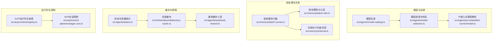
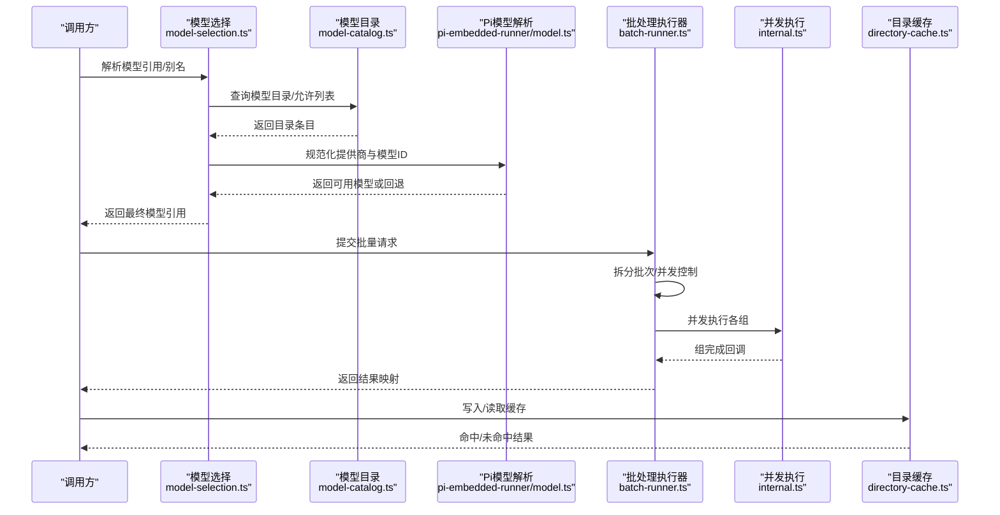
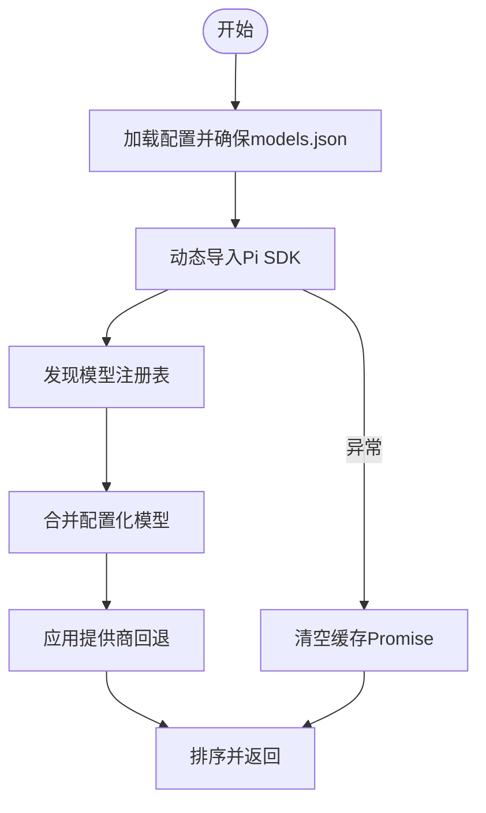
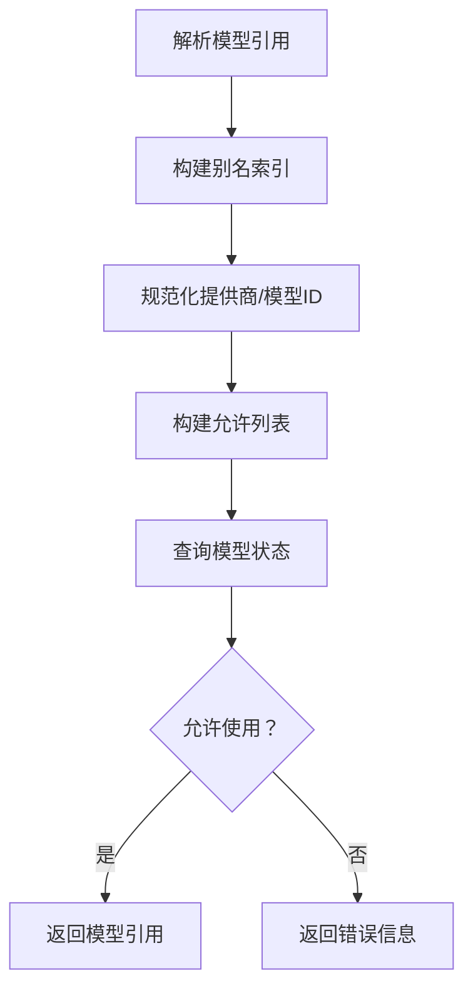
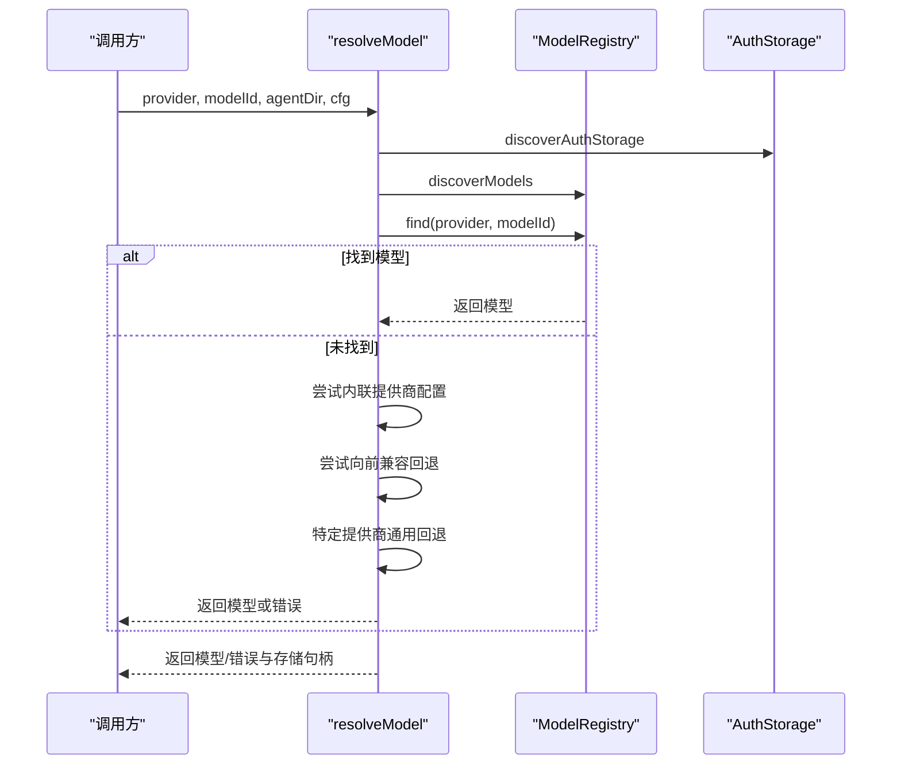
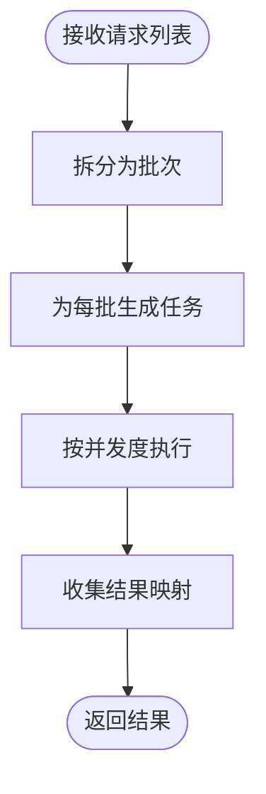
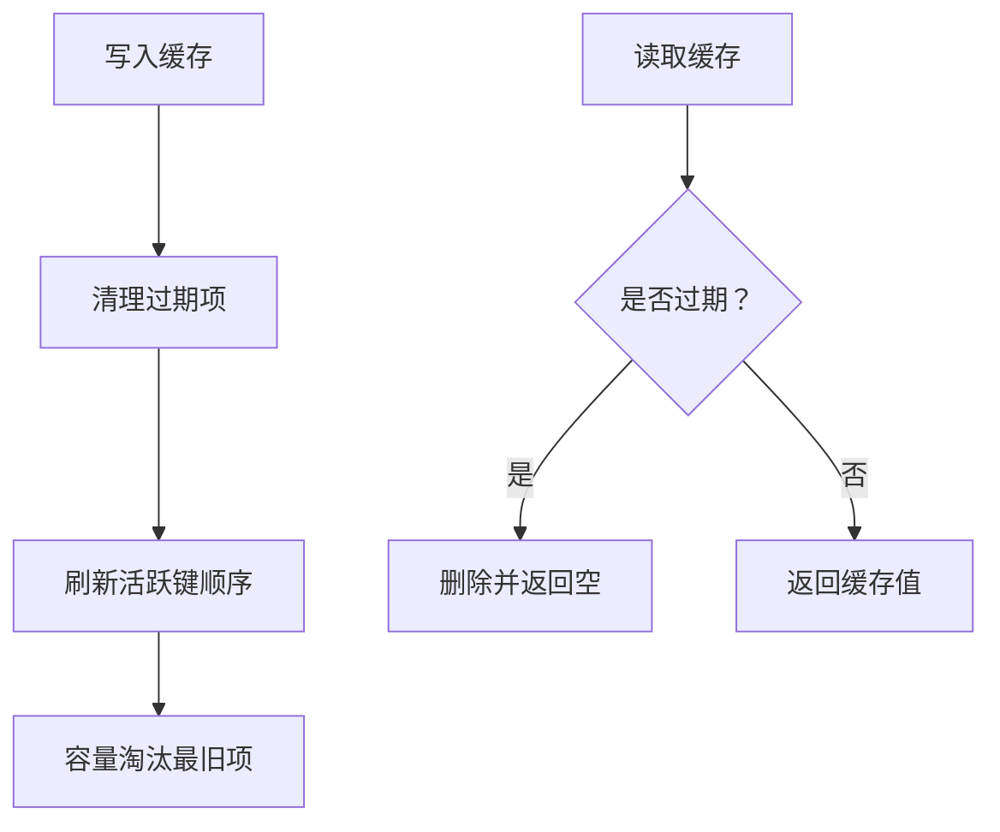
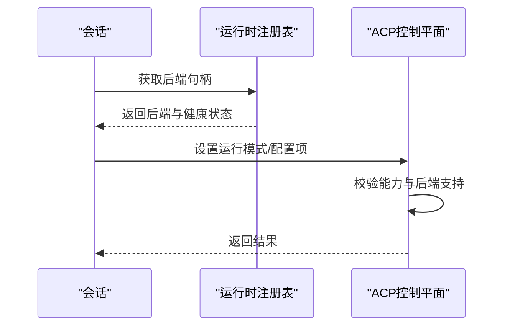
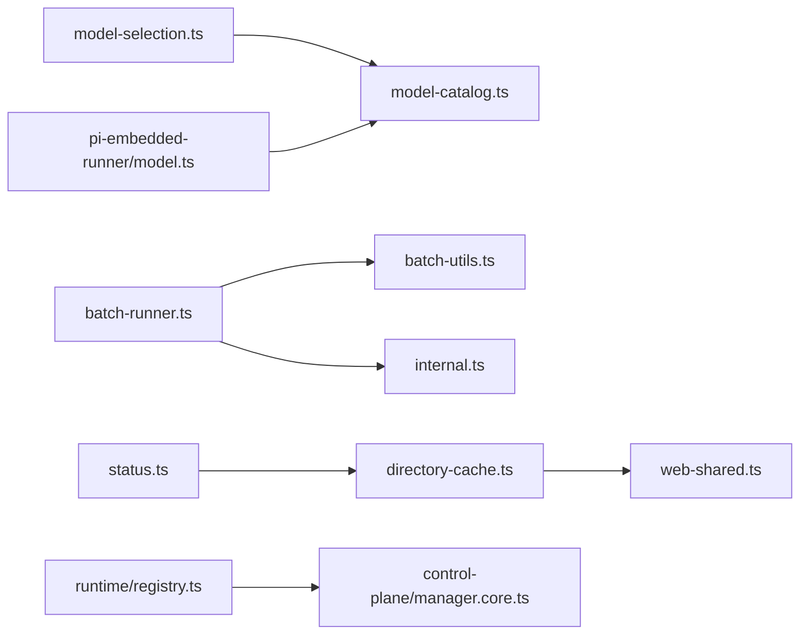

# 模型推理优化

<cite>
**本文引用的文件**
- [src/agents/model-catalog.ts](file://src/agents/model-catalog.ts)
- [src/agents/model-selection.ts](file://src/agents/model-selection.ts)
- [src/agents/pi-embedded-runner/model.ts](file://src/agents/pi-embedded-runner/model.ts)
- [src/memory/batch-runner.ts](file://src/memory/batch-runner.ts)
- [src/memory/batch-utils.ts](file://src/memory/batch-utils.ts)
- [src/memory/internal.ts](file://src/memory/internal.ts)
- [src/infra/outbound/directory-cache.ts](file://src/infra/outbound/directory-cache.ts)
- [src/agents/tools/web-shared.ts](file://src/agents/tools/web-shared.ts)
- [src/agents/status.ts](file://src/agents/status.ts)
- [src/agents/usage.test.ts](file://src/agents/usage.test.ts)
- [apps/macos/Sources/OpenClaw/ModelCatalogLoader.swift](file://apps/macos/Sources/OpenClaw/ModelCatalogLoader.swift)
- [apps/macos/Sources/OpenClaw/RuntimeLocator.swift](file://apps/macos/Sources/OpenClaw/RuntimeLocator.swift)
- [scripts/test-parallel.mjs](file://scripts/test-parallel.mjs)
- [src/acp/runtime/registry.ts](file://src/acp/runtime/registry.ts)
- [src/acp/control-plane/manager.core.ts](file://src/acp/control-plane/manager.core.ts)
- [docs/zh-CN/platforms/oracle.md](file://docs/zh-CN/platforms/oracle.md)
- [docs/zh-CN/platforms/digitalocean.md](file://docs/zh-CN/platforms/digitalocean.md)
</cite>

## 目录

1. [简介](#简介)
2. [项目结构](#项目结构)
3. [核心组件](#核心组件)
4. [架构总览](#架构总览)
5. [详细组件分析](#详细组件分析)
6. [依赖关系分析](#依赖关系分析)
7. [性能考量](#性能考量)
8. [故障排查指南](#故障排查指南)
9. [结论](#结论)
10. [附录](#附录)

## 简介

本指南聚焦于OpenClaw在模型推理层面的优化实践，围绕以下主题展开：

- 模型管理与选择：目录发现、别名与规范化、允许列表与回退策略
- 推理执行优化：批处理、并发控制、流水线与缓存
- 资源与运行时：GPU/CPU分配、内存映射、计算图优化
- 预取与加速：模型缓存、预取、推理加速库集成
- 不同模型提供商的适配与优化策略
- 边缘与云端部署的差异化优化方案

本指南旨在帮助开发者在不同硬件与平台环境下，系统性地提升模型推理的吞吐、延迟与稳定性。

## 项目结构

OpenClaw在“模型目录”“模型选择”“批处理执行”“缓存与预取”“运行时与控制平面”等模块中实现了推理优化的关键能力。下图展示与推理优化直接相关的模块关系：

**图表来源**

- [src/agents/model-catalog.ts](file://src/agents/model-catalog.ts#L157-L242)
- [src/agents/model-selection.ts](file://src/agents/model-selection.ts#L254-L383)
- [src/agents/pi-embedded-runner/model.ts](file://src/agents/pi-embedded-runner/model.ts#L42-L120)
- [src/memory/batch-runner.ts](file://src/memory/batch-runner.ts#L12-L48)
- [src/memory/batch-utils.ts](file://src/memory/batch-utils.ts)
- [src/memory/internal.ts](file://src/memory/internal.ts)
- [src/infra/outbound/directory-cache.ts](file://src/infra/outbound/directory-cache.ts#L44-L98)
- [src/agents/tools/web-shared.ts](file://src/agents/tools/web-shared.ts#L1-L39)
- [src/agents/status.ts](file://src/agents/status.ts#L306-L343)
- [src/acp/runtime/registry.ts](file://src/acp/runtime/registry.ts#L1-L47)
- [src/acp/control-plane/manager.core.ts](file://src/acp/control-plane/manager.core.ts#L385-L422)

**章节来源**

- [src/agents/model-catalog.ts](file://src/agents/model-catalog.ts#L157-L242)
- [src/agents/model-selection.ts](file://src/agents/model-selection.ts#L254-L383)
- [src/agents/pi-embedded-runner/model.ts](file://src/agents/pi-embedded-runner/model.ts#L42-L120)
- [src/memory/batch-runner.ts](file://src/memory/batch-runner.ts#L12-L48)
- [src/infra/outbound/directory-cache.ts](file://src/infra/outbound/directory-cache.ts#L44-L98)
- [src/agents/tools/web-shared.ts](file://src/agents/tools/web-shared.ts#L1-L39)
- [src/agents/status.ts](file://src/agents/status.ts#L306-L343)
- [src/acp/runtime/registry.ts](file://src/acp/runtime/registry.ts#L1-L47)
- [src/acp/control-plane/manager.core.ts](file://src/acp/control-plane/manager.core.ts#L385-L422)

## 核心组件

- 模型目录与发现：动态加载模型目录，合并配置化模型，提供按提供商标识与ID查找的能力，并对特定提供商进行兼容与回退处理。
- 模型选择与别名：解析用户输入，支持别名索引、规范化提供商标识与模型ID，构建允许列表与状态检查，确保模型选择的安全与可控。
- Pi嵌入式模型解析：在本地或远端提供商之间进行模型解析与回退，支持内联提供商配置与向前兼容回退，统一模型能力描述。
- 批处理执行器：将请求拆分为批次，控制并发度与轮询间隔，支持等待完成与超时控制，便于大规模向量嵌入等任务的流水线化。
- 缓存与预取：目录缓存与通用缓存工具提供TTL与容量淘汰策略；状态统计输出缓存命中率，辅助优化缓存参数。
- 运行时与控制：ACP运行时注册表与会话控制接口，支持运行模式切换与配置项更新，为推理资源调度提供基础。

**章节来源**

- [src/agents/model-catalog.ts](file://src/agents/model-catalog.ts#L157-L242)
- [src/agents/model-selection.ts](file://src/agents/model-selection.ts#L254-L383)
- [src/agents/pi-embedded-runner/model.ts](file://src/agents/pi-embedded-runner/model.ts#L42-L120)
- [src/memory/batch-runner.ts](file://src/memory/batch-runner.ts#L12-L48)
- [src/infra/outbound/directory-cache.ts](file://src/infra/outbound/directory-cache.ts#L44-L98)
- [src/agents/tools/web-shared.ts](file://src/agents/tools/web-shared.ts#L1-L39)
- [src/agents/status.ts](file://src/agents/status.ts#L306-L343)
- [src/acp/runtime/registry.ts](file://src/acp/runtime/registry.ts#L1-L47)
- [src/acp/control-plane/manager.core.ts](file://src/acp/control-plane/manager.core.ts#L385-L422)

## 架构总览

下图展示了从“模型选择/解析”到“批处理执行/缓存”的推理优化路径，以及与运行时控制平面的交互：

**图表来源**

- [src/agents/model-selection.ts](file://src/agents/model-selection.ts#L254-L383)
- [src/agents/model-catalog.ts](file://src/agents/model-catalog.ts#L157-L242)
- [src/agents/pi-embedded-runner/model.ts](file://src/agents/pi-embedded-runner/model.ts#L42-L120)
- [src/memory/batch-runner.ts](file://src/memory/batch-runner.ts#L12-L48)
- [src/memory/internal.ts](file://src/memory/internal.ts)
- [src/infra/outbound/directory-cache.ts](file://src/infra/outbound/directory-cache.ts#L44-L98)

## 详细组件分析

### 模型目录与发现（model-catalog.ts）

- 动态导入与错误隔离：在try/catch中动态导入Pi SDK，避免一次性失败污染缓存；当目录为空时不清空缓存，以便后续重试。
- 合并与回退：合并配置化模型，应用特定提供商的回退逻辑（如OpenAI Codex Spark）。
- 查找与排序：提供按提供商标识与模型ID的查找函数，以及按提供商与名称排序的工具。

**图表来源**

- [src/agents/model-catalog.ts](file://src/agents/model-catalog.ts#L157-L242)

**章节来源**

- [src/agents/model-catalog.ts](file://src/agents/model-catalog.ts#L157-L242)

### 模型选择与别名（model-selection.ts）

- 别名索引：支持将别名映射到具体模型引用，并建立键到别名列表的反查。
- 规范化与兼容：提供商ID标准化、模型ID规范化（含Anthropic、Google、OpenRouter等），以及CLI提供商识别。
- 允许列表与状态：构建允许列表集合，判断模型是否在目录中、是否被允许，支持默认模型兜底。

**图表来源**

- [src/agents/model-selection.ts](file://src/agents/model-selection.ts#L254-L383)

**章节来源**

- [src/agents/model-selection.ts](file://src/agents/model-selection.ts#L254-L383)

### Pi嵌入式模型解析（pi-embedded-runner/model.ts）

- 解析优先级：先在本地注册表查找，再尝试内联提供商配置，随后向前兼容回退；对特定提供商（如OpenRouter）提供通用回退。
- 错误提示：针对需要显式认证的本地提供商（如Ollama、vLLM）给出明确提示，减少配置歧义。

**图表来源**

- [src/agents/pi-embedded-runner/model.ts](file://src/agents/pi-embedded-runner/model.ts#L42-L120)

**章节来源**

- [src/agents/pi-embedded-runner/model.ts](file://src/agents/pi-embedded-runner/model.ts#L42-L120)

### 批处理执行器（batch-runner.ts）

- 批次拆分：根据最大请求数拆分请求为多个批次。
- 并发控制：通过runWithConcurrency限制并发度，支持等待完成与超时控制。
- 结果映射：维护按自定义ID的索引映射，便于后续聚合与追踪。

**图表来源**

- [src/memory/batch-runner.ts](file://src/memory/batch-runner.ts#L12-L48)
- [src/memory/batch-utils.ts](file://src/memory/batch-utils.ts)
- [src/memory/internal.ts](file://src/memory/internal.ts)

**章节来源**

- [src/memory/batch-runner.ts](file://src/memory/batch-runner.ts#L12-L48)

### 缓存与预取（directory-cache.ts 与 web-shared.ts）

- 目录缓存：支持TTL过期清理与容量上限淘汰，按插入顺序刷新活跃键，避免频繁失效。
- 通用缓存工具：提供超时、TTL、键归一化与读取逻辑，便于跨模块复用。
- 状态统计：输出缓存命中率、读写统计，辅助评估缓存效果。

**图表来源**

- [src/infra/outbound/directory-cache.ts](file://src/infra/outbound/directory-cache.ts#L44-L98)
- [src/agents/tools/web-shared.ts](file://src/agents/tools/web-shared.ts#L1-L39)
- [src/agents/status.ts](file://src/agents/status.ts#L306-L343)

**章节来源**

- [src/infra/outbound/directory-cache.ts](file://src/infra/outbound/directory-cache.ts#L44-L98)
- [src/agents/tools/web-shared.ts](file://src/agents/tools/web-shared.ts#L1-L39)
- [src/agents/status.ts](file://src/agents/status.ts#L306-L343)

### 运行时与控制（ACP）

- 运行时注册表：全局状态保存后端映射，健康检查与规范化后端ID。
- 会话控制：支持设置会话运行模式与配置项，校验控制能力与后端支持。

**图表来源**

- [src/acp/runtime/registry.ts](file://src/acp/runtime/registry.ts#L1-L47)
- [src/acp/control-plane/manager.core.ts](file://src/acp/control-plane/manager.core.ts#L385-L422)

**章节来源**

- [src/acp/runtime/registry.ts](file://src/acp/runtime/registry.ts#L1-L47)
- [src/acp/control-plane/manager.core.ts](file://src/acp/control-plane/manager.core.ts#L385-L422)

## 依赖关系分析

- 模块耦合：模型选择依赖模型目录；Pi模型解析依赖目录与配置；批处理执行器依赖并发与工具模块；缓存模块被多处使用。
- 外部依赖：Pi SDK动态导入、ACP运行时后端、平台文档（Oracle/DigitalOcean）用于部署参考。
- 循环依赖：当前模块间无明显循环依赖迹象。

**图表来源**

- [src/agents/model-selection.ts](file://src/agents/model-selection.ts#L254-L383)
- [src/agents/model-catalog.ts](file://src/agents/model-catalog.ts#L157-L242)
- [src/agents/pi-embedded-runner/model.ts](file://src/agents/pi-embedded-runner/model.ts#L42-L120)
- [src/memory/batch-runner.ts](file://src/memory/batch-runner.ts#L12-L48)
- [src/memory/batch-utils.ts](file://src/memory/batch-utils.ts)
- [src/memory/internal.ts](file://src/memory/internal.ts)
- [src/infra/outbound/directory-cache.ts](file://src/infra/outbound/directory-cache.ts#L44-L98)
- [src/agents/tools/web-shared.ts](file://src/agents/tools/web-shared.ts#L1-L39)
- [src/agents/status.ts](file://src/agents/status.ts#L306-L343)
- [src/acp/runtime/registry.ts](file://src/acp/runtime/registry.ts#L1-L47)
- [src/acp/control-plane/manager.core.ts](file://src/acp/control-plane/manager.core.ts#L385-L422)

**章节来源**

- [src/agents/model-selection.ts](file://src/agents/model-selection.ts#L254-L383)
- [src/agents/model-catalog.ts](file://src/agents/model-catalog.ts#L157-L242)
- [src/agents/pi-embedded-runner/model.ts](file://src/agents/pi-embedded-runner/model.ts#L42-L120)
- [src/memory/batch-runner.ts](file://src/memory/batch-runner.ts#L12-L48)
- [src/infra/outbound/directory-cache.ts](file://src/infra/outbound/directory-cache.ts#L44-L98)
- [src/agents/tools/web-shared.ts](file://src/agents/tools/web-shared.ts#L1-L39)
- [src/agents/status.ts](file://src/agents/status.ts#L306-L343)
- [src/acp/runtime/registry.ts](file://src/acp/runtime/registry.ts#L1-L47)
- [src/acp/control-plane/manager.core.ts](file://src/acp/control-plane/manager.core.ts#L385-L422)

## 性能考量

- 批处理与并发
  - 使用批处理执行器将大量请求拆分为批次，结合并发度控制，避免单点拥塞与超时。
  - 合理设置轮询间隔与超时，平衡吞吐与延迟。
- 缓存与预取
  - 目录缓存与通用缓存工具配合TTL与容量淘汰，降低重复访问开销。
  - 通过状态统计观察命中率，动态调整TTL与容量。
- 运行时与资源
  - ACP运行时注册表与会话控制接口可用于动态切换运行模式与配置项，适配不同负载场景。
  - 并发测试脚本提供不同内存环境下的并发分配建议，指导本地与CI环境的资源规划。

**章节来源**

- [src/memory/batch-runner.ts](file://src/memory/batch-runner.ts#L12-L48)
- [src/infra/outbound/directory-cache.ts](file://src/infra/outbound/directory-cache.ts#L44-L98)
- [src/agents/status.ts](file://src/agents/status.ts#L306-L343)
- [src/acp/runtime/registry.ts](file://src/acp/runtime/registry.ts#L1-L47)
- [src/acp/control-plane/manager.core.ts](file://src/acp/control-plane/manager.core.ts#L385-L422)
- [scripts/test-parallel.mjs](file://scripts/test-parallel.mjs#L239-L269)

## 故障排查指南

- 模型未知或认证问题
  - 当模型解析失败时，针对需要显式认证的本地提供商（如Ollama、vLLM）会给出明确提示，检查环境变量与配置。
- 缓存异常
  - 目录缓存与通用缓存均支持过期清理与容量淘汰；若出现命中异常，检查TTL与容量设置。
- 并发与超时
  - 批处理执行器支持等待与超时控制；若出现长时间阻塞，检查并发度与轮询间隔设置。
- 运行时健康
  - 运行时注册表提供健康检查钩子；若后端不可用，检查后端状态与能力声明。

**章节来源**

- [src/agents/pi-embedded-runner/model.ts](file://src/agents/pi-embedded-runner/model.ts#L133-L148)
- [src/infra/outbound/directory-cache.ts](file://src/infra/outbound/directory-cache.ts#L44-L98)
- [src/agents/tools/web-shared.ts](file://src/agents/tools/web-shared.ts#L1-L39)
- [src/memory/batch-runner.ts](file://src/memory/batch-runner.ts#L12-L48)
- [src/acp/runtime/registry.ts](file://src/acp/runtime/registry.ts#L38-L47)

## 结论

OpenClaw在模型目录与选择、Pi模型解析、批处理与并发、缓存与预取、运行时控制等方面提供了系统性的推理优化能力。通过合理配置允许列表、启用批处理与并发控制、利用缓存与预取、结合ACP运行时管理，可在边缘与云端环境中获得稳定且高效的推理性能。针对不同提供商与平台，建议依据本文提供的策略与流程进行落地与迭代。

## 附录

- 平台部署参考
  - Oracle Cloud（ARM免费层）与DigitalOcean（付费VPS）的成本与配置对比，可作为边缘与轻量云端部署的参考。

**章节来源**

- [docs/zh-CN/platforms/oracle.md](file://docs/zh-CN/platforms/oracle.md#L28-L39)
- [docs/zh-CN/platforms/digitalocean.md](file://docs/zh-CN/platforms/digitalocean.md#L26-L33)
