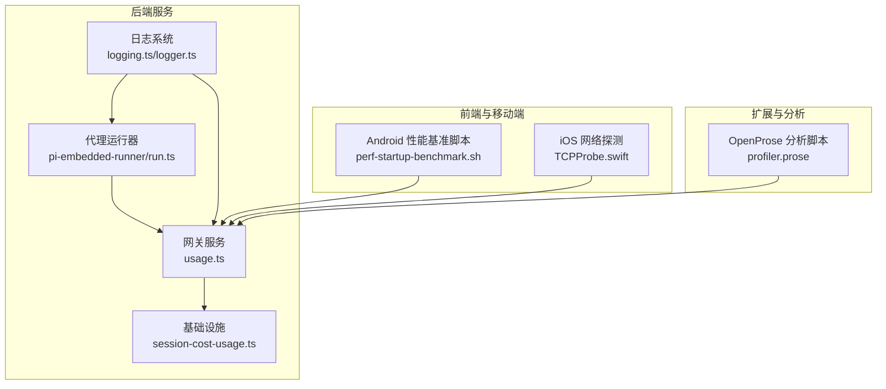
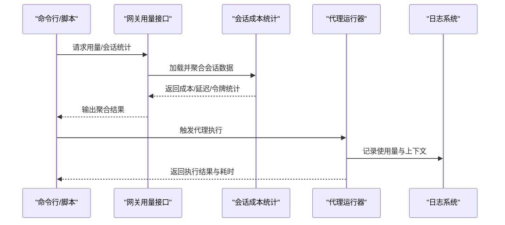
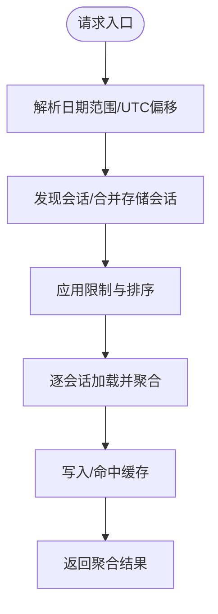
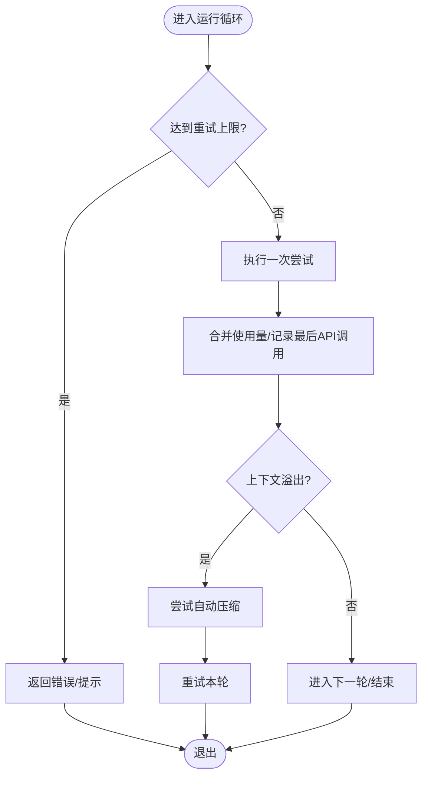
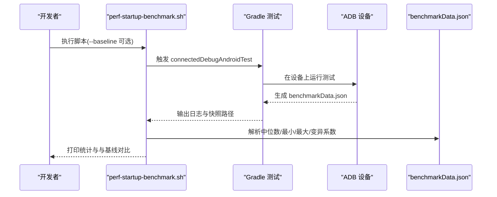
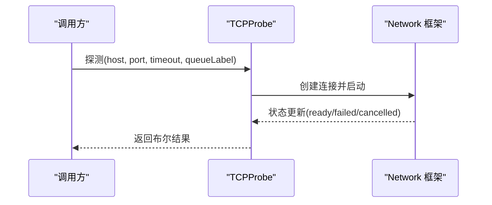
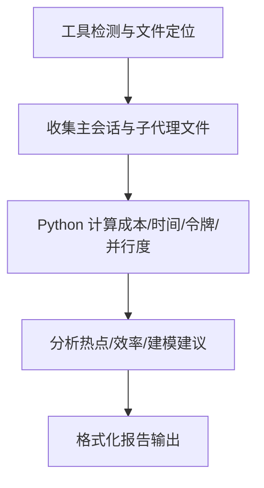
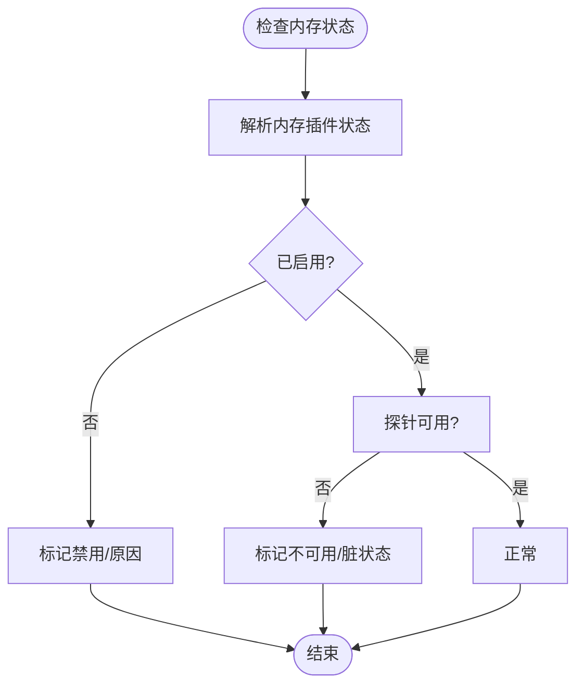
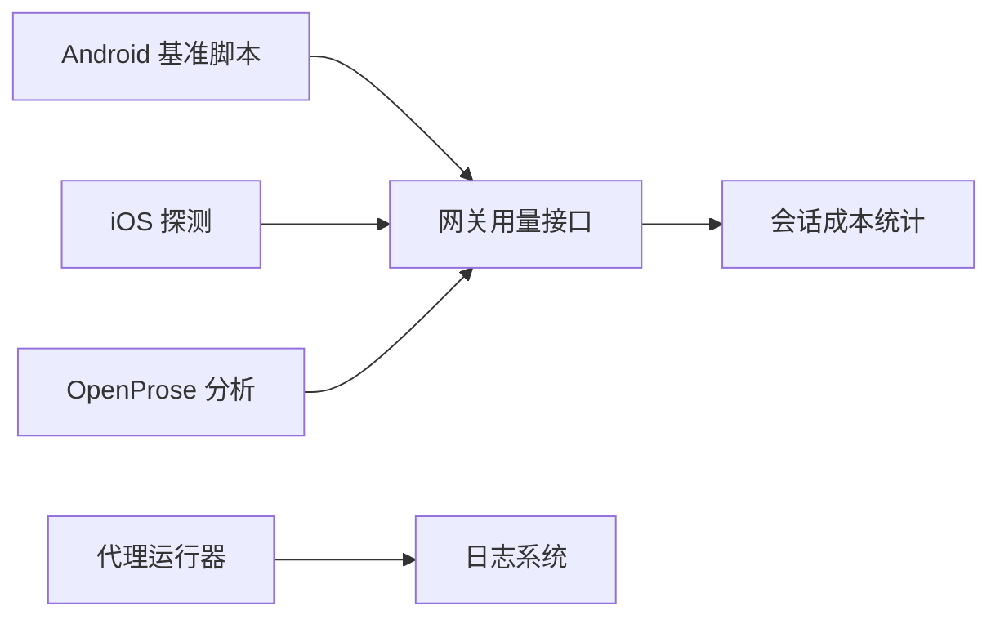

# 系统性能瓶颈识别

<cite>
**本文档引用的文件**
- [src/logging.ts](file://src/logging.ts)
- [src/logger.ts](file://src/logger.ts)
- [scripts/bench-model.ts](file://scripts/bench-model.ts)
- [src/gateway/server-methods/usage.ts](file://src/gateway/server-methods/usage.ts)
- [src/infra/session-cost-usage.ts](file://src/infra/session-cost-usage.ts)
- [src/agents/pi-embedded-runner/run.ts](file://src/agents/pi-embedded-runner/run.ts)
- [apps/android/scripts/perf-startup-benchmark.sh](file://apps/android/scripts/perf-startup-benchmark.sh)
- [apps/android/README.md](file://apps/android/README.md)
- [extensions/open-prose/skills/prose/lib/profiler.prose](file://extensions/open-prose/skills/prose/lib/profiler.prose)
- [apps/ios/Sources/Gateway/TCPProbe.swift](file://apps/ios/Sources/Gateway/TCPProbe.swift)
- [src/auto-reply/status.ts](file://src/auto-reply/status.ts)
- [src/commands/status.command.ts](file://src/commands/status.command.ts)
- [src/cli/memory-cli.ts](file://src/cli/memory-cli.ts)
- [apps/macos/Tests/OpenClawIPCTests/CoverageDumpTests.swift](file://apps/macos/Tests/OpenClawIPCTests/CoverageDumpTests.swift)
- [scripts/test-parallel.mjs](file://scripts/test-parallel.mjs)
</cite>

## 目录

1. [引言](#引言)
2. [项目结构](#项目结构)
3. [核心组件](#核心组件)
4. [架构总览](#架构总览)
5. [详细组件分析](#详细组件分析)
6. [依赖关系分析](#依赖关系分析)
7. [性能考量](#性能考量)
8. [故障排查指南](#故障排查指南)
9. [结论](#结论)
10. [附录](#附录)

## 引言

本指南面向OpenClaw系统运维与开发人员，聚焦于性能瓶颈识别与优化实践。内容覆盖CPU密集型任务、内存泄漏与I/O瓶颈的识别方法；系统监控指标采集、性能基准测试与负载测试流程；瓶颈定位技术（火焰图分析、内存快照、网络延迟测量）；以及常见性能问题模式（消息处理延迟、代理执行卡顿、内存使用异常增长）的案例与解决方案。

## 项目结构

OpenClaw采用多语言混合架构：核心逻辑以TypeScript实现，提供网关、会话成本统计、代理运行器等能力；移动端通过Gradle/Shell脚本进行性能基准测试；扩展技能支持外部工具数据采集与分析；日志系统统一输出到控制台与文件，便于性能分析与排障。

图表来源

- [src/gateway/server-methods/usage.ts](file://src/gateway/server-methods/usage.ts#L398-L414)
- [src/infra/session-cost-usage.ts](file://src/infra/session-cost-usage.ts#L462-L738)
- [src/agents/pi-embedded-runner/run.ts](file://src/agents/pi-embedded-runner/run.ts#L192-L210)
- [src/logging.ts](file://src/logging.ts#L1-L70)
- [apps/android/scripts/perf-startup-benchmark.sh](file://apps/android/scripts/perf-startup-benchmark.sh#L1-L125)
- [apps/ios/Sources/Gateway/TCPProbe.swift](file://apps/ios/Sources/Gateway/TCPProbe.swift#L1-L42)
- [extensions/open-prose/skills/prose/lib/profiler.prose](file://extensions/open-prose/skills/prose/lib/profiler.prose#L1-L461)

章节来源

- [src/gateway/server-methods/usage.ts](file://src/gateway/server-methods/usage.ts#L398-L414)
- [src/infra/session-cost-usage.ts](file://src/infra/session-cost-usage.ts#L462-L738)
- [src/agents/pi-embedded-runner/run.ts](file://src/agents/pi-embedded-runner/run.ts#L192-L210)
- [src/logging.ts](file://src/logging.ts#L1-L70)
- [apps/android/scripts/perf-startup-benchmark.sh](file://apps/android/scripts/perf-startup-benchmark.sh#L1-L125)
- [apps/ios/Sources/Gateway/TCPProbe.swift](file://apps/ios/Sources/Gateway/TCPProbe.swift#L1-L42)
- [extensions/open-prose/skills/prose/lib/profiler.prose](file://extensions/open-prose/skills/prose/lib/profiler.prose#L1-L461)

## 核心组件

- 日志系统：统一控制台与文件日志输出，支持子系统日志与时间戳前缀，便于性能分析与排障。
- 网关用量接口：聚合会话成本、消息计数、工具调用、延迟统计与按模型/渠道聚合，支撑性能报表与趋势分析。
- 会话成本统计：解析JSONL转录文件，计算令牌总量、费用、每日用量、延迟分布与模型使用明细。
- 代理运行器：执行嵌入式代理，记录使用量与上下文窗口，支持溢出压缩与工具结果截断，避免上下文超限导致的性能退化。
- 移动端基准脚本：Android冷启动宏基准，输出中位数、最小值、最大值、变异系数，并可与历史快照对比。
- iOS网络探测：基于Network框架对目标主机端口进行TCP探测，评估网络连通性与延迟。
- OpenProse分析：从AI工具会话数据中提取成本、时间、令牌与并行度，生成热点与效率分析报告。
- 内存状态与CLI：检查内存插件状态、向量/全文检索状态、额外内存路径可读性，辅助定位内存相关问题。

章节来源

- [src/logging.ts](file://src/logging.ts#L1-L70)
- [src/logger.ts](file://src/logger.ts#L1-L62)
- [src/gateway/server-methods/usage.ts](file://src/gateway/server-methods/usage.ts#L369-L396)
- [src/infra/session-cost-usage.ts](file://src/infra/session-cost-usage.ts#L462-L738)
- [src/agents/pi-embedded-runner/run.ts](file://src/agents/pi-embedded-runner/run.ts#L83-L180)
- [apps/android/scripts/perf-startup-benchmark.sh](file://apps/android/scripts/perf-startup-benchmark.sh#L1-L125)
- [apps/ios/Sources/Gateway/TCPProbe.swift](file://apps/ios/Sources/Gateway/TCPProbe.swift#L1-L42)
- [extensions/open-prose/skills/prose/lib/profiler.prose](file://extensions/open-prose/skills/prose/lib/profiler.prose#L1-L461)
- [src/auto-reply/status.ts](file://src/auto-reply/status.ts#L306-L343)
- [src/commands/status.command.ts](file://src/commands/status.command.ts#L337-L369)
- [src/cli/memory-cli.ts](file://src/cli/memory-cli.ts#L167-L205)

## 架构总览

下图展示性能相关模块在系统中的交互关系：日志贯穿所有组件；网关用量接口与会话成本统计负责指标采集；代理运行器承载CPU密集型任务；移动端与iOS工具用于端侧与网络层面的性能验证；OpenProse扩展用于跨会话的成本与时间分析。

图表来源

- [src/gateway/server-methods/usage.ts](file://src/gateway/server-methods/usage.ts#L415-L550)
- [src/infra/session-cost-usage.ts](file://src/infra/session-cost-usage.ts#L462-L738)
- [src/agents/pi-embedded-runner/run.ts](file://src/agents/pi-embedded-runner/run.ts#L538-L634)
- [src/logging.ts](file://src/logging.ts#L1-L70)

## 详细组件分析

### 组件A：网关用量接口与会话成本统计

- 职责：提供“用量状态”“成本统计”“会话用量”等接口，聚合令牌、费用、消息计数、工具调用、延迟与按模型/渠道/代理维度的汇总。
- 关键点：
  - 支持日期范围解析与UTC偏移解释，兼容不同地区场景。
  - 使用缓存机制降低重复聚合开销。
  - 汇总延迟统计（均值、P95、最小/最大），并按自然日拆分。
  - 合并发现的会话与存储会话，支持指定会话键或分页限制。
- 性能影响：大范围扫描与聚合可能成为CPU瓶颈；缓存与分页可显著降低压力。

图表来源

- [src/gateway/server-methods/usage.ts](file://src/gateway/server-methods/usage.ts#L415-L550)
- [src/gateway/server-methods/usage.ts](file://src/gateway/server-methods/usage.ts#L550-L800)

章节来源

- [src/gateway/server-methods/usage.ts](file://src/gateway/server-methods/usage.ts#L398-L414)
- [src/gateway/server-methods/usage.ts](file://src/gateway/server-methods/usage.ts#L415-L550)
- [src/gateway/server-methods/usage.ts](file://src/gateway/server-methods/usage.ts#L550-L800)

### 组件B：代理运行器（CPU密集型任务）

- 职责：执行嵌入式代理，管理认证配置、上下文窗口、重试与溢出压缩、工具结果截断，记录使用量与延迟。
- 关键点：
  - 使用累加器记录输入/输出/缓存读写/总令牌，最后API调用的缓存字段用于准确上下文大小。
  - 面对上下文溢出，先尝试自动压缩，再考虑显式压缩与工具结果截断。
  - 受限重试迭代次数，避免长时间阻塞。
- 性能影响：模型调用、工具执行、压缩/截断均为CPU密集操作；合理选择模型与减少不必要的工具调用可显著降本增效。

图表来源

- [src/agents/pi-embedded-runner/run.ts](file://src/agents/pi-embedded-runner/run.ts#L538-L634)
- [src/agents/pi-embedded-runner/run.ts](file://src/agents/pi-embedded-runner/run.ts#L689-L800)
- [src/agents/pi-embedded-runner/run.ts](file://src/agents/pi-embedded-runner/run.ts#L131-L180)

章节来源

- [src/agents/pi-embedded-runner/run.ts](file://src/agents/pi-embedded-runner/run.ts#L192-L210)
- [src/agents/pi-embedded-runner/run.ts](file://src/agents/pi-embedded-runner/run.ts#L538-L634)
- [src/agents/pi-embedded-runner/run.ts](file://src/agents/pi-embedded-runner/run.ts#L689-L800)
- [src/agents/pi-embedded-runner/run.ts](file://src/agents/pi-embedded-runner/run.ts#L131-L180)

### 组件C：移动端冷启动性能基准（Android）

- 职责：运行冷启动宏基准，输出中位数、最小值、最大值、变异系数，并保存快照；可与历史快照对比，计算Δms与Δ%。
- 关键点：使用Gradle连接设备执行测试，解析benchmarkData.json，支持--baseline参数指定基线。

图表来源

- [apps/android/scripts/perf-startup-benchmark.sh](file://apps/android/scripts/perf-startup-benchmark.sh#L62-L98)
- [apps/android/scripts/perf-startup-benchmark.sh](file://apps/android/scripts/perf-startup-benchmark.sh#L115-L124)
- [apps/android/README.md](file://apps/android/README.md#L58-L110)

章节来源

- [apps/android/scripts/perf-startup-benchmark.sh](file://apps/android/scripts/perf-startup-benchmark.sh#L1-L125)
- [apps/android/README.md](file://apps/android/README.md#L58-L110)

### 组件D：iOS网络延迟探测

- 职责：对目标主机端口发起TCP连接探测，返回是否就绪，支持超时控制与队列标签。
- 关键点：使用Network框架与NWConnection，状态更新回调中区分ready/failed/cancelled等状态。

图表来源

- [apps/ios/Sources/Gateway/TCPProbe.swift](file://apps/ios/Sources/Gateway/TCPProbe.swift#L6-L41)

章节来源

- [apps/ios/Sources/Gateway/TCPProbe.swift](file://apps/ios/Sources/Gateway/TCPProbe.swift#L1-L42)

### 组件E：OpenProse成本与时间分析

- 职责：从AI工具会话数据中提取成本、令牌、时间与并行度，生成成本/时间/效率/缓存效率/热点与建议。
- 关键点：支持单次运行、多运行对比、趋势分析；通过Python内联脚本计算，保证数值准确性。

图表来源

- [extensions/open-prose/skills/prose/lib/profiler.prose](file://extensions/open-prose/skills/prose/lib/profiler.prose#L155-L237)
- [extensions/open-prose/skills/prose/lib/profiler.prose](file://extensions/open-prose/skills/prose/lib/profiler.prose#L244-L315)
- [extensions/open-prose/skills/prose/lib/profiler.prose](file://extensions/open-prose/skills/prose/lib/profiler.prose#L321-L376)
- [extensions/open-prose/skills/prose/lib/profiler.prose](file://extensions/open-prose/skills/prose/lib/profiler.prose#L402-L461)

章节来源

- [extensions/open-prose/skills/prose/lib/profiler.prose](file://extensions/open-prose/skills/prose/lib/profiler.prose#L1-L461)

### 组件F：内存状态与I/O健康检查

- 职责：检查内存插件启用状态、向量/全文检索状态、额外内存路径可读性，辅助定位内存相关问题与I/O异常。
- 关键点：对不可用/脏状态给出明确提示；对自定义内存插件不强制探针，仅显示启用状态。

图表来源

- [src/commands/status.command.ts](file://src/commands/status.command.ts#L337-L369)
- [src/auto-reply/status.ts](file://src/auto-reply/status.ts#L306-L343)
- [src/cli/memory-cli.ts](file://src/cli/memory-cli.ts#L167-L205)

章节来源

- [src/commands/status.command.ts](file://src/commands/status.command.ts#L337-L369)
- [src/auto-reply/status.ts](file://src/auto-reply/status.ts#L306-L343)
- [src/cli/memory-cli.ts](file://src/cli/memory-cli.ts#L167-L205)

## 依赖关系分析

- 组件耦合：
  - 网关用量接口依赖会话成本统计模块进行数据聚合。
  - 代理运行器通过日志模块记录使用量与上下文，供后续分析。
  - 移动端脚本与iOS探测作为外部工具，为端侧与网络层提供性能数据。
  - OpenProse分析独立于核心系统，但可复用会话数据进行跨会话分析。
- 外部依赖：
  - Android测试依赖ADB与Gradle；iOS探测依赖Network框架；OpenProse分析依赖外部工具会话数据。

图表来源

- [src/gateway/server-methods/usage.ts](file://src/gateway/server-methods/usage.ts#L398-L414)
- [src/infra/session-cost-usage.ts](file://src/infra/session-cost-usage.ts#L462-L738)
- [src/agents/pi-embedded-runner/run.ts](file://src/agents/pi-embedded-runner/run.ts#L192-L210)
- [apps/android/scripts/perf-startup-benchmark.sh](file://apps/android/scripts/perf-startup-benchmark.sh#L62-L98)
- [apps/ios/Sources/Gateway/TCPProbe.swift](file://apps/ios/Sources/Gateway/TCPProbe.swift#L6-L41)
- [extensions/open-prose/skills/prose/lib/profiler.prose](file://extensions/open-prose/skills/prose/lib/profiler.prose#L155-L237)

章节来源

- [src/gateway/server-methods/usage.ts](file://src/gateway/server-methods/usage.ts#L398-L414)
- [src/infra/session-cost-usage.ts](file://src/infra/session-cost-usage.ts#L462-L738)
- [src/agents/pi-embedded-runner/run.ts](file://src/agents/pi-embedded-runner/run.ts#L192-L210)
- [apps/android/scripts/perf-startup-benchmark.sh](file://apps/android/scripts/perf-startup-benchmark.sh#L1-L125)
- [apps/ios/Sources/Gateway/TCPProbe.swift](file://apps/ios/Sources/Gateway/TCPProbe.swift#L1-L42)
- [extensions/open-prose/skills/prose/lib/profiler.prose](file://extensions/open-prose/skills/prose/lib/profiler.prose#L1-L461)

## 性能考量

- CPU密集型任务识别
  - 通过代理运行器的使用量与上下文窗口统计，关注输入/输出/缓存读写比例与总令牌变化，定位模型调用与工具执行热点。
  - 结合OpenProse分析的“并行度因子”与“每秒令牌数”，判断是否存在过度串行或低效调用。
- 内存泄漏与I/O瓶颈
  - 使用内存状态CLI检查额外内存路径可读性与插件状态，结合日志中的异常告警定位I/O问题。
  - 对于Android冷启动，关注中位数与变异系数，异常升高可能指示I/O阻塞或资源竞争。
- 网络延迟
  - 使用iOS TCP探测快速验证端到端连通性与延迟，辅助定位网络层瓶颈。
- 基准与负载测试
  - 使用模型基准脚本进行简单prompt下的延迟与使用量对比，评估不同模型/提供商的性能差异。
  - 使用并行测试脚本在高负载下动态调整工作线程，观察极端负载下的系统表现。

## 故障排查指南

- 常见性能问题模式
  - 消息处理延迟：检查网关用量接口中的延迟统计（均值/P95/最小/最大），定位慢代理/慢模型。
  - 代理执行卡顿：查看代理运行器的日志与使用量累积，确认是否存在上下文溢出与多次压缩/截断。
  - 内存使用异常增长：通过内存状态CLI与日志中的脏/不可用提示，检查内存插件与额外路径。
- 定位步骤
  - CPU：采集火焰图（结合日志时间戳定位热点函数）、核对代理运行器的使用量与上下文窗口。
  - 内存：进行内存快照（macOS可通过覆盖率写入函数触发快照），比对分配峰值与释放轨迹。
  - I/O：检查内存CLI的可访问性与文件系统状态；Android冷启动基准观察中位数与变异系数。
  - 网络：使用iOS TCP探测验证端口可达性与超时，必要时抓取网络包分析往返延迟。
- 解决方案
  - 降低模型复杂度或切换更合适的模型；减少不必要的工具调用；优化会话上下文长度。
  - 启用缓存与批量处理，提升吞吐；在极端负载下降低并发或启用节流策略。
  - 修复I/O路径权限与磁盘空间；在网络抖动环境下增加重试与超时配置。

章节来源

- [src/gateway/server-methods/usage.ts](file://src/gateway/server-methods/usage.ts#L707-L735)
- [src/agents/pi-embedded-runner/run.ts](file://src/agents/pi-embedded-runner/run.ts#L689-L800)
- [src/cli/memory-cli.ts](file://src/cli/memory-cli.ts#L167-L205)
- [apps/macos/Tests/OpenClawIPCTests/CoverageDumpTests.swift](file://apps/macos/Tests/OpenClawIPCTests/CoverageDumpTests.swift#L7-L24)
- [scripts/test-parallel.mjs](file://scripts/test-parallel.mjs#L218-L243)

## 结论

通过日志系统、网关用量接口、会话成本统计、代理运行器与移动端/网络探测工具的协同，OpenClaw能够系统性地识别与定位性能瓶颈。建议在日常运维中定期运行基准与负载测试，结合OpenProse分析与火焰图/内存快照，形成闭环的性能治理流程。

## 附录

- 实战建议
  - 建立每日用量与延迟基线，异常波动即刻报警。
  - 在高负载场景下启用节流与降级策略，优先保障关键链路。
  - 将OpenProse分析纳入常规优化流程，持续优化模型选择与并行度。
