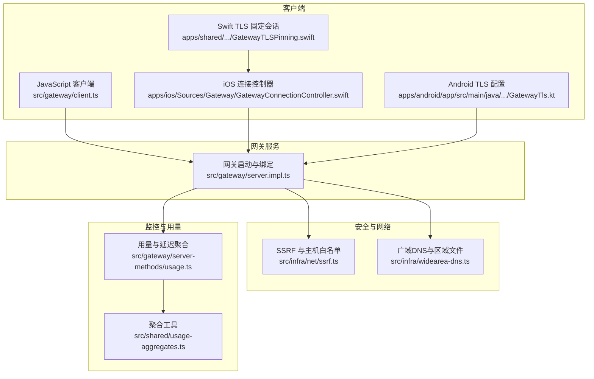
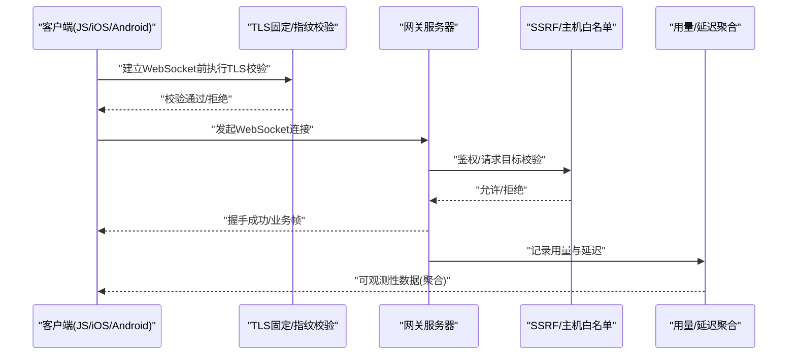
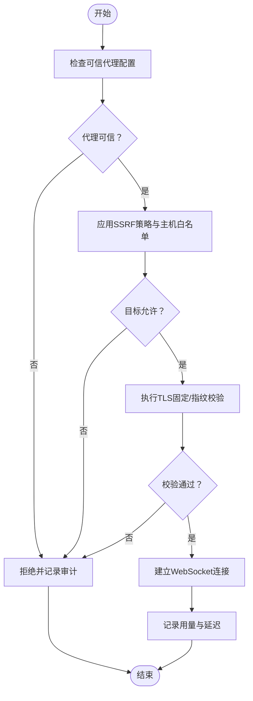
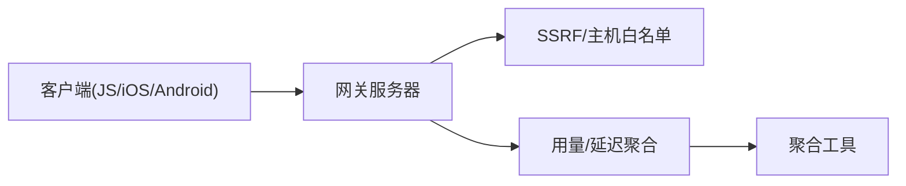

# 网络性能优化

<cite>
**本文引用的文件**
- [docs/network.md](file://docs/network.md)
- [src/gateway/server.impl.ts](file://src/gateway/server.impl.ts)
- [src/gateway/client.ts](file://src/gateway/client.ts)
- [apps/shared/OpenClawKit/Sources/OpenClawKit/GatewayTLSPinning.swift](file://apps/shared/OpenClawKit/Sources/OpenClawKit/GatewayTLSPinning.swift)
- [apps/ios/Sources/Gateway/GatewayConnectionController.swift](file://apps/ios/Sources/Gateway/GatewayConnectionController.swift)
- [apps/android/app/src/main/java/ai/openclaw/android/gateway/GatewayTls.kt](file://apps/android/app/src/main/java/ai/openclaw/android/gateway/GatewayTls.kt)
- [src/infra/net/ssrf.ts](file://src/infra/net/ssrf.ts)
- [src/infra/widearea-dns.ts](file://src/infra/widearea-dns.ts)
- [src/gateway/server-methods/usage.ts](file://src/gateway/server-methods/usage.ts)
- [src/shared/usage-aggregates.ts](file://src/shared/usage-aggregates.ts)
- [src/security/audit.test.ts](file://src/security/audit.test.ts)
</cite>

## 目录

1. [简介](#简介)
2. [项目结构](#项目结构)
3. [核心组件](#核心组件)
4. [架构总览](#架构总览)
5. [详细组件分析](#详细组件分析)
6. [依赖关系分析](#依赖关系分析)
7. [性能考量](#性能考量)
8. [故障排查指南](#故障排查指南)
9. [结论](#结论)
10. [附录](#附录)

## 简介

本指南面向全球部署场景，系统性梳理OpenClaw在TCP优化、HTTP/2与WebSocket连接管理、负载均衡与CDN集成、DNS优化、网络监控与延迟/带宽管理、代理与防火墙优化、以及安全连接加速等方面的实践与可操作建议。文档以仓库中实际实现为依据，结合架构与运行时行为，给出参数调优方向与测试观测点，帮助在不同网络环境下稳定、低延迟地交付服务。

## 项目结构

OpenClaw的网络能力主要由“网关服务器”“客户端SDK（含移动端TLS固定）”“安全与SSRF防护”“DNS与广域发现”“用量与延迟聚合”等模块构成。下图展示与网络性能优化直接相关的子系统与交互：

**图表来源**

- [src/gateway/server.impl.ts](file://src/gateway/server.impl.ts#L140-L193)
- [src/gateway/client.ts](file://src/gateway/client.ts#L37-L83)
- [apps/ios/Sources/Gateway/GatewayConnectionController.swift](file://apps/ios/Sources/Gateway/GatewayConnectionController.swift#L495-L711)
- [apps/android/app/src/main/java/ai/openclaw/android/gateway/GatewayTls.kt](file://apps/android/app/src/main/java/ai/openclaw/android/gateway/GatewayTls.kt#L35-L66)
- [apps/shared/OpenClawKit/Sources/OpenClawKit/GatewayTLSPinning.swift](file://apps/shared/OpenClawKit/Sources/OpenClawKit/GatewayTLSPinning.swift#L40-L96)
- [src/infra/net/ssrf.ts](file://src/infra/net/ssrf.ts#L53-L92)
- [src/infra/widearea-dns.ts](file://src/infra/widearea-dns.ts#L1-L45)
- [src/gateway/server-methods/usage.ts](file://src/gateway/server-methods/usage.ts#L707-L735)
- [src/shared/usage-aggregates.ts](file://src/shared/usage-aggregates.ts#L22-L57)

**章节来源**

- [docs/network.md](file://docs/network.md#L1-L55)
- [src/gateway/server.impl.ts](file://src/gateway/server.impl.ts#L140-L193)

## 核心组件

- 网关服务器：负责绑定模式（loopback、LAN、tailnet、auto）、TLS加载、通道与插件初始化、健康状态与维护任务、WebSocket控制面接入等。
- 客户端：统一的WebSocket客户端选项（如连接重试、心跳最小间隔、TLS指纹校验等），支持事件回调与关闭码语义。
- 移动端TLS固定：iOS/Android通过自定义信任链或证书指纹校验，降低中间人风险并提升首包握手确定性。
- SSRF与主机白名单：对解析与访问目标进行白名单与特殊地址块策略控制，降低内网探测与越权风险。
- 广域DNS：支持广域域解析、区域文件生成与路径管理，便于边缘化部署与就近解析。
- 用量与延迟聚合：按通道、日粒度统计延迟指标，支撑性能观测与容量规划。

**章节来源**

- [src/gateway/server.impl.ts](file://src/gateway/server.impl.ts#L140-L193)
- [src/gateway/client.ts](file://src/gateway/client.ts#L37-L83)
- [apps/shared/OpenClawKit/Sources/OpenClawKit/GatewayTLSPinning.swift](file://apps/shared/OpenClawKit/Sources/OpenClawKit/GatewayTLSPinning.swift#L40-L96)
- [apps/ios/Sources/Gateway/GatewayConnectionController.swift](file://apps/ios/Sources/Gateway/GatewayConnectionController.swift#L495-L711)
- [apps/android/app/src/main/java/ai/openclaw/android/gateway/GatewayTls.kt](file://apps/android/app/src/main/java/ai/openclaw/android/gateway/GatewayTls.kt#L35-L66)
- [src/infra/net/ssrf.ts](file://src/infra/net/ssrf.ts#L53-L92)
- [src/infra/widearea-dns.ts](file://src/infra/widearea-dns.ts#L1-L45)
- [src/gateway/server-methods/usage.ts](file://src/gateway/server-methods/usage.ts#L707-L735)
- [src/shared/usage-aggregates.ts](file://src/shared/usage-aggregates.ts#L22-L57)

## 架构总览

下图展示从客户端到网关的关键交互路径，以及TLS固定与安全策略的落点：

**图表来源**

- [src/gateway/client.ts](file://src/gateway/client.ts#L37-L83)
- [apps/shared/OpenClawKit/Sources/OpenClawKit/GatewayTLSPinning.swift](file://apps/shared/OpenClawKit/Sources/OpenClawKit/GatewayTLSPinning.swift#L40-L96)
- [apps/ios/Sources/Gateway/GatewayConnectionController.swift](file://apps/ios/Sources/Gateway/GatewayConnectionController.swift#L495-L711)
- [apps/android/app/src/main/java/ai/openclaw/android/gateway/GatewayTls.kt](file://apps/android/app/src/main/java/ai/openclaw/android/gateway/GatewayTls.kt#L35-L66)
- [src/infra/net/ssrf.ts](file://src/infra/net/ssrf.ts#L53-L92)
- [src/gateway/server-methods/usage.ts](file://src/gateway/server-methods/usage.ts#L707-L735)

## 详细组件分析

### TCP优化与连接管理

- 绑定模式与监听策略
  - 支持loopback、LAN、tailnet、auto等绑定模式；优先loopback或LAN，tailnet用于Tailscale暴露。
  - 建议：生产环境优先使用tailnet或LAN绑定，并配合反向代理/负载均衡器前置TLS终止，减少网关直连压力。
- 心跳与保活
  - 客户端提供tick最小间隔配置项，避免过密心跳造成CPU与带宽浪费。
  - 建议：根据网络RTT设置合理的心跳周期，避免在高丢包/高抖动链路下过度触发重连。
- 关闭码语义
  - 客户端对常见关闭码提供提示，便于快速定位异常类型（如重启、策略违规、异常断开）。
- WebSocket消息大小
  - 客户端与共享会话默认限制消息大小，防止大消息占用过多内存与带宽。
- 可观测性
  - 用量聚合支持按通道与日粒度统计延迟指标，便于识别热点与异常时段。

**章节来源**

- [src/gateway/server.impl.ts](file://src/gateway/server.impl.ts#L140-L193)
- [src/gateway/client.ts](file://src/gateway/client.ts#L37-L83)
- [apps/shared/OpenClawKit/Sources/OpenClawKit/GatewayTLSPinning.swift](file://apps/shared/OpenClawKit/Sources/OpenClawKit/GatewayTLSPinning.swift#L53-L56)
- [src/gateway/server-methods/usage.ts](file://src/gateway/server-methods/usage.ts#L707-L735)
- [src/shared/usage-aggregates.ts](file://src/shared/usage-aggregates.ts#L22-L57)

### HTTP/2与WebSocket连接管理

- HTTP/2
  - 网关侧未直接暴露HTTP/2专用开关；通常由前置TLS终止层（如反向代理/云平台LB）决定是否启用HTTP/2。
  - 建议：在边缘层开启HTTP/2多路复用，减少队头阻塞；同时启用ALPN与现代密码套件。
- WebSocket
  - 客户端支持TLS指纹校验、事件回调、连接错误回调、关闭回调等，便于在边缘/跨地域场景下做快速失败与降级。
  - 建议：在长链路场景下结合心跳与指数退避重连，避免风暴式重连。

**章节来源**

- [src/gateway/client.ts](file://src/gateway/client.ts#L37-L83)
- [apps/shared/OpenClawKit/Sources/OpenClawKit/GatewayTLSPinning.swift](file://apps/shared/OpenClawKit/Sources/OpenClawKit/GatewayTLSPinning.swift#L40-L96)
- [apps/ios/Sources/Gateway/GatewayConnectionController.swift](file://apps/ios/Sources/Gateway/GatewayConnectionController.swift#L495-L711)
- [apps/android/app/src/main/java/ai/openclaw/android/gateway/GatewayTls.kt](file://apps/android/app/src/main/java/ai/openclaw/android/gateway/GatewayTls.kt#L35-L66)

### 负载均衡、CDN与DNS优化

- 负载均衡
  - 建议：在网关前部署具备健康检查与会话亲和能力的LB；针对WebSocket场景，确保LB支持长连接与正确的超时配置。
- CDN集成
  - 对静态资源与控制界面采用CDN缓存；网关侧可通过安全头配置（如HSTS）增强传输安全。
- DNS优化
  - 使用广域DNS域进行全局发现与就近解析；区域文件生成与路径管理有助于边缘节点快速生效。
  - 建议：在多区域部署时，为每个区域配置独立域名或TXT记录，结合客户端探测逻辑选择最优入口。

**章节来源**

- [src/infra/widearea-dns.ts](file://src/infra/widearea-dns.ts#L1-L45)

### 网络监控、延迟测量与带宽管理

- 延迟测量
  - 服务端按通道与日粒度聚合延迟指标，支持计算均值、最小、最大、P95等指标，便于趋势分析与告警阈值设定。
- 带宽管理
  - 客户端与共享会话对消息大小进行限制，避免突发流量冲击；建议结合LB限速与QoS策略，保障关键业务。
- 观测性
  - 结合用量聚合输出，形成每日/通道维度的延迟报告，辅助容量规划与成本优化。

**章节来源**

- [src/gateway/server-methods/usage.ts](file://src/gateway/server-methods/usage.ts#L707-L735)
- [src/shared/usage-aggregates.ts](file://src/shared/usage-aggregates.ts#L22-L57)

### 代理配置、防火墙优化与安全连接加速

- 代理与可信代理
  - 网关支持可信代理配置与真实IP回退策略；在多级代理后需正确传递真实来源。
  - 建议：仅允许受信网段作为代理，避免将公网/私网混杂代理视为可信。
- 防火墙与SSRF
  - 主机名白名单与通配匹配、私有网络访问策略、RFC2544基准范围等，降低内网探测与越权风险。
- TLS固定与指纹校验
  - 客户端/移动端在首次连接后可存储指纹，后续连接进行严格比对，显著降低证书劫持风险并提升握手确定性。
  - 建议：生产环境强制TLS固定，启用TOFU仅限于受控内网或引导流程。

**图表来源**

- [src/security/audit.test.ts](file://src/security/audit.test.ts#L1261-L1316)
- [src/infra/net/ssrf.ts](file://src/infra/net/ssrf.ts#L53-L92)
- [apps/shared/OpenClawKit/Sources/OpenClawKit/GatewayTLSPinning.swift](file://apps/shared/OpenClawKit/Sources/OpenClawKit/GatewayTLSPinning.swift#L40-L96)
- [apps/ios/Sources/Gateway/GatewayConnectionController.swift](file://apps/ios/Sources/Gateway/GatewayConnectionController.swift#L495-L711)
- [apps/android/app/src/main/java/ai/openclaw/android/gateway/GatewayTls.kt](file://apps/android/app/src/main/java/ai/openclaw/android/gateway/GatewayTls.kt#L35-L66)

**章节来源**

- [src/security/audit.test.ts](file://src/security/audit.test.ts#L1261-L1316)
- [src/infra/net/ssrf.ts](file://src/infra/net/ssrf.ts#L53-L92)

## 依赖关系分析

- 客户端与网关：客户端通过WebSocket与网关交互，支持TLS指纹校验与事件回调。
- 网关与安全：网关在处理请求前执行可信代理与SSRF策略，确保访问目标合法。
- 网关与监控：网关收集用量与延迟，交由聚合工具生成报表，供运维与容量团队使用。

**图表来源**

- [src/gateway/client.ts](file://src/gateway/client.ts#L37-L83)
- [src/gateway/server.impl.ts](file://src/gateway/server.impl.ts#L140-L193)
- [src/infra/net/ssrf.ts](file://src/infra/net/ssrf.ts#L53-L92)
- [src/gateway/server-methods/usage.ts](file://src/gateway/server-methods/usage.ts#L707-L735)
- [src/shared/usage-aggregates.ts](file://src/shared/usage-aggregates.ts#L22-L57)

**章节来源**

- [src/gateway/client.ts](file://src/gateway/client.ts#L37-L83)
- [src/gateway/server.impl.ts](file://src/gateway/server.impl.ts#L140-L193)
- [src/infra/net/ssrf.ts](file://src/infra/net/ssrf.ts#L53-L92)
- [src/gateway/server-methods/usage.ts](file://src/gateway/server-methods/usage.ts#L707-L735)
- [src/shared/usage-aggregates.ts](file://src/shared/usage-aggregates.ts#L22-L57)

## 性能考量

- TCP优化
  - 在边缘层启用HTTP/2与TLS 1.3，减少握手与队头阻塞；合理设置TCP拥塞控制算法与MSS。
  - 对WebSocket场景，保持连接活跃但不过度心跳，避免不必要的CPU与带宽消耗。
- 延迟与带宽
  - 利用用量聚合指标识别高峰时段与热点通道，动态扩容或调整上游缓存策略。
  - 控制单次消息大小，避免突发大包导致排队与抖动。
- 全球部署
  - 按区域部署网关实例，结合广域DNS实现就近接入；边缘节点预热与缓存命中率直接影响延迟。
  - 在LB与CDN层面开启压缩与持久连接，减少RTT与往返次数。

[本节为通用指导，无需列出具体文件来源]

## 故障排查指南

- 常见问题定位
  - 连接被拒：检查关闭码语义与日志，区分策略违规、异常断开与服务重启。
  - TLS失败：确认客户端/移动端TLS固定配置与指纹一致性，必要时重新探测并更新指纹。
  - 访问受限：核查可信代理配置与SSRF策略，确保仅允许受信来源与目标。
- 观测手段
  - 使用用量聚合输出的延迟指标进行对比分析，定位异常日期与通道。
  - 在多区域部署时，结合广域DNS解析结果与边缘节点日志交叉验证。

**章节来源**

- [src/gateway/client.ts](file://src/gateway/client.ts#L74-L83)
- [apps/shared/OpenClawKit/Sources/OpenClawKit/GatewayTLSPinning.swift](file://apps/shared/OpenClawKit/Sources/OpenClawKit/GatewayTLSPinning.swift#L40-L96)
- [apps/ios/Sources/Gateway/GatewayConnectionController.swift](file://apps/ios/Sources/Gateway/GatewayConnectionController.swift#L495-L711)
- [apps/android/app/src/main/java/ai/openclaw/android/gateway/GatewayTls.kt](file://apps/android/app/src/main/java/ai/openclaw/android/gateway/GatewayTls.kt#L35-L66)
- [src/infra/net/ssrf.ts](file://src/infra/net/ssrf.ts#L53-L92)
- [src/gateway/server-methods/usage.ts](file://src/gateway/server-methods/usage.ts#L707-L735)
- [src/shared/usage-aggregates.ts](file://src/shared/usage-aggregates.ts#L22-L57)

## 结论

OpenClaw在网络性能优化方面提供了从连接管理、TLS固定、SSRF防护到用量观测的完整闭环。结合边缘LB/CDN、广域DNS与合理的TCP/HTTP/2参数，可在全球范围内实现低延迟、高可靠的连接体验。建议在生产环境中强制TLS固定、严格可信代理与SSRF策略，并持续利用用量聚合指标进行容量与性能治理。

[本节为总结性内容，无需列出具体文件来源]

## 附录

- 参数与配置要点
  - 客户端：连接重试、心跳最小间隔、TLS指纹、事件回调、关闭码语义。
  - 网关：绑定模式、TLS加载、通道与插件初始化、健康状态与维护任务。
  - 安全：可信代理、SSRF策略、主机白名单、私有网络访问策略。
  - DNS：广域域解析、区域文件路径、TXT记录与标签规范化。
- 测试与验证
  - 通过用量聚合指标对比不同部署区域的延迟表现，评估优化效果。
  - 在变更TLS固定策略或代理配置后，进行回归测试与指纹探测验证。

[本节为补充说明，无需列出具体文件来源]
