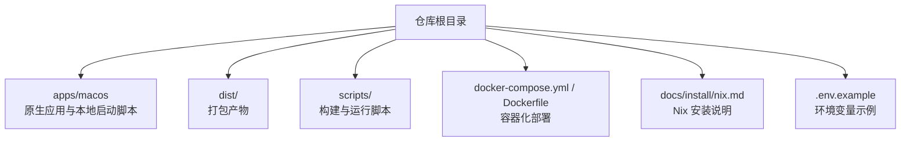
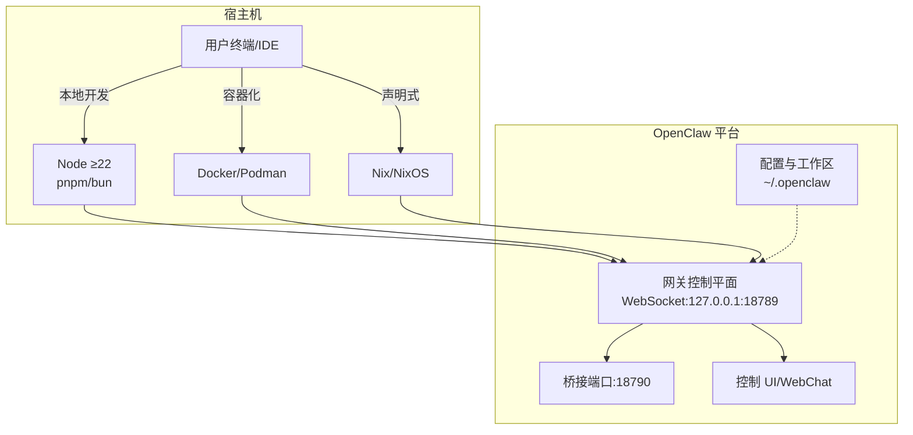
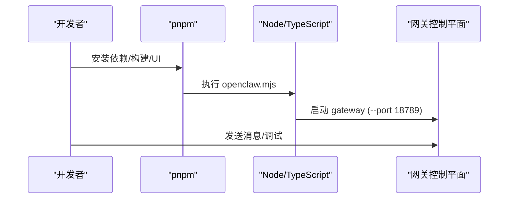
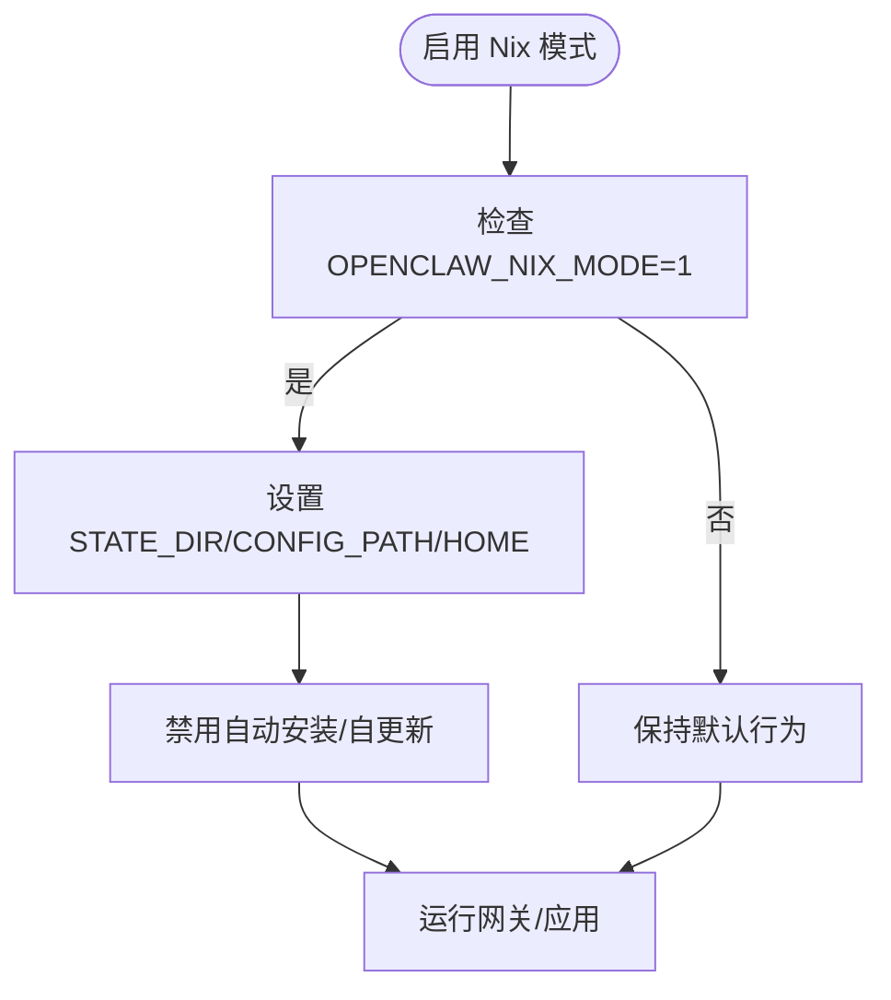
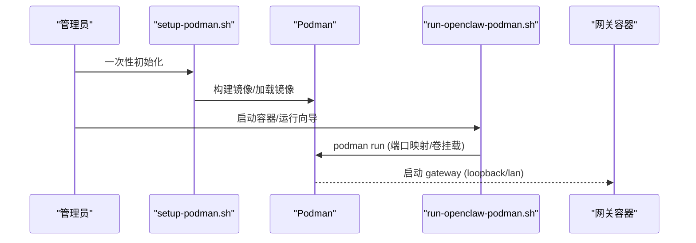
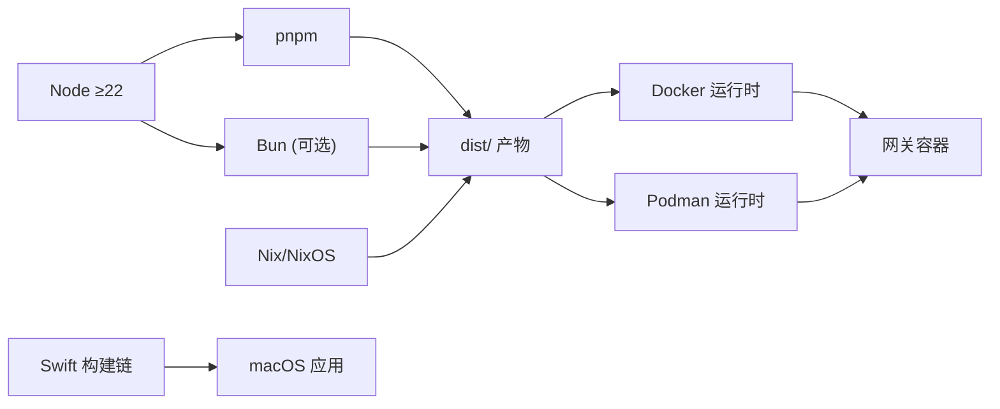

# 本地部署

<cite>
**本文引用的文件**
- [README.md](file://README.md)
- [package.json](file://package.json)
- [Dockerfile](file://Dockerfile)
- [docker-compose.yml](file://docker-compose.yml)
- [setup-podman.sh](file://setup-podman.sh)
- [openclaw.podman.env](file://openclaw.podman.env)
- [scripts/run-openclaw-podman.sh](file://scripts/run-openclaw-podman.sh)
- [scripts/podman/openclaw.container.in](file://scripts/podman/openclaw.container.in)
- [scripts/build-and-run-mac.sh](file://scripts/build-and-run-mac.sh)
- [scripts/sandbox-setup.sh](file://scripts/sandbox-setup.sh)
- [docs/install/nix.md](file://docs/install/nix.md)
- [src/config/config.nix-integration-u3-u5-u9.test.ts](file://src/config/config.nix-integration-u3-u5-u9.test.ts)
- [.env.example](file://.env.example)
</cite>

## 目录

1. [简介](#简介)
2. [项目结构](#项目结构)
3. [核心组件](#核心组件)
4. [架构总览](#架构总览)
5. [详细组件分析](#详细组件分析)
6. [依赖关系分析](#依赖关系分析)
7. [性能考虑](#性能考虑)
8. [故障排查指南](#故障排查指南)
9. [结论](#结论)
10. [附录](#附录)

## 简介

本指南面向个人开发者与小团队，提供 OpenClaw 在 macOS 虚拟机、Linux、Windows（WSL2）与 Podman 环境下的本地部署与开发流程。内容涵盖：

- macOS 虚拟机部署与本地开发环境准备
- Nix 包管理器安装与配置
- Bun 运行时与 Node ≥22 的兼容性
- 容器化部署（Docker 与 Podman）
- 本地调试、端口映射与网络设置
- 依赖管理与性能优化建议

## 项目结构

仓库采用多语言混合与多平台产物组织方式：Node/TypeScript 源码、Swift 原生应用、UI 构建脚本、容器镜像与 Podman 配置等。关键目录与文件：

- 根目录包含入口脚本、构建脚本、测试与文档
- apps/macos 提供原生 macOS 应用构建与本地启动脚本
- dist/ 产出打包后的可执行与前端资源
- docker-compose.yml 与 Dockerfile 支持容器化部署
- scripts/podman 与 setup-podman.sh 提供 Podman 一键安装与服务化

图示来源

- [README.md](file://README.md#L1-L556)
- [package.json](file://package.json#L1-L268)

章节来源

- [README.md](file://README.md#L1-L556)
- [package.json](file://package.json#L1-L268)

## 核心组件

- 入口与运行时
  - Node ≥22 作为运行时，支持 pnpm 与 Bun（可选）进行开发与直接运行 TypeScript
  - openclaw.mjs 作为全局命令入口，dist/index.js 为打包后的主程序
- 容器化
  - Dockerfile 基于 node:22-bookworm，内置 Bun 以支持构建脚本；默认以非 root 用户运行
  - docker-compose.yml 提供网关与 CLI 两个服务，暴露网关与桥接端口
- Podman
  - setup-podman.sh 一次性安装：创建 openclaw 用户、构建镜像、加载到用户存储、生成启动脚本
  - scripts/run-openclaw-podman.sh 提供容器启动、设置向导与日志查看
  - openclaw.podman.env 提供 Podman 环境变量模板
- Nix
  - docs/install/nix.md 提供通过 nix-openclaw 的声明式安装与运行说明
  - src/config/config.nix-integration-u3-u5-u9.test.ts 展示 Nix 模式下路径解析与行为
- macOS 开发
  - scripts/build-and-run-mac.sh 用于本地 Swift 应用构建与启动
- 安全沙箱
  - scripts/sandbox-setup.sh 用于构建沙箱镜像（Dockerfile.sandbox）

章节来源

- [package.json](file://package.json#L1-L268)
- [Dockerfile](file://Dockerfile#L1-L73)
- [docker-compose.yml](file://docker-compose.yml#L1-L47)
- [setup-podman.sh](file://setup-podman.sh#L1-L252)
- [scripts/run-openclaw-podman.sh](file://scripts/run-openclaw-podman.sh#L1-L214)
- [openclaw.podman.env](file://openclaw.podman.env#L1-L25)
- [docs/install/nix.md](file://docs/install/nix.md#L1-L99)
- [src/config/config.nix-integration-u3-u5-u9.test.ts](file://src/config/config.nix-integration-u3-u5-u9.test.ts#L1-L265)
- [scripts/build-and-run-mac.sh](file://scripts/build-and-run-mac.sh#L1-L19)
- [scripts/sandbox-setup.sh](file://scripts/sandbox-setup.sh#L1-L8)

## 架构总览

OpenClaw 本地部署支持多条路径：直接 Node 运行、容器化（Docker/Podman）、Nix 声明式安装。下图展示从宿主机到网关控制平面的典型交互。

图示来源

- [README.md](file://README.md#L185-L238)
- [Dockerfile](file://Dockerfile#L66-L73)
- [docker-compose.yml](file://docker-compose.yml#L14-L28)
- [scripts/run-openclaw-podman.sh](file://scripts/run-openclaw-podman.sh#L206-L213)

## 详细组件分析

### macOS 虚拟机部署与本地开发

- 环境准备
  - 安装 Node ≥22，推荐使用 pnpm（开发构建首选），Bun 可用于直接运行 TypeScript
  - 从源码克隆后，先安装依赖，再构建 UI 与主程序，最后通过 openclaw onboard 完成向导安装
- 本地启动
  - 使用 pnpm gateway:watch 实现热重载的开发循环
  - 或使用 pnpm openclaw gateway 启动生产模式
- 原生应用本地运行
  - scripts/build-and-run-mac.sh 提供 Swift 应用的本地构建与启动流程，便于调试 macOS 应用侧功能

图示来源

- [README.md](file://README.md#L92-L111)
- [scripts/build-and-run-mac.sh](file://scripts/build-and-run-mac.sh#L1-L19)

章节来源

- [README.md](file://README.md#L92-L111)
- [scripts/build-and-run-mac.sh](file://scripts/build-and-run-mac.sh#L1-L19)

### Nix 包管理器安装与配置

- 推荐使用 nix-openclaw 仓库提供的 Home Manager 模块，实现声明式安装与回滚
- Nix 模式下：
  - 禁用自动安装与自更新流程
  - 通过 OPENCLAW_NIX_MODE=1 或 macOS defaults 启用
  - 显式设置 OPENCLAW_STATE_DIR、OPENCLAW_CONFIG_PATH、OPENCLAW_HOME 等路径，避免写入不可变存储
- 测试用例验证了 Nix 模式下的路径解析与行为一致性

图示来源

- [docs/install/nix.md](file://docs/install/nix.md#L46-L81)
- [src/config/config.nix-integration-u3-u5-u9.test.ts](file://src/config/config.nix-integration-u3-u5-u9.test.ts#L36-L120)

章节来源

- [docs/install/nix.md](file://docs/install/nix.md#L1-L99)
- [src/config/config.nix-integration-u3-u5-u9.test.ts](file://src/config/config.nix-integration-u3-u5-u9.test.ts#L1-L265)

### Bun 运行时配置

- Bun 可用于直接运行 TypeScript（与 pnpm 的 tsx 配合），适合快速迭代
- 生产构建与打包使用 Node/TypeScript 工具链，最终产物 dist/ 由 Node 运行
- package.json 中定义了 openclaw.mjs 作为二进制入口，支持直接 node openclaw.mjs 或 pnpm openclaw

章节来源

- [package.json](file://package.json#L16-L18)
- [package.json](file://package.json#L109-L111)

### 容器化部署（Docker 与 Podman）

- Docker
  - Dockerfile 基于 node:22-bookworm，安装 Bun 与 pnpm，构建并以非 root 用户运行
  - docker-compose.yml 提供网关与 CLI 服务，默认绑定 LAN 并暴露端口
- Podman
  - setup-podman.sh 一次性完成：创建 openclaw 用户、构建镜像、加载到用户存储、生成启动脚本
  - scripts/run-openclaw-podman.sh 支持启动容器、运行向导、查看日志
  - openclaw.podman.env 提供环境变量模板（如 OPENCLAW_GATEWAY_TOKEN）
  - Quadlet systemd 集成（可选）实现开机自启与自动重启

图示来源

- [setup-podman.sh](file://setup-podman.sh#L206-L216)
- [scripts/run-openclaw-podman.sh](file://scripts/run-openclaw-podman.sh#L197-L209)
- [docker-compose.yml](file://docker-compose.yml#L14-L28)

章节来源

- [Dockerfile](file://Dockerfile#L1-L73)
- [docker-compose.yml](file://docker-compose.yml#L1-L47)
- [setup-podman.sh](file://setup-podman.sh#L1-L252)
- [scripts/run-openclaw-podman.sh](file://scripts/run-openclaw-podman.sh#L1-L214)
- [openclaw.podman.env](file://openclaw.podman.env#L1-L25)
- [scripts/podman/openclaw.container.in](file://scripts/podman/openclaw.container.in#L1-L27)

### 不同操作系统安装步骤与环境准备

- Linux
  - 使用包管理器安装 Node ≥22，推荐 pnpm；按 README 从源码构建并运行
  - 可选使用 Docker 或 Podman 进行容器化部署
- Windows（WSL2）
  - 在 WSL2 中安装 Node ≥22 与 pnpm，遵循 Linux 步骤
  - 如需原生体验，可在 Windows 上使用 Docker Desktop 或 WSL2 集成的容器工具
- macOS
  - 使用 Homebrew 安装 Node ≥22；可配合 nix-openclaw 或直接使用 Node/Podman
  - 原生应用可通过 scripts/build-and-run-mac.sh 快速启动

章节来源

- [README.md](file://README.md#L28-L31)
- [README.md](file://README.md#L92-L111)

### 本地调试配置、端口映射与网络设置

- 网关默认绑定 loopback（127.0.0.1:18789），若需要外部访问，需在配置中允许并设置鉴权
- docker-compose.yml 默认将宿主机端口映射到容器端口（18789/18790）
- Podman 启动脚本支持自定义宿主机端口与绑定模式（默认 loopback）
- .env.example 提供 OPENCLAW_GATEWAY_TOKEN/OPENCLAW_GATEWAY_PASSWORD 等鉴权与路径变量示例

章节来源

- [docker-compose.yml](file://docker-compose.yml#L14-L28)
- [scripts/run-openclaw-podman.sh](file://scripts/run-openclaw-podman.sh#L76-L80)
- [.env.example](file://.env.example#L17-L27)

### 依赖管理与性能优化

- 依赖安装
  - 推荐使用 pnpm（开发构建首选），Bun 可用于直接运行 TypeScript
  - Docker 构建阶段限制内存上限以降低低配主机上的 OOM 飢餓风险
- 性能优化
  - 在容器构建时预装浏览器与 Playwright 缓存，减少启动时下载时间
  - 使用非 root 用户运行容器，提升安全性
  - Podman 用户命名空间策略（keep-id/host/auto）影响挂载权限与性能

章节来源

- [package.json](file://package.json#L49-L57)
- [Dockerfile](file://Dockerfile#L26-L45)
- [scripts/run-openclaw-podman.sh](file://scripts/run-openclaw-podman.sh#L159-L179)

## 依赖关系分析

OpenClaw 的本地部署涉及以下关键依赖与关系：

- Node ≥22 与包管理器（pnpm/Bun）
- 容器运行时（Docker/Podman）
- Nix 生态（nix-openclaw 模块）
- macOS 原生应用（Swift 构建链）

图示来源

- [package.json](file://package.json#L236-L239)
- [Dockerfile](file://Dockerfile#L1-L73)
- [docs/install/nix.md](file://docs/install/nix.md#L10-L35)

章节来源

- [package.json](file://package.json#L1-L268)
- [Dockerfile](file://Dockerfile#L1-L73)
- [docs/install/nix.md](file://docs/install/nix.md#L1-L99)

## 性能考虑

- 构建阶段内存限制：Dockerfile 中通过 NODE_OPTIONS 限制 Node 内存，避免小规格 VM 构建失败
- 浏览器缓存预装：在容器构建时安装 Chromium 与 Playwright 缓存，显著缩短容器启动时间
- 非 root 运行：容器以非 root 用户运行，降低逃逸风险，同时避免特权写入带来的性能与安全问题
- Podman 用户命名空间：根据 keep-id/host/auto 选择合适的用户命名空间策略，平衡权限与性能

章节来源

- [Dockerfile](file://Dockerfile#L26-L45)
- [Dockerfile](file://Dockerfile#L61-L64)

## 故障排查指南

- 网关无法启动或拒绝访问
  - 确认 OPENCLAW_GATEWAY_TOKEN/OPENCLAW_GATEWAY_PASSWORD 设置
  - 若绑定 LAN，需在配置中设置允许的来源或密码认证
- 容器无法拉取镜像或启动失败
  - Podman：检查用户命名空间与挂载权限；必要时使用 keep-id/host
  - Docker：确认 docker-compose 端口映射与卷挂载路径正确
- macOS 应用无法启动
  - 使用 scripts/build-and-run-mac.sh 检查构建与启动日志
- Nix 模式路径错误
  - 确保 OPENCLAW_STATE_DIR、OPENCLAW_CONFIG_PATH、OPENCLAW_HOME 指向可写位置

章节来源

- [.env.example](file://.env.example#L17-L27)
- [scripts/run-openclaw-podman.sh](file://scripts/run-openclaw-podman.sh#L159-L179)
- [docker-compose.yml](file://docker-compose.yml#L14-L28)
- [src/config/config.nix-integration-u3-u5-u9.test.ts](file://src/config/config.nix-integration-u3-u5-u9.test.ts#L55-L118)

## 结论

OpenClaw 提供了灵活的本地部署选项：既可直接在 Node 环境下进行开发与调试，也可通过 Docker/Podman 快速容器化，或借助 Nix 实现声明式安装与回滚。结合端口映射、鉴权与安全策略，个人开发者与小团队可以快速搭建稳定可靠的本地 AI 助手平台。

## 附录

- 端口与服务
  - 网关 WebSocket：18789（默认 loopback 绑定）
  - 桥接端口：18790（用于设备节点/桥接）
- 关键环境变量参考
  - OPENCLAW_GATEWAY_TOKEN/OPENCLAW_GATEWAY_PASSWORD：鉴权
  - OPENCLAW_STATE_DIR/OPENCLAW_CONFIG_PATH/OPENCLAW_HOME：路径覆盖
  - 各类模型与渠道的 API 密钥（见 .env.example）

章节来源

- [docker-compose.yml](file://docker-compose.yml#L14-L28)
- [.env.example](file://.env.example#L17-L81)
