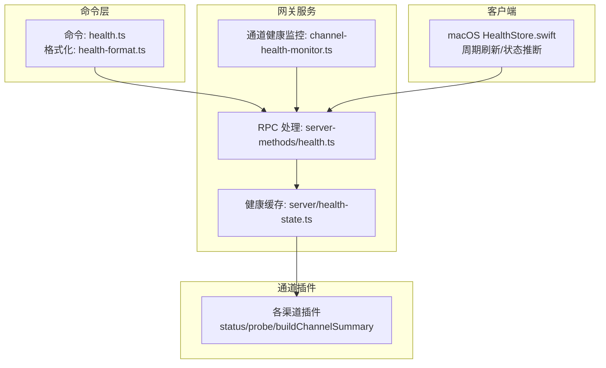
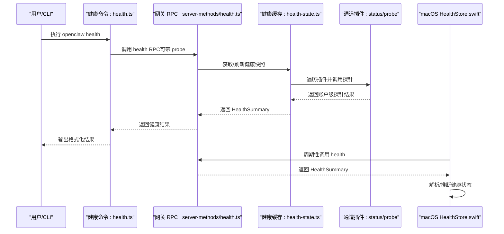
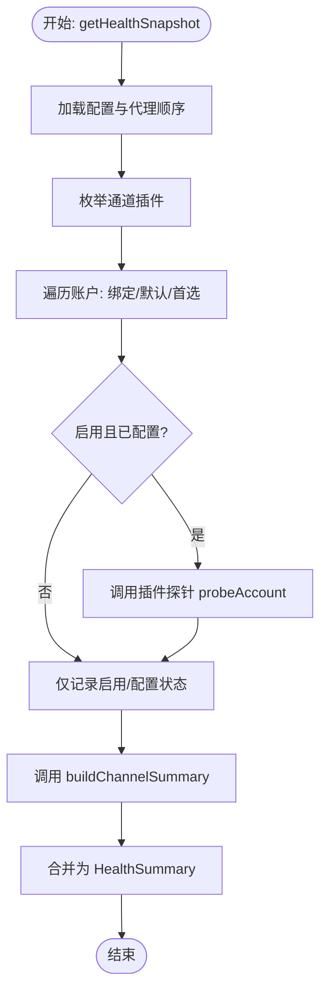
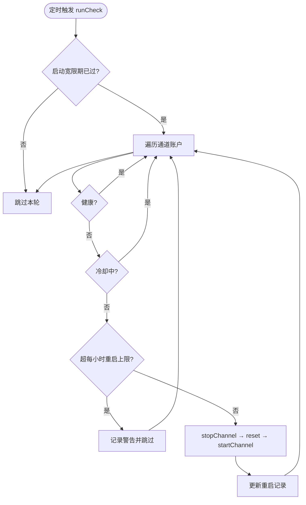
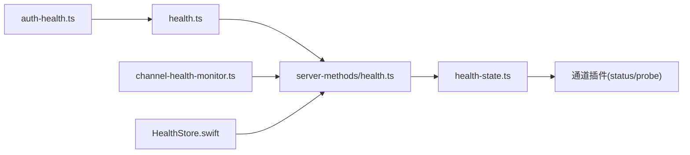

# 健康检查

<cite>
**本文引用的文件**
- [src/commands/health.ts](file://src/commands/health.ts)
- [src/gateway/server/health-state.ts](file://src/gateway/server/health-state.ts)
- [src/gateway/server-methods/health.ts](file://src/gateway/server-methods/health.ts)
- [src/gateway/channel-health-monitor.ts](file://src/gateway/channel-health-monitor.ts)
- [apps/macos/Sources/OpenClaw/HealthStore.swift](file://apps/macos/Sources/OpenClaw/HealthStore.swift)
- [src/agents/auth-health.ts](file://src/agents/auth-health.ts)
- [src/cli/daemon-cli/restart-health.ts](file://src/cli/daemon-cli/restart-health.ts)
- [src/commands/health-format.ts](file://src/commands/health-format.ts)
- [src/commands/status.command.ts](file://src/commands/status.command.ts)
</cite>

## 目录

1. [简介](#简介)
2. [项目结构](#项目结构)
3. [核心组件](#核心组件)
4. [架构总览](#架构总览)
5. [详细组件分析](#详细组件分析)
6. [依赖关系分析](#依赖关系分析)
7. [性能考量](#性能考量)
8. [故障排查指南](#故障排查指南)
9. [结论](#结论)
10. [附录](#附录)

## 简介

本文件面向运维与开发团队，系统化阐述 OpenClaw 健康检查体系：包括健康检查架构、检查项定义、检查策略配置、组件健康状态评估、依赖服务检测与资源使用监控、健康检查 API、检查结果格式与状态报告机制，并覆盖自动恢复、故障转移与降级策略，以及配置模板、自定义检查器开发与集成指南。

## 项目结构

OpenClaw 的健康检查由“命令层（CLI）—网关服务—通道插件—客户端 UI”多层协同实现：

- 命令层负责发起健康检查、格式化输出与错误展示；
- 网关服务负责聚合健康快照、缓存与广播；
- 通道插件负责具体渠道的认证、连通性探测与摘要构建；
- 客户端 UI 负责周期刷新、解析与可视化呈现。

图表来源

- [src/commands/health.ts](file://src/commands/health.ts#L348-L523)
- [src/gateway/server-methods/health.ts](file://src/gateway/server-methods/health.ts#L10-L37)
- [src/gateway/server/health-state.ts](file://src/gateway/server/health-state.ts#L69-L84)
- [src/gateway/channel-health-monitor.ts](file://src/gateway/channel-health-monitor.ts#L53-L177)
- [apps/macos/Sources/OpenClaw/HealthStore.swift](file://apps/macos/Sources/OpenClaw/HealthStore.swift#L99-L145)

章节来源

- [src/commands/health.ts](file://src/commands/health.ts#L1-L752)
- [src/gateway/server-methods/health.ts](file://src/gateway/server-methods/health.ts#L1-L38)
- [src/gateway/server/health-state.ts](file://src/gateway/server/health-state.ts#L1-L85)
- [src/gateway/channel-health-monitor.ts](file://src/gateway/channel-health-monitor.ts#L1-L178)
- [apps/macos/Sources/OpenClaw/HealthStore.swift](file://apps/macos/Sources/OpenClaw/HealthStore.swift#L1-L302)

## 核心组件

- 健康快照生成器：负责遍历通道插件、收集账户级探针结果、汇总代理心跳与会话信息，形成统一的健康摘要。
- 网关健康状态管理：维护健康快照缓存、版本号、后台刷新与广播。
- 通道健康监控器：周期扫描运行时快照，对不健康通道执行冷却与重启限制下的自动恢复。
- 客户端健康存储：周期拉取、解码并推断整体健康状态，提供 UI 友好提示。
- 认证健康度量：对 OAuth/API Key 类凭据进行到期时间与状态评估，辅助定位鉴权类故障。
- 重启健康诊断：在服务重启后等待健康可用，检测端口占用与残留进程，必要时清理。

章节来源

- [src/commands/health.ts](file://src/commands/health.ts#L348-L523)
- [src/gateway/server/health-state.ts](file://src/gateway/server/health-state.ts#L48-L84)
- [src/gateway/channel-health-monitor.ts](file://src/gateway/channel-health-monitor.ts#L53-L177)
- [apps/macos/Sources/OpenClaw/HealthStore.swift](file://apps/macos/Sources/OpenClaw/HealthStore.swift#L70-L145)
- [src/agents/auth-health.ts](file://src/agents/auth-health.ts#L1-L262)
- [src/cli/daemon-cli/restart-health.ts](file://src/cli/daemon-cli/restart-health.ts#L31-L128)

## 架构总览

下图展示了从 CLI 到网关、再到通道插件与客户端的完整健康检查链路，以及自动恢复与状态广播路径。

图表来源

- [src/commands/health.ts](file://src/commands/health.ts#L525-L751)
- [src/gateway/server-methods/health.ts](file://src/gateway/server-methods/health.ts#L10-L37)
- [src/gateway/server/health-state.ts](file://src/gateway/server/health-state.ts#L69-L84)
- [apps/macos/Sources/OpenClaw/HealthStore.swift](file://apps/macos/Sources/OpenClaw/HealthStore.swift#L115-L145)

## 详细组件分析

### 健康快照生成与 API

- 快照生成流程
  - 解析配置与代理顺序，构建会话摘要；
  - 遍历通道插件，解析账户绑定与首选账户；
  - 对每个账户调用插件 status.probeAccount 并捕获异常；
  - 调用插件 status.buildChannelSummary 生成通道摘要；
  - 汇总为 HealthSummary，包含 ok/ts/duration/channels/channelOrder/channelLabels/defaultAgentId/agents/sessions。
- RPC 接口
  - health 方法支持可选参数 probe 控制是否触发探针；
  - 若非强制探针且缓存未过期，则返回缓存并异步刷新；
  - 异常时返回 UNAVAILABLE 错误。
- 结果格式
  - channels 中包含每个通道的 accounts 与摘要字段；
  - probe 字段包含 ok/status/error/elapsedMs/bot/webhook 等；
  - 客户端 UI 使用 Swift HealthSnapshot 结构体解码。

图表来源

- [src/commands/health.ts](file://src/commands/health.ts#L348-L523)

章节来源

- [src/commands/health.ts](file://src/commands/health.ts#L348-L523)
- [src/gateway/server-methods/health.ts](file://src/gateway/server-methods/health.ts#L10-L37)
- [apps/macos/Sources/OpenClaw/HealthStore.swift](file://apps/macos/Sources/OpenClaw/HealthStore.swift#L6-L52)

### 网关健康状态管理

- 缓存与版本
  - 维护 healthCache 与 healthVersion，刷新时递增版本并广播；
  - 提供 getHealthCache/getHealthVersion/setBroadcastHealthUpdate。
- 后台刷新
  - refreshGatewayHealthSnapshot 支持 probe 参数，避免并发刷新；
  - buildGatewaySnapshot 提供空健康占位，便于 UI 先渲染再更新。
- RPC 响应
  - healthHandler 在非强制探针且缓存新鲜时返回缓存；
  - 异步刷新并在后台记录错误。

章节来源

- [src/gateway/server/health-state.ts](file://src/gateway/server/health-state.ts#L48-L84)
- [src/gateway/server-methods/health.ts](file://src/gateway/server-methods/health.ts#L10-L37)

### 通道健康监控与自动恢复

- 监控策略
  - 默认检查间隔 5 分钟，启动宽限期 1 分钟；
  - 对每个通道账户检查 running/connected/enable/configured；
  - 不健康时按冷却周期与每小时最大重启次数限制执行重启。
- 自动恢复
  - 若通道已停止或连接失败，先停止再重启；
  - 记录重启时间与小时计数，超过阈值则告警并跳过；
  - 重启失败记录错误日志。

图表来源

- [src/gateway/channel-health-monitor.ts](file://src/gateway/channel-health-monitor.ts#L76-L153)

章节来源

- [src/gateway/channel-health-monitor.ts](file://src/gateway/channel-health-monitor.ts#L53-L177)

### 客户端健康状态推断与展示

- 周期刷新
  - HealthStore 每 60 秒调用 ControlChannel.health 拉取 JSON；
  - 解码为 HealthSnapshot，容忍首尾多余日志行。
- 状态推断
  - 优先判断 lastError；若无则基于链接通道与探针结果判定；
  - “未链接但有其他健康通道”视为降级；“探针失败”给出详细原因；
  - 提供 summaryLine/detailLine 用于 UI 展示。
- 失败诊断
  - 针对连接拒绝/超时等常见错误提供友好提示。

章节来源

- [apps/macos/Sources/OpenClaw/HealthStore.swift](file://apps/macos/Sources/OpenClaw/HealthStore.swift#L70-L276)

### 认证健康度量

- 凭证类型
  - OAuth/API Key/Token 三类，其中 API Key 标记为 static；
  - OAuth 若存在 refresh_token，即使过期也视为正常（可自动续期）。
- 状态判定
  - expired/expiring/ok/missing/static；
  - 按剩余时间与告警阈值计算。
- 输出
  - 按 provider 聚合，输出 profiles/providers 与 warnAfterMs。

章节来源

- [src/agents/auth-health.ts](file://src/agents/auth-health.ts#L1-L262)

### 重启健康诊断与故障转移

- 重启后健康检查
  - 检查服务运行态与 PID、端口占用与监听者归属；
  - 若发现非当前运行时的残留 Gateway 进程，记录并允许外部清理。
- 故障转移
  - 客户端在“未链接但有其他健康通道”场景下，可提示切换到健康通道；
  - CLI status 命令以表格形式展示各通道状态，辅助人工决策。

章节来源

- [src/cli/daemon-cli/restart-health.ts](file://src/cli/daemon-cli/restart-health.ts#L31-L128)
- [src/commands/status.command.ts](file://src/commands/status.command.ts#L601-L644)

## 依赖关系分析

- 命令层依赖网关 RPC，网关依赖通道插件探针与摘要构建；
- 网关健康缓存与广播被客户端与 UI 使用；
- 通道健康监控器独立于 RPC，直接读取运行时快照并进行恢复；
- 认证健康模块为上游提供凭据健康度量，辅助定位鉴权问题。

图表来源

- [src/commands/health.ts](file://src/commands/health.ts#L348-L523)
- [src/gateway/server-methods/health.ts](file://src/gateway/server-methods/health.ts#L10-L37)
- [src/gateway/server/health-state.ts](file://src/gateway/server/health-state.ts#L69-L84)
- [src/gateway/channel-health-monitor.ts](file://src/gateway/channel-health-monitor.ts#L53-L177)
- [apps/macos/Sources/OpenClaw/HealthStore.swift](file://apps/macos/Sources/OpenClaw/HealthStore.swift#L115-L145)
- [src/agents/auth-health.ts](file://src/agents/auth-health.ts#L165-L261)

章节来源

- [src/commands/health.ts](file://src/commands/health.ts#L348-L523)
- [src/gateway/server-methods/health.ts](file://src/gateway/server-methods/health.ts#L10-L37)
- [src/gateway/server/health-state.ts](file://src/gateway/server/health-state.ts#L48-L84)
- [src/gateway/channel-health-monitor.ts](file://src/gateway/channel-health-monitor.ts#L53-L177)
- [apps/macos/Sources/OpenClaw/HealthStore.swift](file://apps/macos/Sources/OpenClaw/HealthStore.swift#L70-L145)
- [src/agents/auth-health.ts](file://src/agents/auth-health.ts#L165-L261)

## 性能考量

- 缓存与刷新
  - 非强制探针时利用缓存减少开销，后台异步刷新；
  - 健康快照生成包含超时控制与探针并发限制，避免阻塞。
- 监控节流
  - 冷却周期与每小时重启上限防止风暴式重启；
  - 启动宽限期内跳过首轮检查，降低冷启动抖动影响。
- 客户端轮询
  - 固定刷新间隔，避免过于频繁的网络请求；
  - 解码时容忍多余日志，减少解析失败重试。

## 故障排查指南

- 健康命令失败
  - 使用 OPENCLAW_DEBUG_HEALTH 观察探针细节；
  - 查看 CLI 输出中的 Gateway target/Config/Source 等键值行，定位目标与配置问题。
- macOS UI 显示异常
  - 关注 lastError 与 detailLine，连接拒绝/超时有专门提示；
  - 若探针失败，查看 probe.status 与 elapsedMs 辅助定位。
- 重启后仍不可用
  - 使用 restart-health 工具检查服务运行态、端口占用与残留 PID；
  - 必要时终止残留进程并等待健康检查恢复。
- 认证问题
  - 使用 auth-health 模块输出各 Provider 的状态与剩余时间；
  - 对即将过期或过期的凭据及时续期或替换。

章节来源

- [src/commands/health-format.ts](file://src/commands/health-format.ts#L21-L49)
- [apps/macos/Sources/OpenClaw/HealthStore.swift](file://apps/macos/Sources/OpenClaw/HealthStore.swift#L197-L276)
- [src/cli/daemon-cli/restart-health.ts](file://src/cli/daemon-cli/restart-health.ts#L130-L156)
- [src/agents/auth-health.ts](file://src/agents/auth-health.ts#L165-L261)

## 结论

OpenClaw 健康检查体系通过“命令层—网关—插件—UI”的分层设计实现了可观测、可恢复与可诊断的闭环：既能在运行时自动修复通道异常，又能在 UI 中直观呈现健康状态与故障原因，同时为运维提供了丰富的诊断工具与配置选项。

## 附录

### 健康检查 API 与结果格式

- RPC 接口
  - 方法: health
  - 参数: probe?: boolean
  - 返回: HealthSummary 或错误
- HealthSummary 字段
  - ok/ts/durationMs/channels/channelOrder/channelLabels/defaultAgentId/agents/sessions
  - channels 中每个通道包含 accounts 与摘要字段（configured/linked/authAgeMs/probe/lastProbeAt 等）

章节来源

- [src/gateway/server-methods/health.ts](file://src/gateway/server-methods/health.ts#L10-L37)
- [src/commands/health.ts](file://src/commands/health.ts#L47-L72)
- [apps/macos/Sources/OpenClaw/HealthStore.swift](file://apps/macos/Sources/OpenClaw/HealthStore.swift#L6-L52)

### 检查策略配置模板

- 通道探针
  - 通过插件 status.probeAccount 实现，支持超时与异常捕获；
  - 建议在探针中包含 elapsedMs/status/error/bot/webhook 等字段以便 UI 展示。
- 网关缓存
  - 非强制探针时缓存新鲜度由 HEALTH_REFRESH_INTERVAL_MS 控制；
  - 后台刷新失败会记录日志，不影响即时响应。
- 监控器参数
  - checkIntervalMs/startupGraceMs/cooldownCycles/maxRestartsPerHour 可按环境调整。

章节来源

- [src/commands/health.ts](file://src/commands/health.ts#L348-L523)
- [src/gateway/server-methods/health.ts](file://src/gateway/server-methods/health.ts#L10-L37)
- [src/gateway/server/health-state.ts](file://src/gateway/server/health-state.ts#L69-L84)
- [src/gateway/channel-health-monitor.ts](file://src/gateway/channel-health-monitor.ts#L53-L61)

### 自定义检查器开发与集成指南

- 插件接口
  - 实现 status.probeAccount（账户级）、status.buildChannelSummary（摘要）；
  - 在 buildChannelSummary 中填充 configured/linked/authAgeMs/probe/lastProbeAt 等字段。
- 输出规范
  - probe 字段建议包含 ok/status/error/elapsedMs/bot/webhook；
  - bot/webhook 可用于 UI 展示与调试。
- 集成步骤
  - 在通道插件中注册上述方法；
  - 在健康命令中确保遍历该插件并调用相应方法；
  - 在 UI 中解码 HealthSnapshot 并渲染状态行。

章节来源

- [src/commands/health.ts](file://src/commands/health.ts#L418-L490)
- [apps/macos/Sources/OpenClaw/HealthStore.swift](file://apps/macos/Sources/OpenClaw/HealthStore.swift#L6-L52)
