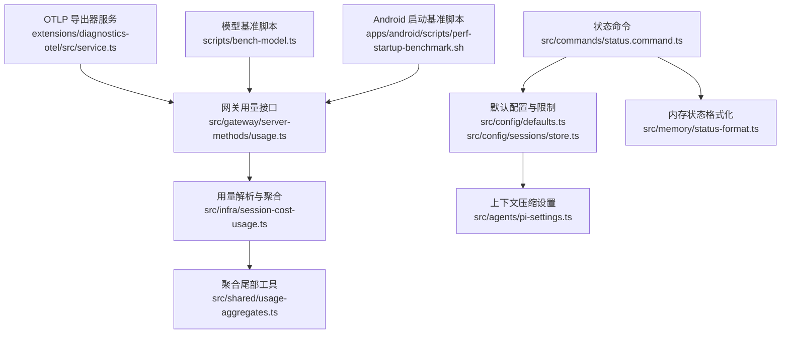
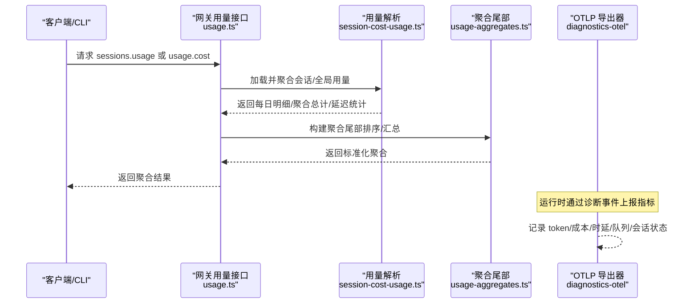
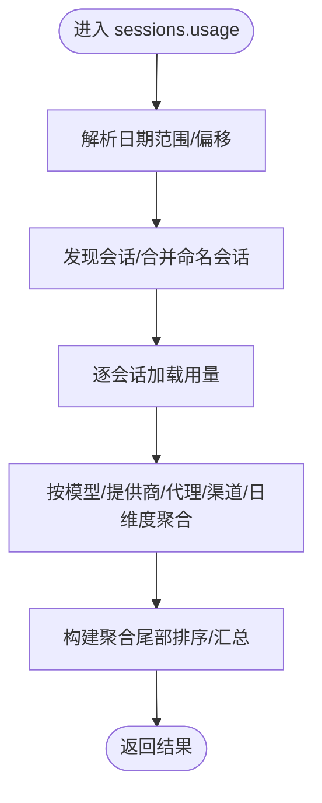
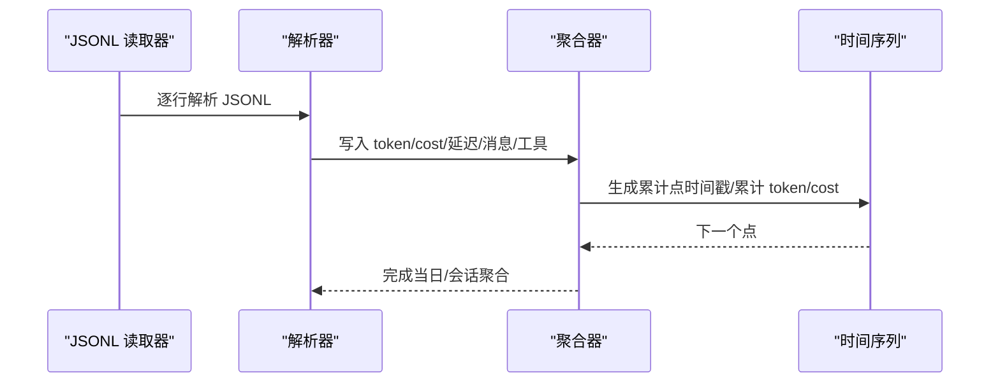
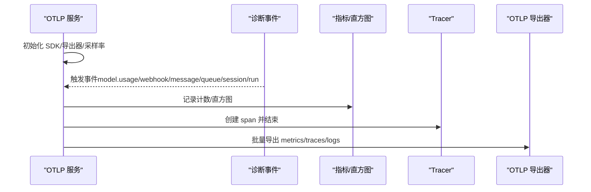
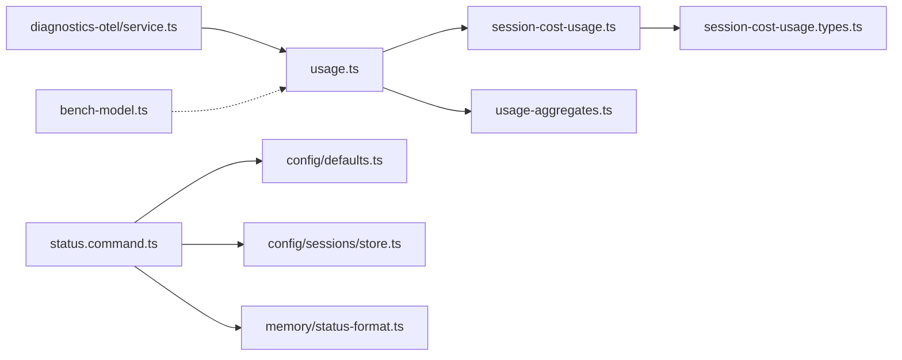

# 性能监控

<cite>
**本文引用的文件**
- [src/gateway/server-methods/usage.ts](file://src/gateway/server-methods/usage.ts)
- [src/infra/session-cost-usage.ts](file://src/infra/session-cost-usage.ts)
- [src/shared/usage-aggregates.ts](file://src/shared/usage-aggregates.ts)
- [extensions/diagnostics-otel/src/service.ts](file://extensions/diagnostics-otel/src/service.ts)
- [scripts/bench-model.ts](file://scripts/bench-model.ts)
- [apps/android/scripts/perf-startup-benchmark.sh](file://apps/android/scripts/perf-startup-benchmark.sh)
- [src/commands/status.command.ts](file://src/commands/status.command.ts)
- [src/config/defaults.ts](file://src/config/defaults.ts)
- [src/config/sessions/store.ts](file://src/config/sessions/store.ts)
- [src/agents/pi-settings.ts](file://src/agents/pi-settings.ts)
- [src/memory/status-format.ts](file://src/memory/status-format.ts)
- [src/cli/program/routes.ts](file://src/cli/program/routes.ts)
</cite>

## 目录

1. [简介](#简介)
2. [项目结构](#项目结构)
3. [核心组件](#核心组件)
4. [架构总览](#架构总览)
5. [详细组件分析](#详细组件分析)
6. [依赖关系分析](#依赖关系分析)
7. [性能考量](#性能考量)
8. [故障排查指南](#故障排查指南)
9. [结论](#结论)
10. [附录](#附录)

## 简介

本指南面向开发者与运维人员，系统性阐述 OpenClaw 的性能监控体系：覆盖性能指标采集、监控数据存储、分析与可视化、AI 模型使用统计、内存占用与上下文管理、CPU/GPU 性能跟踪、基准测试与瓶颈定位、Prometheus 指标导出与 Grafana 面板配置、告警规则、调优策略、资源限制与容量规划。文档以代码为依据，结合实际文件路径与行号，帮助快速落地。

## 项目结构

围绕性能监控的关键模块包括：

- 网关层用量接口与聚合：负责按会话/按天/按模型维度聚合 token、成本、延迟等指标，并输出可查询的时间序列与聚合结果。
- 基础设施层用量解析：从会话日志中扫描 JSONL 记录，解析用量、成本、延迟、消息计数等，生成每日明细与累计值。
- 诊断与可观测性扩展：通过 OpenTelemetry 导出器上报自定义指标（token 使用、成本、运行时延、队列深度、会话卡顿等），并可选导出日志。
- 基准测试脚本：对不同模型进行多次运行，计算中位数/最小/最大耗时，辅助评估与对比。
- 运行状态与资源限制：命令行状态展示、会话磁盘配额、上下文压缩保留策略、内存插件状态等。

**图表来源**

- [src/gateway/server-methods/usage.ts](file://src/gateway/server-methods/usage.ts#L398-L767)
- [src/infra/session-cost-usage.ts](file://src/infra/session-cost-usage.ts#L290-L738)
- [src/shared/usage-aggregates.ts](file://src/shared/usage-aggregates.ts#L22-L63)
- [extensions/diagnostics-otel/src/service.ts](file://extensions/diagnostics-otel/src/service.ts#L65-L679)
- [scripts/bench-model.ts](file://scripts/bench-model.ts#L1-L147)
- [apps/android/scripts/perf-startup-benchmark.sh](file://apps/android/scripts/perf-startup-benchmark.sh#L55-L86)
- [src/commands/status.command.ts](file://src/commands/status.command.ts#L295-L369)
- [src/config/defaults.ts](file://src/config/defaults.ts#L509-L532)
- [src/config/sessions/store.ts](file://src/config/sessions/store.ts#L380-L424)
- [src/agents/pi-settings.ts](file://src/agents/pi-settings.ts#L42-L75)
- [src/memory/status-format.ts](file://src/memory/status-format.ts#L1-L45)

**章节来源**

- [src/gateway/server-methods/usage.ts](file://src/gateway/server-methods/usage.ts#L398-L767)
- [src/infra/session-cost-usage.ts](file://src/infra/session-cost-usage.ts#L290-L738)
- [src/shared/usage-aggregates.ts](file://src/shared/usage-aggregates.ts#L22-L63)
- [extensions/diagnostics-otel/src/service.ts](file://extensions/diagnostics-otel/src/service.ts#L65-L679)
- [scripts/bench-model.ts](file://scripts/bench-model.ts#L1-L147)
- [apps/android/scripts/perf-startup-benchmark.sh](file://apps/android/scripts/perf-startup-benchmark.sh#L55-L86)
- [src/commands/status.command.ts](file://src/commands/status.command.ts#L295-L369)
- [src/config/defaults.ts](file://src/config/defaults.ts#L509-L532)
- [src/config/sessions/store.ts](file://src/config/sessions/store.ts#L380-L424)
- [src/agents/pi-settings.ts](file://src/agents/pi-settings.ts#L42-L75)
- [src/memory/status-format.ts](file://src/memory/status-format.ts#L1-L45)

## 核心组件

- 用量接口与聚合
  - 支持按日期范围、UTC 偏移、模式聚合；缓存最近请求结果；合并发现会话与命名会话存储条目；按模型/提供商/代理/渠道聚合 token、成本、消息计数、工具调用、延迟等。
  - 关键实现参考：[usageHandlers](file://src/gateway/server-methods/usage.ts#L398-L414)，[sessions.usage 聚合流程](file://src/gateway/server-methods/usage.ts#L415-L767)。
- 用量解析与时间序列
  - 扫描会话 JSONL，解析用量、成本、延迟、消息角色与工具调用；按日汇总 token/cost/message/error/tool 等；计算每日延迟统计与模型使用明细；生成时间序列点（累计 token/cost）。
  - 关键实现参考：[loadSessionCostSummary](file://src/infra/session-cost-usage.ts#L462-L738)，[loadCostUsageSummary](file://src/infra/session-cost-usage.ts#L290-L379)。
- 聚合尾部工具
  - 将 Map 形式的聚合结果转换为排序后的数组，便于前端或下游消费。
  - 关键实现参考：[buildUsageAggregateTail](file://src/shared/usage-aggregates.ts#L22-L63)。
- 诊断与 OTLP 指标导出
  - 注册 OpenTelemetry 指标与直方图（token 输入/输出/缓存、成本、运行时延、上下文大小、Webhook 处理、消息处理、队列深度/等待、会话状态/卡顿、运行尝试次数等），并可选导出日志。
  - 关键实现参考：[createDiagnosticsOtelService](file://extensions/diagnostics-otel/src/service.ts#L65-L679)。
- 基准测试
  - 对指定模型执行多次推理，统计耗时分布，辅助评估与对比。
  - 关键实现参考：[bench-model.ts](file://scripts/bench-model.ts#L1-L147)。
- Android 启动基准
  - 通过连接设备的仪器化测试收集启动基准数据并归档。
  - 关键实现参考：[perf-startup-benchmark.sh](file://apps/android/scripts/perf-startup-benchmark.sh#L55-L86)。
- 状态与资源限制
  - 状态命令展示内存插件状态、向量/FTS 可用性、会话磁盘配额与水位线等；默认配置应用上下文压缩保护模式与保留阈值；会话磁盘配额与高水位线解析。
  - 关键实现参考：[status.command](file://src/commands/status.command.ts#L295-L369)、[applyCompactionDefaults](file://src/config/defaults.ts#L509-L532)、[resolveMaxDiskBytes/resolveHighWaterBytes](file://src/config/sessions/store.ts#L380-L424)、[pi-settings](file://src/agents/pi-settings.ts#L42-L75)、[memory status-format](file://src/memory/status-format.ts#L1-L45)。

**章节来源**

- [src/gateway/server-methods/usage.ts](file://src/gateway/server-methods/usage.ts#L398-L767)
- [src/infra/session-cost-usage.ts](file://src/infra/session-cost-usage.ts#L290-L738)
- [src/shared/usage-aggregates.ts](file://src/shared/usage-aggregates.ts#L22-L63)
- [extensions/diagnostics-otel/src/service.ts](file://extensions/diagnostics-otel/src/service.ts#L65-L679)
- [scripts/bench-model.ts](file://scripts/bench-model.ts#L1-L147)
- [apps/android/scripts/perf-startup-benchmark.sh](file://apps/android/scripts/perf-startup-benchmark.sh#L55-L86)
- [src/commands/status.command.ts](file://src/commands/status.command.ts#L295-L369)
- [src/config/defaults.ts](file://src/config/defaults.ts#L509-L532)
- [src/config/sessions/store.ts](file://src/config/sessions/store.ts#L380-L424)
- [src/agents/pi-settings.ts](file://src/agents/pi-settings.ts#L42-L75)
- [src/memory/status-format.ts](file://src/memory/status-format.ts#L1-L45)

## 架构总览

下图展示了“用量接口 → 用量解析 → 聚合 → OTLP 导出”的关键链路，以及基准测试与状态命令如何参与性能评估与资源限制。

**图表来源**

- [src/gateway/server-methods/usage.ts](file://src/gateway/server-methods/usage.ts#L415-L767)
- [src/infra/session-cost-usage.ts](file://src/infra/session-cost-usage.ts#L462-L738)
- [src/shared/usage-aggregates.ts](file://src/shared/usage-aggregates.ts#L22-L63)
- [extensions/diagnostics-otel/src/service.ts](file://extensions/diagnostics-otel/src/service.ts#L612-L657)

## 详细组件分析

### 组件A：用量接口与聚合（sessions.usage/usage.cost）

- 功能要点
  - 解析日期范围参数（支持 UTC、网关本地、特定 UTC 偏移），并缓存最近聚合结果以降低 IO。
  - 合并“发现会话”与“命名会话存储”，按最近更新时间截断并加载用量。
  - 聚合维度：按模型（provider/model）、按提供商、按代理、按渠道、按日延迟、按日 token/cost/message/error/tool 等。
  - 输出：会话级用量、总量、聚合对象（含延迟统计、每日明细、模型每日明细）。
- 关键流程
  - 参数解析与缓存命中/飞行中处理：[parseDateRange/loadCostUsageSummaryCached](file://src/gateway/server-methods/usage.ts#L212-L327)。
  - 合并发现会话与存储条目、装载用量并聚合：[sessions.usage 主流程](file://src/gateway/server-methods/usage.ts#L415-L767)。
  - 日延迟/模型每日明细聚合：[延迟/模型每日聚合](file://src/gateway/server-methods/usage.ts#L707-L755)。
- 数据结构
  - 会话用量入口类型与聚合返回类型：[SessionUsageEntry/SessionsUsageResult](file://src/gateway/server-methods/usage.ts#L343-L396)。
  - 全局用量摘要类型：[CostUsageSummary](file://src/infra/session-cost-usage.ts#L37-L54)。

**图表来源**

- [src/gateway/server-methods/usage.ts](file://src/gateway/server-methods/usage.ts#L415-L767)
- [src/shared/usage-aggregates.ts](file://src/shared/usage-aggregates.ts#L22-L63)

**章节来源**

- [src/gateway/server-methods/usage.ts](file://src/gateway/server-methods/usage.ts#L212-L767)
- [src/infra/session-cost-usage.ts](file://src/infra/session-cost-usage.ts#L37-L54)
- [src/shared/usage-aggregates.ts](file://src/shared/usage-aggregates.ts#L22-L63)

### 组件B：用量解析与时间序列（JSONL 扫描）

- 功能要点
  - 逐行读取 JSONL，解析消息角色、用量、provider/model、stopReason、工具调用与结果数量。
  - 自动推断成本（若无成本明细则根据模型定价配置估算）。
  - 按日汇总 token/cost/message/error/tool；计算延迟统计（含 p95）；生成每日模型使用明细；生成时间序列点（累计 token/cost）。
- 关键流程
  - JSONL 扫描与解析：[scanTranscriptFile/scanUsageFile](file://src/infra/session-cost-usage.ts#L242-L288)。
  - 会话用量汇总与延迟统计：[loadSessionCostSummary](file://src/infra/session-cost-usage.ts#L462-L738)。
  - 全局用量汇总（按日）：[loadCostUsageSummary](file://src/infra/session-cost-usage.ts#L290-L379)。
- 数据结构
  - 会话用量类型：[SessionCostSummary](file://src/infra/session-cost-usage.ts#L462-L738)。
  - 全局用量类型：[CostUsageSummary](file://src/infra/session-cost-usage.ts#L290-L379)。

**图表来源**

- [src/infra/session-cost-usage.ts](file://src/infra/session-cost-usage.ts#L242-L738)

**章节来源**

- [src/infra/session-cost-usage.ts](file://src/infra/session-cost-usage.ts#L242-L738)

### 组件C：聚合尾部工具（buildUsageAggregateTail）

- 功能要点
  - 将 Map 形式的聚合结果转换为排序后的数组，便于前端或下游消费。
  - 包括按渠道排序、延迟统计（avg/min/max/p95）、每日延迟、模型每日明细、每日明细等。
- 关键实现参考：[buildUsageAggregateTail](file://src/shared/usage-aggregates.ts#L22-L63)。

**章节来源**

- [src/shared/usage-aggregates.ts](file://src/shared/usage-aggregates.ts#L22-L63)

### 组件D：OTLP 指标导出（diagnostics-otel）

- 功能要点
  - 启动 OpenTelemetry NodeSDK，按需启用 traces/metrics/logs。
  - 注册多种指标：token 输入/输出/缓存、成本、运行时延、上下文大小、Webhook 接收/处理/错误、消息排队/处理、队列深度/等待、会话状态/卡顿、运行尝试次数等。
  - 订阅诊断事件，按事件类型记录指标与 spans；可选注册日志传输，将内部日志导出为 OTLP 日志。
- 关键实现参考：
  - 服务生命周期与导出器配置：[createDiagnosticsOtelService.start](file://extensions/diagnostics-otel/src/service.ts#L71-L149)。
  - 指标与直方图定义：[指标注册](file://extensions/diagnostics-otel/src/service.ts#L160-L235)。
  - 事件处理与 span 记录：[事件分发与记录](file://extensions/diagnostics-otel/src/service.ts#L612-L657)。
  - 日志导出与属性红化：[日志导出与属性处理](file://extensions/diagnostics-otel/src/service.ts#L236-L359)。

**图表来源**

- [extensions/diagnostics-otel/src/service.ts](file://extensions/diagnostics-otel/src/service.ts#L65-L679)

**章节来源**

- [extensions/diagnostics-otel/src/service.ts](file://extensions/diagnostics-otel/src/service.ts#L65-L679)

### 组件E：基准测试（bench-model.ts）

- 功能要点
  - 读取环境变量中的 API Key，构造简单提示词，对指定模型执行多次推理，统计每次耗时与用量。
  - 输出中位数/最小/最大耗时，便于横向对比不同模型。
- 关键实现参考：[main/runModel](file://scripts/bench-model.ts#L81-L147)。

**章节来源**

- [scripts/bench-model.ts](file://scripts/bench-model.ts#L1-L147)

### 组件F：Android 启动基准（perf-startup-benchmark.sh）

- 功能要点
  - 在连接的 Android 设备上运行连接的仪器化测试，收集 benchmarkData.json 并复制到结果目录，便于后续分析。
- 关键实现参考：[脚本执行与结果归档](file://apps/android/scripts/perf-startup-benchmark.sh#L55-L86)。

**章节来源**

- [apps/android/scripts/perf-startup-benchmark.sh](file://apps/android/scripts/perf-startup-benchmark.sh#L55-L86)

### 组件G：状态命令与资源限制

- 功能要点
  - 状态命令展示内存插件状态（向量/FTS 可用性、缓存开关与条目数）、会话磁盘配额与高水位线、心跳与队列状态等。
  - 默认配置应用上下文压缩保护模式（safeguard）与保留阈值；解析会话磁盘配额与高水位线。
- 关键实现参考：
  - 状态命令输出：[status.command](file://src/commands/status.command.ts#L295-L369)。
  - 上下文压缩默认与保留阈值：[applyCompactionDefaults](file://src/config/defaults.ts#L509-L532)、[pi-settings](file://src/agents/pi-settings.ts#L42-L75)。
  - 会话磁盘配额与高水位线：[resolveMaxDiskBytes/resolveHighWaterBytes](file://src/config/sessions/store.ts#L380-L424)。
  - 内存状态格式化：[memory status-format](file://src/memory/status-format.ts#L1-L45)。

**章节来源**

- [src/commands/status.command.ts](file://src/commands/status.command.ts#L295-L369)
- [src/config/defaults.ts](file://src/config/defaults.ts#L509-L532)
- [src/agents/pi-settings.ts](file://src/agents/pi-settings.ts#L42-L75)
- [src/config/sessions/store.ts](file://src/config/sessions/store.ts#L380-L424)
- [src/memory/status-format.ts](file://src/memory/status-format.ts#L1-L45)

## 依赖关系分析

- 网关用量接口依赖基础设施用量解析模块，后者依赖会话路径解析与模型成本配置。
- 聚合尾部工具被网关用量接口复用，统一输出格式。
- OTLP 服务订阅诊断事件，与网关/会话处理解耦，通过事件总线异步导出。
- 基准测试脚本独立于主流程，用于离线评估模型性能。
- 状态命令依赖配置与内存状态格式化模块，用于展示当前资源限制与可用性。

**图表来源**

- [src/gateway/server-methods/usage.ts](file://src/gateway/server-methods/usage.ts#L1-L40)
- [src/infra/session-cost-usage.ts](file://src/infra/session-cost-usage.ts#L1-L54)
- [src/shared/usage-aggregates.ts](file://src/shared/usage-aggregates.ts#L1-L64)
- [extensions/diagnostics-otel/src/service.ts](file://extensions/diagnostics-otel/src/service.ts#L1-L14)
- [scripts/bench-model.ts](file://scripts/bench-model.ts#L1-L2)
- [src/commands/status.command.ts](file://src/commands/status.command.ts#L1-L10)
- [src/config/defaults.ts](file://src/config/defaults.ts#L1-L12)
- [src/config/sessions/store.ts](file://src/config/sessions/store.ts#L1-L10)
- [src/memory/status-format.ts](file://src/memory/status-format.ts#L1-L5)

**章节来源**

- [src/gateway/server-methods/usage.ts](file://src/gateway/server-methods/usage.ts#L1-L40)
- [src/infra/session-cost-usage.ts](file://src/infra/session-cost-usage.ts#L1-L54)
- [src/shared/usage-aggregates.ts](file://src/shared/usage-aggregates.ts#L1-L64)
- [extensions/diagnostics-otel/src/service.ts](file://extensions/diagnostics-otel/src/service.ts#L1-L14)
- [scripts/bench-model.ts](file://scripts/bench-model.ts#L1-L2)
- [src/commands/status.command.ts](file://src/commands/status.command.ts#L1-L10)
- [src/config/defaults.ts](file://src/config/defaults.ts#L1-L12)
- [src/config/sessions/store.ts](file://src/config/sessions/store.ts#L1-L10)
- [src/memory/status-format.ts](file://src/memory/status-format.ts#L1-L5)

## 性能考量

- 用量聚合缓存
  - 网关层对近期用量请求进行缓存，避免重复扫描会话文件，提升并发场景下的响应速度。
  - 缓存 TTL 与“飞行中”请求处理逻辑见：[缓存实现](file://src/gateway/server-methods/usage.ts#L277-L327)。
- IO 与扫描优化
  - 仅扫描修改时间在起始时间之后的文件，减少 IO；按日期范围过滤，避免全量扫描。
  - 参考：[文件筛选与扫描](file://src/infra/session-cost-usage.ts#L317-L364)。
- 指标导出批量化
  - OTLP 指标采用周期性导出与批量处理器，降低网络开销与 CPU 占用。
  - 参考：[PeriodicExportingMetricReader/BatchLogRecordProcessor](file://extensions/diagnostics-otel/src/service.ts#L120-L127)。
- 延迟与吞吐
  - 通过直方图记录运行时延、消息处理时延、Webhook 处理时延，结合 p95 统计识别尾部延迟。
  - 参考：[直方图注册与记录](file://extensions/diagnostics-otel/src/service.ts#L171-L210)、[computeLatencyStats](file://src/infra/session-cost-usage.ts#L169-L184)。
- 上下文与内存
  - 应用上下文压缩保护模式与保留阈值，避免过度压缩导致性能回退；内存插件状态与向量/FTS 可用性影响检索性能。
  - 参考：[applyCompactionDefaults](file://src/config/defaults.ts#L509-L532)、[pi-settings](file://src/agents/pi-settings.ts#L42-L75)、[memory status-format](file://src/memory/status-format.ts#L1-L45)。

[本节为通用指导，不直接分析具体文件]

## 故障排查指南

- 用量接口返回空或异常
  - 检查日期范围参数是否正确（UTC/网关本地/特定偏移）；确认会话文件存在且可读。
  - 参考：[参数解析与文件解析](file://src/gateway/server-methods/usage.ts#L212-L242)、[resolveSessionUsageFileOrRespond](file://src/gateway/server-methods/usage.ts#L57-L89)。
- 聚合结果缺失成本字段
  - 若用量中未包含成本明细，将自动根据模型成本配置估算；若仍缺失，会增加“缺失成本条目”计数。
  - 参考：[成本估算与缺失计数](file://src/infra/session-cost-usage.ts#L254-L260)、[applyCostTotal](file://src/infra/session-cost-usage.ts#L209-L215)。
- OTLP 导出失败
  - 检查端点协议、服务名、采样率与 flush 间隔；查看日志导出是否启用及属性红化是否生效。
  - 参考：[服务启动与导出器配置](file://extensions/diagnostics-otel/src/service.ts#L71-L149)、[日志导出](file://extensions/diagnostics-otel/src/service.ts#L236-L359)。
- 基准测试无输出或报错
  - 确认环境变量 API Key 已设置；检查提示词与运行次数参数。
  - 参考：[bench-model.ts](file://scripts/bench-model.ts#L81-L92)。
- 状态命令显示资源受限
  - 检查会话磁盘配额与高水位线、上下文压缩设置、内存插件状态。
  - 参考：[status.command](file://src/commands/status.command.ts#L295-L369)、[resolveMaxDiskBytes/resolveHighWaterBytes](file://src/config/sessions/store.ts#L380-L424)、[pi-settings](file://src/agents/pi-settings.ts#L42-L75)。

**章节来源**

- [src/gateway/server-methods/usage.ts](file://src/gateway/server-methods/usage.ts#L212-L89)
- [src/infra/session-cost-usage.ts](file://src/infra/session-cost-usage.ts#L209-L260)
- [extensions/diagnostics-otel/src/service.ts](file://extensions/diagnostics-otel/src/service.ts#L71-L359)
- [scripts/bench-model.ts](file://scripts/bench-model.ts#L81-L92)
- [src/commands/status.command.ts](file://src/commands/status.command.ts#L295-L369)
- [src/config/sessions/store.ts](file://src/config/sessions/store.ts#L380-L424)
- [src/agents/pi-settings.ts](file://src/agents/pi-settings.ts#L42-L75)

## 结论

OpenClaw 的性能监控体系以“用量接口 + 用量解析 + 聚合尾部 + OTLP 导出”为核心，辅以基准测试与状态命令，形成从数据采集、存储、分析到可视化的完整闭环。通过合理的缓存、批量化导出与资源限制策略，可在保证可观测性的同时控制开销。建议结合 Prometheus/Grafana 实施长期监控与告警，并持续用基准测试驱动模型与配置优化。

[本节为总结，不直接分析具体文件]

## 附录

### Prometheus 指标导出与 Grafana 面板配置

- 指标清单（基于 OTLP 服务注册的指标）
  - openclaw.tokens：按 token 类型（输入/输出/缓存读/缓存写/提示/总计）计数。
  - openclaw.cost.usd：按通道/提供商/模型计数的成本。
  - openclaw.run.duration_ms：按通道/提供商/模型的运行时延直方图。
  - openclaw.context.tokens：上下文窗口大小与使用量直方图。
  - openclaw.webhook.received/processed/error：Webhook 接收/处理/错误计数与处理时延直方图。
  - openclaw.message.queued/processed：消息排队/处理计数与处理时延直方图。
  - openclaw.queue.depth/wait_ms：队列深度与等待时延直方图。
  - openclaw.queue.lane.enqueue/dequeue：队列 lane 入队/出队计数与队列深度直方图。
  - openclaw.session.state/stuck：会话状态变化与卡顿计数、卡顿年龄直方图。
  - openclaw.run.attempt：运行尝试计数。
- 导出方式
  - 使用 OpenTelemetry Collector 将 OTLP 指标转换为 Prometheus 格式并暴露端点。
- Grafana 面板建议
  - 成本趋势（按 provider/model/days）与 token 使用趋势。
  - 延迟分布（p50/p95）与队列深度/等待时延。
  - Webhook 处理速率与错误率。
  - 会话卡顿与时长分布。
- 告警规则示例
  - 成本环比异常增长、延迟 p95 超过阈值、Webhook 错误率上升、队列深度持续高位、会话卡顿次数激增。

[本节为概念性内容，不直接映射到具体源码文件]

### 性能调优策略

- 模型选择与成本控制
  - 基于基准测试结果选择合适模型；结合 openclaw.cost.usd 与 token 使用趋势优化模型与提示词长度。
- 上下文与压缩
  - 启用上下文压缩保护模式（safeguard），合理设置保留阈值，避免过度压缩导致性能回退。
- 资源限制与容量规划
  - 设置会话磁盘配额与高水位线，防止磁盘打满；根据消息处理速率与队列深度调整并发与 lane 数量。
- 观测性与告警
  - 基于直方图与计数器建立延迟、成本、队列与卡顿的告警，配合日志导出定位根因。

[本节为通用指导，不直接分析具体文件]
