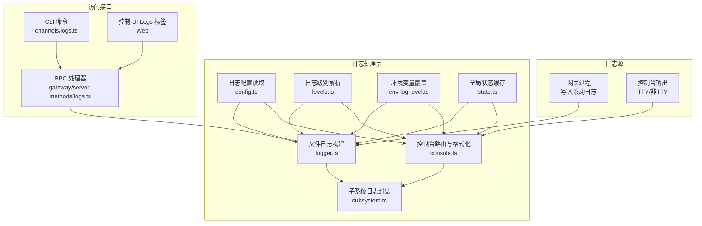
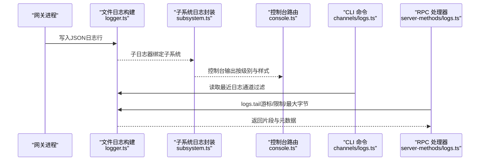
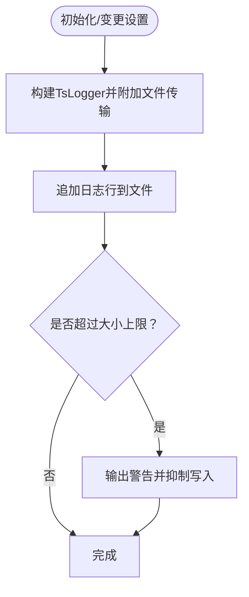
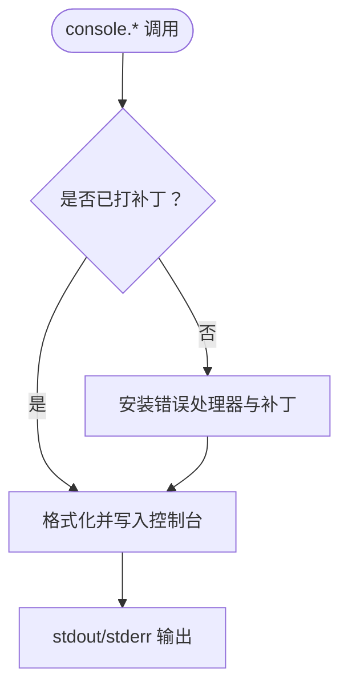
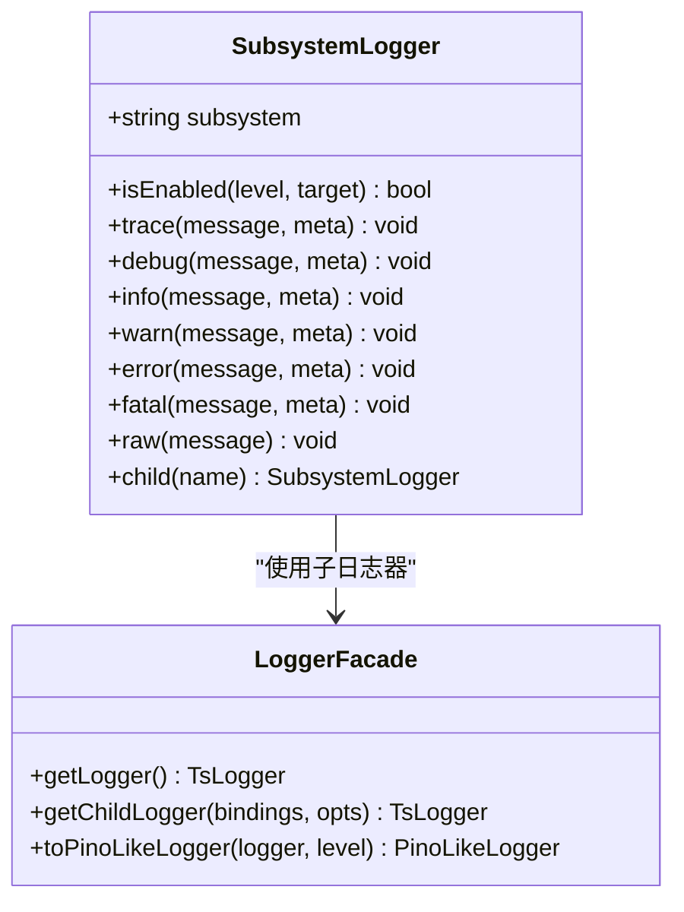
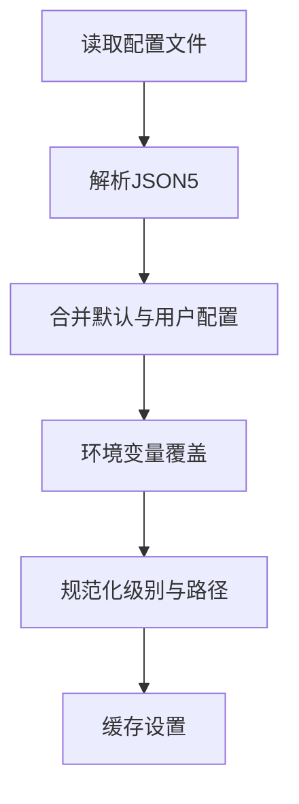
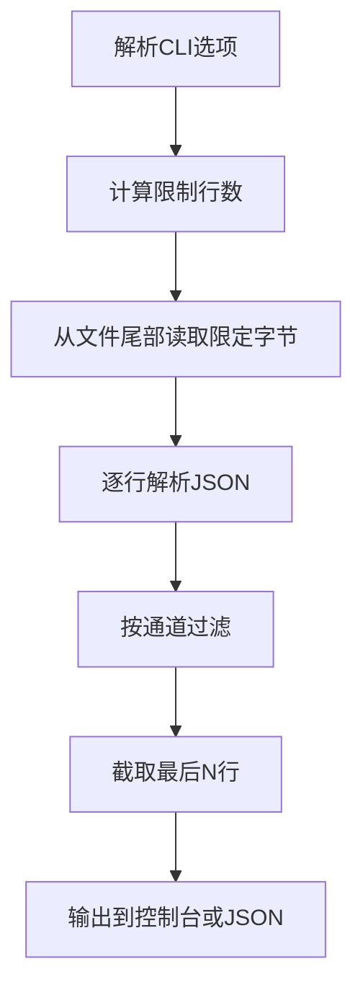
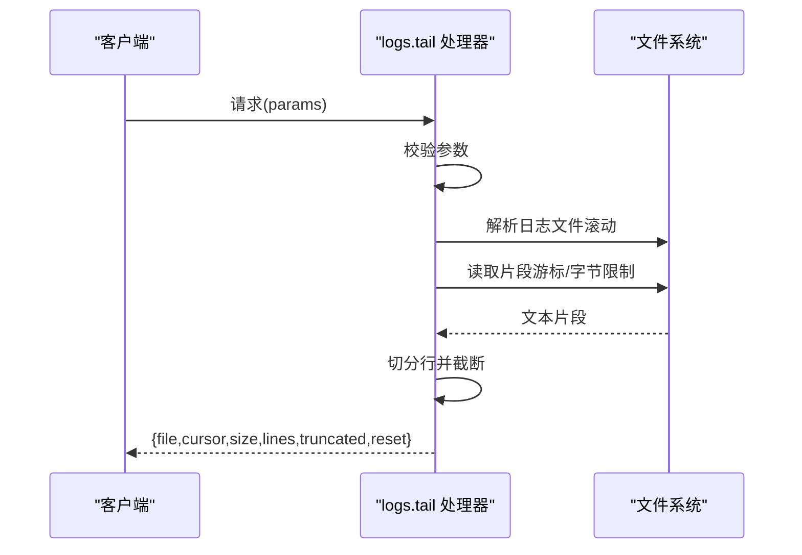
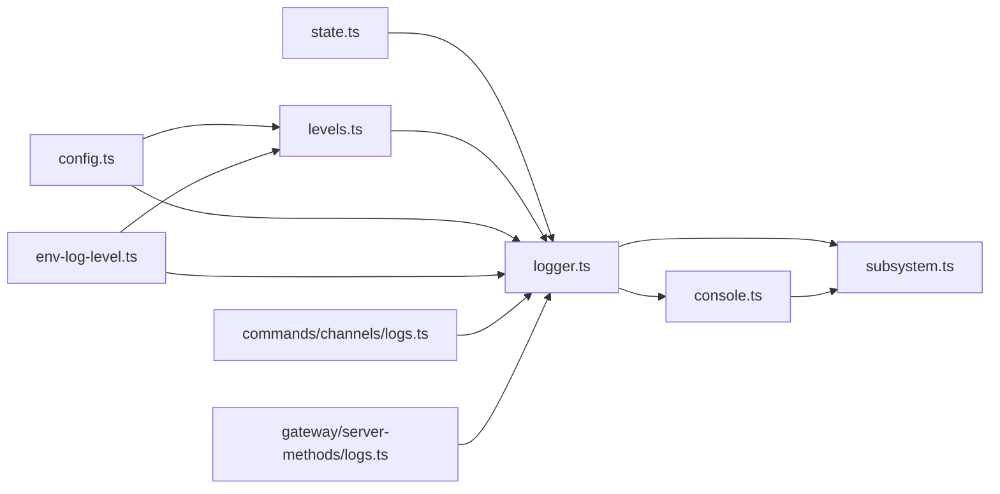

# 日志分析

<cite>
**本文引用的文件**   
- [docs/logging.md](file://docs/logging.md)
- [src/logging.ts](file://src/logging.ts)
- [src/logging/logger.ts](file://src/logging/logger.ts)
- [src/logging/console.ts](file://src/logging/console.ts)
- [src/logging/levels.ts](file://src/logging/levels.ts)
- [src/logging/subsystem.ts](file://src/logging/subsystem.ts)
- [src/logging/config.ts](file://src/logging/config.ts)
- [src/logging/state.ts](file://src/logging/state.ts)
- [src/logging/env-log-level.ts](file://src/logging/env-log-level.ts)
- [src/commands/channels/logs.ts](file://src/commands/channels/logs.ts)
- [src/gateway/server-methods/logs.ts](file://src/gateway/server-methods/logs.ts)
- [scripts/clawlog.sh](file://scripts/clawlog.sh)
</cite>

## 目录

1. [简介](#简介)
2. [项目结构](#项目结构)
3. [核心组件](#核心组件)
4. [架构总览](#架构总览)
5. [详细组件分析](#详细组件分析)
6. [依赖关系分析](#依赖关系分析)
7. [性能考量](#性能考量)
8. [故障排查指南](#故障排查指南)
9. [结论](#结论)
10. [附录](#附录)

## 简介

本指南面向OpenClaw的日志分析与处理，覆盖以下主题：

- 日志格式与来源：文件日志（JSON Lines）与控制台输出
- 结构化日志提取与解析：按子系统、通道过滤与解析
- 日志聚合与检索：滚动日志、游标分页、尾部读取
- 搜索与过滤：关键字匹配、时间范围查询思路、通道过滤
- 可视化与趋势：控制台样式、JSON模式、RPC流式输出
- 异常检测与告警：基于日志级别的阈值与关键错误信号
- ELK/OTel集成：OpenTelemetry导出、指标与追踪
- 存储优化与批量处理：滚动文件、大小上限、清理策略
- 自动化脚本与报告：CLI命令、tail模式、批处理脚本

## 项目结构

OpenClaw的日志体系由“文件日志（JSONL）+ 控制台输出”构成，核心逻辑集中在src/logging目录；CLI与网关通过RPC提供日志尾读能力；通道日志可通过专门命令进行筛选。

图表来源

- [src/logging/logger.ts](file://src/logging/logger.ts#L100-L184)
- [src/logging/console.ts](file://src/logging/console.ts#L101-L315)
- [src/logging/subsystem.ts](file://src/logging/subsystem.ts#L263-L350)
- [src/logging/config.ts](file://src/logging/config.ts#L8-L24)
- [src/logging/levels.ts](file://src/logging/levels.ts#L1-L38)
- [src/logging/env-log-level.ts](file://src/logging/env-log-level.ts#L4-L23)
- [src/logging/state.ts](file://src/logging/state.ts#L1-L20)
- [src/commands/channels/logs.ts](file://src/commands/channels/logs.ts#L76-L114)
- [src/gateway/server-methods/logs.ts](file://src/gateway/server-methods/logs.ts#L147-L181)

章节来源

- [docs/logging.md](file://docs/logging.md#L10-L115)
- [src/logging.ts](file://src/logging.ts#L1-L70)

## 核心组件

- 文件日志（JSON Lines）
  - 默认滚动文件路径：基于本地日期的文件名，自动清理过期文件
  - 写入策略：逐条追加JSON对象，带时间戳；达到大小上限时抑制写入并输出警告
- 控制台输出
  - TTY：彩色、带时间戳、子系统前缀
  - 非TTY：紧凑模式；支持强制JSON或禁用颜色
  - 可按子系统过滤输出
- 子系统日志
  - 提供统一的trace/debug/info/warn/error/fatal/raw接口
  - 支持子日志器child层级
- 配置与覆盖
  - 配置文件读取（JSON5），支持level、file、consoleLevel、consoleStyle等
  - 环境变量OPENCLAW_LOG_LEVEL优先级最高
- 访问接口
  - CLI：channels logs命令支持通道过滤与JSON输出
  - RPC：logs.tail提供游标、限制、最大字节数参数，返回文件元信息与日志片段

章节来源

- [src/logging/logger.ts](file://src/logging/logger.ts#L13-L184)
- [src/logging/console.ts](file://src/logging/console.ts#L13-L315)
- [src/logging/subsystem.ts](file://src/logging/subsystem.ts#L14-L350)
- [src/logging/config.ts](file://src/logging/config.ts#L8-L24)
- [src/logging/env-log-level.ts](file://src/logging/env-log-level.ts#L4-L23)
- [src/commands/channels/logs.ts](file://src/commands/channels/logs.ts#L76-L114)
- [src/gateway/server-methods/logs.ts](file://src/gateway/server-methods/logs.ts#L147-L181)

## 架构总览

下图展示从日志产生到消费的关键流程：文件写入、控制台格式化、CLI/RPC访问、通道过滤与解析。

图表来源

- [src/logging/logger.ts](file://src/logging/logger.ts#L100-L184)
- [src/logging/subsystem.ts](file://src/logging/subsystem.ts#L263-L350)
- [src/logging/console.ts](file://src/logging/console.ts#L101-L315)
- [src/commands/channels/logs.ts](file://src/commands/channels/logs.ts#L76-L114)
- [src/gateway/server-methods/logs.ts](file://src/gateway/server-methods/logs.ts#L147-L181)

## 详细组件分析

### 文件日志与滚动策略

- 默认日志目录与文件名：使用临时目录下的按日滚动文件
- 大小上限：默认约500MB，超过后抑制写入并输出警告
- 过期清理：保留最多24小时内的滚动文件，定期删除
- 外部传输：可注册外部传输函数，转发日志事件

图表来源

- [src/logging/logger.ts](file://src/logging/logger.ts#L100-L184)
- [src/logging/logger.ts](file://src/logging/logger.ts#L284-L309)

章节来源

- [src/logging/logger.ts](file://src/logging/logger.ts#L13-L184)
- [src/logging/logger.ts](file://src/logging/logger.ts#L284-L309)

### 控制台输出与样式

- 样式选择：pretty/compact/json，TTY自动美化，非TTY默认紧凑
- 时间戳：可选在每行前缀时间
- 子系统过滤：支持白名单前缀过滤
- EPIPE保护：捕获异步管道关闭错误，避免崩溃
- 输出重定向：RPC/JSON模式下强制输出到stderr

图表来源

- [src/logging/console.ts](file://src/logging/console.ts#L101-L315)

章节来源

- [src/logging/console.ts](file://src/logging/console.ts#L13-L315)

### 子系统日志封装

- 统一接口：trace/debug/info/warn/error/fatal/raw
- 控制台与文件双通：根据级别与过滤规则分别输出
- 子系统前缀美化：去除冗余前缀、通道优先、颜色区分
- 运行时适配：提供runtime接口，便于任务执行时记录

图表来源

- [src/logging/subsystem.ts](file://src/logging/subsystem.ts#L14-L350)
- [src/logging/logger.ts](file://src/logging/logger.ts#L175-L220)

章节来源

- [src/logging/subsystem.ts](file://src/logging/subsystem.ts#L14-L350)
- [src/logging/logger.ts](file://src/logging/logger.ts#L175-L220)

### 日志配置与级别

- 配置来源：用户配置文件（JSON5），支持level、file、consoleLevel、consoleStyle等
- 级别解析：允许silent/fatal/error/warn/info/debug/trace
- 环境变量覆盖：OPENCLAW_LOG_LEVEL优先于配置
- 缓存与重置：全局状态缓存解析结果，支持测试重置

图表来源

- [src/logging/config.ts](file://src/logging/config.ts#L8-L24)
- [src/logging/env-log-level.ts](file://src/logging/env-log-level.ts#L4-L23)
- [src/logging/levels.ts](file://src/logging/levels.ts#L13-L37)
- [src/logging/state.ts](file://src/logging/state.ts#L1-L20)

章节来源

- [src/logging/config.ts](file://src/logging/config.ts#L8-L24)
- [src/logging/env-log-level.ts](file://src/logging/env-log-level.ts#L4-L23)
- [src/logging/levels.ts](file://src/logging/levels.ts#L1-L38)
- [src/logging/state.ts](file://src/logging/state.ts#L1-L20)

### 通道日志过滤与CLI

- 通道过滤：支持all与具体通道ID，按子系统与模块字段匹配
- 尾部读取：限制最大字节数与行数，避免全量扫描
- JSON输出：便于下游解析与可视化

图表来源

- [src/commands/channels/logs.ts](file://src/commands/channels/logs.ts#L76-L114)

章节来源

- [src/commands/channels/logs.ts](file://src/commands/channels/logs.ts#L1-L114)

### RPC日志尾读与游标

- 参数校验：cursor、limit、maxBytes
- 文件解析：滚动日志自动定位最新文件
- 分片读取：从指定位置读取，保证行完整性
- 元信息：返回文件路径、当前游标、文件大小、截断与重置标记

图表来源

- [src/gateway/server-methods/logs.ts](file://src/gateway/server-methods/logs.ts#L147-L181)

章节来源

- [src/gateway/server-methods/logs.ts](file://src/gateway/server-methods/logs.ts#L1-L181)

### OpenTelemetry与诊断导出

- 诊断事件：模型用量、消息流转、队列与会话状态等
- 导出协议：OTLP/HTTP（protobuf），支持开启traces/metrics/logs
- 采样与刷新：支持采样率与刷新间隔
- 行为要点：OTLP日志遵循文件日志级别，高吞吐建议在收集端采样/过滤

章节来源

- [docs/logging.md](file://docs/logging.md#L142-L353)

## 依赖关系分析

- 模块耦合
  - logger.ts依赖levels.ts、config.ts、env-log-level.ts、state.ts
  - console.ts依赖logger.ts、levels.ts、config.ts、state.ts
  - subsystem.ts依赖console.ts、logger.ts、levels.ts
  - CLI与RPC均依赖logger.ts解析后的设置
- 外部依赖
  - 使用tslog作为底层日志库
  - JSON Lines格式用于文件日志
  - RPC协议用于远端日志尾读

图表来源

- [src/logging/logger.ts](file://src/logging/logger.ts#L1-L12)
- [src/logging/console.ts](file://src/logging/console.ts#L1-L11)
- [src/logging/subsystem.ts](file://src/logging/subsystem.ts#L1-L10)
- [src/logging/config.ts](file://src/logging/config.ts#L1-L24)
- [src/logging/env-log-level.ts](file://src/logging/env-log-level.ts#L1-L23)
- [src/logging/levels.ts](file://src/logging/levels.ts#L1-L38)
- [src/logging/state.ts](file://src/logging/state.ts#L1-L20)
- [src/commands/channels/logs.ts](file://src/commands/channels/logs.ts#L1-L12)
- [src/gateway/server-methods/logs.ts](file://src/gateway/server-methods/logs.ts#L1-L11)

章节来源

- [src/logging.ts](file://src/logging.ts#L1-L70)

## 性能考量

- 文件写入
  - 单行追加，UTF-8编码，避免频繁打开/关闭
  - 达到上限后抑制写入，减少磁盘争用
- 控制台输出
  - TTY美化与颜色开销可控，非TTY采用紧凑模式
  - 子系统过滤减少输出量
- 读取策略
  - 从文件尾部按字节上限读取，避免全量扫描
  - 游标分页减少重复传输
- 外部导出
  - OTLP导出建议在收集端做采样/过滤，降低带宽与存储压力

## 故障排查指南

- 网关不可达
  - 执行诊断命令以定位问题
- 日志为空
  - 检查网关是否运行、文件路径是否正确
- 详情不足
  - 提升文件日志级别至debug或trace
- 控制台输出异常
  - 检查TTY/颜色设置、子系统过滤、EPIPE保护

章节来源

- [docs/logging.md](file://docs/logging.md#L347-L353)

## 结论

OpenClaw的日志体系以“文件日志（JSONL）+ 控制台输出”为核心，结合子系统封装、通道过滤与RPC尾读，形成完整的可观测性闭环。通过合理的配置与导出策略，可满足从日常运维到生产级监控的多种需求。

## 附录

### 日志格式与字段

- 文件日志（JSON Lines）
  - 每行一个JSON对象，包含时间戳、级别、子系统、消息等
- 控制台输出
  - TTY：彩色、带时间戳、子系统前缀
  - 非TTY：紧凑模式
  - JSON模式：每行一条JSON对象

章节来源

- [docs/logging.md](file://docs/logging.md#L82-L115)
- [src/logging/subsystem.ts](file://src/logging/subsystem.ts#L180-L222)

### 日志搜索与过滤

- 关键字匹配
  - 在解析后的消息字段上进行字符串匹配
- 通道过滤
  - 通过子系统前缀或模块字段过滤特定通道
- 时间范围查询
  - 文件日志未内置时间字段；建议结合外部工具或在上游注入时间戳字段

章节来源

- [src/commands/channels/logs.ts](file://src/commands/channels/logs.ts#L30-L42)

### 可视化与趋势

- 控制台样式
  - pretty/compact/json三类样式，适合不同场景
- RPC流式输出
  - CLI与控制UI通过RPC获取日志片段，支持类型化对象（meta/log/notice/raw）

章节来源

- [docs/logging.md](file://docs/logging.md#L48-L67)
- [src/gateway/server-methods/logs.ts](file://src/gateway/server-methods/logs.ts#L147-L181)

### 异常检测与告警

- 建议策略
  - 基于错误/致命级别阈值触发告警
  - 监控队列深度、等待时间、会话卡住等关键指标
  - 对高频警告进行聚合统计

章节来源

- [docs/logging.md](file://docs/logging.md#L157-L222)

### ELK/OTel集成

- OpenTelemetry导出
  - OTLP/HTTP协议，支持traces/metrics/logs
  - 可配置服务名、端点、采样率与刷新间隔
- 存储优化
  - 建议在收集端进行采样/过滤与压缩
  - 合理设置日志级别与敏感信息脱敏

章节来源

- [docs/logging.md](file://docs/logging.md#L224-L353)

### 存储优化与批量处理

- 滚动与清理
  - 按日滚动文件，保留24小时内的历史
- 大小上限
  - 默认约500MB，超限后抑制写入
- 批量处理
  - CLI与RPC均支持限制行数与最大字节数，避免一次性传输过多数据

章节来源

- [src/logging/logger.ts](file://src/logging/logger.ts#L18-L20)
- [src/logging/logger.ts](file://src/logging/logger.ts#L284-L309)
- [src/gateway/server-methods/logs.ts](file://src/gateway/server-methods/logs.ts#L13-L16)

### 自动化脚本与报告

- CLI命令
  - 通道日志：支持通道过滤与JSON输出
  - 网关日志：RPC尾读，支持游标与限制
- 批处理脚本
  - 提供示例脚本入口，便于集成到CI/CD或运维流水线

章节来源

- [src/commands/channels/logs.ts](file://src/commands/channels/logs.ts#L76-L114)
- [src/gateway/server-methods/logs.ts](file://src/gateway/server-methods/logs.ts#L147-L181)
- [scripts/clawlog.sh](file://scripts/clawlog.sh)
