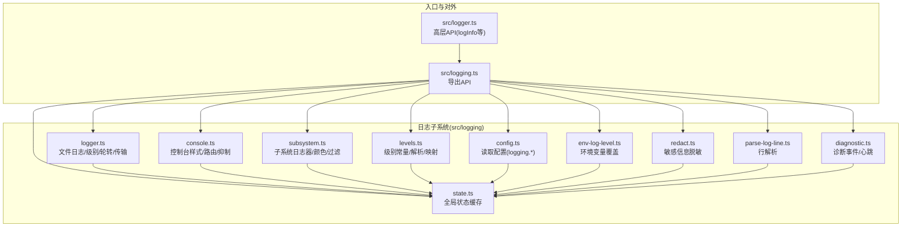
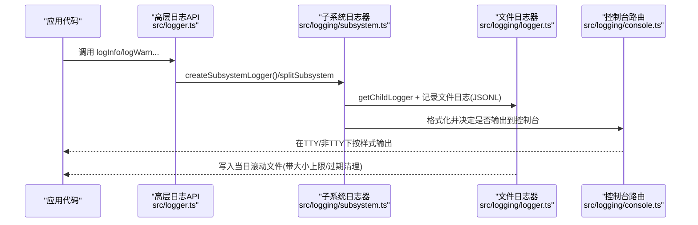
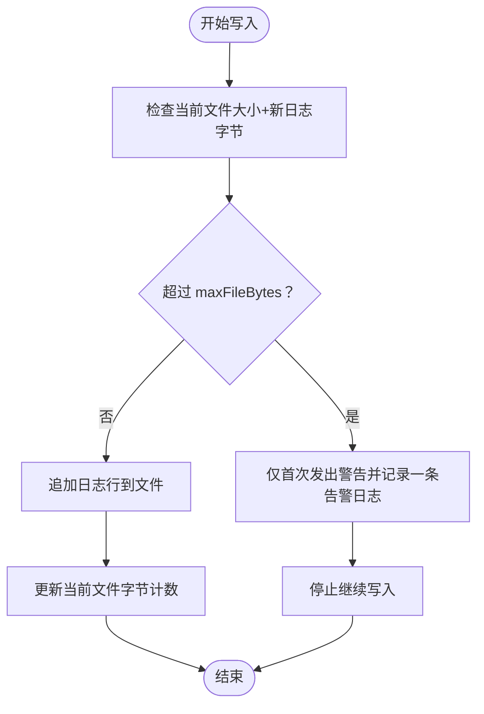
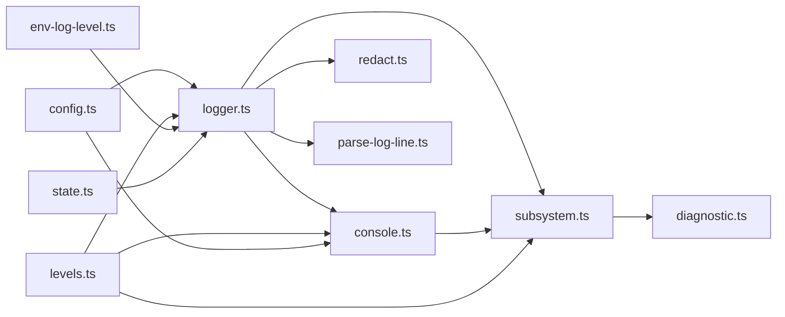

# 日志系统

<cite>
**本文引用的文件**
- [src/logging.ts](file://src/logging.ts)
- [src/logger.ts](file://src/logger.ts)
- [src/logging/config.ts](file://src/logging/config.ts)
- [src/logging/levels.ts](file://src/logging/levels.ts)
- [src/logging/console.ts](file://src/logging/console.ts)
- [src/logging/redact.ts](file://src/logging/redact.ts)
- [src/logging/subsystem.ts](file://src/logging/subsystem.ts)
- [src/logging/env-log-level.ts](file://src/logging/env-log-level.ts)
- [src/logging/state.ts](file://src/logging/state.ts)
- [src/logging/parse-log-line.ts](file://src/logging/parse-log-line.ts)
- [src/logging/diagnostic.ts](file://src/logging/diagnostic.ts)
- [src/logger.ts](file://src/logger.ts)
- [docs/logging.md](file://docs/logging.md)
</cite>

## 目录

1. [简介](#简介)
2. [项目结构](#项目结构)
3. [核心组件](#核心组件)
4. [架构总览](#架构总览)
5. [组件详解](#组件详解)
6. [依赖关系分析](#依赖关系分析)
7. [性能与容量规划](#性能与容量规划)
8. [故障排查指南](#故障排查指南)
9. [结论](#结论)
10. [附录：配置与使用指南](#附录配置与使用指南)

## 简介

本文件面向开发者与运维人员，系统性阐述 OpenClaw 的日志系统：包括日志架构设计、日志级别体系、日志格式规范、配置项与环境变量、运行时调整机制、日志记录 API、自定义日志处理器、日志中间件、日志轮转与存储管理、日志解析与脱敏、以及日志聚合与可观测性（含诊断事件与 OpenTelemetry 导出）。目标是帮助你在不同场景下正确地采集、消费、归档与分析日志。

## 项目结构

OpenClaw 的日志子系统位于 src/logging 目录，围绕“文件日志（JSONL）+ 控制台输出”两条路径构建，并通过统一的子系统日志器、级别解析、控制台样式与脱敏策略协同工作。CLI 与控制 UI 均基于同一套日志基础设施进行读取与展示。

图示来源

- [src/logging.ts](file://src/logging.ts#L1-L70)
- [src/logger.ts](file://src/logger.ts#L1-L309)
- [src/logging/console.ts](file://src/logging/console.ts#L1-L315)
- [src/logging/subsystem.ts](file://src/logging/subsystem.ts#L1-L374)
- [src/logging/levels.ts](file://src/logging/levels.ts#L1-L38)
- [src/logging/config.ts](file://src/logging/config.ts#L1-L25)
- [src/logging/env-log-level.ts](file://src/logging/env-log-level.ts#L1-L24)
- [src/logging/redact.ts](file://src/logging/redact.ts#L1-L151)
- [src/logging/parse-log-line.ts](file://src/logging/parse-log-line.ts#L1-L64)
- [src/logging/diagnostic.ts](file://src/logging/diagnostic.ts#L1-L400)
- [src/logging/state.ts](file://src/logging/state.ts#L1-L20)

章节来源

- [src/logging.ts](file://src/logging.ts#L1-L70)
- [src/logger.ts](file://src/logger.ts#L1-L62)
- [docs/logging.md](file://docs/logging.md#L1-L353)

## 核心组件

- 文件日志与轮转：基于 tslog 构建，按天滚动，默认写入 JSONL；支持文件大小上限与过期清理。
- 控制台输出：TTY 自适应、样式切换（pretty/compact/json）、时间戳前缀、子系统过滤、消息抑制。
- 子系统日志器：自动为每条日志附加子系统标签，支持颜色、层级裁剪、冗余前缀剥离。
- 级别体系：silent/fatal/error/warn/info/debug/trace，支持环境变量覆盖与 CLI 覆盖。
- 配置与环境变量：logging.\* 配置项、OPENCLAW_LOG_LEVEL、--log-level。
- 脱敏策略：默认对工具摘要脱敏，可自定义正则模式。
- 解析工具：行级 JSON 解析，提取时间、级别、子系统、模块与消息。
- 诊断事件：结构化事件用于指标、追踪与日志导出，配合 OTLP/HTTP 导出器。
- 外部传输：注册外部传输函数，将日志转发到自定义接收端。

章节来源

- [src/logger.ts](file://src/logger.ts#L1-L309)
- [src/logging/console.ts](file://src/logging/console.ts#L1-L315)
- [src/logging/subsystem.ts](file://src/logging/subsystem.ts#L1-L374)
- [src/logging/levels.ts](file://src/logging/levels.ts#L1-L38)
- [src/logging/config.ts](file://src/logging/config.ts#L1-L25)
- [src/logging/env-log-level.ts](file://src/logging/env-log-level.ts#L1-L24)
- [src/logging/redact.ts](file://src/logging/redact.ts#L1-L151)
- [src/logging/parse-log-line.ts](file://src/logging/parse-log-line.ts#L1-L64)
- [src/logging/diagnostic.ts](file://src/logging/diagnostic.ts#L1-L400)
- [src/logging/state.ts](file://src/logging/state.ts#L1-L20)

## 架构总览

OpenClaw 的日志由“文件日志（JSONL）+ 控制台输出”双通道构成，二者共享同一套级别与子系统语义。文件通道负责持久化与结构化检索，控制台通道负责人机可读输出与快速定位问题。

图示来源

- [src/logger.ts](file://src/logger.ts#L17-L61)
- [src/logging/subsystem.ts](file://src/logging/subsystem.ts#L263-L350)
- [src/logging/console.ts](file://src/logging/console.ts#L187-L315)
- [src/logging.ts](file://src/logging.ts#L1-L70)

## 组件详解

### 日志级别体系与解析

- 支持级别：silent、fatal、error、warn、info、debug、trace。
- 解析与归一：允许字符串输入，忽略空白字符；不合法值返回 undefined。
- 最小级别映射：内部以数值映射，便于快速比较。
- 默认级别：测试环境 silent，其余 info；可通过配置或环境变量覆盖。

章节来源

- [src/logging/levels.ts](file://src/logging/levels.ts#L1-L38)

### 配置与环境变量

- 配置来源优先级：运行时设置覆盖 > 配置文件 > 默认值。
- 配置项（logging.\*）：
  - level：文件日志级别
  - consoleLevel：控制台级别
  - consoleStyle：pretty/compact/json
  - file：日志文件路径（默认按日期滚动）
  - redactSensitive：off/tools
  - redactPatterns：自定义脱敏正则列表
  - maxFileBytes：单文件最大字节数（默认约 500MB）
- 环境变量：
  - OPENCLAW_LOG_LEVEL：覆盖级别（优先于配置）
- CLI 覆盖：--log-level 可临时提升级别（仅本次命令有效）

章节来源

- [src/logging/config.ts](file://src/logging/config.ts#L1-L25)
- [src/logging/env-log-level.ts](file://src/logging/env-log-level.ts#L1-L24)
- [src/logging/logger.ts](file://src/logging/logger.ts#L57-L80)
- [docs/logging.md](file://docs/logging.md#L100-L141)

### 文件日志与轮转

- 默认目录：首选 tmp 目录下的 openclaw 目录。
- 默认文件：按日期命名（如 openclaw-YYYY-MM-DD.log），每日滚动。
- 过期清理：保留最近 24 小时内的滚动文件，删除更早的文件。
- 大小上限：默认 500MB；超过后会发出警告并停止写入，同时在 stderr 输出提示。
- 外部传输：可注册外部传输函数，将日志转发至自定义接收端（如 OTLP 导出器）。

图示来源

- [src/logging/logger.ts](file://src/logging/logger.ts#L100-L149)
- [src/logging/logger.ts](file://src/logging/logger.ts#L151-L173)
- [src/logging/logger.ts](file://src/logging/logger.ts#L284-L308)

章节来源

- [src/logging/logger.ts](file://src/logging/logger.ts#L13-L38)
- [src/logging/logger.ts](file://src/logging/logger.ts#L100-L149)
- [src/logging/logger.ts](file://src/logging/logger.ts#L151-L173)
- [src/logging/logger.ts](file://src/logging/logger.ts#L270-L308)

### 控制台输出与样式

- 样式选择：TTY 下默认 pretty，非 TTY 默认 compact；也可强制 json。
- 时间戳：pretty 模式显示本地时分秒，其他模式使用 ISO 本地时区时间。
- 子系统过滤：支持按前缀过滤，避免噪音。
- 消息抑制：在非 verbose 模式下，对特定高频或冗余消息进行抑制。
- EPIPE 安全：监听 stdout/stderr 的异步错误，避免管道关闭导致崩溃。
- 路由到 stderr：RPC/JSON 模式下，控制台输出路由到 stderr，保持 stdout 清净。

章节来源

- [src/logging/console.ts](file://src/logging/console.ts#L1-L315)

### 子系统日志器与颜色/前缀

- 自动子系统：消息若带有 subsystem: 前缀，将被拆分并注入子系统日志器。
- 颜色与前缀：根据子系统哈希选择颜色；裁剪冗余前缀（如 gateway/channels）。
- 冗余前缀剥离：去除重复的子系统标签，提升可读性。
- 控制台与文件一致性：控制台与文件均使用同一子系统标识，便于关联。

章节来源

- [src/logging/subsystem.ts](file://src/logging/subsystem.ts#L1-L374)

### 脱敏与敏感信息保护

- 模式：off（关闭）、tools（默认，针对工具摘要）。
- 默认规则：涵盖 ENV 赋值、JSON 字段、CLI 参数、Authorization、PEM 块、常见令牌前缀等。
- 可配置：通过 redactPatterns 自定义正则列表。
- 应用范围：仅影响控制台输出，不影响文件日志内容。

章节来源

- [src/logging/redact.ts](file://src/logging/redact.ts#L1-L151)
- [docs/logging.md](file://docs/logging.md#L133-L141)

### 日志解析工具

- 行解析：从 JSONL 行中提取 time、level、subsystem、module、message 与原始行。
- 兼容性：兼容 \_meta 中的 date 与 logLevelName 字段，保证多来源日志的一致性。

章节来源

- [src/logging/parse-log-line.ts](file://src/logging/parse-log-line.ts#L1-L64)

### 诊断事件与可观测性

- 诊断日志：以结构化事件形式记录模型使用、消息流、队列与会话状态等。
- 心跳：周期性汇总 Webhook、队列与会话状态，作为健康度信号。
- OTLP 导出：通过 diagnostics-otel 插件，将诊断事件导出为 OTLP/HTTP（追踪、指标、日志）。
- 采样与刷新：支持根跨度采样率与指标刷新间隔配置。

章节来源

- [src/logging/diagnostic.ts](file://src/logging/diagnostic.ts#L1-L400)
- [docs/logging.md](file://docs/logging.md#L142-L346)

### 外部日志处理器与中间件

- 注册传输：registerLogTransport 可注册外部传输函数，将日志转发到自定义接收端。
- 适配器：toPinoLikeLogger 提供轻量级 pino 形状适配，便于第三方库集成。
- 控制台捕获：enableConsoleCapture 将 console.\* 调用同时写入文件日志，确保所有输出都被捕获。

章节来源

- [src/logging/logger.ts](file://src/logging/logger.ts#L252-L261)
- [src/logging/logger.ts](file://src/logging/logger.ts#L200-L231)
- [src/logging/console.ts](file://src/logging/console.ts#L187-L315)

## 依赖关系分析

- 模块耦合：
  - logger.ts 为核心，依赖 levels.ts、config.ts、env-log-level.ts、state.ts。
  - console.ts 依赖 logger.ts、levels.ts、config.ts、state.ts、timestamps.ts。
  - subsystem.ts 依赖 console.ts、levels.ts、logger.ts、state.ts。
  - redact.ts 依赖 config.ts、safe-regex。
  - diagnostic.ts 依赖 subsystem.ts、diagnostic-session-state.ts。
- 关键依赖链：
  - 配置 → 级别解析 → 日志器构建 → 文件写入/外部传输。
  - 控制台样式 → 子系统格式化 → 输出到 stderr/stdout。
  - 脱敏策略 → 文本处理 → 控制台输出。
- 循环依赖：未见循环导入；各模块职责清晰，通过 state.ts 缓存共享状态。

图示来源

- [src/logging/config.ts](file://src/logging/config.ts#L1-L25)
- [src/logging/levels.ts](file://src/logging/levels.ts#L1-L38)
- [src/logging/env-log-level.ts](file://src/logging/env-log-level.ts#L1-L24)
- [src/logging/state.ts](file://src/logging/state.ts#L1-L20)
- [src/logging/logger.ts](file://src/logging/logger.ts#L1-L309)
- [src/logging/console.ts](file://src/logging/console.ts#L1-L315)
- [src/logging/subsystem.ts](file://src/logging/subsystem.ts#L1-L374)
- [src/logging/redact.ts](file://src/logging/redact.ts#L1-L151)
- [src/logging/parse-log-line.ts](file://src/logging/parse-log-line.ts#L1-L64)
- [src/logging/diagnostic.ts](file://src/logging/diagnostic.ts#L1-L400)

## 性能与容量规划

- 文件大小上限：默认约 500MB，超限后停止写入并发出一次性警告，避免磁盘膨胀。
- 滚动与过期：按天滚动，保留最近 24 小时，减少历史文件数量。
- 控制台开销：TTY 样式与颜色渲染、子系统颜色计算、消息抑制与脱敏均在内存中完成，开销可控。
- 外部传输：传输失败不会阻塞主流程，避免成为性能瓶颈。
- 建议：
  - 生产环境建议开启文件大小上限与过期清理。
  - 高并发场景下，优先使用 compact 或 json 控制台样式，减少颜色与格式化成本。
  - 对于 OTLP 导出，结合收集器端的采样与过滤策略，降低网络与存储压力。

章节来源

- [src/logging/logger.ts](file://src/logging/logger.ts#L18-L20)
- [src/logging/logger.ts](file://src/logging/logger.ts#L151-L173)
- [src/logging/logger.ts](file://src/logging/logger.ts#L284-L308)
- [docs/logging.md](file://docs/logging.md#L327-L346)

## 故障排查指南

- Gateway 不可达：先执行诊断命令，再查看日志文件路径与权限。
- 日志为空：确认 Gateway 正在运行且写入路径存在；检查配置文件与环境变量。
- 需要更详细信息：将 logging.level 提升到 debug 或 trace。
- 控制台输出异常：检查 TTY 状态、FORCE_COLOR/NO_COLOR、终端类型；必要时切换 consoleStyle。
- EPIPE 错误：系统已内置异步错误处理，避免崩溃；如仍出现，检查上游管道关闭时机。
- 脱敏导致难以定位：在开发调试阶段可临时关闭脱敏或调整 redactPatterns。

章节来源

- [docs/logging.md](file://docs/logging.md#L347-L353)
- [src/logging/console.ts](file://src/logging/console.ts#L152-L155)
- [src/logging/console.ts](file://src/logging/console.ts#L203-L213)

## 结论

OpenClaw 的日志系统以“文件 JSONL + 控制台输出”为核心，辅以子系统标签、级别体系、样式与脱敏策略，满足从日常运维到生产可观测性的多种需求。通过配置与环境变量的灵活组合、文件大小上限与滚动清理、以及诊断事件与 OTLP 导出能力，系统在易用性与可扩展性之间取得良好平衡。

## 附录：配置与使用指南

### 日志级别与覆盖

- 级别顺序：silent < fatal < error < warn < info < debug < trace
- 覆盖优先级：运行时设置 > 配置文件 > 环境变量 > 默认值
- 环境变量：OPENCLAW_LOG_LEVEL
- CLI：--log-level

章节来源

- [src/logging/levels.ts](file://src/logging/levels.ts#L1-L38)
- [src/logging/env-log-level.ts](file://src/logging/env-log-level.ts#L1-L24)
- [src/logging/logger.ts](file://src/logging/logger.ts#L57-L80)
- [docs/logging.md](file://docs/logging.md#L116-L124)

### 日志格式与输出

- 文件格式：JSONL，每行一个结构化对象，包含时间、级别、子系统、消息等字段。
- 控制台格式：TTY 下彩色、带时间戳；非 TTY 下紧凑；可强制 json。
- 子系统前缀：自动裁剪冗余前缀，颜色区分。

章节来源

- [src/logging/subsystem.ts](file://src/logging/subsystem.ts#L180-L222)
- [docs/logging.md](file://docs/logging.md#L82-L96)

### 配置项参考

- logging.level：文件日志级别
- logging.consoleLevel：控制台级别
- logging.consoleStyle：pretty/compact/json
- logging.file：日志文件路径（默认按日期滚动）
- logging.redactSensitive：off/tools
- logging.redactPatterns：自定义脱敏正则列表
- logging.maxFileBytes：单文件最大字节数（默认约 500MB）

章节来源

- [src/logging/config.ts](file://src/logging/config.ts#L1-L25)
- [src/logging/logger.ts](file://src/logging/logger.ts#L23-L38)
- [docs/logging.md](file://docs/logging.md#L103-L114)

### 日志轮转与存储管理

- 滚动策略：按日期生成文件名，当日文件持续写入。
- 过期清理：保留最近 24 小时内的滚动文件。
- 大小上限：默认 500MB；超限时停止写入并记录一次告警。

章节来源

- [src/logging/logger.ts](file://src/logging/logger.ts#L13-L20)
- [src/logging/logger.ts](file://src/logging/logger.ts#L270-L308)
- [src/logging/logger.ts](file://src/logging/logger.ts#L151-L173)

### 日志解析与聚合

- 行解析：parseLogLine 支持从 JSONL 行中提取关键字段。
- 聚合建议：结合 CLI 的 --json 模式与外部日志收集器（如 OTLP 收集器）进行统一聚合与查询。

章节来源

- [src/logging/parse-log-line.ts](file://src/logging/parse-log-line.ts#L1-L64)
- [docs/logging.md](file://docs/logging.md#L48-L62)

### 敏感信息脱敏

- 模式：tools（默认）仅对工具摘要脱敏；off 关闭脱敏。
- 规则：默认包含常见令牌、PEM 块、Authorization 等；可自定义正则列表。
- 影响范围：仅控制台输出，文件日志保持原样。

章节来源

- [src/logging/redact.ts](file://src/logging/redact.ts#L1-L151)
- [docs/logging.md](file://docs/logging.md#L133-L141)

### 诊断事件与 OTLP 导出

- 事件类型：模型使用、Webhook、消息处理、队列与会话状态、心跳等。
- 导出协议：OTLP/HTTP（protobuf），支持 traces/metrics/logs 开关与采样。
- 配置要点：插件启用、服务名、端点、协议、采样率、刷新间隔、请求头等。

章节来源

- [src/logging/diagnostic.ts](file://src/logging/diagnostic.ts#L1-L400)
- [docs/logging.md](file://docs/logging.md#L142-L346)

### 使用示例与最佳实践

- 快速定位问题：使用 CLI --follow 实时查看；必要时提升级别到 debug。
- 控制台友好：在交互式终端使用 pretty，在 CI/非 TTY 使用 compact。
- 生产安全：开启文件大小上限与过期清理；谨慎开启 OTLP 日志导出，结合收集器端策略。
- 自定义处理：通过 registerLogTransport 注册外部传输，对接企业日志平台。

章节来源

- [docs/logging.md](file://docs/logging.md#L38-L81)
- [src/logging/logger.ts](file://src/logging/logger.ts#L252-L261)
- [src/logging/console.ts](file://src/logging/console.ts#L101-L118)
