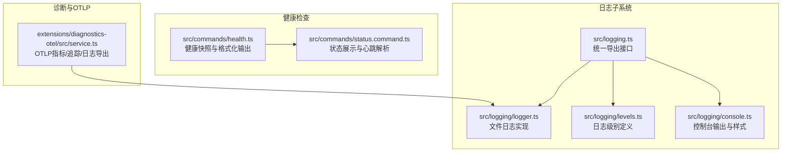
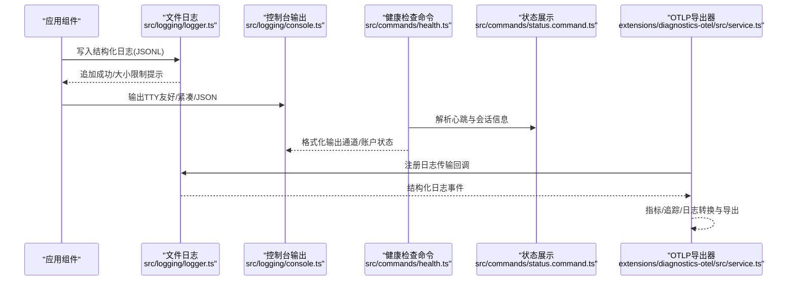
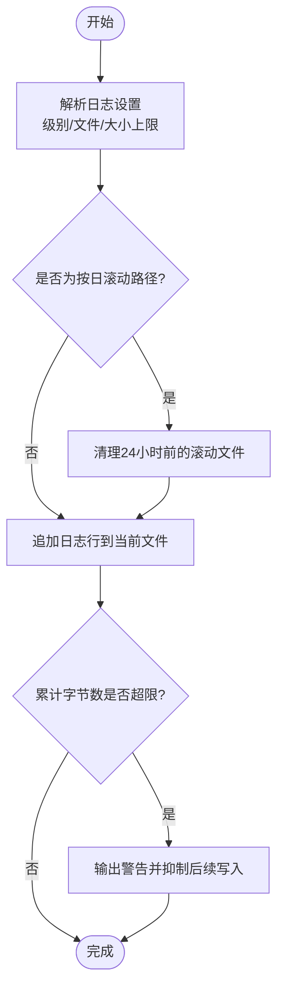
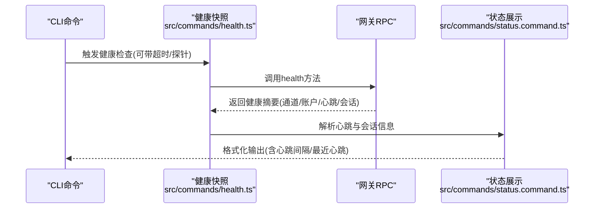
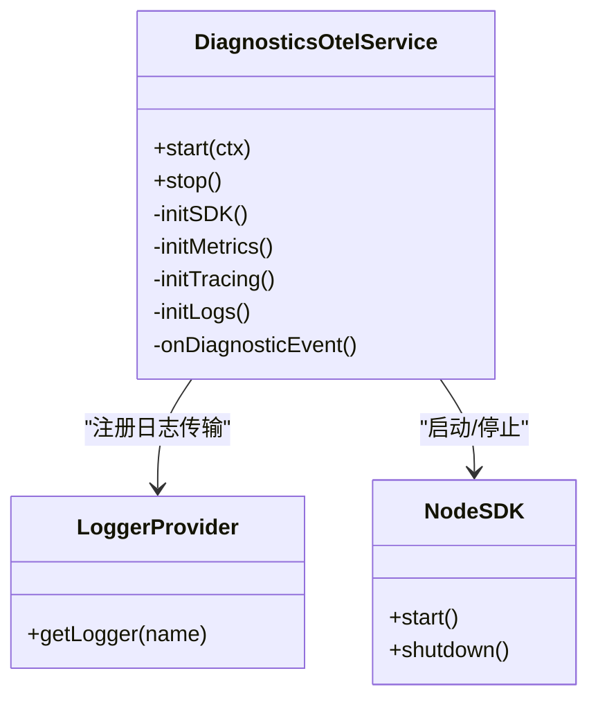
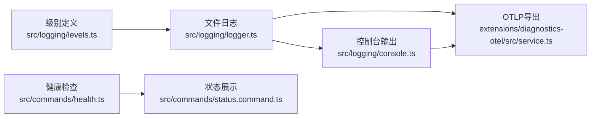

# 监控与日志

<cite>
**本文引用的文件**
- [src/logging.ts](file://src/logging.ts)
- [src/logger.ts](file://src/logger.ts)
- [src/logging/logger.ts](file://src/logging/logger.ts)
- [src/logging/levels.ts](file://src/logging/levels.ts)
- [src/logging/console.ts](file://src/logging/console.ts)
- [src/commands/health.ts](file://src/commands/health.ts)
- [src/commands/status.command.ts](file://src/commands/status.command.ts)
- [extensions/diagnostics-otel/src/service.ts](file://extensions/diagnostics-otel/src/service.ts)
- [docs/logging.md](file://docs/logging.md)
</cite>

## 目录

1. [简介](#简介)
2. [项目结构](#项目结构)
3. [核心组件](#核心组件)
4. [架构总览](#架构总览)
5. [组件详解](#组件详解)
6. [依赖关系分析](#依赖关系分析)
7. [性能考量](#性能考量)
8. [故障排查指南](#故障排查指南)
9. [结论](#结论)
10. [附录](#附录)

## 简介

本指南面向运维与开发团队，系统化阐述 OpenClaw 的监控与日志体系：包括日志系统架构、日志级别与控制、滚动与保留策略；健康检查机制、性能指标采集与告警配置；以及 Prometheus 集成、Grafana 仪表盘与 ELK 日志分析方案。文档同时覆盖系统监控、应用性能监控与业务指标跟踪，并提供故障诊断流程、错误追踪与根因分析方法，帮助快速定位问题并优化系统稳定性。

## 项目结构

OpenClaw 的监控与日志能力由“文件日志（JSONL）+ 控制台输出 + 健康检查命令 + 可选的 OpenTelemetry 导出”构成。关键模块分布如下：

- 日志子系统：统一入口导出到文件与控制台，支持级别过滤、滚动与清理、控制台样式与时间戳前缀等。
- 健康检查：通过命令聚合通道状态、心跳间隔、会话存储信息，支持详细探针与格式化输出。
- 诊断与 OTLP：可选插件将诊断事件与日志转换为 OTLP 指标/追踪/日志，供外部可观测性平台消费。

图表来源

- [src/logging.ts](file://src/logging.ts#L1-L70)
- [src/logging/logger.ts](file://src/logging/logger.ts#L1-L309)
- [src/logging/levels.ts](file://src/logging/levels.ts#L1-L38)
- [src/logging/console.ts](file://src/logging/console.ts#L1-L315)
- [src/commands/health.ts](file://src/commands/health.ts#L1-L752)
- [src/commands/status.command.ts](file://src/commands/status.command.ts#L295-L335)
- [extensions/diagnostics-otel/src/service.ts](file://extensions/diagnostics-otel/src/service.ts#L1-L679)

章节来源

- [src/logging.ts](file://src/logging.ts#L1-L70)
- [src/logging/logger.ts](file://src/logging/logger.ts#L1-L309)
- [src/logging/levels.ts](file://src/logging/levels.ts#L1-L38)
- [src/logging/console.ts](file://src/logging/console.ts#L1-L315)
- [src/commands/health.ts](file://src/commands/health.ts#L1-L752)
- [src/commands/status.command.ts](file://src/commands/status.command.ts#L295-L335)
- [extensions/diagnostics-otel/src/service.ts](file://extensions/diagnostics-otel/src/service.ts#L1-L679)

## 核心组件

- 文件日志（JSONL）：按天滚动，默认路径位于临时目录，具备最大文件大小限制与过期清理。
- 控制台输出：TTY 自适应、样式可选（美化/紧凑/JSON），支持时间戳前缀与子系统过滤。
- 健康检查命令：聚合通道连通性、认证时效、探针耗时、心跳间隔与会话存储状态。
- 诊断与 OTLP：在启用后，将诊断事件与日志转换为 OTLP 指标/追踪/日志，支持采样率与刷新周期配置。

章节来源

- [src/logging/logger.ts](file://src/logging/logger.ts#L13-L19)
- [src/logging/console.ts](file://src/logging/console.ts#L50-L58)
- [src/commands/health.ts](file://src/commands/health.ts#L348-L523)
- [extensions/diagnostics-otel/src/service.ts](file://extensions/diagnostics-otel/src/service.ts#L65-L97)

## 架构总览

下图展示了从日志生成、控制台渲染到 OTLP 导出的整体链路，以及健康检查命令如何汇总系统状态。

图表来源

- [src/logging/logger.ts](file://src/logging/logger.ts#L100-L149)
- [src/logging/console.ts](file://src/logging/console.ts#L191-L315)
- [src/commands/health.ts](file://src/commands/health.ts#L348-L523)
- [src/commands/status.command.ts](file://src/commands/status.command.ts#L295-L335)
- [extensions/diagnostics-otel/src/service.ts](file://extensions/diagnostics-otel/src/service.ts#L253-L359)

## 组件详解

### 日志系统架构与滚动策略

- 默认滚动文件：基于日期的滚动文件名，位于首选临时目录，每日生成新文件。
- 大小限制与抑制：当日志文件字节超过阈值时，写入被抑制并在标准错误输出警告，避免磁盘膨胀。
- 过期清理：自动删除超过 24 小时的滚动文件，保持磁盘空间可控。
- 文件级别与控制台级别：二者独立配置，环境变量可覆盖配置文件中的级别。

图表来源

- [src/logging/logger.ts](file://src/logging/logger.ts#L57-L80)
- [src/logging/logger.ts](file://src/logging/logger.ts#L100-L149)
- [src/logging/logger.ts](file://src/logging/logger.ts#L284-L308)

章节来源

- [src/logging/logger.ts](file://src/logging/logger.ts#L13-L19)
- [src/logging/logger.ts](file://src/logging/logger.ts#L57-L80)
- [src/logging/logger.ts](file://src/logging/logger.ts#L100-L149)
- [src/logging/logger.ts](file://src/logging/logger.ts#L284-L308)

### 日志级别与控制台样式

- 支持级别：silent/fatal/error/warn/info/debug/trace，内部映射到具体数值以实现最小级别过滤。
- 控制台样式：TTY 环境默认美化，非 TTY 默认紧凑；支持强制 JSON 输出与禁用颜色。
- 时间戳前缀：可选择在控制台消息前添加本地时间戳，便于快速定位。
- 子系统过滤：可按前缀过滤控制台输出，减少噪声。

章节来源

- [src/logging/levels.ts](file://src/logging/levels.ts#L1-L38)
- [src/logging/console.ts](file://src/logging/console.ts#L50-L58)
- [src/logging/console.ts](file://src/logging/console.ts#L157-L166)
- [src/logging/console.ts](file://src/logging/console.ts#L120-L126)

### 健康检查机制与状态展示

- 健康快照：聚合通道账户配置状态、认证时效、探针结果与耗时；支持超时与详细探针模式。
- 心跳解析：解析默认代理的心跳间隔与最近一次心跳时间、渠道与账户标识。
- 会话存储：统计会话数量与最近更新时间，辅助判断运行状态与负载。
- 输出格式：支持 JSON 与人类可读格式，TTY 环境美化显示，非 TTY 紧凑输出。

图表来源

- [src/commands/health.ts](file://src/commands/health.ts#L348-L523)
- [src/commands/status.command.ts](file://src/commands/status.command.ts#L295-L335)

章节来源

- [src/commands/health.ts](file://src/commands/health.ts#L348-L523)
- [src/commands/status.command.ts](file://src/commands/status.command.ts#L295-L335)

### 诊断事件与 OpenTelemetry 导出

- 启用方式：在配置中开启诊断与 OTLP 插件，支持协议、端点、服务名、采样率与刷新间隔等参数。
- 导出内容：指标（令牌用量、成本、上下文、消息流、队列深度/等待、会话状态/卡滞、重试尝试）、追踪（模型使用、Webhook/消息处理）、日志（OTLP Protobuf）。
- 属性与脱敏：将日志属性标准化并进行敏感信息脱敏，确保跨边界传输安全。
- 生命周期：启动时初始化 SDK/指标/追踪/日志提供者，停止时优雅关闭。

图表来源

- [extensions/diagnostics-otel/src/service.ts](file://extensions/diagnostics-otel/src/service.ts#L65-L97)
- [extensions/diagnostics-otel/src/service.ts](file://extensions/diagnostics-otel/src/service.ts#L129-L149)
- [extensions/diagnostics-otel/src/service.ts](file://extensions/diagnostics-otel/src/service.ts#L236-L251)
- [extensions/diagnostics-otel/src/service.ts](file://extensions/diagnostics-otel/src/service.ts#L659-L679)

章节来源

- [extensions/diagnostics-otel/src/service.ts](file://extensions/diagnostics-otel/src/service.ts#L65-L97)
- [extensions/diagnostics-otel/src/service.ts](file://extensions/diagnostics-otel/src/service.ts#L129-L149)
- [extensions/diagnostics-otel/src/service.ts](file://extensions/diagnostics-otel/src/service.ts#L236-L251)
- [extensions/diagnostics-otel/src/service.ts](file://extensions/diagnostics-otel/src/service.ts#L659-L679)

## 依赖关系分析

- 日志子系统内部耦合度低：级别定义、文件实现与控制台输出通过统一入口导出，便于替换与扩展。
- 健康检查命令依赖配置加载、通道插件与网关 RPC，输出依赖终端样式模块。
- OTLP 插件依赖诊断事件总线与日志传输，对文件日志与控制台输出无直接耦合。

图表来源

- [src/logging/levels.ts](file://src/logging/levels.ts#L1-L38)
- [src/logging/logger.ts](file://src/logging/logger.ts#L1-L309)
- [src/logging/console.ts](file://src/logging/console.ts#L1-L315)
- [src/commands/health.ts](file://src/commands/health.ts#L1-L752)
- [src/commands/status.command.ts](file://src/commands/status.command.ts#L295-L335)
- [extensions/diagnostics-otel/src/service.ts](file://extensions/diagnostics-otel/src/service.ts#L1-L679)

章节来源

- [src/logging/levels.ts](file://src/logging/levels.ts#L1-L38)
- [src/logging/logger.ts](file://src/logging/logger.ts#L1-L309)
- [src/logging/console.ts](file://src/logging/console.ts#L1-L315)
- [src/commands/health.ts](file://src/commands/health.ts#L1-L752)
- [src/commands/status.command.ts](file://src/commands/status.command.ts#L295-L335)
- [extensions/diagnostics-otel/src/service.ts](file://extensions/diagnostics-otel/src/service.ts#L1-L679)

## 性能考量

- 日志写入：采用同步追加，超限后抑制写入并输出警告，避免阻塞主流程。
- 滚动与清理：按天滚动与 24 小时清理降低磁盘压力；建议结合系统级日志轮转工具（如 logrotate）进一步保障稳定性。
- 控制台输出：TTY 环境美化与紧凑模式切换，避免在非 TTY 环境产生冗余格式开销。
- OTLP 导出：支持采样率与刷新间隔配置，建议在高吞吐场景下调低采样或延长刷新周期以平衡可观测性与资源消耗。

## 故障排查指南

- 网关不可达：优先执行自检命令，确认网关连接详情与健康摘要。
- 日志为空：检查文件路径与写入权限，确认级别未设为静默，必要时提升到调试级别。
- 控制台噪音：使用子系统过滤与紧凑模式，减少无关输出。
- OTLP 导出异常：检查端点、协议与头部配置，确认服务名与采样率合理；查看导出器启动与关闭日志。

章节来源

- [src/commands/health.ts](file://src/commands/health.ts#L525-L751)
- [docs/logging.md](file://docs/logging.md#L347-L353)

## 结论

OpenClaw 提供了完善的日志与健康检查能力，并通过可选的 OTLP 插件实现与现代可观测性平台的无缝对接。通过合理的日志级别与滚动策略、清晰的健康检查输出与诊断事件导出，运维团队可以高效地进行系统监控、性能分析与故障定位。

## 附录

### 日志配置要点

- 文件路径与级别：可通过配置文件或环境变量覆盖，支持按天滚动与大小限制。
- 控制台样式：TTY/非 TTY 自适应，支持 JSON 输出与禁色。
- 敏感信息脱敏：控制台可按工具集脱敏，OTLP 导出亦进行属性脱敏。

章节来源

- [docs/logging.md](file://docs/logging.md#L103-L141)
- [extensions/diagnostics-otel/src/service.ts](file://extensions/diagnostics-otel/src/service.ts#L57-L63)

### 健康检查命令用法

- 基本健康检查：输出通道与账户状态、心跳间隔与最近心跳。
- 详细探针：可选开启，返回探针耗时与错误信息。
- JSON 输出：便于自动化与日志分析平台接入。

章节来源

- [src/commands/health.ts](file://src/commands/health.ts#L525-L751)

### Prometheus 与 Grafana 集成建议

- 指标命名：遵循 OTLP 指标规范，统一前缀与标签键，便于在 Prometheus 中查询与聚合。
- 抓取策略：建议通过 OTLP Collector 或直接抓取指标端点，结合服务发现与动态标签。
- 仪表盘：基于令牌用量、成本、消息处理时延、队列深度/等待、会话卡滞等关键指标构建仪表盘。

章节来源

- [extensions/diagnostics-otel/src/service.ts](file://extensions/diagnostics-otel/src/service.ts#L160-L235)

### ELK 日志分析方案

- 输入：将文件日志作为输入源，结合 Filebeat/Logstash 进行解析与索引。
- 结构化：利用 JSONL 的结构化字段进行字段提取与映射，支持按子系统与级别过滤。
- 查询与可视化：在 Kibana 中建立仪表盘，结合时间序列与热力图分析异常峰值与趋势。

章节来源

- [docs/logging.md](file://docs/logging.md#L84-L96)
