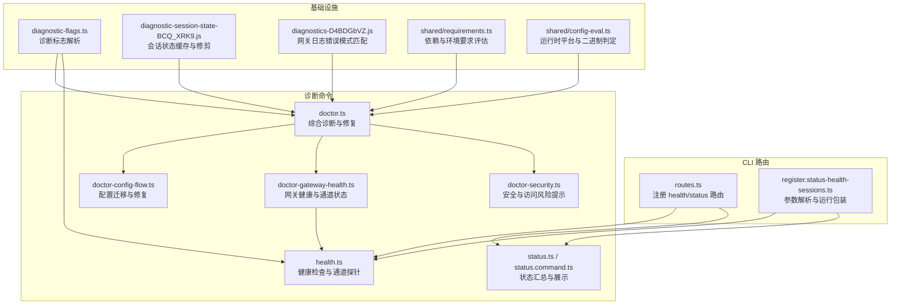
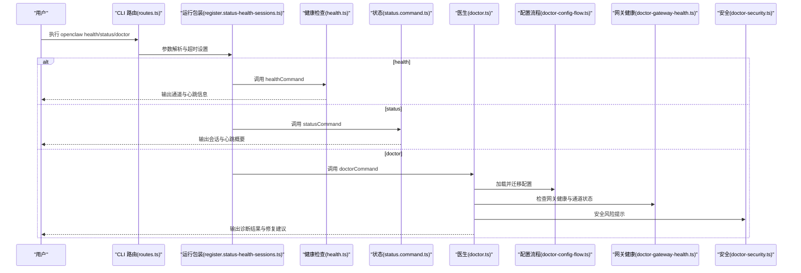
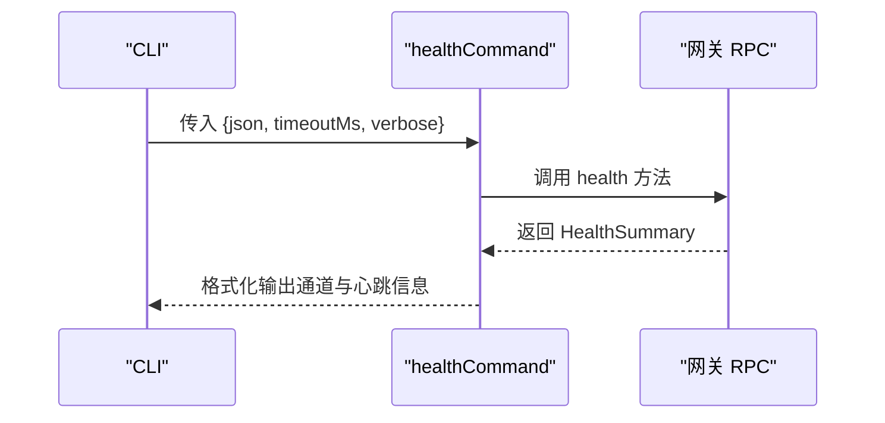
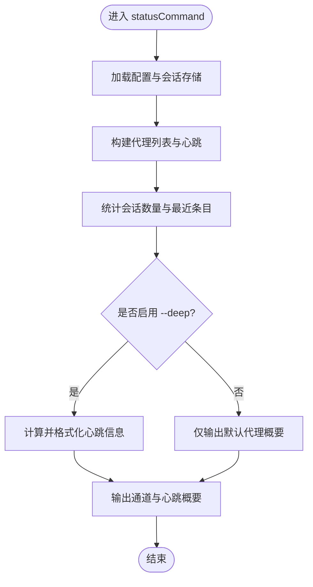
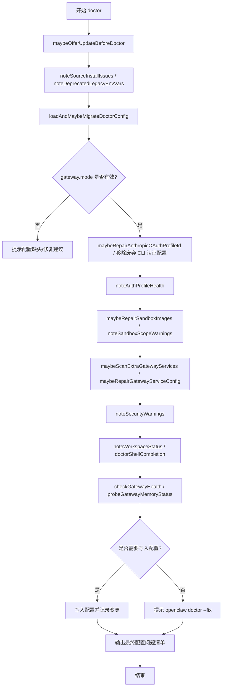
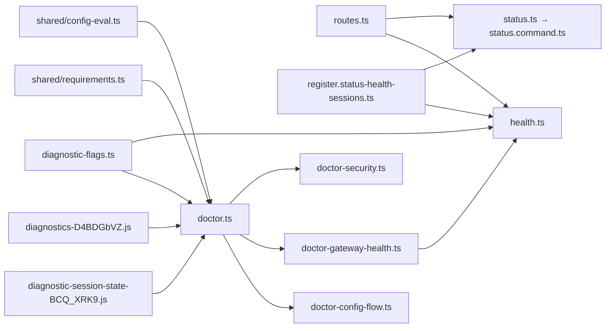

# 诊断工具

<cite>
**本文引用的文件**
- [src/commands/doctor.ts](file://src/commands/doctor.ts)
- [src/commands/health.ts](file://src/commands/health.ts)
- [src/commands/status.ts](file://src/commands/status.ts)
- [src/commands/status.command.ts](file://src/commands/status.command.ts)
- [src/commands/doctor-config-flow.ts](file://src/commands/doctor-config-flow.ts)
- [src/commands/doctor-gateway-health.ts](file://src/commands/doctor-gateway-health.ts)
- [src/commands/doctor-security.ts](file://src/commands/doctor-security.ts)
- [src/cli/program/routes.ts](file://src/cli/program/routes.ts)
- [src/cli/program/register.status-health-sessions.ts](file://src/cli/program/register.status-health-sessions.ts)
- [src/cli/program/config-guard.ts](file://src/cli/program/config-guard.ts)
- [dist/diagnostics-D4BDGbVZ.js](file://dist/diagnostics-D4BDGbVZ.js)
- [dist/diagnostic-session-state-BCQ_xRK9.js](file://dist/diagnostic-session-state-BCQ_xRK9.js)
- [src/infra/diagnostic-flags.ts](file://src/infra/diagnostic-flags.ts)
- [src/shared/requirements.ts](file://src/shared/requirements.ts)
- [src/shared/config-eval.ts](file://src/shared/config-eval.ts)
- [src/gateway/server-methods/nodes.ts](file://src/gateway/server-methods/nodes.ts)
- [extensions/open-prose/skills/prose/examples/36-bug-hunter.prose](file://extensions/open-prose/skills/prose/examples/36-bug-hunter.prose)
- [extensions/open-prose/skills/prose/lib/error-forensics.prose](file://extensions/open-prose/skills/prose/lib/error-forensics.prose)
- [extensions/open-prose/skills/prose/examples/45-run-endpoint-ux-test-with-remediation.prose](file://extensions/open-prose/skills/prose/examples/45-run-endpoint-ux-test-with-remediation.prose)
- [docs/zh-CN/gateway/troubleshooting.md](file://docs/zh-CN/gateway/troubleshooting.md)
- [docs/zh-CN/automation/troubleshooting.md](file://docs/zh-CN/automation/troubleshooting.md)
</cite>

## 目录

1. [简介](#简介)
2. [项目结构](#项目结构)
3. [核心组件](#核心组件)
4. [架构总览](#架构总览)
5. [详细组件分析](#详细组件分析)
6. [依赖关系分析](#依赖关系分析)
7. [性能考量](#性能考量)
8. [故障排查指南](#故障排查指南)
9. [结论](#结论)
10. [附录](#附录)

## 简介

本文件面向技术支持与运维团队，系统化梳理 OpenClaw 诊断工具集的设计与使用方法，覆盖内置诊断命令、自动诊断流程、手动诊断方法、配置诊断、安全检查、系统完整性验证、报告生成、问题定位与修复建议，并提供网络连通性检查、权限验证与依赖项检测等实用能力。文档同时给出可视化图示与分层讲解，帮助不同技术背景的读者快速上手。

## 项目结构

诊断工具在 CLI 层通过路由注册命令，在命令层组织健康检查、状态查询与医生（doctor）诊断流程；在基础设施层提供诊断标志解析、会话状态管理、网关日志错误模式匹配等支撑能力；在扩展层提供基于 LLM 的取证与排障工作流。

**图表来源**

- [src/cli/program/routes.ts](file://src/cli/program/routes.ts#L1-L43)
- [src/cli/program/register.status-health-sessions.ts](file://src/cli/program/register.status-health-sessions.ts#L1-L41)
- [src/commands/health.ts](file://src/commands/health.ts#L1-L752)
- [src/commands/status.ts](file://src/commands/status.ts#L1-L4)
- [src/commands/status.command.ts](file://src/commands/status.command.ts#L295-L335)
- [src/commands/doctor.ts](file://src/commands/doctor.ts#L1-L327)
- [src/commands/doctor-config-flow.ts](file://src/commands/doctor-config-flow.ts#L1-L800)
- [src/commands/doctor-gateway-health.ts](file://src/commands/doctor-gateway-health.ts#L1-L93)
- [src/commands/doctor-security.ts](file://src/commands/doctor-security.ts#L1-L188)
- [src/infra/diagnostic-flags.ts](file://src/infra/diagnostic-flags.ts#L1-L92)
- [dist/diagnostic-session-state-BCQ_xRK9.js](file://dist/diagnostic-session-state-BCQ_xRK9.js#L1-L59)
- [dist/diagnostics-D4BDGbVZ.js](file://dist/diagnostics-D4BDGbVZ.js#L1-L35)
- [src/shared/requirements.ts](file://src/shared/requirements.ts#L114-L221)
- [src/shared/config-eval.ts](file://src/shared/config-eval.ts#L108-L150)

**章节来源**

- [src/cli/program/routes.ts](file://src/cli/program/routes.ts#L1-L43)
- [src/cli/program/register.status-health-sessions.ts](file://src/cli/program/register.status-health-sessions.ts#L1-L41)

## 核心组件

- 健康检查命令（health）
  - 通过网关 RPC 获取健康摘要，支持通道探针与详细输出，用于判断网关可达性与各通道账户连通性。
- 状态命令（status）
  - 汇总会话存储路径、最近会话、心跳间隔等信息，支持深度模式与 JSON 输出。
- 医生命令（doctor）
  - 综合执行配置迁移、认证健康、网关健康、内存搜索健康、沙箱镜像、安全风险提示、工作区状态等检查与修复。
- 配置诊断流程（doctor-config-flow）
  - 解析并清理未知键、迁移旧配置、修复 Telegram/Discord 允许列表、生成安全建议等。
- 网关健康与通道状态（doctor-gateway-health）
  - 调用健康检查并收集通道状态问题，辅助定位通道侧故障。
- 安全检查（doctor-security）
  - 检测网关绑定暴露风险、认证缺失、DM 政策配置不当等问题，提供修复建议。
- 诊断标志与会话状态
  - 诊断标志解析（OPENCLAW_DIAGNOSTICS）控制诊断行为；会话状态缓存与修剪避免内存膨胀。
- 网关日志错误模式匹配
  - 从网关日志中提取关键错误行，辅助快速定位启动失败原因。

**章节来源**

- [src/commands/health.ts](file://src/commands/health.ts#L525-L752)
- [src/commands/status.ts](file://src/commands/status.ts#L1-L4)
- [src/commands/status.command.ts](file://src/commands/status.command.ts#L295-L335)
- [src/commands/doctor.ts](file://src/commands/doctor.ts#L67-L327)
- [src/commands/doctor-config-flow.ts](file://src/commands/doctor-config-flow.ts#L101-L135)
- [src/commands/doctor-gateway-health.ts](file://src/commands/doctor-gateway-health.ts#L16-L65)
- [src/commands/doctor-security.ts](file://src/commands/doctor-security.ts#L11-L188)
- [src/infra/diagnostic-flags.ts](file://src/infra/diagnostic-flags.ts#L44-L92)
- [dist/diagnostic-session-state-BCQ_xRK9.js](file://dist/diagnostic-session-state-BCQ_xRK9.js#L10-L30)
- [dist/diagnostics-D4BDGbVZ.js](file://dist/diagnostics-D4BDGbVZ.js#L5-L32)

## 架构总览

诊断工具以 CLI 命令为中心，围绕“健康检查—状态汇总—医生诊断—修复建议”的闭环设计，结合配置校验、安全审计与网关日志分析，形成可扩展的诊断体系。

**图表来源**

- [src/cli/program/routes.ts](file://src/cli/program/routes.ts#L10-L43)
- [src/cli/program/register.status-health-sessions.ts](file://src/cli/program/register.status-health-sessions.ts#L28-L41)
- [src/commands/health.ts](file://src/commands/health.ts#L525-L752)
- [src/commands/status.command.ts](file://src/commands/status.command.ts#L295-L335)
- [src/commands/doctor.ts](file://src/commands/doctor.ts#L67-L327)
- [src/commands/doctor-config-flow.ts](file://src/commands/doctor-config-flow.ts#L96-L104)
- [src/commands/doctor-gateway-health.ts](file://src/commands/doctor-gateway-health.ts#L16-L65)
- [src/commands/doctor-security.ts](file://src/commands/doctor-security.ts#L11-L188)

## 详细组件分析

### 健康检查命令（health）

- 功能要点
  - 通过网关 RPC 获取健康摘要，包含通道账户探针、心跳间隔、会话统计等。
  - 支持 --json、--timeout、--verbose 等参数，便于自动化与深度诊断。
  - 在详细模式下输出连接详情与通道探针结果，辅助定位认证与连通性问题。
- 处理逻辑
  - 使用 withProgress 包装调用，限制超时时间。
  - 将通道账户绑定映射到显示列表，按默认或指定代理过滤。
  - 输出通道链路状态、心跳间隔与会话存储概要。

**图表来源**

- [src/commands/health.ts](file://src/commands/health.ts#L525-L752)

**章节来源**

- [src/commands/health.ts](file://src/commands/health.ts#L525-L752)

### 状态命令（status）

- 功能要点
  - 汇总会话存储路径、会话数量与最近活动，支持 --deep、--all、--usage 等选项。
  - 在深度模式下展示心跳与最后心跳信息，辅助判断网关可达性与服务活跃度。
- 处理逻辑
  - 计算心跳间隔与最近会话列表，按代理过滤输出。
  - 在未启用深度模式时仅输出默认代理的状态概要。

**图表来源**

- [src/commands/status.command.ts](file://src/commands/status.command.ts#L295-L335)

**章节来源**

- [src/commands/status.ts](file://src/commands/status.ts#L1-L4)
- [src/commands/status.command.ts](file://src/commands/status.command.ts#L295-L335)

### 医生命令（doctor）

- 功能要点
  - 自动更新提示、UI 协议新鲜度、安装来源提示、废弃环境变量提示。
  - 加载并迁移配置，修复认证配置与 OAuth Profile，检测遗留状态迁移。
  - 检查状态完整性、会话锁健康、沙箱镜像与作用域警告。
  - 扫描额外网关服务、修复网关服务配置、提示 Linux systemd linger。
  - 工作区状态与备份建议、Shell 补全修复、网关健康与内存搜索健康检查。
  - 可写入配置并输出最终配置快照问题清单。
- 流程图

**图表来源**

- [src/commands/doctor.ts](file://src/commands/doctor.ts#L67-L327)

**章节来源**

- [src/commands/doctor.ts](file://src/commands/doctor.ts#L67-L327)

### 配置诊断流程（doctor-config-flow）

- 功能要点
  - 清理未知键、迁移旧配置、修复 Telegram/Discord 允许列表中的用户名/数字 ID 不一致问题。
  - 提供 OpenCode Zen 覆盖警告、包含路径越界警告、默认账户绑定缺失警告等。
  - 自动化修复并输出变更清单，便于审阅与回滚。
- 关键处理
  - 使用 Zod Schema 校验与清理未知键，保留合法字段。
  - 对允许列表进行去重与规范化，必要时尝试自动解析 @username 为 numeric ID。
  - 识别危险名称匹配开关未开启导致的可变白名单风险。

**章节来源**

- [src/commands/doctor-config-flow.ts](file://src/commands/doctor-config-flow.ts#L101-L135)
- [src/commands/doctor-config-flow.ts](file://src/commands/doctor-config-flow.ts#L377-L536)
- [src/commands/doctor-config-flow.ts](file://src/commands/doctor-config-flow.ts#L627-L694)
- [src/commands/doctor-config-flow.ts](file://src/commands/doctor-config-flow.ts#L731-L800)

### 网关健康与通道状态（doctor-gateway-health）

- 功能要点
  - 调用健康检查命令，若网关关闭则提示“Gateway not running”并输出连接详情。
  - 调用 channels.status 探针，收集通道状态问题并输出修复建议。
  - 内存搜索健康探测，返回 embedding 就绪状态与错误信息。
- 错误处理
  - 对“gateway closed”等错误进行友好提示，引导检查网关运行状态与连接配置。

**章节来源**

- [src/commands/doctor-gateway-health.ts](file://src/commands/doctor-gateway-health.ts#L16-L65)
- [src/commands/doctor-gateway-health.ts](file://src/commands/doctor-gateway-health.ts#L67-L93)

### 安全检查（doctor-security）

- 功能要点
  - 检测网关绑定主机是否非本地回环且缺少共享密钥认证，发出严重/警告提示并提供修复建议。
  - 针对各通道 DM 政策（open/disabled/受限）与 allowFrom 列表进行一致性检查，提示多用户 DM 会话隔离风险。
  - 收集通道安全警告并统一输出“Security”标签下的建议与审计入口。
- 修复建议
  - 建议将 gateway.bind 设为 loopback 并通过 Tailscale 或 SSH 隧道远程访问。
  - 强制启用 token/password 认证，确保凭据强度。
  - 将多用户 DM 的会话隔离策略调整为 per-channel-peer 等更安全模式。

**章节来源**

- [src/commands/doctor-security.ts](file://src/commands/doctor-security.ts#L11-L188)

### 诊断标志与会话状态

- 诊断标志（OPENCLAW_DIAGNOSTICS）
  - 支持 env、config 两处配置，支持通配符与前缀匹配，便于按模块启用/禁用诊断。
- 会话状态缓存
  - 维护诊断会话状态 Map，按 TTL 与队列深度修剪，避免内存无限增长。
- 网关日志错误模式匹配
  - 从网关标准输出/错误输出中提取关键错误行，优先匹配拒绝绑定、认证模式、启动阻塞、Socket 绑定失败、Tailscale 权限等模式。

**章节来源**

- [src/infra/diagnostic-flags.ts](file://src/infra/diagnostic-flags.ts#L44-L92)
- [dist/diagnostic-session-state-BCQ_xRK9.js](file://dist/diagnostic-session-state-BCQ_xRK9.js#L10-L30)
- [dist/diagnostics-D4BDGbVZ.js](file://dist/diagnostics-D4BDGbVZ.js#L5-L32)

### 依赖项与运行时要求评估

- 依赖评估
  - 统一评估二进制、任意二进制、操作系统、环境变量与配置项的缺失情况，返回“是否合格”与具体缺失清单。
- 运行时平台判定
  - 基于 process.platform 与可执行文件缓存，判断当前平台与远程平台的兼容性。

**章节来源**

- [src/shared/requirements.ts](file://src/shared/requirements.ts#L114-L221)
- [src/shared/config-eval.ts](file://src/shared/config-eval.ts#L108-L150)

### 网络与节点命令权限

- 节点命令拒绝提示
  - 当节点未声明支持命令或不在允许列表时，返回明确的拒绝原因，便于定位节点侧配置问题。

**章节来源**

- [src/gateway/server-methods/nodes.ts](file://src/gateway/server-methods/nodes.ts#L840-L856)

## 依赖关系分析

**图表来源**

- [src/cli/program/routes.ts](file://src/cli/program/routes.ts#L1-L43)
- [src/cli/program/register.status-health-sessions.ts](file://src/cli/program/register.status-health-sessions.ts#L1-L41)
- [src/commands/doctor.ts](file://src/commands/doctor.ts#L1-L327)
- [src/commands/doctor-config-flow.ts](file://src/commands/doctor-config-flow.ts#L1-L800)
- [src/commands/doctor-gateway-health.ts](file://src/commands/doctor-gateway-health.ts#L1-L93)
- [src/commands/doctor-security.ts](file://src/commands/doctor-security.ts#L1-L188)
- [src/commands/health.ts](file://src/commands/health.ts#L1-L752)
- [src/commands/status.command.ts](file://src/commands/status.command.ts#L295-L335)
- [src/infra/diagnostic-flags.ts](file://src/infra/diagnostic-flags.ts#L1-L92)
- [dist/diagnostic-session-state-BCQ_xRK9.js](file://dist/diagnostic-session-state-BCQ_xRK9.js#L1-L59)
- [dist/diagnostics-D4BDGbVZ.js](file://dist/diagnostics-D4BDGbVZ.js#L1-L35)
- [src/shared/requirements.ts](file://src/shared/requirements.ts#L114-L221)
- [src/shared/config-eval.ts](file://src/shared/config-eval.ts#L108-L150)

**章节来源**

- [src/cli/program/config-guard.ts](file://src/cli/program/config-guard.ts#L39-L76)

## 性能考量

- 超时控制
  - 健康检查与状态查询均支持 --timeout，避免长时间阻塞影响用户体验。
- 会话状态修剪
  - 通过 TTL 与最大条目数控制诊断会话状态缓存规模，定期修剪闲置条目。
- 日志读取优化
  - 逆序扫描日志文件，优先返回最近非空行，减少无效 I/O。
- 依赖评估缓存
  - 二进制存在性与平台判定结果缓存，降低重复评估成本。

[本节为通用指导，不直接分析具体文件]

## 故障排查指南

### 常见问题与修复建议

- 网关未运行
  - 现象：健康检查报错“gateway closed”，连接详情提示端口/地址。
  - 处理：启动网关服务，确认 bind/host/port 配置正确；必要时使用 SSH 隧道或 Tailscale。
- 认证缺失或弱认证
  - 现象：网关绑定非本地回环且未配置 token/password。
  - 处理：执行 doctor --fix 自动生成 token，或将 bind 设为 loopback 并通过隧道访问。
- 通道连通性失败
  - 现象：通道探针失败，返回状态码与错误信息。
  - 处理：检查通道账户配置、令牌来源与网络连通性；根据 doctor-gateway-health 输出的修复建议逐项处理。
- 允许列表不一致
  - 现象：Telegram/Discord 允许列表包含 @username 或数值 ID 类型混用。
  - 处理：doctor-config-flow 会自动解析并规范化；若无机器人令牌，需替换为 numeric ID。
- DM 政策配置不当
  - 现象：DM 政策为 open 但未包含通配符，或策略受限但 allowFrom 为空。
  - 处理：根据安全建议调整 policy 与 allowFrom；多用户 DM 建议启用 per-channel-peer 隔离。
- 配置无效或包含越界 include
  - 现象：doctor 输出配置问题清单。
  - 处理：doctor --fix 应用修复；将 include 文件移至配置目录内并使用相对路径。

**章节来源**

- [src/commands/doctor-gateway-health.ts](file://src/commands/doctor-gateway-health.ts#L20-L36)
- [src/commands/doctor-security.ts](file://src/commands/doctor-security.ts#L59-L88)
- [src/commands/doctor-config-flow.ts](file://src/commands/doctor-config-flow.ts#L377-L536)
- [src/commands/doctor-config-flow.ts](file://src/commands/doctor-config-flow.ts#L627-L694)
- [src/commands/doctor.ts](file://src/commands/doctor.ts#L316-L326)

### 诊断报告生成与问题定位

- 健康检查输出
  - 使用 --json 导出结构化数据，便于集成到监控系统。
  - 使用 --verbose 输出连接详情与通道探针，辅助定位认证与网络问题。
- 状态命令输出
  - 结合 --deep 查看心跳与最近会话，判断服务活跃度与会话异常。
- doctor 输出
  - 统一输出“Doctor changes/Doctor warnings/Security/Channel warnings”等标签，便于快速定位问题类别。
- 网关日志错误模式匹配
  - 从网关日志中提取关键错误行，快速定位启动失败原因（如绑定冲突、认证模式、Tailscale 权限）。

**章节来源**

- [src/commands/health.ts](file://src/commands/health.ts#L548-L751)
- [src/commands/status.command.ts](file://src/commands/status.command.ts#L295-L335)
- [src/commands/doctor.ts](file://src/commands/doctor.ts#L294-L326)
- [dist/diagnostics-D4BDGbVZ.js](file://dist/diagnostics-D4BDGbVZ.js#L21-L32)

### 自动化与扩展排障工作流

- 基于 LLM 的取证与排障
  - 使用 open-prose 示例工作流进行证据收集、诊断、修复与验证，适合复杂问题的系统化排查。
- 文档与指引
  - 网关与自动化故障排查文档提供中文指引，便于快速定位常见问题。

**章节来源**

- [extensions/open-prose/skills/prose/examples/36-bug-hunter.prose](file://extensions/open-prose/skills/prose/examples/36-bug-hunter.prose#L1-L184)
- [extensions/open-prose/skills/prose/lib/error-forensics.prose](file://extensions/open-prose/skills/prose/lib/error-forensics.prose#L153-L200)
- [extensions/open-prose/skills/prose/lib/error-forensics.prose](file://extensions/open-prose/skills/prose/lib/error-forensics.prose#L216-L250)
- [extensions/open-prose/skills/prose/examples/45-run-endpoint-ux-test-with-remediation.prose](file://extensions/open-prose/skills/prose/examples/45-run-endpoint-ux-test-with-remediation.prose#L114-L150)
- [docs/zh-CN/gateway/troubleshooting.md](file://docs/zh-CN/gateway/troubleshooting.md#L1-L21)
- [docs/zh-CN/automation/troubleshooting.md](file://docs/zh-CN/automation/troubleshooting.md#L1-L9)

## 结论

OpenClaw 诊断工具集以命令为中心、以配置与安全为两翼，结合网关日志与会话状态管理，形成从“可观测—可诊断—可修复”的完整闭环。通过 doctor --fix 与结构化输出，既能满足一线运维的快速处置需求，也能为高级用户提供深度分析与扩展排障能力。建议在日常巡检中结合 health/status 的周期性检查，配合 doctor 的定期运行，持续保障系统健康与安全。

[本节为总结性内容，不直接分析具体文件]

## 附录

### 诊断命令速查

- openclaw health [--json] [--timeout <ms>] [--verbose]
  - 检查网关健康与通道连通性，支持 JSON 输出与超时控制。
- openclaw status [--json] [--deep] [--all] [--usage] [--timeout <ms>]
  - 汇总会话与心跳信息，支持深度模式与 JSON 输出。
- openclaw doctor [--fix] [--non-interactive] [--workspace-suggestions=false]
  - 综合诊断与修复，包括配置迁移、认证健康、网关健康、安全检查、工作区建议等。
- openclaw security audit --deep
  - 安全审计（需 deep 模式），输出通道与系统级安全建议。

**章节来源**

- [src/cli/program/routes.ts](file://src/cli/program/routes.ts#L10-L43)
- [src/cli/program/register.status-health-sessions.ts](file://src/cli/program/register.status-health-sessions.ts#L18-L41)
- [src/commands/doctor.ts](file://src/commands/doctor.ts#L67-L327)
