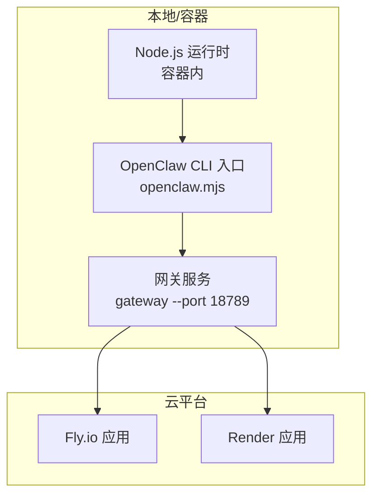
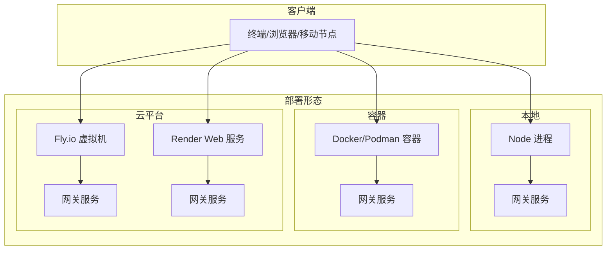
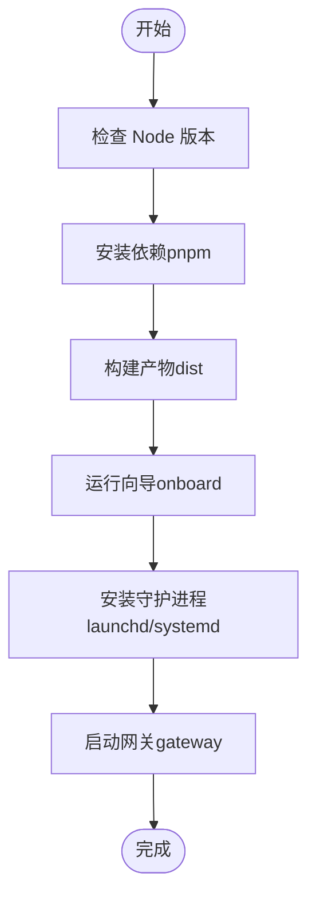
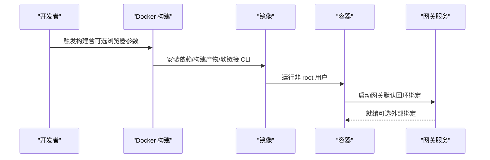
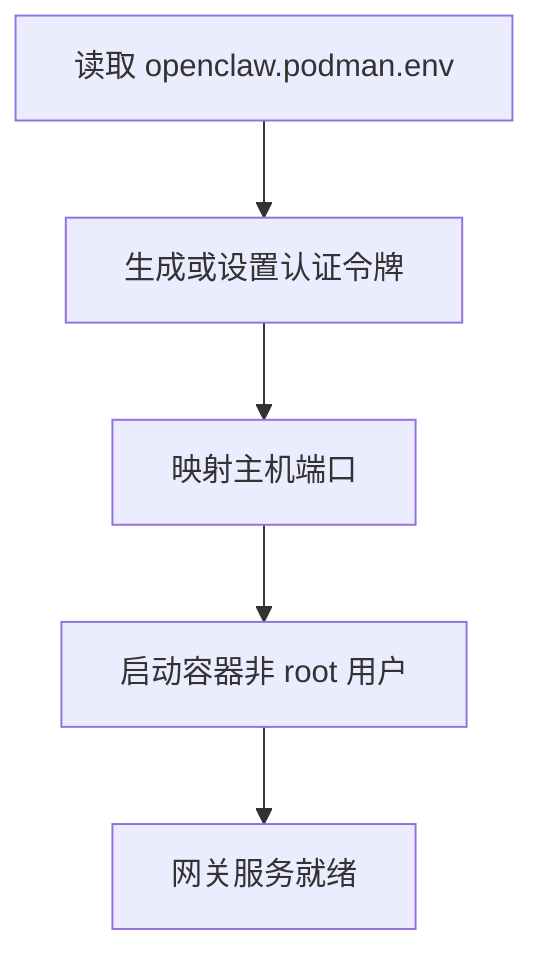
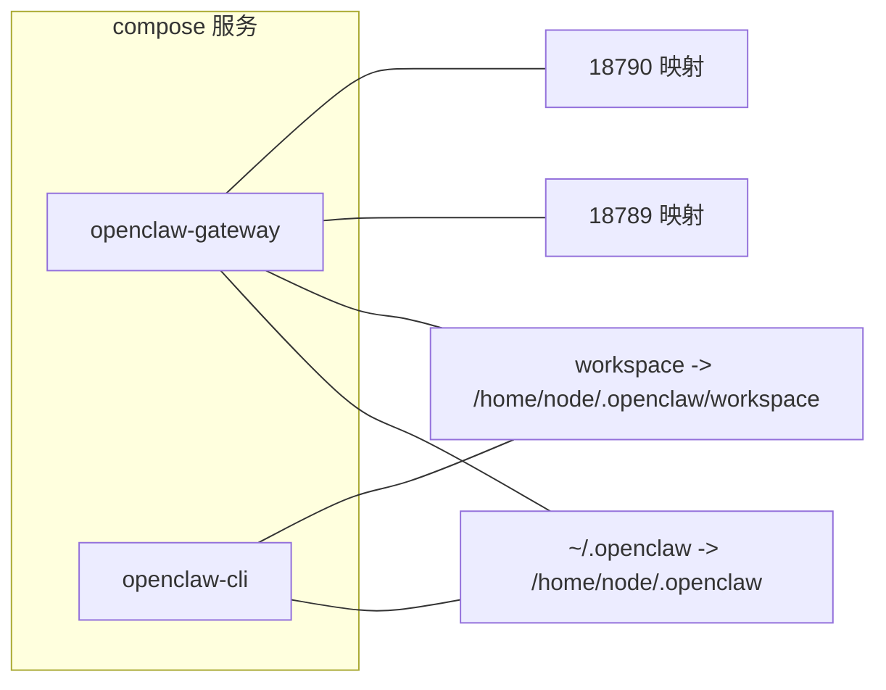
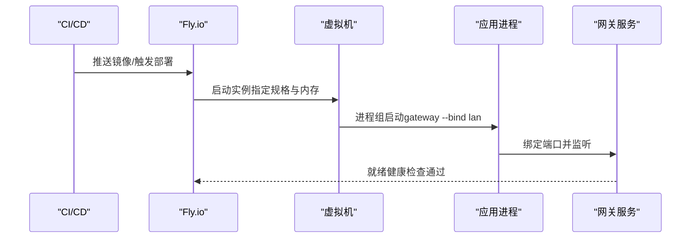
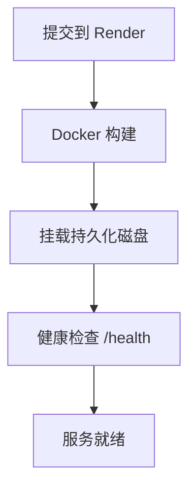
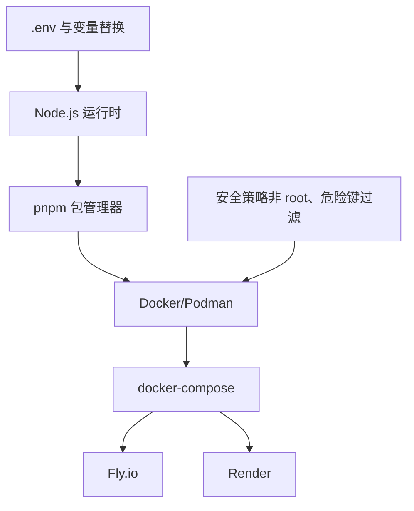

# 部署与运维

<cite>
**本文引用的文件**
- [README.md](file://README.md)
- [Dockerfile](file://Dockerfile)
- [docker-compose.yml](file://docker-compose.yml)
- [fly.toml](file://fly.toml)
- [render.yaml](file://render.yaml)
- [package.json](file://package.json)
- [pnpm-workspace.yaml](file://pnpm-workspace.yaml)
- [openclaw.podman.env](file://openclaw.podman.env)
- [src/config/config.env-vars.test.ts](file://src/config/config.env-vars.test.ts)
</cite>

## 目录

1. [简介](#简介)
2. [项目结构](#项目结构)
3. [核心组件](#核心组件)
4. [架构总览](#架构总览)
5. [详细组件分析](#详细组件分析)
6. [依赖关系分析](#依赖关系分析)
7. [性能考虑](#性能考虑)
8. [故障排查指南](#故障排查指南)
9. [结论](#结论)
10. [附录](#附录)

## 简介

本指南面向运维团队，提供 OpenClaw 在生产环境中的完整部署与运维实践，覆盖本地部署、容器化（Docker/Podman）、云平台（Fly.io、Render）部署策略；同时涵盖监控配置、日志管理、备份恢复与灾难恢复流程、性能优化、资源管理与容量规划、自动化运维与 CI/CD 集成、版本管理以及不同平台的特殊注意事项，帮助确保系统稳定运行。

## 项目结构

OpenClaw 采用多包工作区（pnpm workspace），核心入口通过 CLI 启动网关服务，支持多种运行方式：本地开发、容器化、云平台托管。关键部署资产包括：

- 容器镜像构建：基于 Node.js 22 的官方镜像，预装 Bun 以加速构建脚本执行，并可按需安装浏览器依赖。
- 编排与编排：提供 docker-compose 示例，定义网关与 CLI 服务，挂载状态与工作区目录。
- 云平台配置：Fly.io 使用 Dockerfile 构建并以进程组启动网关；Render 提供健康检查路径与持久化磁盘挂载。
- 环境变量与安全：通过 .env 加载与配置注入，限制危险或非便携的环境变量键，避免启动时污染。

章节来源

- file://Dockerfile#L1-L73
- file://docker-compose.yml#L1-L47
- file://fly.toml#L1-L35
- file://render.yaml#L1-L22
- file://package.json#L1-L268

## 核心组件

- 网关服务：WebSocket 控制平面，承载会话、通道、工具与事件处理，支持远程访问与安全暴露。
- CLI 工具：提供 onboarding、doctor、gateway、agent、message 等命令，便于运维与调试。
- 容器镜像：标准化构建流程，支持可选安装浏览器依赖以减少冷启动时间。
- 编排与云平台：通过 docker-compose、Fly.io、Render 的配置实现一键部署与弹性伸缩。
- 环境变量与安全：严格控制环境变量注入，避免危险键污染，支持从用户态目录加载 .env 并进行变量替换。

章节来源

- file://README.md#L50-L110
- file://Dockerfile#L1-L73
- file://docker-compose.yml#L1-L47
- file://fly.toml#L1-L35
- file://render.yaml#L1-L22
- file://package.json#L149-L150
- file://src/config/config.env-vars.test.ts#L1-L120

## 架构总览

下图展示 OpenClaw 在不同部署形态下的总体架构与数据流：

图表来源

- [Dockerfile](file://Dockerfile#L61-L73)
- [docker-compose.yml](file://docker-compose.yml#L1-L47)
- [fly.toml](file://fly.toml#L17-L26)
- [render.yaml](file://render.yaml#L1-L22)

## 详细组件分析

### 本地部署

- 前置条件：Node.js 版本满足要求，推荐使用 pnpm 进行源码构建与开发。
- 快速启动：通过 CLI 引导向导完成网关安装与守护进程注册，随后以指定端口启动网关服务。
- 开发模式：支持热重载与 TypeScript 直跑，便于快速迭代。

图表来源

- [README.md](file://README.md#L50-L110)

章节来源

- file://README.md#L50-L110

### 容器化部署（Docker）

- 镜像基础：基于 Node.js 22 官方镜像，启用 Bun 以提升构建脚本性能。
- 可选浏览器依赖：通过构建参数在镜像中预装 Chromium 与 Xvfb，减少容器启动时的 Playwright 下载等待。
- 运行参数：默认以非 root 用户运行，绑定到回环地址；可通过环境变量开启外部健康检查或修改绑定地址。
- 健康检查：容器平台可结合环境变量与命令行参数实现健康检查与外部可达性。

图表来源

- [Dockerfile](file://Dockerfile#L1-L73)

章节来源

- file://Dockerfile#L1-L73

### 容器化部署（Podman）

- 环境变量：通过专用环境文件集中管理认证令牌、端口映射与绑定策略。
- 启动脚本：提供便捷脚本用于生成令牌并启动容器，适合本地或边缘场景。

图表来源

- [openclaw.podman.env](file://openclaw.podman.env#L1-L25)

章节来源

- file://openclaw.podman.env#L1-L25

### 编排与编排（docker-compose）

- 多服务模型：定义网关服务与 CLI 服务，共享配置与工作区卷，便于统一管理。
- 环境变量：集中注入认证令牌与第三方服务凭据，支持从宿主环境传递。
- 端口映射：默认映射网关与桥接端口，便于本地联调与远程访问。

图表来源

- [docker-compose.yml](file://docker-compose.yml#L1-L47)

章节来源

- file://docker-compose.yml#L1-L47

### 云平台部署（Fly.io）

- 构建方式：使用仓库根部 Dockerfile 构建镜像。
- 运行参数：以进程组启动网关服务，绑定 LAN 并开放端口。
- 资源配置：虚拟机规格与内存配置可按需调整，建议开启持久化磁盘以保存状态与工作区。
- 自动伸缩：保持机器常驻以维持持久连接，避免频繁重启导致会话中断。

图表来源

- [fly.toml](file://fly.toml#L1-L35)

章节来源

- file://fly.toml#L1-L35

### 云平台部署（Render）

- 运行时：Docker 容器运行。
- 健康检查：通过 /health 路径进行健康检查。
- 持久化：挂载独立磁盘，配置状态目录与工作区目录，确保重启后数据不丢失。
- 环境变量：自动生成网关令牌，便于快速上线。

图表来源

- [render.yaml](file://render.yaml#L1-L22)

章节来源

- file://render.yaml#L1-L22

### 监控配置

- 健康检查：云平台通过健康检查路径验证服务可用性；容器编排可结合外部探针。
- 日志采集：建议在容器与云平台侧开启标准输出日志采集，结合结构化日志与标签区分来源。
- 性能指标：结合 CPU/内存/网络使用率与会话并发数进行容量评估与告警阈值设定。

章节来源

- file://render.yaml#L6-L6
- file://fly.toml#L20-L26

### 日志管理

- 日志位置：容器内标准输出；云平台可集中收集。
- 结构化日志：建议使用统一的日志格式与字段，便于检索与告警。
- 保留策略：按合规要求设置日志保留周期，定期清理过期日志。

章节来源

- file://README.md#L448-L448

### 备份与恢复

- 数据目录：状态目录与工作区目录应纳入备份范围。
- 备份策略：建议每日增量备份与每周全量备份，异地存储。
- 恢复演练：定期进行恢复演练，验证备份完整性与恢复时效。

章节来源

- file://fly.toml#L32-L35
- file://render.yaml#L18-L22

### 灾难恢复流程

- 故障识别：通过健康检查失败、告警与日志异常快速定位问题。
- 切换与回切：在多区域或多实例部署中，优先切换至备用实例，回切前进行功能验证。
- 业务连续性：确保网关持久化与会话状态不丢失，必要时回滚到稳定版本。

章节来源

- file://fly.toml#L23-L26

### 性能优化

- 内存上限：在容器与云平台中合理设置内存上限，避免 OOM。
- 浏览器依赖：在容器中预装浏览器依赖，减少首次启动延迟。
- 并发与会话：根据硬件能力与模型推理需求，调整并发与会话数量，避免资源争用。

章节来源

- file://Dockerfile#L26-L28
- file://Dockerfile#L30-L45
- file://fly.toml#L15-L15

### 资源管理与容量规划

- CPU/内存：根据并发会话数与通道数量估算资源需求，预留 20%-30% 缓冲。
- 存储：状态目录与工作区目录占用随时间增长，需定期清理与扩容。
- 网络：确保网关端口与桥接端口对外可达，必要时配置防火墙与安全组。

章节来源

- file://docker-compose.yml#L14-L16
- file://fly.toml#L28-L31
- file://render.yaml#L18-L22

### 自动化运维与 CI/CD 集成

- 构建脚本：通过 package.json 中的构建脚本完成打包与 UI 构建。
- 工作区与依赖：使用 pnpm workspace 管理多包依赖，减少重复安装。
- 部署流水线：将构建产物推送到镜像仓库，再由云平台或编排系统拉起服务。

图表来源

- [package.json](file://package.json#L49-L149)
- [pnpm-workspace.yaml](file://pnpm-workspace.yaml#L1-L17)

章节来源

- file://package.json#L49-L149
- file://pnpm-workspace.yaml#L1-L17

### 版本管理

- 发布通道：提供 stable、beta、dev 三种发布通道，便于灰度与回滚。
- 更新策略：通过 CLI 更新到目标通道，结合 doctor 命令进行健康检查与配置校验。

章节来源

- file://README.md#L83-L91
- file://README.md#L81-L81

### 不同平台的特殊要求与注意事项

- Node.js 版本：必须满足最低版本要求，避免运行时兼容性问题。
- 权限与安全：容器内以非 root 用户运行，降低逃逸风险；云平台注意安全组与访问控制。
- 环境变量注入：严格控制环境变量键，避免危险键污染；支持从用户态目录加载 .env 并进行变量替换。

章节来源

- file://README.md#L52-L52
- file://Dockerfile#L61-L64
- file://src/config/config.env-vars.test.ts#L32-L68
- file://src/config/config.env-vars.test.ts#L70-L86
- file://src/config/config.env-vars.test.ts#L88-L118

## 依赖关系分析

OpenClaw 的部署与运维依赖于以下关键要素：

- Node.js 运行时与包管理器（pnpm）。
- 容器与编排工具（Docker/Podman/docker-compose）。
- 云平台（Fly.io、Render）。
- 环境变量与安全策略（.env 加载、变量替换、危险键过滤）。

图表来源

- [package.json](file://package.json#L1-L268)
- [pnpm-workspace.yaml](file://pnpm-workspace.yaml#L1-L17)
- [Dockerfile](file://Dockerfile#L1-L73)
- [docker-compose.yml](file://docker-compose.yml#L1-L47)
- [fly.toml](file://fly.toml#L1-L35)
- [render.yaml](file://render.yaml#L1-L22)
- [src/config/config.env-vars.test.ts](file://src/config/config.env-vars.test.ts#L1-L120)

章节来源

- file://package.json#L1-L268
- file://pnpm-workspace.yaml#L1-L17
- file://Dockerfile#L1-L73
- file://docker-compose.yml#L1-L47
- file://fly.toml#L1-L35
- file://render.yaml#L1-L22
- file://src/config/config.env-vars.test.ts#L1-L120

## 性能考虑

- 内存上限：在容器与云平台中设置合理的内存上限，避免 OOM 导致的不稳定。
- 浏览器依赖预装：在容器中预装浏览器依赖，减少首次启动时的下载与安装时间。
- 并发与会话：根据硬件能力与模型推理需求，合理设置并发与会话数量，避免资源争用。
- 磁盘 I/O：将状态目录与工作区目录挂载到高性能持久化磁盘，减少 I/O 抖动。

章节来源

- file://Dockerfile#L26-L28
- file://Dockerfile#L30-L45
- file://fly.toml#L15-L15
- file://fly.toml#L32-L35
- file://render.yaml#L18-L22

## 故障排查指南

- 健康检查失败：检查云平台健康检查路径与端口映射，确认服务已就绪。
- 环境变量问题：核对 .env 文件与配置注入，避免危险键污染与非便携键。
- 容器权限问题：确保容器以非 root 用户运行，避免权限不足导致的启动失败。
- 依赖安装失败：在低内存主机上适当提高内存上限，避免构建阶段被 OOM 杀死。

章节来源

- file://render.yaml#L6-L6
- file://src/config/config.env-vars.test.ts#L32-L68
- file://Dockerfile#L61-L64
- file://Dockerfile#L26-L28

## 结论

通过标准化的容器化与云平台部署流程、完善的监控与日志体系、严格的备份与灾难恢复策略、持续的性能优化与容量规划，以及自动化运维与 CI/CD 集成，OpenClaw 可在多环境下实现稳定、可扩展与可维护的生产级运行。运维团队应结合自身平台特性，遵循本文提供的最佳实践，确保系统长期可靠运行。

## 附录

- 快速参考
  - 本地安装与启动：参见 README 中的安装与快速启动章节。
  - 容器构建与运行：参见 Dockerfile 与 docker-compose.yml。
  - 云平台部署：参见 fly.toml 与 render.yaml。
  - 环境变量与安全：参见 src/config/config.env-vars.test.ts。

章节来源

- file://README.md#L50-L110
- file://Dockerfile#L1-L73
- file://docker-compose.yml#L1-L47
- file://fly.toml#L1-L35
- file://render.yaml#L1-L22
- file://src/config/config.env-vars.test.ts#L1-L120
