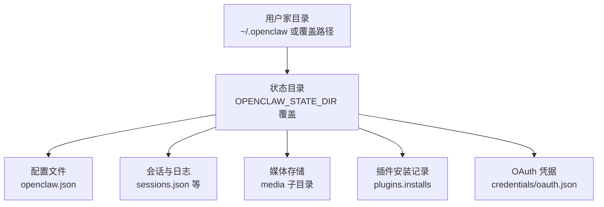
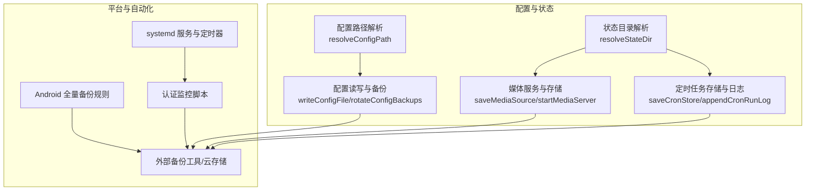
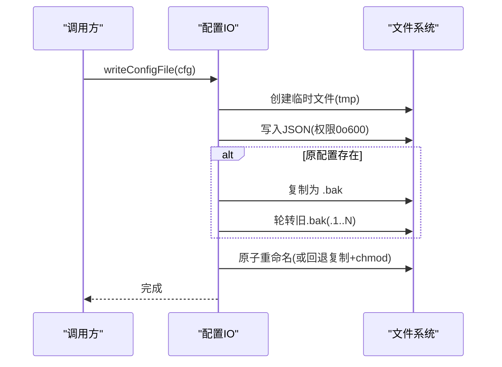
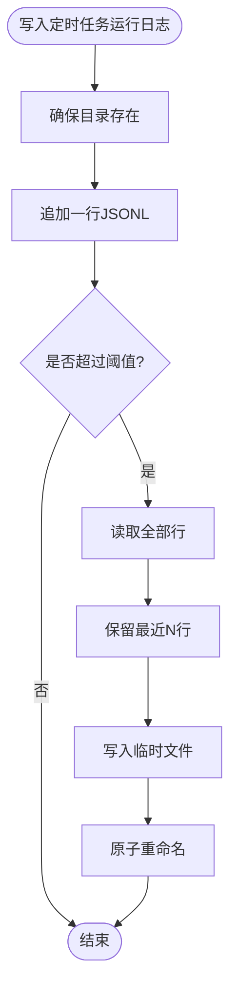
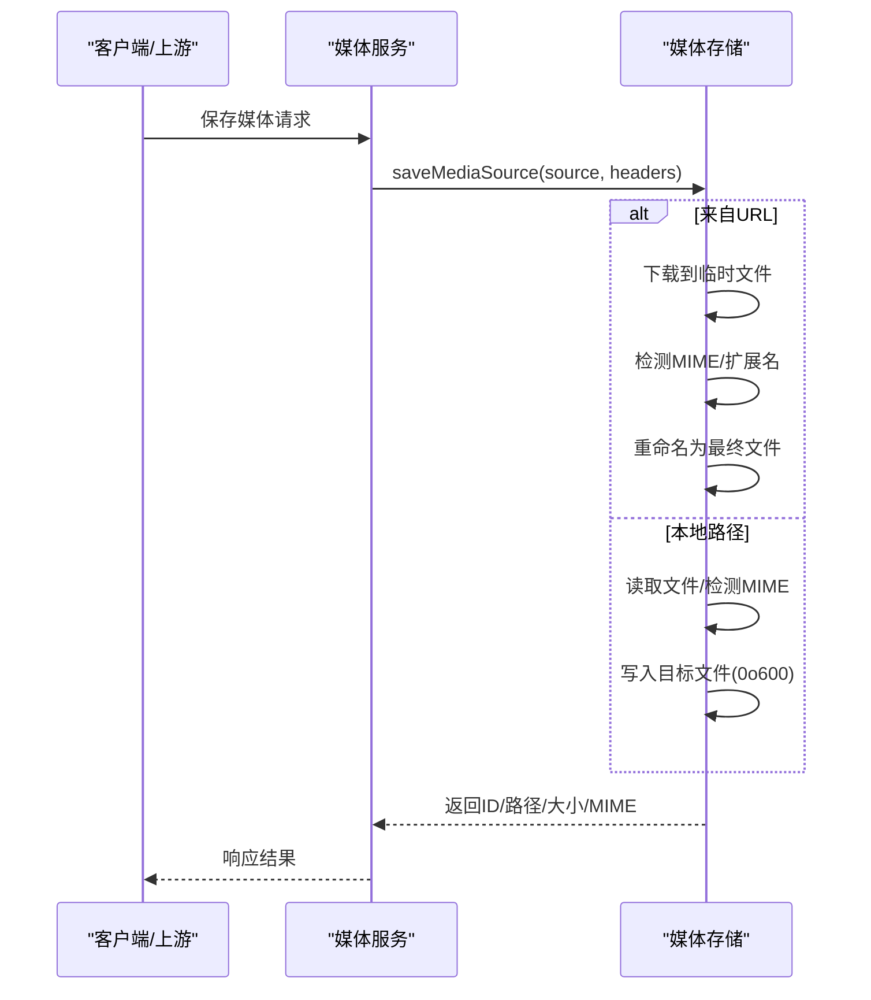
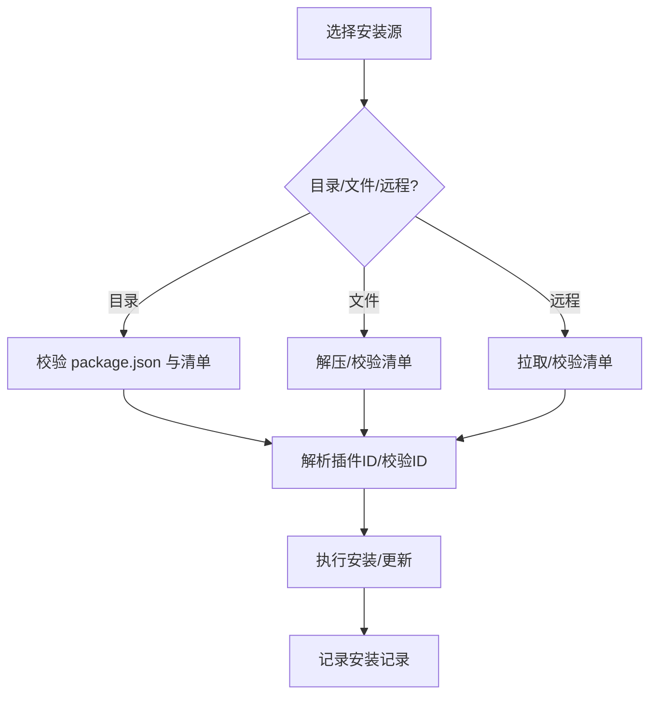
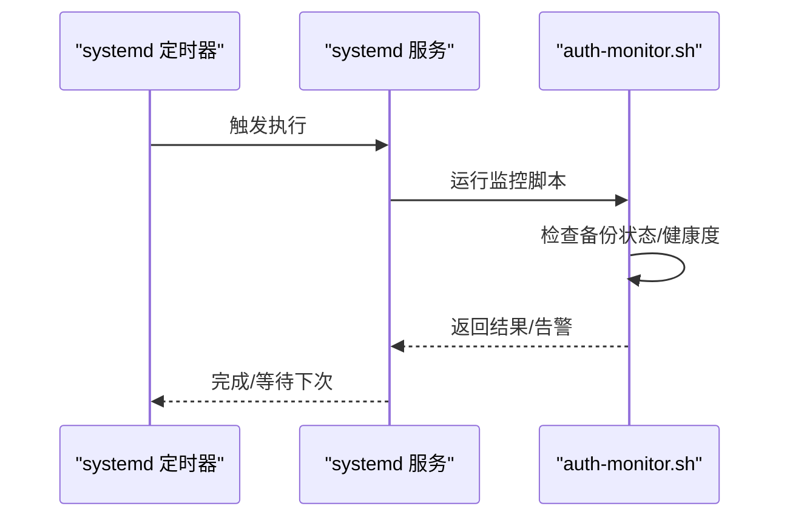
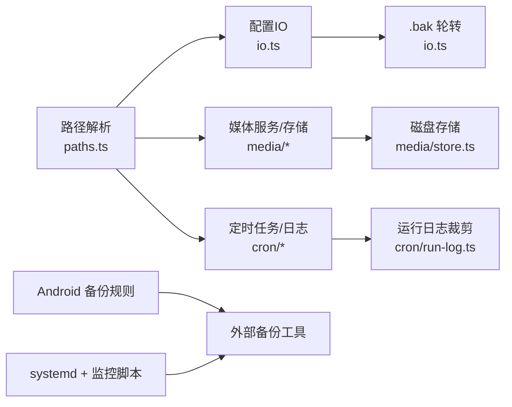

# 备份与恢复

<cite>
**本文引用的文件**
- [src/config/paths.ts](file://src/config/paths.ts)
- [src/config/io.ts](file://src/config/io.ts)
- [src/media/server.ts](file://src/media/server.ts)
- [src/media/store.ts](file://src/media/store.ts)
- [src/cron/store.ts](file://src/cron/store.ts)
- [src/cron/run-log.ts](file://src/cron/run-log.ts)
- [apps/android/app/src/main/res/xml/backup_rules.xml](file://apps/android/app/src/main/res/xml/backup_rules.xml)
- [scripts/systemd/openclaw-auth-monitor.service](file://scripts/systemd/openclaw-auth-monitor.service)
- [scripts/systemd/openclaw-auth-monitor.timer](file://scripts/systemd/openclaw-auth-monitor.timer)
- [scripts/auth-monitor.sh](file://scripts/auth-monitor.sh)
- [src/daemon/paths.test.ts](file://src/daemon/paths.test.ts)
</cite>

## 目录

1. [简介](#简介)
2. [项目结构](#项目结构)
3. [核心组件](#核心组件)
4. [架构总览](#架构总览)
5. [组件详解](#组件详解)
6. [依赖关系分析](#依赖关系分析)
7. [性能考量](#性能考量)
8. [故障排查指南](#故障排查指南)
9. [结论](#结论)
10. [附录](#附录)

## 简介

本指南面向OpenClaw系统的备份与恢复，覆盖配置文件、会话数据、媒体文件与插件数据的备份策略；提供自动备份脚本与手动备份流程；解释数据完整性校验、增量备份与版本管理；给出灾难恢复计划（数据恢复、系统重建与配置还原）、安全与访问控制建议、恢复测试与故障场景模拟，以及备份监控与告警配置。

## 项目结构

OpenClaw在运行时使用“状态目录”存放可变数据（会话、日志、缓存等），默认位于用户家目录下的隐藏目录中，并支持通过环境变量进行覆盖。配置文件通常位于该状态目录下，采用JSON5格式，支持包含其他文件与环境变量替换。

图表来源

- [src/config/paths.ts](file://src/config/paths.ts#L59-L85)
- [src/config/paths.ts](file://src/config/paths.ts#L114-L123)
- [src/config/paths.ts](file://src/config/paths.ts#L238-L254)

章节来源

- [src/config/paths.ts](file://src/config/paths.ts#L59-L85)
- [src/config/paths.ts](file://src/config/paths.ts#L114-L123)
- [src/config/paths.ts](file://src/config/paths.ts#L238-L254)

## 核心组件

- 配置与状态路径解析：负责确定配置文件与状态目录位置，支持多候选路径与历史兼容。
- 配置读写与备份：加载、校验、写入配置文件，并在写入时生成备份与轮转。
- 媒体服务与存储：接收媒体上传、检测类型、落地磁盘、定期清理过期内容。
- 定时任务与运行日志：持久化定时任务状态与运行日志，支持按大小与行数裁剪。
- Android 全量备份规则：声明Android应用全量备份范围。
- 自动化监控与守护：systemd服务与定时器配合监控脚本，保障备份链路健康。

章节来源

- [src/config/paths.ts](file://src/config/paths.ts#L59-L85)
- [src/config/io.ts](file://src/config/io.ts#L551-L617)
- [src/media/server.ts](file://src/media/server.ts#L28-L106)
- [src/media/store.ts](file://src/media/store.ts#L170-L209)
- [src/cron/store.ts](file://src/cron/store.ts#L22-L61)
- [src/cron/run-log.ts](file://src/cron/run-log.ts#L43-L61)
- [apps/android/app/src/main/res/xml/backup_rules.xml](file://apps/android/app/src/main/res/xml/backup_rules.xml#L1-L4)
- [scripts/systemd/openclaw-auth-monitor.service](file://scripts/systemd/openclaw-auth-monitor.service)
- [scripts/systemd/openclaw-auth-monitor.timer](file://scripts/systemd/openclaw-auth-monitor.timer)
- [scripts/auth-monitor.sh](file://scripts/auth-monitor.sh)

## 架构总览

下图展示备份与恢复涉及的关键模块及其交互：

图表来源

- [src/config/paths.ts](file://src/config/paths.ts#L150-L182)
- [src/config/io.ts](file://src/config/io.ts#L551-L617)
- [src/media/server.ts](file://src/media/server.ts#L91-L106)
- [src/media/store.ts](file://src/media/store.ts#L170-L209)
- [src/cron/store.ts](file://src/cron/store.ts#L50-L61)
- [src/cron/run-log.ts](file://src/cron/run-log.ts#L43-L61)
- [apps/android/app/src/main/res/xml/backup_rules.xml](file://apps/android/app/src/main/res/xml/backup_rules.xml#L1-L4)
- [scripts/systemd/openclaw-auth-monitor.service](file://scripts/systemd/openclaw-auth-monitor.service)
- [scripts/systemd/openclaw-auth-monitor.timer](file://scripts/systemd/openclaw-auth-monitor.timer)
- [scripts/auth-monitor.sh](file://scripts/auth-monitor.sh)

## 组件详解

### 配置文件备份与版本管理

- 配置文件位置与候选路径：支持通过环境变量覆盖，默认位于状态目录下的openclaw.json，兼容历史文件名。
- 写入流程与备份：写入前计算合并补丁，仅持久化用户显式设置值；写入时生成临时文件并原子重命名；若原文件存在则复制为.bak并进行轮转。
- 版本标记：每次写入都会打上版本戳，便于识别新旧配置。
- 环境变量注入：支持在配置中定义env块，将变量注入到进程环境后再进行占位符替换。

图表来源

- [src/config/io.ts](file://src/config/io.ts#L551-L617)

章节来源

- [src/config/paths.ts](file://src/config/paths.ts#L150-L182)
- [src/config/io.ts](file://src/config/io.ts#L551-L617)
- [src/config/io.ts](file://src/config/io.ts#L143-L160)

### 会话数据与日志备份

- 会话维护策略：可通过配置项设定维护模式、保留时长、最大条目数与旋转字节数，用于控制会话存储规模与生命周期。
- 日志裁剪：定时任务运行日志采用JSONL格式，支持按大小与行数裁剪，避免无限增长。

图表来源

- [src/cron/run-log.ts](file://src/cron/run-log.ts#L43-L61)

章节来源

- [src/config/sessions/store.ts](file://src/config/sessions/store.ts#L281-L294)
- [src/cron/run-log.ts](file://src/cron/run-log.ts#L26-L41)

### 媒体文件备份

- 媒体存储：支持从URL下载或本地文件写入，自动检测MIME类型并落盘；限制单文件大小；定期清理过期媒体。
- 服务端点：提供媒体路由与服务器启动逻辑，结合TTL参数清理旧资源。

图表来源

- [src/media/server.ts](file://src/media/server.ts#L28-L106)
- [src/media/store.ts](file://src/media/store.ts#L170-L209)

章节来源

- [src/media/server.ts](file://src/media/server.ts#L28-L106)
- [src/media/store.ts](file://src/media/store.ts#L170-L209)

### 插件数据备份

- 插件安装记录：记录插件安装时间与元信息，便于在迁移或重建后复现安装状态。
- 插件安装流程：支持从目录、压缩包或远程源安装，校验清单与ID，执行安装或更新。

图表来源

- [src/plugins/installs.ts](file://src/plugins/installs.ts#L6-L30)
- [src/plugins/install.ts](file://src/plugins/install.ts#L135-L413)

章节来源

- [src/plugins/installs.ts](file://src/plugins/installs.ts#L6-L30)
- [src/plugins/install.ts](file://src/plugins/install.ts#L135-L413)

### 自动备份脚本与监控

- systemd服务与定时器：通过服务单元与定时器周期触发监控脚本，保障备份链路健康。
- 监控脚本：负责检查备份状态、失败告警与重试逻辑。

图表来源

- [scripts/systemd/openclaw-auth-monitor.service](file://scripts/systemd/openclaw-auth-monitor.service)
- [scripts/systemd/openclaw-auth-monitor.timer](file://scripts/systemd/openclaw-auth-monitor.timer)
- [scripts/auth-monitor.sh](file://scripts/auth-monitor.sh)

章节来源

- [scripts/systemd/openclaw-auth-monitor.service](file://scripts/systemd/openclaw-auth-monitor.service)
- [scripts/systemd/openclaw-auth-monitor.timer](file://scripts/systemd/openclaw-auth-monitor.timer)
- [scripts/auth-monitor.sh](file://scripts/auth-monitor.sh)

### Android 全量备份

- 全量备份规则：声明包含所有文件域的内容，便于系统级备份工具抓取应用数据。

章节来源

- [apps/android/app/src/main/res/xml/backup_rules.xml](file://apps/android/app/src/main/res/xml/backup_rules.xml#L1-L4)

## 依赖关系分析

- 配置与状态：配置IO依赖路径解析模块以定位openclaw.json；状态目录解析决定所有可变数据的根路径。
- 媒体与定时：媒体服务依赖存储模块；定时任务日志依赖裁剪逻辑。
- 平台与自动化：Android备份规则影响外部备份策略；systemd与监控脚本构成自动化保障。

图表来源

- [src/config/paths.ts](file://src/config/paths.ts#L150-L182)
- [src/config/io.ts](file://src/config/io.ts#L551-L617)
- [src/media/server.ts](file://src/media/server.ts#L28-L106)
- [src/media/store.ts](file://src/media/store.ts#L170-L209)
- [src/cron/run-log.ts](file://src/cron/run-log.ts#L43-L61)
- [apps/android/app/src/main/res/xml/backup_rules.xml](file://apps/android/app/src/main/res/xml/backup_rules.xml#L1-L4)
- [scripts/systemd/openclaw-auth-monitor.service](file://scripts/systemd/openclaw-auth-monitor.service)
- [scripts/systemd/openclaw-auth-monitor.timer](file://scripts/systemd/openclaw-auth-monitor.timer)

章节来源

- [src/config/paths.ts](file://src/config/paths.ts#L150-L182)
- [src/config/io.ts](file://src/config/io.ts#L551-L617)
- [src/media/server.ts](file://src/media/server.ts#L28-L106)
- [src/media/store.ts](file://src/media/store.ts#L170-L209)
- [src/cron/run-log.ts](file://src/cron/run-log.ts#L43-L61)
- [apps/android/app/src/main/res/xml/backup_rules.xml](file://apps/android/app/src/main/res/xml/backup_rules.xml#L1-L4)
- [scripts/systemd/openclaw-auth-monitor.service](file://scripts/systemd/openclaw-auth-monitor.service)
- [scripts/systemd/openclaw-auth-monitor.timer](file://scripts/systemd/openclaw-auth-monitor.timer)

## 性能考量

- 配置写入：采用临时文件+原子重命名，减少部分写入风险；Windows环境下回退复制+chmod，保证一致性。
- 媒体存储：写入时设置严格权限；限制单文件大小；定期清理过期媒体，避免磁盘膨胀。
- 定时日志：按大小与行数裁剪，避免日志无限增长导致I/O压力。
- 备份轮转：配置备份按数量轮转，降低磁盘占用与查找成本。

章节来源

- [src/config/io.ts](file://src/config/io.ts#L580-L617)
- [src/media/store.ts](file://src/media/store.ts#L194-L209)
- [src/cron/run-log.ts](file://src/cron/run-log.ts#L26-L41)
- [src/config/io.ts](file://src/config/io.ts#L143-L160)

## 故障排查指南

- 配置加载失败
  - 症状：无法读取或解析配置。
  - 排查：确认openclaw.json是否存在与可读；检查JSON5语法与$include路径；查看环境变量替换是否缺失必要变量。
  - 参考实现：配置读取、包含解析、环境变量替换与校验流程。
- 配置写入失败
  - 症状：写入后.bak未生成或轮转异常。
  - 排查：检查目标目录权限与磁盘空间；关注Windows平台的原子重命名错误码并回退至复制+chmod。
  - 参考实现：写入流程与轮转逻辑。
- 媒体保存失败
  - 症状：保存URL媒体报错或本地文件非文件。
  - 排查：确认URL可达与MIME检测；检查文件大小限制；核对目标目录权限。
  - 参考实现：媒体保存与MIME检测。
- 定时任务日志异常
  - 症状：日志文件过大或无法读取。
  - 排查：确认裁剪阈值设置；检查文件权限与并发写入。
  - 参考实现：日志追加与裁剪。
- 备份监控告警
  - 症状：定时器未触发或监控脚本失败。
  - 排查：检查systemd服务与定时器状态；核对脚本可执行权限与环境变量。

章节来源

- [src/config/io.ts](file://src/config/io.ts#L272-L382)
- [src/config/io.ts](file://src/config/io.ts#L551-L617)
- [src/media/store.ts](file://src/media/store.ts#L170-L209)
- [src/cron/run-log.ts](file://src/cron/run-log.ts#L43-L61)
- [scripts/systemd/openclaw-auth-monitor.service](file://scripts/systemd/openclaw-auth-monitor.service)
- [scripts/systemd/openclaw-auth-monitor.timer](file://scripts/systemd/openclaw-auth-monitor.timer)
- [scripts/auth-monitor.sh](file://scripts/auth-monitor.sh)

## 结论

OpenClaw在配置、会话、媒体与定时任务层面提供了清晰的数据结构与持久化策略。通过配置备份轮转、媒体存储与日志裁剪、平台级备份规则与systemd自动化监控，可构建稳健的备份与恢复体系。建议在生产环境中结合外部备份工具与加密传输，完善访问控制与审计，定期进行恢复演练与故障模拟，确保业务连续性。

## 附录

### 备份策略与流程

- 配置文件
  - 策略：写入时自动生成.bak并轮转；建议定期导出当前配置快照。
  - 手动流程：停止服务 -> 复制openclaw.json与.bak -> 启动服务。
- 会话数据
  - 策略：依据维护配置控制保留策略；定期归档历史会话。
  - 手动流程：停止服务 -> 备份会话存储目录 -> 启动服务。
- 媒体文件
  - 策略：定期扫描媒体目录并同步至远端存储；清理过期媒体。
  - 手动流程：停止媒体服务 -> 备份media目录 -> 启动服务。
- 插件数据
  - 策略：记录安装清单；迁移时按清单重新安装。
  - 手动流程：备份插件安装记录 -> 备份插件源码/包 -> 重建后按清单安装。

章节来源

- [src/config/io.ts](file://src/config/io.ts#L551-L617)
- [src/config/sessions/store.ts](file://src/config/sessions/store.ts#L281-L294)
- [src/media/server.ts](file://src/media/server.ts#L91-L106)
- [src/plugins/installs.ts](file://src/plugins/installs.ts#L6-L30)

### 数据完整性验证

- 配置：写入后生成哈希，可用于比对；.bak作为对比基线。
- 媒体：保存时记录大小与MIME；恢复后校验文件存在与大小一致。
- 日志：按行读取最后N条记录，核对关键字段（如jobId、status）。

章节来源

- [src/config/io.ts](file://src/config/io.ts#L77-L91)
- [src/media/store.ts](file://src/media/store.ts#L170-L209)
- [src/cron/run-log.ts](file://src/cron/run-log.ts#L64-L107)

### 增量备份与版本管理

- 增量：基于文件变更时间或哈希差异；媒体与日志可按大小/行数裁剪实现“滚动增量”。
- 版本：配置写入时打版本戳；.bak轮转形成版本序列。

章节来源

- [src/config/io.ts](file://src/config/io.ts#L186-L196)
- [src/config/io.ts](file://src/config/io.ts#L143-L160)
- [src/cron/run-log.ts](file://src/cron/run-log.ts#L26-L41)

### 灾难恢复计划

- 数据恢复
  - 配置：优先使用最新.bak；若损坏则回退到更早.bak。
  - 会话：从归档恢复；核对维护配置生效。
  - 媒体：从远端存储拉取；校验完整性。
  - 插件：按安装清单重新安装。
- 系统重建
  - 重装OpenClaw；恢复配置与状态目录；重启服务。
- 配置还原
  - 使用备份的openclaw.json与.bak；必要时回滚到历史版本。

章节来源

- [src/config/io.ts](file://src/config/io.ts#L551-L617)
- [src/plugins/install.ts](file://src/plugins/install.ts#L370-L397)

### 安全性考虑

- 访问控制
  - 配置与状态目录使用严格权限；避免全局可读写。
  - 媒体文件写入时设置权限掩码。
- 加密传输
  - 建议通过加密通道（如SFTP/HTTPS/加密网关）传输备份数据。
- 审计与最小权限
  - 限制备份账号权限；启用操作审计；定期轮换密钥。

章节来源

- [src/config/io.ts](file://src/config/io.ts#L573-L588)
- [src/media/store.ts](file://src/media/store.ts#L194-L209)

### 恢复测试与故障场景模拟

- 恢复测试
  - 定期在隔离环境执行“离线恢复”演练：停止服务 -> 恢复备份 -> 启动服务 -> 功能验证。
- 故障场景
  - 配置损坏：使用.bak回滚；检查环境变量替换。
  - 媒体丢失：从远端存储恢复；校验MIME与大小。
  - 日志膨胀：触发裁剪；核对阈值设置。
  - 备份中断：重试定时器；检查systemd状态。

章节来源

- [src/config/io.ts](file://src/config/io.ts#L551-L617)
- [src/media/store.ts](file://src/media/store.ts#L170-L209)
- [src/cron/run-log.ts](file://src/cron/run-log.ts#L26-L41)
- [scripts/systemd/openclaw-auth-monitor.timer](file://scripts/systemd/openclaw-auth-monitor.timer)

### 备份监控与告警配置

- 监控指标
  - 配置写入成功/失败次数、.bak生成状态。
  - 媒体存储容量、过期清理成功率。
  - 定时任务运行日志完整性与延迟。
  - 备份脚本执行状态与耗时。
- 告警策略
  - 连续失败阈值触发；超时告警；容量预警。
- 工具建议
  - 使用systemd日志与外部监控系统（如Prometheus/Grafana）采集指标。

章节来源

- [scripts/systemd/openclaw-auth-monitor.service](file://scripts/systemd/openclaw-auth-monitor.service)
- [scripts/systemd/openclaw-auth-monitor.timer](file://scripts/systemd/openclaw-auth-monitor.timer)
- [scripts/auth-monitor.sh](file://scripts/auth-monitor.sh)
