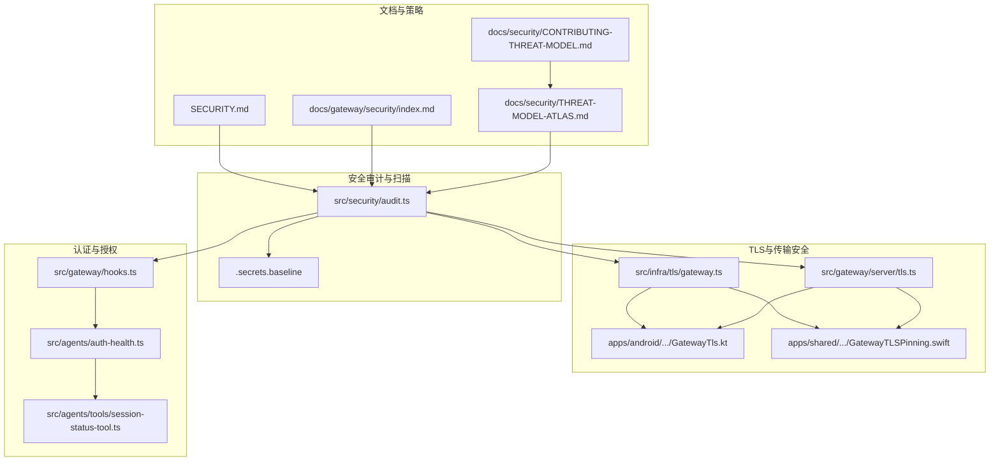
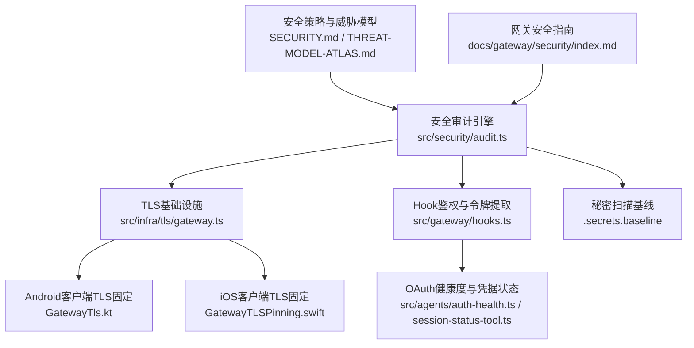
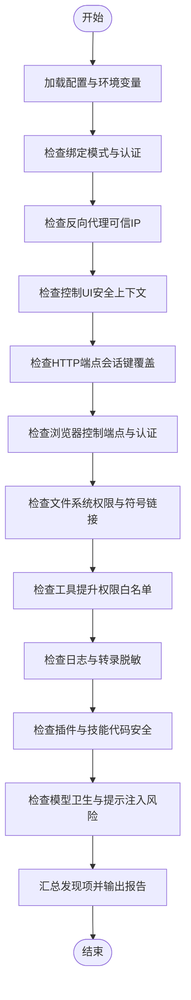
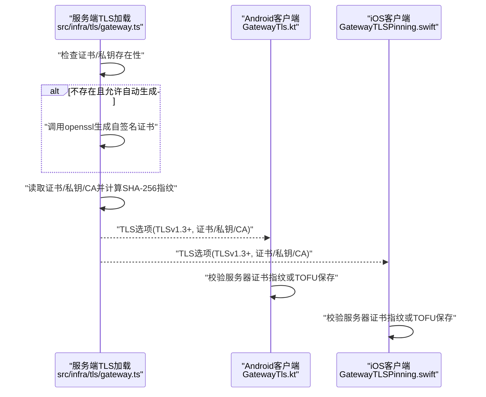
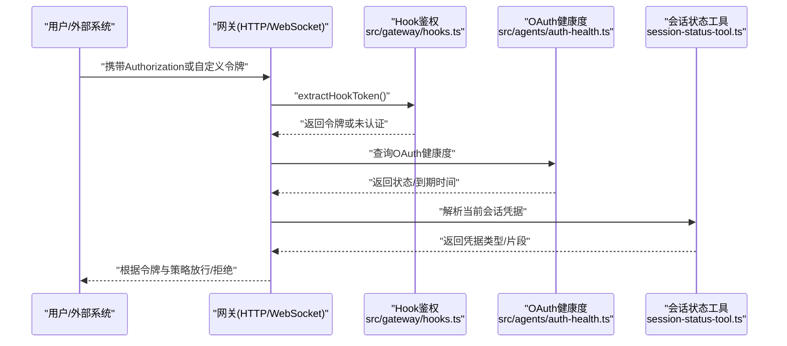
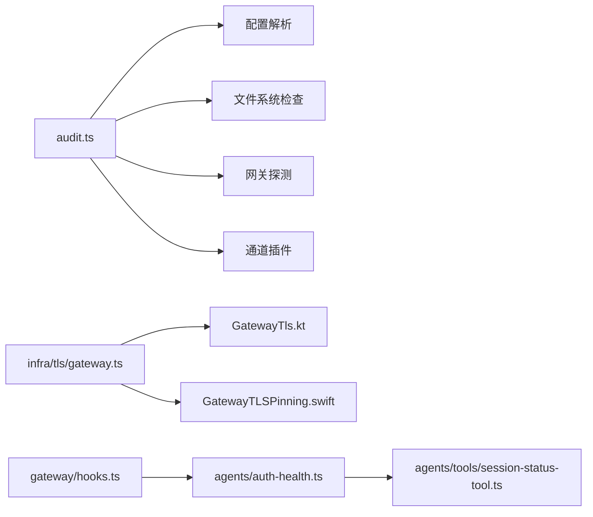

# 安全运维

<cite>
**本文引用的文件**
- [SECURITY.md](file://SECURITY.md)
- [docs/gateway/security/index.md](file://docs/gateway/security/index.md)
- [src/security/audit.ts](file://src/security/audit.ts)
- [src/infra/tls/gateway.ts](file://src/infra/tls/gateway.ts)
- [apps/android/app/src/main/java/ai/openclaw/android/gateway/GatewayTls.kt](file://apps/android/app/src/main/java/ai/openclaw/android/gateway/GatewayTls.kt)
- [apps/shared/OpenClawKit/Sources/OpenClawKit/GatewayTLSPinning.swift](file://apps/shared/OpenClawKit/Sources/OpenClawKit/GatewayTLSPinning.swift)
- [src/gateway/server/tls.ts](file://src/gateway/server/tls.ts)
- [src/gateway/hooks.ts](file://src/gateway/hooks.ts)
- [src/agents/auth-health.ts](file://src/agents/auth-health.ts)
- [src/agents/tools/session-status-tool.ts](file://src/agents/tools/session-status-tool.ts)
- [docs/security/THREAT-MODEL-ATLAS.md](file://docs/security/THREAT-MODEL-ATLAS.md)
- [docs/security/CONTRIBUTING-THREAT-MODEL.md](file://docs/security/CONTRIBUTING-THREAT-MODEL.md)
- [.secrets.baseline](file://.secrets.baseline)
</cite>

## 目录

1. [简介](#简介)
2. [项目结构](#项目结构)
3. [核心组件](#核心组件)
4. [架构总览](#架构总览)
5. [详细组件分析](#详细组件分析)
6. [依赖关系分析](#依赖关系分析)
7. [性能考量](#性能考量)
8. [故障排查指南](#故障排查指南)
9. [结论](#结论)
10. [附录](#附录)

## 简介

本文件面向OpenClaw的安全运维团队与平台工程师，系统化梳理网络安全配置、身份认证与授权、数据保护、安全审计与合规、漏洞管理与补丁流程、威胁检测与应急响应，并提供可复用的安全配置模板与最佳实践清单。内容基于仓库内现有安全文档与实现代码进行归纳总结，帮助在不同环境（本地、容器、远程网关、移动端）中建立一致且可验证的安全基线。

## 项目结构

围绕安全运维的关键目录与文件分布如下：

- 文档与策略
  - 安全策略与报告渠道：SECURITY.md
  - 网关安全指南与审计清单：docs/gateway/security/index.md
  - 威胁模型与贡献指南：docs/security/THREAT-MODEL-ATLAS.md、docs/security/CONTRIBUTING-THREAT-MODEL.md
- 安全审计与扫描
  - 审计主逻辑：src/security/audit.ts
  - 秘密扫描基线：.secrets.baseline
- TLS与传输安全
  - 服务端TLS加载与自签名证书生成：src/infra/tls/gateway.ts
  - 客户端TLS固定与指纹校验（Android/Kotlin）：apps/android/app/src/main/java/ai/openclaw/android/gateway/GatewayTls.kt
  - 客户端TLS固定与指纹校验（iOS/Swift）：apps/shared/OpenClawKit/Sources/OpenClawKit/GatewayTLSPinning.swift
  - 网关侧TLS加载适配：src/gateway/server/tls.ts
- 身份认证与授权
  - Hook鉴权与令牌提取：src/gateway/hooks.ts
  - OAuth健康度与凭据状态：src/agents/auth-health.ts、src/agents/tools/session-status-tool.ts
- 其他
  - Docker安全建议与Node版本要求：SECURITY.md

**图表来源**

- [SECURITY.md](file://SECURITY.md#L1-L100)
- [docs/gateway/security/index.md](file://docs/gateway/security/index.md#L1-L829)
- [src/security/audit.ts](file://src/security/audit.ts#L1-L1032)
- [src/infra/tls/gateway.ts](file://src/infra/tls/gateway.ts#L1-L150)
- [apps/android/app/src/main/java/ai/openclaw/android/gateway/GatewayTls.kt](file://apps/android/app/src/main/java/ai/openclaw/android/gateway/GatewayTls.kt#L1-L75)
- [apps/shared/OpenClawKit/Sources/OpenClawKit/GatewayTLSPinning.swift](file://apps/shared/OpenClawKit/Sources/OpenClawKit/GatewayTLSPinning.swift#L40-L119)
- [src/gateway/server/tls.ts](file://src/gateway/server/tls.ts#L1-L14)
- [src/gateway/hooks.ts](file://src/gateway/hooks.ts#L149-L174)
- [src/agents/auth-health.ts](file://src/agents/auth-health.ts#L134-L166)
- [src/agents/tools/session-status-tool.ts](file://src/agents/tools/session-status-tool.ts#L91-L140)
- [.secrets.baseline](file://.secrets.baseline#L362-L403)

**章节来源**

- [SECURITY.md](file://SECURITY.md#L1-L100)
- [docs/gateway/security/index.md](file://docs/gateway/security/index.md#L1-L829)

## 核心组件

- 安全审计引擎：负责收集攻击面、网络暴露、浏览器控制、日志脱敏、工具提升权限等维度的发现项，并支持深度探测与自动修复建议。
- TLS基础设施：提供自签名证书生成、证书加载、最小TLS版本约束、客户端指纹固定与TOFU信任模式。
- 身份认证与授权：基于共享令牌/密码的网关认证、Tailscale Serve身份头校验、Hook请求令牌提取、OAuth健康度与凭据展示。
- 秘密扫描：基于detect-secrets的CI扫描与基线维护，防止配置中泄露敏感信息。

**章节来源**

- [src/security/audit.ts](file://src/security/audit.ts#L1-L1032)
- [src/infra/tls/gateway.ts](file://src/infra/tls/gateway.ts#L1-L150)
- [apps/android/app/src/main/java/ai/openclaw/android/gateway/GatewayTls.kt](file://apps/android/app/src/main/java/ai/openclaw/android/gateway/GatewayTls.kt#L1-L75)
- [apps/shared/OpenClawKit/Sources/OpenClawKit/GatewayTLSPinning.swift](file://apps/shared/OpenClawKit/Sources/OpenClawKit/GatewayTLSPinning.swift#L40-L119)
- [src/gateway/server/tls.ts](file://src/gateway/server/tls.ts#L1-L14)
- [src/gateway/hooks.ts](file://src/gateway/hooks.ts#L149-L174)
- [src/agents/auth-health.ts](file://src/agents/auth-health.ts#L134-L166)
- [src/agents/tools/session-status-tool.ts](file://src/agents/tools/session-status-tool.ts#L91-L140)
- [.secrets.baseline](file://.secrets.baseline#L362-L403)

## 架构总览

下图展示了从“配置与策略”到“审计与扫描”，再到“TLS与传输安全”、“认证与授权”的整体安全架构。

**图表来源**

- [SECURITY.md](file://SECURITY.md#L1-L100)
- [docs/gateway/security/index.md](file://docs/gateway/security/index.md#L1-L829)
- [src/security/audit.ts](file://src/security/audit.ts#L1-L1032)
- [src/infra/tls/gateway.ts](file://src/infra/tls/gateway.ts#L1-L150)
- [apps/android/app/src/main/java/ai/openclaw/android/gateway/GatewayTls.kt](file://apps/android/app/src/main/java/ai/openclaw/android/gateway/GatewayTls.kt#L1-L75)
- [apps/shared/OpenClawKit/Sources/OpenClawKit/GatewayTLSPinning.swift](file://apps/shared/OpenClawKit/Sources/OpenClawKit/GatewayTLSPinning.swift#L40-L119)
- [src/gateway/hooks.ts](file://src/gateway/hooks.ts#L149-L174)
- [src/agents/auth-health.ts](file://src/agents/auth-health.ts#L134-L166)
- [src/agents/tools/session-status-tool.ts](file://src/agents/tools/session-status-tool.ts#L91-L140)
- [.secrets.baseline](file://.secrets.baseline#L362-L403)

## 详细组件分析

### 组件A：安全审计引擎

- 功能要点
  - 攻击面与网络暴露检查：绑定模式、Tailscale Serve/Funnel、反向代理可信IP、控制UI安全上下文。
  - 工具提升权限风险：全局与按通道的“提升执行”白名单过大或通配符。
  - 浏览器控制端点：远程CDP是否使用HTTP、是否需要认证。
  - 日志与转录：工具摘要脱敏级别、会话转录敏感信息留存。
  - 文件系统权限：状态目录与配置文件权限、符号链接、组/世界可读写。
  - 插件与技能：安装路径与执行风险、代码安全审查。
  - 模型卫生：旧模型提示注入抗性较低的风险提示。
- 处理流程
  - 读取配置与环境变量，解析网关认证、反向代理、浏览器控制等关键参数。
  - 对外暴露面评估（bind/tailscale）、HTTP端点（chatCompletions/responses）会话键覆盖风险。
  - 生成分级发现项（critical/warn/info），支持深探（probeGateway）与自动修复建议。

**图表来源**

- [src/security/audit.ts](file://src/security/audit.ts#L259-L387)
- [src/security/audit.ts](file://src/security/audit.ts#L389-L450)
- [src/security/audit.ts](file://src/security/audit.ts#L452-L466)
- [src/security/audit.ts](file://src/security/audit.ts#L468-L501)
- [src/security/audit.ts](file://src/security/audit.ts#L503-L800)

**章节来源**

- [src/security/audit.ts](file://src/security/audit.ts#L1-L1032)

### 组件B：TLS与传输安全

- 服务端TLS
  - 自动生成自签名证书（RSA 2048，有效期10年），严格限制文件权限（600）。
  - 加载证书/私钥/CA，计算SHA-256指纹，强制TLSv1.3及以上。
  - 缺失证书/私钥或加载失败时返回错误，便于启动失败告警。
- 客户端TLS固定
  - Android/Kotlin与iOS/Swift均支持期望指纹匹配、TOFU信任模式与默认信任链回退。
  - 通过哈希算法计算证书指纹，支持标准化输入格式（大小写与分隔符归一）。
- 网关侧适配
  - 将TLS运行时封装为统一接口，供上层WebSocket/HTTP服务使用。

**图表来源**

- [src/infra/tls/gateway.ts](file://src/infra/tls/gateway.ts#L33-L150)
- [apps/android/app/src/main/java/ai/openclaw/android/gateway/GatewayTls.kt](file://apps/android/app/src/main/java/ai/openclaw/android/gateway/GatewayTls.kt#L27-L75)
- [apps/shared/OpenClawKit/Sources/OpenClawKit/GatewayTLSPinning.swift](file://apps/shared/OpenClawKit/Sources/OpenClawKit/GatewayTLSPinning.swift#L59-L119)
- [src/gateway/server/tls.ts](file://src/gateway/server/tls.ts#L9-L14)

**章节来源**

- [src/infra/tls/gateway.ts](file://src/infra/tls/gateway.ts#L1-L150)
- [apps/android/app/src/main/java/ai/openclaw/android/gateway/GatewayTls.kt](file://apps/android/app/src/main/java/ai/openclaw/android/gateway/GatewayTls.kt#L1-L75)
- [apps/shared/OpenClawKit/Sources/OpenClawKit/GatewayTLSPinning.swift](file://apps/shared/OpenClawKit/Sources/OpenClawKit/GatewayTLSPinning.swift#L40-L119)
- [src/gateway/server/tls.ts](file://src/gateway/server/tls.ts#L1-L14)

### 组件C：身份认证与授权

- 网关认证
  - 默认要求认证；支持共享令牌或密码；Tailscale Serve模式下可接受身份头作为认证。
  - 控制UI若允许不安全HTTP认证或禁用设备身份校验，将被审计标记为严重风险。
- Hook鉴权
  - 从Authorization头或自定义头部提取Bearer令牌，作为HTTP端点的访问控制依据。
- OAuth健康度与凭据状态
  - 解析OAuth状态（含刷新令牌自动续期）、显示凭据类型与剩余有效期，辅助运维掌握凭据健康状况。
  - 会话状态工具可展示当前会话使用的凭据类型与片段化密钥信息。

**图表来源**

- [src/gateway/hooks.ts](file://src/gateway/hooks.ts#L157-L174)
- [src/agents/auth-health.ts](file://src/agents/auth-health.ts#L134-L166)
- [src/agents/tools/session-status-tool.ts](file://src/agents/tools/session-status-tool.ts#L91-L140)

**章节来源**

- [src/gateway/hooks.ts](file://src/gateway/hooks.ts#L149-L174)
- [src/agents/auth-health.ts](file://src/agents/auth-health.ts#L134-L166)
- [src/agents/tools/session-status-tool.ts](file://src/agents/tools/session-status-tool.ts#L91-L140)

### 组件D：数据保护与合规

- 敏感信息识别与脱敏
  - 日志与工具摘要脱敏级别建议为“tools”，避免将敏感信息写入日志。
  - 会话转录可能包含私密消息与工具输出，需限制访问与定期清理。
- 存储保护
  - 状态目录与配置文件权限应限制为用户读写（700/600），避免组/世界可读写。
  - 使用全盘加密、专用系统用户、容器边界（Docker）降低攻击面。
- 秘密扫描
  - CI使用detect-secrets扫描并维护基线，本地可重复扫描与交互式审核。

**章节来源**

- [docs/gateway/security/index.md](file://docs/gateway/security/index.md#L504-L519)
- [docs/gateway/security/index.md](file://docs/gateway/security/index.md#L487-L503)
- [SECURITY.md](file://SECURITY.md#L73-L100)
- [.secrets.baseline](file://.secrets.baseline#L362-L403)

### 组件E：威胁建模与风险矩阵

- 基于MITRE ATLAS的威胁分类与ID体系，覆盖侦察、初始访问、执行、持久化、规避检测、发现、数据窃取与影响等阶段。
- 关键风险等级与优先级：如“执行-命令注入”“持久化-恶意技能发布”“数据窃取-外部URL抓取”等被列为高/关键风险。
- 攻击链示例：技能发布→规避监管→凭证窃取；提示注入→绕过执行审批→命令执行；间接注入→外部抓取→数据外泄。

**章节来源**

- [docs/security/THREAT-MODEL-ATLAS.md](file://docs/security/THREAT-MODEL-ATLAS.md#L222-L529)
- [docs/security/CONTRIBUTING-THREAT-MODEL.md](file://docs/security/CONTRIBUTING-THREAT-MODEL.md#L30-L64)

## 依赖关系分析

- 审计引擎依赖配置解析、通道插件、文件系统检查、网关探测等模块，形成“配置→发现→修复建议”的闭环。
- TLS加载与客户端固定相互独立但协同：服务端生成/加载证书，客户端进行指纹校验或TOFU信任。
- Hook鉴权与OAuth健康度分别服务于HTTP端点与会话状态展示，共同构成“访问控制+凭据健康”的双保障。

**图表来源**

- [src/security/audit.ts](file://src/security/audit.ts#L1-L1032)
- [src/infra/tls/gateway.ts](file://src/infra/tls/gateway.ts#L1-L150)
- [apps/android/app/src/main/java/ai/openclaw/android/gateway/GatewayTls.kt](file://apps/android/app/src/main/java/ai/openclaw/android/gateway/GatewayTls.kt#L1-L75)
- [apps/shared/OpenClawKit/Sources/OpenClawKit/GatewayTLSPinning.swift](file://apps/shared/OpenClawKit/Sources/OpenClawKit/GatewayTLSPinning.swift#L40-L119)
- [src/gateway/hooks.ts](file://src/gateway/hooks.ts#L149-L174)
- [src/agents/auth-health.ts](file://src/agents/auth-health.ts#L134-L166)
- [src/agents/tools/session-status-tool.ts](file://src/agents/tools/session-status-tool.ts#L91-L140)

**章节来源**

- [src/security/audit.ts](file://src/security/audit.ts#L1-L1032)

## 性能考量

- 审计引擎的深探（probeGateway）默认带超时限制，避免长时间阻塞；建议在CI或离峰时段执行深探。
- TLS握手与证书计算开销较小，但在大量并发连接场景下仍需关注证书缓存与指纹计算的CPU占用。
- 日志与转录脱敏与清理策略可减少磁盘IO与日志体积，提升可观测性与检索效率。

[本节为通用指导，无需特定文件引用]

## 故障排查指南

- 审计报告优先级
  - 任何“开放+启用工具”→先收紧DM/群组与工具策略与沙箱。
  - 公共网络暴露（局域网绑定、Funnel、缺认证）→立即修复。
  - 浏览器控制远程暴露→按管理员访问严格管控。
  - 权限问题（状态/配置/凭据非私有）→收紧权限。
  - 插件/扩展→仅加载受信任内容。
  - 模型选择→优先现代、指令加固模型。
- 常见问题定位
  - 控制UI不安全认证或禁用设备身份：审计会给出严重风险提示，应切换HTTPS或localhost。
  - 短令牌：建议使用长随机令牌，避免弱口令。
  - HTTP API会话键覆盖：对多租户场景尤为危险，应禁用未使用端点或采用强信任令牌。
  - 反向代理：未配置trustedProxies导致本地客户端判定失效，需确保代理覆盖X-Forwarded-For并阻止直连。
  - 浏览器控制：未认证或远程CDP使用HTTP，应设置网关认证或改用TLS/仅尾道网络。
  - 文件系统权限：状态目录/配置文件组/世界可读写，应调整为700/600。
  - Docker安全：建议只读根文件系统、丢弃多余能力、限制容器资源。

**章节来源**

- [docs/gateway/security/index.md](file://docs/gateway/security/index.md#L64-L104)
- [src/security/audit.ts](file://src/security/audit.ts#L334-L384)
- [SECURITY.md](file://SECURITY.md#L48-L100)

## 结论

通过“策略先行、审计驱动、TLS与传输加固、严格的认证与授权、持续的秘密扫描与合规治理”，OpenClaw可在多端环境中构建稳健的安全基线。建议将安全审计纳入日常运维流程，结合威胁模型持续优化访问控制、工具策略与沙箱配置，并建立完善的漏洞管理与应急响应机制。

[本节为总结性内容，无需特定文件引用]

## 附录

### 安全配置模板与最佳实践清单

- 网络与防火墙
  - 网关默认绑定loopback，启用共享令牌或密码认证；避免将网关暴露在0.0.0.0且无认证。
  - 若使用反向代理，务必配置trustedProxies，确保X-Forwarded-For不被伪造。
  - mDNS广播建议使用minimal模式或关闭，避免泄露CLI路径与SSH端口等信息。
- TLS与传输
  - 服务端启用TLSv1.3+，自签名证书权限严格（600），客户端启用指纹固定或TOFU信任。
  - 远程浏览器控制端点仅限尾道网络或TLS隧道，避免HTTP明文。
- 身份认证与授权
  - 控制UI必须HTTPS或localhost；禁止allowInsecureAuth与dangerouslyDisableDeviceAuth。
  - Hook端点使用Bearer令牌或自定义令牌头；短令牌应替换为长随机令牌。
  - OAuth凭据健康度监控，及时续期与轮换。
- 数据保护
  - 日志与转录脱敏级别设为“tools”，定期清理旧会话与日志。
  - 状态目录与配置文件权限700/600，必要时启用全盘加密与专用系统用户。
- 漏洞管理与合规
  - 使用detect-secrets扫描并维护基线，CI失败时需交互式审核与修复。
  - Docker运行建议只读根文件系统、丢弃多余能力、限制容器资源。
- 最佳实践
  - 从最小权限开始，逐步放宽；DM默认配对，群组默认要求提及。
  - 为不同Agent设定差异化沙箱与工具策略；对公共Agent禁用文件系统/Shell工具。
  - 定期执行openclaw security audit与--deep，结合威胁模型评估风险。

**章节来源**

- [docs/gateway/security/index.md](file://docs/gateway/security/index.md#L331-L590)
- [SECURITY.md](file://SECURITY.md#L48-L100)
- [.secrets.baseline](file://.secrets.baseline#L362-L403)
