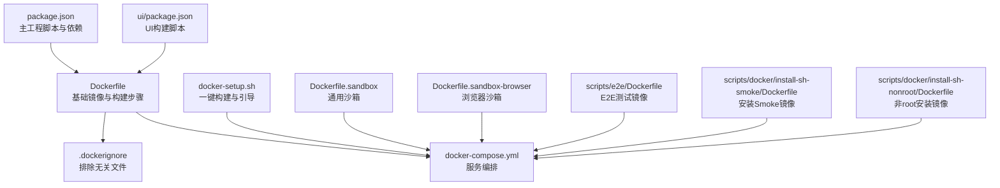
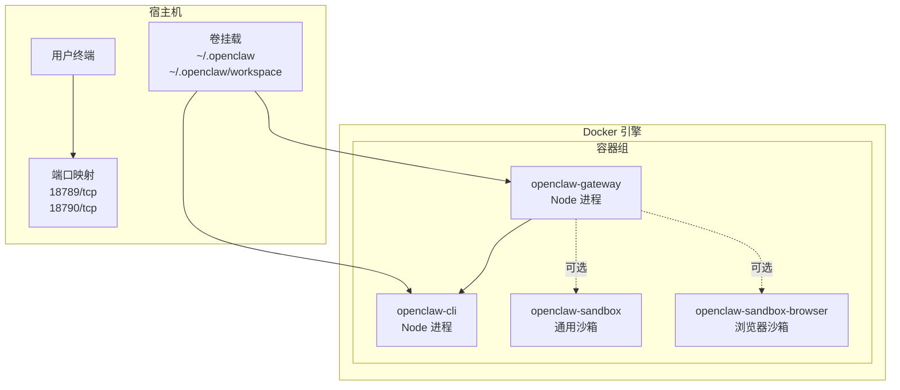
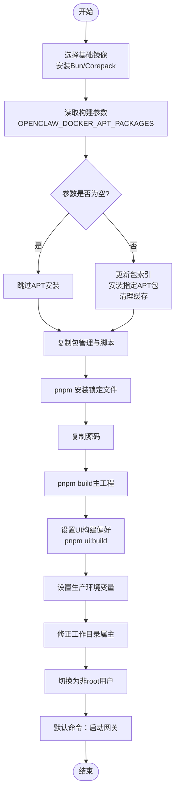
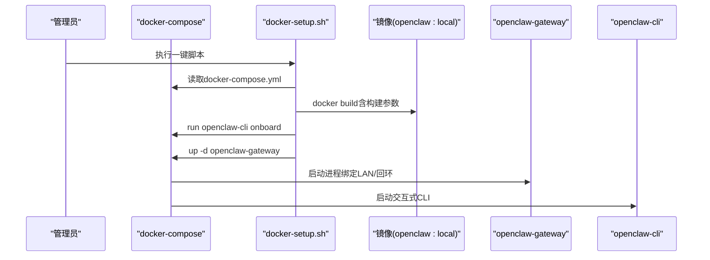
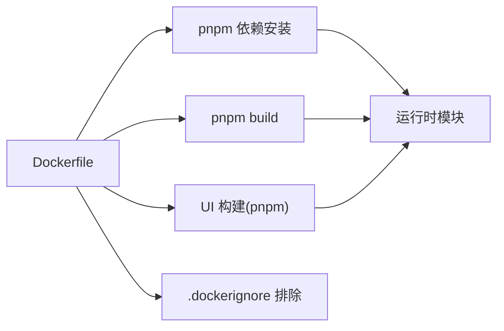

# 容器化部署

<cite>
**本文引用的文件**
- [Dockerfile](file://Dockerfile)
- [docker-compose.yml](file://docker-compose.yml)
- [.dockerignore](file://.dockerignore)
- [docker-setup.sh](file://docker-setup.sh)
- [Dockerfile.sandbox](file://Dockerfile.sandbox)
- [Dockerfile.sandbox-browser](file://Dockerfile.sandbox-browser)
- [scripts/e2e/Dockerfile](file://scripts/e2e/Dockerfile)
- [scripts/docker/install-sh-smoke/Dockerfile](file://scripts/docker/install-sh-smoke/Dockerfile)
- [scripts/docker/install-sh-nonroot/Dockerfile](file://scripts/docker/install-sh-nonroot/Dockerfile)
- [package.json](file://package.json)
- [ui/package.json](file://ui/package.json)
</cite>

## 目录

1. [简介](#简介)
2. [项目结构](#项目结构)
3. [核心组件](#核心组件)
4. [架构总览](#架构总览)
5. [组件详解](#组件详解)
6. [依赖关系分析](#依赖关系分析)
7. [性能与资源考量](#性能与资源考量)
8. [故障排查指南](#故障排查指南)
9. [结论](#结论)
10. [附录：常用Compose模板](#附录常用compose模板)

## 简介

本文件面向在容器环境中部署 OpenClaw 的工程团队与运维人员，系统性说明 Docker 镜像构建流程（含多阶段优化思路）、非 root 运行与安全加固、APT 包安装机制、UI 构建优化策略，并提供 docker-compose 编排示例（网关服务、CLI、可选沙箱与浏览器沙箱），覆盖网络端口映射、卷挂载策略、环境变量传递与健康检查建议。文末附带常见部署场景的 Compose 模板，便于快速落地。

## 项目结构

围绕容器化部署的关键文件与目录如下：

- 镜像构建：根目录 Dockerfile、.dockerignore；另有专用沙箱镜像与 E2E 测试镜像
- 编排与启动：docker-compose.yml、docker-setup.sh
- 构建与脚手架：package.json（主工程）、ui/package.json（控制 UI）

图表来源

- [Dockerfile](file://Dockerfile#L1-L49)
- [.dockerignore](file://.dockerignore#L1-L61)
- [docker-compose.yml](file://docker-compose.yml#L1-L47)
- [docker-setup.sh](file://docker-setup.sh#L1-L221)
- [Dockerfile.sandbox](file://Dockerfile.sandbox#L1-L21)
- [Dockerfile.sandbox-browser](file://Dockerfile.sandbox-browser#L1-L33)
- [scripts/e2e/Dockerfile](file://scripts/e2e/Dockerfile#L1-L24)
- [scripts/docker/install-sh-smoke/Dockerfile](file://scripts/docker/install-sh-smoke/Dockerfile#L1-L22)
- [scripts/docker/install-sh-nonroot/Dockerfile](file://scripts/docker/install-sh-nonroot/Dockerfile#L1-L30)
- [package.json](file://package.json#L1-L219)
- [ui/package.json](file://ui/package.json#L1-L24)

章节来源

- [Dockerfile](file://Dockerfile#L1-L49)
- [docker-compose.yml](file://docker-compose.yml#L1-L47)
- [.dockerignore](file://.dockerignore#L1-L61)
- [docker-setup.sh](file://docker-setup.sh#L1-L221)
- [Dockerfile.sandbox](file://Dockerfile.sandbox#L1-L21)
- [Dockerfile.sandbox-browser](file://Dockerfile.sandbox-browser#L1-L33)
- [scripts/e2e/Dockerfile](file://scripts/e2e/Dockerfile#L1-L24)
- [scripts/docker/install-sh-smoke/Dockerfile](file://scripts/docker/install-sh-smoke/Dockerfile#L1-L22)
- [scripts/docker/install-sh-nonroot/Dockerfile](file://scripts/docker/install-sh-nonroot/Dockerfile#L1-L30)
- [package.json](file://package.json#L1-L219)
- [ui/package.json](file://ui/package.json#L1-L24)

## 核心组件

- 基础镜像与构建链路：基于 Node.js 官方镜像，启用 Corepack，安装 Bun 并通过 pnpm 安装与构建，随后进行 UI 构建与产物打包。
- 非 root 运行：使用内置 node 用户执行，降低权限风险。
- APT 包安装：通过构建参数注入需要的系统依赖，按需安装，避免不必要的包进入镜像。
- UI 构建优化：在 Docker 中优先使用 pnpm 构建 UI，兼容 ARM/Synology 等架构。
- 编排与启动：通过 docker-compose 启动网关与 CLI 服务，支持端口映射、卷挂载与环境变量注入；提供一键脚本 docker-setup.sh 自动完成镜像构建、引导与启动。

章节来源

- [Dockerfile](file://Dockerfile#L1-L49)
- [docker-compose.yml](file://docker-compose.yml#L1-L47)
- [docker-setup.sh](file://docker-setup.sh#L179-L221)
- [package.json](file://package.json#L33-L109)
- [ui/package.json](file://ui/package.json#L5-L9)

## 架构总览

下图展示容器化部署的整体交互：宿主机通过 docker-compose 启动 openclaw-gateway 与 openclaw-cli 两个服务；前者负责对外提供网关能力，后者用于交互式 CLI；可选地挂载宿主机配置与工作区目录，暴露网关与桥接端口；同时可结合沙箱镜像进行隔离测试或浏览器自动化。

图表来源

- [docker-compose.yml](file://docker-compose.yml#L1-L47)
- [Dockerfile.sandbox](file://Dockerfile.sandbox#L1-L21)
- [Dockerfile.sandbox-browser](file://Dockerfile.sandbox-browser#L1-L33)

## 组件详解

### Dockerfile 构建流程与优化

- 基础层：基于 Node.js Debian 版本，安装 Bun 并启用 Corepack，设置工作目录。
- 条件 APT 安装：通过构建参数传入需要的系统依赖，仅在参数非空时执行安装与清理，减少镜像体积。
- 依赖安装：复制包管理配置与脚本后执行 pnpm 安装，确保锁定文件一致。
- 应用构建：复制源码并执行主工程构建；随后强制使用 pnpm 构建 UI，提升跨架构兼容性。
- 运行时准备：设置生产环境变量，修正工作目录属主，切换到非 root 用户。
- 默认命令：以网关模式启动，绑定回环地址，便于外部健康检查时的安全配置。

图表来源

- [Dockerfile](file://Dockerfile#L1-L49)

章节来源

- [Dockerfile](file://Dockerfile#L1-L49)

### 多阶段构建优化建议

- 当前镜像采用单阶段构建，已通过条件 APT 安装与 .dockerignore 控制构建上下文与体积。若需进一步优化，可考虑：
  - 将 UI 构建独立为单独阶段，仅保留最终静态产物于最终镜像。
  - 使用更精简的基础镜像（如 Debian slim）并最小化安装包集合。
  - 在 CI 中缓存 pnpm store 与 .turbo 等构建缓存，缩短构建时间。
- 以上为通用优化建议，不改变现有 Dockerfile 行为。

### 非 root 用户运行与安全配置

- 镜像内使用内置 node 用户运行，降低容器逃逸风险。
- 运行时目录属主修正，确保临时写入权限。
- 默认命令绑定回环地址，配合外部健康检查时可通过环境变量开启外网访问或令牌认证。

章节来源

- [Dockerfile](file://Dockerfile#L34-L48)

### APT 包安装机制

- 通过构建参数注入需要的系统依赖，仅在参数非空时执行安装与清理，避免无谓的包进入镜像。
- 典型用途：在特定平台或硬件上安装必要的系统库或工具。

章节来源

- [Dockerfile](file://Dockerfile#L11-L17)

### UI 构建优化

- 在 Docker 内强制使用 pnpm 构建 UI，解决某些架构（ARM/Synology）下构建失败的问题。
- 主工程与 UI 分别构建，确保产物一致性与可维护性。

章节来源

- [Dockerfile](file://Dockerfile#L28-L30)
- [package.json](file://package.json#L33-L109)
- [ui/package.json](file://ui/package.json#L5-L9)

### docker-compose 编排与网络

- openclaw-gateway 服务：
  - 映射端口：默认 18789（网关）、18790（桥接）
  - 卷挂载：配置目录与工作区目录
  - 环境变量：HOME、TERM、各类渠道会话密钥等
  - 命令：以 dist/index.js 启动网关，支持绑定模式与端口参数
- openclaw-cli 服务：
  - 交互式：stdin_open/tty 打开，entrypoint 指向 dist/index.js
  - 卷挂载与环境变量同 gateway
- 可选服务：
  - openclaw-sandbox：通用开发/测试沙箱
  - openclaw-sandbox-browser：带浏览器与VNC的自动化沙箱

图表来源

- [docker-setup.sh](file://docker-setup.sh#L179-L221)
- [docker-compose.yml](file://docker-compose.yml#L1-L47)

章节来源

- [docker-compose.yml](file://docker-compose.yml#L1-L47)
- [docker-setup.sh](file://docker-setup.sh#L179-L221)

### 卷挂载策略

- 配置目录：宿主机路径映射到容器内的用户主目录下的配置路径，保证配置持久化与可移植。
- 工作区目录：映射到工作区路径，便于日志、缓存与中间产物持久化。
- 可选：通过 extra compose 文件追加更多自定义挂载，或直接使用卷名。

章节来源

- [docker-compose.yml](file://docker-compose.yml#L11-L13)
- [docker-setup.sh](file://docker-setup.sh#L56-L98)

### 环境变量传递

- 关键变量：
  - OPENCLAW_GATEWAY_TOKEN：用于网关鉴权
  - OPENCLAW_GATEWAY_BIND：绑定模式（如 lan）
  - OPENCLAW_GATEWAY_PORT/OPENCLAW_BRIDGE_PORT：端口映射
  - HOME/TERM：终端与用户环境
  - 渠道会话密钥：如 CLAUDE_AI_SESSION_KEY、CLAUDE_WEB_SESSION_KEY、CLAUDE_WEB_COOKIE 等
- 一键脚本会生成或更新 .env 文件，确保变量持久化。

章节来源

- [docker-compose.yml](file://docker-compose.yml#L4-L11)
- [docker-setup.sh](file://docker-setup.sh#L167-L177)

### 健康检查与可观测性建议

- 当前未在 compose 中定义健康检查探针。建议：
  - 在网关容器中添加健康检查，探测 /health 或内部健康端点
  - 设置超时与重试策略，避免误判
  - 结合日志采集与指标导出，实现端到端可观测
- 以上为通用建议，不改变现有 compose 行为。

### 沙箱与浏览器沙箱

- openclaw-sandbox：提供通用开发/测试环境，适合运行脚本与工具。
- openclaw-sandbox-browser：预装 Chromium、VNC、noVNC、x11vnc、Xvfb 等，适合浏览器自动化与远程调试。

章节来源

- [Dockerfile.sandbox](file://Dockerfile.sandbox#L1-L21)
- [Dockerfile.sandbox-browser](file://Dockerfile.sandbox-browser#L1-L33)

### E2E 与安装测试镜像

- scripts/e2e/Dockerfile：用于端到端测试的完整构建镜像
- scripts/docker/install-sh-smoke/Dockerfile：轻量安装 Smoke 测试镜像
- scripts/docker/install-sh-nonroot/Dockerfile：非 root 安装测试镜像

章节来源

- [scripts/e2e/Dockerfile](file://scripts/e2e/Dockerfile#L1-L24)
- [scripts/docker/install-sh-smoke/Dockerfile](file://scripts/docker/install-sh-smoke/Dockerfile#L1-L22)
- [scripts/docker/install-sh-nonroot/Dockerfile](file://scripts/docker/install-sh-nonroot/Dockerfile#L1-L30)

## 依赖关系分析

- 构建期依赖：Node.js、Bun、Corepack、pnpm、UI 构建工具（Vite）
- 运行期依赖：主工程运行时模块、渠道 SDK、SQLite/向量扩展等
- 体积与安全：通过 .dockerignore 排除大文件与构建产物，条件 APT 安装减少镜像大小

图表来源

- [Dockerfile](file://Dockerfile#L1-L49)
- [.dockerignore](file://.dockerignore#L1-L61)
- [package.json](file://package.json#L33-L109)
- [ui/package.json](file://ui/package.json#L5-L9)

章节来源

- [Dockerfile](file://Dockerfile#L1-L49)
- [.dockerignore](file://.dockerignore#L1-L61)
- [package.json](file://package.json#L33-L109)
- [ui/package.json](file://ui/package.json#L5-L9)

## 性能与资源考量

- 构建性能：
  - 使用 pnpm 锁定版本，减少重复下载
  - .dockerignore 严格排除大文件与缓存目录，缩小构建上下文
  - 条件 APT 安装避免不必要的包
- 运行性能：
  - UI 构建统一走 pnpm，提升跨架构稳定性
  - 通过环境变量控制绑定模式与端口，避免不必要的网络暴露
- 资源限制建议（通用）：
  - 为网关容器设置 CPU/内存限制，防止突发占用
  - 为 UI 构建阶段使用独立任务队列，避免与运行容器争抢资源

## 故障排查指南

- 构建失败（UI 构建）：
  - 现象：Bun 在特定架构上构建失败
  - 处理：Dockerfile 已强制 pnpm 构建 UI，确保跨架构兼容
- 端口冲突：
  - 现象：宿主机端口被占用
  - 处理：调整 OPENCLAW_GATEWAY_PORT/OPENCLAW_BRIDGE_PORT 或释放端口
- 权限问题：
  - 现象：容器内无法写入临时目录
  - 处理：Dockerfile 已修正工作目录属主；确认卷挂载目录权限
- 鉴权失败：
  - 现象：外部健康检查或客户端无法访问
  - 处理：设置 OPENCLAW_GATEWAY_TOKEN 或调整绑定模式；必要时修改默认命令参数

章节来源

- [Dockerfile](file://Dockerfile#L28-L30)
- [docker-compose.yml](file://docker-compose.yml#L14-L16)
- [docker-setup.sh](file://docker-setup.sh#L40-L51)

## 结论

本文档从镜像构建、运行安全、编排与网络、卷挂载与环境变量、以及健康检查建议等方面，系统梳理了 OpenClaw 的容器化部署方案。通过条件 APT 安装、严格的 .dockerignore 与非 root 运行，既保障了安全性也兼顾了可维护性。结合 docker-compose 与一键脚本，可快速完成本地或生产环境的部署与运维。

## 附录：常用Compose模板

以下为常见部署场景的 Compose 模板片段，便于按需组合使用。请根据实际环境替换变量值与挂载路径。

- 基础网关与 CLI
  - 服务：openclaw-gateway、openclaw-cli
  - 端口：18789、18790
  - 卷：配置目录与工作区目录
  - 环境：HOME、TERM、OPENCLAW_GATEWAY_TOKEN、渠道会话密钥

- 加入通用沙箱
  - 服务：openclaw-sandbox
  - 场景：开发/测试脚本与工具

- 加入浏览器沙箱
  - 服务：openclaw-sandbox-browser
  - 场景：浏览器自动化、远程桌面调试（VNC/noVNC）

- E2E 测试镜像
  - 服务：基于 scripts/e2e/Dockerfile 的测试容器
  - 场景：CI/CD 端到端测试

- 安装Smoke/非root测试镜像
  - 服务：基于 scripts/docker/install-sh-smoke/Dockerfile 与 scripts/docker/install-sh-nonroot/Dockerfile
  - 场景：安装流程验证与非 root 权限测试

章节来源

- [docker-compose.yml](file://docker-compose.yml#L1-L47)
- [Dockerfile.sandbox](file://Dockerfile.sandbox#L1-L21)
- [Dockerfile.sandbox-browser](file://Dockerfile.sandbox-browser#L1-L33)
- [scripts/e2e/Dockerfile](file://scripts/e2e/Dockerfile#L1-L24)
- [scripts/docker/install-sh-smoke/Dockerfile](file://scripts/docker/install-sh-smoke/Dockerfile#L1-L22)
- [scripts/docker/install-sh-nonroot/Dockerfile](file://scripts/docker/install-sh-nonroot/Dockerfile#L1-L30)
