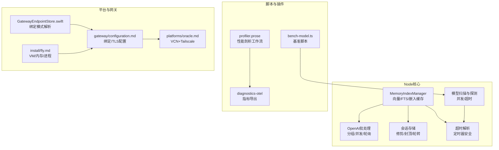
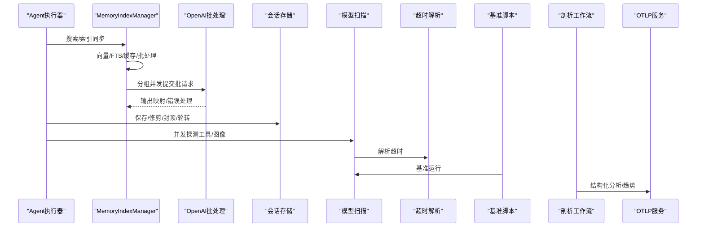
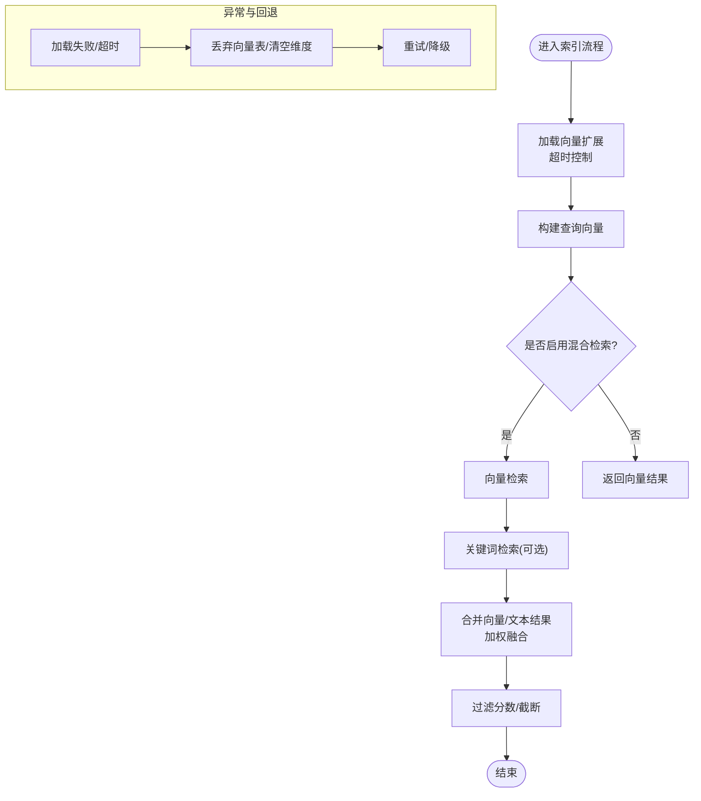
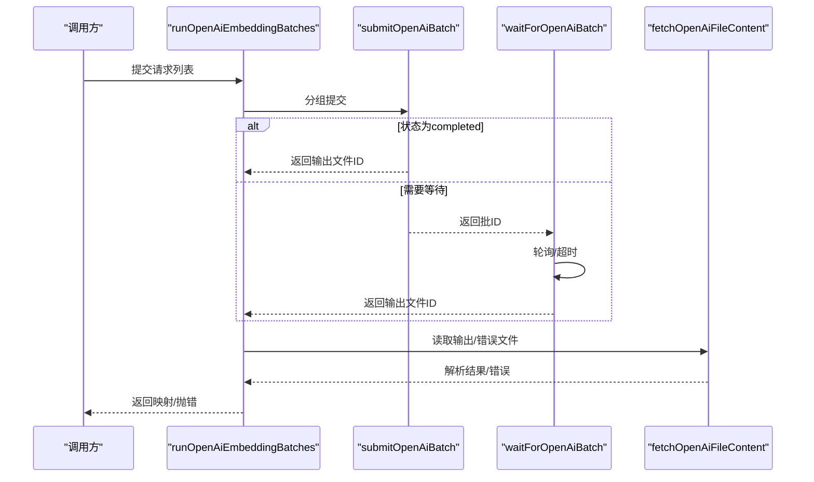
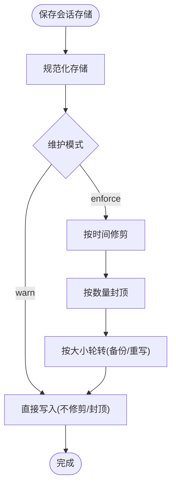
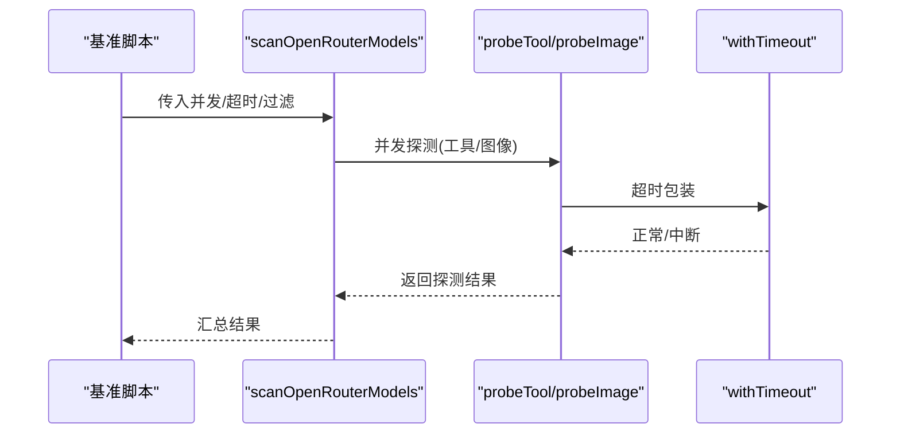
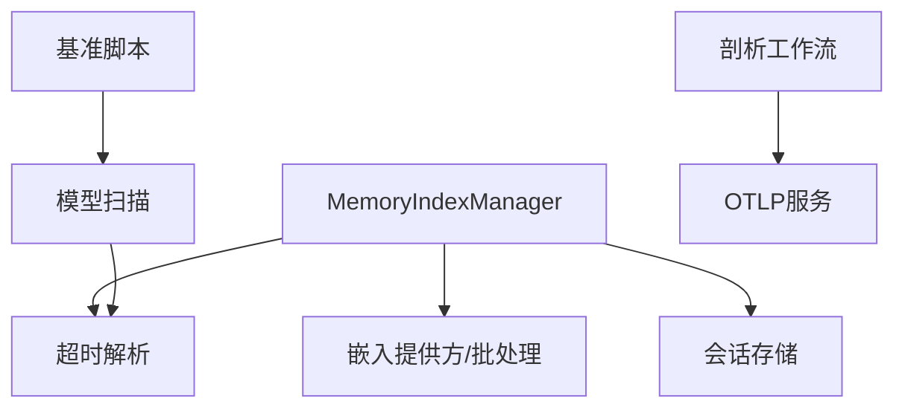

# 性能优化

<cite>
**本文引用的文件**
- [src/memory/manager.ts](file://src/memory/manager.ts)
- [src/memory/batch-openai.ts](file://src/memory/batch-openai.ts)
- [src/memory/manager.vector-dedupe.test.ts](file://src/memory/manager.vector-dedupe.test.ts)
- [src/agents/model-scan.ts](file://src/agents/model-scan.ts)
- [src/agents/timeout.ts](file://src/agents/timeout.ts)
- [src/agents/timeout.test.ts](file://src/agents/timeout.test.ts)
- [src/config/sessions/store.ts](file://src/config/sessions/store.ts)
- [src/config/sessions/store.pruning.test.ts](file://src/config/sessions/store.pruning.test.ts)
- [scripts/bench-model.ts](file://scripts/bench-model.ts)
- [extensions/diagnostics-otel/src/service.ts](file://extensions/diagnostics-otel/src/service.ts)
- [extensions/open-prose/skills/prose/lib/profiler.prose](file://extensions/open-prose/skills/prose/lib/profiler.prose)
- [extensions/open-prose/skills/prose/examples/18-mixed-parallel-sequential.prose](file://extensions/open-prose/skills/prose/examples/18-mixed-parallel-sequential.prose)
- [extensions/open-prose/skills/prose/examples/41-rlm-divide-conquer.prose](file://extensions/open-prose/skills/prose/examples/41-rlm-divide-conquer.prose)
- [apps/macos/Sources/OpenClaw/GatewayEndpointStore.swift](file://apps/macos/Sources/OpenClaw/GatewayEndpointStore.swift)
- [docs/zh-CN/gateway/configuration.md](file://docs/zh-CN/gateway/configuration.md)
- [docs/zh-CN/install/fly.md](file://docs/zh-CN/install/fly.md)
- [docs/zh-CN/platforms/oracle.md](file://docs/zh-CN/platforms/oracle.md)
</cite>

## 目录

1. [简介](#简介)
2. [项目结构](#项目结构)
3. [核心组件](#核心组件)
4. [架构总览](#架构总览)
5. [详细组件分析](#详细组件分析)
6. [依赖关系分析](#依赖关系分析)
7. [性能考量](#性能考量)
8. [故障排查指南](#故障排查指南)
9. [结论](#结论)
10. [附录](#附录)

## 简介

本指南面向OpenClaw系统的性能优化，聚焦以下方面：

- 内存管理与向量检索：向量数据库优化、会话增量同步与压缩、嵌入缓存与批处理
- AI模型性能调优：并发控制、超时与重试、资源分配与成本度量
- 系统性能基准测试：脚本化评测、指标采集与分析
- 网络与连接：绑定模式、TLS、连接池与超时
- 负载均衡与高可用：集群扩展与健康检查
- 监控与瓶颈定位：指标体系、剖析与建议
- 不同硬件配置下的调优策略

## 项目结构

OpenClaw由多语言模块组成，核心性能相关逻辑集中在Node侧的内存索引、嵌入批处理、会话存储与网关配置，以及Swift/macOS侧的网关绑定解析。文档与脚本提供了安装、平台与监控参考。

图示来源

- [src/memory/manager.ts](file://src/memory/manager.ts#L111-L248)
- [src/memory/batch-openai.ts](file://src/memory/batch-openai.ts#L283-L398)
- [src/agents/model-scan.ts](file://src/agents/model-scan.ts#L390-L510)
- [src/config/sessions/store.ts](file://src/config/sessions/store.ts#L227-L489)
- [src/agents/timeout.ts](file://src/agents/timeout.ts#L1-L48)
- [scripts/bench-model.ts](file://scripts/bench-model.ts#L50-L79)
- [extensions/open-prose/skills/prose/lib/profiler.prose](file://extensions/open-prose/skills/prose/lib/profiler.prose#L317-L400)
- [extensions/diagnostics-otel/src/service.ts](file://extensions/diagnostics-otel/src/service.ts#L166-L383)
- [apps/macos/Sources/OpenClaw/GatewayEndpointStore.swift](file://apps/macos/Sources/OpenClaw/GatewayEndpointStore.swift#L554-L583)
- [docs/zh-CN/gateway/configuration.md](file://docs/zh-CN/gateway/configuration.md#L3221-L3267)
- [docs/zh-CN/install/fly.md](file://docs/zh-CN/install/fly.md#L51-L94)
- [docs/zh-CN/platforms/oracle.md](file://docs/zh-CN/platforms/oracle.md#L152-L188)

章节来源

- [src/memory/manager.ts](file://src/memory/manager.ts#L111-L248)
- [src/memory/batch-openai.ts](file://src/memory/batch-openai.ts#L283-L398)
- [src/agents/model-scan.ts](file://src/agents/model-scan.ts#L390-L510)
- [src/config/sessions/store.ts](file://src/config/sessions/store.ts#L227-L489)
- [src/agents/timeout.ts](file://src/agents/timeout.ts#L1-L48)
- [scripts/bench-model.ts](file://scripts/bench-model.ts#L50-L79)
- [extensions/open-prose/skills/prose/lib/profiler.prose](file://extensions/open-prose/skills/prose/lib/profiler.prose#L317-L400)
- [extensions/diagnostics-otel/src/service.ts](file://extensions/diagnostics-otel/src/service.ts#L166-L383)
- [apps/macos/Sources/OpenClaw/GatewayEndpointStore.swift](file://apps/macos/Sources/OpenClaw/GatewayEndpointStore.swift#L554-L583)
- [docs/zh-CN/gateway/configuration.md](file://docs/zh-CN/gateway/configuration.md#L3221-L3267)
- [docs/zh-CN/install/fly.md](file://docs/zh-CN/install/fly.md#L51-L94)
- [docs/zh-CN/platforms/oracle.md](file://docs/zh-CN/platforms/oracle.md#L152-L188)

## 核心组件

- 内存索引与向量检索：支持SQLite vec扩展、FTS混合检索、嵌入缓存、批处理回退与失败计数、维度表重建与元数据持久化。
- 嵌入批处理：OpenAI批请求分组、并发提交、等待完成、错误文件读取与汇总。
- 会话存储：按时间与数量修剪、封顶、文件轮转，维护模式“warn/enforce”。
- 模型扫描与探测：并发探测工具调用与图像输入能力，带超时与进度回调。
- 超时与重试：统一解析Agent超时，确保定时器安全上限，避免溢出。
- 监控与剖析：OTLP指标计数/直方图、剖析工作流输出结构化分析与趋势跟踪。

章节来源

- [src/memory/manager.ts](file://src/memory/manager.ts#L111-L248)
- [src/memory/batch-openai.ts](file://src/memory/batch-openai.ts#L283-L398)
- [src/config/sessions/store.ts](file://src/config/sessions/store.ts#L227-L489)
- [src/agents/model-scan.ts](file://src/agents/model-scan.ts#L390-L510)
- [src/agents/timeout.ts](file://src/agents/timeout.ts#L1-L48)
- [extensions/diagnostics-otel/src/service.ts](file://extensions/diagnostics-otel/src/service.ts#L166-L383)
- [extensions/open-prose/skills/prose/lib/profiler.prose](file://extensions/open-prose/skills/prose/lib/profiler.prose#L317-L400)

## 架构总览

下图展示内存索引与批处理、会话存储、模型探测与超时控制之间的交互，以及监控与剖析的集成路径。

图示来源

- [src/memory/manager.ts](file://src/memory/manager.ts#L266-L314)
- [src/memory/batch-openai.ts](file://src/memory/batch-openai.ts#L283-L398)
- [src/config/sessions/store.ts](file://src/config/sessions/store.ts#L476-L489)
- [src/agents/model-scan.ts](file://src/agents/model-scan.ts#L390-L510)
- [src/agents/timeout.ts](file://src/agents/timeout.ts#L15-L48)
- [scripts/bench-model.ts](file://scripts/bench-model.ts#L50-L79)
- [extensions/open-prose/skills/prose/lib/profiler.prose](file://extensions/open-prose/skills/prose/lib/profiler.prose#L317-L400)
- [extensions/diagnostics-otel/src/service.ts](file://extensions/diagnostics-otel/src/service.ts#L346-L383)

## 详细组件分析

### 内存索引与向量数据库优化

- 向量扩展加载与表管理：延迟加载sqlite-vec扩展，超时控制，按维度动态创建/重建向量表，失败记录与降级。
- 混合检索：向量相似度与FTS关键词合并，权重可配置，候选集放大系数控制召回。
- 嵌入缓存：跨索引迁移缓存表，ON CONFLICT更新，减少重复计算。
- 批处理与回退：批量嵌入失败次数阈值触发回退，记录失败原因与提供方，动态调整并发。
- 会话增量同步：按字节与消息阈值聚合增量，触发同步，避免频繁写入。

图示来源

- [src/memory/manager.ts](file://src/memory/manager.ts#L613-L639)
- [src/memory/manager.ts](file://src/memory/manager.ts#L669-L692)
- [src/memory/manager.ts](file://src/memory/manager.ts#L292-L314)
- [src/memory/manager.ts](file://src/memory/manager.ts#L2161-L2192)

章节来源

- [src/memory/manager.ts](file://src/memory/manager.ts#L613-L639)
- [src/memory/manager.ts](file://src/memory/manager.ts#L669-L692)
- [src/memory/manager.ts](file://src/memory/manager.ts#L292-L314)
- [src/memory/manager.ts](file://src/memory/manager.ts#L716-L764)
- [src/memory/manager.ts](file://src/memory/manager.ts#L2161-L2192)
- [src/memory/manager.vector-dedupe.test.ts](file://src/memory/manager.vector-dedupe.test.ts#L82-L101)

### 嵌入批处理与并发控制

- 请求分组：按最大请求数拆分，逐组提交。
- 并发提交：限制并发任务数，等待全部完成，首个错误即终止。
- 等待与轮询：可等待完成或立即返回，超时与轮询间隔可控。
- 错误处理：读取错误文件，汇总失败项，抛出聚合错误。
- 回退策略：批处理失败时回退到逐个嵌入，记录失败次数与提供方，超过阈值禁用批处理。

图示来源

- [src/memory/batch-openai.ts](file://src/memory/batch-openai.ts#L283-L398)
- [src/memory/batch-openai.ts](file://src/memory/batch-openai.ts#L69-L135)
- [src/memory/batch-openai.ts](file://src/memory/batch-openai.ts#L201-L246)
- [src/memory/batch-openai.ts](file://src/memory/batch-openai.ts#L342-L398)

章节来源

- [src/memory/batch-openai.ts](file://src/memory/batch-openai.ts#L283-L398)
- [src/memory/batch-openai.ts](file://src/memory/batch-openai.ts#L69-L135)
- [src/memory/batch-openai.ts](file://src/memory/batch-openai.ts#L201-L246)
- [src/memory/batch-openai.ts](file://src/memory/batch-openai.ts#L342-L398)
- [src/memory/manager.ts](file://src/memory/manager.ts#L2161-L2192)

### 会话存储压缩与清理

- 修剪：按时间阈值删除过期条目，保留无时间戳条目。
- 封顶：按最近更新排序，超过上限的条目被裁剪。
- 轮转：文件大小达到阈值时备份并重写，保证存储规模可控。
- 维护模式：warn仅告警，enforce强制执行修剪与封顶。

图示来源

- [src/config/sessions/store.ts](file://src/config/sessions/store.ts#L476-L489)
- [src/config/sessions/store.ts](file://src/config/sessions/store.ts#L301-L319)
- [src/config/sessions/store.ts](file://src/config/sessions/store.ts#L371-L389)
- [src/config/sessions/store.ts](file://src/config/sessions/store.ts#L467-L489)

章节来源

- [src/config/sessions/store.ts](file://src/config/sessions/store.ts#L227-L489)
- [src/config/sessions/store.pruning.test.ts](file://src/config/sessions/store.pruning.test.ts#L38-L515)

### AI模型性能调优与并发控制

- 并发探测：工具调用与图像输入探测，支持并发限制与进度回调。
- 超时控制：统一解析超时，避免定时器溢出，提供秒/毫秒覆盖。
- 成本与耗时：基准脚本输出单次耗时与使用统计，便于对比不同模型。

图示来源

- [scripts/bench-model.ts](file://scripts/bench-model.ts#L50-L79)
- [src/agents/model-scan.ts](file://src/agents/model-scan.ts#L390-L510)
- [src/agents/model-scan.ts](file://src/agents/model-scan.ts#L264-L345)
- [src/agents/timeout.ts](file://src/agents/timeout.ts#L15-L48)

章节来源

- [src/agents/model-scan.ts](file://src/agents/model-scan.ts#L390-L510)
- [src/agents/timeout.ts](file://src/agents/timeout.ts#L1-L48)
- [src/agents/timeout.test.ts](file://src/agents/timeout.test.ts#L1-L14)
- [scripts/bench-model.ts](file://scripts/bench-model.ts#L50-L79)

### 监控与剖析

- 指标导出：消息处理计数、队列深度/等待、会话状态/卡住、运行尝试、令牌用量、成本、时延、上下文大小等。
- 剖析工作流：结构化分析阶段输出，包含成本/时间归因、效率评估、缓存效率、热点识别与改进建议，并支持趋势跟踪。

图示来源

- [extensions/diagnostics-otel/src/service.ts](file://extensions/diagnostics-otel/src/service.ts#L166-L383)
- [extensions/open-prose/skills/prose/lib/profiler.prose](file://extensions/open-prose/skills/prose/lib/profiler.prose#L317-L400)

章节来源

- [extensions/diagnostics-otel/src/service.ts](file://extensions/diagnostics-otel/src/service.ts#L166-L383)
- [extensions/open-prose/skills/prose/lib/profiler.prose](file://extensions/open-prose/skills/prose/lib/profiler.prose#L317-L400)

### 工作流中的并行与串行组合

- 混合并行/串行：示例工作流展示并行分支内可继续串行步骤，适合批处理与聚合。
- 分治策略：大输入按语义切分为多块，递归分治，最后合成，提升吞吐与稳定性。

章节来源

- [extensions/open-prose/skills/prose/examples/18-mixed-parallel-sequential.prose](file://extensions/open-prose/skills/prose/examples/18-mixed-parallel-sequential.prose#L1-L36)
- [extensions/open-prose/skills/prose/examples/41-rlm-divide-conquer.prose](file://extensions/open-prose/skills/prose/examples/41-rlm-divide-conquer.prose#L1-L38)

## 依赖关系分析

- 内存索引依赖嵌入提供方与批处理实现，受超时与重试策略影响。
- 会话存储与内存索引解耦，但二者均影响整体I/O与CPU占用。
- 模型扫描依赖超时解析，基准脚本驱动对比实验。
- 监控与剖析通过OTLP与剖析工作流形成闭环反馈。

图示来源

- [src/memory/manager.ts](file://src/memory/manager.ts#L111-L248)
- [src/memory/batch-openai.ts](file://src/memory/batch-openai.ts#L283-L398)
- [src/config/sessions/store.ts](file://src/config/sessions/store.ts#L227-L489)
- [src/agents/model-scan.ts](file://src/agents/model-scan.ts#L390-L510)
- [src/agents/timeout.ts](file://src/agents/timeout.ts#L1-L48)
- [scripts/bench-model.ts](file://scripts/bench-model.ts#L50-L79)
- [extensions/open-prose/skills/prose/lib/profiler.prose](file://extensions/open-prose/skills/prose/lib/profiler.prose#L317-L400)
- [extensions/diagnostics-otel/src/service.ts](file://extensions/diagnostics-otel/src/service.ts#L166-L383)

章节来源

- [src/memory/manager.ts](file://src/memory/manager.ts#L111-L248)
- [src/memory/batch-openai.ts](file://src/memory/batch-openai.ts#L283-L398)
- [src/config/sessions/store.ts](file://src/config/sessions/store.ts#L227-L489)
- [src/agents/model-scan.ts](file://src/agents/model-scan.ts#L390-L510)
- [src/agents/timeout.ts](file://src/agents/timeout.ts#L1-L48)
- [scripts/bench-model.ts](file://scripts/bench-model.ts#L50-L79)
- [extensions/open-prose/skills/prose/lib/profiler.prose](file://extensions/open-prose/skills/prose/lib/profiler.prose#L317-L400)
- [extensions/diagnostics-otel/src/service.ts](file://extensions/diagnostics-otel/src/service.ts#L166-L383)

## 性能考量

- 向量数据库
  - 优先启用sqlite-vec扩展，合理设置维度，避免频繁重建表。
  - 使用混合检索并调优候选倍数与权重，平衡召回与速度。
  - 启用嵌入缓存，减少重复计算；定期迁移缓存表。
- 批处理
  - 控制并发与分组大小，结合等待与超时参数，避免服务端限流。
  - 失败回退与阈值禁用，保障稳定性。
- 会话存储
  - 合理设置修剪时间与封顶数量，避免内存膨胀。
  - 轮转阈值根据业务峰值流量设定，降低写放大。
- 模型与并发
  - 并发探测与超时控制，避免长时间阻塞。
  - 基准脚本对比不同模型，选择性价比高的推理后端。
- 监控与剖析
  - 关注令牌用量、时延、上下文大小与成本，识别瓶颈。
  - 使用剖析工作流输出的热点与并行机会指导优化。

[本节为通用指导，无需列出具体文件来源]

## 故障排查指南

- 向量扩展加载失败
  - 现象：加载超时或报错，向量不可用。
  - 排查：确认扩展路径、权限与版本；查看日志错误；必要时降级至FTS。
- 批处理失败
  - 现象：批状态失败/过期/取消，错误文件存在。
  - 排查：读取错误文件内容，修正请求格式或限额；降低并发或等待窗口。
- 会话存储异常
  - 现象：存储过大、写入频繁、轮转失败。
  - 排查：检查维护模式、修剪阈值、封顶数量与轮转阈值；确认磁盘空间。
- 超时与定时器溢出
  - 现象：超时异常或行为不可预测。
  - 排查：使用定时器安全上限；避免负值或过大值覆盖；核对默认与覆盖逻辑。
- 网络与绑定
  - 现象：无法访问或连接不稳定。
  - 排查：绑定模式与TLS配置；VCN安全列表；Tailscale网络策略。

章节来源

- [src/memory/manager.ts](file://src/memory/manager.ts#L641-L667)
- [src/memory/batch-openai.ts](file://src/memory/batch-openai.ts#L201-L246)
- [src/config/sessions/store.ts](file://src/config/sessions/store.ts#L476-L489)
- [src/agents/timeout.ts](file://src/agents/timeout.ts#L15-L48)
- [src/agents/timeout.test.ts](file://src/agents/timeout.test.ts#L1-L14)
- [docs/zh-CN/gateway/configuration.md](file://docs/zh-CN/gateway/configuration.md#L3221-L3267)
- [docs/zh-CN/platforms/oracle.md](file://docs/zh-CN/platforms/oracle.md#L152-L188)

## 结论

通过向量数据库优化、批处理与并发控制、会话存储压缩、模型探测与基准脚本、监控与剖析闭环，OpenClaw可在多平台与多后端环境下实现稳定高效的性能表现。建议在生产环境中结合硬件配置与业务特征，持续迭代上述策略与阈值。

[本节为总结性内容，无需列出具体文件来源]

## 附录

### 系统性能基准测试方法

- 使用基准脚本对多个模型进行多次运行，收集耗时与使用统计，计算中位数与极值。
- 对比不同模型/后端在相同提示下的性能差异，辅助选型与容量规划。

章节来源

- [scripts/bench-model.ts](file://scripts/bench-model.ts#L50-L79)
- [scripts/bench-model.ts](file://scripts/bench-model.ts#L130-L144)

### 网络优化与高可用配置

- 绑定模式：lan/tailnet/loopback/auto，按需选择；TLS开关与自动生成证书。
- 平台加固：VCN仅开放必要端口，配合Tailscale实现零信任访问。
- 部署建议：Fly平台设置合适的内存与进程数，开启健康检查与最小运行实例数。

章节来源

- [docs/zh-CN/gateway/configuration.md](file://docs/zh-CN/gateway/configuration.md#L3221-L3267)
- [docs/zh-CN/platforms/oracle.md](file://docs/zh-CN/platforms/oracle.md#L152-L188)
- [docs/zh-CN/install/fly.md](file://docs/zh-CN/install/fly.md#L51-L94)

### 负载均衡与集群扩展

- 通过多实例部署与健康检查维持最小运行实例，结合平台提供的自动扩缩容策略。
- 网络层面采用Tailscale或VCN安全策略，确保跨地域访问的安全与低延迟。

章节来源

- [docs/zh-CN/install/fly.md](file://docs/zh-CN/install/fly.md#L51-L94)
- [docs/zh-CN/platforms/oracle.md](file://docs/zh-CN/platforms/oracle.md#L152-L188)

### 性能监控工具使用

- OTLP指标：关注消息处理、队列、会话状态、运行尝试、令牌用量、成本与时延。
- 剖析工作流：基于结构化分析输出，识别热点、并行机会与缓存效率，制定优化建议。

章节来源

- [extensions/diagnostics-otel/src/service.ts](file://extensions/diagnostics-otel/src/service.ts#L166-L383)
- [extensions/open-prose/skills/prose/lib/profiler.prose](file://extensions/open-prose/skills/prose/lib/profiler.prose#L317-L400)

### 不同硬件配置下的调优方案

- CPU/内存受限：降低并发、增大等待轮询间隔、启用FTS优先、适度提高修剪与封顶阈值。
- 存储IO受限：启用嵌入缓存、减少重复索引、合理设置轮转阈值、关闭不必要的向量维度。
- 网络受限：优先使用本地/边缘后端、合理设置超时与重试、启用批处理并控制分组大小。

章节来源

- [src/memory/manager.ts](file://src/memory/manager.ts#L91-L102)
- [src/memory/batch-openai.ts](file://src/memory/batch-openai.ts#L38-L67)
- [src/config/sessions/store.ts](file://src/config/sessions/store.ts#L227-L251)
