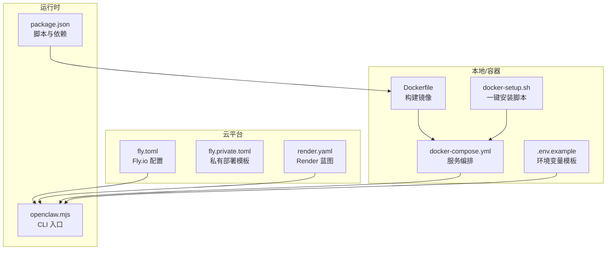
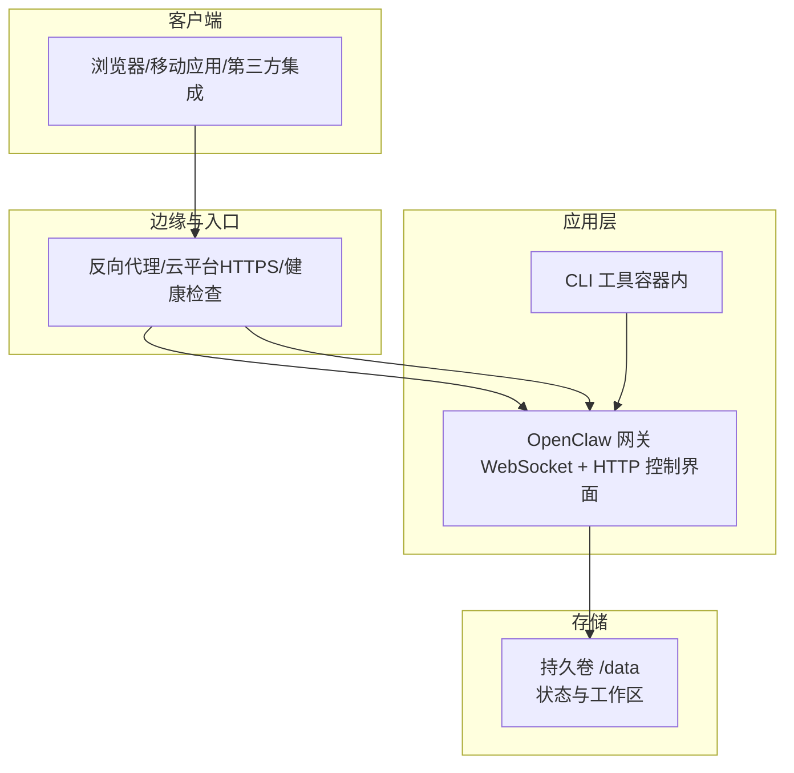
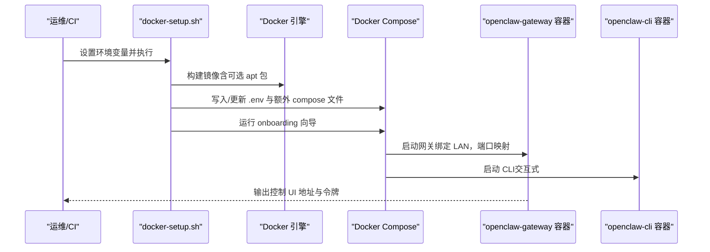
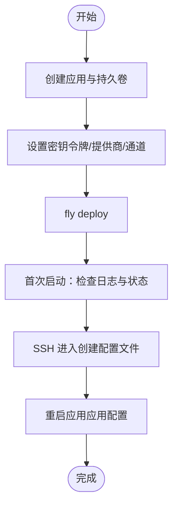
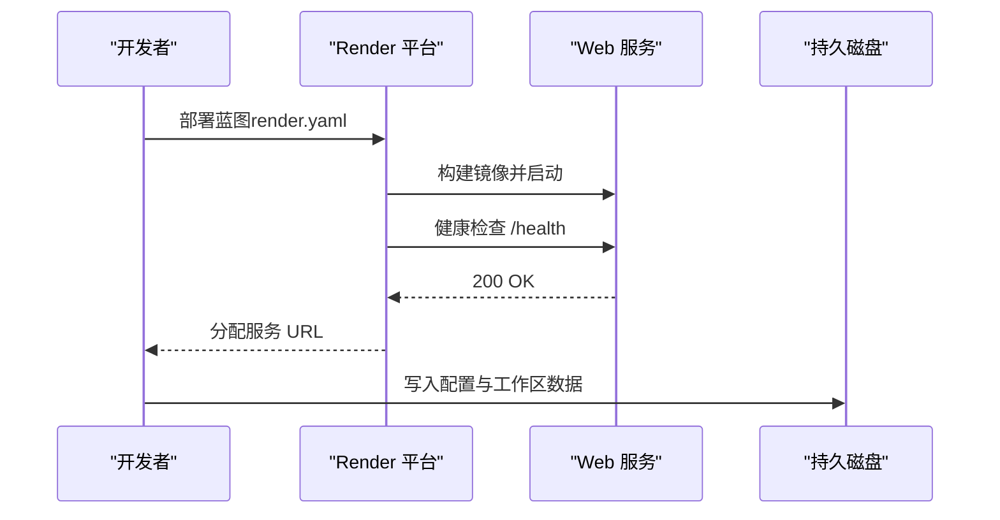
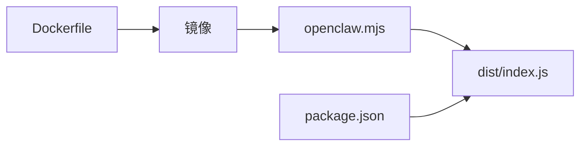

# 生产环境部署

<cite>
**本文引用的文件**
- [Dockerfile](file://Dockerfile)
- [docker-compose.yml](file://docker-compose.yml)
- [fly.toml](file://fly.toml)
- [fly.private.toml](file://fly.private.toml)
- [render.yaml](file://render.yaml)
- [.env.example](file://.env.example)
- [docker-setup.sh](file://docker-setup.sh)
- [docs/install/docker.md](file://docs/install/docker.md)
- [docs/install/fly.md](file://docs/install/fly.md)
- [docs/install/render.mdx](file://docs/install/render.mdx)
- [docs/install/nix.md](file://docs/install/nix.md)
- [openclaw.mjs](file://openclaw.mjs)
- [package.json](file://package.json)
</cite>

## 目录

1. [简介](#简介)
2. [项目结构](#项目结构)
3. [核心组件](#核心组件)
4. [架构总览](#架构总览)
5. [详细组件分析](#详细组件分析)
6. [依赖关系分析](#依赖关系分析)
7. [性能考量](#性能考量)
8. [故障排查指南](#故障排查指南)
9. [结论](#结论)
10. [附录](#附录)

## 简介

本指南面向在生产环境中部署 OpenClaw 的工程团队与运维人员，覆盖多种部署路径：Docker 容器化、Nix 包管理器、云平台（Fly.io、Render）以及私有化/半私有化部署。内容围绕环境变量、端口映射、网络与安全加固、资源限制、健康检查、自动重启、日志轮转、负载均衡与 SSL、域名绑定、性能调优与监控集成进行系统性说明，并提供最佳实践与排障建议。

## 项目结构

OpenClaw 提供多条生产部署路径，核心由以下文件与文档构成：

- 容器镜像与编排：Dockerfile、docker-compose.yml、docker-setup.sh
- 云平台配置：fly.toml、fly.private.toml、render.yaml
- 环境变量示例：.env.example
- 启动入口与构建脚本：openclaw.mjs、package.json
- 部署文档：docs/install 下的 docker.md、fly.md、render.mdx、nix.md

**图表来源**

- [Dockerfile](file://Dockerfile#L1-L49)
- [docker-compose.yml](file://docker-compose.yml#L1-L47)
- [.env.example](file://.env.example#L1-L71)
- [docker-setup.sh](file://docker-setup.sh#L1-L221)
- [fly.toml](file://fly.toml#L1-L35)
- [fly.private.toml](file://fly.private.toml#L1-L40)
- [render.yaml](file://render.yaml#L1-L22)
- [openclaw.mjs](file://openclaw.mjs#L1-L57)
- [package.json](file://package.json#L1-L219)

**章节来源**

- [Dockerfile](file://Dockerfile#L1-L49)
- [docker-compose.yml](file://docker-compose.yml#L1-L47)
- [fly.toml](file://fly.toml#L1-L35)
- [fly.private.toml](file://fly.private.toml#L1-L40)
- [render.yaml](file://render.yaml#L1-L22)
- [.env.example](file://.env.example#L1-L71)
- [docker-setup.sh](file://docker-setup.sh#L1-L221)
- [openclaw.mjs](file://openclaw.mjs#L1-L57)
- [package.json](file://package.json#L1-L219)

## 核心组件

- 容器镜像与启动参数
  - 使用 Node.js 22 基础镜像，启用 Bun 与 Corepack；以非 root 用户运行；默认 CMD 绑定回环并允许未配置启动。
  - 参考路径：[Dockerfile](file://Dockerfile#L1-L49)
- Docker Compose 编排
  - 定义网关与 CLI 两个服务，挂载配置与工作区目录，暴露网关与桥接端口，默认重启策略为 unless-stopped。
  - 参考路径：[docker-compose.yml](file://docker-compose.yml#L1-L47)
- 云平台配置
  - Fly.io：定义 Dockerfile、进程命令、HTTP 服务、VM 规格与持久卷挂载。
  - Render：定义 Docker 运行时、健康检查路径、环境变量与磁盘。
  - 参考路径：
    - [fly.toml](file://fly.toml#L1-L35)
    - [fly.private.toml](file://fly.private.toml#L1-L40)
    - [render.yaml](file://render.yaml#L1-L22)
- 环境变量与密钥
  - 示例模板包含网关令牌、状态目录、通道与模型提供商密钥等键位。
  - 参考路径：[.env.example](file://.env.example#L1-L71)
- 启动入口与脚本
  - openclaw.mjs 作为 CLI 入口，package.json 提供构建与测试脚本。
  - 参考路径：
    - [openclaw.mjs](file://openclaw.mjs#L1-L57)
    - [package.json](file://package.json#L1-L219)

**章节来源**

- [Dockerfile](file://Dockerfile#L1-L49)
- [docker-compose.yml](file://docker-compose.yml#L1-L47)
- [fly.toml](file://fly.toml#L1-L35)
- [fly.private.toml](file://fly.private.toml#L1-L40)
- [render.yaml](file://render.yaml#L1-L22)
- [.env.example](file://.env.example#L1-L71)
- [openclaw.mjs](file://openclaw.mjs#L1-L57)
- [package.json](file://package.json#L1-L219)

## 架构总览

下图展示生产部署的总体架构：容器或云主机承载 OpenClaw 网关，通过环境变量注入密钥与配置，使用持久卷保存状态与工作区；外部通过 HTTPS 访问控制界面与网关 WebSocket；可选地通过反向代理或云平台提供的 HTTPS 与健康检查实现负载均衡与高可用。

[此图为概念性架构示意，不直接映射具体源码文件，故无“图表来源”标注]

## 详细组件分析

### Docker 容器化部署

- 镜像构建
  - 基于 node:22-bookworm，安装 Bun 并启用 Corepack；按需安装 apt 包；使用 pnpm 构建前端与后端；设置 NODE_ENV=production；以非 root 用户运行。
  - 参考路径：[Dockerfile](file://Dockerfile#L1-L49)
- 编排与端口
  - 服务 openclaw-gateway 暴露网关端口与桥接端口；默认绑定到 LAN；重启策略 unless-stopped；挂载配置与工作区目录。
  - 参考路径：[docker-compose.yml](file://docker-compose.yml#L1-L47)
- 一键安装脚本
  - docker-setup.sh 支持生成网关令牌、写入 .env、构建镜像、执行引导向导、启动服务，并支持额外挂载与命名卷。
  - 参考路径：[docker-setup.sh](file://docker-setup.sh#L1-L221)
- 环境变量与密钥
  - 使用 OPENCLAW_GATEWAY_TOKEN 或 OPENCLAW_GATEWAY_PASSWORD 进行鉴权；OPENCLAW_STATE_DIR、OPENCLAW_WORKSPACE_DIR 指向持久卷；模型与通道密钥通过环境变量注入。
  - 参考路径：[.env.example](file://.env.example#L1-L71)

**图表来源**

- [docker-setup.sh](file://docker-setup.sh#L1-L221)
- [docker-compose.yml](file://docker-compose.yml#L1-L47)
- [Dockerfile](file://Dockerfile#L1-L49)

**章节来源**

- [Dockerfile](file://Dockerfile#L1-L49)
- [docker-compose.yml](file://docker-compose.yml#L1-L47)
- [docker-setup.sh](file://docker-setup.sh#L1-L221)
- [.env.example](file://.env.example#L1-L71)

### Nix 包管理器部署

- 推荐使用 nix-openclaw 模块，提供可复现、可回滚的安装与服务管理。
- Nix 模式下禁用自动安装流程，确保配置确定性；可通过环境变量或系统偏好设置 Nix 模式。
- 参考路径：
  - [docs/install/nix.md](file://docs/install/nix.md#L1-L99)

**章节来源**

- [docs/install/nix.md](file://docs/install/nix.md#L1-L99)

### Fly.io 部署

- 应用与卷
  - 创建应用与 1GB 持久卷；设置 OPENCLAW_STATE_DIR=/data 以持久化状态。
  - 参考路径：[fly.toml](file://fly.toml#L1-L35)
- 进程与端口
  - 进程命令绑定 LAN 并允许未配置启动；内部端口 3000；强制 HTTPS。
  - 参考路径：[fly.toml](file://fly.toml#L59-L77)
- 私有部署（无公网暴露）
  - 不配置 http_service，仅通过 fly proxy、WireGuard 或 SSH 访问；适合隐藏部署与内网访问。
  - 参考路径：[fly.private.toml](file://fly.private.toml#L1-L40)
- 密钥与安全
  - 使用 fly secrets 设置 OPENCLAW_GATEWAY_TOKEN、模型与通道密钥；非回环绑定需令牌鉴权。
  - 参考路径：[fly.toml](file://fly.toml#L53-L111)

**图表来源**

- [fly.toml](file://fly.toml#L1-L35)
- [fly.private.toml](file://fly.private.toml#L1-L40)

**章节来源**

- [fly.toml](file://fly.toml#L1-L35)
- [fly.private.toml](file://fly.private.toml#L1-L40)
- [docs/install/fly.md](file://docs/install/fly.md#L1-L487)

### Render 部署

- 蓝图与健康检查
  - render.yaml 定义 Docker 运行时、健康检查路径 /health、环境变量与磁盘挂载。
  - 参考路径：[render.yaml](file://render.yaml#L1-L22)
- 部署与升级
  - 一键部署后通过设置向导完成初始化；支持计划升级与自动部署同步。
  - 参考路径：[docs/install/render.mdx](file://docs/install/render.mdx#L1-L160)

**图表来源**

- [render.yaml](file://render.yaml#L1-L22)

**章节来源**

- [render.yaml](file://render.yaml#L1-L22)
- [docs/install/render.mdx](file://docs/install/render.mdx#L1-L160)

### 环境变量与密钥管理

- 必填项
  - OPENCLAW_GATEWAY_TOKEN 或 OPENCLAW_GATEWAY_PASSWORD：用于非回环绑定的鉴权。
  - OPENCLAW_STATE_DIR：指向持久卷根目录。
  - 模型提供商与通道密钥：如 ANTHROPIC_API_KEY、TELEGRAM_BOT_TOKEN 等。
- 参考路径：[.env.example](file://.env.example#L1-L71)

**章节来源**

- [.env.example](file://.env.example#L1-L71)

### 端口映射与网络设置

- Docker Compose
  - 默认映射网关端口与桥接端口；服务绑定 LAN，便于容器平台健康检查。
  - 参考路径：[docker-compose.yml](file://docker-compose.yml#L14-L28)
- Fly.io
  - internal_port=3000；进程命令绑定 LAN；内存建议 2GB。
  - 参考路径：[fly.toml](file://fly.toml#L62-L77)
- Render
  - PORT=8080；健康检查路径 /health。
  - 参考路径：[render.yaml](file://render.yaml#L6-L13)

**章节来源**

- [docker-compose.yml](file://docker-compose.yml#L14-L28)
- [fly.toml](file://fly.toml#L62-L77)
- [render.yaml](file://render.yaml#L6-L13)

### 安全加固措施

- 容器安全
  - 非 root 用户运行；最小权限安装 apt 包；避免在镜像中硬编码密钥。
  - 参考路径：[Dockerfile](file://Dockerfile#L37-L40)
- 平台安全
  - Fly.io：非回环绑定需令牌；可使用私有模板隐藏公网暴露；必要时通过隧道处理回调。
  - Render：健康检查与自动重启；磁盘持久化避免重部署丢失配置。
  - 参考路径：
    - [fly.toml](file://fly.toml#L10-L15)
    - [fly.private.toml](file://fly.private.toml#L27-L31)
    - [render.yaml](file://render.yaml#L6-L21)

**章节来源**

- [Dockerfile](file://Dockerfile#L37-L40)
- [fly.toml](file://fly.toml#L10-L15)
- [fly.private.toml](file://fly.private.toml#L27-L31)
- [render.yaml](file://render.yaml#L6-L21)

### 资源限制、健康检查与自动重启

- Docker Compose
  - restart: unless-stopped；通过命令参数指定绑定与端口。
  - 参考路径：[docker-compose.yml](file://docker-compose.yml#L18-L28)
- Fly.io
  - min_machines_running=1；auto_stop_machines=false；内存 2GB。
  - 参考路径：[fly.toml](file://fly.toml#L23-L30)
- Render
  - healthCheckPath: /health；Plan Starter+ 支持持久磁盘。
  - 参考路径：[render.yaml](file://render.yaml#L6-L21)

**章节来源**

- [docker-compose.yml](file://docker-compose.yml#L18-L28)
- [fly.toml](file://fly.toml#L23-L30)
- [render.yaml](file://render.yaml#L6-L21)

### 日志轮转与可观测性

- 建议
  - 使用平台日志功能（Fly.io Logs、Render Dashboard Logs）集中收集；
  - 在容器/云平台侧配置日志轮转与保留策略；
  - 对外暴露的生产服务开启 HTTPS 与访问日志审计。
- 参考路径：
  - [docs/install/fly.md](file://docs/install/fly.md#L228-L234)
  - [docs/install/render.mdx](file://docs/install/render.mdx#L90-L101)

**章节来源**

- [docs/install/fly.md](file://docs/install/fly.md#L228-L234)
- [docs/install/render.mdx](file://docs/install/render.mdx#L90-L101)

### 负载均衡、SSL 与域名绑定

- 负载均衡
  - Fly.io：通过 http_service 配置；Render：通过平台路由与计划选择。
  - 参考路径：
    - [fly.toml](file://fly.toml#L20-L26)
    - [render.yaml](file://render.yaml#L1-L22)
- SSL 与域名
  - Fly.io：force_https=true；可结合自定义域名与证书。
  - Render：自定义域名设置与自动 TLS。
  - 参考路径：
    - [fly.toml](file://fly.toml#L22)
    - [docs/install/render.mdx](file://docs/install/render.mdx#L110-L116)

**章节来源**

- [fly.toml](file://fly.toml#L20-L26)
- [render.yaml](file://render.yaml#L1-L22)
- [docs/install/render.mdx](file://docs/install/render.mdx#L110-L116)

### 性能调优与监控集成

- 资源
  - Fly.io 建议 2GB 内存起步；根据并发与通道数量调整。
  - 参考路径：[docs/install/fly.md](file://docs/install/fly.md#L255-L273)
- 调优
  - 合理设置 NODE_OPTIONS（如堆大小）、禁用不必要的工具缓存、优化通道连接数。
- 监控
  - 平台日志与健康检查；可接入外部监控（如 APM、告警）以观测延迟、错误率与重启频率。

**章节来源**

- [docs/install/fly.md](file://docs/install/fly.md#L255-L273)

## 依赖关系分析

- 启动链路
  - openclaw.mjs 作为 CLI 入口，加载构建产物并分发到子命令（gateway、cli 等）。
  - 参考路径：[openclaw.mjs](file://openclaw.mjs#L1-L57)
- 构建与打包
  - package.json 定义构建脚本与依赖；Dockerfile 中 pnpm 安装与构建流程。
  - 参考路径：
    - [package.json](file://package.json#L33-L109)
    - [Dockerfile](file://Dockerfile#L24-L30)

**图表来源**

- [openclaw.mjs](file://openclaw.mjs#L1-L57)
- [package.json](file://package.json#L33-L109)
- [Dockerfile](file://Dockerfile#L24-L30)

**章节来源**

- [openclaw.mjs](file://openclaw.mjs#L1-L57)
- [package.json](file://package.json#L33-L109)
- [Dockerfile](file://Dockerfile#L24-L30)

## 性能考量

- 内存与 GC
  - 为大模型推理与并发会话预留充足内存；合理设置 NODE_OPTIONS。
- 存储与 I/O
  - 将状态与工作区挂载到持久卷；避免频繁小文件写入；对媒体与缓存目录做清理策略。
- 网络与通道
  - 控制通道并发与重试；对第三方 API 使用连接池与超时配置。
- 容器/云平台
  - 选择合适规格与实例数；在 Render 上优先垂直扩展；Fly.io 上按需横向扩展并注意粘性会话。

[本节为通用指导，无需特定文件引用]

## 故障排查指南

- 健康检查失败
  - 确认 internal_port 与进程端口一致；检查 /health 响应；查看平台日志。
  - 参考路径：
    - [fly.toml](file://fly.toml#L62-L68)
    - [render.yaml](file://render.yaml#L6)
- 内存不足/频繁重启
  - 提升内存至 2GB；检查日志中的 OOM/SIGABRT；优化并发与缓存。
  - 参考路径：[docs/install/fly.md](file://docs/install/fly.md#L255-L273)
- 状态未持久化
  - 确认 OPENCLAW_STATE_DIR 指向持久卷；检查挂载路径与权限。
  - 参考路径：
    - [fly.toml](file://fly.toml#L14)
    - [render.yaml](file://render.yaml#L12-L15)
- 鉴权问题
  - 非回环绑定需设置 OPENCLAW_GATEWAY_TOKEN；检查令牌是否正确注入。
  - 参考路径：[fly.toml](file://fly.toml#L10-L15)

**章节来源**

- [fly.toml](file://fly.toml#L10-L15)
- [fly.toml](file://fly.toml#L62-L68)
- [render.yaml](file://render.yaml#L6-L15)
- [docs/install/fly.md](file://docs/install/fly.md#L255-L273)

## 结论

OpenClaw 提供灵活的生产部署选项：Docker 适合快速落地与本地验证；Nix 适合追求可复现与可回滚的环境；Fly.io 与 Render 则提供开箱即用的 HTTPS、健康检查与持久化能力。生产部署的关键在于：明确鉴权与密钥管理、合理规划资源与存储、完善健康检查与自动重启、做好日志与监控、以及在需要时采用私有部署或隧道增强安全。

[本节为总结性内容，无需特定文件引用]

## 附录

- 参考文档
  - [docs/install/docker.md](file://docs/install/docker.md#L1-L586)
  - [docs/install/fly.md](file://docs/install/fly.md#L1-L487)
  - [docs/install/render.mdx](file://docs/install/render.mdx#L1-L160)
  - [docs/install/nix.md](file://docs/install/nix.md#L1-L99)

**章节来源**

- [docs/install/docker.md](file://docs/install/docker.md#L1-L586)
- [docs/install/fly.md](file://docs/install/fly.md#L1-L487)
- [docs/install/render.mdx](file://docs/install/render.mdx#L1-L160)
- [docs/install/nix.md](file://docs/install/nix.md#L1-L99)
