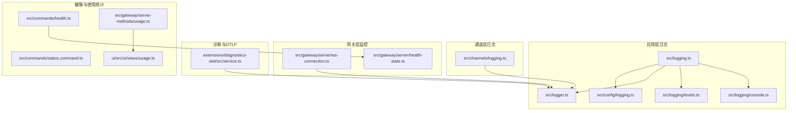
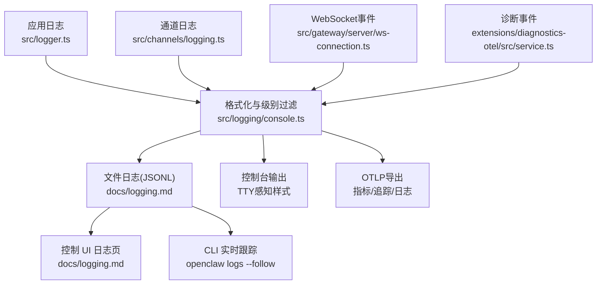
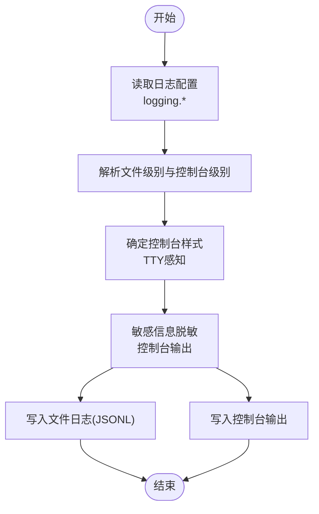
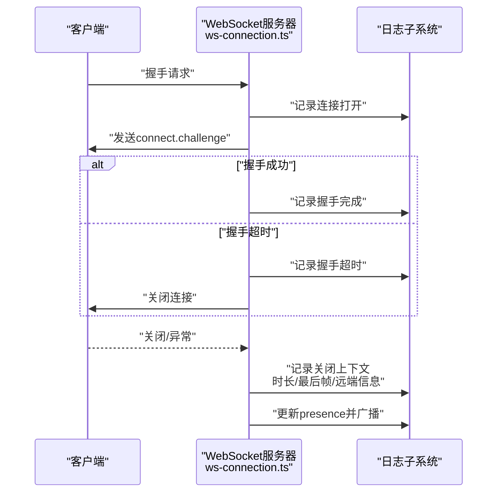
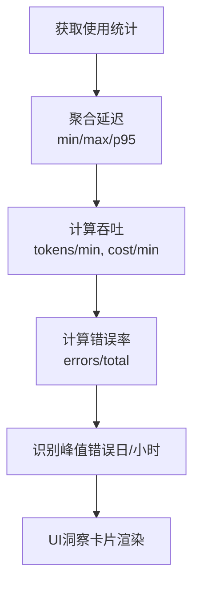
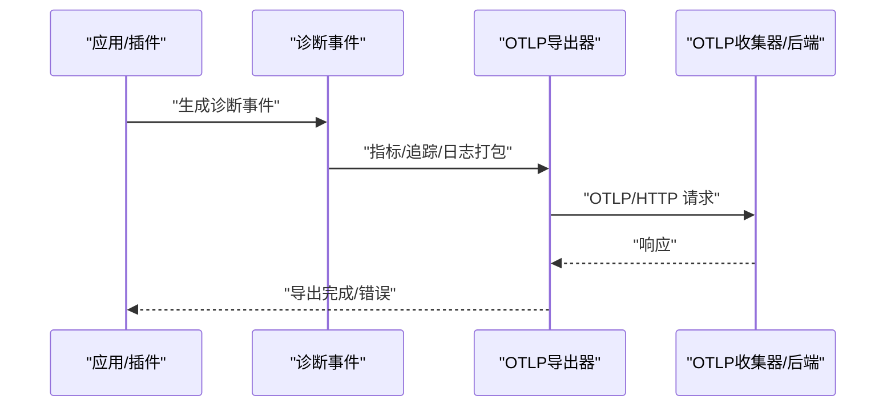
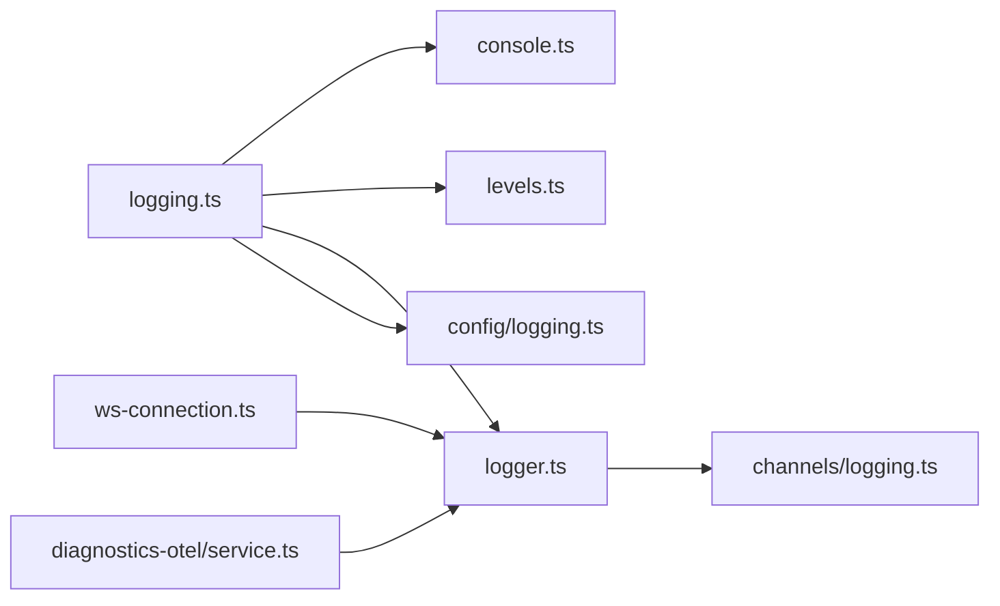

# 监控与日志

<cite>
**本文引用的文件**
- [src/logging.ts](file://src/logging.ts)
- [src/logger.ts](file://src/logger.ts)
- [src/logging/console.ts](file://src/logging/console.ts)
- [src/logging/levels.ts](file://src/logging/levels.ts)
- [src/channels/logging.ts](file://src/channels/logging.ts)
- [src/config/logging.ts](file://src/config/logging.ts)
- [docs/logging.md](file://docs/logging.md)
- [docs/zh-CN/logging.md](file://docs/zh-CN/logging.md)
- [extensions/diagnostics-otel/src/service.ts](file://extensions/diagnostics-otel/src/service.ts)
- [extensions/diagnostics-otel/src/service.test.ts](file://extensions/diagnostics-otel/src/service.test.ts)
- [src/gateway/server/ws-connection.ts](file://src/gateway/server/ws-connection.ts)
- [src/gateway/server/health-state.ts](file://src/gateway/server/health-state.ts)
- [src/commands/health.ts](file://src/commands/health.ts)
- [src/commands/status.command.ts](file://src/commands/status.command.ts)
- [src/gateway/server-methods/usage.ts](file://src/gateway/server-methods/usage.ts)
- [ui/src/ui/views/usage.ts](file://ui/src/ui/views/usage.ts)
- [apps/macos/Tests/OpenClawIPCTests/GatewayChannelConnectTests.swift](file://apps/macos/Tests/OpenClawIPCTests/GatewayChannelConnectTests.swift)
- [apps/macos/Tests/OpenClawIPCTests/GatewayChannelConfigureTests.swift](file://apps/macos/Tests/OpenClawIPCTests/GatewayChannelConfigureTests.swift)
- [apps/macos/Tests/OpenClawIPCTests/GatewayChannelRequestTests.swift](file://apps/macos/Tests/OpenClawIPCTests/GatewayChannelRequestTests.swift)
- [apps/macos/Tests/OpenClawIPCTests/GatewayChannelShutdownTests.swift](file://apps/macos/Tests/OpenClawIPCTests/GatewayChannelShutdownTests.swift)
</cite>

## 目录

1. [简介](#简介)
2. [项目结构](#项目结构)
3. [核心组件](#核心组件)
4. [架构总览](#架构总览)
5. [详细组件分析](#详细组件分析)
6. [依赖关系分析](#依赖关系分析)
7. [性能考量](#性能考量)
8. [故障排查指南](#故障排查指南)
9. [结论](#结论)
10. [附录](#附录)

## 简介

本文件面向OpenClaw项目的监控与日志管理，系统性阐述日志架构、结构化日志格式、日志级别与敏感信息脱敏策略；记录WebSocket连接监控、会话状态跟踪与性能指标采集；提供日志聚合与OTLP导出配置建议；解释健康检查、资源使用与错误率统计；并给出日志分析与故障诊断方法及监控仪表板的关键指标定义。

## 项目结构

OpenClaw的日志与监控涉及多层实现：

- 应用层日志：统一的结构化日志接口与子系统日志封装，支持文件与控制台输出。
- 通道层日志：针对各渠道（如WhatsApp、Telegram等）的消息丢弃、打字状态失败、确认清理失败等场景的专用日志工具。
- 网关层监控：WebSocket连接生命周期、握手超时、关闭原因、帧类型与方法等监控。
- 诊断与OTLP：通过诊断事件导出指标、追踪与日志，支持OTLP/HTTP协议。
- 健康检查与使用统计：健康快照、心跳、会话汇总、每日延迟聚合与UI使用洞察。

**图表来源**

- [src/logging.ts](file://src/logging.ts#L1-L68)
- [src/logging/console.ts](file://src/logging/console.ts#L1-L307)
- [src/logging/levels.ts](file://src/logging/levels.ts#L1-L31)
- [src/logger.ts](file://src/logger.ts#L1-L62)
- [src/config/logging.ts](file://src/config/logging.ts#L1-L19)
- [src/channels/logging.ts](file://src/channels/logging.ts#L1-L34)
- [src/gateway/server/ws-connection.ts](file://src/gateway/server/ws-connection.ts#L1-L267)
- [src/gateway/server/health-state.ts](file://src/gateway/server/health-state.ts#L1-L13)
- [extensions/diagnostics-otel/src/service.ts](file://extensions/diagnostics-otel/src/service.ts#L42-L104)
- [src/commands/health.ts](file://src/commands/health.ts#L385-L412)
- [src/commands/status.command.ts](file://src/commands/status.command.ts#L266-L306)
- [src/gateway/server-methods/usage.ts](file://src/gateway/server-methods/usage.ts#L572-L600)
- [ui/src/ui/views/usage.ts](file://ui/src/ui/views/usage.ts#L589-L1238)

**章节来源**

- [src/logging.ts](file://src/logging.ts#L1-L68)
- [src/logging/console.ts](file://src/logging/console.ts#L1-L307)
- [src/logging/levels.ts](file://src/logging/levels.ts#L1-L31)
- [src/logger.ts](file://src/logger.ts#L1-L62)
- [src/config/logging.ts](file://src/config/logging.ts#L1-L19)
- [src/channels/logging.ts](file://src/channels/logging.ts#L1-L34)
- [src/gateway/server/ws-connection.ts](file://src/gateway/server/ws-connection.ts#L1-L267)
- [src/gateway/server/health-state.ts](file://src/gateway/server/health-state.ts#L1-L13)
- [extensions/diagnostics-otel/src/service.ts](file://extensions/diagnostics-otel/src/service.ts#L42-L104)
- [src/commands/health.ts](file://src/commands/health.ts#L385-L412)
- [src/commands/status.command.ts](file://src/commands/status.command.ts#L266-L306)
- [src/gateway/server-methods/usage.ts](file://src/gateway/server-methods/usage.ts#L572-L600)
- [ui/src/ui/views/usage.ts](file://ui/src/ui/views/usage.ts#L589-L1238)

## 核心组件

- 结构化日志接口与子系统日志
  - 统一入口导出日志能力，提供文件与控制台两路输出，支持子系统前缀、级别与样式控制。
  - 控制台输出可路由至stderr，保证stdout用于RPC/JSON模式。
- 日志级别与控制台样式
  - 支持silent/fatal/error/warn/info/debug/trace级别；TTY感知的pretty/compact/json样式。
- 敏感信息脱敏
  - 控制台输出支持基于工具摘要的敏感令牌脱敏，可通过redactSensitive与redactPatterns配置。
- 通道专用日志
  - 提供消息丢弃、打字失败、确认清理失败等场景的日志工具函数。
- WebSocket连接监控
  - 记录连接打开/关闭、握手状态、最后帧类型/方法、远端地址、X-Forwarded-For、User-Agent等上下文。
- 诊断与OTLP导出
  - 诊断事件支持指标、追踪与日志导出，OTLP/HTTP协议，支持采样与刷新间隔配置。
- 健康检查与使用统计
  - 健康快照聚合代理心跳、会话与默认存储路径；使用统计提供延迟、吞吐、错误率与峰值错误日/小时洞察。

**章节来源**

- [src/logging.ts](file://src/logging.ts#L1-L68)
- [src/logging/console.ts](file://src/logging/console.ts#L1-L307)
- [src/logging/levels.ts](file://src/logging/levels.ts#L1-L31)
- [src/logger.ts](file://src/logger.ts#L1-L62)
- [src/channels/logging.ts](file://src/channels/logging.ts#L1-L34)
- [src/gateway/server/ws-connection.ts](file://src/gateway/server/ws-connection.ts#L61-L216)
- [extensions/diagnostics-otel/src/service.ts](file://extensions/diagnostics-otel/src/service.ts#L42-L104)
- [src/commands/health.ts](file://src/commands/health.ts#L385-L412)
- [src/gateway/server-methods/usage.ts](file://src/gateway/server-methods/usage.ts#L572-L600)
- [ui/src/ui/views/usage.ts](file://ui/src/ui/views/usage.ts#L589-L1238)

## 架构总览

OpenClaw的日志与监控架构分为三层：

- 输入层：应用日志、通道日志、WebSocket事件、诊断事件。
- 处理层：日志格式化、级别过滤、控制台样式与脱敏、OTLP导出准备。
- 输出层：文件日志（JSONL）、控制台输出、OTLP目标（指标/追踪/日志）。

**图表来源**

- [src/logger.ts](file://src/logger.ts#L1-L62)
- [src/channels/logging.ts](file://src/channels/logging.ts#L1-L34)
- [src/gateway/server/ws-connection.ts](file://src/gateway/server/ws-connection.ts#L61-L216)
- [extensions/diagnostics-otel/src/service.ts](file://extensions/diagnostics-otel/src/service.ts#L42-L104)
- [src/logging/console.ts](file://src/logging/console.ts#L1-L307)
- [docs/logging.md](file://docs/logging.md#L1-L351)

## 详细组件分析

### 日志系统与结构化格式

- 结构化日志格式
  - 文件日志采用JSON Lines（JSONL），每行一个结构化对象，便于解析与聚合。
  - 控制台输出支持TTY感知的pretty/compact/json样式，便于人读与机器处理。
- 日志级别与过滤
  - 支持silent/fatal/error/warn/info/debug/trace；文件与控制台级别可独立配置。
  - 控制台在非TTY环境下默认compact样式，在TTY环境下默认pretty样式。
- 敏感信息脱敏
  - 控制台输出支持脱敏策略（off/tools），并允许通过redactPatterns自定义正则。
  - 脱敏不影响文件日志内容。

**图表来源**

- [src/logging/console.ts](file://src/logging/console.ts#L20-L80)
- [src/logging/levels.ts](file://src/logging/levels.ts#L1-L31)
- [docs/logging.md](file://docs/logging.md#L100-L140)

**章节来源**

- [src/logging.ts](file://src/logging.ts#L1-L68)
- [src/logging/console.ts](file://src/logging/console.ts#L1-L307)
- [src/logging/levels.ts](file://src/logging/levels.ts#L1-L31)
- [src/logger.ts](file://src/logger.ts#L1-L62)
- [docs/logging.md](file://docs/logging.md#L100-L140)

### WebSocket连接监控与会话状态跟踪

- 连接生命周期
  - 记录连接打开、握手阶段（pending/connected/failed）、关闭原因与上下文（远端地址、X-Forwarded-For、User-Agent、最后帧类型/方法、时长等）。
- 握手与异常
  - 握手超时触发失败状态并记录耗时；异常错误进行格式化记录。
- 会话状态广播
  - 断开连接时更新系统在线状态版本并广播presence/health变更。

**图表来源**

- [src/gateway/server/ws-connection.ts](file://src/gateway/server/ws-connection.ts#L61-L216)

**章节来源**

- [src/gateway/server/ws-connection.ts](file://src/gateway/server/ws-connection.ts#L61-L216)
- [apps/macos/Tests/OpenClawIPCTests/GatewayChannelConnectTests.swift](file://apps/macos/Tests/OpenClawIPCTests/GatewayChannelConnectTests.swift#L72-L107)
- [apps/macos/Tests/OpenClawIPCTests/GatewayChannelConfigureTests.swift](file://apps/macos/Tests/OpenClawIPCTests/GatewayChannelConfigureTests.swift#L92-L132)
- [apps/macos/Tests/OpenClawIPCTests/GatewayChannelRequestTests.swift](file://apps/macos/Tests/OpenClawIPCTests/GatewayChannelRequestTests.swift#L70-L106)
- [apps/macos/Tests/OpenClawIPCTests/GatewayChannelShutdownTests.swift](file://apps/macos/Tests/OpenClawIPCTests/GatewayChannelShutdownTests.swift#L66-L96)

### 性能指标与使用统计

- 使用统计与洞察
  - 提供会话时长、吞吐（tokens/min、cost/min）、错误率、峰值错误日/小时等指标。
  - 支持按天聚合延迟（min/max/p95）与按类型拆分的图表展示。
- 健康检查与心跳
  - 健康快照聚合代理心跳周期、会话数量与默认存储路径；状态命令支持深探针显示最近心跳信息。

**图表来源**

- [src/gateway/server-methods/usage.ts](file://src/gateway/server-methods/usage.ts#L572-L600)
- [ui/src/ui/views/usage.ts](file://ui/src/ui/views/usage.ts#L589-L1238)

**章节来源**

- [src/gateway/server-methods/usage.ts](file://src/gateway/server-methods/usage.ts#L572-L600)
- [ui/src/ui/views/usage.ts](file://ui/src/ui/views/usage.ts#L589-L1238)
- [src/commands/health.ts](file://src/commands/health.ts#L385-L412)
- [src/commands/status.command.ts](file://src/commands/status.command.ts#L266-L306)

### 诊断事件与OTLP导出

- 诊断事件类型
  - 模型使用：tokens、cost、duration、context、provider/model/channel、session标识。
  - 消息流：webhook接收/处理/错误、消息入队/处理、处理时长。
  - 队列与会话：队列深度/等待、会话状态转换/卡住、运行尝试、心跳聚合。
- OTLP导出
  - 支持OTLP/HTTP（protobuf），可分别开关traces/metrics/logs。
  - 支持服务名、采样率、刷新间隔、头部认证、协议选择与端点自动路径推断。
  - OTLP日志与文件日志共享结构化记录，尊重文件日志级别，控制台脱敏不应用于OTLP。

**图表来源**

- [extensions/diagnostics-otel/src/service.ts](file://extensions/diagnostics-otel/src/service.ts#L42-L104)
- [docs/logging.md](file://docs/logging.md#L140-L351)

**章节来源**

- [extensions/diagnostics-otel/src/service.ts](file://extensions/diagnostics-otel/src/service.ts#L42-L104)
- [extensions/diagnostics-otel/src/service.test.ts](file://extensions/diagnostics-otel/src/service.test.ts#L1-L130)
- [docs/logging.md](file://docs/logging.md#L140-L351)

## 依赖关系分析

- 日志模块内部耦合
  - logging.ts作为统一入口，组合console、levels、logger、config/logging等模块。
  - logger.ts依赖子系统日志创建与运行时环境，负责消息分发。
  - channels/logging.ts依赖logger.ts提供的日志函数，形成通道专用日志工具。
- 网关与监控
  - ws-connection.ts依赖日志子系统记录连接与关闭上下文，并在断开时更新系统在线状态。
- 诊断与导出
  - diagnostics-otel通过registerLogTransport接入日志流，结合OTLP导出器实现指标/追踪/日志导出。

**图表来源**

- [src/logging.ts](file://src/logging.ts#L1-L68)
- [src/logging/console.ts](file://src/logging/console.ts#L1-L307)
- [src/logging/levels.ts](file://src/logging/levels.ts#L1-L31)
- [src/logger.ts](file://src/logger.ts#L1-L62)
- [src/config/logging.ts](file://src/config/logging.ts#L1-L19)
- [src/channels/logging.ts](file://src/channels/logging.ts#L1-L34)
- [src/gateway/server/ws-connection.ts](file://src/gateway/server/ws-connection.ts#L1-L267)
- [extensions/diagnostics-otel/src/service.ts](file://extensions/diagnostics-otel/src/service.ts#L42-L104)

**章节来源**

- [src/logging.ts](file://src/logging.ts#L1-L68)
- [src/logger.ts](file://src/logger.ts#L1-L62)
- [src/channels/logging.ts](file://src/channels/logging.ts#L1-L34)
- [src/gateway/server/ws-connection.ts](file://src/gateway/server/ws-connection.ts#L1-L267)
- [extensions/diagnostics-otel/src/service.ts](file://extensions/diagnostics-otel/src/service.ts#L42-L104)

## 性能考量

- 日志级别与控制台样式
  - 在高负载场景下，建议将文件日志级别设为info或更高，避免debug/trace带来的I/O压力。
  - 控制台默认TTY感知样式，非TTY（如管道/JSON模式）使用compact以减少冗余输出。
- OTLP导出
  - 启用OTLP导出时，合理设置采样率与刷新间隔，避免高流量环境下的网络与存储压力。
  - 使用OTLP收集器的采样/过滤功能进一步降低下游负载。
- WebSocket连接
  - 监控握手超时与连接时长分布，识别异常客户端或网络问题。
  - 结合presence/health广播频率与dropIfSlow策略，平衡实时性与系统负载。

[本节为通用指导，无需列出具体文件来源]

## 故障排查指南

- 日志可读性与定位
  - 使用CLI实时跟踪：openclaw logs --follow；支持TTY美化、JSON模式与plain/no-color选项。
  - 控制 UI 的 Logs 标签页同样基于RPC尾随文件日志。
- 健康检查与状态
  - 使用openclaw health/status命令查看心跳、会话与默认存储路径；深探针模式显示最近心跳信息。
- 通道日志
  - 使用openclaw channels logs --channel <channel>过滤特定渠道活动。
- 常见问题
  - 网关不可达：先执行openclaw doctor进行诊断。
  - 日志为空：确认Gateway正在运行且写入logging.file指定路径。
  - 需要更详细日志：将logging.level提升至debug或trace并重试。

**章节来源**

- [docs/logging.md](file://docs/logging.md#L345-L351)
- [src/commands/status.command.ts](file://src/commands/status.command.ts#L266-L306)
- [src/commands/health.ts](file://src/commands/health.ts#L385-L412)

## 结论

OpenClaw提供了完善的日志与监控体系：统一的结构化日志接口、灵活的级别与样式控制、敏感信息脱敏、通道专用日志、WebSocket连接与会话状态监控、OTLP导出与健康检查/使用统计。通过合理的配置与导出策略，可在保障可观测性的前提下控制资源消耗，并借助UI与CLI快速定位问题。

[本节为总结性内容，无需列出具体文件来源]

## 附录

### 日志聚合与OTLP集成建议

- ELK/类似方案
  - 将文件日志(JSONL)导入ELK；利用控制台json模式或CLI --json输出对接Logstash/Fluent等采集器。
  - 在OTLP启用场景下，优先通过OTLP收集器进行采样/过滤后再写入下游存储，降低存储与查询压力。
- OTLP配置要点
  - 协议：http/protobuf；端点支持OTEL_EXPORTER_OTLP_ENDPOINT环境变量覆盖。
  - 服务名：OTEL_SERVICE_NAME或diagnostics.otel.serviceName。
  - 采样率：diagnostics.otel.sampleRate（0.0–1.0）。
  - 刷新间隔：diagnostics.otel.flushIntervalMs（≥1000ms）。
  - 认证头：headers（如collector需要鉴权）。

**章节来源**

- [docs/logging.md](file://docs/logging.md#L222-L265)
- [extensions/diagnostics-otel/src/service.ts](file://extensions/diagnostics-otel/src/service.ts#L42-L104)

### 告警规则与阈值

- 建议阈值示例（可根据业务调整）
  - 错误率：消息处理错误率超过基准值的2倍（如>5%）持续5分钟。
  - 延迟：p95消息处理时延超过基准值的3倍（如>30s）持续10分钟。
  - Webhook错误：单渠道单小时错误次数超过阈值（如>10次）。
  - 会话卡住：会话stuck计数在10分钟内增长超过阈值（如>5个）。
  - 连接异常：握手超时占比超过基准值的2倍（如>2%）。
- 通知机制
  - 通过OTLP收集器或外部告警系统订阅指标/日志事件，配置邮件/IM通知通道。

[本节为通用指导，无需列出具体文件来源]

### 监控仪表板关键指标定义

- 指标清单
  - 模型使用：openclaw.tokens、openclaw.cost.usd、openclaw.run.duration_ms、openclaw.context.tokens。
  - 消息流：openclaw.webhook.received、openclaw.webhook.error、openclaw.webhook.duration_ms、openclaw.message.queued、openclaw.message.processed、openclaw.message.duration_ms。
  - 队列与会话：openclaw.queue.lane.enqueue、openclaw.queue.lane.dequeue、openclaw.queue.depth、openclaw.queue.wait_ms、openclaw.session.state、openclaw.session.stuck、openclaw.session.stuck_age_ms、openclaw.run.attempt。
- UI洞察
  - 使用统计页面提供每日token/cost使用、峰值错误日/小时、Top模型/Provider/Tools/Agents/Channels等可视化卡片。

**章节来源**

- [docs/logging.md](file://docs/logging.md#L266-L324)
- [ui/src/ui/views/usage.ts](file://ui/src/ui/views/usage.ts#L589-L1238)
