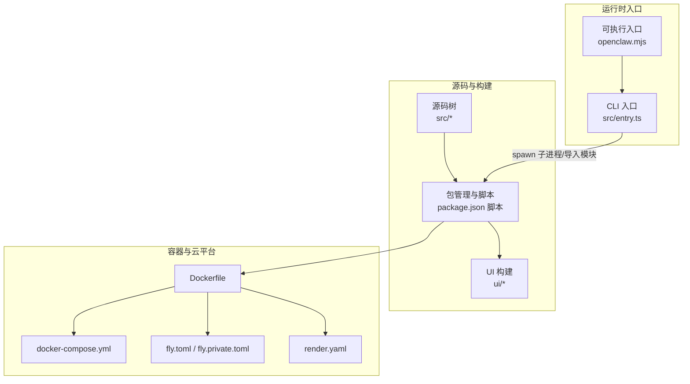
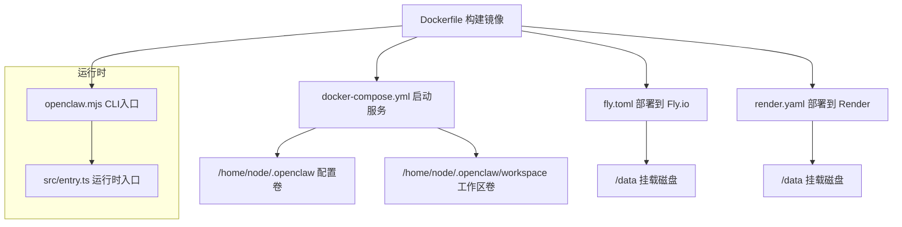
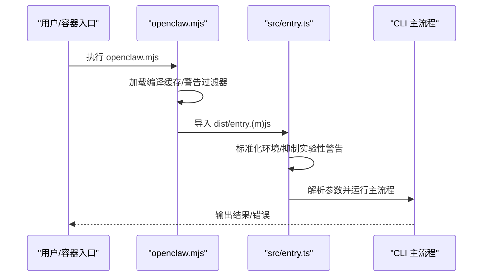
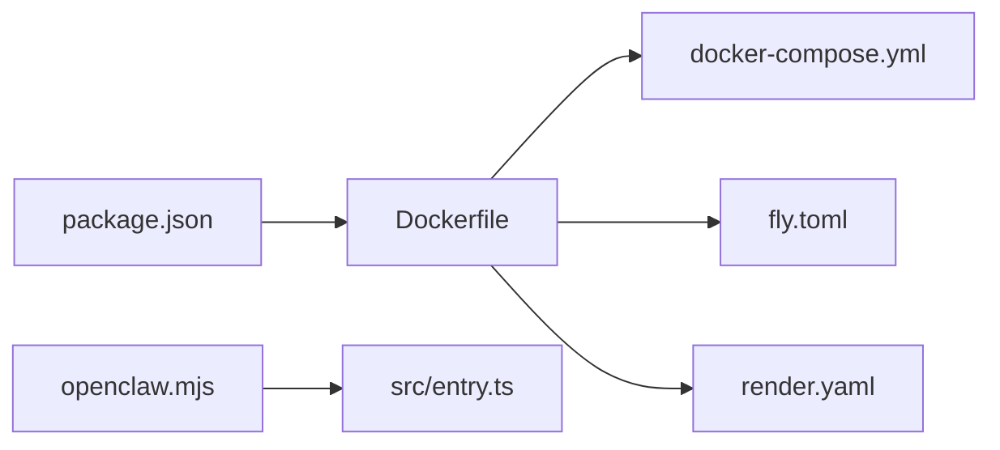

# 部署运维

<cite>
**本文引用的文件**
- [Dockerfile](file://Dockerfile)
- [docker-compose.yml](file://docker-compose.yml)
- [fly.toml](file://fly.toml)
- [fly.private.toml](file://fly.private.toml)
- [render.yaml](file://render.yaml)
- [package.json](file://package.json)
- [openclaw.mjs](file://openclaw.mjs)
- [src/entry.ts](file://src/entry.ts)
- [scripts/systemd/openclaw-auth-monitor.service](file://scripts/systemd/openclaw-auth-monitor.service)
- [scripts/systemd/openclaw-auth-monitor.timer](file://scripts/systemd/openclaw-auth-monitor.timer)
- [scripts/auth-monitor.sh](file://scripts/auth-monitor.sh)
- [scripts/clawlog.sh](file://scripts/clawlog.sh)
- [docs/install/docker.md](file://docs/install/docker.md)
- [docs/install/fly.md](file://docs/install/fly.md)
- [docs/install/northflank.mdx](file://docs/install/northflank.mdx)
- [docs/install/railway.mdx](file://docs/install/railway.mdx)
- [docs/install/render.mdx](file://docs/install/render.mdx)
- [docs/install/gcp.md](file://docs/install/gcp.md)
- [docs/install/hetzner.md](file://docs/install/hetzner.md)
- [docs/install/digitalocean.md](file://docs/install/digitalocean.md)
- [docs/install/windows.md](file://docs/install/windows.md)
- [docs/install/linux.md](file://docs/install/linux.md)
- [docs/install/macos.md](file://docs/install/macos.md)
- [docs/install/ansible.md](file://docs/install/ansible.md)
- [docs/install/nix.md](file://docs/install/nix.md)
- [docs/install/uninstall.md](file://docs/install/uninstall.md)
- [docs/install/updating.md](file://docs/install/updating.md)
- [docs/gateway/configuration.md](file://docs/gateway/configuration.md)
- [docs/gateway/configuration-reference.md](file://docs/gateway/configuration-reference.md)
- [docs/gateway/logging.md](file://docs/gateway/logging.md)
- [docs/gateway/heartbeat.md](file://docs/gateway/heartbeat.md)
- [docs/gateway/troubleshooting.md](file://docs/gateway/troubleshooting.md)
- [docs/cli/logs.md](file://docs/cli/logs.md)
- [docs/automation/troubleshooting.md](file://docs/automation/troubleshooting.md)
- [docs/help/troubleshooting.md](file://docs/help/troubleshooting.md)
- [docs/refactor/strict-config.md](file://docs/refactor/strict-config.md)
- [docs/security/README.md](file://docs/security/README.md)
- [docs/security/CONTRIBUTING-THREAT-MODEL.md](file://docs/security/CONTRIBUTING-THREAT-MODEL.md)
- [docs/security/THREAT-MODEL-ATLAS.md](file://docs/security/THREAT-MODEL-ATLAS.md)
- [docs/security/formal-verification.md](file://docs/security/formal-verification.md)
- [docs/platforms/linux.md](file://docs/platforms/linux.md)
- [docs/platforms/macos.md](file://docs/platforms/macos.md)
- [docs/platforms/windows.md](file://docs/platforms/windows.md)
- [docs/platforms/raspberry-pi.md](file://docs/platforms/raspberry-pi.md)
- [docs/platforms/digitalocean.md](file://docs/platforms/digitalocean.md)
- [docs/platforms/hetzner.md](file://docs/platforms/hetzner.md)
- [docs/platforms/oracle.md](file://docs/platforms/oracle.md)
- [docs/platforms/northflank.mdx](file://docs/platforms/northflank.mdx)
- [docs/platforms/railway.mdx](file://docs/platforms/railway.mdx)
- [docs/platforms/render.mdx](file://docs/platforms/render.mdx)
- [docs/platforms/gcp.md](file://docs/platforms/gcp.md)
- [docs/concepts/architecture.md](file://docs/concepts/architecture.md)
- [docs/concepts/features.md](file://docs/concepts/features.md)
- [docs/concepts/model-providers.md](file://docs/concepts/model-providers.md)
- [docs/concepts/session.md](file://docs/concepts/session.md)
- [docs/concepts/memory.md](file://docs/concepts/memory.md)
- [docs/concepts/queue.md](file://docs/concepts/queue.md)
- [docs/concepts/typing-indicators.md](file://docs/concepts/typing-indicators.md)
- [docs/concepts/streaming.md](file://docs/concepts/streaming.md)
- [docs/concepts/compaction.md](file://docs/concepts/compaction.md)
- [docs/concepts/session-pruning.md](file://docs/concepts/session-pruning.md)
- [docs/concepts/model-failover.md](file://docs/concepts/model-failover.md)
- [docs/concepts/usage-tracking.md](file://docs/concepts/usage-tracking.md)
- [docs/concepts/oauth.md](file://docs/concepts/oauth.md)
- [docs/concepts/presence.md](file://docs/concepts/presence.md)
- [docs/concepts/retry.md](file://docs/concepts/retry.md)
- [docs/concepts/session-tool.md](file://docs/concepts/session-tool.md)
- [docs/concepts/agent-workspace.md](file://docs/concepts/agent-workspace.md)
- [docs/concepts/agent-loop.md](file://docs/concepts/agent-loop.md)
- [docs/concepts/agent.md](file://docs/concepts/agent.md)
- [docs/concepts/context.md](file://docs/concepts/context.md)
- [docs/concepts/markdown-formatting.md](file://docs/concepts/markdown-formatting.md)
- [docs/concepts/messages.md](file://docs/concepts/messages.md)
- [docs/concepts/typebox.md](file://docs/concepts/typebox.md)
- [docs/concepts/timezone.md](file://docs/concepts/timezone.md)
- [docs/concepts/system-prompt.md](file://docs/concepts/system-prompt.md)
- [docs/concepts/models.md](file://docs/concepts/models.md)
- [docs/concepts/multi-agent.md](file://docs/concepts/multi-agent.md)
- [docs/concepts/network-model.md](file://docs/concepts/network-model.md)
- [docs/concepts/cross-session-memory-sync.md](file://docs/concepts/cross-session-memory-sync.md)
- [docs/concepts/pty-exec-opt.md](file://docs/concepts/pty-exec-opt.md)
- [docs/design/cross-session-memory-sync.md](file://docs/design/cross-session-memory-sync.md)
- [docs/design/pty-exec-opt.md](file://docs/design/pty-exec-opt.md)
- [docs/debug/node-issue.md](file://docs/debug/node-issue.md)
- [docs/diagnostics/flags.md](file://docs/diagnostics/flags.md)
- [docs/experiments/onboarding-config-protocol.md](file://docs/experiments/onboarding-config-protocol.md)
- [docs/experiments/plans/...](file://docs/experiments/plans/)
- [docs/experiments/proposals/...](file://docs/experiments/proposals/)
- [docs/experiments/research/...](file://docs/experiments/research/)
- [docs/gateway/security/...](file://docs/gateway/security/)
- [docs/gateway/authentication.md](file://docs/gateway/authentication.md)
- [docs/gateway/background-process.md](file://docs/gateway/background-process.md)
- [docs/gateway/bonjour.md](file://docs/gateway/bonjour.md)
- [docs/gateway/bridge-protocol.md](file://docs/gateway/bridge-protocol.md)
- [docs/gateway/cli-backends.md](file://docs/gateway/cli-backends.md)
- [docs/gateway/configuration-examples.md](file://docs/gateway/configuration-examples.md)
- [docs/gateway/configuration-reference.md](file://docs/gateway/configuration-reference.md)
- [docs/gateway/configuration.md](file://docs/gateway/configuration.md)
- [docs/gateway/discovery.md](file://docs/gateway/discovery.md)
- [docs/gateway/doctor.md](file://docs/gateway/doctor.md)
- [docs/gateway/gateway-lock.md](file://docs/gateway/gateway-lock.md)
- [docs/gateway/health.md](file://docs/gateway/health.md)
- [docs/gateway/heartbeat.md](file://docs/gateway/heartbeat.md)
- [docs/gateway/index.md](file://docs/gateway/index.md)
- [docs/gateway/local-models.md](file://docs/gateway/local-models.md)
- [docs/gateway/logging.md](file://docs/gateway/logging.md)
- [docs/gateway/multiple-gateways.md](file://docs/gateway/multiple-gateways.md)
- [docs/gateway/network-model.md](file://docs/gateway/network-model.md)
- [docs/gateway/openai-http-api.md](file://docs/gateway/openai-http-api.md)
- [docs/gateway/openresponses-http-api.md](file://docs/gateway/openresponses-http-api.md)
- [docs/gateway/pairing.md](file://docs/gateway/pairing.md)
- [docs/gateway/protocol.md](file://docs/gateway/protocol.md)
- [docs/gateway/remote-gateway-readme.md](file://docs/gateway/remote-gateway-readme.md)
- [docs/gateway/remote.md](file://docs/gateway/remote.md)
- [docs/gateway/sandbox-vs-tool-policy-vs-elevated.md](file://docs/gateway/sandbox-vs-tool-policy-vs-elevated.md)
- [docs/gateway/sandboxing.md](file://docs/gateway/sandboxing.md)
- [docs/gateway/tailscale.md](file://docs/gateway/tailscale.md)
- [docs/gateway/tools-invoke-http-api.md](file://docs/gateway/tools-invoke-http-api.md)
- [docs/gateway/troubleshooting.md](file://docs/gateway/troubleshooting.md)
- [docs/gateway/doctor.md](file://docs/gateway/doctor.md)
- [docs/gateway/heartbeat.md](file://docs/gateway/heartbeat.md)
- [docs/gateway/health.md](file://docs/gateway/health.md)
- [docs/gateway/logging.md](file://docs/gateway/logging.md)
- [docs/gateway/troubleshooting.md](file://docs/gateway/troubleshooting.md)
- [docs/gateway/doctor.md](file://docs/gateway/doctor.md)
- [docs/gateway/heartbeat.md](file://docs/gateway/heartbeat.md)
- [docs/gateway/health.md](file://docs/gateway/health.md)
- [docs/gateway/logging.md](file://docs/gateway/logging.md)
- [docs/gateway/troubleshooting.md](file://docs/gateway/troubleshooting.md)
</cite>

## 目录

1. [简介](#简介)
2. [项目结构](#项目结构)
3. [核心组件](#核心组件)
4. [架构总览](#架构总览)
5. [详细组件分析](#详细组件分析)
6. [依赖关系分析](#依赖关系分析)
7. [性能考量](#性能考量)
8. [故障排除指南](#故障排除指南)
9. [结论](#结论)
10. [附录](#附录)

## 简介

本文件面向运维与平台工程团队，提供OpenClaw在生产环境中的部署与运维指南。内容覆盖容器化与编排（Docker、Compose、Fly、Render等）、云平台部署、监控与日志、备份与恢复、高可用与灾难恢复、安全加固与合规、以及自动化脚本与最佳实践。文档以仓库内现有配置与文档为基础，结合代码入口与运行时行为进行说明。

## 项目结构

OpenClaw采用多语言混合架构：Node.js作为主运行时，构建产物位于dist目录；前端UI通过独立包管理器构建并打包到最终镜像中；CLI入口负责解析参数并启动子系统。容器化与云平台部署主要通过Dockerfile、docker-compose.yml、fly.toml、render.yaml等配置文件完成。

图表来源

- [Dockerfile](file://Dockerfile#L1-L49)
- [docker-compose.yml](file://docker-compose.yml#L1-L47)
- [fly.toml](file://fly.toml#L1-L35)
- [render.yaml](file://render.yaml#L1-L22)
- [openclaw.mjs](file://openclaw.mjs#L1-L57)
- [src/entry.ts](file://src/entry.ts#L1-L172)

章节来源

- [Dockerfile](file://Dockerfile#L1-L49)
- [docker-compose.yml](file://docker-compose.yml#L1-L47)
- [fly.toml](file://fly.toml#L1-L35)
- [render.yaml](file://render.yaml#L1-L22)
- [openclaw.mjs](file://openclaw.mjs#L1-L57)
- [src/entry.ts](file://src/entry.ts#L1-L172)

## 核心组件

- 容器镜像与构建
  - 基于官方Node镜像，启用Bun与Corepack，安装可选APT包，使用pnpm进行依赖与构建，最终以非root用户运行。
  - 支持通过环境变量控制绑定地址、端口与令牌，便于外部健康检查或安全访问。
- Compose服务
  - 提供网关与CLI两个服务，挂载配置与工作区目录，映射端口，支持init与重启策略。
- 云平台配置
  - Fly.io：定义HTTP服务、VM规格、磁盘挂载、进程命令行参数。
  - Render：定义Web服务、健康检查路径、环境变量与持久化磁盘。
- CLI入口与运行时
  - 可执行入口负责加载编译缓存、过滤警告、定位dist入口并启动。
  - 运行时入口负责环境标准化、实验性警告抑制、Windows参数规范化、调用CLI主流程。

章节来源

- [Dockerfile](file://Dockerfile#L1-L49)
- [docker-compose.yml](file://docker-compose.yml#L1-L47)
- [fly.toml](file://fly.toml#L1-L35)
- [render.yaml](file://render.yaml#L1-L22)
- [openclaw.mjs](file://openclaw.mjs#L1-L57)
- [src/entry.ts](file://src/entry.ts#L1-L172)

## 架构总览

下图展示从容器到云平台的部署路径，以及关键配置点与数据持久化位置。

图表来源

- [Dockerfile](file://Dockerfile#L1-L49)
- [docker-compose.yml](file://docker-compose.yml#L1-L47)
- [fly.toml](file://fly.toml#L1-L35)
- [render.yaml](file://render.yaml#L1-L22)
- [openclaw.mjs](file://openclaw.mjs#L1-L57)
- [src/entry.ts](file://src/entry.ts#L1-L172)

## 详细组件分析

### 容器化与镜像构建

- 基础镜像与工具链
  - 使用Node 22 Debian镜像，安装Bun并启用Corepack，满足构建脚本与包管理需求。
  - 可通过构建参数注入APT软件包，适配特定硬件或依赖。
- 依赖与构建
  - 使用pnpm锁定版本并构建，UI构建强制使用pnpm以规避ARM/Synology兼容问题。
- 运行时安全
  - 将工作目录归属给node用户，并以非root用户运行，降低逃逸风险。
- 默认启动
  - 默认绑定回环地址，可通过环境变量与命令行参数调整绑定与认证方式。

章节来源

- [Dockerfile](file://Dockerfile#L1-L49)

### Compose编排

- 服务角色
  - openclaw-gateway：运行网关服务，暴露网关与桥接端口，挂载配置与工作区。
  - openclaw-cli：交互式CLI容器，挂载相同卷，stdin与tty开启以便调试。
- 环境变量
  - 支持令牌、会话密钥、Cookie等敏感信息注入，HOME与TERM标准化。
- 命令行参数
  - 网关服务默认以lan模式绑定，可通过环境变量覆盖。

章节来源

- [docker-compose.yml](file://docker-compose.yml#L1-L47)

### Fly.io部署

- 应用与区域
  - 定义应用名与主区域，使用Dockerfile构建。
- 进程与内存
  - 设置Node内存上限，VM规格为共享CPU双核与2GB内存。
- HTTP服务
  - 内部端口3000，强制HTTPS，保持机器运行以维持长连接。
- 挂载
  - 挂载名为openclaw_data的持久卷至/data目录。

章节来源

- [fly.toml](file://fly.toml#L1-L35)

### Render部署

- Web服务类型与计划
  - Docker运行时，starter计划，健康检查路径为/health。
- 环境变量
  - 绑定PORT、状态目录、工作区目录、自动生成网关令牌。
- 磁盘
  - 名为openclaw-data的持久磁盘，挂载至/data，容量1GB。

章节来源

- [render.yaml](file://render.yaml#L1-L22)

### CLI入口与运行时

- CLI入口
  - 可执行脚本openclaw.mjs负责加载编译缓存、安装警告过滤器、尝试导入dist入口。
- 运行时入口
  - src/entry.ts负责环境标准化、实验性警告抑制、Windows参数规范化、调用CLI主流程。

图表来源

- [openclaw.mjs](file://openclaw.mjs#L1-L57)
- [src/entry.ts](file://src/entry.ts#L1-L172)

章节来源

- [openclaw.mjs](file://openclaw.mjs#L1-L57)
- [src/entry.ts](file://src/entry.ts#L1-L172)

### systemd定时任务与认证监控

- 服务单元
  - openclaw-auth-monitor.service：定义认证监控服务。
  - openclaw-auth-monitor.timer：定义定时触发周期。
- 辅助脚本
  - scripts/auth-monitor.sh：执行认证状态检查与日志输出。
- 日志辅助
  - scripts/clawlog.sh：封装日志收集与查看逻辑。

章节来源

- [scripts/systemd/openclaw-auth-monitor.service](file://scripts/systemd/openclaw-auth-monitor.service)
- [scripts/systemd/openclaw-auth-monitor.timer](file://scripts/systemd/openclaw-auth-monitor.timer)
- [scripts/auth-monitor.sh](file://scripts/auth-monitor.sh)
- [scripts/clawlog.sh](file://scripts/clawlog.sh)

## 依赖关系分析

- 构建与运行时依赖
  - Node版本要求与包管理器版本在package.json中声明，确保跨平台一致性。
- 容器与云平台配置耦合
  - Dockerfile与各平台配置文件共同决定镜像、端口、内存、挂载与进程参数。
- CLI与运行时入口耦合
  - openclaw.mjs与src/entry.ts形成入口链路，确保环境与参数正确传递。

图表来源

- [package.json](file://package.json#L1-L219)
- [Dockerfile](file://Dockerfile#L1-L49)
- [docker-compose.yml](file://docker-compose.yml#L1-L47)
- [fly.toml](file://fly.toml#L1-L35)
- [render.yaml](file://render.yaml#L1-L22)
- [openclaw.mjs](file://openclaw.mjs#L1-L57)
- [src/entry.ts](file://src/entry.ts#L1-L172)

章节来源

- [package.json](file://package.json#L1-L219)
- [Dockerfile](file://Dockerfile#L1-L49)
- [docker-compose.yml](file://docker-compose.yml#L1-L47)
- [fly.toml](file://fly.toml#L1-L35)
- [render.yaml](file://render.yaml#L1-L22)
- [openclaw.mjs](file://openclaw.mjs#L1-L57)
- [src/entry.ts](file://src/entry.ts#L1-L172)

## 性能考量

- 内存限制
  - Fly.io通过NODE_OPTIONS设置堆大小，避免内存溢出导致的不稳定。
- 包管理器选择
  - UI构建强制使用pnpm，提升构建稳定性与速度。
- 编译缓存与警告过滤
  - CLI入口启用编译缓存与警告过滤，减少启动开销与噪音。
- 端口与绑定
  - 默认回环绑定，必要时通过环境变量与命令行切换为lan，平衡安全性与可达性。

章节来源

- [fly.toml](file://fly.toml#L10-L16)
- [Dockerfile](file://Dockerfile#L28-L30)
- [openclaw.mjs](file://openclaw.mjs#L5-L12)
- [Dockerfile](file://Dockerfile#L42-L48)

## 故障排除指南

- 常见问题定位
  - 使用CLI日志文档与脚本辅助定位问题。
  - 参考网关健康、心跳、诊断与故障排除文档。
- systemd服务
  - 检查认证监控服务与定时器状态，确认日志输出。
- 平台特定
  - Fly.io与Render均提供健康检查路径与挂载卷，确认状态目录与工作区挂载是否正确。

章节来源

- [docs/cli/logs.md](file://docs/cli/logs.md)
- [docs/gateway/health.md](file://docs/gateway/health.md)
- [docs/gateway/heartbeat.md](file://docs/gateway/heartbeat.md)
- [docs/gateway/troubleshooting.md](file://docs/gateway/troubleshooting.md)
- [docs/automation/troubleshooting.md](file://docs/automation/troubleshooting.md)
- [docs/help/troubleshooting.md](file://docs/help/troubleshooting.md)
- [scripts/systemd/openclaw-auth-monitor.service](file://scripts/systemd/openclaw-auth-monitor.service)
- [scripts/systemd/openclaw-auth-monitor.timer](file://scripts/systemd/openclaw-auth-monitor.timer)

## 结论

本指南基于仓库内的容器与云平台配置、CLI入口与运行时设计，给出了生产部署与运维的关键步骤与注意事项。建议在正式环境中结合平台文档与本指南，完善安全加固、监控告警与备份恢复策略，并通过自动化脚本与CI流程保障持续交付质量。

## 附录

### 生产环境部署要点

- 安全基线
  - 使用非root用户运行容器，最小权限原则。
  - 通过环境变量与命令行参数控制绑定与认证，避免公网暴露。
- 数据持久化
  - 明确配置目录与工作区目录的挂载与备份策略。
- 监控与日志
  - 利用平台健康检查与日志脚本，建立统一的日志采集与告警机制。
- 备份与恢复
  - 对状态目录与工作区定期快照，验证恢复流程。

章节来源

- [Dockerfile](file://Dockerfile#L34-L40)
- [docker-compose.yml](file://docker-compose.yml#L11-L18)
- [fly.toml](file://fly.toml#L32-L35)
- [render.yaml](file://render.yaml#L18-L22)
- [scripts/clawlog.sh](file://scripts/clawlog.sh)

### 容器化部署与编排

- Dockerfile
  - 基础镜像、APT包注入、pnpm安装与UI构建、非root运行与默认命令。
- docker-compose
  - 网关与CLI服务定义、环境变量、卷挂载与端口映射。
- 平台配置
  - Fly.io与Render分别定义HTTP服务、进程参数、内存与磁盘挂载。

章节来源

- [Dockerfile](file://Dockerfile#L1-L49)
- [docker-compose.yml](file://docker-compose.yml#L1-L47)
- [fly.toml](file://fly.toml#L1-L35)
- [render.yaml](file://render.yaml#L1-L22)

### 云平台部署指南

- Fly.io
  - 使用fly.toml进行构建与部署，注意私有部署配置（无公共入口）。
- Render
  - 使用render.yaml定义Web服务、健康检查与磁盘挂载。
- 其他平台
  - 参考对应平台文档，遵循相同的镜像、端口、挂载与进程参数约定。

章节来源

- [fly.toml](file://fly.toml#L1-L35)
- [fly.private.toml](file://fly.private.toml#L1-L40)
- [render.yaml](file://render.yaml#L1-L22)
- [docs/install/fly.md](file://docs/install/fly.md)
- [docs/install/render.mdx](file://docs/install/render.mdx)
- [docs/platforms/fly.md](file://docs/platforms/fly.md)
- [docs/platforms/render.mdx](file://docs/platforms/render.mdx)

### 监控与日志管理

- 平台健康检查
  - Render健康检查路径为/health；Fly.io通过进程参数与挂载保证服务可用。
- 日志采集
  - 使用scripts/clawlog.sh与CLI日志文档进行日志收集与分析。
- 告警建议
  - 基于平台健康检查与日志关键字建立告警规则，关注异常退出、内存不足与认证失败。

章节来源

- [render.yaml](file://render.yaml#L6)
- [fly.toml](file://fly.toml#L20-L26)
- [scripts/clawlog.sh](file://scripts/clawlog.sh)
- [docs/cli/logs.md](file://docs/cli/logs.md)

### 备份与恢复策略

- 卷与目录
  - 确认配置目录与工作区目录的挂载位置，制定定期快照策略。
- 磁盘挂载
  - Fly.io与Render均提供持久卷挂载，确保数据不随实例销毁而丢失。
- 恢复演练
  - 在隔离环境中验证快照恢复流程，确保业务连续性。

章节来源

- [docker-compose.yml](file://docker-compose.yml#L11-L18)
- [fly.toml](file://fly.toml#L32-L35)
- [render.yaml](file://render.yaml#L18-L22)

### 高可用与灾难恢复

- 多实例与长连接
  - Fly.io保持机器运行以维持长连接，适合需要持久会话的场景。
- 私有部署
  - 使用fly.private.toml隐藏公网入口，通过隧道或代理访问，降低扫描风险。
- 灾难恢复
  - 建立跨区域镜像与数据同步策略，验证恢复时间目标与恢复点目标。

章节来源

- [fly.toml](file://fly.toml#L23-L26)
- [fly.private.toml](file://fly.private.toml#L27-L31)

### 安全考虑与合规

- 安全文档
  - 参考安全与威胁模型文档，了解已知风险与缓解措施。
- 认证与授权
  - 使用令牌或密码保护网关，避免未授权访问。
- 合规与审计
  - 建立日志审计与访问控制策略，满足合规要求。

章节来源

- [docs/security/README.md](file://docs/security/README.md)
- [docs/security/CONTRIBUTING-THREAT-MODEL.md](file://docs/security/CONTRIBUTING-THREAT-MODEL.md)
- [docs/security/THREAT-MODEL-ATLAS.md](file://docs/security/THREAT-MODEL-ATLAS.md)
- [docs/security/formal-verification.md](file://docs/security/formal-verification.md)
- [docs/gateway/authentication.md](file://docs/gateway/authentication.md)

### 运维工具与自动化

- systemd定时任务
  - 使用openclaw-auth-monitor.service与timer定期执行认证监控。
- 自动化脚本
  - 使用scripts/auth-monitor.sh与clawlog.sh简化日常运维。
- 更新与卸载
  - 参考更新与卸载文档，规范版本升级与环境清理流程。

章节来源

- [scripts/systemd/openclaw-auth-monitor.service](file://scripts/systemd/openclaw-auth-monitor.service)
- [scripts/systemd/openclaw-auth-monitor.timer](file://scripts/systemd/openclaw-auth-monitor.timer)
- [scripts/auth-monitor.sh](file://scripts/auth-monitor.sh)
- [scripts/clawlog.sh](file://scripts/clawlog.sh)
- [docs/install/updating.md](file://docs/install/updating.md)
- [docs/install/uninstall.md](file://docs/install/uninstall.md)
