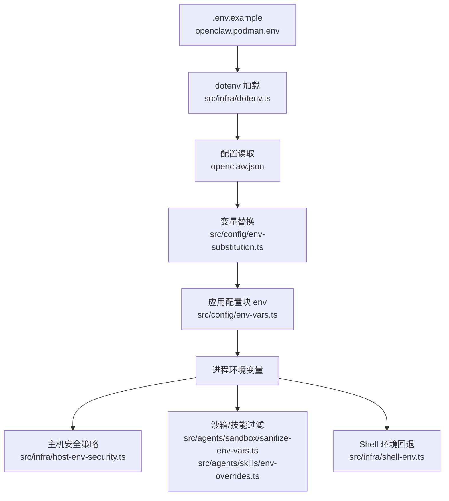
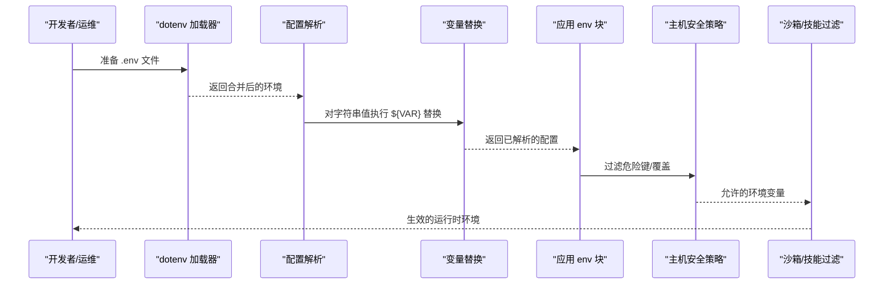
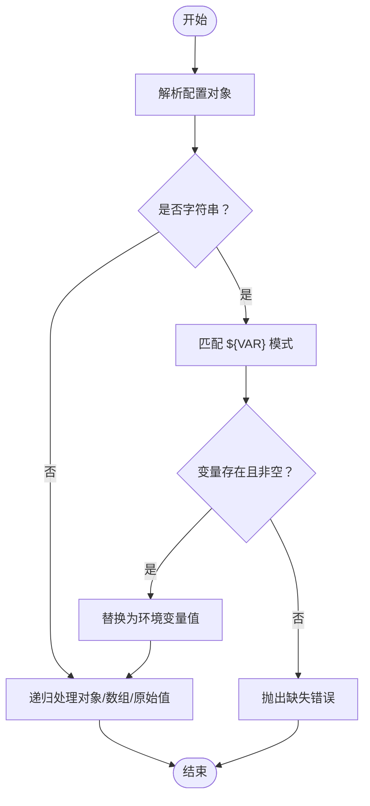
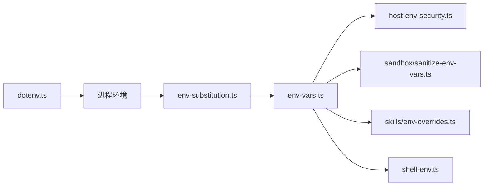

# 环境变量配置

<cite>
**本文引用的文件**
- [.env.example](file://.env.example)
- [openclaw.podman.env](file://openclaw.podman.env)
- [src/infra/dotenv.ts](file://src/infra/dotenv.ts)
- [src/config/env-substitution.ts](file://src/config/env-substitution.ts)
- [src/config/env-preserve.ts](file://src/config/env-preserve.ts)
- [src/config/env-vars.ts](file://src/config/env-vars.ts)
- [src/infra/host-env-security.ts](file://src/infra/host-env-security.ts)
- [src/infra/shell-env.ts](file://src/infra/shell-env.ts)
- [src/agents/sandbox/sanitize-env-vars.ts](file://src/agents/sandbox/sanitize-env-vars.ts)
- [src/agents/skills/env-overrides.ts](file://src/agents/skills/env-overrides.ts)
- [src/config/config.env-vars.test.ts](file://src/config/config.env-vars.test.ts)
- [src/infra/dotenv.test.ts](file://src/infra/dotenv.test.ts)
- [src/config/env-substitution.test.ts](file://src/config/env-substitution.test.ts)
- [src/agents/sandbox/sanitize-env-vars.test.ts](file://src/agents/sandbox/sanitize-env-vars.test.ts)
- [src/config/plugin-auto-enable.ts](file://src/config/plugin-auto-enable.ts)
</cite>

## 目录

1. [简介](#简介)
2. [项目结构](#项目结构)
3. [核心组件](#核心组件)
4. [架构总览](#架构总览)
5. [详细组件分析](#详细组件分析)
6. [依赖关系分析](#依赖关系分析)
7. [性能考量](#性能考量)
8. [故障排查指南](#故障排查指南)
9. [结论](#结论)
10. [附录](#附录)

## 简介

本指南面向在 OpenClaw 中使用环境变量进行配置的用户与运维人员，系统性说明以下内容：

- 支持的环境变量类别与用途（AI 提供商密钥、通道令牌、路径与网关配置、工具与媒体密钥等）
- 环境变量优先级与覆盖规则（进程环境、本地 .env、全局 ~/.openclaw/.env、openclaw.json 的 env 块）
- 与配置文件的交互方式（配置中的 ${VAR} 变量替换、写回时保留占位符）
- 命名约定与格式要求（大小写、下划线、前缀等）
- 不同部署场景下的配置示例（本地开发、Podman 容器）
- 敏感信息的安全处理与建议（阻断策略、沙箱过滤、最小暴露原则）
- 调试与验证方法（日志、测试用例、错误类型）

## 项目结构

围绕环境变量配置的关键文件与模块如下：

- 示例与容器化环境：.env.example、openclaw.podman.env
- dotenv 加载：src/infra/dotenv.ts
- 配置内变量替换：src/config/env-substitution.ts、src/config/env-preserve.ts
- 配置块 env 应用：src/config/env-vars.ts
- 主机环境安全策略：src/infra/host-env-security.ts
- Shell 环境回退：src/infra/shell-env.ts
- 沙箱与技能环境变量过滤：src/agents/sandbox/sanitize-env-vars.ts、src/agents/skills/env-overrides.ts
- 测试与验证：多处测试文件

图表来源

- [.env.example](file://.env.example#L1-L81)
- [openclaw.podman.env](file://openclaw.podman.env#L1-L25)
- [src/infra/dotenv.ts](file://src/infra/dotenv.ts#L1-L21)
- [src/config/env-substitution.ts](file://src/config/env-substitution.ts#L1-L171)
- [src/config/env-vars.ts](file://src/config/env-vars.ts#L1-L81)
- [src/infra/host-env-security.ts](file://src/infra/host-env-security.ts#L1-L149)
- [src/infra/shell-env.ts](file://src/infra/shell-env.ts#L140-L248)
- [src/agents/sandbox/sanitize-env-vars.ts](file://src/agents/sandbox/sanitize-env-vars.ts#L58-L110)
- [src/agents/skills/env-overrides.ts](file://src/agents/skills/env-overrides.ts#L33-L118)

章节来源

- [src/infra/dotenv.ts](file://src/infra/dotenv.ts#L1-L21)
- [src/config/env-substitution.ts](file://src/config/env-substitution.ts#L1-L171)
- [src/config/env-vars.ts](file://src/config/env-vars.ts#L1-L81)
- [src/infra/host-env-security.ts](file://src/infra/host-env-security.ts#L1-L149)
- [src/infra/shell-env.ts](file://src/infra/shell-env.ts#L140-L248)
- [src/agents/sandbox/sanitize-env-vars.ts](file://src/agents/sandbox/sanitize-env-vars.ts#L58-L110)
- [src/agents/skills/env-overrides.ts](file://src/agents/skills/env-overrides.ts#L33-L118)

## 核心组件

- dotenv 加载器：按顺序从当前工作目录与全局状态目录加载 .env，且不覆盖已存在的进程环境变量。
- 配置内变量替换：对 openclaw.json 中的字符串值执行 ${VAR} 占位符替换，支持嵌套对象与数组；缺失变量会抛出明确错误。
- 配置块 env 应用：将 openclaw.json 的 env 块中声明的键值注入到进程环境，但不会覆盖已有非空值。
- 主机环境安全策略：基于白名单/黑名单与前缀策略，阻止危险键或覆盖行为（如 PATH）。
- Shell 环境回退：在未设置期望键时，可从登录 shell 探测并回填环境变量。
- 沙箱与技能过滤：对传入的环境变量进行模式匹配与警告提示，严格模式下仅允许显式白名单。

章节来源

- [src/infra/dotenv.ts](file://src/infra/dotenv.ts#L1-L21)
- [src/config/env-substitution.ts](file://src/config/env-substitution.ts#L1-L171)
- [src/config/env-vars.ts](file://src/config/env-vars.ts#L1-L81)
- [src/infra/host-env-security.ts](file://src/infra/host-env-security.ts#L1-L149)
- [src/infra/shell-env.ts](file://src/infra/shell-env.ts#L140-L248)
- [src/agents/sandbox/sanitize-env-vars.ts](file://src/agents/sandbox/sanitize-env-vars.ts#L58-L110)
- [src/agents/skills/env-overrides.ts](file://src/agents/skills/env-overrides.ts#L33-L118)

## 架构总览

OpenClaw 的环境变量配置流程由“加载 → 替换 → 应用 → 安全过滤”四步构成，确保配置来源清晰、可审计、可回退。

图表来源

- [src/infra/dotenv.ts](file://src/infra/dotenv.ts#L1-L21)
- [src/config/env-substitution.ts](file://src/config/env-substitution.ts#L1-L171)
- [src/config/env-vars.ts](file://src/config/env-vars.ts#L1-L81)
- [src/infra/host-env-security.ts](file://src/infra/host-env-security.ts#L1-L149)
- [src/agents/sandbox/sanitize-env-vars.ts](file://src/agents/sandbox/sanitize-env-vars.ts#L58-L110)
- [src/agents/skills/env-overrides.ts](file://src/agents/skills/env-overrides.ts#L33-L118)

## 详细组件分析

### 环境变量优先级与覆盖规则

- 优先级（最高到最低）：
  1. 进程环境变量（不被 dotenv 或配置块覆盖）
  2. 当前目录 .env（dotenv 默认行为）
  3. 全局状态目录 ~/.openclaw/.env（或 OPENCLAW_STATE_DIR/.env），不覆盖已存在值
  4. openclaw.json 的 env 块（仅在进程环境为空时注入）
- 注意：
  - 直接配置键（如 gateway.auth.token 或通道令牌）通常独立解析，可能优先于 env 回退。
  - 配置中的 ${VAR} 在加载阶段解析，若变量缺失会报错。

章节来源

- [.env.example](file://.env.example#L8-L12)
- [src/infra/dotenv.ts](file://src/infra/dotenv.ts#L1-L21)
- [src/config/env-vars.ts](file://src/config/env-vars.ts#L69-L81)
- [src/config/env-substitution.ts](file://src/config/env-substitution.ts#L1-L171)

### 配置文件与变量替换

- 支持在 openclaw.json 中使用 ${VAR} 语法引用环境变量，递归遍历对象与数组。
- 规则：
  - 仅匹配大写/下划线/数字的合法变量名（如 A、VAR、VAR_1、\_PREFIX）。
  - 使用 $${} 可转义为字面量 ${}。
  - 缺失变量将抛出包含变量名与配置路径的错误。
- 写回保护：当配置被写回时，若检测到值与当前环境变量解析一致，则恢复原 ${VAR} 占位符，避免明文泄露。

图表来源

- [src/config/env-substitution.ts](file://src/config/env-substitution.ts#L1-L171)
- [src/config/env-preserve.ts](file://src/config/env-preserve.ts#L1-L38)

章节来源

- [src/config/env-substitution.ts](file://src/config/env-substitution.ts#L1-L171)
- [src/config/env-preserve.ts](file://src/config/env-preserve.ts#L1-L38)
- [src/config/env-substitution.test.ts](file://src/config/env-substitution.test.ts#L1-L351)

### 配置块 env 的应用

- 从 openclaw.json 的 env 块收集键值，进行规范化与安全检查后注入进程环境。
- 若进程环境已存在对应键（非空），则跳过覆盖，保证外部注入优先。

章节来源

- [src/config/env-vars.ts](file://src/config/env-vars.ts#L1-L81)
- [src/config/config.env-vars.test.ts](file://src/config/config.env-vars.test.ts#L1-L30)

### 主机环境安全策略

- 阻断策略：
  - 明确禁止的键与前缀集合。
  - 禁止覆盖的键集合（如 PATH 等）。
- 过滤逻辑：
  - 从基础环境与覆盖集合并集，剔除危险键与非法覆盖。
  - Shell 包装器模式下仅允许有限白名单键（如终端相关）。

章节来源

- [src/infra/host-env-security.ts](file://src/infra/host-env-security.ts#L1-L149)

### Shell 环境回退

- 当未设置期望键时，可探测登录 shell 的环境并回填。
- 可通过开关与超时参数控制行为与安全性。

章节来源

- [src/infra/shell-env.ts](file://src/infra/shell-env.ts#L140-L248)

### 沙箱与技能环境变量过滤

- 按模式匹配阻断常见敏感键（如 token、secret、api.\*key）。
- 支持严格模式，仅允许显式白名单键。
- 对可疑值发出警告（如疑似 base64 的凭据片段）。

章节来源

- [src/agents/sandbox/sanitize-env-vars.ts](file://src/agents/sandbox/sanitize-env-vars.ts#L58-L110)
- [src/agents/sandbox/sanitize-env-vars.test.ts](file://src/agents/sandbox/sanitize-env-vars.test.ts#L1-L57)
- [src/agents/skills/env-overrides.ts](file://src/agents/skills/env-overrides.ts#L33-L118)

### 命名约定与格式要求

- 变量名规范：仅允许大写字母、下划线、数字，且以字母或下划线开头；例如：VALID_VAR、VAR_1、\_PREFIX。
- 转义语法：$${VAR} 输出字面量 ${VAR}。
- 配置文件中使用 ${VAR} 引用环境变量时，需确保变量已就绪（优先级见上节）。

章节来源

- [src/config/env-substitution.ts](file://src/config/env-substitution.ts#L23-L27)
- [src/config/env-substitution.ts](file://src/config/env-substitution.ts#L43-L49)

### 不同部署场景下的配置示例

- 本地开发
  - 将 .env.example 复制为 .env 并填写所需密钥。
  - 可选启用 OPENCLAW_LOAD_SHELL_ENV 以从登录 shell 注入环境。
- Podman 容器
  - 使用 openclaw.podman.env.local 设置 OPENCLAW_GATEWAY_TOKEN 等必要变量。
  - 可通过脚本传参或环境文件注入端口映射与提供方密钥。

章节来源

- [.env.example](file://.env.example#L1-L81)
- [openclaw.podman.env](file://openclaw.podman.env#L1-L25)

### 敏感信息的安全处理与建议

- 最小暴露原则：仅在需要时注入敏感键，避免在公共仓库中提交真实密钥。
- 使用阻断策略：主机安全策略与沙箱过滤会阻断常见敏感键与可疑值。
- 严格模式：在沙箱/技能环境中启用严格模式，仅允许白名单键。
- 避免覆盖关键键：如 PATH 等不应被请求范围内的覆盖所修改。

章节来源

- [src/infra/host-env-security.ts](file://src/infra/host-env-security.ts#L74-L120)
- [src/agents/sandbox/sanitize-env-vars.ts](file://src/agents/sandbox/sanitize-env-vars.ts#L58-L110)
- [src/agents/sandbox/sanitize-env-vars.test.ts](file://src/agents/sandbox/sanitize-env-vars.test.ts#L1-L57)

### 调试与验证方法

- 日志与错误：
  - 变量缺失时抛出包含变量名与配置路径的错误，便于定位。
  - Shell 环境回退失败会输出警告日志。
- 单元测试：
  - dotenv 加载、变量替换、配置块应用、沙箱过滤均有测试覆盖。
- 行为验证：
  - 使用测试辅助函数在隔离环境中验证 dotenv 与配置加载行为。

章节来源

- [src/config/env-substitution.test.ts](file://src/config/env-substitution.test.ts#L91-L141)
- [src/infra/dotenv.test.ts](file://src/infra/dotenv.test.ts#L1-L48)
- [src/config/config.env-vars.test.ts](file://src/config/config.env-vars.test.ts#L1-L30)
- [src/agents/sandbox/sanitize-env-vars.test.ts](file://src/agents/sandbox/sanitize-env-vars.test.ts#L1-L57)

## 依赖关系分析

- dotenv 与配置加载：
  - dotenv 仅负责加载 .env，不覆盖现有进程变量；随后由配置层进行替换与应用。
- 配置层：
  - env-substitution 与 env-preserve 负责占位符解析与写回保护。
  - env-vars 负责将配置块注入进程环境（不覆盖非空）。
- 安全层：
  - host-env-security 与沙箱/技能过滤共同构成安全边界。
- Shell 回退：
  - 作为兜底机制，在未满足期望键时从登录 shell 注入。

图表来源

- [src/infra/dotenv.ts](file://src/infra/dotenv.ts#L1-L21)
- [src/config/env-substitution.ts](file://src/config/env-substitution.ts#L1-L171)
- [src/config/env-vars.ts](file://src/config/env-vars.ts#L1-L81)
- [src/infra/host-env-security.ts](file://src/infra/host-env-security.ts#L1-L149)
- [src/agents/sandbox/sanitize-env-vars.ts](file://src/agents/sandbox/sanitize-env-vars.ts#L58-L110)
- [src/agents/skills/env-overrides.ts](file://src/agents/skills/env-overrides.ts#L33-L118)
- [src/infra/shell-env.ts](file://src/infra/shell-env.ts#L140-L248)

章节来源

- [src/infra/dotenv.ts](file://src/infra/dotenv.ts#L1-L21)
- [src/config/env-substitution.ts](file://src/config/env-substitution.ts#L1-L171)
- [src/config/env-vars.ts](file://src/config/env-vars.ts#L1-L81)
- [src/infra/host-env-security.ts](file://src/infra/host-env-security.ts#L1-L149)
- [src/agents/sandbox/sanitize-env-vars.ts](file://src/agents/sandbox/sanitize-env-vars.ts#L58-L110)
- [src/agents/skills/env-overrides.ts](file://src/agents/skills/env-overrides.ts#L33-L118)
- [src/infra/shell-env.ts](file://src/infra/shell-env.ts#L140-L248)

## 性能考量

- dotenv 加载为轻量 I/O 操作，建议仅在启动阶段执行一次。
- 变量替换与写回保护在配置加载时完成，对运行期影响较小。
- Shell 环境回退涉及子进程调用，建议设置合理超时并谨慎开启。

## 故障排查指南

- “缺少环境变量”错误
  - 现象：加载配置时报错，指出缺失的变量名与配置路径。
  - 处理：确认 .env、全局 .env、配置块 env 是否正确设置，或在进程环境中注入。
- “变量未生效”
  - 现象：设置了变量但未生效。
  - 处理：检查优先级（进程环境优先）、是否被 dotenv 或配置块覆盖、是否被安全策略阻断。
- “Shell 环境回退失败”
  - 现象：未自动注入期望键。
  - 处理：检查开关与超时设置，确认登录 shell 可用且能导出目标键。
- “凭据被阻断/警告”
  - 现象：某些键被阻断或出现可疑值警告。
  - 处理：调整键名避免敏感后缀，或在严格模式下加入白名单。

章节来源

- [src/config/env-substitution.test.ts](file://src/config/env-substitution.test.ts#L91-L141)
- [src/infra/shell-env.ts](file://src/infra/shell-env.ts#L140-L248)
- [src/agents/sandbox/sanitize-env-vars.test.ts](file://src/agents/sandbox/sanitize-env-vars.test.ts#L1-L57)

## 结论

OpenClaw 的环境变量体系通过“dotenv 加载 → 配置替换 → 配置块应用 → 安全过滤”的分层设计，实现了高灵活性与强安全性的平衡。遵循本文的命名约定、优先级规则与安全建议，可在不同部署场景下稳定地管理密钥与配置，并通过测试与日志快速定位问题。

## 附录

### 支持的环境变量类别与示例

- 网关认证与路径
  - OPENCLAW_GATEWAY_TOKEN、OPENCLAW_GATEWAY_PASSWORD、OPENCLAW_STATE_DIR、OPENCLAW_CONFIG_PATH、OPENCLAW_HOME
- 模型提供商 API 密钥
  - OPENAI*API_KEY、ANTHROPIC_API_KEY、GEMINI_API_KEY、OPENROUTER_API_KEY、OPENCLAW_LIVE*_、OPENCLAW\__\_KEYS、ZAI_API_KEY、AI_GATEWAY_API_KEY、MINIMAX_API_KEY、SYNTHETIC_API_KEY、GOOGLE_API_KEY
- 通道令牌
  - TELEGRAM*BOT_TOKEN、DISCORD_BOT_TOKEN、SLACK_BOT_TOKEN、SLACK_APP_TOKEN、MATTERMOST*\*、ZALO_BOT_TOKEN、OPENCLAW_TWITCH_ACCESS_TOKEN
- 工具与媒体
  - BRAVE_API_KEY、PERPLEXITY_API_KEY、FIRECRAWL_API_KEY、ELEVENLABS_API_KEY、XI_API_KEY、DEEPGRAM_API_KEY
- Shell 环境回退
  - OPENCLAW_LOAD_SHELL_ENV、OPENCLAW_SHELL_ENV_TIMEOUT_MS、OPENCLAW_DEFER_SHELL_ENV_FALLBACK

章节来源

- [.env.example](file://.env.example#L14-L81)
- [openclaw.podman.env](file://openclaw.podman.env#L1-L25)
