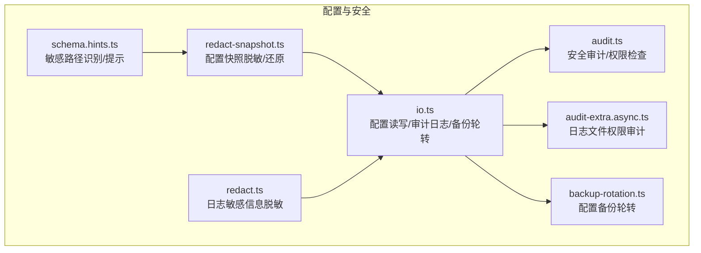
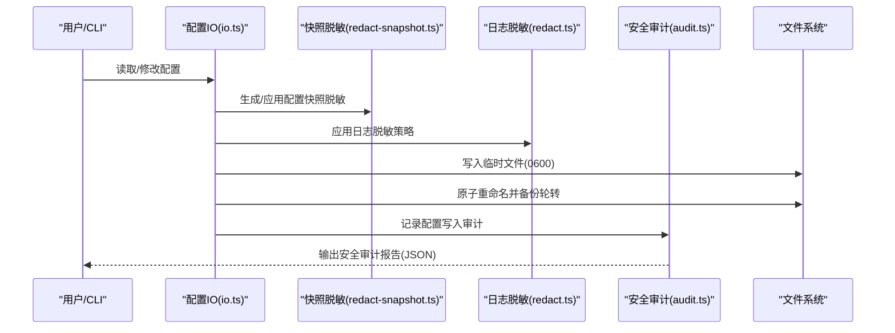
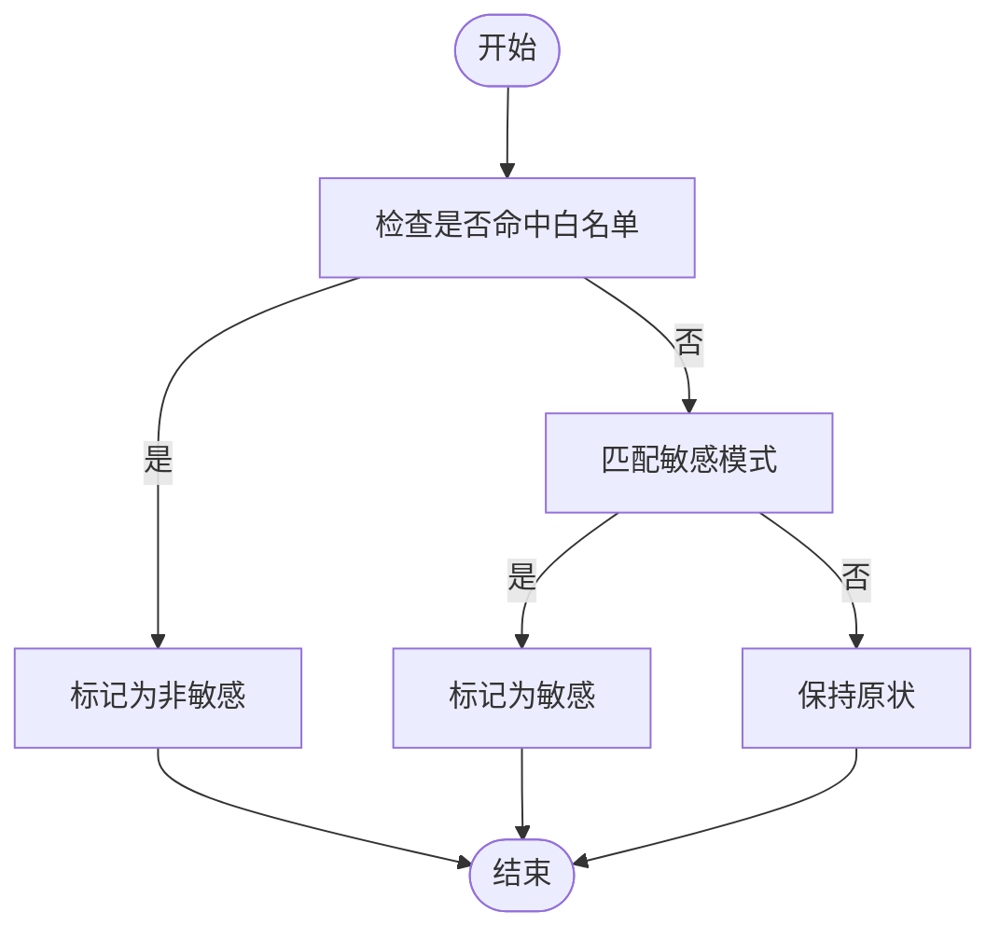
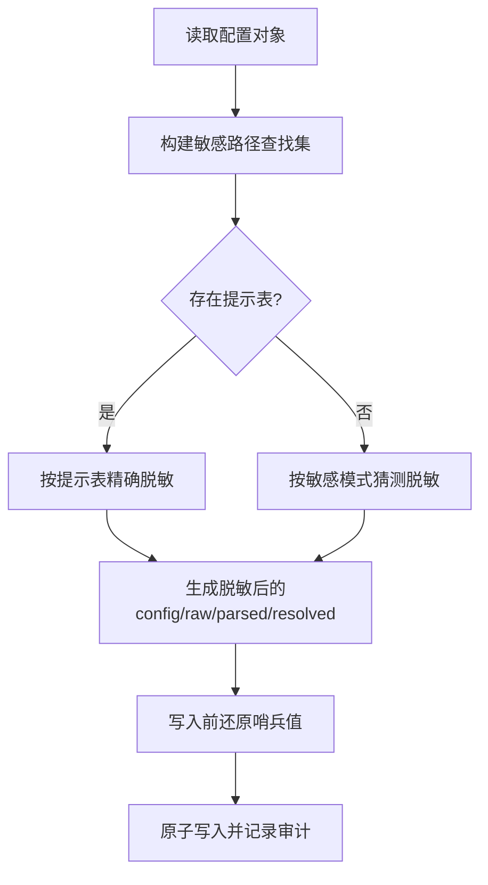
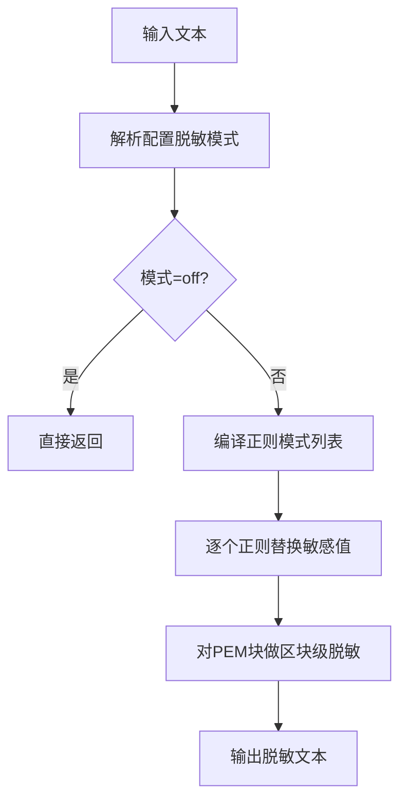
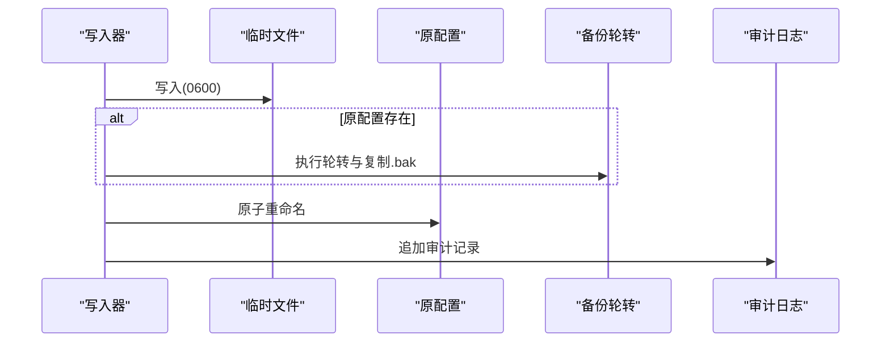
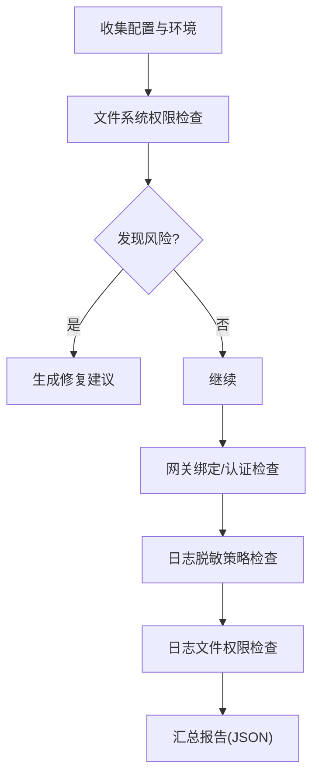
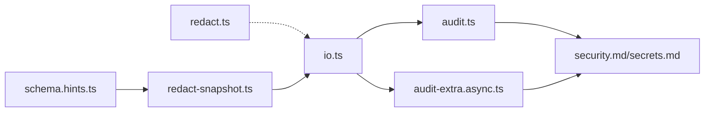

# 配置安全与隐私

<cite>
**本文引用的文件**
- [SECURITY.md](file://SECURITY.md)
- [schema.hints.ts](file://src/config/schema.hints.ts)
- [redact-snapshot.ts](file://src/config/redact-snapshot.ts)
- [io.ts](file://src/config/io.ts)
- [redact.ts](file://src/logging/redact.ts)
- [audit.ts](file://src/security/audit.ts)
- [audit-extra.async.ts](file://src/security/audit-extra.async.ts)
- [backup-rotation.ts](file://src/config/backup-rotation.ts)
- [secrets.md](file://docs/cli/secrets.md)
- [security.md](file://docs/cli/security.md)
- [index.md](file://docs/zh-CN/gateway/security/index.md)
</cite>

## 目录

1. [简介](#简介)
2. [项目结构](#项目结构)
3. [核心组件](#核心组件)
4. [架构总览](#架构总览)
5. [详细组件分析](#详细组件分析)
6. [依赖关系分析](#依赖关系分析)
7. [性能考量](#性能考量)
8. [故障排查指南](#故障排查指南)
9. [结论](#结论)
10. [附录](#附录)

## 简介

本指南聚焦于 OpenClaw 的配置安全与隐私保护，围绕以下目标展开：

- 识别与保护敏感配置信息（API 密钥、密码、服务账号等）
- 配置快照脱敏与日志过滤规则
- 配置文件访问控制与权限管理
- 配置安全审计与合规性检查方法
- 配置备份与恢复的安全考虑
- 配置泄露的预防与应急响应流程

本指南基于仓库中的实现与文档，提供可操作的实践建议与可视化图示，帮助不同技术背景的读者理解并落地配置安全。

## 项目结构

与配置安全直接相关的模块主要分布在如下位置：

- 配置敏感路径识别与提示：src/config/schema.hints.ts
- 配置快照脱敏与回写还原：src/config/redact-snapshot.ts
- 日志敏感信息脱敏：src/logging/redact.ts
- 配置读写与审计日志：src/config/io.ts
- 安全审计与权限检查：src/security/audit.ts、src/security/audit-extra.async.ts
- 备份轮转：src/config/backup-rotation.ts
- CLI 文档：docs/cli/secrets.md、docs/cli/security.md
- 中文安全指引：docs/zh-CN/gateway/security/index.md
- 安全策略：SECURITY.md

图表来源

- [schema.hints.ts](file://src/config/schema.hints.ts#L112-L131)
- [redact-snapshot.ts](file://src/config/redact-snapshot.ts#L317-L353)
- [redact.ts](file://src/logging/redact.ts#L125-L138)
- [io.ts](file://src/config/io.ts#L1205-L1246)
- [audit.ts](file://src/security/audit.ts#L131-L260)
- [audit-extra.async.ts](file://src/security/audit-extra.async.ts#L922-L951)
- [backup-rotation.ts](file://src/config/backup-rotation.ts#L3-L26)

章节来源

- [schema.hints.ts](file://src/config/schema.hints.ts#L112-L131)
- [redact-snapshot.ts](file://src/config/redact-snapshot.ts#L317-L353)
- [redact.ts](file://src/logging/redact.ts#L125-L138)
- [io.ts](file://src/config/io.ts#L1205-L1246)
- [audit.ts](file://src/security/audit.ts#L131-L260)
- [audit-extra.async.ts](file://src/security/audit-extra.async.ts#L922-L951)
- [backup-rotation.ts](file://src/config/backup-rotation.ts#L3-L26)

## 核心组件

- 敏感路径识别与提示
  - 通过正则模式与白名单排除，判定配置键是否敏感，并在 UI 提示中标注敏感字段，便于在界面层避免误操作。
- 配置快照脱敏与回写还原
  - 对配置对象、解析后对象、已解析环境变量值以及原始 JSON5 字符串进行多路脱敏；同时支持在写回前将哨兵值还原为原始值，确保 UI 回环不丢失凭据。
- 日志敏感信息脱敏
  - 基于可配置的正则模式与最小长度/前后缀保留策略，对工具详情与文本进行脱敏；默认模式为“仅工具输出”。
- 配置读写与审计日志
  - 写入时生成审计记录，记录变更前后哈希、字节数、可疑原因等；同时写临时文件并原子重命名，配合备份轮转。
- 安全审计与权限检查
  - 文件系统权限检查（状态目录、配置文件、include 文件等），网关绑定与认证风险评估，日志脱敏策略检查等。
- 配置备份轮转
  - 维护固定数量的配置备份，写入前自动轮转，防止旧明文残留。

章节来源

- [schema.hints.ts](file://src/config/schema.hints.ts#L112-L131)
- [redact-snapshot.ts](file://src/config/redact-snapshot.ts#L317-L353)
- [redact.ts](file://src/logging/redact.ts#L125-L138)
- [io.ts](file://src/config/io.ts#L1205-L1246)
- [audit.ts](file://src/security/audit.ts#L131-L260)
- [backup-rotation.ts](file://src/config/backup-rotation.ts#L3-L26)

## 架构总览

下图展示从配置读取、脱敏、写入到审计与备份的整体流程，以及与日志脱敏的关系。

图表来源

- [io.ts](file://src/config/io.ts#L1205-L1246)
- [redact-snapshot.ts](file://src/config/redact-snapshot.ts#L317-L353)
- [redact.ts](file://src/logging/redact.ts#L125-L138)
- [audit.ts](file://src/security/audit.ts#L522-L536)

## 详细组件分析

### 敏感配置路径识别与提示

- 敏感模式匹配：基于 token、password、secret、api.\*key、serviceaccount 等后缀的正则判断。
- 白名单排除：对 maxtokens、maxoutputtokens 等常见但非敏感键进行排除，避免误报。
- UI 提示：在构建 UI 提示时，对敏感路径标注 sensitive=true，便于界面层进行输入掩码与告警。

图表来源

- [schema.hints.ts](file://src/config/schema.hints.ts#L96-L131)

章节来源

- [schema.hints.ts](file://src/config/schema.hints.ts#L96-L131)

### 配置快照脱敏与回写还原

- 多级脱敏：对 config、raw、parsed、resolved 进行统一脱敏，确保凭据不会通过任一通道泄露。
- 哨兵值：使用统一哨兵值替换敏感字符串，既保证 UI 展示安全，又便于后续回写时还原。
- 回写还原：在写入前，根据提示表构建查找集合，将哨兵值还原为原始值，保障凭据不被 UI 循环污染。

图表来源

- [redact-snapshot.ts](file://src/config/redact-snapshot.ts#L317-L353)
- [redact-snapshot.ts](file://src/config/redact-snapshot.ts#L369-L403)

章节来源

- [redact-snapshot.ts](file://src/config/redact-snapshot.ts#L317-L353)
- [redact-snapshot.ts](file://src/config/redact-snapshot.ts#L369-L403)

### 日志敏感信息脱敏

- 默认模式：仅对工具输出进行脱敏（logging.redactSensitive="tools"）。
- 可配置正则：支持自定义敏感信息识别模式，覆盖 ENV 赋值、JSON 字段、CLI 参数、Authorization 头、PEM 块、常见令牌前缀等。
- 最小化暴露：对长令牌保留首尾若干字符，降低泄露风险。

图表来源

- [redact.ts](file://src/logging/redact.ts#L125-L138)
- [redact.ts](file://src/logging/redact.ts#L140-L146)

章节来源

- [redact.ts](file://src/logging/redact.ts#L125-L138)
- [redact.ts](file://src/logging/redact.ts#L140-L146)

### 配置读写与审计日志

- 写入流程：先写入临时文件（0600），再原子重命名；若原文件存在，先进行备份轮转与复制。
- 审计记录：记录写入结果、前后哈希、字节数、可疑原因、进程信息等，写入状态目录下的审计日志文件。
- 备份轮转：维护固定数量的 .bak.\* 备份，避免旧明文长期留存。

图表来源

- [io.ts](file://src/config/io.ts#L1205-L1246)
- [backup-rotation.ts](file://src/config/backup-rotation.ts#L3-L26)

章节来源

- [io.ts](file://src/config/io.ts#L1205-L1246)
- [backup-rotation.ts](file://src/config/backup-rotation.ts#L3-L26)

### 安全审计与权限检查

- 文件系统权限：检查状态目录与配置文件的可写/可读权限，发现 symlink、group/world 可读等风险并给出修复建议。
- 网关绑定与认证：评估 gateway.bind 与 auth 配置组合，识别未授权暴露、Origin 策略缺失、代理头回退等高危项。
- 日志脱敏策略：检查 logging.redactSensitive 是否开启，避免敏感信息进入日志。
- 日志文件权限：检查日志文件是否对其他用户可读，给出收紧权限的修复建议。

图表来源

- [audit.ts](file://src/security/audit.ts#L131-L260)
- [audit.ts](file://src/security/audit.ts#L262-L551)
- [audit.ts](file://src/security/audit.ts#L645-L659)
- [audit-extra.async.ts](file://src/security/audit-extra.async.ts#L922-L951)

章节来源

- [audit.ts](file://src/security/audit.ts#L131-L260)
- [audit.ts](file://src/security/audit.ts#L262-L551)
- [audit.ts](file://src/security/audit.ts#L645-L659)
- [audit-extra.async.ts](file://src/security/audit-extra.async.ts#L922-L951)

### 配置安全审计与合规性检查

- CLI 使用：通过 openclaw security audit 进行基础与深度审计，支持 --json 输出用于 CI/政策检查；--fix 自动应用安全修复（如收紧权限、设置日志脱敏）。
- 合规要点：严格限制 gateway.bind 为 loopback 或受控 tailnet；为 Control UI 配置明确 allowedOrigins；启用 gateway.auth 并使用强令牌；开启 logging.redactSensitive="tools"；收紧状态目录与配置文件权限。

章节来源

- [security.md](file://docs/cli/security.md#L43-L72)

### 配置备份与恢复的安全考虑

- 备份轮转：写入前自动轮转并保留固定数量的 .bak.\* 备份，避免旧明文长期留存。
- 恢复策略：建议在审计通过后再进行配置迁移；如需回滚，优先使用最近的 .bak.\* 备份，注意备份文件的权限应为 0600。
- 机密迁移：secrets audit 与 secrets configure 流程强调先审计、再配置、再验证，避免明文残留。

章节来源

- [backup-rotation.ts](file://src/config/backup-rotation.ts#L3-L26)
- [secrets.md](file://docs/cli/secrets.md#L148-L164)

### 配置泄露的预防与应急响应

- 预防措施
  - 严格限制网关暴露面：bind 仅 loopback 或 tailnet-only，必要时使用 Tailscale Serve/Funnel 并配合强认证。
  - 强制脱敏：开启 logging.redactSensitive="tools"，避免工具输出泄露敏感信息。
  - 权限收紧：状态目录与配置文件权限设为 0700/0600，避免 group/world 可读。
  - 审计与监控：定期执行 openclaw security audit --deep，关注日志文件可读风险。
- 应急响应
  - 立即轮换所有相关令牌与密码（gateway.auth、hooks.token、模型提供商 API Key 等）。
  - 锁定入站接口（私信策略、群组白名单、提及门控）。
  - 审查日志与最近会话，移除不受信任的扩展与插件。
  - 重新运行深度审计，确认无残留明文与异常行为。

章节来源

- [index.md](file://docs/zh-CN/gateway/security/index.md#L273-L315)
- [audit.ts](file://src/security/audit.ts#L131-L260)
- [audit-extra.async.ts](file://src/security/audit-extra.async.ts#L922-L951)

## 依赖关系分析

- 组件耦合
  - schema.hints.ts 为 redact-snapshot.ts 提供敏感路径提示，二者共同决定脱敏范围。
  - redact.ts 与 redact-snapshot.ts 分别负责日志与配置层面的脱敏，互不干扰。
  - io.ts 在写入阶段串联脱敏、原子写入与审计记录，形成闭环。
  - audit.ts 与 audit-extra.async.ts 从文件系统与运行态两方面进行安全检查。
- 外部依赖
  - Node.js 文件系统 API、JSON5 解析、平台权限检查（含 Windows ACL）。
  - CLI 文档与策略指导（SECURITY.md、docs/cli/security.md、docs/zh-CN/gateway/security/index.md）。

图表来源

- [schema.hints.ts](file://src/config/schema.hints.ts#L112-L131)
- [redact-snapshot.ts](file://src/config/redact-snapshot.ts#L317-L353)
- [redact.ts](file://src/logging/redact.ts#L125-L138)
- [io.ts](file://src/config/io.ts#L1205-L1246)
- [audit.ts](file://src/security/audit.ts#L131-L260)
- [audit-extra.async.ts](file://src/security/audit-extra.async.ts#L922-L951)
- [security.md](file://docs/cli/security.md#L43-L72)
- [secrets.md](file://docs/cli/secrets.md#L148-L164)

章节来源

- [schema.hints.ts](file://src/config/schema.hints.ts#L112-L131)
- [redact-snapshot.ts](file://src/config/redact-snapshot.ts#L317-L353)
- [redact.ts](file://src/logging/redact.ts#L125-L138)
- [io.ts](file://src/config/io.ts#L1205-L1246)
- [audit.ts](file://src/security/audit.ts#L131-L260)
- [audit-extra.async.ts](file://src/security/audit-extra.async.ts#L922-L951)
- [security.md](file://docs/cli/security.md#L43-L72)
- [secrets.md](file://docs/cli/secrets.md#L148-L164)

## 性能考量

- 脱敏成本
  - 正则编译与全局替换在大文本上可能带来 CPU 开销；建议合理配置 logging.redactPatterns，避免过度匹配。
  - 配置快照脱敏采用最长优先替换，减少重复匹配次数。
- 写入性能
  - 原子重命名与备份轮转为 O(1) 操作，对整体写入延迟影响有限。
- 审计开销
  - 深度审计涉及网络探测与文件系统扫描，建议在 CI 中按需启用，本地开发可使用基础审计。

## 故障排查指南

- 配置写入失败
  - 查看审计日志（状态目录 logs 下的配置审计文件），定位失败原因（如 size-drop、缺少 meta、移除 gateway.mode 等可疑原因）。
  - 检查目标路径权限（0600/0700）与磁盘空间。
- 日志仍泄露敏感信息
  - 确认 logging.redactSensitive 设置为 "tools" 或更高；检查自定义 redactPatterns 是否遗漏关键模式。
  - 对于 include 文件，确认其权限为 0600，避免 group/world 可读导致泄露。
- 审计报告出现权限风险
  - 根据修复建议调整状态目录与配置文件权限；对 symlink、group/world 可读等风险逐一处理。
- 安全策略未生效
  - 确认 CLI 使用 --fix 选项已应用修复；对于非本地暴露场景，确保 allowedOrigins、bind、auth 配置正确。

章节来源

- [io.ts](file://src/config/io.ts#L522-L536)
- [audit.ts](file://src/security/audit.ts#L131-L260)
- [audit-extra.async.ts](file://src/security/audit-extra.async.ts#L922-L951)
- [security.md](file://docs/cli/security.md#L43-L72)

## 结论

OpenClaw 在配置安全方面提供了从“识别—脱敏—写入—审计—备份”的完整闭环：

- 通过敏感路径识别与 UI 提示，降低误操作风险；
- 通过多路脱敏与哨兵值还原，确保凭据在 UI 与日志中不泄露；
- 通过原子写入与审计记录，提升变更可追溯性；
- 通过安全审计与权限检查，及时发现并修复潜在风险；
- 通过备份轮转，降低旧明文留存带来的长期风险。

建议在生产环境中强制开启日志脱敏、收紧文件权限、限制网关暴露面，并定期执行安全审计与备份验证。

## 附录

- 关键配置项参考
  - logging.redactSensitive：控制日志脱敏级别（"off"|"tools"）
  - gateway.bind/gateway.auth：控制网关绑定与认证
  - gateway.controlUi.allowedOrigins：控制非 loopback 场景的允许来源
  - tools.exec.host 与 agents.defaults.sandbox.mode：控制执行宿主与沙箱模式
- 相关 CLI
  - openclaw security audit [--deep] [--json] [--fix]
  - openclaw secrets audit --check
  - openclaw secrets configure

章节来源

- [security.md](file://docs/cli/security.md#L43-L72)
- [secrets.md](file://docs/cli/secrets.md#L148-L164)
- [SECURITY.md](file://SECURITY.md#L196-L225)
