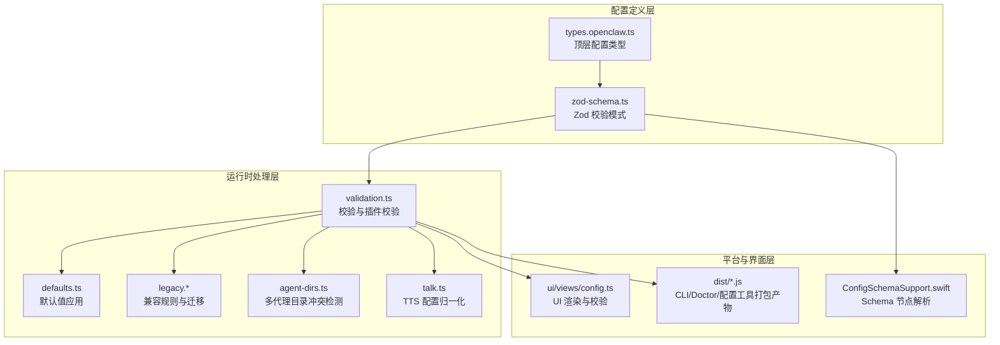
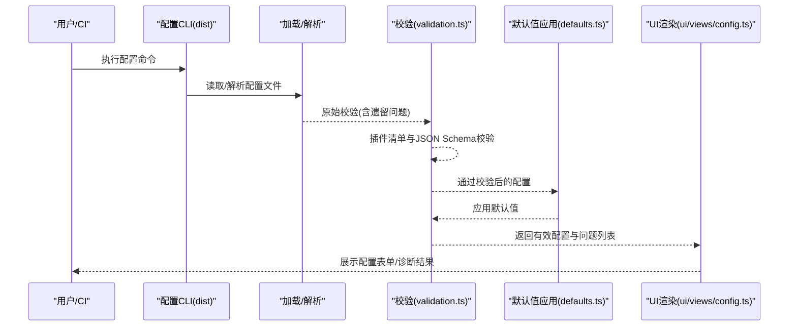
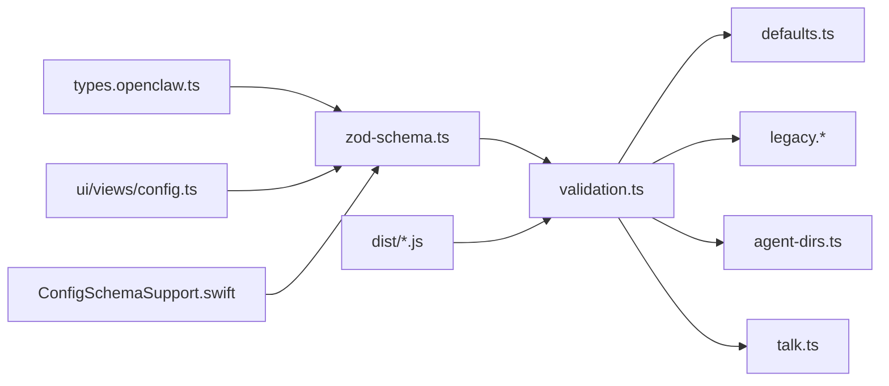

# 配置指南

<cite>
**本文引用的文件**
- [src/config/types.openclaw.ts](file://src/config/types.openclaw.ts)
- [src/config/zod-schema.ts](file://src/config/zod-schema.ts)
- [src/config/validation.ts](file://src/config/validation.ts)
- [src/config/defaults.ts](file://src/config/defaults.ts)
- [src/config/legacy.ts](file://src/config/legacy.ts)
- [src/config/legacy.migrations.ts](file://src/config/legacy.migrations.ts)
- [src/config/legacy.rules.ts](file://src/config/legacy.rules.ts)
- [src/config/agent-dirs.ts](file://src/config/agent-dirs.ts)
- [src/config/talk.ts](file://src/config/talk.ts)
- [apps/macos/Sources/OpenClaw/ConfigSchemaSupport.swift](file://apps/macos/Sources/OpenClaw/ConfigSchemaSupport.swift)
- [ui/src/ui/views/config.ts](file://ui/src/ui/views/config.ts)
- [dist/config-BeIwBEE4.js](file://dist/config-BeIwBEE4.js)
- [dist/config-cli-DMWCDW2b.js](file://dist/config-cli-DMWCDW2b.js)
- [dist/config-cli-YpxGYBie.js](file://dist/config-cli-YpxGYBie.js)
- [dist/config-validation-Fit7lTQc.js](file://dist/config-validation-Fit7lTQc.js)
- [dist/config-validation-gm70sdG7.js](file://dist/config-validation-gm70sdG7.js)
- [dist/config-guard-B7aD_5N-.js](file://dist/config-guard-B7aD_5N-.js)
- [dist/config-guard-DUbRMp2m.js](file://dist/config-guard-DUbRMp2m.js)
- [dist/doctor-config-flow-D5HoZGzs.js](file://dist/doctor-config-flow-D5HoZGzs.js)
- [dist/doctor-config-flow-W7aZutDR.js](file://dist/doctor-config-flow-W7aZutDR.js)
- [dist/configure-Csrv3aKi.js](file://dist/configure-Csrv3aKi.js)
- [dist/configure-Z0MQFHLg.js](file://dist/configure-Z0MQFHLg.js)
- [dist/models-config-Do0nXb8P.js](file://dist/models-config-Do0nXb8P.js)
- [dist/models-config-_GpfAvwz.js](file://dist/models-config-_GpfAvwz.js)
- [docs/cli/config.md](file://docs/cli/config.md)
- [docs/zh-CN/cli/config.md](file://docs/zh-CN/cli/config.md)
</cite>

## 目录

1. [简介](#简介)
2. [项目结构](#项目结构)
3. [核心组件](#核心组件)
4. [架构总览](#架构总览)
5. [详细组件分析](#详细组件分析)
6. [依赖分析](#依赖分析)
7. [性能考虑](#性能考虑)
8. [故障排除指南](#故障排除指南)
9. [结论](#结论)
10. [附录](#附录)

## 简介

本指南面向使用者与维护者，系统性阐述 OpenClaw 的配置系统：配置文件结构、字段定义、默认值、校验与错误处理、环境变量使用、层次化与继承/覆盖规则、迁移与版本兼容策略，以及针对不同使用场景的最佳实践与模板。读者可据此在不深入源码的情况下，安全地定制 OpenClaw 的行为。

## 项目结构

OpenClaw 的配置系统由“类型定义 + 校验 + 默认值 + 兼容迁移”四部分组成，并通过 CLI、UI 与运行时共同协作完成配置的加载、解析、应用与持久化。

图示来源

- [src/config/types.openclaw.ts](file://src/config/types.openclaw.ts#L30-L115)
- [src/config/zod-schema.ts](file://src/config/zod-schema.ts#L131-L782)
- [src/config/validation.ts](file://src/config/validation.ts#L87-L143)
- [src/config/defaults.ts](file://src/config/defaults.ts#L213-L347)
- [src/config/legacy.ts](file://src/config/legacy.ts#L5-L43)
- [src/config/agent-dirs.ts](file://src/config/agent-dirs.ts#L80-L98)
- [src/config/talk.ts](file://src/config/talk.ts#L168-L221)
- [apps/macos/Sources/OpenClaw/ConfigSchemaSupport.swift](file://apps/macos/Sources/OpenClaw/ConfigSchemaSupport.swift#L62-L179)
- [ui/src/ui/views/config.ts](file://ui/src/ui/views/config.ts#L405-L420)
- [dist/config-BeIwBEE4.js](file://dist/config-BeIwBEE4.js)

章节来源

- [src/config/types.openclaw.ts](file://src/config/types.openclaw.ts#L30-L115)
- [src/config/zod-schema.ts](file://src/config/zod-schema.ts#L131-L782)

## 核心组件

- 类型与模式
  - 顶层配置类型定义了所有可用配置键及其嵌套结构（如 auth、models、agents、plugins、gateway 等）。
  - 使用 Zod 定义严格的校验模式，包含字段类型、枚举、范围约束、格式校验等。
- 校验器
  - 原始校验：仅基于 Zod 模式与遗留问题检查。
  - 插件校验：加载插件清单，对启用或有配置的插件执行其 JSON Schema 校验，并给出警告/错误。
- 默认值应用
  - 在通过校验后，按需应用模型、会话、代理、日志等默认值，确保最小可用配置集。
- 兼容与迁移
  - 识别旧版配置键并提示自动迁移；对已移除的插件 ID 给出警告；对已废弃字段进行重命名提示。
- 多代理目录冲突检测
  - 当多个代理共享 agentDir 时，抛出冲突错误，避免认证/会话状态冲突。
- TTS 配置归一化
  - 将 legacy 字段与 providers 形态统一到标准化 talk 结构，便于后续处理。

章节来源

- [src/config/validation.ts](file://src/config/validation.ts#L87-L143)
- [src/config/validation.ts](file://src/config/validation.ts#L145-L171)
- [src/config/validation.ts](file://src/config/validation.ts#L173-L453)
- [src/config/defaults.ts](file://src/config/defaults.ts#L213-L347)
- [src/config/legacy.ts](file://src/config/legacy.ts#L5-L43)
- [src/config/agent-dirs.ts](file://src/config/agent-dirs.ts#L80-L98)
- [src/config/talk.ts](file://src/config/talk.ts#L168-L221)

## 架构总览

下图展示从配置加载到最终生效的关键流程：解析 → 校验 → 应用默认值 → 插件校验 → UI/CLI 展示与写回。

图示来源

- [dist/config-cli-DMWCDW2b.js](file://dist/config-cli-DMWCDW2b.js)
- [dist/config-cli-YpxGYBie.js](file://dist/config-cli-YpxGYBie.js)
- [src/config/validation.ts](file://src/config/validation.ts#L87-L143)
- [src/config/validation.ts](file://src/config/validation.ts#L145-L171)
- [src/config/defaults.ts](file://src/config/defaults.ts#L213-L347)
- [ui/src/ui/views/config.ts](file://ui/src/ui/views/config.ts#L405-L420)

## 详细组件分析

### 配置类型与字段总览

- 顶层键概览（节选）
  - meta：记录最后写入版本与时间戳
  - env：环境变量导入与内联变量
  - wizard：向导运行记录
  - diagnostics/logging/update：可观测性与更新策略
  - browser/ui/secrets/skills/plugins/models/nodeHost/agents/tools/broadcast/audio/messages/commands/approvals/session/web/channels/cron/hooks/discovery/canvasHost/talk/gateway/memory
- 字段约束
  - 大多数字段支持严格类型与枚举值（如通道、日志级别、绑定模式等）
  - 部分字段支持超集校验（catchall），允许扩展
  - 特定字段包含格式/长度限制（如 UI 名称、头像长度）

章节来源

- [src/config/types.openclaw.ts](file://src/config/types.openclaw.ts#L30-L115)
- [src/config/zod-schema.ts](file://src/config/zod-schema.ts#L131-L782)

### 校验与错误处理

- 原始校验
  - 检查遗留配置键并提示迁移
  - 使用 Zod 模式进行结构与类型校验
  - 检测重复 agentDir 并报错
  - 校验身份头像路径合法性
- 插件校验
  - 加载插件清单，对启用或存在配置的插件执行其 JSON Schema 校验
  - 对未知插件、缺失 schema、禁用但仍有配置等情况分别给出错误/警告
- 错误与警告
  - issues：致命问题，阻止启动
  - warnings：非致命问题，建议修复
  - legacyIssues：遗留配置提示

章节来源

- [src/config/validation.ts](file://src/config/validation.ts#L87-L143)
- [src/config/validation.ts](file://src/config/validation.ts#L145-L171)
- [src/config/validation.ts](file://src/config/validation.ts#L173-L453)
- [src/config/agent-dirs.ts](file://src/config/agent-dirs.ts#L80-L98)

### 默认值应用

- 模型默认值：为模型补齐 cost/input/contextWindow/maxTokens/api 等字段
- 代理默认值：为 agents.defaults 补齐并发限制等
- 会话默认值：规范化 mainKey 等
- 日志默认值：敏感信息脱敏策略默认开启
- 上下文修剪与心跳：根据认证方式自动设置 TTL/频率
- TTS 配置：标准化 talk providers 与 legacy 字段

章节来源

- [src/config/defaults.ts](file://src/config/defaults.ts#L213-L347)
- [src/config/defaults.ts](file://src/config/defaults.ts#L349-L388)
- [src/config/defaults.ts](file://src/config/defaults.ts#L407-L507)
- [src/config/talk.ts](file://src/config/talk.ts#L168-L221)

### 兼容与迁移

- 规则扫描：识别被移动/删除/重命名的键并提示自动迁移
- 迁移执行：对已知迁移进行结构化替换
- 已知移除插件：对不再支持的插件 ID 给出警告

章节来源

- [src/config/legacy.ts](file://src/config/legacy.ts#L5-L43)
- [src/config/legacy.migrations.ts](file://src/config/legacy.migrations.ts#L5-L9)
- [src/config/legacy.rules.ts](file://src/config/legacy.rules.ts#L20-L171)

### 多代理目录冲突检测

- 若多个代理指向同一 agentDir，将抛出冲突错误，避免状态冲突
- 提供格式化错误信息，指导用户修正

章节来源

- [src/config/agent-dirs.ts](file://src/config/agent-dirs.ts#L80-L112)

### UI 与 Schema 支持

- UI 渲染：根据 schema 动态生成可用区段，识别不受支持的路径
- macOS 平台：解析 JSON Schema 节点，支持 properties/anyOf/oneOf/类型推断等

章节来源

- [ui/src/ui/views/config.ts](file://ui/src/ui/views/config.ts#L405-L420)
- [apps/macos/Sources/OpenClaw/ConfigSchemaSupport.swift](file://apps/macos/Sources/OpenClaw/ConfigSchemaSupport.swift#L62-L179)

## 依赖分析

- 内部耦合
  - validation.ts 依赖 defaults.ts、legacy.\*、agent-dirs.ts、talk.ts 与插件清单
  - zod-schema.ts 作为统一校验入口，被 validation.ts 引用
  - types.openclaw.ts 为各子模块类型基础
- 外部依赖
  - CLI/Doctor/UI 通过打包产物 dist/\* 与配置系统交互
  - macOS 平台通过 ConfigSchemaSupport.swift 解析 schema

图示来源

- [src/config/zod-schema.ts](file://src/config/zod-schema.ts#L131-L782)
- [src/config/validation.ts](file://src/config/validation.ts#L87-L143)
- [src/config/defaults.ts](file://src/config/defaults.ts#L213-L347)
- [src/config/legacy.ts](file://src/config/legacy.ts#L5-L43)
- [src/config/agent-dirs.ts](file://src/config/agent-dirs.ts#L80-L98)
- [src/config/talk.ts](file://src/config/talk.ts#L168-L221)
- [ui/src/ui/views/config.ts](file://ui/src/ui/views/config.ts#L405-L420)
- [apps/macos/Sources/OpenClaw/ConfigSchemaSupport.swift](file://apps/macos/Sources/OpenClaw/ConfigSchemaSupport.swift#L62-L179)
- [dist/config-BeIwBEE4.js](file://dist/config-BeIwBEE4.js)

## 性能考虑

- 校验阶段尽量避免重复计算：插件清单只在需要时加载一次
- 默认值应用仅在必要时修改配置对象，减少深拷贝成本
- UI 渲染仅基于 schema 变更，避免全量重绘

## 故障排除指南

- 启动失败：查看 issues 列表，优先修复致命问题
- 插件相关告警：检查 plugins.entries 中是否存在禁用但仍保留配置的条目
- 未知通道/心跳目标：确认通道 ID 是否存在于内置或插件声明中
- 重复 agentDir：按错误提示为每个代理分配独立目录
- 旧版键提示：遵循迁移提示，将配置迁移到新位置

章节来源

- [src/config/validation.ts](file://src/config/validation.ts#L173-L453)
- [src/config/agent-dirs.ts](file://src/config/agent-dirs.ts#L80-L112)
- [src/config/legacy.rules.ts](file://src/config/legacy.rules.ts#L20-L171)

## 结论

OpenClaw 的配置系统以强类型与严格校验为基础，结合默认值应用与兼容迁移，既保证了易用性，又确保了长期演进的稳定性。通过本文档提供的结构、规则与最佳实践，用户可以安全、可控地定制 OpenClaw 的各项能力。

## 附录

### 配置层次结构与覆盖规则

- 层次结构
  - 顶层键按功能域划分（如 agents、plugins、gateway、channels 等）
  - 子域内部采用嵌套对象/数组组织，字段受 Zod 模式约束
- 覆盖规则
  - 未显式设置的字段按 defaults.ts 应用默认值
  - 插件配置仅在启用或存在配置时进行校验
  - legacy 规则会在加载时自动迁移，避免破坏性变更

章节来源

- [src/config/zod-schema.ts](file://src/config/zod-schema.ts#L131-L782)
- [src/config/defaults.ts](file://src/config/defaults.ts#L213-L347)
- [src/config/legacy.rules.ts](file://src/config/legacy.rules.ts#L20-L171)

### 环境变量使用

- env.shellEnv：可选择从登录 shell 导入环境变量
- env.vars：直接注入内联环境变量
- talk 配置：可通过 ELEVENLABS_API_KEY 等环境变量自动填充 TTS API Key

章节来源

- [src/config/types.openclaw.ts](file://src/config/types.openclaw.ts#L39-L54)
- [src/config/talk.ts](file://src/config/talk.ts#L302-L311)

### 配置验证与错误处理机制

- 原始校验：Zod 模式 + 遗留问题扫描
- 插件校验：清单加载 + JSON Schema 校验 + 警告/错误分类
- 输出结构：issues/warnings/legacyIssues，配合 UI/CLI 展示

章节来源

- [src/config/validation.ts](file://src/config/validation.ts#L87-L143)
- [src/config/validation.ts](file://src/config/validation.ts#L145-L171)
- [src/config/validation.ts](file://src/config/validation.ts#L173-L453)

### 不同使用场景的配置模板与最佳实践

- 单代理本地开发
  - 设置 agents.defaults.maxConcurrent 与 subagents.maxConcurrent
  - 配置 logging.level 与 redactSensitive
- 多代理生产
  - 为每个代理设置独立 agentDir，避免冲突
  - 使用 plugins.allow/deny 控制插件启用范围
- 网关远程部署
  - 配置 gateway.auth.mode 与 rateLimit
  - 开启 tls 或使用自签名证书管理
- TTS 语音合成
  - 通过 ELEVENLABS_API_KEY 环境变量或 talk.providers 配置 API Key
  - 设置 voiceId/modelId/outputFormat 与 interruptOnSpeech

章节来源

- [src/config/defaults.ts](file://src/config/defaults.ts#L349-L388)
- [src/config/agent-dirs.ts](file://src/config/agent-dirs.ts#L80-L112)
- [src/config/zod-schema.ts](file://src/config/zod-schema.ts#L502-L692)
- [src/config/talk.ts](file://src/config/talk.ts#L168-L221)

### 配置迁移、版本兼容性与故障排除

- 迁移
  - 自动迁移：遵循 legacy.rules.ts 中的键移动/重命名规则
  - 手动迁移：根据提示将旧键迁移到新位置
- 兼容性
  - 对移除的插件 ID 给出警告
  - 保持对历史字段的兼容读取与提示
- 故障排除
  - 使用 doctor-config-flow 流程定位问题
  - 依据 issues/warnings/legacyIssues 逐项修复

章节来源

- [src/config/legacy.rules.ts](file://src/config/legacy.rules.ts#L20-L171)
- [src/config/legacy.migrations.ts](file://src/config/legacy.migrations.ts#L5-L9)
- [dist/doctor-config-flow-D5HoZGzs.js](file://dist/doctor-config-flow-D5HoZGzs.js)
- [dist/doctor-config-flow-W7aZutDR.js](file://dist/doctor-config-flow-W7aZutDR.js)
