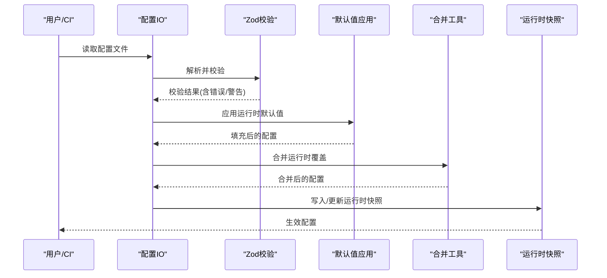
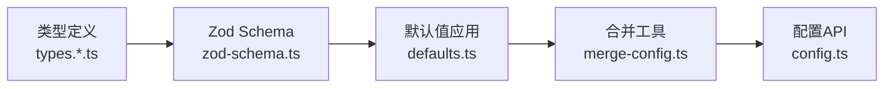

# 配置文件结构

<cite>
**本文引用的文件**
- [src/config/zod-schema.ts](file://src/config/zod-schema.ts)
- [src/config/types.openclaw.ts](file://src/config/types.openclaw.ts)
- [src/config/types.base.ts](file://src/config/types.base.ts)
- [src/config/types.agents.ts](file://src/config/types.agents.ts)
- [src/config/types.channels.ts](file://src/config/types.channels.ts)
- [src/config/types.plugins.ts](file://src/config/types.plugins.ts)
- [src/config/defaults.ts](file://src/config/defaults.ts)
- [src/config/merge-config.ts](file://src/config/merge-config.ts)
- [src/config/config.ts](file://src/config/config.ts)
</cite>

## 目录

1. [简介](#简介)
2. [项目结构](#项目结构)
3. [核心组件](#核心组件)
4. [架构总览](#架构总览)
5. [详细组件分析](#详细组件分析)
6. [依赖关系分析](#依赖关系分析)
7. [性能考量](#性能考量)
8. [故障排查指南](#故障排查指南)
9. [结论](#结论)
10. [附录](#附录)

## 简介

本文件系统性阐述 OpenClaw 配置文件的整体结构与层次关系，覆盖根对象的全部属性、子模块（如代理、通道、插件、网关等）的配置项、字段类型、默认值、校验规则、版本兼容与迁移策略，并提供示例模板与最佳实践建议。目标是帮助开发者与运维人员快速理解并正确编写配置文件。

## 项目结构

OpenClaw 的配置体系由“根配置对象”和多个“子模块配置段”组成，采用强类型定义与 Zod Schema 校验相结合的方式实现。核心文件组织如下：

- 根配置类型：OpenClawConfig
- 子模块类型：agents、channels、plugins、gateway、memory、skills、models、tools、hooks、cron、web、browser、ui、auth、secrets、acp、nodeHost、messages、commands、approvals、session、diagnostics、logging、update、wizard、discovery、canvasHost、talk、bindings、broadcast、audio、media
- 校验与默认值：Zod Schema 定义 + 运行时默认值应用函数
- 合并与写入：合并工具与 IO 工具

```mermaid
graph TB
Root["根配置<br/>OpenClawConfig"] --> Meta["meta<br/>元信息"]
Root --> Env["env<br/>环境变量"]
Root --> Wizard["wizard<br/>向导运行记录"]
Root --> Diagnostics["diagnostics<br/>诊断"]
Root --> Logging["logging<br/>日志"]
Root --> Update["update<br/>更新策略"]
Root --> Browser["browser<br/>浏览器"]
Root --> UI["ui<br/>界面"]
Root --> Secrets["secrets<br/>密钥"]
Root --> Auth["auth<br/>认证"]
Root --> ACP["acp<br/>会话编排"]
Root --> Models["models<br/>模型"]
Root --> NodeHost["nodeHost<br/>节点主机"]
Root --> Agents["agents<br/>代理"]
Root --> Tools["tools<br/>工具"]
Root --> Bindings["bindings<br/>绑定"]
Root --> Broadcast["broadcast<br/>广播"]
Root --> Audio["audio<br/>音频"]
Root --> Media["media<br/>媒体"]
Root --> Messages["messages<br/>消息"]
Root --> Commands["commands<br/>命令"]
Root --> Approvals["approvals<br/>审批"]
Root --> Session["session<br/>会话"]
Root --> Web["web<br/>Web"]
Root --> Channels["channels<br/>通道"]
Root --> Cron["cron<br/>定时任务"]
Root --> Hooks["hooks<br/>钩子"]
Root --> Discovery["discovery<br/>发现"]
Root --> CanvasHost["canvasHost<br/>画布宿主"]
Root --> Talk["talk<br/>语音合成"]
Root --> Gateway["gateway<br/>网关"]
Root --> Memory["memory<br/>记忆"]
Root --> Skills["skills<br/>技能"]
Root --> Plugins["plugins<br/>插件"]
```

图表来源

- [src/config/types.openclaw.ts](file://src/config/types.openclaw.ts#L30-L115)
- [src/config/zod-schema.ts](file://src/config/zod-schema.ts#L131-L782)

章节来源

- [src/config/types.openclaw.ts](file://src/config/types.openclaw.ts#L30-L115)
- [src/config/zod-schema.ts](file://src/config/zod-schema.ts#L131-L782)

## 核心组件

- 根配置对象 OpenClawConfig：定义顶层键集合与各子模块的类型约束
- Zod Schema：对每个子模块进行严格类型与范围校验，支持默认值注入与转换
- 默认值应用：在运行时为未显式设置的字段填充合理默认值
- 合并与写入：提供按段落合并与写回配置的能力

章节来源

- [src/config/config.ts](file://src/config/config.ts#L1-L25)
- [src/config/defaults.ts](file://src/config/defaults.ts#L1-L537)
- [src/config/merge-config.ts](file://src/config/merge-config.ts#L1-L39)

## 架构总览

下图展示配置文件从解析到生效的关键流程：解析 JSON/JSON5 → Zod 校验 → 应用默认值 → 合并运行时覆盖 → 写入持久化。

图表来源

- [src/config/zod-schema.ts](file://src/config/zod-schema.ts#L1-L20)
- [src/config/defaults.ts](file://src/config/defaults.ts#L1-L50)
- [src/config/merge-config.ts](file://src/config/merge-config.ts#L1-L39)
- [src/config/config.ts](file://src/config/config.ts#L1-L25)

## 详细组件分析

### 根配置 OpenClawConfig

- 作用：承载所有配置键的顶层容器，包含元数据、环境、诊断、日志、更新、浏览器、UI、密钥、认证、会话编排、模型、节点主机、代理、工具、绑定、广播、音频、媒体、消息、命令、审批、会话、Web、通道、定时任务、钩子、发现、画布宿主、语音合成、网关、记忆、技能、插件等。
- 关键点：
  - 所有键均为可选，允许渐进式增量配置
  - 大部分子模块使用独立 Zod Schema 进行强约束
  - 提供 ConfigFileSnapshot 用于记录解析、校验、默认值应用前后的状态

章节来源

- [src/config/types.openclaw.ts](file://src/config/types.openclaw.ts#L30-L115)

### 元信息 meta

- 字段
  - lastTouchedVersion: 最后写入该配置的 OpenClaw 版本
  - lastTouchedAt: 最后写入时间（字符串或数值时间戳，会被自动规范化为 ISO）
- 类型与默认
  - lastTouchedVersion: 字符串（可选）
  - lastTouchedAt: 字符串或数字（可选），Zod 校验会将数字时间戳转换为 ISO 字符串
- 校验规则
  - 数字时间戳需可转换为有效日期

章节来源

- [src/config/zod-schema.ts](file://src/config/zod-schema.ts#L134-L154)

### 环境 env

- 字段
  - shellEnv.enabled: 是否从登录 shell 导入环境变量
  - shellEnv.timeoutMs: 登录 shell 执行超时（毫秒）
  - vars: 内联环境变量映射
  - 顶层键支持字符串/对象/嵌套对象（catchall）
- 类型与默认
  - shellEnv.enabled: 布尔（可选）
  - shellEnv.timeoutMs: 整数（非负，可选）
  - vars: 键值对字符串映射（可选）

章节来源

- [src/config/zod-schema.ts](file://src/config/zod-schema.ts#L155-L167)
- [src/config/types.base.ts](file://src/config/types.base.ts#L168-L179)

### 向导 wizard

- 字段
  - lastRunAt: 上次运行时间
  - lastRunVersion: 上次运行版本
  - lastRunCommit: 上次运行提交
  - lastRunCommand: 上次运行命令
  - lastRunMode: 上次运行模式（local/remote）
- 类型与默认
  - 字符串（可选）

章节来源

- [src/config/zod-schema.ts](file://src/config/zod-schema.ts#L168-L177)

### 诊断 diagnostics

- 字段
  - enabled: 是否启用诊断
  - flags: 诊断标志数组
  - otel.enabled/endpoint/protocol/headers/serviceName/traces/metrics/logs/sampleRate/flushIntervalMs
  - cacheTrace.enabled/filePath/includeMessages/includePrompt/includeSystem
- 类型与默认
  - enabled: 布尔（可选）
  - otel: 对象（可选），协议枚举限定
  - cacheTrace: 对象（可选）

章节来源

- [src/config/zod-schema.ts](file://src/config/zod-schema.ts#L178-L209)

### 日志 logging

- 字段
  - level/consoleLevel: 日志级别枚举（silent/fatal/error/warn/info/debug/trace）
  - file/maxFileBytes: 文件路径与单文件最大字节
  - consoleStyle: pretty/compact/json
  - redactSensitive: off/tools
  - redactPatterns: 正则表达式数组
- 类型与默认
  - level/consoleLevel: 枚举（可选）
  - maxFileBytes: 正整数（可选）
  - redactSensitive: 枚举（可选），默认为 "tools"

章节来源

- [src/config/zod-schema.ts](file://src/config/zod-schema.ts#L210-L223)
- [src/config/types.base.ts](file://src/config/types.base.ts#L168-L179)
- [src/config/defaults.ts](file://src/config/defaults.ts#L390-L405)

### 更新 update

- 字段
  - channel: 稳定/测试/开发通道
  - checkOnStart: 是否在启动时检查更新
  - auto.enabled: 是否启用自动更新
  - auto.stableDelayHours/stableJitterHours/betaCheckIntervalHours: 自动更新窗口与时序参数
- 类型与默认
  - channel: 枚举（可选）
  - auto: 对象（可选），数值范围受约束

章节来源

- [src/config/zod-schema.ts](file://src/config/zod-schema.ts#L224-L239)

### 浏览器 browser

- 字段
  - enabled/evaluateEnabled/cdpUrl/remoteCdpTimeoutMs/remoteCdpHandshakeTimeoutMs/color/executablePath/headless/noSandbox/attachOnly/defaultProfile
  - snapshotDefaults.mode
  - ssrfPolicy.allowPrivateNetwork/dangerouslyAllowPrivateNetwork/allowedHostnames/hostnameAllowlist
  - profiles[*].cdpPort/cdpUrl/driver/color
- 类型与默认
  - profiles.\* 校验：必须至少设置 cdpPort 或 cdpUrl；名称正则限制
- 校验规则
  - profiles.\* 必须满足端口/URL二选一
  - 超时/端口等数值范围校验

章节来源

- [src/config/zod-schema.ts](file://src/config/zod-schema.ts#L240-L283)

### 界面 ui

- 字段
  - seamColor: 十六进制颜色
  - assistant.name/avatar: 助手显示名与头像
- 类型与默认
  - seamColor: 字符串（可选）
  - assistant: 对象（可选）

章节来源

- [src/config/zod-schema.ts](file://src/config/zod-schema.ts#L284-L296)

### 密钥 secrets

- 字段
  - 由 SecretsConfigSchema 定义（见 Zod Schema）
- 类型与默认
  - 由专用 Schema 约束

章节来源

- [src/config/zod-schema.ts](file://src/config/zod-schema.ts#L297-L297)

### 认证 auth

- 字段
  - profiles[*].provider/mode/email
  - order: 供应商优先级映射
  - cooldowns.billingBackoffHours/billingBackoffHoursByProvider/billingMaxHours/failureWindowHours
- 类型与默认
  - profiles: 映射（可选）
  - cooldowns: 对象（可选）

章节来源

- [src/config/zod-schema.ts](file://src/config/zod-schema.ts#L298-L324)

### 会话编排 ACP acp

- 字段
  - enabled/dispatch.enabled/backend/defaultAgent/allowedAgents/maxConcurrentSessions
  - stream.coalesceIdleMs/maxChunkChars
  - runtime.ttlMinutes/installCommand
- 类型与默认
  - 各字段为布尔/整数/字符串（可选）

章节来源

- [src/config/zod-schema.ts](file://src/config/zod-schema.ts#L325-L354)

### 模型 models

- 字段
  - 由 ModelsConfigSchema 定义（见 Zod Schema）
- 类型与默认
  - 由专用 Schema 约束

章节来源

- [src/config/zod-schema.ts](file://src/config/zod-schema.ts#L355-L355)

### 节点主机 nodeHost

- 字段
  - browserProxy.enabled/allowProfiles
- 类型与默认
  - 对象（可选）

章节来源

- [src/config/zod-schema.ts](file://src/config/zod-schema.ts#L356-L356)

### 代理 agents、绑定 bindings、广播 broadcast、音频 audio

- agents
  - defaults: 代理默认行为（并发、心跳、上下文修剪、压缩等）
  - list[*]: 代理清单（id/name/workspace/agentDir/model/skills/memorySearch/humanDelay/identity/groupChat/subagents/sandbox/params/tools）
- bindings
  - agentId + 匹配条件（channel/accountId/peer/guildId/teamId/roles）
- broadcast
  - 代理间广播策略（含策略键与映射）
- audio
  - 音频处理相关配置（见 Zod Schema）
- 类型与默认
  - agents.defaults: 复杂对象（可选）
  - agents.list[*]: 复杂对象数组（可选）
  - bindings: 数组（可选）
  - broadcast: 对象（可选）

章节来源

- [src/config/types.agents.ts](file://src/config/types.agents.ts#L8-L55)
- [src/config/zod-schema.ts](file://src/config/zod-schema.ts#L357-L361)

### 工具 tools

- 字段
  - 由 ToolsSchema 定义（见 Zod Schema）
- 类型与默认
  - 由专用 Schema 约束

章节来源

- [src/config/zod-schema.ts](file://src/config/zod-schema.ts#L358-L358)

### 媒体 media

- 字段
  - preserveFilenames: 是否保留原始文件名
- 类型与默认
  - 布尔（可选）

章节来源

- [src/config/zod-schema.ts](file://src/config/zod-schema.ts#L362-L367)

### 消息 messages、命令 commands、审批 approvals

- messages
  - ackReactionScope 等消息相关策略（见 Zod Schema）
- commands
  - 命令执行策略（见 Zod Schema）
- approvals
  - 审批策略（见 Zod Schema）
- 类型与默认
  - 各自由专用 Schema 约束

章节来源

- [src/config/zod-schema.ts](file://src/config/zod-schema.ts#L368-L371)

### 会话 session

- 字段
  - scope/dmScope/identityLinks/resetTriggers/idleMinutes/reset/resetByType/resetByChannel/store/typingIntervalSeconds/typingMode/parentForkMaxTokens/mainKey/sendPolicy.agentToAgent.maxPingPongTurns/threadBindings.maintenance.\*
- 类型与默认
  - 复杂对象（可选），含维护策略、磁盘预算、轮转等

章节来源

- [src/config/types.base.ts](file://src/config/types.base.ts#L105-L166)
- [src/config/zod-schema.ts](file://src/config/zod-schema.ts#L371-L371)

### Web web

- 字段
  - enabled/heartbeatSeconds/reconnect.initialMs/maxMs/factor/jitter/maxAttempts
- 类型与默认
  - 对象（可选）

章节来源

- [src/config/zod-schema.ts](file://src/config/zod-schema.ts#L432-L448)

### 通道 channels 及扩展通道

- 字段
  - defaults.groupPolicy/heartbeat
  - modelByChannel: 通道维度模型覆盖映射
  - 内置通道：whatsapp/telegram/discord/irc/googlechat/slack/signal/imessage/msteams
  - 扩展通道：动态键，使用 ExtensionChannelConfig 作为起点
- 类型与默认
  - 对象（可选），扩展通道支持任意键

章节来源

- [src/config/types.channels.ts](file://src/config/types.channels.ts#L44-L60)
- [src/config/zod-schema.ts](file://src/config/zod-schema.ts#L449-L449)

### 定时任务 cron

- 字段
  - enabled/store/maxConcurrentRuns/webhook/webhookToken/sessionRetention.runLog.maxBytes/keepLines
- 校验规则
  - sessionRetention 支持 ms/s/m/h/d
  - runLog.maxBytes 支持 b/kb/mb/gb/tb

章节来源

- [src/config/zod-schema.ts](file://src/config/zod-schema.ts#L372-L413)

### 钩子 hooks

- 字段
  - enabled/path/token/defaultSessionKey/allowRequestSessionKey/allowedSessionKeyPrefixes/allowedAgentIds/maxBodyBytes/presets/transformsDir/mappings/gmail/internal
- 类型与默认
  - 对象（可选）

章节来源

- [src/config/zod-schema.ts](file://src/config/zod-schema.ts#L414-L431)

### 发现 discovery

- 字段
  - wideArea.enabled
  - mdns.mode: off/minimal/full
- 类型与默认
  - 对象（可选）

章节来源

- [src/config/zod-schema.ts](file://src/config/zod-schema.ts#L450-L466)

### 画布宿主 canvasHost

- 字段
  - enabled/root/port/liveReload
- 类型与默认
  - 对象（可选）

章节来源

- [src/config/zod-schema.ts](file://src/config/zod-schema.ts#L467-L475)

### 语音合成 talk

- 字段
  - provider/providers[*].voiceId/voiceAliases/modelId/outputFormat/apiKey/interruptOnSpeech
  - 兼容旧版 apiKey
- 类型与默认
  - 对象（可选）

章节来源

- [src/config/zod-schema.ts](file://src/config/zod-schema.ts#L476-L501)

### 网关 gateway

- 字段
  - port/mode/bind/customBindHost/controlUi.\*（enabled/basePath/root/allowedOrigins/...）
  - auth.mode/token/password/allowTailscale/rateLimit.userHeader/requiredHeaders/allowUsers/trustedProxy
  - trustedProxies/allowRealIpFallback/tools.{deny,allow}
  - channelHealthCheckMinutes/tailscale.mode/resetOnExit
  - remote.url/transport/token/password/tlsFingerprint/sshTarget/sshIdentity
  - reload.mode/debounceMs
  - tls.enabled/autoGenerate/certPath/keyPath/caPath
  - http.endpoints.chatCompletions.responses.\*（maxBodyBytes/maxUrlParts/files/images/pdf 等）
  - http.securityHeaders.strictTransportSecurity
  - nodes.browser.mode/node/allowCommands/denyCommands
- 类型与默认
  - 复杂对象（可选），大量子对象与枚举

章节来源

- [src/config/zod-schema.ts](file://src/config/zod-schema.ts#L502-L692)

### 记忆 memory

- 字段
  - backend:citations:auto/on/off/qmd.\*
- 类型与默认
  - 对象（可选）

章节来源

- [src/config/zod-schema.ts](file://src/config/zod-schema.ts#L693-L693)

### 技能 skills

- 字段
  - allowBundled/load.extraDirs/watch/watchDebounceMs/install.preferBrew/nodeManager
  - limits.maxCandidatesPerRoot/maxSkillsLoadedPerSource/maxSkillsInPrompt/maxSkillsPromptChars/maxSkillFileBytes
  - entries[*].enabled/apiKey/env/config
- 类型与默认
  - 对象（可选）

章节来源

- [src/config/zod-schema.ts](file://src/config/zod-schema.ts#L694-L740)

### 插件 plugins

- 字段
  - enabled/allow/deny/load.paths/slots.memory/entries[*].enabled/config/installs[*]
- 类型与默认
  - 对象（可选）

章节来源

- [src/config/types.plugins.ts](file://src/config/types.plugins.ts#L18-L31)
- [src/config/zod-schema.ts](file://src/config/zod-schema.ts#L740-L781)

## 依赖关系分析

- 类型聚合：OpenClawConfig 聚合来自各模块的类型定义
- 校验链路：Zod Schema 逐层校验，内置转换与默认值注入
- 默认值应用：defaults.ts 提供多处默认值填充逻辑，确保最小可用配置
- 合并与写入：merge-config.ts 提供按段落合并能力，配合 config.ts 暴露的 IO 接口完成写入

图表来源

- [src/config/types.openclaw.ts](file://src/config/types.openclaw.ts#L1-L35)
- [src/config/zod-schema.ts](file://src/config/zod-schema.ts#L1-L20)
- [src/config/defaults.ts](file://src/config/defaults.ts#L1-L50)
- [src/config/merge-config.ts](file://src/config/merge-config.ts#L1-L39)
- [src/config/config.ts](file://src/config/config.ts#L1-L25)

章节来源

- [src/config/types.openclaw.ts](file://src/config/types.openclaw.ts#L1-L35)
- [src/config/zod-schema.ts](file://src/config/zod-schema.ts#L1-L20)
- [src/config/defaults.ts](file://src/config/defaults.ts#L1-L50)
- [src/config/merge-config.ts](file://src/config/merge-config.ts#L1-L39)
- [src/config/config.ts](file://src/config/config.ts#L1-L25)

## 性能考量

- 日志文件大小与轮转：通过 maxFileBytes 与 session.maintenance.rotateBytes 控制，避免磁盘膨胀
- 会话维护：pruneAfter/maxEntries/highWaterBytes 等参数影响内存与磁盘占用
- 网关安全与限流：auth.rateLimit 与 http.securityHeaders 可降低资源滥用风险
- 浏览器 SSRF 与端口范围：ssrfPolicy 与端口范围校验减少网络攻击面

## 故障排查指南

- 校验失败
  - 使用 ConfigFileSnapshot 中的 issues/warnings/legacyIssues 字段定位问题
  - 常见问题：数值越界、URL 协议不匹配、时间戳格式错误、profiles.\* 缺少必要字段
- 默认值与兼容
  - 若某些字段缺失导致行为异常，检查 defaults.ts 的默认值应用逻辑
  - cron.sessionRetention/runLog.maxBytes 需符合解析规则
- 合并与覆盖
  - 使用 merge-config.ts 的 mergeConfigSection/mergeWhatsAppConfig 精确合并特定段落
- 写入与快照
  - 通过 config.ts 暴露的 IO 接口读取/写入配置，结合快照核对解析与默认值应用前后差异

章节来源

- [src/config/zod-schema.ts](file://src/config/zod-schema.ts#L389-L412)
- [src/config/merge-config.ts](file://src/config/merge-config.ts#L8-L39)
- [src/config/config.ts](file://src/config/config.ts#L1-L25)

## 结论

OpenClaw 的配置体系以强类型与 Zod Schema 为基础，辅以运行时默认值与合并工具，形成“可读、可校验、可演进”的配置生态。遵循本文档的键列表、类型与默认值说明，可显著降低配置复杂度与出错率。

## 附录

### 配置键完整清单（按模块）

- 根键：meta、env、wizard、diagnostics、logging、update、browser、ui、secrets、auth、acp、models、nodeHost、agents、tools、bindings、broadcast、audio、media、messages、commands、approvals、session、web、channels、cron、hooks、discovery、canvasHost、talk、gateway、memory、skills、plugins
- 子模块键详见各类型文件与 Zod Schema 定义

章节来源

- [src/config/types.openclaw.ts](file://src/config/types.openclaw.ts#L30-L115)
- [src/config/zod-schema.ts](file://src/config/zod-schema.ts#L131-L782)

### JSON Schema 定义与验证规则

- Zod Schema 覆盖字段类型、枚举、范围、URL 协议、时间戳转换、超时/端口/字节解析等
- 示例规则
  - 时间戳：数字时间戳自动转换为 ISO 字符串
  - URL：仅允许 http/https
  - cron.sessionRetention/runLog.maxBytes：支持带单位的字符串解析
  - browser.profiles：cdpPort 与 cdpUrl 二选一且名称正则校验

章节来源

- [src/config/zod-schema.ts](file://src/config/zod-schema.ts#L131-L412)

### 默认值与兼容性

- 默认值来源
  - logging.redactSensitive 默认为 "tools"
  - agents.defaults.maxConcurrent/subagents.maxConcurrent 默认值
  - talk.apiKey 与 providers.apiKey 的兼容填充
  - models.provider.api 与模型字段的默认推断
- 兼容性
  - 旧版配置检测与迁移（legacy-migrate）
  - 运行时快照与写回机制保证变更可追踪

章节来源

- [src/config/defaults.ts](file://src/config/defaults.ts#L390-L537)
- [src/config/config.ts](file://src/config/config.ts#L14-L14)

### 示例模板与最佳实践

- 模板建议
  - 从 minimal 配置开始：至少设置 logging.level、gateway.port、channels.\*.enabled
  - 明确会话与日志策略：设置 session.reset、logging.maxFileBytes、session.maintenance.\*
  - 网关安全：启用 auth.mode 并配置 rateLimit/trustedProxy
  - 浏览器与 SSRF：根据需要开启 browser.\* 与 ssrfPolicy
- 最佳实践
  - 将敏感信息放入 secrets 并通过 env.vars 引入
  - 使用 cron.sessionRetention 与 runLog.maxBytes 控制历史数据规模
  - 为不同通道设置合理的 groupPolicy/dmPolicy
  - 启用 diagnostics.otel 以便问题定位

[本节为通用指导，不直接分析具体文件]
