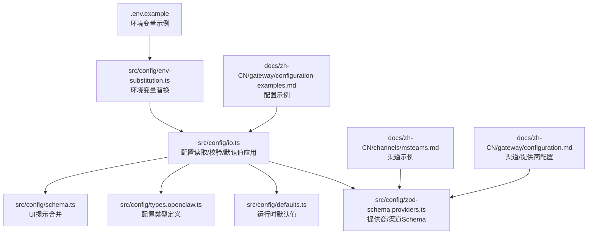
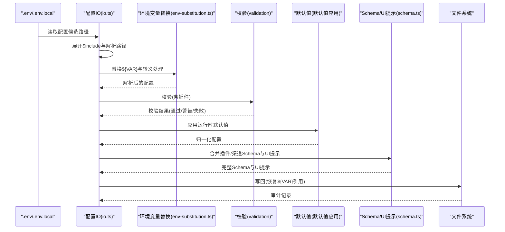
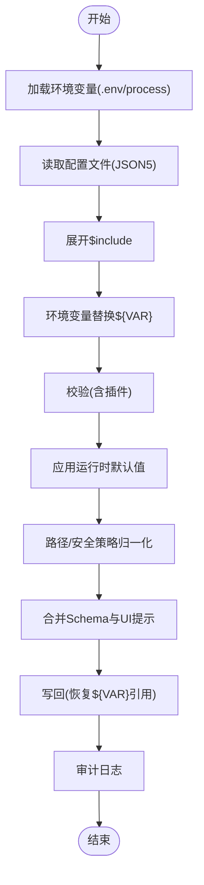
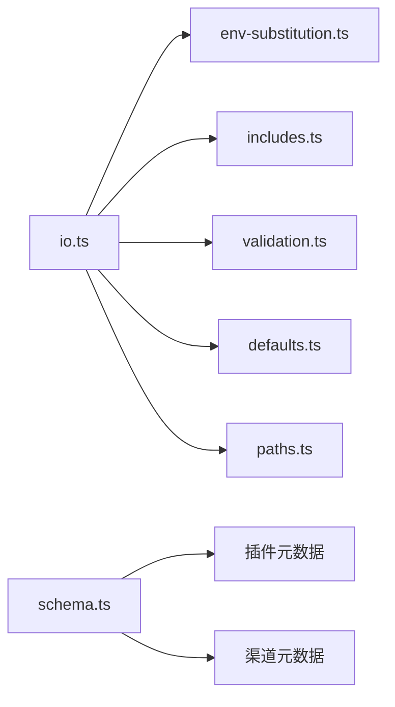

# 配置模板与示例

<cite>
**本文引用的文件**
- [.env.example](file://.env.example)
- [src/config/io.ts](file://src/config/io.ts)
- [src/config/env-substitution.ts](file://src/config/env-substitution.ts)
- [src/config/env-preserve.ts](file://src/config/env-preserve.ts)
- [src/config/defaults.ts](file://src/config/defaults.ts)
- [src/config/types.openclaw.ts](file://src/config/types.openclaw.ts)
- [src/config/schema.ts](file://src/config/schema.ts)
- [src/config/zod-schema.providers.ts](file://src/config/zod-schema.providers.ts)
- [docs/zh-CN/gateway/configuration-examples.md](file://docs/zh-CN/gateway/configuration-examples.md)
- [docs/zh-CN/channels/msteams.md](file://docs/zh-CN/channels/msteams.md)
- [docs/zh-CN/gateway/configuration.md](file://docs/zh-CN/gateway/configuration.md)
- [src/gateway/protocol/schema/config.ts](file://src/gateway/protocol/schema/config.ts)
</cite>

## 目录

1. [简介](#简介)
2. [项目结构](#项目结构)
3. [核心组件](#核心组件)
4. [架构总览](#架构总览)
5. [详细组件分析](#详细组件分析)
6. [依赖关系分析](#依赖关系分析)
7. [性能考量](#性能考量)
8. [故障排查指南](#故障排查指南)
9. [结论](#结论)
10. [附录](#附录)

## 简介

本文件系统化整理 OpenClaw 的配置模板与示例，覆盖个人使用、团队协作、生产环境三大场景，并提供完整配置要点、自定义方法、最佳实践、版本管理与更新策略，以及常见配置模式与组合示例。内容以仓库中实际实现与文档为基础，确保可落地、可复用、可演进。

## 项目结构

围绕“配置”主题，OpenClaw 的相关实现与文档主要分布在以下位置：

- 环境变量与配置加载：src/config/io.ts、src/config/env-substitution.ts、src/config/env-preserve.ts
- 配置类型与默认值：src/config/types.openclaw.ts、src/config/defaults.ts
- 配置模式与 UI 提示：src/config/schema.ts、src/gateway/protocol/schema/config.ts
- 渠道与提供商配置示例：docs/zh-CN/gateway/configuration-examples.md、docs/zh-CN/channels/msteams.md、docs/zh-CN/gateway/configuration.md
- 环境变量示例：.env.example

图表来源

- [src/config/io.ts](file://src/config/io.ts#L673-L800)
- [src/config/env-substitution.ts](file://src/config/env-substitution.ts#L1-L49)
- [src/config/env-preserve.ts](file://src/config/env-preserve.ts#L1-L38)
- [src/config/defaults.ts](file://src/config/defaults.ts#L1-L537)
- [src/config/types.openclaw.ts](file://src/config/types.openclaw.ts#L1-L145)
- [src/config/zod-schema.providers.ts](file://src/config/zod-schema.providers.ts#L1-L47)
- [src/config/schema.ts](file://src/config/schema.ts#L141-L271)
- [docs/zh-CN/gateway/configuration-examples.md](file://docs/zh-CN/gateway/configuration-examples.md)
- [docs/zh-CN/channels/msteams.md](file://docs/zh-CN/channels/msteams.md#L56-L97)
- [docs/zh-CN/gateway/configuration.md](file://docs/zh-CN/gateway/configuration.md#L1192-L1229)

章节来源

- [src/config/io.ts](file://src/config/io.ts#L673-L800)
- [.env.example](file://.env.example#L1-L81)

## 核心组件

- 配置读取与环境变量处理
  - 加载顺序与优先级：进程环境变量 > .env 文件 > 用户家目录配置 > openclaw.json 内 env 块；已存在的非空进程变量不会被 dotenv 覆盖。
  - 环境变量替换：支持 ${VAR} 语法，大小写与下划线命名规范；可转义为字面量。
  - 写回保护：对写回配置进行环境变量引用恢复，避免丢失敏感占位符。
- 类型与默认值
  - 统一的 OpenClawConfig 类型定义，覆盖认证、网关、渠道、模型、工具、插件、会话、日志、更新等模块。
  - 运行时默认值应用：消息、会话、模型、代理并发、日志脱敏、心跳与上下文修剪、压缩策略等。
- 配置模式与 UI 提示
  - 通过 JSON Schema 与 UI Hints 合并，生成可渲染的配置表单与帮助信息。
  - 渠道与插件各自注入 configSchema 与 uiHints，统一到根 schema。

章节来源

- [src/config/io.ts](file://src/config/io.ts#L673-L800)
- [src/config/env-substitution.ts](file://src/config/env-substitution.ts#L1-L49)
- [src/config/env-preserve.ts](file://src/config/env-preserve.ts#L1-L38)
- [src/config/types.openclaw.ts](file://src/config/types.openclaw.ts#L30-L115)
- [src/config/defaults.ts](file://src/config/defaults.ts#L144-L537)
- [src/config/schema.ts](file://src/config/schema.ts#L141-L271)

## 架构总览

下图展示从环境变量到最终运行配置的关键流程：读取、包含展开、环境变量替换、校验、默认值填充、路径与安全策略归一化、写回保护与审计。

图表来源

- [src/config/io.ts](file://src/config/io.ts#L673-L800)
- [src/config/env-substitution.ts](file://src/config/env-substitution.ts#L1-L49)
- [src/config/env-preserve.ts](file://src/config/env-preserve.ts#L1-L38)
- [src/config/schema.ts](file://src/config/schema.ts#L141-L271)

## 详细组件分析

### 个人使用场景模板

适用人群：开发者或个人用户，关注易用性与最小权限。

- 关键特性
  - 最小化启用：仅开启所需渠道与模型。
  - 环境变量优先：通过 .env.example 模板设置 OPENAI_API_KEY、渠道令牌等。
  - 网关鉴权：建议启用 OPENCLAW_GATEWAY_TOKEN 或密码模式。
  - 日志与会话：默认脱敏敏感信息，会话主键固定为主会话。
- 推荐配置要点
  - 渠道：telegram 或 discord，按需开启 webhook/应用令牌。
  - 模型：选择一个主流提供商作为默认模型源。
  - 工具：按需启用搜索、语音合成等工具。
- 示例参考
  - 渠道最小示例：参见 Microsoft Teams 最小配置示例。
  - 渠道通用示例：参见网关配置示例文档。

章节来源

- [.env.example](file://.env.example#L1-L81)
- [docs/zh-CN/channels/msteams.md](file://docs/zh-CN/channels/msteams.md#L56-L97)
- [docs/zh-CN/gateway/configuration-examples.md](file://docs/zh-CN/gateway/configuration-examples.md)

### 团队协作场景模板

适用人群：小型团队或部门，强调访问控制与可审计性。

- 关键特性
  - 明确的访问控制：私信/群组/频道策略，结合 allowFrom 白名单。
  - 多账号/多租户：提供商与渠道支持多账号配置。
  - 配置写入：允许通过命令行写入配置，便于集中管理。
- 推荐配置要点
  - 渠道：teams/slack/discord，设置 groupPolicy 与 allowFrom。
  - 网关：启用鉴权与只读/可写开关，限制配置写入范围。
  - 日志：开启审计日志，定期轮转备份。
- 示例参考
  - Teams 配置示例与写入说明。
  - Google Chat Webhook 配置示例。

章节来源

- [docs/zh-CN/channels/msteams.md](file://docs/zh-CN/channels/msteams.md#L56-L97)
- [docs/zh-CN/gateway/configuration.md](file://docs/zh-CN/gateway/configuration.md#L1192-L1229)

### 生产环境场景模板

适用人群：企业级部署，强调稳定性、可观测性与合规。

- 关键特性
  - 稳定通道与自动更新：更新通道与检查策略，后台自动更新。
  - 安全与合规：最小权限原则、环境变量引用保护、路径与执行安全策略归一化。
  - 可观测性：日志级别、脱敏策略、会话维护扩展、健康检查。
- 推荐配置要点
  - 更新：稳定通道与延迟/抖动参数，避免同时更新。
  - 安全：禁止明文硬编码密钥，使用环境变量与只读文件。
  - 监控：启用诊断与健康检查，配置告警阈值。
- 示例参考
  - 更新策略与自动更新配置。
  - 代理并发与会话维护默认值。

章节来源

- [src/config/types.openclaw.ts](file://src/config/types.openclaw.ts#L64-L80)
- [src/config/defaults.ts](file://src/config/defaults.ts#L349-L388)

### 配置模块与数据流

- 环境变量与配置文件
  - 环境变量来源与优先级、${VAR} 替换与转义、写回时恢复引用。
- 配置类型与默认值
  - OpenClawConfig 类型覆盖各子系统；运行时默认值统一规范化。
- Schema 与 UI 提示
  - 插件与渠道注入 configSchema 与 uiHints，合并到根 schema，用于渲染表单与帮助。

图表来源

- [src/config/io.ts](file://src/config/io.ts#L673-L800)
- [src/config/env-substitution.ts](file://src/config/env-substitution.ts#L1-L49)
- [src/config/env-preserve.ts](file://src/config/env-preserve.ts#L1-L38)
- [src/config/defaults.ts](file://src/config/defaults.ts#L144-L537)
- [src/config/schema.ts](file://src/config/schema.ts#L141-L271)

章节来源

- [src/config/env-substitution.ts](file://src/config/env-substitution.ts#L1-L49)
- [src/config/env-preserve.ts](file://src/config/env-preserve.ts#L1-L38)
- [src/config/defaults.ts](file://src/config/defaults.ts#L144-L537)
- [src/config/schema.ts](file://src/config/schema.ts#L141-L271)

### 渠道与提供商配置要点

- 渠道通用
  - 开启/禁用、Webhook 端口与路径、私信/群组策略、媒体大小限制、动作与输入前缀等。
- 提供商通用
  - 支持多提供商、模型别名、成本与上下文窗口、最大输出长度、API 类型等。
- 示例参考
  - Teams 最小配置与写入说明。
  - Google Chat Webhook 配置与环境变量回退。

章节来源

- [docs/zh-CN/channels/msteams.md](file://docs/zh-CN/channels/msteams.md#L56-L97)
- [docs/zh-CN/gateway/configuration.md](file://docs/zh-CN/gateway/configuration.md#L1192-L1229)
- [src/config/zod-schema.providers.ts](file://src/config/zod-schema.providers.ts#L25-L47)

## 依赖关系分析

- 组件耦合
  - 配置 IO 依赖环境变量替换、包含展开、校验、默认值与路径归一化。
  - Schema 合并依赖插件与渠道元数据，形成统一 UI 表单。
- 外部依赖
  - JSON5 解析、文件系统、进程环境变量、登录 shell 环境导入。
- 循环依赖
  - 未发现直接循环；各模块职责清晰，通过类型与函数边界隔离。

图表来源

- [src/config/io.ts](file://src/config/io.ts#L673-L800)
- [src/config/env-substitution.ts](file://src/config/env-substitution.ts#L1-L49)
- [src/config/schema.ts](file://src/config/schema.ts#L141-L271)

章节来源

- [src/config/io.ts](file://src/config/io.ts#L673-L800)
- [src/config/schema.ts](file://src/config/schema.ts#L141-L271)

## 性能考量

- 配置加载
  - 包含展开与环境变量替换为 O(n) 级别扫描；建议减少深层嵌套与过多包含文件。
- 默认值应用
  - 运行时默认值仅在必要时修改，避免重复写回；注意大型数组/对象的深拷贝成本。
- 写回保护
  - 恢复 ${VAR} 引用时进行路径遍历与映射查找，建议保持配置结构扁平化以降低复杂度。
- 并发与会话
  - 代理并发与子代理并发默认值可按资源情况调整，避免过度并发导致资源争用。

## 故障排查指南

- 环境变量缺失
  - 现象：启动时报错提示缺少引用的环境变量。
  - 处理：检查 .env 与进程环境变量；确认大小写与命名规范；使用转义避免误替换。
- 配置无效或被忽略
  - 现象：配置项未生效或被忽略。
  - 处理：检查键名是否正确；确认优先级与合并策略；查看校验警告与错误详情。
- 渠道策略不一致
  - 现象：open 策略与 allowFrom 缺少通配符导致校验失败。
  - 处理：根据提示使用命令行设置 allowFrom 为通配符或切换策略。
- 写回后密钥泄露风险
  - 现象：写回文件中出现明文密钥。
  - 处理：确保使用环境变量引用；利用写回保护机制恢复 ${VAR} 占位符。

章节来源

- [src/config/env-substitution.ts](file://src/config/env-substitution.ts#L29-L37)
- [src/config/io.ts](file://src/config/io.ts#L148-L167)

## 结论

通过本指南，您可以基于 OpenClaw 的配置体系快速搭建适用于个人、团队与生产的模板，并在实践中遵循环境变量优先、最小权限、可审计与可演进的原则。建议结合实际业务场景选择合适的模板，持续优化默认值与安全策略，并建立版本化与变更审计流程。

## 附录

### 配置模板与示例清单

- 个人使用
  - 渠道最小示例：Teams 最小配置。
  - 渠道通用示例：网关配置示例文档。
- 团队协作
  - 渠道最小示例：Teams 最小配置。
  - 渠道通用示例：Google Chat Webhook 配置。
- 生产环境
  - 更新与自动更新：更新通道与检查策略。
  - 代理并发与会话维护：默认值与并发限制。

章节来源

- [docs/zh-CN/channels/msteams.md](file://docs/zh-CN/channels/msteams.md#L56-L97)
- [docs/zh-CN/gateway/configuration-examples.md](file://docs/zh-CN/gateway/configuration-examples.md)
- [docs/zh-CN/gateway/configuration.md](file://docs/zh-CN/gateway/configuration.md#L1192-L1229)
- [src/config/types.openclaw.ts](file://src/config/types.openclaw.ts#L64-L80)
- [src/config/defaults.ts](file://src/config/defaults.ts#L349-L388)

### 自定义方法与最佳实践

- 使用 .env.example 作为模板，仅填写实际使用的键。
- 优先使用环境变量引用，避免在配置文件中硬编码密钥。
- 分层配置：基础配置 + 环境覆盖 + 运行时默认值，确保最小暴露面。
- 渠道与提供商：按需启用，明确策略与白名单，避免开放策略滥用。
- 版本与更新：锁定稳定通道，合理设置自动更新时间窗，避免业务高峰期。

章节来源

- [.env.example](file://.env.example#L1-L81)
- [src/config/io.ts](file://src/config/io.ts#L673-L800)
- [src/config/types.openclaw.ts](file://src/config/types.openclaw.ts#L64-L80)

### 版本管理与更新指南

- 版本标记：每次写入都会更新 meta.lastTouchedVersion 与 lastTouchedAt。
- 跨版本兼容：若配置由新版本生成，当前版本会给出警告，提示潜在差异。
- 更新策略：通过 update.channel 与 update.auto 控制检查与应用节奏。

章节来源

- [src/config/io.ts](file://src/config/io.ts#L562-L588)
- [src/config/types.openclaw.ts](file://src/config/types.openclaw.ts#L31-L36)
- [src/config/types.openclaw.ts](file://src/config/types.openclaw.ts#L64-L80)

### 常见配置模式与组合示例

- 模式一：最小可用
  - 仅启用一个渠道与一个模型提供商，设置必要的令牌与 webhook。
- 模式二：团队协作
  - 多账号/多租户提供商配置；明确私信/群组策略与白名单。
- 模式三：生产就绪
  - 稳定通道自动更新；严格的日志脱敏与审计；并发与会话维护默认值优化。

章节来源

- [docs/zh-CN/channels/msteams.md](file://docs/zh-CN/channels/msteams.md#L56-L97)
- [docs/zh-CN/gateway/configuration.md](file://docs/zh-CN/gateway/configuration.md#L1192-L1229)
- [src/config/defaults.ts](file://src/config/defaults.ts#L349-L388)
