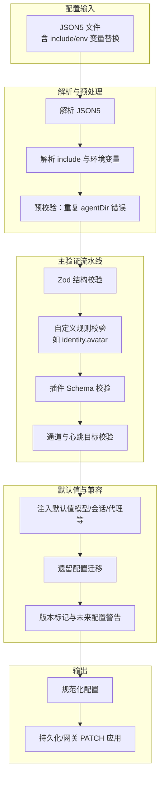
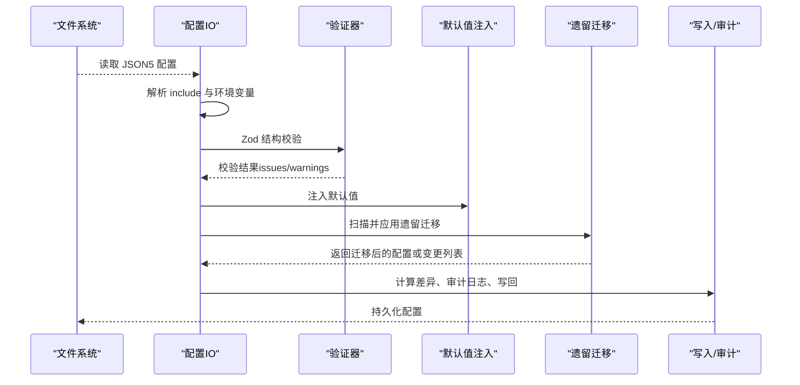
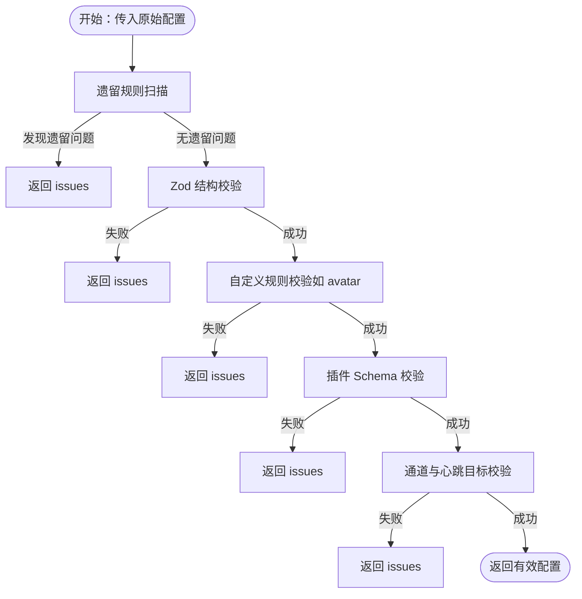
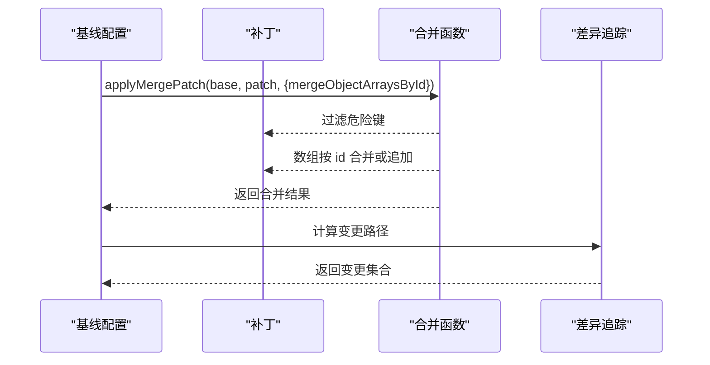
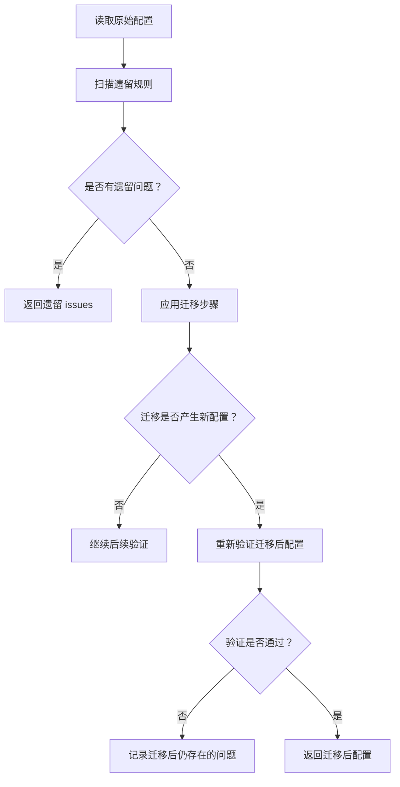
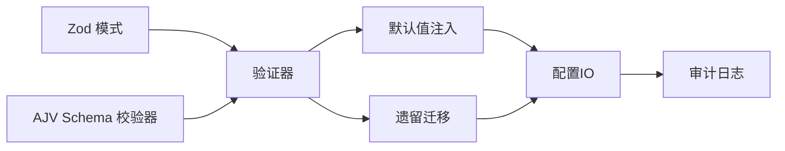

# 配置验证与错误处理

<cite>
**本文档引用的文件**
- [src/config/validation.ts](file://src/config/validation.ts)
- [src/config/zod-schema.ts](file://src/config/zod-schema.ts)
- [src/config/merge-patch.ts](file://src/config/merge-patch.ts)
- [src/config/merge-patch.test.ts](file://src/config/merge-patch.test.ts)
- [src/config/merge-patch.proto-pollution.test.ts](file://src/config/merge-patch.proto-pollution.test.ts)
- [src/config/legacy.ts](file://src/config/legacy.ts)
- [src/config/legacy.migrations.ts](file://src/config/legacy.migrations.ts)
- [src/config/legacy-migrate.ts](file://src/config/legacy-migrate.ts)
- [src/config/defaults.ts](file://src/config/defaults.ts)
- [src/config/agent-dirs.ts](file://src/config/agent-dirs.ts)
- [src/config/io.ts](file://src/config/io.ts)
- [src/plugins/schema-validator.ts](file://src/plugins/schema-validator.ts)
- [src/gateway/server-methods/config.ts](file://src/gateway/server-methods/config.ts)
- [src/logger.ts](file://src/logger.ts)
</cite>

## 目录

1. [简介](#简介)
2. [项目结构](#项目结构)
3. [核心组件](#核心组件)
4. [架构总览](#架构总览)
5. [详细组件分析](#详细组件分析)
6. [依赖关系分析](#依赖关系分析)
7. [性能考量](#性能考量)
8. [故障排查指南](#故障排查指南)
9. [结论](#结论)

## 简介

本文件系统性阐述 OpenClaw 的配置验证与错误处理机制，覆盖以下主题：

- 配置验证流程与规则：数据类型验证、范围检查、依赖关系验证、插件配置校验
- 配置合并与补丁应用：对象数组按 id 合并、原型污染防护、补丁生成与差异追踪
- 冲突解决策略：默认值注入、遗留配置迁移、通道与心跳目标校验
- 配置迁移与向后兼容：遗留规则扫描与自动迁移、版本标记与未来配置警告
- 常见错误诊断与修复：典型问题定位、CLI 指南与修复建议
- 性能与优化：缓存与去重、最小化验证开销、增量写入与审计
- 调试与日志：错误输出格式、审计日志、控制台与文件日志策略

## 项目结构

OpenClaw 的配置子系统由“模式校验（Zod）+ 插件 Schema 校验 + 自定义规则 + 合并与补丁 + 默认值注入 + 迁移与兼容”构成，贯穿读取、写入、网关 PATCH 等关键路径。

图表来源

- [src/config/io.ts](file://src/config/io.ts#L682-L770)
- [src/config/validation.ts](file://src/config/validation.ts#L87-L130)
- [src/config/zod-schema.ts](file://src/config/zod-schema.ts#L131-L150)
- [src/config/defaults.ts](file://src/config/defaults.ts#L213-L347)
- [src/config/legacy.ts](file://src/config/legacy.ts#L27-L43)

章节来源

- [src/config/io.ts](file://src/config/io.ts#L682-L770)
- [src/config/validation.ts](file://src/config/validation.ts#L87-L130)
- [src/config/zod-schema.ts](file://src/config/zod-schema.ts#L131-L150)
- [src/config/defaults.ts](file://src/config/defaults.ts#L213-L347)
- [src/config/legacy.ts](file://src/config/legacy.ts#L27-L43)

## 核心组件

- 验证器与模式：使用 Zod 对顶层结构进行强类型校验，并在插件层使用 AJV Schema 校验插件配置。
- 自定义规则：对特定字段（如身份头像路径）进行业务规则校验。
- 合并与补丁：支持对象数组按 id 合并、原型污染防护、补丁生成与差异追踪。
- 默认值注入：在不改变原始配置的前提下，为缺失字段注入合理默认值。
- 迁移与兼容：扫描遗留配置并执行迁移，同时记录变更。
- 写入与审计：写入前进行差异计算、路径剔除、审计日志记录，确保安全与可追溯。

章节来源

- [src/config/validation.ts](file://src/config/validation.ts#L145-L171)
- [src/config/merge-patch.ts](file://src/config/merge-patch.ts#L62-L97)
- [src/config/defaults.ts](file://src/config/defaults.ts#L144-L168)
- [src/config/legacy.ts](file://src/config/legacy.ts#L5-L25)
- [src/plugins/schema-validator.ts](file://src/plugins/schema-validator.ts#L27-L44)

## 架构总览

下图展示从配置文件到最终可用配置的关键调用链路，包括读取、验证、默认值注入、迁移与写入审计。

图表来源

- [src/config/io.ts](file://src/config/io.ts#L682-L770)
- [src/config/validation.ts](file://src/config/validation.ts#L132-L143)
- [src/config/defaults.ts](file://src/config/defaults.ts#L213-L347)
- [src/config/legacy.ts](file://src/config/legacy.ts#L27-L43)

## 详细组件分析

### 配置验证流程与规则

- 数据类型与范围验证：通过 Zod 模式对顶层结构进行严格校验，包括字符串、数字、布尔、枚举、对象与数组的类型、长度、范围与格式约束。
- 自定义业务规则：例如对身份头像路径进行合法性检查，确保路径在工作区内且符合允许的格式。
- 插件配置校验：加载插件清单与 Schema，逐项校验插件配置；若 Schema 缺失则报错；禁用但存在配置时给出警告。
- 通道与心跳目标校验：动态扩展允许的通道 ID，校验心跳目标是否合法，未知目标给出明确错误信息。

图表来源

- [src/config/validation.ts](file://src/config/validation.ts#L87-L130)
- [src/config/validation.ts](file://src/config/validation.ts#L173-L260)
- [src/config/validation.ts](file://src/config/validation.ts#L418-L446)

章节来源

- [src/config/validation.ts](file://src/config/validation.ts#L87-L130)
- [src/config/validation.ts](file://src/config/validation.ts#L173-L260)
- [src/config/validation.ts](file://src/config/validation.ts#L418-L446)
- [src/config/zod-schema.ts](file://src/config/zod-schema.ts#L131-L150)

### 配置合并与补丁应用机制

- 补丁生成：基于基线与目标配置生成最小补丁，仅包含差异键，避免冗余写入。
- 对象数组按 id 合并：当启用按 id 合并选项时，数组元素以 id 为键进行合并，未提供 id 的条目追加，保证非破坏性更新。
- 原型污染防护：过滤掉危险键（如 **proto**、constructor、prototype），防止原型污染攻击。
- 差异追踪：计算变更路径集合，用于审计与重启决策。

图表来源

- [src/config/merge-patch.ts](file://src/config/merge-patch.ts#L62-L97)
- [src/config/merge-patch.test.ts](file://src/config/merge-patch.test.ts#L33-L181)
- [src/config/merge-patch.proto-pollution.test.ts](file://src/config/merge-patch.proto-pollution.test.ts#L1-L42)

章节来源

- [src/config/merge-patch.ts](file://src/config/merge-patch.ts#L62-L97)
- [src/config/merge-patch.test.ts](file://src/config/merge-patch.test.ts#L33-L181)
- [src/config/merge-patch.proto-pollution.test.ts](file://src/config/merge-patch.proto-pollution.test.ts#L1-L42)

### 冲突解决策略

- 默认值注入：在不修改用户显式配置的情况下，为缺失字段注入合理默认值（模型、会话、代理并发、日志脱敏策略等）。
- 重复 agentDir 检测：在验证前后均检测 agentDir 冲突，避免状态共享导致的认证与令牌问题。
- 插件启用与配置一致性：当插件被禁用但仍保留配置时发出警告；对未知插件 ID 给出提示并区分错误与警告场景。
- 心跳目标与通道校验：动态扩展允许通道集合并校验心跳目标，未知目标直接报错。

章节来源

- [src/config/defaults.ts](file://src/config/defaults.ts#L144-L168)
- [src/config/agent-dirs.ts](file://src/config/agent-dirs.ts#L80-L98)
- [src/config/validation.ts](file://src/config/validation.ts#L310-L378)

### 配置迁移与向后兼容

- 遗留规则扫描：遍历预定义规则，匹配路径与条件，收集遗留问题。
- 自动迁移：对配置进行结构化克隆并依次应用迁移步骤，记录变更；若迁移后仍无效，返回剩余问题供手动修复。
- 版本标记与未来配置警告：写入时为配置打上版本戳，并在读取时比较版本，提示来自未来版本的配置。

图表来源

- [src/config/legacy.ts](file://src/config/legacy.ts#L5-L25)
- [src/config/legacy.migrations.ts](file://src/config/legacy.migrations.ts#L1-L9)
- [src/config/legacy-migrate.ts](file://src/config/legacy-migrate.ts#L5-L19)

章节来源

- [src/config/legacy.ts](file://src/config/legacy.ts#L5-L25)
- [src/config/legacy.migrations.ts](file://src/config/legacy.migrations.ts#L1-L9)
- [src/config/legacy-migrate.ts](file://src/config/legacy-migrate.ts#L5-L19)

### 常见配置错误与诊断

- 通道 ID 未知：当配置中出现未注册的通道 ID 时，校验阶段会报错，需确认插件清单或拼写。
- 心跳目标非法：心跳目标必须是已知通道或特殊值（last/none），否则报错；可通过动态扩展通道集解决。
- 身份头像路径违规：头像路径必须在工作区内或为允许的 URL/DataURL；否则报错。
- 重复 agentDir：多个代理共享同一工作目录会导致状态冲突，需为每个代理分配独立目录。
- 插件不存在或已移除：未知插件 ID 将触发错误或警告，应清理或更新配置。
- 网关 PATCH 失败：网关 PATCH 接口会对补丁进行还原、迁移、验证与差异计算，失败时返回详细 issues。

章节来源

- [src/config/validation.ts](file://src/config/validation.ts#L252-L298)
- [src/config/validation.ts](file://src/config/validation.ts#L318-L341)
- [src/config/validation.ts](file://src/config/validation.ts#L33-L81)
- [src/config/agent-dirs.ts](file://src/config/agent-dirs.ts#L100-L112)
- [src/gateway/server-methods/config.ts](file://src/gateway/server-methods/config.ts#L324-L363)

### 写入与审计流程

- 写入前准备：计算差异路径、剔除指定路径、恢复环境变量引用、生成审计记录。
- 审计日志：记录写入事件、大小变化、元数据与网关模式变化等可疑因素，便于事后分析。
- 安全与回退：写入失败时记录错误码与消息，必要时采用回退策略（如重命名或复制）。

章节来源

- [src/config/io.ts](file://src/config/io.ts#L384-L445)
- [src/config/io.ts](file://src/config/io.ts#L522-L536)
- [src/config/io.ts](file://src/config/io.ts#L141-L167)

## 依赖关系分析

- 验证器依赖 Zod 模式与插件 Schema 校验器（AJV），并通过自定义规则补充业务约束。
- 合并与补丁依赖对象键过滤与数组 id 合并逻辑，确保安全性与一致性。
- 默认值注入与遗留迁移在验证之后执行，保证配置的可用性与兼容性。
- 写入模块依赖差异追踪与审计日志，保障变更可追溯。

图表来源

- [src/config/zod-schema.ts](file://src/config/zod-schema.ts#L131-L150)
- [src/plugins/schema-validator.ts](file://src/plugins/schema-validator.ts#L27-L44)
- [src/config/validation.ts](file://src/config/validation.ts#L132-L143)
- [src/config/defaults.ts](file://src/config/defaults.ts#L213-L347)
- [src/config/legacy.ts](file://src/config/legacy.ts#L27-L43)
- [src/config/io.ts](file://src/config/io.ts#L522-L536)

## 性能考量

- 模式缓存：AJV 校验器对 Schema 进行缓存，避免重复编译，提升插件配置校验性能。
- 最小化验证开销：仅在必要时进行深度校验（如插件配置），并在读取阶段尽早失败以减少后续处理。
- 增量写入与差异追踪：通过补丁生成与差异集合，只写入变更部分，降低 I/O 成本。
- 默认值注入与迁移：在内存中进行结构化克隆与浅拷贝，尽量避免不必要的深拷贝。

章节来源

- [src/plugins/schema-validator.ts](file://src/plugins/schema-validator.ts#L32-L37)
- [src/config/merge-patch.ts](file://src/config/merge-patch.ts#L328-L361)
- [src/config/io.ts](file://src/config/io.ts#L384-L419)

## 故障排查指南

- 读取阶段错误
  - 包含非法 include 或环境变量引用：检查 include 路径与权限、环境变量是否存在。
  - 重复 agentDir：为每个代理设置唯一的工作目录。
  - 无效配置：根据错误详情逐项修正，必要时使用迁移工具。
- 写入阶段错误
  - PATCH 失败：查看返回的 issues 列表，优先修复必填字段与类型错误。
  - 审计日志异常：关注可疑原因（如大小骤降、缺少 meta、移除网关模式），核对变更意图。
- 日志与调试
  - 使用文件日志与控制台日志双重输出，结合调试开关提升可观测性。
  - CLI 提示：针对特定规则（如 open DM 策略）提供修复命令示例。

章节来源

- [src/config/io.ts](file://src/config/io.ts#L682-L770)
- [src/gateway/server-methods/config.ts](file://src/gateway/server-methods/config.ts#L324-L363)
- [src/logger.ts](file://src/logger.ts#L47-L61)

## 结论

OpenClaw 的配置验证与错误处理体系通过“强类型模式 + 自定义规则 + 插件 Schema + 默认值注入 + 遗留迁移 + 安全合并 + 审计日志”的组合，实现了高可靠性与可维护性。遵循本文档的流程与最佳实践，可在保证功能正确的同时，显著降低配置错误带来的风险与排查成本。
