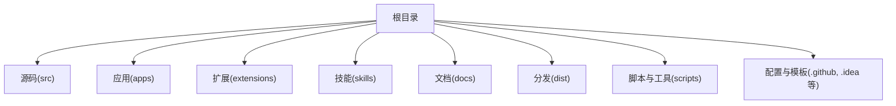
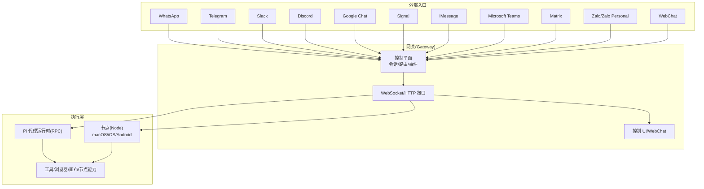
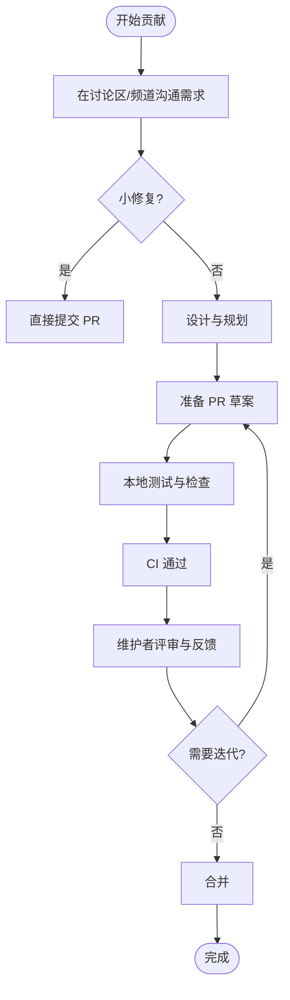
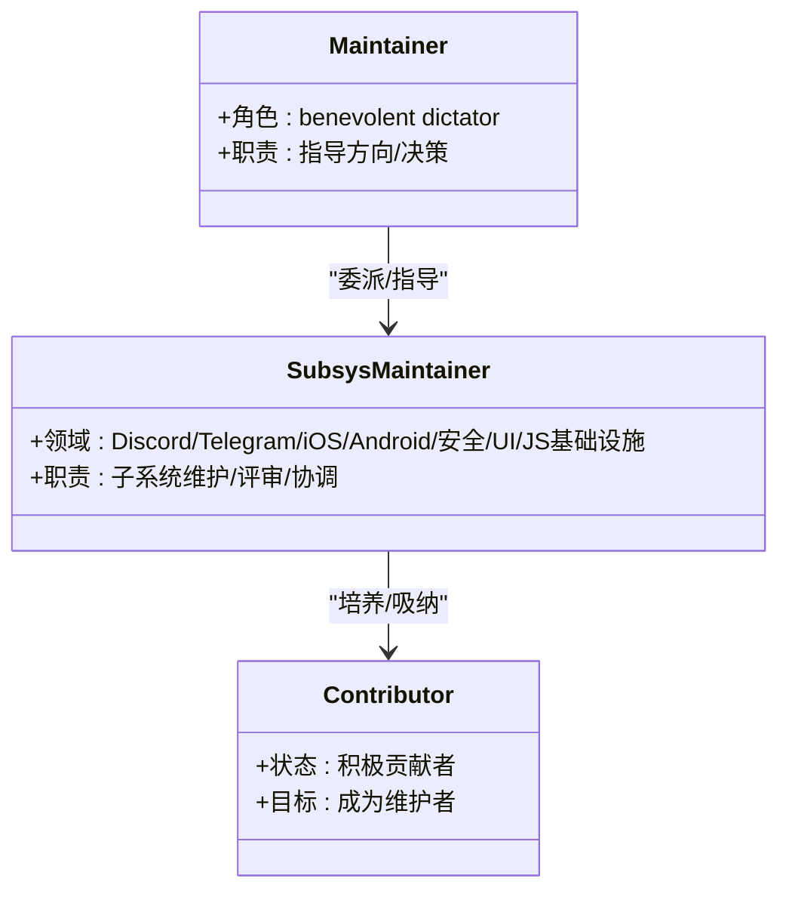
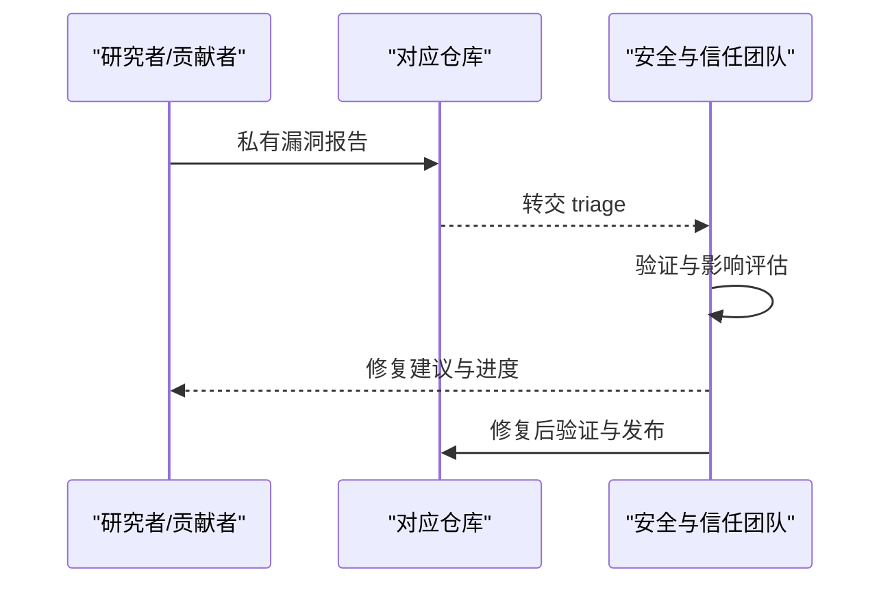
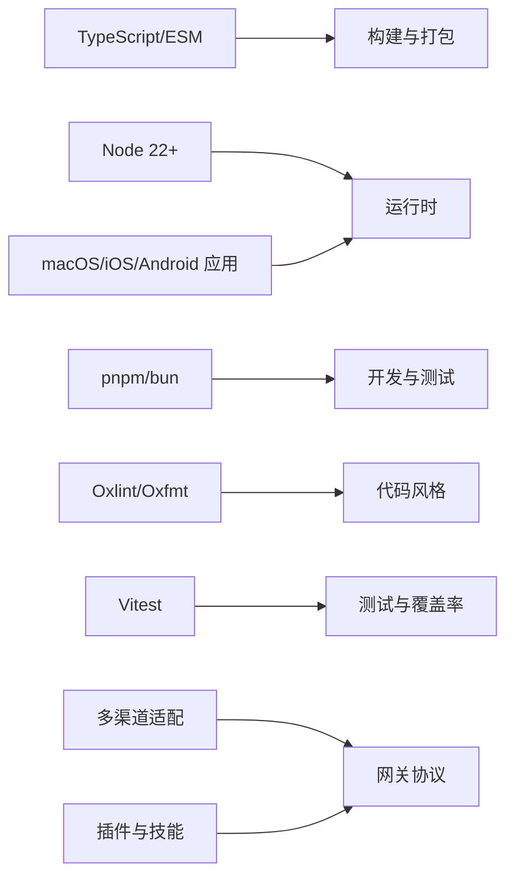

# 开发与社区

<cite>
**本文引用的文件**
- [CONTRIBUTING.md](file://CONTRIBUTING.md)
- [README.md](file://README.md)
- [VISION.md](file://VISION.md)
- [SECURITY.md](file://SECURITY.md)
- [AGENTS.md](file://AGENTS.md)
- [CHANGELOG.md](file://CHANGELOG.md)
- [.github/FUNDING.yml](file://.github/FUNDING.yml)
</cite>

## 目录

1. [引言](#引言)
2. [项目结构](#项目结构)
3. [核心组件](#核心组件)
4. [架构总览](#架构总览)
5. [详细组件分析](#详细组件分析)
6. [依赖分析](#依赖分析)
7. [性能考虑](#性能考虑)
8. [故障排查指南](#故障排查指南)
9. [结论](#结论)
10. [附录](#附录)

## 引言

本指南面向希望参与 OpenClaw 开发与社区建设的贡献者，系统阐述项目的开源理念、治理结构、维护团队、贡献方式与社区规范，并提供新贡献者的入门路径与常见问题排查方法。OpenClaw 是一个“个人 AI 助手”，可在用户设备上运行，连接多种消息渠道，支持多平台应用与插件扩展，强调本地优先、隐私与安全。

## 项目结构

OpenClaw 采用模块化与多语言混合（TypeScript/JavaScript）的工程组织方式，核心目录与职责概览如下：

- 根目录文档：贡献指南、愿景、安全策略、仓库通用规则等
- 源码与子系统：src 下按功能域划分（CLI、命令、通道、网关、工具、节点、插件SDK等）
- 应用与平台：apps 下包含 macOS、iOS、Android 等配套应用
- 扩展与技能：extensions 与 skills 提供生态扩展能力
- 文档与站点：docs 用于生成官方文档
- 分发产物：dist 产出构建与运行资源
- 脚本与工具：scripts 提供开发、测试、打包、发布等自动化脚本

章节来源

- file://README.md#L1-L50

## 核心组件

- 贡献与协作：通过 PR 流程、讨论区、问题模板与标签器实现有序协作
- 治理与维护：明确维护团队角色与职责，保持审慎扩容
- 安全与合规：建立私有漏洞上报通道与严格报告要求
- 开发与测试：统一的构建、测试、格式化与提交规范
- 发布与版本：清晰的发布通道与变更日志策略

章节来源

- file://CONTRIBUTING.md#L62-L134
- file://VISION.md#L34-L111
- file://SECURITY.md#L1-L120
- file://AGENTS.md#L55-L105
- file://CHANGELOG.md#L1-L50

## 架构总览

OpenClaw 的整体架构围绕“网关控制平面 + 多通道接入 + 插件与技能扩展”的模式设计，强调本地运行、可组合与安全可控。下图展示了从消息入口到执行层的关键交互：

图表来源

- [README.md](file://README.md#L185-L212)

章节来源

- file://README.md#L185-L212

## 详细组件分析

### 贡献流程与社区规范

- 快速开始：在 GitHub 讨论或 Discord 中沟通新特性；小修复直接开 PR；提问在 Discord 帮助频道
- PR 准备：本地自测、运行检查与测试、CI 通过、聚焦单一主题、清晰描述“做了什么/为什么”
- 代码风格与质量：统一使用 TypeScript/ESM，严格类型，Oxlint/Oxfmt 规范；避免原型污染与过度抽象
- 提交与评审：使用脚本提交工具，遵循约定式提交；多人协作时避免交叉修改未授权分支
- AI 协作：欢迎 AI 辅助 PR，需透明标注并充分测试

图表来源

- [CONTRIBUTING.md](file://CONTRIBUTING.md#L62-L103)
- [AGENTS.md](file://AGENTS.md#L106-L124)

章节来源

- file://CONTRIBUTING.md#L62-L103
- file://AGENTS.md#L106-L124

### 维护团队与治理

- 治理角色： benevolent dictator（终身制导师）、各子系统维护者（Discord、Telegram、iOS/Android、安全、UI/UX、JS 基础设施等）
- 扩招原则：谨慎扩容，强调持续参与（问题分类、PR 审阅、推动进展）
- 申请流程：邮件提交背景、链接与时间承诺、语言与地区、期望投入等信息

图表来源

- [CONTRIBUTING.md](file://CONTRIBUTING.md#L12-L61)
- [CONTRIBUTING.md](file://CONTRIBUTING.md#L115-L134)

章节来源

- file://CONTRIBUTING.md#L12-L61
- file://CONTRIBUTING.md#L115-L134

### 安全与漏洞上报

- 报告渠道：按组件归属仓库私有上报；不确定时发送邮件至 security@openclaw.ai
- 报告清单：标题、严重性评估、影响、受影响组件、技术复现、演示影响、环境、修复建议
- 受理门槛：缺少复现步骤、影响与修复建议的报告将被降级处理
- 信任模型：单用户受信操作员模型；多用户共享网关不推荐；插件视为受信扩展
- 运维指引：本地优先、Loopback 绑定、Canvas 仅在受信场景暴露、Docker 安全加固

图表来源

- [SECURITY.md](file://SECURITY.md#L7-L46)
- [SECURITY.md](file://SECURITY.md#L84-L123)

章节来源

- file://SECURITY.md#L7-L46
- file://SECURITY.md#L84-L123

### 开发与测试规范

- 工具链：Node 22+，pnpm 为主，支持 bun；统一构建、类型检查、格式化、测试
- 测试策略：Vitest 覆盖阈值；e2e 与 live 测试；低内存主机的测试优化
- 提交与分支：脚本化提交，避免手动 git add/commit；多人协作注意隔离工作区
- 版本与发布：稳定/预发布/开发通道；变更日志仅记录用户可见改动

章节来源

- file://AGENTS.md#L55-L105
- file://AGENTS.md#L106-L124
- file://CHANGELOG.md#L1-L50

### 愿景与路线图

- 当前优先级：安全与默认安全、稳定性与边缘修复、首次运行体验与设置可靠性
- 后续优先级：多模型供应商支持、主流消息渠道完善、性能与测试基建、计算机操作与代理能力、CLI 与 Web 前端的人体工学、跨平台配套应用
- 贡献守则：单 PR 对应单一议题；限制 PR 规模；避免大量微小 PR 聚合

章节来源

- file://VISION.md#L17-L33
- file://VISION.md#L34-L40

### 社区活跃度指标

- 星历史：可通过公开的 Star History 图表观察社区关注趋势
- 变更日志：CHANGELOG.md 展示版本迭代与修复密度，体现开发活跃度
- 讨论与问题：GitHub Discussions 与 Issues 的讨论热度与解决速度

章节来源

- file://README.md#L137-L140
- file://CHANGELOG.md#L1-L50

### 新贡献者入门

- 环境准备：安装 Node 22+，选择 pnpm 或 bun；克隆仓库并安装依赖
- 快速起步：运行 onboarding 向导，安装守护进程，启动网关进行体验
- 本地开发：构建与热重载，结合 CLI 与测试工具形成高效迭代闭环
- 社区入口：加入 Discord，阅读贡献指南与仓库规则，从“good first issue”入手

章节来源

- file://README.md#L92-L111
- file://CONTRIBUTING.md#L62-L103
- file://AGENTS.md#L55-L72

## 依赖分析

- 语言与工具链：TypeScript/ESM、Node 22+、pnpm/bun、Oxlint/Oxfmt、Vitest
- 平台与应用：macOS/iOS/Android 应用配套与节点能力
- 渠道与协议：多消息渠道适配与网关协议
- 插件与技能：插件 API 与 ClawHub 生态

图表来源

- [AGENTS.md](file://AGENTS.md#L55-L72)
- [README.md](file://README.md#L144-L177)

章节来源

- file://AGENTS.md#L55-L72
- file://README.md#L144-L177

## 性能考虑

- 性能与测试基建：持续改进测试覆盖与性能基准，减少回归风险
- 令牌与上下文压缩：优化令牌使用与上下文压缩逻辑
- 稳定性与边缘案例：优先修复渠道连接的边缘问题，提升整体稳定性
- 人机工程学：改善 CLI 与 Web 前端的可用性，降低学习成本

章节来源

- file://VISION.md#L25-L33
- file://CONTRIBUTING.md#L104-L114

## 故障排查指南

- 常见问题定位：使用 doctor 命令进行健康检查与迁移提示
- 日志与诊断：macOS 使用专用日志脚本查询子系统日志
- 安全审计：运行安全审计命令，识别潜在风险并获取修复建议
- 网络与暴露：确保网关绑定为 loopback，Canvas 仅在受信网络暴露
- Docker 与容器：启用只读文件系统、丢弃多余能力、限制权限

章节来源

- file://README.md#L442-L449
- file://AGENTS.md#L157-L177
- file://SECURITY.md#L195-L225
- file://SECURITY.md#L241-L256

## 结论

OpenClaw 以“个人 AI 助手”为核心定位，坚持本地优先、隐私与安全的默认策略，同时通过开放的插件与技能生态鼓励多样化参与。贡献者可通过清晰的流程与规范高效协作，维护团队以稳健节奏推进产品演进。建议新贡献者从文档与 onboarding 入手，逐步深入到具体子系统与问题修复中。

## 附录

- 资助与支持：可通过赞助页面支持项目
- 变更日志：版本迭代与修复记录，便于追踪活跃度与回归情况

章节来源

- file://.github/FUNDING.yml#L1-L2
- file://CHANGELOG.md#L1-L50
