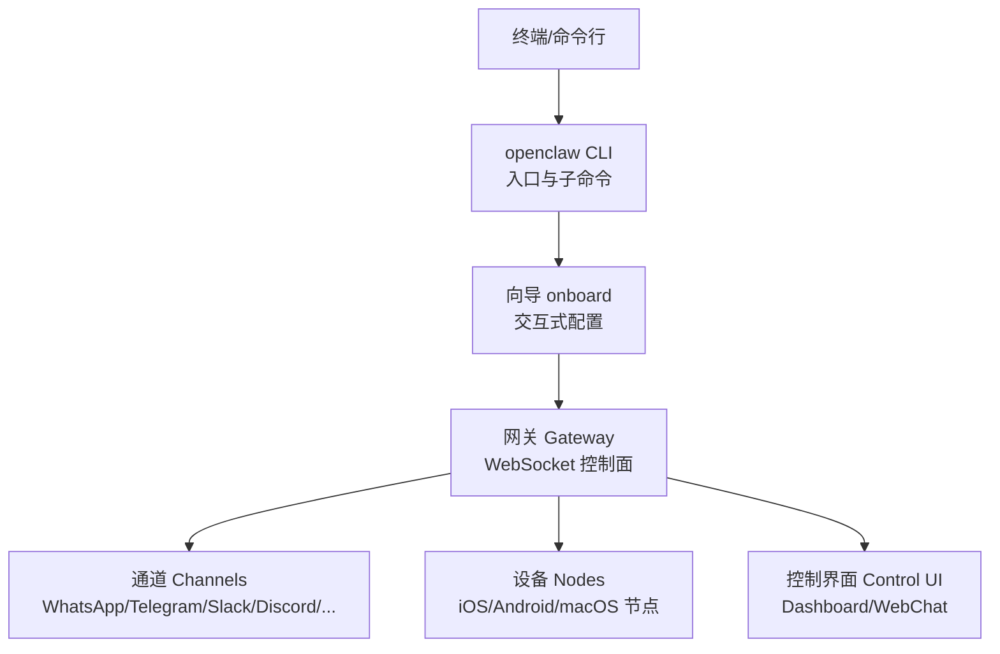
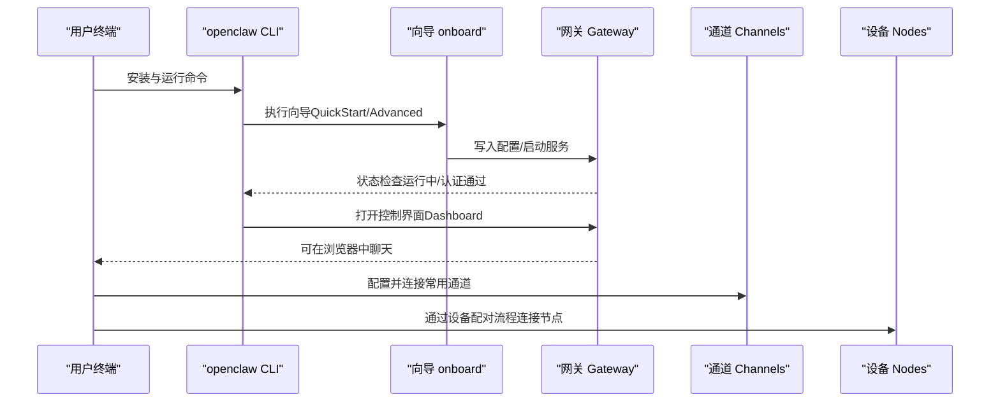
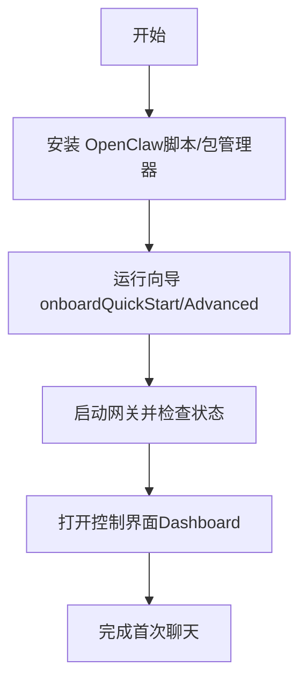
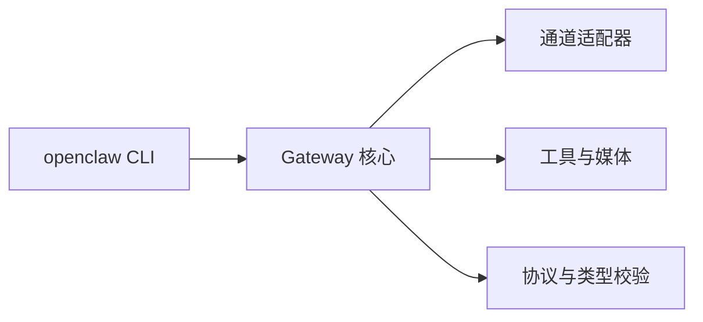

# 快速开始

<cite>
**本文引用的文件**
- [README.md](file://README.md)
- [getting-started.md](file://docs/start/getting-started.md)
- [wizard.md](file://docs/start/wizard.md)
- [onboard.md](file://docs/cli/onboard.md)
- [configuration.md](file://docs/gateway/configuration.md)
- [node.md](file://docs/install/node.md)
- [pairing.md](file://docs/channels/pairing.md)
- [devices.md](file://docs/cli/devices.md)
- [troubleshooting.md](file://docs/help/troubleshooting.md)
- [uninstall.md](file://docs/install/uninstall.md)
- [.env.example](file://.env.example)
- [package.json](file://package.json)
</cite>

## 目录

1. [简介](#简介)
2. [项目结构](#项目结构)
3. [核心组件](#核心组件)
4. [架构总览](#架构总览)
5. [详细组件分析](#详细组件分析)
6. [依赖分析](#依赖分析)
7. [性能考虑](#性能考虑)
8. [故障排除指南](#故障排除指南)
9. [结论](#结论)
10. [附录](#附录)

## 简介

本指南面向首次接触 OpenClaw 的用户，目标是在约 30 分钟内完成从零到可用的核心体验：安装 Node.js、安装 OpenClaw、运行向导完成首次配置、启动网关、打开控制界面进行首次对话，并理解基础的渠道连接与设备配对流程。文档同时提供命令行示例、配置文件模板与常见问题的快速定位路径。

## 项目结构

- 根目录包含 CLI 入口、核心网关与多平台应用、扩展通道、技能与文档等模块。
- 本快速开始聚焦于 CLI 安装与向导配置，以及与网关、通道、设备配对相关的文档与脚手架。

[无图表来源：此图为概念性结构说明，不直接映射具体代码文件]

**章节来源**

- [README.md](file://README.md#L28-L76)

## 核心组件

- CLI 与安装
  - Node.js 版本要求：Node ≥22；推荐使用安装脚本自动检测与安装。
  - 安装方式：npm/pnpm/bun；也可使用官方安装脚本。
- 向导模式（onboard）
  - QuickStart：默认本地网关、Token 认证、常用通道与技能预设。
  - Advanced：全量可配置项，适合进阶用户。
- 网关与控制界面
  - 网关默认绑定回环地址，可通过 Token 或密码认证；支持通过 Tailscale 暴露。
  - 控制界面（Dashboard）无需通道即可访问，最快验证网关是否就绪。
- 渠道与设备配对
  - DM 策略：配对（pairing）、白名单（allowlist）、开放（open）、禁用（disabled）。
  - 设备节点：通过设备配对流程建立信任，随后可在节点侧执行本地能力。

**章节来源**

- [node.md](file://docs/install/node.md#L12-L20)
- [getting-started.md](file://docs/start/getting-started.md#L28-L77)
- [wizard.md](file://docs/start/wizard.md#L12-L77)
- [configuration.md](file://docs/gateway/configuration.md#L12-L24)
- [pairing.md](file://docs/channels/pairing.md#L10-L48)

## 架构总览

下图展示从命令行到网关、通道与设备的整体交互关系，帮助理解“首次运行”的端到端路径。

**图表来源**

- [onboard.md](file://docs/cli/onboard.md#L20-L27)
- [getting-started.md](file://docs/start/getting-started.md#L72-L76)
- [wizard.md](file://docs/start/wizard.md#L63-L71)

**章节来源**

- [README.md](file://README.md#L180-L197)
- [configuration.md](file://docs/gateway/configuration.md#L12-L24)

## 详细组件分析

### 环境准备（Node.js 与包管理器）

- 版本要求：Node ≥22。
- 推荐安装方式：
  - macOS：Homebrew 或官网安装。
  - Linux：Ubuntu/Debian 使用 NodeSource 源；Fedora/RHEL 使用 dnf。
  - Windows：winget 或 Chocolatey，或官网安装。
- 若出现命令未找到或权限问题，参考 Node/PATH 症状排查与修复步骤。

**章节来源**

- [node.md](file://docs/install/node.md#L12-L20)
- [node.md](file://docs/install/node.md#L24-L68)
- [node.md](file://docs/install/node.md#L89-L139)

### 安装 OpenClaw

- 官方安装脚本（macOS/Linux/Windows）会自动处理 Node 检测与安装。
- 安装后建议立即运行向导完成首次配置。

**章节来源**

- [getting-started.md](file://docs/start/getting-started.md#L30-L53)

### 首次运行与向导模式

- 运行向导并安装守护进程（可选），随后检查网关状态。
- 控制界面（Dashboard）无需通道即可访问，用于快速验证网关是否正常。

**图表来源**

- [onboard.md](file://docs/cli/onboard.md#L20-L27)
- [getting-started.md](file://docs/start/getting-started.md#L55-L76)

**章节来源**

- [wizard.md](file://docs/start/wizard.md#L12-L77)
- [onboard.md](file://docs/cli/onboard.md#L20-L76)

### 基础配置与最小化配置

- 配置文件位置：~/.openclaw/openclaw.json（JSON5 支持注释与尾随逗号）。
- 常见任务包括：启用通道、设置模型与工具、会话与心跳、钩子与定时任务、沙箱策略等。
- 最小配置示例：包含代理工作区与允许的 WhatsApp 发送者列表。

**章节来源**

- [configuration.md](file://docs/gateway/configuration.md#L12-L24)
- [configuration.md](file://docs/gateway/configuration.md#L26-L34)

### 渠道连接与 DM 安全策略

- DM 策略：
  - 配对（pairing）：未知发件人需经批准。
  - 白名单（allowlist）：仅允许列表中的联系人。
  - 开放（open）：允许所有 DM（需显式允许通配符）。
  - 禁用（disabled）：忽略所有 DM。
- 列表与批准：
  - 使用 openclaw pairing list/approve 查看与批准待处理请求。
  - 状态存储于 ~.openclaw/credentials/ 下的对应文件。

**章节来源**

- [configuration.md](file://docs/gateway/configuration.md#L134-L146)
- [pairing.md](file://docs/channels/pairing.md#L20-L48)

### 设备配对与节点连接

- 设备配对流程：
  - 通过 Telegram 等渠道发起 /pair，生成一次性设置码。
  - 在设备端（iOS/Android/macOS）粘贴设置码并连接。
  - 在渠道中执行 /pair approve 完成批准。
- CLI 管理：
  - openclaw devices list/approve/reject 用于管理待处理与已批准设备。
  - 支持令牌轮换与撤销（针对特定角色与作用域）。

**章节来源**

- [pairing.md](file://docs/channels/pairing.md#L50-L86)
- [devices.md](file://docs/cli/devices.md#L13-L70)

### 环境变量与 .env 示例

- .env 加载优先级：进程环境变量 > 当前目录 .env > ~/.openclaw/.env > openclaw.json 中的 env 块。
- 常用变量：网关认证令牌/密码、路径覆盖、模型提供商密钥、通道令牌、工具与语音相关 API Key 等。

**章节来源**

- [.env.example](file://.env.example#L8-L71)

### Node.js 版本与包管理器要求

- engines 字段要求 Node ≥22.12.0。
- 包管理器：npm/pnpm/bun 均可；推荐 pnpm 用于源码构建。

**章节来源**

- [package.json](file://package.json#L192-L194)
- [package.json](file://package.json#L195-L218)

## 依赖分析

- CLI 与运行时
  - CLI 入口 openclaw 指向 openclaw.mjs；主模块导出位于 dist/index.js。
  - Node 引擎要求 ≥22.12.0。
- 第三方依赖
  - 通道集成：Baileys（WhatsApp）、grammy（Telegram）、Slack Bolt、discord.js、signal-cli 等。
  - 工具与媒体：Playwright、Sharp、PDF.js、Readability 等。
  - 协议与类型：TypeBox、Zod、WS、Express 等。

**图表来源**

- [package.json](file://package.json#L8-L32)
- [package.json](file://package.json#L111-L163)

**章节来源**

- [package.json](file://package.json#L111-L163)

## 性能考虑

- 首次运行建议使用控制界面（Dashboard）验证网关，避免通道配置复杂度带来的干扰。
- 启动守护进程后，网关会在后台常驻，减少每次手动启动的等待时间。
- 对于多通道与多代理场景，合理设置会话隔离与心跳周期，避免不必要的资源占用。

[本节为通用指导，不直接分析具体文件]

## 故障排除指南

- 快速诊断清单（60 秒三步法）
  - 运行 openclaw status、gateway status、channels status --probe、logs --follow。
  - 若 Dashboard 无法连接，检查认证模式与端口；若网关无法启动，检查绑定与端口占用。
  - 若消息不流动，检查 DM 策略、配对状态与提及规则。
- 常见症状与定位
  - openclaw: command not found → Node/npm PATH 问题。
  - unauthorized 或持续重连 → 认证模式不匹配或令牌错误。
  - 浏览器工具失败 → 本地浏览器启动失败或扩展未附加。
- 卸载与清理
  - 使用内置卸载器或手动移除服务、删除状态与工作区、卸载 CLI。

**章节来源**

- [troubleshooting.md](file://docs/help/troubleshooting.md#L13-L36)
- [troubleshooting.md](file://docs/help/troubleshooting.md#L39-L57)
- [uninstall.md](file://docs/install/uninstall.md#L16-L76)

## 结论

通过本快速开始，您已完成从环境准备、安装与向导配置、网关启动与控制界面验证，到渠道与设备配对的基础流程。建议在掌握上述步骤后，逐步深入配置通道、模型与自动化任务，并结合 Doctor 与日志进行持续健康检查。

[本节为总结性内容，不直接分析具体文件]

## 附录

### 命令行示例（路径引用）

- 安装与首次运行
  - [安装脚本与包管理器安装](file://docs/start/getting-started.md#L30-L53)
  - [运行向导并安装守护进程](file://docs/start/getting-started.md#L55-L61)
  - [检查网关状态](file://docs/start/getting-started.md#L64-L70)
  - [打开控制界面](file://docs/start/getting-started.md#L72-L76)
- 向导与配置
  - [onboard 命令与非交互参数](file://docs/cli/onboard.md#L20-L76)
  - [向导 QuickStart/Advanced 说明](file://docs/start/wizard.md#L43-L77)
  - [最小化配置示例](file://docs/gateway/configuration.md#L26-L34)
- 渠道与设备
  - [DM 配对与批准](file://docs/channels/pairing.md#L32-L48)
  - [设备配对与管理](file://docs/channels/pairing.md#L72-L86)
  - [devices 子命令参考](file://docs/cli/devices.md#L13-L70)

### 配置文件模板（路径引用）

- 最小配置（模型与默认工作区）
  - [示例位置](file://docs/gateway/configuration.md#L26-L34)
- 环境变量示例
  - [示例位置](file://.env.example#L1-L71)
