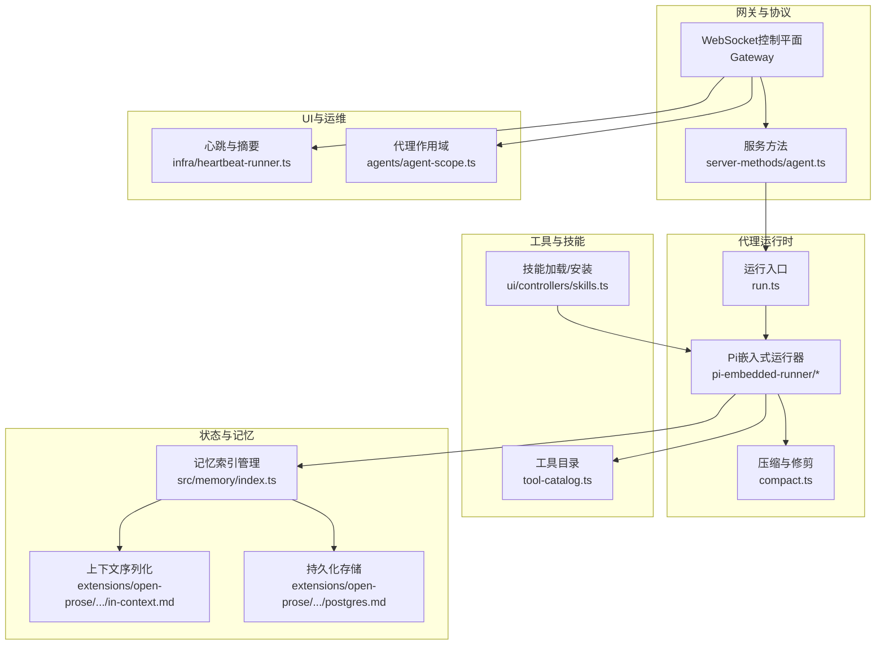
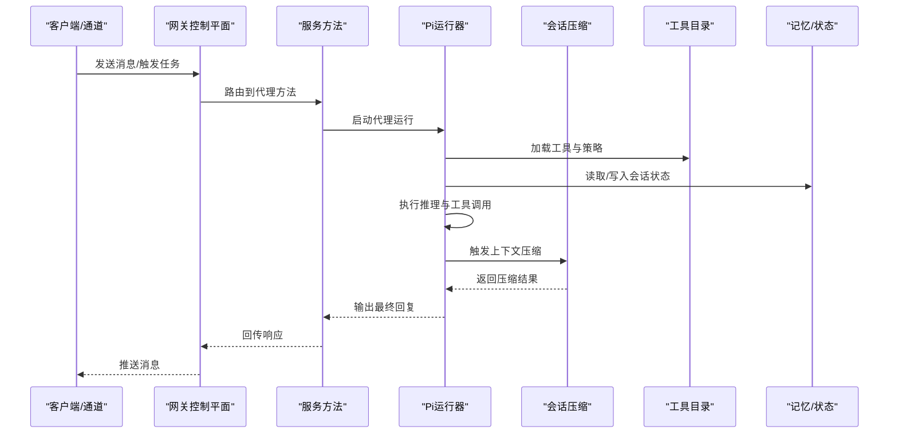
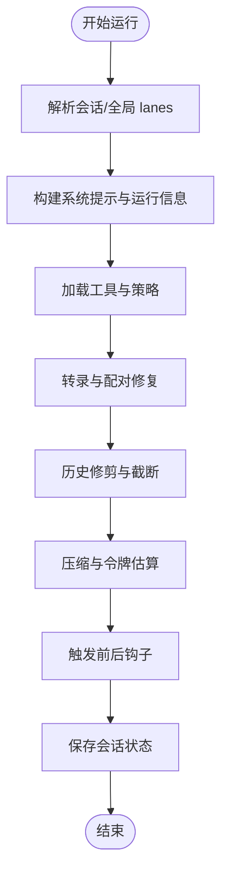
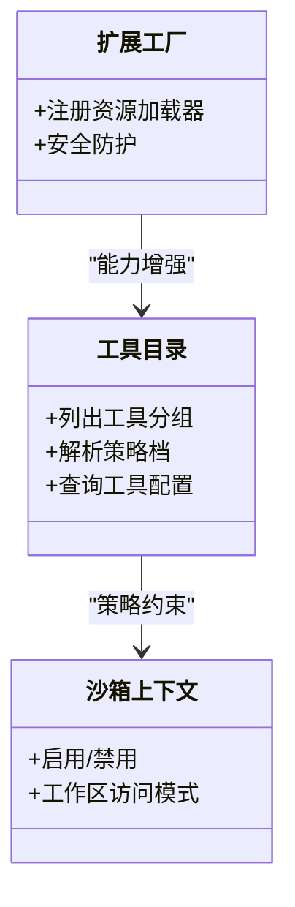
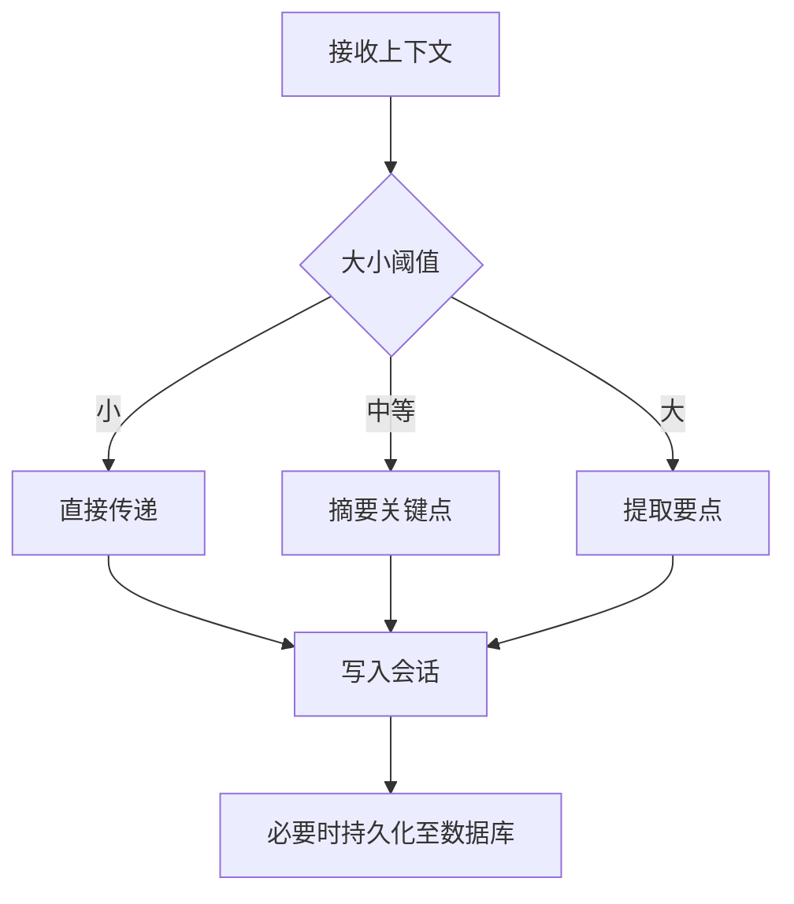
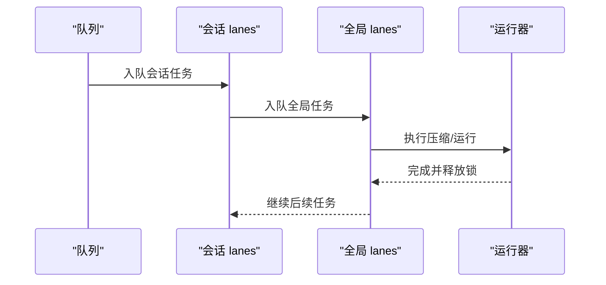
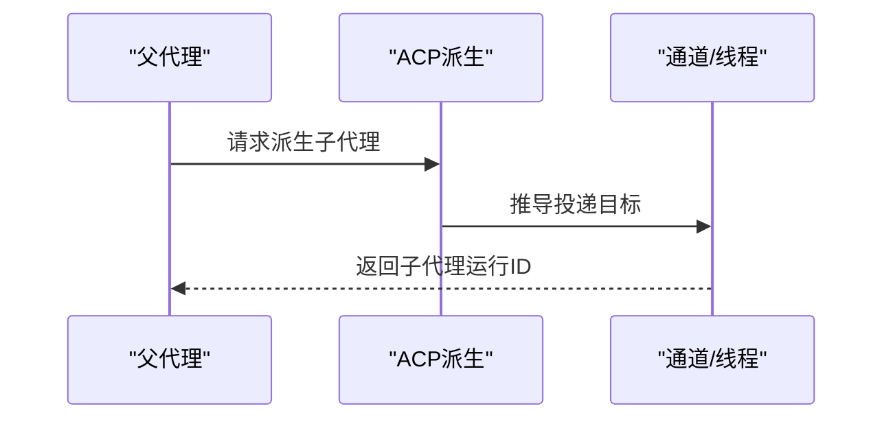
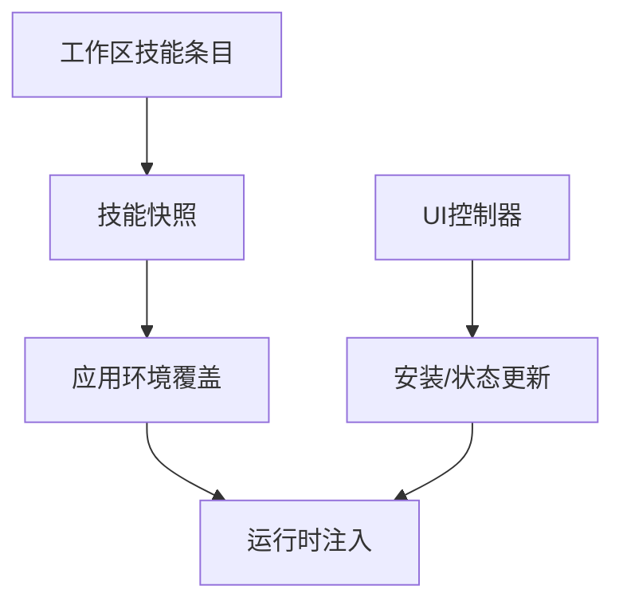
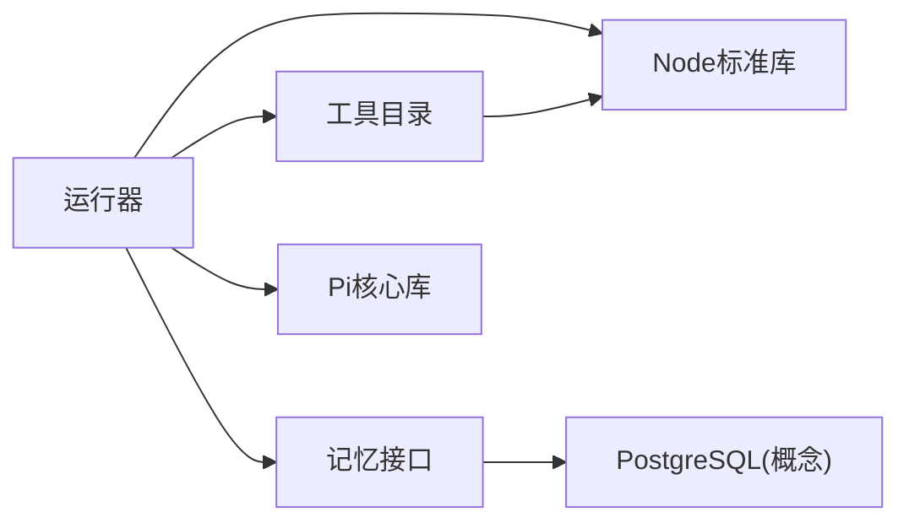

# AI代理系统架构

<cite>
**本文引用的文件**
- [README.md](file://README.md)
- [AGENTS.md](file://AGENTS.md)
- [VISION.md](file://VISION.md)
- [src/agents/tool-catalog.ts](file://src/agents/tool-catalog.ts)
- [src/agents/pi-embedded-runner/compact.ts](file://src/agents/pi-embedded-runner/compact.ts)
- [src/agents/pi-embedded-runner/run.ts](file://src/agents/pi-embedded-runner/run.ts)
- [src/agents/pi-embedded-runner/run/types.ts](file://src/agents/pi-embedded-runner/run/types.ts)
- [src/agents/skills/frontmatter.test.ts](file://src/agents/skills/frontmatter.test.ts)
- [src/agents/subagent-spawn.ts](file://src/agents/subagent-spawn.ts)
- [src/agents/acp-spawn.ts](file://src/agents/acp-spawn.ts)
- [src/agents/agent-scope.ts](file://src/agents/agent-scope.ts)
- [src/agents/pi-embedded.ts](file://src/agents/pi-embedded.ts)
- [src/auto-reply/reply/followup-runner.ts](file://src/auto-reply/reply/followup-runner.ts)
- [src/infra/heartbeat-runner.ts](file://src/infra/heartbeat-runner.ts)
- [src/gateway/server-methods/agent.ts](file://src/gateway/server-methods/agent.ts)
- [src/memory/index.ts](file://src/memory/index.ts)
- [extensions/open-prose/skills/prose/state/in-context.md](file://extensions/open-prose/skills/prose/state/in-context.md)
- [extensions/open-prose/skills/prose/state/postgres.md](file://extensions/open-prose/skills/prose/state/postgres.md)
- [extensions/open-prose/skills/prose/examples/18-mixed-parallel-sequential.prose](file://extensions/open-prose/skills/prose/examples/18-mixed-parallel-sequential.prose)
- [extensions/open-prose/skills/prose/examples/13-variables-and-context.prose](file://extensions/open-prose/skills/prose/examples/13-variables-and-context.prose)
- [extensions/open-prose/skills/prose/guidance/patterns.md](file://extensions/open-prose/skills/prose/guidance/patterns.md)
- [extensions/open-prose/skills/prose/guidance/antipatterns.md](file://extensions/open-prose/skills/prose/guidance/antipatterns.md)
- [extensions/open-prose/skills/prose/examples/29-captains-chair.prose](file://extensions/open-prose/skills/prose/examples/29-captains-chair.prose)
- [extensions/open-prose/skills/prose/examples/48-habit-miner.prose](file://extensions/open-prose/skills/prose/examples/48-habit-miner.prose)
- [ui/src/ui/controllers/skills.ts](file://ui/src/ui/controllers/skills.ts)
</cite>

## 目录

1. [简介](#简介)
2. [项目结构](#项目结构)
3. [核心组件](#核心组件)
4. [架构总览](#架构总览)
5. [详细组件分析](#详细组件分析)
6. [依赖关系分析](#依赖关系分析)
7. [性能考虑](#性能考虑)
8. [故障排查指南](#故障排查指南)
9. [结论](#结论)
10. [附录](#附录)

## 简介

本文件面向OpenClaw AI代理系统，系统性阐述其架构设计与实现要点，重点覆盖以下方面：

- 代理生命周期管理：从会话创建、运行、压缩到结束的全链路
- 工具调用机制：工具目录、权限策略、沙箱与安全控制
- 记忆系统与上下文处理：工作区注入、会话历史修剪、多态状态存储（文件系统/内存/数据库）
- 并发执行与资源控制：队列分 lanes、锁与超时保护、心跳与诊断
- 代理与工具系统的集成：Pi嵌入式运行器、扩展工厂、插件钩子
- 技能加载机制与行为控制：技能环境注入、前端安装与状态管理
- 配置选项、性能调优与监控指标
- 开发最佳实践与常见问题解决

## 项目结构

OpenClaw采用模块化与分层架构，核心由“网关控制平面 + 代理运行时 + 工具与技能生态 + 记忆与状态管理 + UI与运维”构成。

图示来源

- [src/gateway/server-methods/agent.ts](file://src/gateway/server-methods/agent.ts#L260-L275)
- [src/agents/pi-embedded-runner/run.ts](file://src/agents/pi-embedded-runner/run.ts#L192-L209)
- [src/agents/pi-embedded-runner/compact.ts](file://src/agents/pi-embedded-runner/compact.ts#L751-L762)
- [src/agents/tool-catalog.ts](file://src/agents/tool-catalog.ts#L1-L327)
- [src/memory/index.ts](file://src/memory/index.ts#L1-L8)
- [extensions/open-prose/skills/prose/state/in-context.md](file://extensions/open-prose/skills/prose/state/in-context.md#L234-L257)
- [extensions/open-prose/skills/prose/state/postgres.md](file://extensions/open-prose/skills/prose/state/postgres.md#L606-L618)
- [src/infra/heartbeat-runner.ts](file://src/infra/heartbeat-runner.ts#L121-L154)
- [src/agents/agent-scope.ts](file://src/agents/agent-scope.ts#L43-L83)
- [ui/src/ui/controllers/skills.ts](file://ui/src/ui/controllers/skills.ts#L46-L164)

章节来源

- [README.md](file://README.md#L185-L262)
- [AGENTS.md](file://AGENTS.md#L10-L42)
- [VISION.md](file://VISION.md#L1-L111)

## 核心组件

- 网关与控制平面：统一的WebSocket控制面，承载会话、通道、事件与远程方法调用；提供代理路由与安全边界。
- Pi嵌入式运行器：在本地以RPC模式运行的代理内核，负责工具注册、会话管理、消息流与压缩。
- 工具目录与策略：定义核心工具集与按“最小/编码/消息/全量”等配置档的允许/拒绝集合。
- 记忆与状态：支持会话历史修剪、上下文序列化、文件系统/内存/数据库三态模型。
- 技能平台：工作区技能注入、UI安装与状态反馈、前端与后端协同。
- 心跳与可观测性：按代理维度的心跳启用与摘要生成，辅助健康检查与运维。

章节来源

- [src/agents/tool-catalog.ts](file://src/agents/tool-catalog.ts#L1-L327)
- [src/agents/pi-embedded-runner/compact.ts](file://src/agents/pi-embedded-runner/compact.ts#L1-L762)
- [src/agents/pi-embedded-runner/run.ts](file://src/agents/pi-embedded-runner/run.ts#L192-L209)
- [src/memory/index.ts](file://src/memory/index.ts#L1-L8)
- [ui/src/ui/controllers/skills.ts](file://ui/src/ui/controllers/skills.ts#L46-L164)
- [src/infra/heartbeat-runner.ts](file://src/infra/heartbeat-runner.ts#L121-L154)

## 架构总览

OpenClaw的代理系统围绕“会话即状态”的理念构建，通过Pi嵌入式运行器在本地执行，结合工具目录与技能生态，实现对多渠道输入的统一处理与输出。系统强调安全默认与可观察性，提供沙箱、队列与锁等资源控制手段，并通过OpenProse语言与状态模型支撑复杂工作流编排。

图示来源

- [src/gateway/server-methods/agent.ts](file://src/gateway/server-methods/agent.ts#L260-L275)
- [src/agents/pi-embedded-runner/run.ts](file://src/agents/pi-embedded-runner/run.ts#L192-L209)
- [src/agents/pi-embedded-runner/compact.ts](file://src/agents/pi-embedded-runner/compact.ts#L751-L762)
- [src/agents/tool-catalog.ts](file://src/agents/tool-catalog.ts#L1-L327)
- [src/memory/index.ts](file://src/memory/index.ts#L1-L8)

## 详细组件分析

### 代理生命周期与运行时

- 运行入口与参数映射：运行器根据会话键/全局键解析队列 lanes，选择合适的工具格式（Markdown/纯文本），并注入思考级别、模型与认证信息。
- 会话压缩：在进入压缩阶段前，先进行历史修剪、工具使用/结果配对修复与转录策略校验，随后在安全超时下执行压缩，记录前后token估算与诊断指标。
- 资源与锁：压缩过程获取会话写锁，确保并发一致性；完成后释放锁并清理资源。

图示来源

- [src/agents/pi-embedded-runner/run.ts](file://src/agents/pi-embedded-runner/run.ts#L192-L209)
- [src/agents/pi-embedded-runner/compact.ts](file://src/agents/pi-embedded-runner/compact.ts#L587-L744)

章节来源

- [src/agents/pi-embedded-runner/run.ts](file://src/agents/pi-embedded-runner/run.ts#L192-L209)
- [src/agents/pi-embedded-runner/run/types.ts](file://src/agents/pi-embedded-runner/run/types.ts#L1-L24)
- [src/agents/pi-embedded-runner/compact.ts](file://src/agents/pi-embedded-runner/compact.ts#L247-L762)

### 工具调用机制与安全控制

- 工具目录与配置档：定义工具分组与按“最小/编码/消息/全量”策略的允许/拒绝集合，便于按场景裁剪能力。
- 沙箱与权限：运行时根据会话键解析沙箱上下文，限制工作区访问与命令执行范围；同时对特定提供商（如Google）进行工具schema清洗。
- 插件与扩展：通过扩展工厂注册资源加载器，使Pi运行器具备安全防护与能力增强。

图示来源

- [src/agents/tool-catalog.ts](file://src/agents/tool-catalog.ts#L248-L327)
- [src/agents/pi-embedded-runner/compact.ts](file://src/agents/pi-embedded-runner/compact.ts#L365-L389)
- [src/agents/pi-embedded-runner/compact.ts](file://src/agents/pi-embedded-runner/compact.ts#L547-L565)

章节来源

- [src/agents/tool-catalog.ts](file://src/agents/tool-catalog.ts#L1-L327)
- [src/agents/pi-embedded-runner/compact.ts](file://src/agents/pi-embedded-runner/compact.ts#L365-L389)
- [src/agents/pi-embedded-runner/compact.ts](file://src/agents/pi-embedded-runner/compact.ts#L547-L565)

### 记忆系统与上下文处理

- 上下文序列化：在“内存态”中，上下文以值传递而非引用，需按大小策略进行摘要或抽取，避免超出上下文限制。
- 持久化与调试：PostgreSQL作为“真相库”，支持会话恢复、共享协作与调试查询。
- 历史修剪：基于会话键与配置，限制对话轮次与内容长度，保证上下文可控。

图示来源

- [extensions/open-prose/skills/prose/state/in-context.md](file://extensions/open-prose/skills/prose/state/in-context.md#L234-L257)
- [extensions/open-prose/skills/prose/state/postgres.md](file://extensions/open-prose/skills/prose/state/postgres.md#L606-L618)
- [src/agents/pi-embedded-runner/compact.ts](file://src/agents/pi-embedded-runner/compact.ts#L607-L620)

章节来源

- [extensions/open-prose/skills/prose/state/in-context.md](file://extensions/open-prose/skills/prose/state/in-context.md#L234-L257)
- [extensions/open-prose/skills/prose/state/postgres.md](file://extensions/open-prose/skills/prose/state/postgres.md#L606-L618)
- [src/agents/pi-embedded-runner/compact.ts](file://src/agents/pi-embedded-runner/compact.ts#L607-L620)

### 并发执行与资源控制

- 队列与 lanes：按会话键与全局键分别建立队列，避免跨会话竞争；运行器在进入压缩前可直接在当前 lanes 中执行，避免死锁。
- 锁与超时：压缩阶段获取会话写锁，设置最大持有时间；运行器内置安全超时，防止长时间阻塞。
- 心跳与诊断：按代理维度启用心跳，汇总运行摘要，便于运维与健康检查。

图示来源

- [src/agents/pi-embedded-runner/compact.ts](file://src/agents/pi-embedded-runner/compact.ts#L751-L762)
- [src/infra/heartbeat-runner.ts](file://src/infra/heartbeat-runner.ts#L121-L154)

章节来源

- [src/agents/pi-embedded-runner/compact.ts](file://src/agents/pi-embedded-runner/compact.ts#L751-L762)
- [src/infra/heartbeat-runner.ts](file://src/infra/heartbeat-runner.ts#L121-L154)

### 代理与工具系统的集成

- Pi嵌入式API：对外暴露运行、压缩、队列、订阅等能力，供上层控制器调用。
- ACP Spawn：在会话间派生子代理时，根据线程绑定与请求者上下文推导投递目标，确保消息路由正确。
- 子代理深度与并发限制：限制最大派生深度与每会话活跃子代理数量，防止无限递归与资源耗尽。

图示来源

- [src/agents/acp-spawn.ts](file://src/agents/acp-spawn.ts#L371-L398)
- [src/agents/subagent-spawn.ts](file://src/agents/subagent-spawn.ts#L231-L248)
- [src/agents/pi-embedded.ts](file://src/agents/pi-embedded.ts#L1-L16)

章节来源

- [src/agents/acp-spawn.ts](file://src/agents/acp-spawn.ts#L371-L398)
- [src/agents/subagent-spawn.ts](file://src/agents/subagent-spawn.ts#L231-L248)
- [src/agents/pi-embedded.ts](file://src/agents/pi-embedded.ts#L1-L16)

### 技能加载机制与行为控制

- 技能环境注入：根据工作区技能条目与快照应用环境覆盖，确保运行时可见性与隔离。
- 前端安装与状态：UI控制器封装技能状态、错误与安装流程，支持超时与消息展示。
- 行为控制：通过frontmatter解析用户可调用与模型调用开关，实现细粒度的行为控制。

图示来源

- [src/agents/pi-embedded-runner/compact.ts](file://src/agents/pi-embedded-runner/compact.ts#L333-L354)
- [ui/src/ui/controllers/skills.ts](file://ui/src/ui/controllers/skills.ts#L46-L164)
- [src/agents/skills/frontmatter.test.ts](file://src/agents/skills/frontmatter.test.ts#L1-L19)

章节来源

- [src/agents/pi-embedded-runner/compact.ts](file://src/agents/pi-embedded-runner/compact.ts#L333-L354)
- [ui/src/ui/controllers/skills.ts](file://ui/src/ui/controllers/skills.ts#L46-L164)
- [src/agents/skills/frontmatter.test.ts](file://src/agents/skills/frontmatter.test.ts#L1-L19)

### OpenProse工作流与上下文模式

- 变量与上下文：通过let/const绑定捕获会话输出，作为后续会话的显式上下文，提升可维护性与可追踪性。
- 并行与顺序混合：支持嵌套并行与顺序块组合，提升复杂任务的执行效率。
- 模式与反模式：提供管道组合、代理专精、可复用块等模式，以及魔法字符串、隐式依赖、过度并行等反模式警示。

章节来源

- [extensions/open-prose/skills/prose/examples/13-variables-and-context.prose](file://extensions/open-prose/skills/prose/examples/13-variables-and-context.prose#L1-L36)
- [extensions/open-prose/skills/prose/examples/18-mixed-parallel-sequential.prose](file://extensions/open-prose/skills/prose/examples/18-mixed-parallel-sequential.prose#L1-L36)
- [extensions/open-prose/skills/prose/guidance/patterns.md](file://extensions/open-prose/skills/prose/guidance/patterns.md#L52-L114)
- [extensions/open-prose/skills/prose/guidance/antipatterns.md](file://extensions/open-prose/skills/prose/guidance/antipatterns.md#L559-L952)
- [extensions/open-prose/skills/prose/examples/29-captains-chair.prose](file://extensions/open-prose/skills/prose/examples/29-captains-chair.prose#L32-L66)
- [extensions/open-prose/skills/prose/examples/48-habit-miner.prose](file://extensions/open-prose/skills/prose/examples/48-habit-miner.prose#L105-L149)

## 依赖关系分析

- 组件耦合：运行器与压缩器强依赖工具目录与记忆接口；工具目录与沙箱上下文耦合；UI控制器与运行器通过方法名约定交互。
- 外部依赖：Pi核心库（会话管理、令牌估算）、提供商SDK（认证与模型解析）、Node标准库（文件系统、进程、路径）。
- 循环依赖：未发现直接循环；运行器内部通过参数注入避免循环引用。

图示来源

- [src/agents/pi-embedded-runner/run.ts](file://src/agents/pi-embedded-runner/run.ts#L192-L209)
- [src/agents/tool-catalog.ts](file://src/agents/tool-catalog.ts#L1-L327)
- [src/memory/index.ts](file://src/memory/index.ts#L1-L8)

章节来源

- [src/agents/pi-embedded-runner/run.ts](file://src/agents/pi-embedded-runner/run.ts#L192-L209)
- [src/agents/tool-catalog.ts](file://src/agents/tool-catalog.ts#L1-L327)
- [src/memory/index.ts](file://src/memory/index.ts#L1-L8)

## 性能考虑

- 上下文修剪与压缩：在进入推理前进行历史修剪与压缩，显著降低token消耗与延迟。
- 队列与并发：合理设置每会话最大子代理数与派生深度，避免资源争用与栈溢出。
- 工具与模型选择：按任务复杂度匹配模型与工具，减少不必要的工具调用与网络往返。
- 诊断与指标：利用压缩阶段的诊断日志与心跳摘要，持续优化上下文策略与运行参数。

## 故障排查指南

- 代理方法校验：服务方法对未知代理ID进行快速失败，便于早期发现问题。
- 压缩失败分类：根据原因分类（超时、4xx/5xx、摘要失败等），指导定位问题根因。
- UI安装错误：捕获安装异常并回显错误消息，便于前端用户自助排查。
- 心跳与摘要：确认心跳启用与摘要生成是否符合预期，辅助定位长尾任务与异常状态。

章节来源

- [src/gateway/server-methods/agent.ts](file://src/gateway/server-methods/agent.ts#L260-L275)
- [src/agents/pi-embedded-runner/compact.ts](file://src/agents/pi-embedded-runner/compact.ts#L201-L241)
- [ui/src/ui/controllers/skills.ts](file://ui/src/ui/controllers/skills.ts#L132-L164)
- [src/infra/heartbeat-runner.ts](file://src/infra/heartbeat-runner.ts#L121-L154)

## 结论

OpenClaw的AI代理系统以Pi嵌入式运行器为核心，结合严格的工具目录、沙箱与上下文修剪策略，在保证安全性的同时实现了强大的多渠道代理能力。通过OpenProse语言与状态模型，系统支持复杂工作流的编排与演进。配合心跳与可观测性机制，能够持续优化性能与稳定性。建议在实际部署中遵循最小权限原则、合理设置并发与深度限制，并利用诊断与监控指标持续迭代。

## 附录

- 代理作用域与默认代理解析：用于确定代理列表、默认代理与规范化ID，确保路由与配置一致性。
- 自动回复与回退：在运行过程中支持模型回退与后续跟进队列，提升鲁棒性。

章节来源

- [src/agents/agent-scope.ts](file://src/agents/agent-scope.ts#L43-L83)
- [src/auto-reply/reply/followup-runner.ts](file://src/auto-reply/reply/followup-runner.ts#L130-L163)
