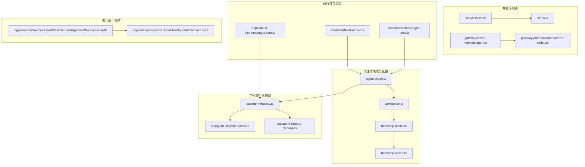
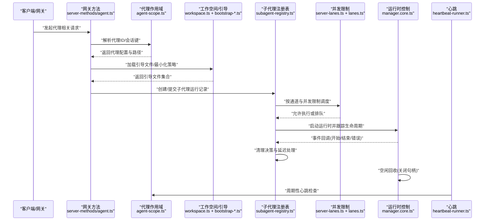
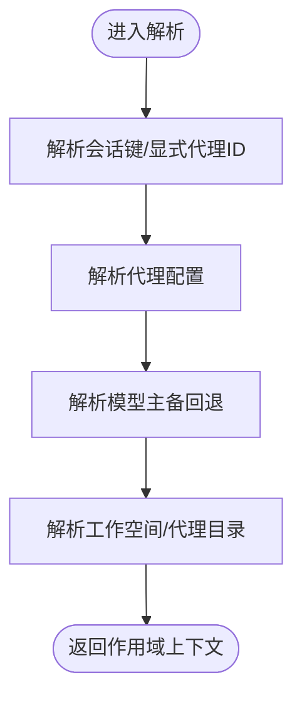
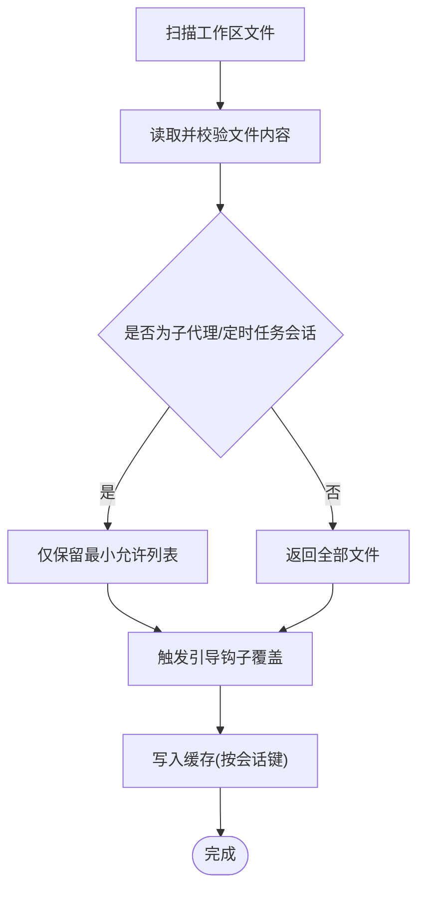
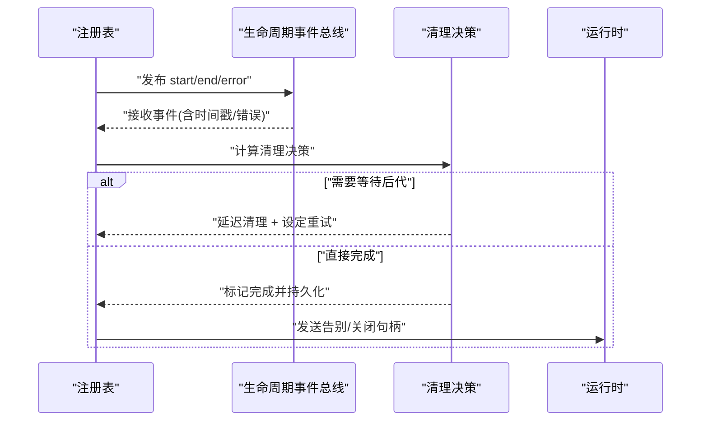
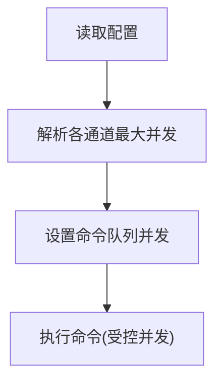
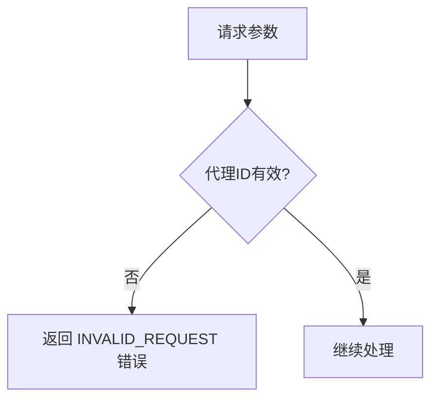
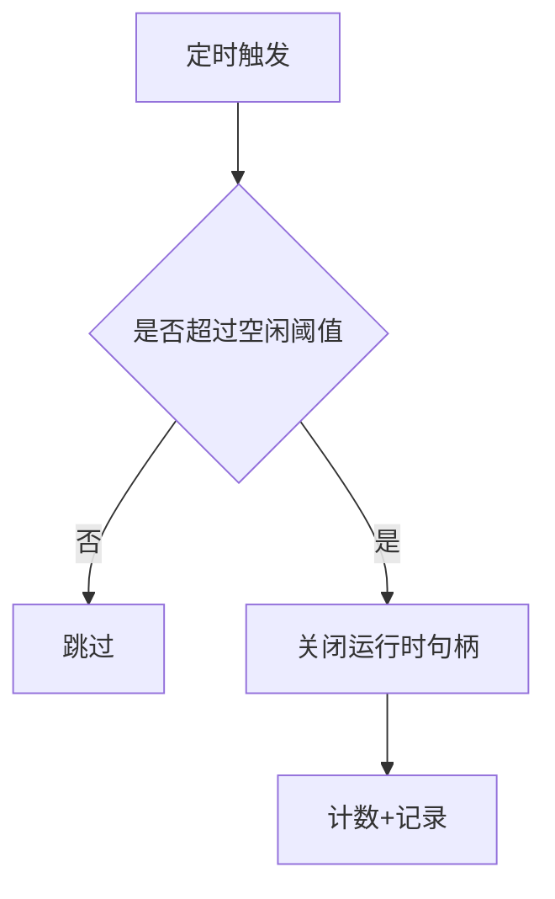
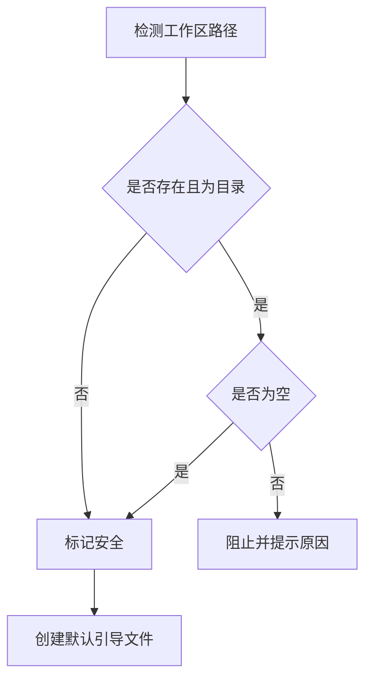
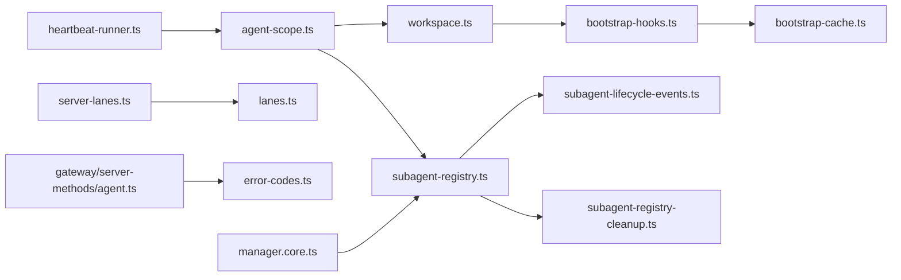

# 代理生命周期管理

<cite>
**本文引用的文件**
- [agent-scope.ts](file://src/agents/agent-scope.ts)
- [workspace.ts](file://src/agents/workspace.ts)
- [bootstrap-hooks.ts](file://src/agents/bootstrap-hooks.ts)
- [bootstrap-cache.ts](file://src/agents/bootstrap-cache.ts)
- [subagent-lifecycle-events.ts](file://src/agents/subagent-lifecycle-events.ts)
- [subagent-registry.ts](file://src/agents/subagent-registry.ts)
- [subagent-registry-cleanup.ts](file://src/agents/subagent-registry-cleanup.ts)
- [lanes.ts](file://src/agents/lanes.ts)
- [server-lanes.ts](file://src/gateway/server-lanes.ts)
- [agent.ts](file://src/gateway/server-methods/agent.ts)
- [error-codes.ts](file://src/gateway/protocol/schema/error-codes.ts)
- [status.agent-local.ts](file://src/commands/status.agent-local.ts)
- [OnboardingView+Workspace.swift](file://apps/macos/Sources/OpenClaw/OnboardingView+Workspace.swift)
- [AgentWorkspace.swift](file://apps/macos/Sources/OpenClaw/AgentWorkspace.swift)
- [manager.core.ts](file://src/acp/control-plane/manager.core.ts)
- [heartbeat-runner.ts](file://src/infra/heartbeat-runner.ts)
- [agent.ts](file://src/browser/routes/agent.ts)
</cite>

## 目录

1. [引言](#引言)
2. [项目结构](#项目结构)
3. [核心组件](#核心组件)
4. [架构总览](#架构总览)
5. [组件详解](#组件详解)
6. [依赖关系分析](#依赖关系分析)
7. [性能与并发](#性能与并发)
8. [故障排查指南](#故障排查指南)
9. [结论](#结论)
10. [附录：配置与最佳实践](#附录配置与最佳实践)

## 引言

本文件系统化阐述 OpenClaw 代理生命周期管理的设计与实现，覆盖代理的创建、初始化、运行、暂停、恢复与销毁全链路；解释代理作用域与工作空间管理、引导文件处理与结果保护、子代理生命周期与清理策略；并给出状态转换、并发控制、资源清理、性能监控与错误处理的工程实践建议。

## 项目结构

围绕代理生命周期的关键模块分布如下：

- 代理作用域与配置解析：agent-scope.ts
- 工作空间与引导文件加载：workspace.ts、bootstrap-hooks.ts、bootstrap-cache.ts
- 子代理生命周期与注册表：subagent-lifecycle-events.ts、subagent-registry.ts、subagent-registry-cleanup.ts
- 并发与通道限制：lanes.ts、server-lanes.ts
- 网关与错误码：agent.ts（server-methods）、error-codes.ts
- 运行时控制与空闲回收：manager.core.ts
- 心跳与本地状态：heartbeat-runner.ts、status.agent-local.ts
- 客户端工作区引导：OnboardingView+Workspace.swift、AgentWorkspace.swift
- 浏览器路由入口：agent.ts（browser/routes）

**图表来源**

- [agent-scope.ts](file://src/agents/agent-scope.ts#L1-L282)
- [workspace.ts](file://src/agents/workspace.ts#L535-L581)
- [bootstrap-hooks.ts](file://src/agents/bootstrap-hooks.ts#L1-L31)
- [bootstrap-cache.ts](file://src/agents/bootstrap-cache.ts#L1-L25)
- [subagent-lifecycle-events.ts](file://src/agents/subagent-lifecycle-events.ts#L32-L47)
- [subagent-registry.ts](file://src/agents/subagent-registry.ts#L586-L638)
- [subagent-registry-cleanup.ts](file://src/agents/subagent-registry-cleanup.ts#L1-L48)
- [lanes.ts](file://src/agents/lanes.ts#L1-L4)
- [server-lanes.ts](file://src/gateway/server-lanes.ts#L1-L10)
- [agent.ts](file://src/gateway/server-methods/agent.ts#L260-L275)
- [error-codes.ts](file://src/gateway/protocol/schema/error-codes.ts#L1-L25)
- [manager.core.ts](file://src/acp/control-plane/manager.core.ts#L1158-L1205)
- [heartbeat-runner.ts](file://src/infra/heartbeat-runner.ts#L1084-L1113)
- [status.agent-local.ts](file://src/commands/status.agent-local.ts#L1-L50)
- [OnboardingView+Workspace.swift](file://apps/macos/Sources/OpenClaw/OnboardingView+Workspace.swift#L1-L30)
- [AgentWorkspace.swift](file://apps/macos/Sources/OpenClaw/AgentWorkspace.swift#L73-L92)

**章节来源**

- [agent-scope.ts](file://src/agents/agent-scope.ts#L1-L282)
- [workspace.ts](file://src/agents/workspace.ts#L535-L581)
- [bootstrap-hooks.ts](file://src/agents/bootstrap-hooks.ts#L1-L31)
- [bootstrap-cache.ts](file://src/agents/bootstrap-cache.ts#L1-L25)
- [subagent-lifecycle-events.ts](file://src/agents/subagent-lifecycle-events.ts#L32-L47)
- [subagent-registry.ts](file://src/agents/subagent-registry.ts#L586-L638)
- [subagent-registry-cleanup.ts](file://src/agents/subagent-registry-cleanup.ts#L1-L48)
- [lanes.ts](file://src/agents/lanes.ts#L1-L4)
- [server-lanes.ts](file://src/gateway/server-lanes.ts#L1-L10)
- [agent.ts](file://src/gateway/server-methods/agent.ts#L260-L275)
- [error-codes.ts](file://src/gateway/protocol/schema/error-codes.ts#L1-L25)
- [manager.core.ts](file://src/acp/control-plane/manager.core.ts#L1158-L1205)
- [heartbeat-runner.ts](file://src/infra/heartbeat-runner.ts#L1084-L1113)
- [status.agent-local.ts](file://src/commands/status.agent-local.ts#L1-L50)
- [OnboardingView+Workspace.swift](file://apps/macos/Sources/OpenClaw/OnboardingView+Workspace.swift#L1-L30)
- [AgentWorkspace.swift](file://apps/macos/Sources/OpenClaw/AgentWorkspace.swift#L73-L92)

## 核心组件

- 代理作用域与配置解析：负责代理 ID 解析、默认代理选择、模型主备回退、工作空间与代理目录解析等。
- 工作空间与引导文件：负责扫描、过滤、钩子覆盖与缓存、最小化引导集在子代理/定时任务中的应用。
- 子代理生命周期与注册表：负责子代理启动、结束、错误、超时等事件的登记、清理决策与延迟处理。
- 并发与通道：通过命令通道与最大并发配置，限制主代理与子代理的并行度。
- 网关与错误码：校验代理参数、返回标准化错误码。
- 运行时控制与空闲回收：按空闲时间回收运行时句柄，触发关闭。
- 心跳与本地状态：周期性心跳驱动、本地状态统计。
- 客户端工作区引导：引导用户创建安全的工作区，确保首次使用安全。

**章节来源**

- [agent-scope.ts](file://src/agents/agent-scope.ts#L117-L144)
- [workspace.ts](file://src/agents/workspace.ts#L535-L581)
- [bootstrap-hooks.ts](file://src/agents/bootstrap-hooks.ts#L7-L31)
- [bootstrap-cache.ts](file://src/agents/bootstrap-cache.ts#L5-L25)
- [subagent-lifecycle-events.ts](file://src/agents/subagent-lifecycle-events.ts#L32-L47)
- [subagent-registry.ts](file://src/agents/subagent-registry.ts#L586-L638)
- [subagent-registry-cleanup.ts](file://src/agents/subagent-registry-cleanup.ts#L23-L48)
- [lanes.ts](file://src/agents/lanes.ts#L1-L4)
- [server-lanes.ts](file://src/gateway/server-lanes.ts#L6-L10)
- [agent.ts](file://src/gateway/server-methods/agent.ts#L260-L275)
- [error-codes.ts](file://src/gateway/protocol/schema/error-codes.ts#L1-L25)
- [manager.core.ts](file://src/acp/control-plane/manager.core.ts#L1158-L1205)
- [heartbeat-runner.ts](file://src/infra/heartbeat-runner.ts#L1084-L1113)
- [status.agent-local.ts](file://src/commands/status.agent-local.ts#L28-L50)
- [OnboardingView+Workspace.swift](file://apps/macos/Sources/OpenClaw/OnboardingView+Workspace.swift#L12-L30)
- [AgentWorkspace.swift](file://apps/macos/Sources/OpenClaw/AgentWorkspace.swift#L73-L92)

## 架构总览

下图展示从请求到运行时、再到清理与回收的整体流程。

**图表来源**

- [agent.ts](file://src/gateway/server-methods/agent.ts#L260-L275)
- [agent-scope.ts](file://src/agents/agent-scope.ts#L85-L110)
- [workspace.ts](file://src/agents/workspace.ts#L535-L581)
- [bootstrap-hooks.ts](file://src/agents/bootstrap-hooks.ts#L7-L31)
- [bootstrap-cache.ts](file://src/agents/bootstrap-cache.ts#L5-L25)
- [subagent-registry.ts](file://src/agents/subagent-registry.ts#L586-L638)
- [server-lanes.ts](file://src/gateway/server-lanes.ts#L6-L10)
- [lanes.ts](file://src/agents/lanes.ts#L1-L4)
- [manager.core.ts](file://src/acp/control-plane/manager.core.ts#L1158-L1205)
- [heartbeat-runner.ts](file://src/infra/heartbeat-runner.ts#L1084-L1113)

## 组件详解

### 代理作用域与配置解析

- 代理 ID 解析与默认选择：支持从会话键解析、显式传入、默认代理策略。
- 模型主备回退：优先代理级显式配置，其次全局默认，可禁用全局回退。
- 工作空间与代理目录：支持用户自定义路径、默认状态目录下的隔离工作区。

**图表来源**

- [agent-scope.ts](file://src/agents/agent-scope.ts#L85-L110)
- [agent-scope.ts](file://src/agents/agent-scope.ts#L117-L144)
- [agent-scope.ts](file://src/agents/agent-scope.ts#L169-L253)
- [agent-scope.ts](file://src/agents/agent-scope.ts#L255-L281)

**章节来源**

- [agent-scope.ts](file://src/agents/agent-scope.ts#L85-L110)
- [agent-scope.ts](file://src/agents/agent-scope.ts#L117-L144)
- [agent-scope.ts](file://src/agents/agent-scope.ts#L169-L253)
- [agent-scope.ts](file://src/agents/agent-scope.ts#L255-L281)

### 工作空间与引导文件处理

- 引导文件扫描与最小化：对子代理/定时任务会话仅保留必要引导文件，降低开销。
- 钩子覆盖：允许内部钩子在加载后修改引导文件集合。
- 缓存策略：按会话键缓存引导快照，避免重复 IO。

**图表来源**

- [workspace.ts](file://src/agents/workspace.ts#L535-L581)
- [workspace.ts](file://src/agents/workspace.ts#L565-L573)
- [bootstrap-hooks.ts](file://src/agents/bootstrap-hooks.ts#L7-L31)
- [bootstrap-cache.ts](file://src/agents/bootstrap-cache.ts#L5-L25)

**章节来源**

- [workspace.ts](file://src/agents/workspace.ts#L535-L581)
- [workspace.ts](file://src/agents/workspace.ts#L565-L573)
- [bootstrap-hooks.ts](file://src/agents/bootstrap-hooks.ts#L7-L31)
- [bootstrap-cache.ts](file://src/agents/bootstrap-cache.ts#L5-L25)

### 子代理生命周期与清理

- 生命周期事件：启动、结束、错误、超时等阶段上报。
- 结果判定与清理：根据结束原因决定成功/超时/删除/重置等结局，并触发清理。
- 延迟清理与后代等待：若期望完成消息且存在活跃后代运行，则延迟清理并设定重试策略。

**图表来源**

- [subagent-registry.ts](file://src/agents/subagent-registry.ts#L586-L638)
- [subagent-lifecycle-events.ts](file://src/agents/subagent-lifecycle-events.ts#L32-L47)
- [subagent-registry-cleanup.ts](file://src/agents/subagent-registry-cleanup.ts#L23-L48)
- [manager.core.ts](file://src/acp/control-plane/manager.core.ts#L1158-L1205)

**章节来源**

- [subagent-registry.ts](file://src/agents/subagent-registry.ts#L586-L638)
- [subagent-lifecycle-events.ts](file://src/agents/subagent-lifecycle-events.ts#L32-L47)
- [subagent-registry-cleanup.ts](file://src/agents/subagent-registry-cleanup.ts#L23-L48)
- [manager.core.ts](file://src/acp/control-plane/manager.core.ts#L1158-L1205)

### 并发控制与通道限制

- 通道类型：主代理、子代理、定时任务等。
- 最大并发：由配置解析并设置到命令队列，避免资源争用。

**图表来源**

- [server-lanes.ts](file://src/gateway/server-lanes.ts#L6-L10)
- [lanes.ts](file://src/agents/lanes.ts#L1-L4)

**章节来源**

- [server-lanes.ts](file://src/gateway/server-lanes.ts#L6-L10)
- [lanes.ts](file://src/agents/lanes.ts#L1-L4)

### 网关参数校验与错误处理

- 参数校验：对未知代理 ID 返回标准化错误码。
- 错误码体系：统一错误码与可选重试信息。

**图表来源**

- [agent.ts](file://src/gateway/server-methods/agent.ts#L260-L275)
- [error-codes.ts](file://src/gateway/protocol/schema/error-codes.ts#L1-L25)

**章节来源**

- [agent.ts](file://src/gateway/server-methods/agent.ts#L260-L275)
- [error-codes.ts](file://src/gateway/protocol/schema/error-codes.ts#L1-L25)

### 运行时空闲回收与心跳

- 空闲回收：超过空闲阈值的运行时被回收并关闭句柄。
- 心跳：周期性触发心跳以维持活跃状态与健康检查。

**图表来源**

- [manager.core.ts](file://src/acp/control-plane/manager.core.ts#L1158-L1205)
- [heartbeat-runner.ts](file://src/infra/heartbeat-runner.ts#L1084-L1113)

**章节来源**

- [manager.core.ts](file://src/acp/control-plane/manager.core.ts#L1158-L1205)
- [heartbeat-runner.ts](file://src/infra/heartbeat-runner.ts#L1084-L1113)

### 客户端工作区引导

- 安全性检查：确保工作区为空或已初始化，防止误操作。
- 自动引导：在安全条件下创建默认文件与目录。

**图表来源**

- [AgentWorkspace.swift](file://apps/macos/Sources/OpenClaw/AgentWorkspace.swift#L73-L92)
- [OnboardingView+Workspace.swift](file://apps/macos/Sources/OpenClaw/OnboardingView+Workspace.swift#L12-L30)

**章节来源**

- [AgentWorkspace.swift](file://apps/macos/Sources/OpenClaw/AgentWorkspace.swift#L73-L92)
- [OnboardingView+Workspace.swift](file://apps/macos/Sources/OpenClaw/OnboardingView+Workspace.swift#L12-L30)

## 依赖关系分析

- 低耦合高内聚：作用域解析与工作空间解耦，通过接口传递必要上下文。
- 事件驱动：子代理注册表通过生命周期事件总线与运行时交互，减少直接耦合。
- 配置驱动：并发限制与模型回退均来自配置解析，便于统一治理。

**图表来源**

- [agent-scope.ts](file://src/agents/agent-scope.ts#L1-L282)
- [workspace.ts](file://src/agents/workspace.ts#L535-L581)
- [bootstrap-hooks.ts](file://src/agents/bootstrap-hooks.ts#L1-L31)
- [bootstrap-cache.ts](file://src/agents/bootstrap-cache.ts#L1-L25)
- [subagent-registry.ts](file://src/agents/subagent-registry.ts#L586-L638)
- [subagent-lifecycle-events.ts](file://src/agents/subagent-lifecycle-events.ts#L32-L47)
- [subagent-registry-cleanup.ts](file://src/agents/subagent-registry-cleanup.ts#L1-L48)
- [server-lanes.ts](file://src/gateway/server-lanes.ts#L1-L10)
- [lanes.ts](file://src/agents/lanes.ts#L1-L4)
- [agent.ts](file://src/gateway/server-methods/agent.ts#L260-L275)
- [error-codes.ts](file://src/gateway/protocol/schema/error-codes.ts#L1-L25)
- [manager.core.ts](file://src/acp/control-plane/manager.core.ts#L1158-L1205)
- [heartbeat-runner.ts](file://src/infra/heartbeat-runner.ts#L1084-L1113)

**章节来源**

- 同“图表来源”所列文件

## 性能与并发

- 并发限制：通过通道与最大并发配置，避免 CPU/IO 抢占。
- 引导文件最小化：子代理/定时任务仅加载必要文件，降低 IO 与解析成本。
- 缓存命中：引导快照按会话键缓存，显著减少重复加载。
- 空闲回收：及时释放闲置运行时资源，降低内存与句柄压力。
- 心跳节流：按需触发心跳，避免无效轮询。

[本节为通用性能讨论，无需具体文件分析]

## 故障排查指南

- 参数错误：当代理 ID 不存在时，网关返回标准化错误码，定位输入问题。
- 引导文件缺失：检查工作区是否存在、是否被最小化策略过滤。
- 子代理异常：查看注册表中事件与清理决策日志，确认是否因后代未完成而延迟清理。
- 超时与回收：确认空闲阈值设置与心跳频率，避免误回收。
- 本地状态：通过本地状态命令汇总代理工作区与会话信息，辅助诊断。

**章节来源**

- [agent.ts](file://src/gateway/server-methods/agent.ts#L260-L275)
- [error-codes.ts](file://src/gateway/protocol/schema/error-codes.ts#L1-L25)
- [workspace.ts](file://src/agents/workspace.ts#L565-L573)
- [subagent-registry.ts](file://src/agents/subagent-registry.ts#L586-L638)
- [manager.core.ts](file://src/acp/control-plane/manager.core.ts#L1158-L1205)
- [status.agent-local.ts](file://src/commands/status.agent-local.ts#L28-L50)

## 结论

OpenClaw 的代理生命周期管理以配置驱动、事件驱动与缓存优化为核心，结合严格的并发限制与空闲回收策略，在保证稳定性的同时兼顾性能与可观测性。通过清晰的作用域与工作区边界、最小化的引导文件策略以及完善的子代理生命周期与清理机制，系统实现了从创建到销毁的全链路可控与可追溯。

[本节为总结性内容，无需具体文件分析]

## 附录：配置与最佳实践

- 代理配置参数
  - 代理 ID 与默认代理策略：通过作用域解析确定。
  - 模型主备回退：支持代理级覆盖与全局禁用。
  - 工作空间与代理目录：支持用户自定义与默认隔离。
- 并发与通道
  - 主代理、子代理、定时任务通道的最大并发由配置解析并设置。
- 引导文件与工作区
  - 使用最小化策略与钩子覆盖，提升加载效率与安全性。
  - 引导快照按会话键缓存，避免重复 IO。
- 清理与回收
  - 子代理完成后进行清理决策，必要时延迟等待后代完成。
  - 空闲运行时自动回收，降低资源占用。
- 监控与诊断
  - 心跳周期性触发，本地状态命令汇总关键指标。
  - 标准化错误码用于快速定位问题。

**章节来源**

- [agent-scope.ts](file://src/agents/agent-scope.ts#L117-L144)
- [agent-scope.ts](file://src/agents/agent-scope.ts#L169-L253)
- [agent-scope.ts](file://src/agents/agent-scope.ts#L255-L281)
- [server-lanes.ts](file://src/gateway/server-lanes.ts#L6-L10)
- [workspace.ts](file://src/agents/workspace.ts#L565-L573)
- [bootstrap-cache.ts](file://src/agents/bootstrap-cache.ts#L5-L25)
- [subagent-registry-cleanup.ts](file://src/agents/subagent-registry-cleanup.ts#L23-L48)
- [manager.core.ts](file://src/acp/control-plane/manager.core.ts#L1158-L1205)
- [heartbeat-runner.ts](file://src/infra/heartbeat-runner.ts#L1084-L1113)
- [status.agent-local.ts](file://src/commands/status.agent-local.ts#L28-L50)
