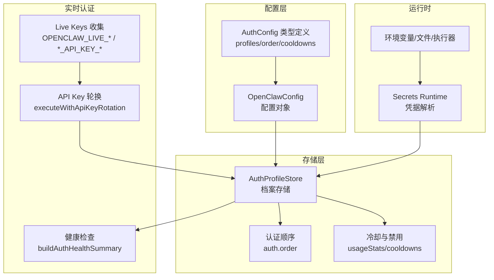
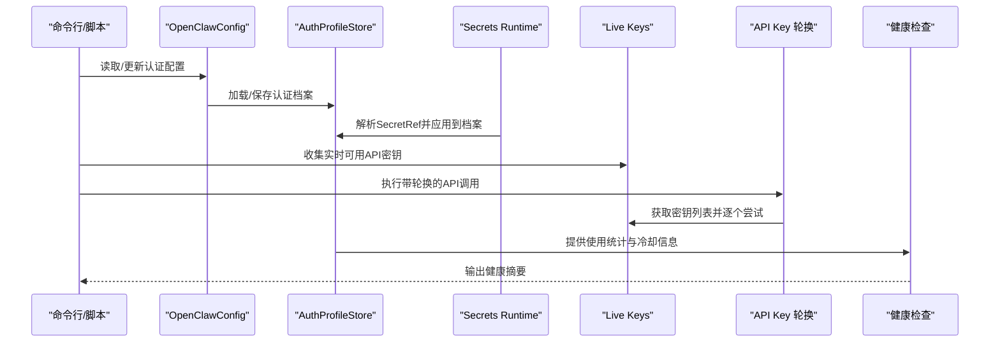
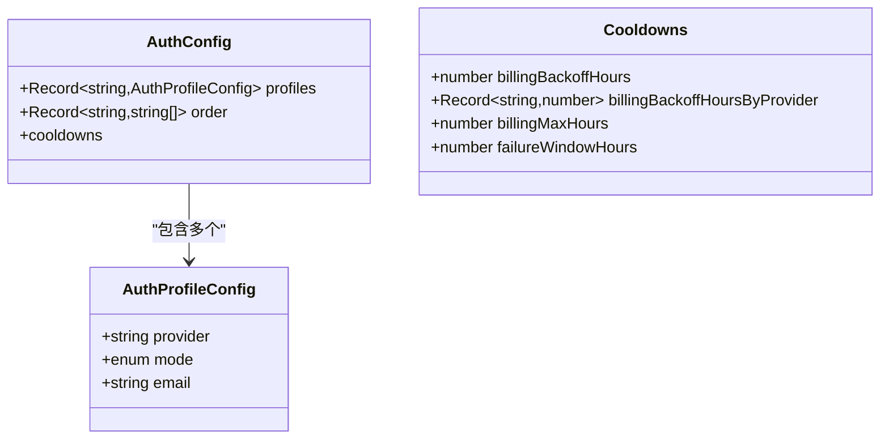
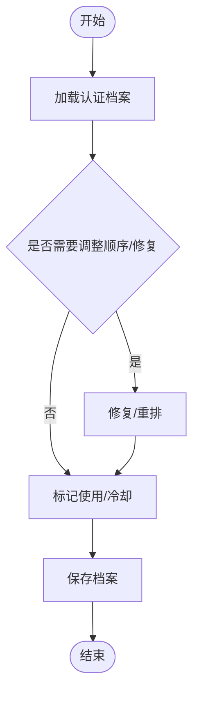
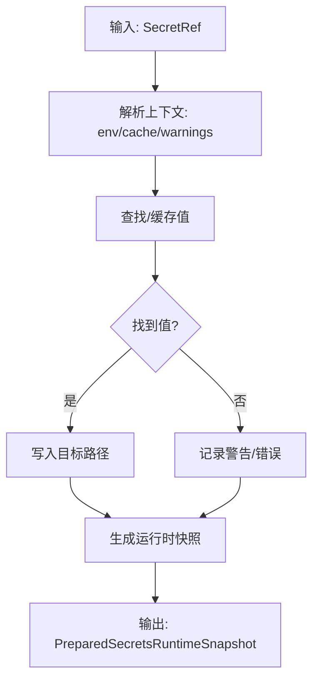
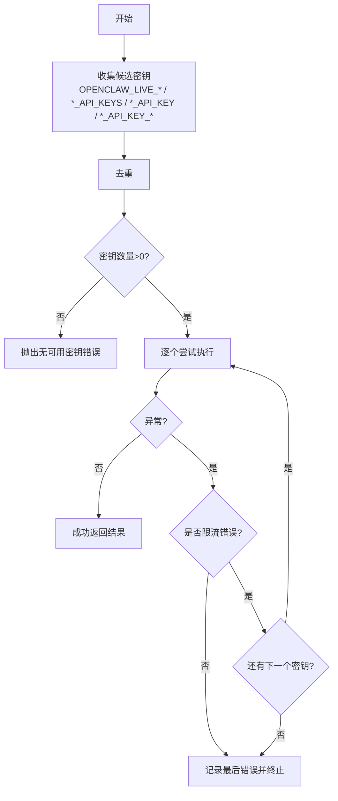
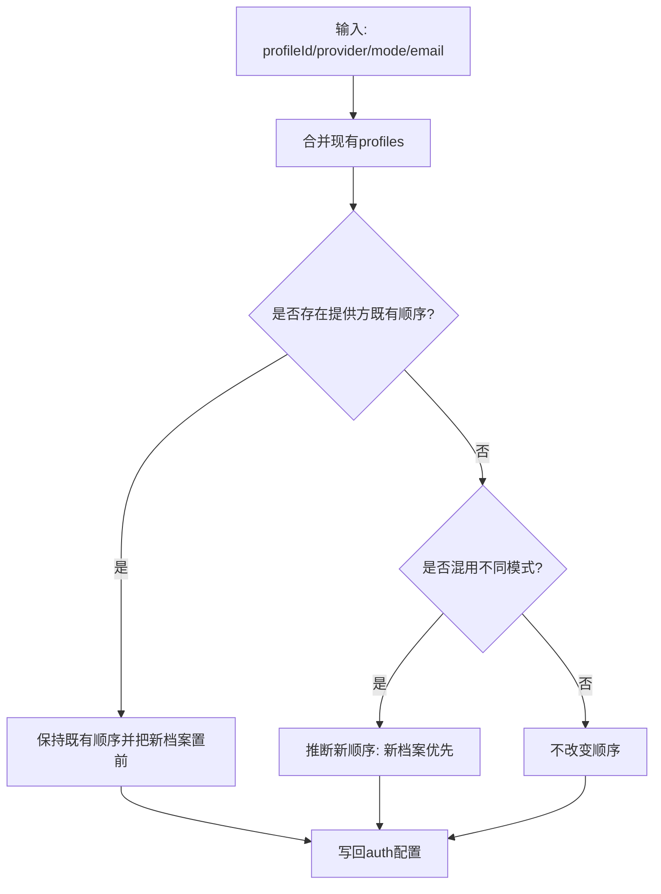
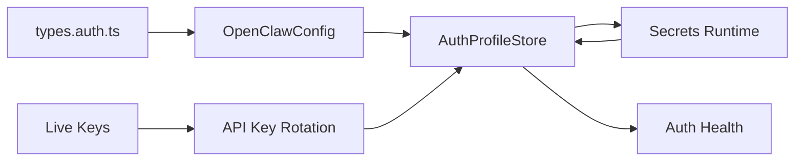

# 代理认证配置

<cite>
**本文引用的文件**
- [src/config/types.auth.ts](file://src/config/types.auth.ts)
- [src/agents/api-key-rotation.ts](file://src/agents/api-key-rotation.ts)
- [src/agents/live-auth-keys.ts](file://src/agents/live-auth-keys.ts)
- [src/agents/auth-health.ts](file://src/agents/auth-health.ts)
- [src/commands/models/list.auth-overview.ts](file://src/commands/models/list.auth-overview.ts)
- [src/commands/models/list.types.ts](file://src/commands/models/list.types.ts)
- [src/agents/auth-profiles.ts](file://src/agents/auth-profiles.ts)
- [docs/gateway/authentication.md](file://docs/gateway/authentication.md)
- [src/commands/onboard-auth.config-core.ts](file://src/commands/onboard-auth.config-core.ts)
- [src/secrets/runtime.ts](file://src/secrets/runtime.ts)
</cite>

## 目录

1. [简介](#简介)
2. [项目结构](#项目结构)
3. [核心组件](#核心组件)
4. [架构总览](#架构总览)
5. [详细组件分析](#详细组件分析)
6. [依赖关系分析](#依赖关系分析)
7. [性能考量](#性能考量)
8. [故障排除指南](#故障排除指南)
9. [结论](#结论)
10. [附录](#附录)

## 简介

本文件面向OpenClaw代理认证配置系统，系统性阐述认证配置文件管理、API密钥轮换与实时认证机制；详解认证配置的存储、同步与验证流程；并覆盖认证健康检查、故障转移与安全策略。文档同时提供认证配置模板、最佳实践与安全建议，并给出维护与故障排除的实用指南。

## 项目结构

OpenClaw的认证体系围绕“配置模型（OpenClawConfig）+ 认证档案存储（AuthProfileStore）+ 运行时解析（Secrets Runtime）+ 实时键收集与轮换（Live Keys + Rotation）+ 健康检查（Auth Health）”构建。关键模块分布如下：

- 配置类型与结构：定义认证配置的数据结构与字段约束
- 认证档案与存储：提供档案读写、排序、冷却、修复等能力
- 运行时凭据解析：支持从环境变量、文件、执行器等来源解析密钥
- 实时键收集与轮换：按优先级收集可用API密钥并在限流错误时自动切换
- 健康检查与状态展示：汇总各供应商的认证状态与到期提醒



**图表来源**

- [src/config/types.auth.ts](file://src/config/types.auth.ts#L1-L30)
- [src/agents/auth-profiles.ts](file://src/agents/auth-profiles.ts#L1-L50)
- [src/secrets/runtime.ts](file://src/secrets/runtime.ts#L43-L94)
- [src/agents/live-auth-keys.ts](file://src/agents/live-auth-keys.ts#L1-L203)
- [src/agents/api-key-rotation.ts](file://src/agents/api-key-rotation.ts#L1-L73)
- [src/agents/auth-health.ts](file://src/agents/auth-health.ts#L1-L262)

**章节来源**

- [src/config/types.auth.ts](file://src/config/types.auth.ts#L1-L30)
- [src/agents/auth-profiles.ts](file://src/agents/auth-profiles.ts#L1-L50)
- [src/secrets/runtime.ts](file://src/secrets/runtime.ts#L43-L94)
- [src/agents/live-auth-keys.ts](file://src/agents/live-auth-keys.ts#L1-L203)
- [src/agents/api-key-rotation.ts](file://src/agents/api-key-rotation.ts#L1-L73)
- [src/agents/auth-health.ts](file://src/agents/auth-health.ts#L1-L262)

## 核心组件

- 认证配置类型与结构
  - 定义认证配置的profiles、order与cooldowns等字段，用于描述每个认证档案的提供方、模式（api_key/oauth/token）以及退避策略
- 认证档案存储与管理
  - 提供档案加载、保存、排序、冷却标记、修复与显示标签等能力
- 运行时凭据解析
  - 将SecretRef映射到实际值，支持env/file/exec等来源，并生成运行时快照
- 实时键收集与轮换
  - 按优先级收集可用API密钥，遇到限流错误时自动切换下一个密钥
- 健康检查与状态展示
  - 统计各供应商下档案的过期状态、剩余时间与整体健康度

**章节来源**

- [src/config/types.auth.ts](file://src/config/types.auth.ts#L1-L30)
- [src/agents/auth-profiles.ts](file://src/agents/auth-profiles.ts#L1-L50)
- [src/secrets/runtime.ts](file://src/secrets/runtime.ts#L43-L94)
- [src/agents/live-auth-keys.ts](file://src/agents/live-auth-keys.ts#L1-L203)
- [src/agents/api-key-rotation.ts](file://src/agents/api-key-rotation.ts#L1-L73)
- [src/agents/auth-health.ts](file://src/agents/auth-health.ts#L1-L262)

## 架构总览

认证系统的端到端工作流如下：

- 配置层：通过OpenClawConfig定义认证配置
- 存储层：AuthProfileStore持久化认证档案与使用统计
- 运行时：Secrets Runtime解析SecretRef，填充凭证
- 实时认证：Live Keys收集可用密钥，执行请求时调用轮换逻辑
- 健康检查：定期或按需生成健康摘要，辅助运维与自动化监控



**图表来源**

- [src/commands/onboard-auth.config-core.ts](file://src/commands/onboard-auth.config-core.ts#L469-L539)
- [src/agents/auth-profiles.ts](file://src/agents/auth-profiles.ts#L1-L50)
- [src/secrets/runtime.ts](file://src/secrets/runtime.ts#L43-L94)
- [src/agents/live-auth-keys.ts](file://src/agents/live-auth-keys.ts#L1-L203)
- [src/agents/api-key-rotation.ts](file://src/agents/api-key-rotation.ts#L40-L73)
- [src/agents/auth-health.ts](file://src/agents/auth-health.ts#L165-L262)

## 详细组件分析

### 认证配置类型与结构

- AuthProfileConfig
  - 字段：provider、mode（api_key/oauth/token）、email（可选）
  - 作用：描述单个认证档案的提供方与凭证类型
- AuthConfig
  - 字段：profiles（档案映射）、order（提供方的档案优先序）、cooldowns（退避策略）
  - 作用：集中管理认证配置与全局退避参数



**图表来源**

- [src/config/types.auth.ts](file://src/config/types.auth.ts#L1-L30)

**章节来源**

- [src/config/types.auth.ts](file://src/config/types.auth.ts#L1-L30)

### 认证档案存储与管理

- 关键能力
  - 加载/保存：loadAuthProfileStore/saveAuthProfileStore
  - 排序：resolveAuthProfileOrder/setAuthProfileOrder
  - 冷却与禁用：markAuthProfileCooldown/markAuthProfileFailure/clearAuthProfileCooldown
  - 修复：repairOAuthProfileIdMismatch/suggestOAuthProfileIdForLegacyDefault
  - 显示：resolveAuthProfileDisplayLabel/resolveAuthStorePathForDisplay
- 使用场景
  - 在执行API调用前后标记使用情况与失败原因，驱动轮换与健康检查



**图表来源**

- [src/agents/auth-profiles.ts](file://src/agents/auth-profiles.ts#L1-L50)

**章节来源**

- [src/agents/auth-profiles.ts](file://src/agents/auth-profiles.ts#L1-L50)

### 运行时凭据解析（Secrets Runtime）

- 功能要点
  - 将SecretRef映射为具体值，支持env/file/exec等来源
  - 生成运行时快照，包含源配置、解析后的配置与认证存储
  - 克隆与缓存以保证一致性与性能
- 应用场景
  - 在启动或配置变更时，将SecretRef解析为真实凭证，注入到认证档案中



**图表来源**

- [src/secrets/runtime.ts](file://src/secrets/runtime.ts#L43-L94)

**章节来源**

- [src/secrets/runtime.ts](file://src/secrets/runtime.ts#L43-L94)

### 实时键收集与API密钥轮换

- 键收集
  - 支持优先级：OPENCLAW*LIVE*<PROVIDER>_KEY（单键覆盖）> <PROVIDER>\_API_KEYS（列表）> <PROVIDER>\_API_KEY（主键）> <PROVIDER>\_API_KEY_\*（前缀枚举）
  - Google系列额外回退至GOOGLE_API_KEY
  - 去重后形成候选密钥列表
- 轮换策略
  - 仅在限流错误（如429、rate_limit、quota_exceeded、resource_exhausted、too many requests）时才切换下一个密钥
  - 若所有密钥均失败，返回最后一次错误
  - 可自定义shouldRetry/onRetry钩子扩展行为



**图表来源**

- [src/agents/live-auth-keys.ts](file://src/agents/live-auth-keys.ts#L100-L140)
- [src/agents/api-key-rotation.ts](file://src/agents/api-key-rotation.ts#L40-L73)

**章节来源**

- [src/agents/live-auth-keys.ts](file://src/agents/live-auth-keys.ts#L1-L203)
- [src/agents/api-key-rotation.ts](file://src/agents/api-key-rotation.ts#L1-L73)

### 健康检查与状态展示

- 健康摘要
  - 汇总每个档案的状态（ok/expiring/expired/missing/static），计算供应商整体健康度
  - 支持按提供方过滤与自定义警告阈值
- 展示概览
  - 列表命令根据存储与环境变量/自定义键，输出“有效凭据来源”（profiles/env/models.json/missing）

```mermaid
sequenceDiagram
participant CMD as "models status/list"
participant STORE as "AuthProfileStore"
participant HEALTH as "buildAuthHealthSummary"
participant OVER as "resolveProviderAuthOverview"
CMD->>STORE : 读取档案与使用统计
CMD->>OVER : 计算有效凭据来源与标签
STORE->>HEALTH : 生成健康摘要
HEALTH-->>CMD : 返回摘要与供应商状态
OVER-->>CMD : 返回概览信息
```

**图表来源**

- [src/agents/auth-health.ts](file://src/agents/auth-health.ts#L165-L262)
- [src/commands/models/list.auth-overview.ts](file://src/commands/models/list.auth-overview.ts#L31-L147)
- [src/commands/models/list.types.ts](file://src/commands/models/list.types.ts#L19-L35)

**章节来源**

- [src/agents/auth-health.ts](file://src/agents/auth-health.ts#L1-L262)
- [src/commands/models/list.auth-overview.ts](file://src/commands/models/list.auth-overview.ts#L1-L147)
- [src/commands/models/list.types.ts](file://src/commands/models/list.types.ts#L1-L35)

### 认证配置模板与应用

- 模板要点
  - 通过applyAuthProfileConfig添加/更新认证档案，自动维护提供方的档案顺序
  - 当检测到同一提供方存在多种模式（如oauth与api_key混用）时，可推断新的优先顺序
- 文档参考
  - 官方文档对Anthropic、Claude订阅令牌、setup-token流程有明确指引



**图表来源**

- [src/commands/onboard-auth.config-core.ts](file://src/commands/onboard-auth.config-core.ts#L469-L539)
- [docs/gateway/authentication.md](file://docs/gateway/authentication.md#L19-L104)

**章节来源**

- [src/commands/onboard-auth.config-core.ts](file://src/commands/onboard-auth.config-core.ts#L469-L539)
- [docs/gateway/authentication.md](file://docs/gateway/authentication.md#L1-L169)

## 依赖关系分析

- 配置类型依赖于OpenClawConfig与Zod Schema进行校验
- 认证档案存储依赖于运行时快照与Secrets Runtime解析
- 实时键收集与轮换依赖于环境变量与提供方命名约定
- 健康检查依赖于存储中的使用统计与冷却信息



**图表来源**

- [src/config/types.auth.ts](file://src/config/types.auth.ts#L1-L30)
- [src/agents/auth-profiles.ts](file://src/agents/auth-profiles.ts#L1-L50)
- [src/secrets/runtime.ts](file://src/secrets/runtime.ts#L43-L94)
- [src/agents/live-auth-keys.ts](file://src/agents/live-auth-keys.ts#L1-L203)
- [src/agents/api-key-rotation.ts](file://src/agents/api-key-rotation.ts#L1-L73)
- [src/agents/auth-health.ts](file://src/agents/auth-health.ts#L1-L262)

**章节来源**

- [src/config/types.auth.ts](file://src/config/types.auth.ts#L1-L30)
- [src/agents/auth-profiles.ts](file://src/agents/auth-profiles.ts#L1-L50)
- [src/secrets/runtime.ts](file://src/secrets/runtime.ts#L43-L94)
- [src/agents/live-auth-keys.ts](file://src/agents/live-auth-keys.ts#L1-L203)
- [src/agents/api-key-rotation.ts](file://src/agents/api-key-rotation.ts#L1-L73)
- [src/agents/auth-health.ts](file://src/agents/auth-health.ts#L1-L262)

## 性能考量

- 去重与缓存
  - 密钥收集阶段进行去重，避免重复尝试相同密钥
  - Secrets Runtime采用快照克隆与缓存，减少重复解析成本
- 限流短路
  - 轮换仅在限流错误触发，避免非限流错误的无效重试
- 健康检查批处理
  - 汇总式健康摘要减少多次查询带来的开销

[本节为通用指导，无需特定文件引用]

## 故障排除指南

- “未找到凭据”
  - 检查网关主机上的环境变量或onboard存储的API密钥
  - 对于Anthropic订阅令牌，使用setup-token流程并在网关主机上重新粘贴
- 凭据即将到期/已过期
  - 使用models status查看具体到期档案，必要时重新设置令牌
- 限流导致失败
  - 确认是否配置了多组密钥并启用OPENCLAW*LIVE*_或_\_API_KEYS
  - 观察轮换日志，确认是否正确识别限流错误并切换到下一个密钥
- 健康检查退出码
  - 使用--check模式在CI/自动化脚本中判断凭据状态（过期/缺失/正常）

**章节来源**

- [docs/gateway/authentication.md](file://docs/gateway/authentication.md#L149-L169)
- [src/agents/api-key-rotation.ts](file://src/agents/api-key-rotation.ts#L40-L73)
- [src/agents/auth-health.ts](file://src/agents/auth-health.ts#L165-L262)

## 结论

OpenClaw的认证配置系统通过清晰的配置类型、可靠的档案存储、灵活的运行时解析、稳健的实时轮换与全面的健康检查，实现了高可用、可观测且易维护的代理认证能力。结合官方文档与内置命令，用户可以便捷地完成凭据配置、轮换与运维监控。

[本节为总结性内容，无需特定文件引用]

## 附录

### 最佳实践

- 优先使用API密钥（Anthropic等直连场景），并通过环境变量或onboard存储在网关主机
- 为Google系列提供额外回退密钥（GOOGLE_API_KEY），确保多键冗余
- 合理设置退避参数（billingBackoffHours/billingMaxHours/failureWindowHours），平衡可用性与恢复速度
- 定期运行models status与--check，配合自动化脚本实现健康监控

**章节来源**

- [docs/gateway/authentication.md](file://docs/gateway/authentication.md#L112-L148)
- [src/config/types.auth.ts](file://src/config/types.auth.ts#L16-L29)

### 安全建议

- 不在代码仓库中硬编码密钥，优先使用SecretRef与受控环境变量
- 限制密钥粒度与权限范围，按提供方与用途拆分档案
- 定期轮换密钥，启用限流自动切换，降低单一密钥失效风险
- 对敏感输出（如令牌）进行脱敏展示与日志过滤

**章节来源**

- [src/commands/models/list.auth-overview.ts](file://src/commands/models/list.auth-overview.ts#L15-L29)
- [src/secrets/runtime.ts](file://src/secrets/runtime.ts#L43-L94)
