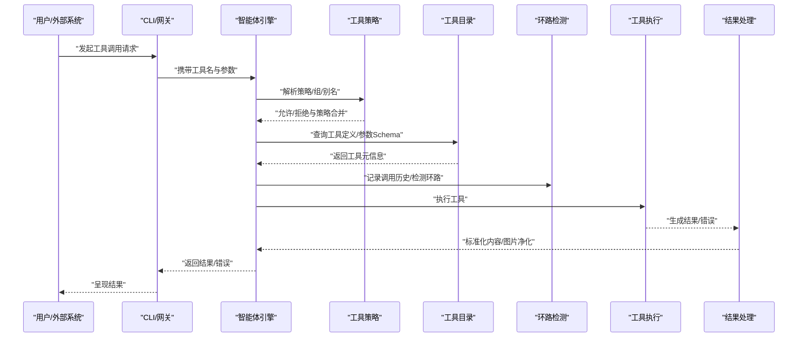
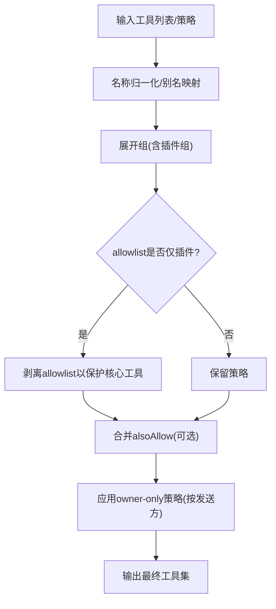
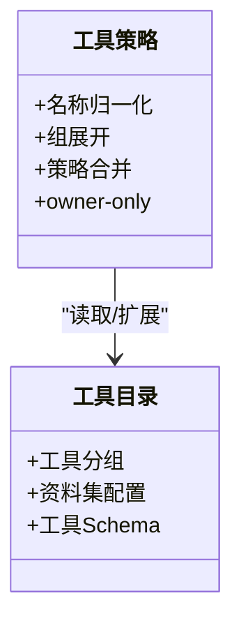
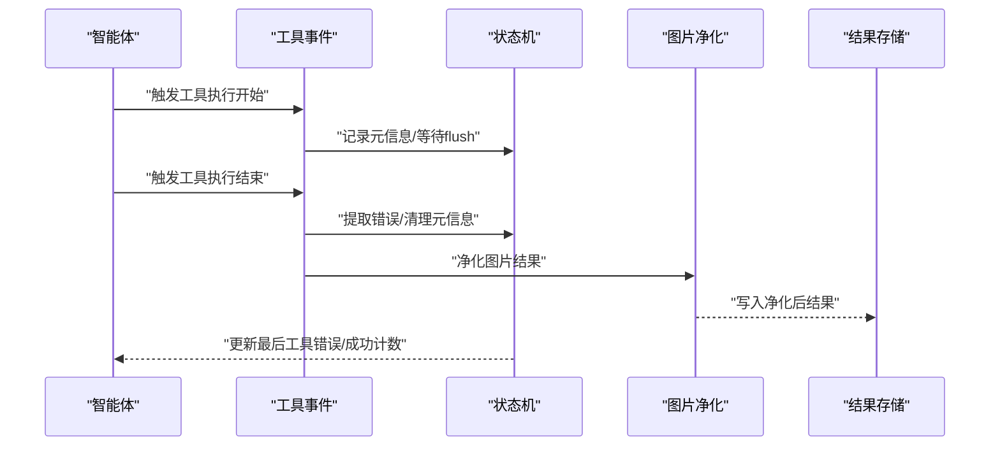
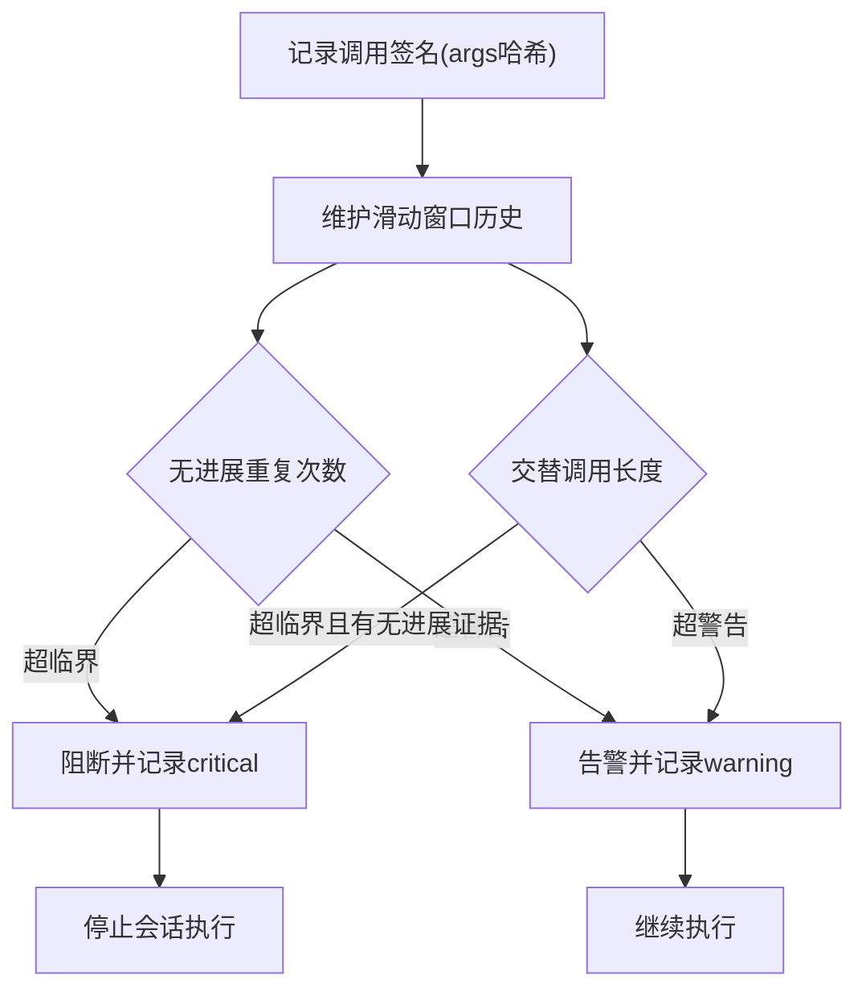
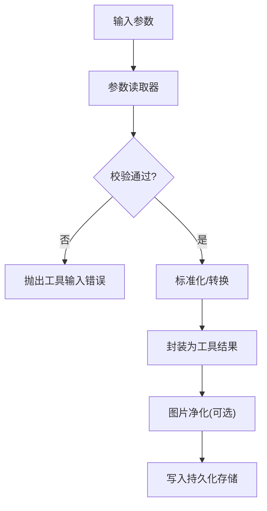
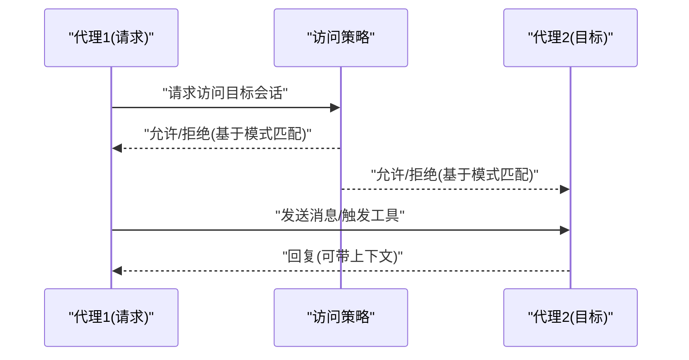
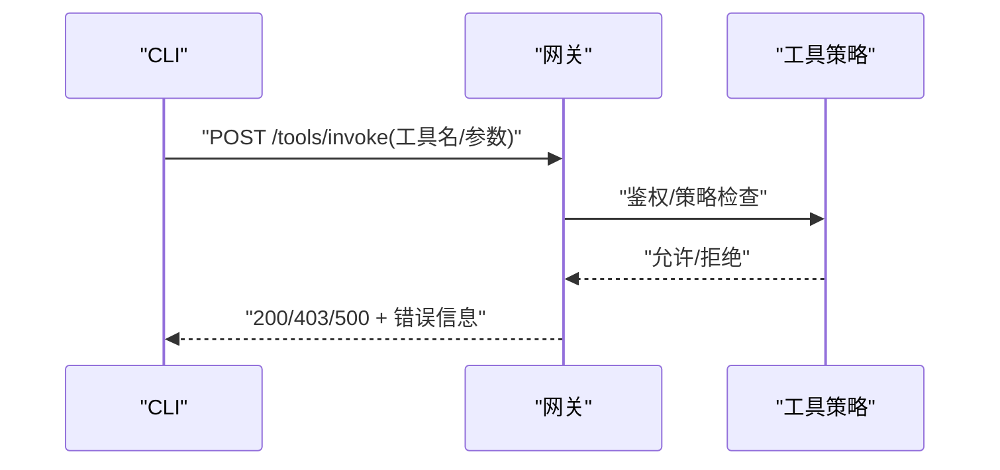
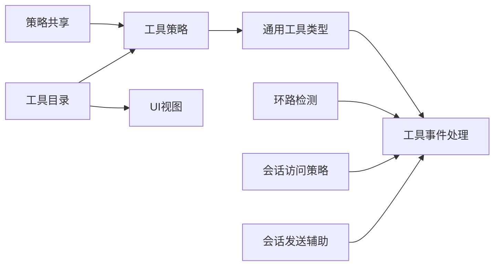

# 工具系统集成

<cite>
**本文引用的文件**
- [src/agents/tool-policy.ts](file://src/agents/tool-policy.ts)
- [src/agents/tool-policy-shared.ts](file://src/agents/tool-policy-shared.ts)
- [src/agents/tool-catalog.ts](file://src/agents/tool-catalog.ts)
- [src/agents/tool-loop-detection.ts](file://src/agents/tool-loop-detection.ts)
- [src/agents/tools/common.ts](file://src/agents/tools/common.ts)
- [src/agents/pi-embedded-subscribe.handlers.tools.ts](file://src/agents/pi-embedded-subscribe.handlers.tools.ts)
- [src/agents/session-tool-result-guard.tool-result-persist-hook.test.ts](file://src/agents/session-tool-result-guard.tool-result-persist-hook.test.ts)
- [src/agents/tool-policy-pipeline.test.ts](file://src/agents/tool-policy-pipeline.test.ts)
- [src/agents/tools/sessions-access.ts](file://src/agents/tools/sessions-access.ts)
- [src/agents/tools/sessions-send-helpers.ts](file://src/agents/tools/sessions-send-helpers.ts)
- [src/gateway/tools-invoke-http.test.ts](file://src/gateway/tools-invoke-http.test.ts)
- [src/cli/cron-cli/register.cron-add.ts](file://src/cli/cron-cli/register.cron-add.ts)
- [src/agents/tool-mutation.ts](file://src/agents/tool-mutation.ts)
- [src/logging/diagnostic.ts](file://src/logging/diagnostic.ts)
- [src/agents/tool-policy.conformance.ts](file://src/agents/tool-policy.conformance.ts)
- [ui/src/ui/views/agents-panels-tools-skills.ts](file://ui/src/ui/views/agents-panels-tools-skills.ts)
- [docs/zh-CN/help/testing.md](file://docs/zh-CN/help/testing.md)
</cite>

## 目录

1. [引言](#引言)
2. [项目结构](#项目结构)
3. [核心组件](#核心组件)
4. [架构总览](#架构总览)
5. [详细组件分析](#详细组件分析)
6. [依赖关系分析](#依赖关系分析)
7. [性能考量](#性能考量)
8. [故障排查指南](#故障排查指南)
9. [结论](#结论)
10. [附录](#附录)

## 引言

本文件面向OpenClaw工具系统集成，围绕工具注册机制、调用策略、执行流程、分类与权限控制、安全策略、性能优化、工具与代理交互、参数传递与结果处理等方面进行系统化说明，并提供工具开发规范、测试方法与部署策略，以及最佳实践与常见问题解决方案。

## 项目结构

OpenClaw在“智能体”与“网关”两侧均实现工具能力，工具策略与目录由智能体侧统一管理，网关侧负责HTTP调用与鉴权；同时提供会话间工具调用与结果持久化的配套能力。

```mermaid
graph TB
subgraph "智能体侧"
TP["工具策略<br/>tool-policy.ts"]
TPS["策略共享/别名/组<br/>tool-policy-shared.ts"]
TC["核心工具目录<br/>tool-catalog.ts"]
TL["环路检测<br/>tool-loop-detection.ts"]
TM["通用工具类型/输入解析<br/>tools/common.ts"]
PIES["工具事件处理器<br/>pi-embedded-subscribe.handlers.tools.ts"]
SACC["会话访问策略<br/>sessions-access.ts"]
SSEH["会话发送辅助<br/>sessions-send-helpers.ts"]
end
subgraph "网关侧"
GW["HTTP工具调用测试<br/>tools-invoke-http.test.ts"]
end
subgraph "CLI"
CRON["定时任务注册CLI<br/>register.cron-add.ts"]
end
subgraph "UI"
UI["工具面板/技能视图<br/>agents-panels-tools-skills.ts"]
end
TP --> TPS
TP --> TC
TL --> TP
TM --> TP
PIES --> TL
PIES --> TM
SACC --> PIES
SSEH --> PIES
GW --> TP
CRON --> TP
UI --> TC
```

图表来源

- [src/agents/tool-policy.ts](file://src/agents/tool-policy.ts#L1-L206)
- [src/agents/tool-policy-shared.ts](file://src/agents/tool-policy-shared.ts#L1-L50)
- [src/agents/tool-catalog.ts](file://src/agents/tool-catalog.ts#L1-L327)
- [src/agents/tool-loop-detection.ts](file://src/agents/tool-loop-detection.ts#L1-L624)
- [src/agents/tools/common.ts](file://src/agents/tools/common.ts#L1-L341)
- [src/agents/pi-embedded-subscribe.handlers.tools.ts](file://src/agents/pi-embedded-subscribe.handlers.tools.ts#L331-L377)
- [src/agents/tools/sessions-access.ts](file://src/agents/tools/sessions-access.ts#L90-L134)
- [src/agents/tools/sessions-send-helpers.ts](file://src/agents/tools/sessions-send-helpers.ts#L91-L117)
- [src/gateway/tools-invoke-http.test.ts](file://src/gateway/tools-invoke-http.test.ts#L527-L549)
- [src/cli/cron-cli/register.cron-add.ts](file://src/cli/cron-cli/register.cron-add.ts#L169-L192)
- [ui/src/ui/views/agents-panels-tools-skills.ts](file://ui/src/ui/views/agents-panels-tools-skills.ts#L47-L66)

章节来源

- [src/agents/tool-policy.ts](file://src/agents/tool-policy.ts#L1-L206)
- [src/agents/tool-policy-shared.ts](file://src/agents/tool-policy-shared.ts#L1-L50)
- [src/agents/tool-catalog.ts](file://src/agents/tool-catalog.ts#L1-L327)
- [src/agents/tool-loop-detection.ts](file://src/agents/tool-loop-detection.ts#L1-L624)
- [src/agents/tools/common.ts](file://src/agents/tools/common.ts#L1-L341)
- [src/agents/pi-embedded-subscribe.handlers.tools.ts](file://src/agents/pi-embedded-subscribe.handlers.tools.ts#L331-L377)
- [src/agents/tools/sessions-access.ts](file://src/agents/tools/sessions-access.ts#L90-L134)
- [src/agents/tools/sessions-send-helpers.ts](file://src/agents/tools/sessions-send-helpers.ts#L91-L117)
- [src/gateway/tools-invoke-http.test.ts](file://src/gateway/tools-invoke-http.test.ts#L527-L549)
- [src/cli/cron-cli/register.cron-add.ts](file://src/cli/cron-cli/register.cron-add.ts#L169-L192)
- [ui/src/ui/views/agents-panels-tools-skills.ts](file://ui/src/ui/views/agents-panels-tools-skills.ts#L47-L66)

## 核心组件

- 工具策略与分组
  - 工具名称归一化、别名映射、组展开、核心工具配置与策略合并。
  - 支持“仅所有者可用”的工具策略与owner-only工具名回退集合。
- 工具目录与分组
  - 核心工具按功能分区（如文件、运行时、网络、内存、会话、UI、消息、自动化、节点、代理、媒体等），并支持按“资料集”导出策略快照。
- 环路检测
  - 基于工具调用签名与结果摘要的重复/轮询/交替调用检测，提供告警与阻断阈值。
- 通用工具类型与输入解析
  - 统一的参数读取、校验与错误类型，图片结果封装与净化。
- 工具事件与结果处理
  - 工具执行开始/结束事件处理、结果清理与错误提取、持久化钩子。
- 会话间工具调用
  - 代理到代理的会话访问策略与回复上下文构建。
- CLI与网关
  - CLI中定时任务注册示例；网关侧HTTP调用鉴权与错误响应验证。

章节来源

- [src/agents/tool-policy.ts](file://src/agents/tool-policy.ts#L1-L206)
- [src/agents/tool-policy-shared.ts](file://src/agents/tool-policy-shared.ts#L1-L50)
- [src/agents/tool-catalog.ts](file://src/agents/tool-catalog.ts#L1-L327)
- [src/agents/tool-loop-detection.ts](file://src/agents/tool-loop-detection.ts#L1-L624)
- [src/agents/tools/common.ts](file://src/agents/tools/common.ts#L1-L341)
- [src/agents/pi-embedded-subscribe.handlers.tools.ts](file://src/agents/pi-embedded-subscribe.handlers.tools.ts#L331-L377)
- [src/agents/tools/sessions-access.ts](file://src/agents/tools/sessions-access.ts#L90-L134)
- [src/agents/tools/sessions-send-helpers.ts](file://src/agents/tools/sessions-send-helpers.ts#L91-L117)
- [src/cli/cron-cli/register.cron-add.ts](file://src/cli/cron-cli/register.cron-add.ts#L169-L192)
- [src/gateway/tools-invoke-http.test.ts](file://src/gateway/tools-invoke-http.test.ts#L527-L549)

## 架构总览

OpenClaw工具系统以“策略—目录—执行—监控—结果”为主线，贯穿智能体与网关两端：



图表来源

- [src/agents/tool-policy.ts](file://src/agents/tool-policy.ts#L1-L206)
- [src/agents/tool-catalog.ts](file://src/agents/tool-catalog.ts#L1-L327)
- [src/agents/tool-loop-detection.ts](file://src/agents/tool-loop-detection.ts#L372-L495)
- [src/agents/tools/common.ts](file://src/agents/tools/common.ts#L230-L302)
- [src/gateway/tools-invoke-http.test.ts](file://src/gateway/tools-invoke-http.test.ts#L527-L549)

## 详细组件分析

### 工具注册与策略

- 名称归一化与别名
  - 将工具名转小写并应用别名映射，确保策略匹配一致性。
- 组展开与插件组
  - 支持“插件组”与“OpenClaw组”等预定义组，自动展开为具体工具名。
- 策略合并与“仅核心工具”保护
  - 当allowlist仅包含插件工具时，自动剥离以避免禁用核心工具；支持alsoAllow追加。
- owner-only策略
  - 对特定工具或发送方非所有者时，执行阶段抛出受限错误。



图表来源

- [src/agents/tool-policy.ts](file://src/agents/tool-policy.ts#L70-L206)
- [src/agents/tool-policy-shared.ts](file://src/agents/tool-policy-shared.ts#L12-L43)

章节来源

- [src/agents/tool-policy.ts](file://src/agents/tool-policy.ts#L1-L206)
- [src/agents/tool-policy-shared.ts](file://src/agents/tool-policy-shared.ts#L1-L50)
- [src/agents/tool-policy-pipeline.test.ts](file://src/agents/tool-policy-pipeline.test.ts#L1-L25)

### 工具目录与分类

- 核心工具按功能分区，支持按资料集导出策略快照，便于CI比对策略漂移。
- 提供“最小/编码/消息/完整”等资料集配置，决定默认允许的工具集合。



图表来源

- [src/agents/tool-catalog.ts](file://src/agents/tool-catalog.ts#L27-L327)
- [src/agents/tool-policy.ts](file://src/agents/tool-policy.ts#L1-L206)

章节来源

- [src/agents/tool-catalog.ts](file://src/agents/tool-catalog.ts#L1-L327)
- [src/agents/tool-policy.conformance.ts](file://src/agents/tool-policy.conformance.ts#L1-L17)

### 执行流程与事件处理

- 工具执行开始/结束事件
  - 记录工具元信息、清理临时状态、提取错误、持久化结果。
- 结果处理与图片净化
  - 统一封装文本与图片内容，按策略限制大小与数量。
- 变更动作指纹与“失败闭合”
  - 对变更型动作，仅当前后指纹一致才清除上次错误，避免误清。



图表来源

- [src/agents/pi-embedded-subscribe.handlers.tools.ts](file://src/agents/pi-embedded-subscribe.handlers.tools.ts#L331-L377)
- [src/agents/tools/common.ts](file://src/agents/tools/common.ts#L257-L302)
- [src/agents/tool-mutation.ts](file://src/agents/tool-mutation.ts#L196-L206)

章节来源

- [src/agents/pi-embedded-subscribe.handlers.tools.ts](file://src/agents/pi-embedded-subscribe.handlers.tools.ts#L331-L377)
- [src/agents/tools/common.ts](file://src/agents/tools/common.ts#L1-L341)
- [src/agents/tool-mutation.ts](file://src/agents/tool-mutation.ts#L196-L206)

### 环路检测与安全策略

- 环路检测
  - 基于稳定序列化哈希的工具调用签名与结果摘要，识别重复、轮询、交替调用模式，并设置警告/阻断阈值。
- 安全日志
  - 针对环路检测发出诊断日志与事件，便于审计与告警。



图表来源

- [src/agents/tool-loop-detection.ts](file://src/agents/tool-loop-detection.ts#L372-L495)
- [src/logging/diagnostic.ts](file://src/logging/diagnostic.ts#L259-L293)

章节来源

- [src/agents/tool-loop-detection.ts](file://src/agents/tool-loop-detection.ts#L1-L624)
- [src/logging/diagnostic.ts](file://src/logging/diagnostic.ts#L259-L293)

### 参数传递与结果处理

- 参数读取与校验
  - 提供字符串、数字、数组、反应参数等多种读取器，支持必填、去空、容错与错误类型化。
- 结果封装
  - 文本与图片混合内容封装，支持详情字段与图片净化。
- 结果持久化钩子
  - 在不破坏持久化前提下加载工具结果持久化钩子，保证数据完整性。



图表来源

- [src/agents/tools/common.ts](file://src/agents/tools/common.ts#L74-L228)
- [src/agents/tools/common.ts](file://src/agents/tools/common.ts#L230-L302)
- [src/agents/session-tool-result-guard.tool-result-persist-hook.test.ts](file://src/agents/session-tool-result-guard.tool-result-persist-hook.test.ts#L43-L81)

章节来源

- [src/agents/tools/common.ts](file://src/agents/tools/common.ts#L1-L341)
- [src/agents/session-tool-result-guard.tool-result-persist-hook.test.ts](file://src/agents/session-tool-result-guard.tool-result-persist-hook.test.ts#L43-L81)

### 代理到代理的工具调用

- 会话访问策略
  - 支持启用/禁用、通配符匹配、双向白名单校验，防止越权访问。
- 回复上下文
  - 构建请求方与目标方的会话/通道上下文，支持“跳过”令牌终止往返。



图表来源

- [src/agents/tools/sessions-access.ts](file://src/agents/tools/sessions-access.ts#L90-L134)
- [src/agents/tools/sessions-send-helpers.ts](file://src/agents/tools/sessions-send-helpers.ts#L91-L117)

章节来源

- [src/agents/tools/sessions-access.ts](file://src/agents/tools/sessions-access.ts#L90-L134)
- [src/agents/tools/sessions-send-helpers.ts](file://src/agents/tools/sessions-send-helpers.ts#L91-L117)

### CLI与网关集成示例

- CLI定时任务注册
  - 校验负载唯一性（系统事件或消息），构造调用载荷。
- 网关HTTP调用
  - 验证鉴权失败与异常场景下的错误码与错误类型。



图表来源

- [src/cli/cron-cli/register.cron-add.ts](file://src/cli/cron-cli/register.cron-add.ts#L169-L192)
- [src/gateway/tools-invoke-http.test.ts](file://src/gateway/tools-invoke-http.test.ts#L527-L549)

章节来源

- [src/cli/cron-cli/register.cron-add.ts](file://src/cli/cron-cli/register.cron-add.ts#L169-L192)
- [src/gateway/tools-invoke-http.test.ts](file://src/gateway/tools-invoke-http.test.ts#L527-L549)

## 依赖关系分析

- 策略层依赖目录层提供的工具分组与资料集；目录层依赖共享层的组与别名。
- 执行层依赖通用工具类型与输入解析；事件层依赖执行层结果与净化。
- 环路检测独立于执行，但与状态机共享历史记录。
- 会话访问策略与发送辅助用于跨代理调用的安全与上下文。
- UI层消费工具目录与资料集，驱动工具面板与技能视图。



图表来源

- [src/agents/tool-policy-shared.ts](file://src/agents/tool-policy-shared.ts#L1-L50)
- [src/agents/tool-policy.ts](file://src/agents/tool-policy.ts#L1-L206)
- [src/agents/tool-catalog.ts](file://src/agents/tool-catalog.ts#L1-L327)
- [src/agents/tools/common.ts](file://src/agents/tools/common.ts#L1-L341)
- [src/agents/pi-embedded-subscribe.handlers.tools.ts](file://src/agents/pi-embedded-subscribe.handlers.tools.ts#L331-L377)
- [src/agents/tool-loop-detection.ts](file://src/agents/tool-loop-detection.ts#L1-L624)
- [src/agents/tools/sessions-access.ts](file://src/agents/tools/sessions-access.ts#L90-L134)
- [src/agents/tools/sessions-send-helpers.ts](file://src/agents/tools/sessions-send-helpers.ts#L91-L117)
- [ui/src/ui/views/agents-panels-tools-skills.ts](file://ui/src/ui/views/agents-panels-tools-skills.ts#L47-L66)

章节来源

- [src/agents/tool-policy-shared.ts](file://src/agents/tool-policy-shared.ts#L1-L50)
- [src/agents/tool-policy.ts](file://src/agents/tool-policy.ts#L1-L206)
- [src/agents/tool-catalog.ts](file://src/agents/tool-catalog.ts#L1-L327)
- [src/agents/tools/common.ts](file://src/agents/tools/common.ts#L1-L341)
- [src/agents/pi-embedded-subscribe.handlers.tools.ts](file://src/agents/pi-embedded-subscribe.handlers.tools.ts#L331-L377)
- [src/agents/tool-loop-detection.ts](file://src/agents/tool-loop-detection.ts#L1-L624)
- [src/agents/tools/sessions-access.ts](file://src/agents/tools/sessions-access.ts#L90-L134)
- [src/agents/tools/sessions-send-helpers.ts](file://src/agents/tools/sessions-send-helpers.ts#L91-L117)
- [ui/src/ui/views/agents-panels-tools-skills.ts](file://ui/src/ui/views/agents-panels-tools-skills.ts#L47-L66)

## 性能考量

- 环路检测阈值与历史窗口
  - 合理设置警告/阻断阈值与历史窗口，避免过度误报与内存占用。
- 结果序列化与哈希
  - 使用稳定序列化与摘要算法，降低重复比较成本；对轮询类工具仅关注关键字段摘要。
- 图片净化与裁剪
  - 在结果层面进行图片净化与大小限制，减少传输与存储开销。
- 策略合并与组展开
  - 在构建期完成组展开与策略合并，运行时仅做快速查找与判断。

[本节为通用指导，无需列出章节来源]

## 故障排查指南

- 策略相关
  - 若工具被意外禁用，检查allowlist是否仅包含插件工具，必要时改用alsoAllow追加；确认资料集与组展开是否符合预期。
- 执行错误
  - 参数缺失或格式错误会抛出工具输入错误；owner-only工具在非所有者发送时会被拒绝。
- 环路阻断
  - 观察诊断日志中的环路检测告警键与级别，定位重复/轮询/交替调用模式，调整调用频率或改为一次性操作。
- 结果持久化
  - 确认工具结果持久化钩子未破坏现有持久化逻辑；必要时在测试环境中验证钩子加载路径。
- 网关调用
  - 鉴权失败返回403，异常场景返回500，检查工具名与参数合法性及服务端错误栈。

章节来源

- [src/agents/tool-policy.ts](file://src/agents/tool-policy.ts#L151-L195)
- [src/agents/tools/common.ts](file://src/agents/tools/common.ts#L26-L42)
- [src/logging/diagnostic.ts](file://src/logging/diagnostic.ts#L259-L293)
- [src/agents/session-tool-result-guard.tool-result-persist-hook.test.ts](file://src/agents/session-tool-result-guard.tool-result-persist-hook.test.ts#L43-L81)
- [src/gateway/tools-invoke-http.test.ts](file://src/gateway/tools-invoke-http.test.ts#L527-L549)

## 结论

OpenClaw工具系统通过“策略—目录—执行—监控—结果”的闭环设计，在保障安全性与可审计性的前提下，提供了灵活的工具注册、调用与结果处理能力。结合环路检测、owner-only策略、图片净化与持久化钩子，能够满足复杂场景下的工具集成需求。建议在集成过程中优先完成策略与目录的梳理、参数Schema的规范化与测试覆盖，并在生产环境启用环路检测与安全日志。

[本节为总结，无需列出章节来源]

## 附录

### 工具开发规范

- 工具命名与参数
  - 使用清晰语义的工具名，遵循参数Schema；必要时提供默认值与枚举约束。
- 权限与安全
  - 对敏感操作标注owner-only；在策略层明确允许/拒绝范围。
- 结果与日志
  - 返回结构化结果与详情字段；避免在结果中泄露敏感信息；必要时进行图片净化。
- 环路与重试
  - 避免无进展的轮询；对可能阻断的调用启用环路检测阈值。

[本节为通用规范，无需列出章节来源]

### 测试方法

- 单元/集成/端到端/实时测试套件
  - 使用Vitest运行多套测试，覆盖工具策略、参数解析、结果持久化与网关调用等场景。
- 关键测试点
  - 策略管道：allowlist仅插件工具时的剥离行为。
  - 结果持久化：钩子加载与持久化不被破坏。
  - 网关调用：鉴权失败与异常场景的错误码与错误类型。

章节来源

- [docs/zh-CN/help/testing.md](file://docs/zh-CN/help/testing.md#L1-L47)
- [src/agents/tool-policy-pipeline.test.ts](file://src/agents/tool-policy-pipeline.test.ts#L1-L25)
- [src/agents/session-tool-result-guard.tool-result-persist-hook.test.ts](file://src/agents/session-tool-result-guard.tool-result-persist-hook.test.ts#L43-L81)
- [src/gateway/tools-invoke-http.test.ts](file://src/gateway/tools-invoke-http.test.ts#L527-L549)

### 部署策略

- 策略与目录
  - 在构建阶段固定策略与目录，配合CI快照校验策略一致性。
- 运行时
  - 在生产环境启用环路检测与安全日志；对图片结果进行净化与大小限制。
- 网关
  - 严格鉴权与错误处理，暴露最小化工具集，避免过度开放。

[本节为通用策略，无需列出章节来源]
