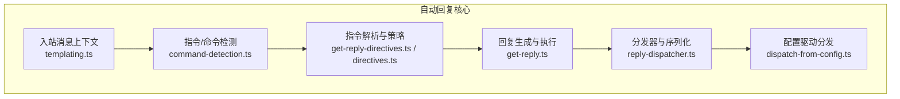
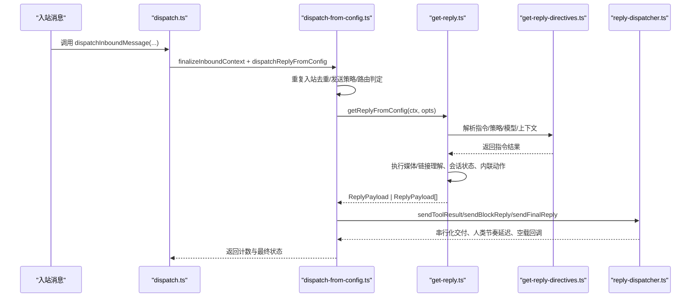
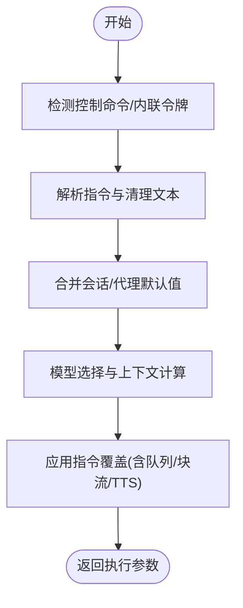
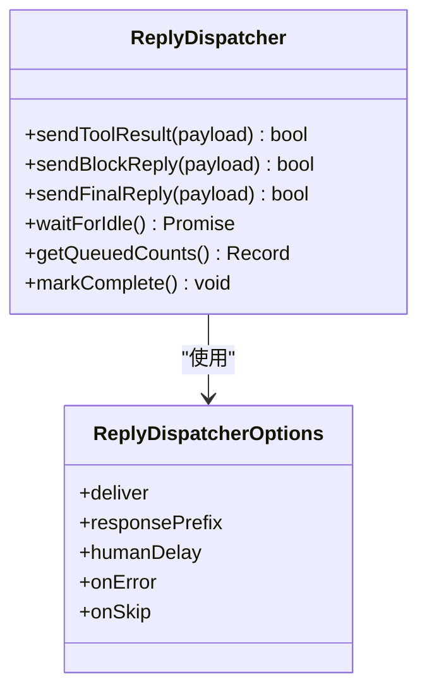
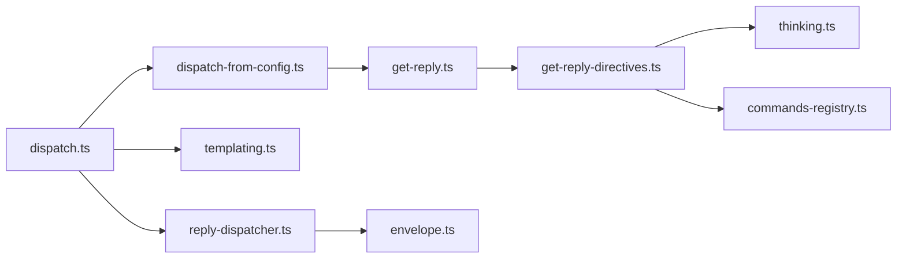

# 自动回复引擎

<cite>
**本文引用的文件**
- [src/auto-reply/types.ts](file://src/auto-reply/types.ts)
- [src/auto-reply/dispatch.ts](file://src/auto-reply/dispatch.ts)
- [src/auto-reply/reply/dispatch-from-config.ts](file://src/auto-reply/reply/dispatch-from-config.ts)
- [src/auto-reply/reply/reply-dispatcher.ts](file://src/auto-reply/reply/reply-dispatcher.ts)
- [src/auto-reply/templating.ts](file://src/auto-reply/templating.ts)
- [src/auto-reply/reply/get-reply.ts](file://src/auto-reply/reply/get-reply.ts)
- [src/auto-reply/reply/get-reply-directives.ts](file://src/auto-reply/reply/get-reply-directives.ts)
- [src/auto-reply/reply/directives.ts](file://src/auto-reply/reply/directives.ts)
- [src/auto-reply/thinking.ts](file://src/auto-reply/thinking.ts)
- [src/auto-reply/commands-registry.ts](file://src/auto-reply/commands-registry.ts)
- [src/auto-reply/command-detection.ts](file://src/auto-reply/command-detection.ts)
- [src/auto-reply/envelope.ts](file://src/auto-reply/envelope.ts)
- [src/auto-reply/telegram/reasoning-lane-coordinator.ts](file://src/auto-reply/telegram/reasoning-lane-coordinator.ts)
</cite>

## 目录

1. [简介](#简介)
2. [项目结构](#项目结构)
3. [核心组件](#核心组件)
4. [架构总览](#架构总览)
5. [详细组件分析](#详细组件分析)
6. [依赖关系分析](#依赖关系分析)
7. [性能考量](#性能考量)
8. [故障排除指南](#故障排除指南)
9. [结论](#结论)
10. [附录：配置与使用](#附录配置与使用)

## 简介

本文件系统化梳理 OpenClaw 的自动回复引擎，覆盖从消息入站到响应分发的完整链路：触发机制（指令/命令检测）、决策流程（思维链/推理/显式指令）、响应生成（块流式/分段/最终回复）、消息分发（跨通道路由/回源路由）、优先级与并发控制、模板与个性化、性能优化与可运维性。目标是帮助开发者与运维人员快速理解并高效配置该引擎。

## 项目结构

自动回复引擎位于 src/auto-reply 目录下，围绕“入站消息上下文 → 指令/策略解析 → 决策执行 → 响应生成 → 分发器派发”的主干流程组织代码，并通过会话状态、模板系统、思维链级别与 TTS 集成等模块实现可扩展的回复能力。

图表来源

- [src/auto-reply/templating.ts](file://src/auto-reply/templating.ts#L13-L167)
- [src/auto-reply/command-detection.ts](file://src/auto-reply/command-detection.ts#L10-L88)
- [src/auto-reply/reply/get-reply-directives.ts](file://src/auto-reply/reply/get-reply-directives.ts#L87-L498)
- [src/auto-reply/reply/get-reply.ts](file://src/auto-reply/reply/get-reply.ts#L55-L396)
- [src/auto-reply/reply/reply-dispatcher.ts](file://src/auto-reply/reply/reply-dispatcher.ts#L105-L209)
- [src/auto-reply/reply/dispatch-from-config.ts](file://src/auto-reply/reply/dispatch-from-config.ts#L94-L580)

章节来源

- [src/auto-reply/templating.ts](file://src/auto-reply/templating.ts#L13-L167)
- [src/auto-reply/command-detection.ts](file://src/auto-reply/command-detection.ts#L10-L88)
- [src/auto-reply/reply/get-reply-directives.ts](file://src/auto-reply/reply/get-reply-directives.ts#L87-L498)
- [src/auto-reply/reply/get-reply.ts](file://src/auto-reply/reply/get-reply.ts#L55-L396)
- [src/auto-reply/reply/reply-dispatcher.ts](file://src/auto-reply/reply/reply-dispatcher.ts#L105-L209)
- [src/auto-reply/reply/dispatch-from-config.ts](file://src/auto-reply/reply/dispatch-from-config.ts#L94-L580)

## 核心组件

- 入站消息上下文与模板：定义消息字段、历史、媒体、会话键、线程标识等，支持简单占位符模板渲染。
- 指令/命令检测：识别文本命令、内联指令令牌、中止触发，决定是否需要授权校验。
- 指令解析与策略：解析思维链/推理/显式指令，合并会话/代理默认值，计算上下文占用与模型选择。
- 回复生成：执行媒体/链接理解、会话状态初始化、内联动作处理、沙箱媒体预处理、运行准备好的回复。
- 分发器与序列化：串行化工具结果/块流/最终回复，注入前缀、心跳剥离、人类节奏延迟、空载回调。
- 配置驱动分发：插件钩子、发送策略、跨通道路由、TTS 应用、重复入站去重、诊断日志。

章节来源

- [src/auto-reply/templating.ts](file://src/auto-reply/templating.ts#L13-L167)
- [src/auto-reply/command-detection.ts](file://src/auto-reply/command-detection.ts#L10-L88)
- [src/auto-reply/reply/get-reply-directives.ts](file://src/auto-reply/reply/get-reply-directives.ts#L87-L498)
- [src/auto-reply/reply/get-reply.ts](file://src/auto-reply/reply/get-reply.ts#L55-L396)
- [src/auto-reply/reply/reply-dispatcher.ts](file://src/auto-reply/reply/reply-dispatcher.ts#L105-L209)
- [src/auto-reply/reply/dispatch-from-config.ts](file://src/auto-reply/reply/dispatch-from-config.ts#L94-L580)

## 架构总览

自动回复引擎采用“配置驱动 + 指令解析 + 分发器序列化”的分层架构。消息经由 dispatch.ts 进入，先完成上下文归一化与去重，再进入配置驱动分发器，按需路由至原通道或内部通道；在生成阶段，指令解析器负责策略落地，随后由分发器保证顺序与节奏。

图表来源

- [src/auto-reply/dispatch.ts](file://src/auto-reply/dispatch.ts#L35-L97)
- [src/auto-reply/reply/dispatch-from-config.ts](file://src/auto-reply/reply/dispatch-from-config.ts#L94-L580)
- [src/auto-reply/reply/get-reply.ts](file://src/auto-reply/reply/get-reply.ts#L55-L396)
- [src/auto-reply/reply/get-reply-directives.ts](file://src/auto-reply/reply/get-reply-directives.ts#L87-L498)
- [src/auto-reply/reply/reply-dispatcher.ts](file://src/auto-reply/reply/reply-dispatcher.ts#L105-L209)

## 详细组件分析

### 组件A：消息上下文与模板系统

- 职责：承载入站消息的全部上下文（正文、历史、媒体、会话键、线程、转发、表情包元数据等），并提供简单的占位符模板渲染能力。
- 关键点：
  - FinalizedMsgContext 强制化 CommandAuthorized 字段，避免未授权分支。
  - TemplateContext 在 MsgContext 基础上追加 BodyStripped、SessionId、IsNewSession 等，便于策略与模板联动。
  - applyTemplate 支持 {{Placeholder}} 占位符替换，类型安全地格式化值。

章节来源

- [src/auto-reply/templating.ts](file://src/auto-reply/templating.ts#L13-L167)
- [src/auto-reply/templating.ts](file://src/auto-reply/templating.ts#L204-L214)

### 组件B：指令/命令检测与解析

- 职责：识别控制命令、内联指令令牌、中止触发；解析思维链/推理/显式指令；合并会话/代理默认值；计算上下文占用与模型选择。
- 关键点：
  - hasControlCommand / isControlCommandMessage：基于命令注册表与规范化体判断。
  - hasInlineCommandTokens：粗略探测内联令牌以决定是否进行授权判定。
  - extractThinkDirective / extractReasoningDirective / extractVerboseDirective / extractElevatedDirective：解析用户指令并清理文本。
  - resolveReplyDirectives：整合指令、会话、代理默认值，产出执行所需参数集合。

图表来源

- [src/auto-reply/command-detection.ts](file://src/auto-reply/command-detection.ts#L10-L88)
- [src/auto-reply/reply/directives.ts](file://src/auto-reply/reply/directives.ts#L91-L193)
- [src/auto-reply/reply/get-reply-directives.ts](file://src/auto-reply/reply/get-reply-directives.ts#L87-L498)

章节来源

- [src/auto-reply/command-detection.ts](file://src/auto-reply/command-detection.ts#L10-L88)
- [src/auto-reply/reply/directives.ts](file://src/auto-reply/reply/directives.ts#L91-L193)
- [src/auto-reply/reply/get-reply-directives.ts](file://src/auto-reply/reply/get-reply-directives.ts#L87-L498)

### 组件C：回复生成与执行

- 职责：加载工作区、初始化会话状态、执行媒体/链接理解、内联动作、沙箱媒体预处理，最终运行准备好的回复。
- 关键点：
  - getReplyFromConfig：串联媒体理解、链接理解、会话状态、指令应用、内联动作、沙箱媒体、运行准备回复。
  - runPreparedReply：根据指令结果与模型选择，生成块流/最终回复。
  - TypingController：统一打字指示器生命周期管理，支持静默令牌与清理回调。

章节来源

- [src/auto-reply/reply/get-reply.ts](file://src/auto-reply/reply/get-reply.ts#L55-L396)

### 组件D：分发器与序列化

- 职责：串行化工具结果/块流/最终回复，注入前缀、心跳剥离、人类节奏延迟、空载回调。
- 关键点：
  - createReplyDispatcher：维护 pending 计数、排队计数、错误/跳过回调、人类节奏延迟。
  - normalizeReplyPayload：支持响应前缀模板、心跳剥离、静默/空载跳过。
  - createReplyDispatcherWithTyping：桥接打字指示器生命周期。

图表来源

- [src/auto-reply/reply/reply-dispatcher.ts](file://src/auto-reply/reply/reply-dispatcher.ts#L74-L209)

章节来源

- [src/auto-reply/reply/reply-dispatcher.ts](file://src/auto-reply/reply/reply-dispatcher.ts#L105-L209)

### 组件E：配置驱动分发与路由

- 职责：插件钩子、发送策略、跨通道路由、TTS 应用、重复入站去重、诊断日志。
- 关键点：
  - dispatchReplyFromConfig：记录诊断事件、触发插件钩子、判定路由到原通道、应用 TTS、汇总统计。
  - routeReply：当入站来自其他通道时，将最终回复路由回原通道。
  - maybeApplyTtsToPayload：在块流/最终阶段生成语音消息。

章节来源

- [src/auto-reply/reply/dispatch-from-config.ts](file://src/auto-reply/reply/dispatch-from-config.ts#L94-L580)

### 组件F：思维链与推理级别

- 职责：标准化思维链/推理/显式指令级别，支持二进制思维提供方与高阶模型提示。
- 关键点：
  - normalizeThinkLevel / normalizeReasoningLevel / normalizeVerboseLevel / normalizeElevatedLevel：统一用户输入。
  - supportsXHighThinking / formatXHighModelHint：针对高阶模型给出提示。
  - isBinaryThinkingProvider：区分二进制思维提供方。

章节来源

- [src/auto-reply/thinking.ts](file://src/auto-reply/thinking.ts#L1-L228)

### 组件G：命令注册与文本别名

- 职责：命令定义、别名映射、规范化、菜单与参数解析。
- 关键点：
  - listChatCommands / listChatCommandsForConfig：按配置过滤可用命令。
  - normalizeCommandBody：规范化命令体，处理冒号语法与机器人用户名提及。
  - getCommandDetection：构建精确匹配与正则模式，加速命令检测。

章节来源

- [src/auto-reply/commands-registry.ts](file://src/auto-reply/commands-registry.ts#L88-L526)

### 组件H：信封与标签

- 职责：格式化入站/出站信封头，支持时区、相对时间、主机/IP 等元信息。
- 关键点：
  - formatInboundEnvelope / formatAgentEnvelope：统一信封格式，避免头部破坏与冗余。
  - formatInboundFromLabel：群组/私聊标签精简输出。

章节来源

- [src/auto-reply/envelope.ts](file://src/auto-reply/envelope.ts#L152-L253)

### 组件I：Telegram 推理通道协调

- 职责：在 Telegram 场景下协调“推理提示”与“最终答案”的缓冲与传递，确保推理通道与最终回复的正确顺序。
- 关键点：
  - createTelegramReasoningStepState：跟踪推理状态、缓冲最终答案、重置步骤。

章节来源

- [src/auto-reply/telegram/reasoning-lane-coordinator.ts](file://src/auto-reply/telegram/reasoning-lane-coordinator.ts#L95-L136)

## 依赖关系分析

- 模块耦合：
  - dispatch.ts 作为入口，依赖 templating.ts、reply-dispatcher.ts 与 dispatch-from-config.ts。
  - dispatch-from-config.ts 依赖 get-reply.ts 与各类策略/路由模块。
  - get-reply.ts 依赖 get-reply-directives.ts 与 thinking.ts、commands-registry.ts 等。
  - reply-dispatcher.ts 与 envelope.ts、templating.ts 存在间接依赖（模板/占位符）。
- 外部集成：
  - 插件钩子（message_received）、会话存储、TTS、路由通道、诊断事件等。

图表来源

- [src/auto-reply/dispatch.ts](file://src/auto-reply/dispatch.ts#L1-L98)
- [src/auto-reply/reply/dispatch-from-config.ts](file://src/auto-reply/reply/dispatch-from-config.ts#L1-L25)
- [src/auto-reply/reply/get-reply.ts](file://src/auto-reply/reply/get-reply.ts#L1-L30)
- [src/auto-reply/reply/get-reply-directives.ts](file://src/auto-reply/reply/get-reply-directives.ts#L1-L25)
- [src/auto-reply/thinking.ts](file://src/auto-reply/thinking.ts#L1-L20)
- [src/auto-reply/commands-registry.ts](file://src/auto-reply/commands-registry.ts#L1-L20)
- [src/auto-reply/reply/reply-dispatcher.ts](file://src/auto-reply/reply/reply-dispatcher.ts#L1-L10)
- [src/auto-reply/envelope.ts](file://src/auto-reply/envelope.ts#L1-L15)

章节来源

- [src/auto-reply/dispatch.ts](file://src/auto-reply/dispatch.ts#L1-L98)
- [src/auto-reply/reply/dispatch-from-config.ts](file://src/auto-reply/reply/dispatch-from-config.ts#L1-L25)
- [src/auto-reply/reply/get-reply.ts](file://src/auto-reply/reply/get-reply.ts#L1-L30)
- [src/auto-reply/reply/get-reply-directives.ts](file://src/auto-reply/reply/get-reply-directives.ts#L1-L25)
- [src/auto-reply/thinking.ts](file://src/auto-reply/thinking.ts#L1-L20)
- [src/auto-reply/commands-registry.ts](file://src/auto-reply/commands-registry.ts#L1-L20)
- [src/auto-reply/reply/reply-dispatcher.ts](file://src/auto-reply/reply/reply-dispatcher.ts#L1-L10)
- [src/auto-reply/envelope.ts](file://src/auto-reply/envelope.ts#L1-L15)

## 性能考量

- 去重与早停：入站重复检测与快速中止路径减少无效计算。
- 串行化与人类节奏：分发器对块流回复施加随机延迟，提升自然度同时避免过载。
- 块流式分发：在支持的通道中启用块流，降低首字节延迟；在不支持的通道抑制推理块显示。
- TTS 合成：仅在必要阶段合成音频，避免重复生成；支持“仅音频无文本”的 TTS-only 回复。
- 会话与工作区：按需加载会话存储与工作区，测试环境可跳过引导文件以加速。
- 指令解析缓存：命令别名映射与命令检测结果具备缓存，避免重复扫描。

[本节为通用指导，无需列出具体文件来源]

## 故障排除指南

- 命令未生效
  - 检查命令是否被配置禁用、是否命中内联令牌探测、是否满足授权条件。
  - 参考：命令检测与规范化逻辑。
- 未收到回复
  - 检查发送策略是否拒绝、是否命中重复入站去重、是否路由到原通道但失败。
  - 参考：dispatch-from-config 中的 sendPolicy 判定与路由逻辑。
- 推理块未显示
  - 某些通道没有专用推理通道，会抑制推理块显示；可在支持通道查看。
  - 参考：dispatch-from-config 中的推理块抑制逻辑。
- 块流后无最终回复
  - 若块流成功但无最终回复，系统会在特定模式下生成 TTS-only 回复。
  - 参考：dispatch-from-config 中的累积块文本与 TTS-only 生成。
- 打字指示器异常
  - TypingController 生命周期与清理回调需正确设置；检查 onTypingController/onTypingCleanup。
  - 参考：types.ts 中的 GetReplyOptions 与 reply-dispatcher.ts 的打字指示器桥接。

章节来源

- [src/auto-reply/command-detection.ts](file://src/auto-reply/command-detection.ts#L82-L88)
- [src/auto-reply/reply/dispatch-from-config.ts](file://src/auto-reply/reply/dispatch-from-config.ts#L336-L380)
- [src/auto-reply/reply/dispatch-from-config.ts](file://src/auto-reply/reply/dispatch-from-config.ts#L436-L441)
- [src/auto-reply/reply/dispatch-from-config.ts](file://src/auto-reply/reply/dispatch-from-config.ts#L514-L568)
- [src/auto-reply/reply/reply-dispatcher.ts](file://src/auto-reply/reply/reply-dispatcher.ts#L211-L241)
- [src/auto-reply/types.ts](file://src/auto-reply/types.ts#L23-L67)

## 结论

OpenClaw 自动回复引擎以“配置驱动 + 指令解析 + 分发器序列化”为核心，结合会话状态、思维链级别、TTS 与跨通道路由，形成高扩展、可运维的回复体系。通过严格的去重、早停与串行化控制，兼顾性能与一致性；通过模板与前缀注入、推理通道协调与块流策略，满足多渠道差异化体验需求。

[本节为总结性内容，无需列出具体文件来源]

## 附录：配置与使用

- 基本调用
  - 使用 dispatchInboundMessage 或其变体包装消息处理，传入 MsgContext 与 OpenClawConfig。
  - 参考：dispatch.ts 的入口函数与选项。
- 指令与策略
  - 在消息体中使用内联指令（如 /think:/verbose:/reasoning:/elevated:/exec:/model:/queue:）。
  - 参考：directives.ts 与 get-reply-directives.ts。
- 会话与工作区
  - getReplyFromConfig 会自动确保代理工作区存在；测试环境可跳过引导文件。
  - 参考：get-reply.ts。
- 分发与路由
  - 通过 ReplyDispatcher 控制工具/块/最终回复的顺序与节奏；必要时路由回原通道。
  - 参考：reply-dispatcher.ts 与 dispatch-from-config.ts。
- 个性化与模板
  - 使用 TemplateContext 的占位符进行个性化输出；支持响应前缀模板与心跳剥离。
  - 参考：templating.ts 与 reply-dispatcher.ts。
- 思维链与推理
  - 通过 thinking.ts 提供的级别标准化与模型能力推断，控制推理可见性与思维强度。
  - 参考：thinking.ts。
- 命令与别名
  - 使用 commands-registry.ts 的命令注册与规范化，确保命令识别与参数解析。
  - 参考：commands-registry.ts。

章节来源

- [src/auto-reply/dispatch.ts](file://src/auto-reply/dispatch.ts#L35-L97)
- [src/auto-reply/reply/directives.ts](file://src/auto-reply/reply/directives.ts#L91-L193)
- [src/auto-reply/reply/get-reply-directives.ts](file://src/auto-reply/reply/get-reply-directives.ts#L87-L498)
- [src/auto-reply/reply/get-reply.ts](file://src/auto-reply/reply/get-reply.ts#L55-L110)
- [src/auto-reply/reply/reply-dispatcher.ts](file://src/auto-reply/reply/reply-dispatcher.ts#L105-L209)
- [src/auto-reply/reply/dispatch-from-config.ts](file://src/auto-reply/reply/dispatch-from-config.ts#L94-L158)
- [src/auto-reply/templating.ts](file://src/auto-reply/templating.ts#L204-L214)
- [src/auto-reply/thinking.ts](file://src/auto-reply/thinking.ts#L1-L228)
- [src/auto-reply/commands-registry.ts](file://src/auto-reply/commands-registry.ts#L373-L422)
