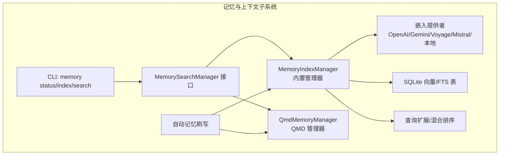
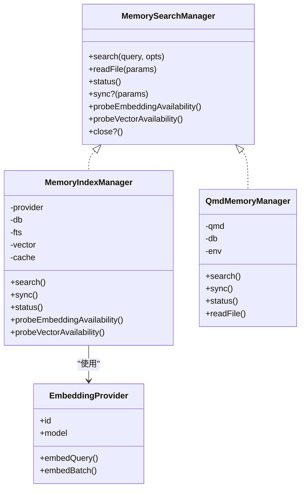
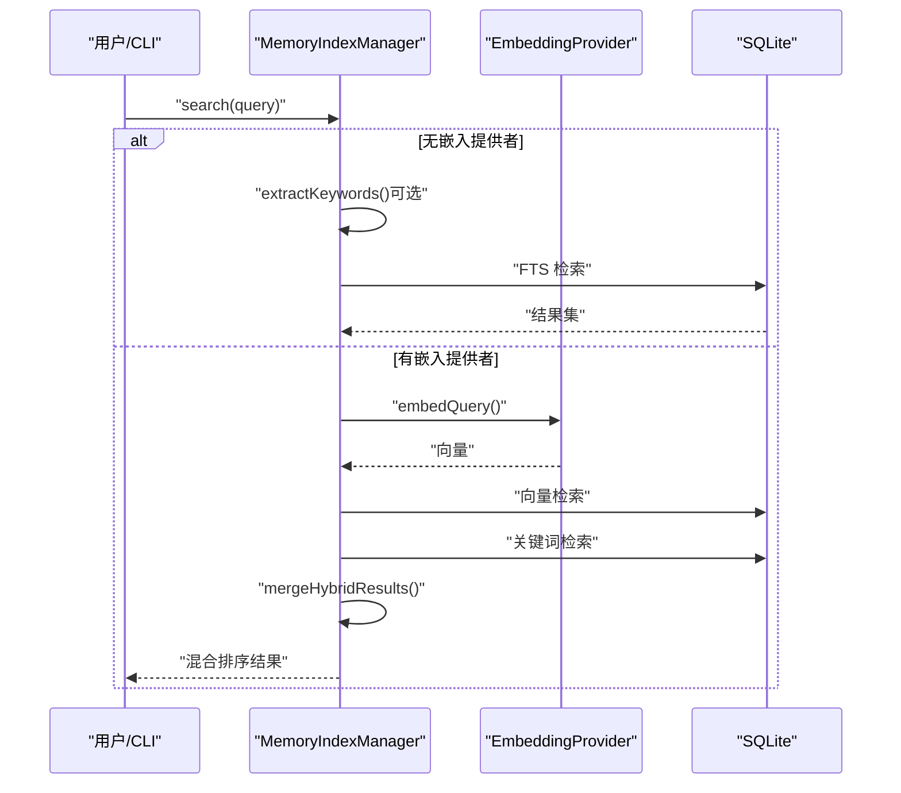
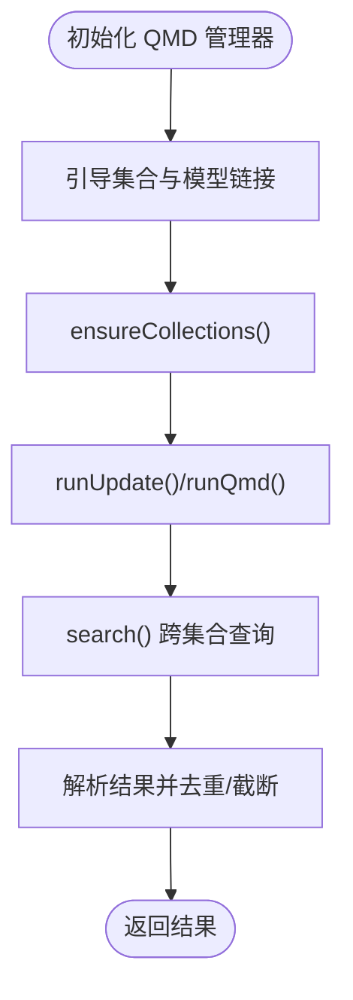
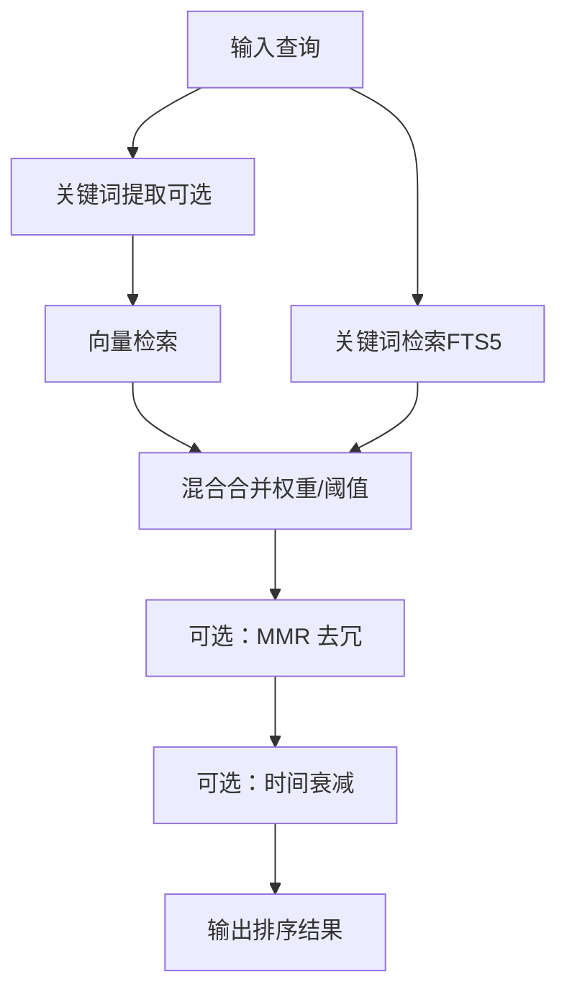
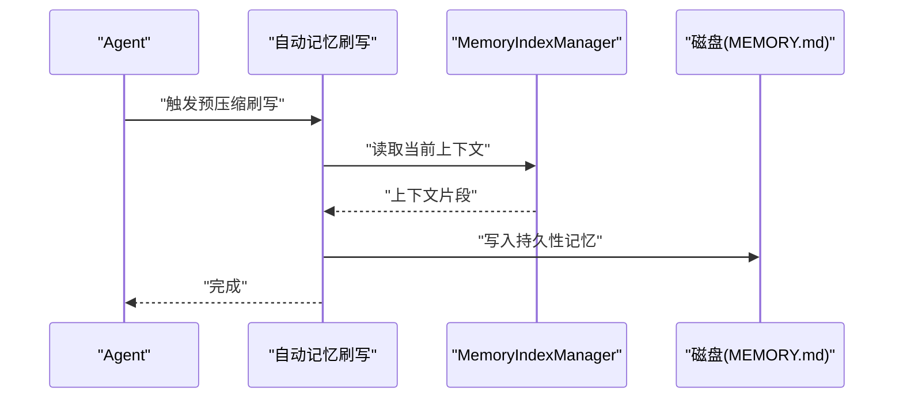
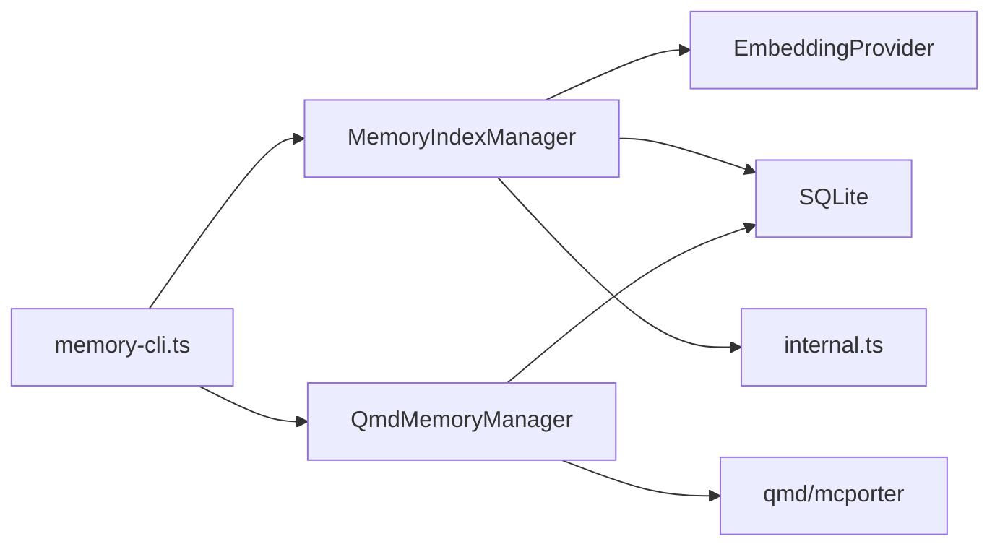

# 记忆与上下文系统

<cite>
**本文引用的文件**
- [src/memory/index.ts](file://src/memory/index.ts)
- [src/memory/manager.ts](file://src/memory/manager.ts)
- [src/memory/qmd-manager.ts](file://src/memory/qmd-manager.ts)
- [src/memory/backend-config.ts](file://src/memory/backend-config.ts)
- [src/memory/types.ts](file://src/memory/types.ts)
- [src/memory/embeddings.ts](file://src/memory/embeddings.ts)
- [src/memory/hybrid.ts](file://src/memory/hybrid.ts)
- [src/memory/internal.ts](file://src/memory/internal.ts)
- [src/memory/manager-embedding-ops.ts](file://src/memory/manager-embedding-ops.ts)
- [src/memory/manager-search.ts](file://src/memory/manager-search.ts)
- [src/memory/query-expansion.ts](file://src/memory/query-expansion.ts)
- [src/cli/memory-cli.ts](file://src/cli/memory-cli.ts)
- [src/auto-reply/reply/memory-flush.ts](file://src/auto-reply/reply/memory-flush.ts)
- [docs/zh-CN/concepts/memory.md](file://docs/zh-CN/concepts/memory.md)
- [docs/zh-CN/concepts/compaction.md](file://docs/zh-CN/concepts/compaction.md)
- [extensions/memory-lancedb/index.ts](file://extensions/memory-lancedb/index.ts)
- [extensions/msteams/src/conversation-store-memory.ts](file://extensions/msteams/src/conversation-store-memory.ts)
</cite>

## 目录

1. [简介](#简介)
2. [项目结构](#项目结构)
3. [核心组件](#核心组件)
4. [架构总览](#架构总览)
5. [详细组件分析](#详细组件分析)
6. [依赖关系分析](#依赖关系分析)
7. [性能考量](#性能考量)
8. [故障排查指南](#故障排查指南)
9. [结论](#结论)
10. [附录](#附录)

## 简介

本文件系统性阐述 OpenClaw 的记忆与上下文系统，覆盖以下主题：

- 记忆存储机制：短期记忆（会话）、长期记忆（工作空间 Markdown 文件）、工作记忆（向量化索引与混合检索）
- 上下文窗口管理与压缩策略：自动压缩与手动压缩、修剪工具结果
- 模型选择策略：基于别名、匹配度与权重的评分与回退
- 上下文压缩、去重与优化算法：BM25、MMR、时间衰减
- 记忆检索、更新与清理策略：增量同步、批处理嵌入、缓存与失效
- 配置、性能调优与数据安全最佳实践

## 项目结构

OpenClaw 的记忆与上下文系统主要由以下模块构成：

- 记忆管理器：内置 SQLite 向量/FTS 混合索引与嵌入批处理
- QMD 管理器：通过外部 qmd 工具构建索引，支持多集合与会话导出
- 搜索与检索：向量相似度、关键词检索、混合排序与重排
- 查询扩展：多语言停用词过滤与关键词提取
- CLI：状态检查、重建索引、搜索
- 自动记忆刷写：在压缩前将“持久性记忆”写入磁盘
- 配置解析：后端选择、集合路径、会话导出、范围控制

**图表来源**

- [src/memory/manager.ts](file://src/memory/manager.ts#L43-L139)
- [src/memory/qmd-manager.ts](file://src/memory/qmd-manager.ts#L141-L286)
- [src/memory/types.ts](file://src/memory/types.ts#L61-L80)
- [src/memory/embeddings.ts](file://src/memory/embeddings.ts#L144-L260)
- [src/cli/memory-cli.ts](file://src/cli/memory-cli.ts#L538-L772)

**章节来源**

- [src/memory/index.ts](file://src/memory/index.ts#L1-L8)
- [src/memory/manager.ts](file://src/memory/manager.ts#L1-L120)
- [src/memory/qmd-manager.ts](file://src/memory/qmd-manager.ts#L1-L120)
- [src/memory/types.ts](file://src/memory/types.ts#L1-L81)
- [src/cli/memory-cli.ts](file://src/cli/memory-cli.ts#L1-L120)

## 核心组件

- MemorySearchManager 接口：统一的搜索、读取、状态、同步、可用性探测能力
- MemoryIndexManager：内置向量/FTS 混合索引，支持批处理嵌入、缓存、并发与回退
- QmdMemoryManager：通过外部 qmd 工具管理索引，支持多集合、会话导出与 mcporter
- 搜索与检索：向量相似度、关键词检索、混合合并、MMR 重排、时间衰减
- 查询扩展：多语言停用词过滤与关键词提取，提升 FTS-only 模式下的召回
- CLI：状态检查、重建索引、搜索结果展示
- 自动记忆刷写：在压缩前将“持久性记忆”写入磁盘，确保压缩后仍可保留关键事实

**章节来源**

- [src/memory/types.ts](file://src/memory/types.ts#L61-L80)
- [src/memory/manager.ts](file://src/memory/manager.ts#L43-L139)
- [src/memory/qmd-manager.ts](file://src/memory/qmd-manager.ts#L141-L286)
- [src/memory/hybrid.ts](file://src/memory/hybrid.ts#L51-L149)
- [src/memory/query-expansion.ts](file://src/memory/query-expansion.ts#L723-L776)
- [src/cli/memory-cli.ts](file://src/cli/memory-cli.ts#L298-L536)
- [src/auto-reply/reply/memory-flush.ts](file://src/auto-reply/reply/memory-flush.ts#L1-L22)

## 架构总览

OpenClaw 的记忆系统采用“后端可插拔 + 混合检索”的设计：

- 后端选择：builtin（内置 SQLite + 向量/FTS）或 qmd（外部 qmd 工具）
- 检索模式：向量检索（需要嵌入提供者）或 FTS-only（无嵌入提供者时自动降级）
- 混合排序：向量分数与关键词 BM25 分数加权融合，可选 MMR 与时间衰减
- 批处理与缓存：嵌入批处理、缓存命中与容量淘汰
- 范围控制：会话发送策略限制（如仅私聊）

**图表来源**

- [src/memory/types.ts](file://src/memory/types.ts#L61-L80)
- [src/memory/manager.ts](file://src/memory/manager.ts#L43-L139)
- [src/memory/qmd-manager.ts](file://src/memory/qmd-manager.ts#L141-L242)
- [src/memory/embeddings.ts](file://src/memory/embeddings.ts#L29-L53)

**章节来源**

- [src/memory/backend-config.ts](file://src/memory/backend-config.ts#L297-L354)
- [src/memory/manager.ts](file://src/memory/manager.ts#L103-L139)
- [src/memory/qmd-manager.ts](file://src/memory/qmd-manager.ts#L141-L242)

## 详细组件分析

### 内置管理器（MemoryIndexManager）

- 数据库与表结构：chunks、chunks_vec、chunks_fts、embedding_cache
- 搜索流程：
  - 若无嵌入提供者：仅关键词检索（FTS-only），可选查询扩展
  - 若有嵌入提供者：向量检索 + 关键词检索，混合合并（向量权重 + 文本权重），可选 MMR 与时间衰减
- 嵌入与批处理：
  - 嵌入缓存：按 provider/model/provider_key/hash 存储，支持容量淘汰
  - 批处理：OpenAI/Gemini/Voyage 提供原生批处理接口，失败时回退到逐条嵌入
  - 超时与重试：速率限制等可重试错误具备指数退避重试
- 同步与增量：
  - 监视文件系统变化，按需增量同步
  - 支持会话监听与定时同步
- 状态与可观测性：提供 files/chunks/dirty/sources 等指标，以及向量/FTS/缓存/批处理状态

**图表来源**

- [src/memory/manager.ts](file://src/memory/manager.ts#L207-L293)
- [src/memory/manager-search.ts](file://src/memory/manager-search.ts#L20-L94)
- [src/memory/hybrid.ts](file://src/memory/hybrid.ts#L51-L149)
- [src/memory/query-expansion.ts](file://src/memory/query-expansion.ts#L723-L776)

**章节来源**

- [src/memory/manager.ts](file://src/memory/manager.ts#L207-L293)
- [src/memory/manager-search.ts](file://src/memory/manager-search.ts#L20-L94)
- [src/memory/hybrid.ts](file://src/memory/hybrid.ts#L51-L149)
- [src/memory/manager-embedding-ops.ts](file://src/memory/manager-embedding-ops.ts#L177-L205)

### QMD 管理器（QmdMemoryManager）

- 外部工具集成：通过 qmd/mcporter 管理索引，支持多集合（默认 MEMORY.md 与 memory/ 目录，以及自定义路径）
- 会话导出：可将会话 JSONL 导出为 Markdown 并加入集合，便于检索
- 范围控制：基于会话发送策略限制（如仅允许私聊）
- 错误修复：缺失集合、空字节集合元数据等问题的自动修复与重试
- 搜索：支持 search/vsearch/query 三种模式，跨集合聚合，注入字符限制与去重

**图表来源**

- [src/memory/qmd-manager.ts](file://src/memory/qmd-manager.ts#L244-L286)
- [src/memory/qmd-manager.ts](file://src/memory/qmd-manager.ts#L298-L343)
- [src/memory/qmd-manager.ts](file://src/memory/qmd-manager.ts#L608-L745)

**章节来源**

- [src/memory/qmd-manager.ts](file://src/memory/qmd-manager.ts#L141-L286)
- [src/memory/backend-config.ts](file://src/memory/backend-config.ts#L297-L354)

### 搜索与检索（向量/关键词/混合）

- 向量检索：余弦距离，支持 SQLite 向量扩展与原生向量表
- 关键词检索：FTS5 + BM25，支持多语言停用词与分词
- 混合排序：向量分数与文本分数加权，可选 MMR 去冗与时间衰减
- 去重与截断：按 id 去重，按 snippet 最大长度截断

**图表来源**

- [src/memory/manager-search.ts](file://src/memory/manager-search.ts#L20-L94)
- [src/memory/manager-search.ts](file://src/memory/manager-search.ts#L136-L191)
- [src/memory/hybrid.ts](file://src/memory/hybrid.ts#L51-L149)

**章节来源**

- [src/memory/manager-search.ts](file://src/memory/manager-search.ts#L20-L94)
- [src/memory/manager-search.ts](file://src/memory/manager-search.ts#L136-L191)
- [src/memory/hybrid.ts](file://src/memory/hybrid.ts#L51-L149)

### 查询扩展（FTS-only 模式）

- 多语言停用词：英语、西班牙语、葡萄牙语、阿拉伯语、中文、韩语、日语
- 分词与 n-gram：中文字符级切分与二元组合，韩语词干剥离与粒子去除
- 关键词提取：过滤无效 token，去重，支持 LLM 扩展回退

**章节来源**

- [src/memory/query-expansion.ts](file://src/memory/query-expansion.ts#L11-L807)

### 自动记忆刷写与上下文压缩

- 自动记忆刷写：在压缩前触发一次“预压缩记忆刷写”，将“持久性记忆”写入磁盘（MEMORY.md 与 daily 日志）
- 上下文压缩：将早期对话摘要化并持久化到会话历史，保持近期消息不变
- 手动压缩：/compact 命令可强制压缩，支持指令参数

**图表来源**

- [src/auto-reply/reply/memory-flush.ts](file://src/auto-reply/reply/memory-flush.ts#L1-L22)
- [docs/zh-CN/concepts/compaction.md](file://docs/zh-CN/concepts/compaction.md#L33-L42)

**章节来源**

- [src/auto-reply/reply/memory-flush.ts](file://src/auto-reply/reply/memory-flush.ts#L1-L22)
- [docs/zh-CN/concepts/compaction.md](file://docs/zh-CN/concepts/compaction.md#L1-L68)

### 模型选择策略

- 优先级：显式指令 > 代理配置 > 心跳解析 > 默认模型
- 匹配评分：基于提供者/模型别名、变体数量、匹配长度、默认项等综合打分
- 回退：若未满足最小阈值，回退至空选择或允许的白名单/存储覆盖

**章节来源**

- [src/auto-reply/reply/model-selection.ts](file://src/auto-reply/reply/model-selection.ts#L254-L554)

### 记忆 CLI 与状态检查

- status：查看 Provider/Model、Sources、Index 统计、FTS/Vector/Cache/Batch 状态
- index：重建索引，支持强制全量重建与进度回调
- search：对索引进行检索，支持最大结果数与最小分数过滤

**章节来源**

- [src/cli/memory-cli.ts](file://src/cli/memory-cli.ts#L298-L536)
- [src/cli/memory-cli.ts](file://src/cli/memory-cli.ts#L538-L772)

### 扩展与适配

- LanceDB 扩展：提供 memory_recall/memory_store 工具，支持向量嵌入与检索
- Teams 会话记忆：基于 Map 的会话存储，支持 upsert/get/list/remove/find

**章节来源**

- [extensions/memory-lancedb/index.ts](file://extensions/memory-lancedb/index.ts#L345-L381)
- [extensions/msteams/src/conversation-store-memory.ts](file://extensions/msteams/src/conversation-store-memory.ts#L1-L47)

## 依赖关系分析

- 组件耦合：
  - MemoryIndexManager 依赖嵌入提供者与 SQLite；与内部工具（分块、哈希、cosine 相似度）强耦合
  - QmdMemoryManager 依赖外部 qmd/mcporter，通过环境变量隔离索引状态
- 外部依赖：
  - 嵌入提供者：OpenAI/Gemini/Voyage/Mistral/本地 node-llama-cpp
  - SQLite 向量扩展：用于高效向量检索
- 循环依赖：未发现循环导入；各模块职责清晰

**图表来源**

- [src/memory/manager.ts](file://src/memory/manager.ts#L1-L120)
- [src/memory/qmd-manager.ts](file://src/memory/qmd-manager.ts#L1-L120)
- [src/cli/memory-cli.ts](file://src/cli/memory-cli.ts#L1-L120)

**章节来源**

- [src/memory/manager.ts](file://src/memory/manager.ts#L1-L120)
- [src/memory/qmd-manager.ts](file://src/memory/qmd-manager.ts#L1-L120)
- [src/memory/internal.ts](file://src/memory/internal.ts#L1-L150)

## 性能考量

- 嵌入批处理与缓存
  - 批大小与并发：根据 provider 类型与网络状况调整
  - 缓存容量：设置最大条目数，定期淘汰最旧条目
  - 命中率：优先从缓存读取，降低重复计算
- 检索性能
  - 向量检索：启用 SQLite 向量扩展可显著提升性能
  - 关键词检索：FTS5 + BM25，建议合理设置候选数与阈值
  - 混合排序：向量权重与文本权重平衡，避免过度偏向任一侧
- I/O 与同步
  - 增量同步：基于文件系统监视，减少全量扫描
  - 会话监听：按需 warm，避免不必要的同步
- 超时与重试
  - 嵌入查询/批处理超时配置，速率限制错误具备指数退避重试
  - 批处理失败达到阈值后禁用批处理并回退到逐条嵌入

**章节来源**

- [src/memory/manager-embedding-ops.ts](file://src/memory/manager-embedding-ops.ts#L27-L36)
- [src/memory/manager-embedding-ops.ts](file://src/memory/manager-embedding-ops.ts#L495-L532)
- [src/memory/manager-embedding-ops.ts](file://src/memory/manager-embedding-ops.ts#L635-L687)

## 故障排查指南

- 嵌入提供者不可用
  - 现象：FTS-only 模式，仅关键词检索
  - 处理：检查 API Key、网络、本地模型安装；必要时切换到远程提供者
- 批处理失败
  - 现象：批处理超时或错误，自动禁用批处理并回退
  - 处理：降低并发、增大超时、检查网络；确认 provider 支持原生批处理
- QMD 索引异常
  - 现象：缺失集合、空字节集合元数据导致查询失败
  - 处理：自动修复集合绑定与重建集合；检查 qmd/mcporter 版本与权限
- 权限与路径
  - 现象：无法读取额外路径或会话目录
  - 处理：检查路径可读性与符号链接；确保工作空间与额外路径合法

**章节来源**

- [src/memory/embeddings.ts](file://src/memory/embeddings.ts#L174-L259)
- [src/memory/manager-embedding-ops.ts](file://src/memory/manager-embedding-ops.ts#L635-L687)
- [src/memory/qmd-manager.ts](file://src/memory/qmd-manager.ts#L432-L441)
- [src/memory/qmd-manager.ts](file://src/memory/qmd-manager.ts#L576-L606)
- [src/cli/memory-cli.ts](file://src/cli/memory-cli.ts#L111-L243)

## 结论

OpenClaw 的记忆与上下文系统通过“后端可插拔 + 混合检索 + 批处理缓存 + 自动刷写”的组合，实现了高可用、高性能且可扩展的记忆能力。内置管理器适合大多数场景，QMD 管理器则提供了更强大的外部工具集成与会话导出能力。配合自动记忆刷写与上下文压缩，系统能够在长会话中保持稳定的上下文窗口与检索质量。

## 附录

- 记忆文件布局与写入策略
  - 工作空间包含 MEMORY.md 与 memory/ 目录，每日日志仅追加；仅在私聊主要会话加载 MEMORY.md
- 上下文压缩与修剪
  - 压缩：摘要化早期对话并持久化；修剪：仅裁剪旧工具结果，不持久化
- 配置要点
  - 后端选择：builtin 或 qmd
  - 集合路径：默认 + 自定义 + 会话导出
  - 搜索模式：search/vsearch/query（qmd）
  - 范围控制：会话发送策略（如仅私聊）

**章节来源**

- [docs/zh-CN/concepts/memory.md](file://docs/zh-CN/concepts/memory.md#L1-L41)
- [docs/zh-CN/concepts/compaction.md](file://docs/zh-CN/concepts/compaction.md#L1-L68)
- [src/memory/backend-config.ts](file://src/memory/backend-config.ts#L297-L354)
