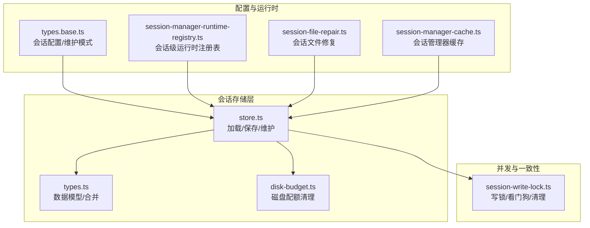
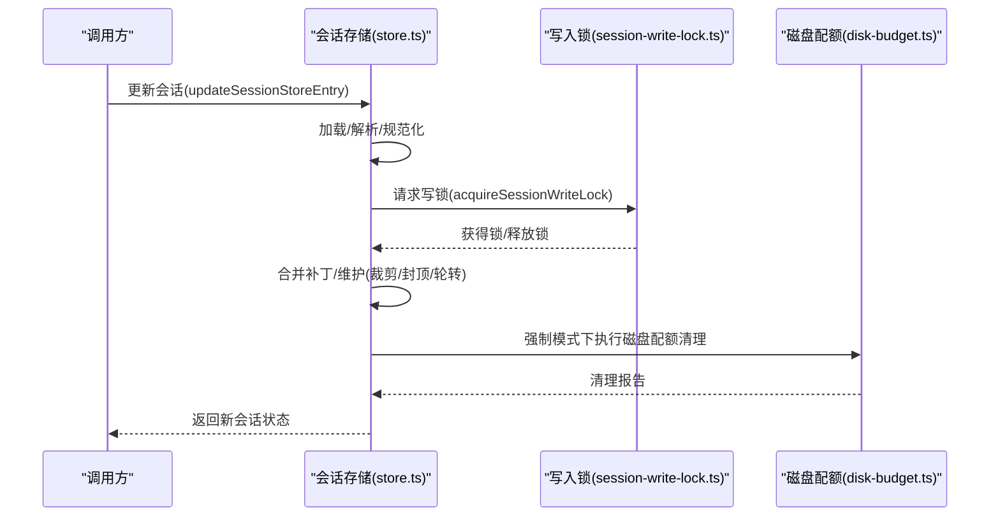
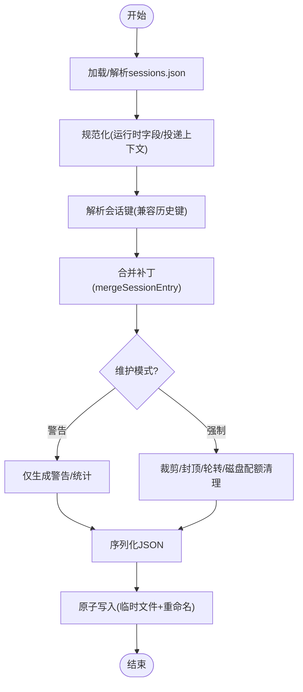
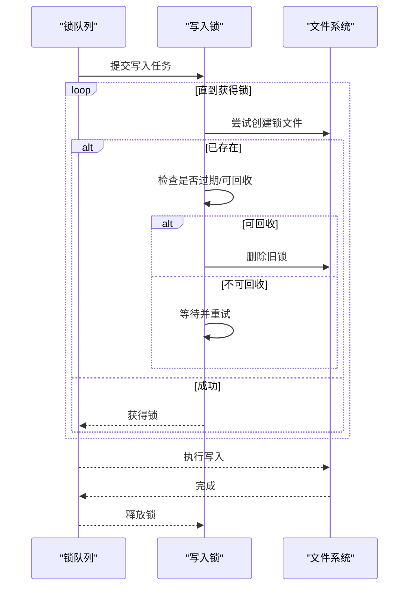
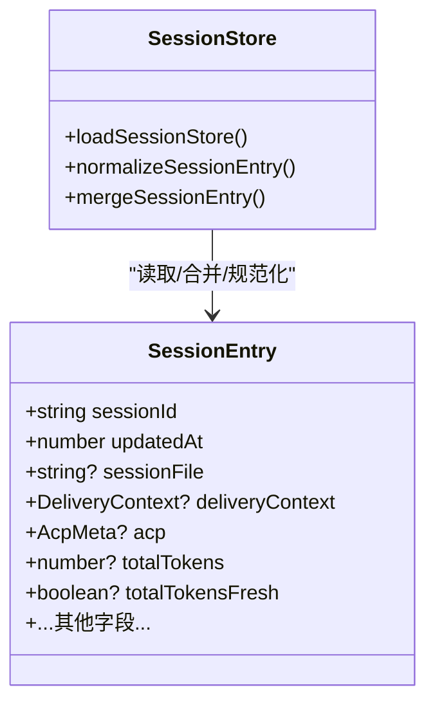
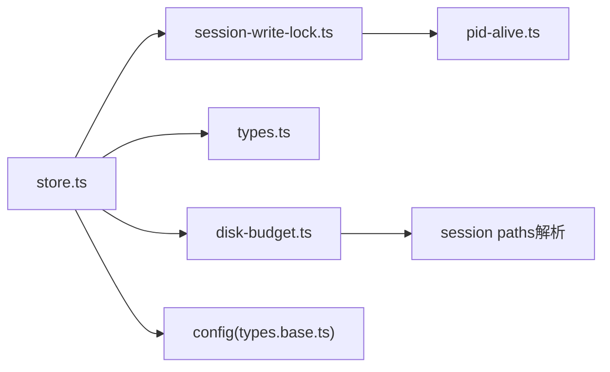

# 会话管理

<cite>
**本文引用的文件**
- [src/config/sessions/store.ts](file://src/config/sessions/store.ts)
- [src/agents/session-write-lock.ts](file://src/agents/session-write-lock.ts)
- [src/config/sessions/types.ts](file://src/config/sessions/types.ts)
- [src/config/sessions/disk-budget.ts](file://src/config/sessions/disk-budget.ts)
- [src/config/types.base.ts](file://src/config/types.base.ts)
- [src/agents/pi-extensions/session-manager-runtime-registry.ts](file://src/agents/pi-extensions/session-manager-runtime-registry.ts)
- [src/agents/session-file-repair.ts](file://src/agents/session-file-repair.ts)
- [src/agents/pi-embedded-runner/session-manager-cache.ts](file://src/agents/pi-embedded-runner/session-manager-cache.ts)
- [src/config/sessions/store.ts](file://src/config/sessions/store.ts#L902-L1031)
- [src/config/sessions/store.ts](file://src/config/sessions/store.ts#L328-L378)
- [src/config/sessions/store.ts](file://src/config/sessions/store.ts#L37-L70)
- [src/config/sessions/store.ts](file://src/config/sessions/store.ts#L455-L474)
- [src/config/sessions/store.ts](file://src/config/sessions/store.ts#L526-L559)
- [src/config/sessions/store.ts](file://src/config/sessions/store.ts#L575-L627)
- [src/config/sessions/store.ts](file://src/config/sessions/store.ts#L642-L800)
- [src/config/sessions/store.ts](file://src/config/sessions/store.ts#L1004-L1031)
- [src/agents/session-write-lock.ts](file://src/agents/session-write-lock.ts#L406-L497)
- [src/agents/session-write-lock.ts](file://src/agents/session-write-lock.ts#L187-L206)
- [src/agents/session-write-lock.ts](file://src/agents/session-write-lock.ts#L349-L404)
- [src/agents/session-write-lock.ts](file://src/agents/session-write-lock.ts#L415-L440)
- [src/config/sessions/types.ts](file://src/config/sessions/types.ts#L68-L174)
- [src/config/sessions/types.ts](file://src/config/sessions/types.ts#L235-L256)
- [src/config/sessions/types.ts](file://src/config/sessions/types.ts#L258-L275)
- [src/config/types.base.ts](file://src/config/types.base.ts#L105-L166)
- [src/config/types.base.ts](file://src/config/types.base.ts#L138-L166)
- [src/agents/pi-extensions/session-manager-runtime-registry.ts](file://src/agents/pi-extensions/session-manager-runtime-registry.ts#L1-L30)
- [src/agents/session-file-repair.ts](file://src/agents/session-file-repair.ts#L19-L43)
- [src/agents/pi-embedded-runner/session-manager-cache.ts](file://src/agents/pi-embedded-runner/session-manager-cache.ts#L1-L54)
</cite>

## 目录

1. [简介](#简介)
2. [项目结构](#项目结构)
3. [核心组件](#核心组件)
4. [架构总览](#架构总览)
5. [详细组件分析](#详细组件分析)
6. [依赖关系分析](#依赖关系分析)
7. [性能考量](#性能考量)
8. [故障排查指南](#故障排查指南)
9. [结论](#结论)
10. [附录](#附录)

## 简介

本文件系统性梳理 OpenClaw 会话管理子系统，覆盖会话生命周期（创建、更新、销毁）、状态持久化、并发控制与一致性保障、序列化与反序列化、会话锁与写入冲突处理、维护策略（裁剪、封顶、轮转、磁盘配额）、配置项与性能调优、内存管理策略，以及调试工具与常见问题处理。目标是帮助开发者与运维人员快速理解并高效使用会话管理能力。

## 项目结构

会话管理相关代码主要位于以下模块：

- 会话存储与维护：src/config/sessions/store.ts
- 会话写入锁与清理：src/agents/session-write-lock.ts
- 会话数据模型与合并：src/config/sessions/types.ts
- 磁盘预算与清理：src/config/sessions/disk-budget.ts
- 会话配置与维护模式：src/config/types.base.ts
- 会话运行时注册表：src/agents/pi-extensions/session-manager-runtime-registry.ts
- 会话文件修复：src/agents/session-file-repair.ts
- 会话管理器缓存：src/agents/pi-embedded-runner/session-manager-cache.ts

图表来源

- [src/config/sessions/store.ts](file://src/config/sessions/store.ts#L1-L120)
- [src/agents/session-write-lock.ts](file://src/agents/session-write-lock.ts#L1-L120)
- [src/config/sessions/types.ts](file://src/config/sessions/types.ts#L1-L80)
- [src/config/sessions/disk-budget.ts](file://src/config/sessions/disk-budget.ts#L1-L60)
- [src/config/types.base.ts](file://src/config/types.base.ts#L105-L166)
- [src/agents/pi-extensions/session-manager-runtime-registry.ts](file://src/agents/pi-extensions/session-manager-runtime-registry.ts#L1-L30)
- [src/agents/session-file-repair.ts](file://src/agents/session-file-repair.ts#L1-L43)
- [src/agents/pi-embedded-runner/session-manager-cache.ts](file://src/agents/pi-embedded-runner/session-manager-cache.ts#L1-L54)

章节来源

- [src/config/sessions/store.ts](file://src/config/sessions/store.ts#L1-L120)
- [src/agents/session-write-lock.ts](file://src/agents/session-write-lock.ts#L1-L120)
- [src/config/sessions/types.ts](file://src/config/sessions/types.ts#L1-L80)
- [src/config/sessions/disk-budget.ts](file://src/config/sessions/disk-budget.ts#L1-L60)
- [src/config/types.base.ts](file://src/config/types.base.ts#L105-L166)
- [src/agents/pi-extensions/session-manager-runtime-registry.ts](file://src/agents/pi-extensions/session-manager-runtime-registry.ts#L1-L30)
- [src/agents/session-file-repair.ts](file://src/agents/session-file-repair.ts#L1-L43)
- [src/agents/pi-embedded-runner/session-manager-cache.ts](file://src/agents/pi-embedded-runner/session-manager-cache.ts#L1-L54)

## 核心组件

- 会话存储与维护：提供会话记录的加载、解析、规范化、合并、持久化、裁剪、封顶、轮转与磁盘配额清理等能力。
- 会话写入锁：通过文件锁实现跨进程/线程的互斥写入，配合看门狗释放超时锁，确保一致性与可恢复性。
- 会话数据模型：定义 SessionEntry 结构、运行时字段规范化、合并策略与新鲜度判定。
- 维护配置：支持按模式（警告/强制）执行清理、按时间与数量裁剪、按大小轮转、按目录磁盘配额清理。
- 运行时注册表与缓存：为会话管理器提供按对象身份的会话级运行时注册表与访问预热缓存。

章节来源

- [src/config/sessions/store.ts](file://src/config/sessions/store.ts#L198-L284)
- [src/agents/session-write-lock.ts](file://src/agents/session-write-lock.ts#L406-L497)
- [src/config/sessions/types.ts](file://src/config/sessions/types.ts#L68-L174)
- [src/config/types.base.ts](file://src/config/types.base.ts#L138-L166)
- [src/agents/pi-extensions/session-manager-runtime-registry.ts](file://src/agents/pi-extensions/session-manager-runtime-registry.ts#L1-L30)
- [src/agents/pi-embedded-runner/session-manager-cache.ts](file://src/agents/pi-embedded-runner/session-manager-cache.ts#L1-L54)

## 架构总览

会话管理采用“存储+锁+维护”的分层设计：

- 存储层负责数据的读写、缓存、规范化与维护；
- 并发层通过写锁与队列串行化写操作，避免竞态；
- 维护层在写入前/后执行裁剪、封顶、轮转与磁盘配额清理；
- 配置层提供维护模式与阈值参数；
- 运行时层提供会话级注册表与缓存预热。

图表来源

- [src/config/sessions/store.ts](file://src/config/sessions/store.ts#L1004-L1031)
- [src/agents/session-write-lock.ts](file://src/agents/session-write-lock.ts#L406-L497)
- [src/config/sessions/disk-budget.ts](file://src/config/sessions/disk-budget.ts#L188-L375)

## 详细组件分析

### 会话存储与维护（store.ts）

- 缓存机制：基于 Map 的 TTL 缓存，支持环境变量覆盖默认 TTL；命中则深拷贝返回，避免外部修改污染缓存。
- 加载与解析：支持 Windows 下临时文件+重命名写入导致的空文件/锁定短暂可见，自动重试；迁移旧字段（provider→channel、room→groupChannel）。
- 规范化：对运行时模型字段进行去空白与删除缺失字段；对投递上下文进行标准化。
- 键解析：支持大小写不敏感与历史键兼容，优先选择 updatedAt 最新的条目。
- 写入维护：在写入前执行维护（裁剪过期、封顶、轮转、磁盘配额），支持“仅警告”模式与“强制执行”模式。
- 原子写入：Windows 使用临时文件+重命名，避免截断与并发读取空文件；非 Windows 平台同样采用临时文件策略以统一行为。
- 文件轮转：超过阈值大小时重命名为 .bak.<timestamp>，最多保留最近 3 个备份。

图表来源

- [src/config/sessions/store.ts](file://src/config/sessions/store.ts#L198-L284)
- [src/config/sessions/store.ts](file://src/config/sessions/store.ts#L642-L800)
- [src/config/sessions/store.ts](file://src/config/sessions/store.ts#L575-L627)
- [src/config/sessions/store.ts](file://src/config/sessions/store.ts#L455-L474)
- [src/config/sessions/store.ts](file://src/config/sessions/store.ts#L526-L559)

章节来源

- [src/config/sessions/store.ts](file://src/config/sessions/store.ts#L198-L284)
- [src/config/sessions/store.ts](file://src/config/sessions/store.ts#L455-L474)
- [src/config/sessions/store.ts](file://src/config/sessions/store.ts#L526-L559)
- [src/config/sessions/store.ts](file://src/config/sessions/store.ts#L575-L627)
- [src/config/sessions/store.ts](file://src/config/sessions/store.ts#L642-L800)
- [src/config/sessions/store.ts](file://src/config/sessions/store.ts#L1004-L1031)

### 会话写入锁与一致性（session-write-lock.ts）

- 写锁：基于文件锁实现，锁文件包含进程 PID 与创建时间；支持可重入（同一进程多次获取计数+1）。
- 超时与最大持有：支持超时与最大持有时间，超时后抛出错误；看门狗定时扫描并强制释放超时锁。
- 清理：进程退出/信号时同步释放所有锁；提供清理过期锁文件接口。
- 争用处理：若锁存在且过期，尝试回收；否则指数退避重试直至超时。
- 队列串行化：通过任务队列串行化并发写入，避免竞争。

图表来源

- [src/agents/session-write-lock.ts](file://src/agents/session-write-lock.ts#L406-L497)
- [src/agents/session-write-lock.ts](file://src/agents/session-write-lock.ts#L187-L206)
- [src/agents/session-write-lock.ts](file://src/agents/session-write-lock.ts#L349-L404)

章节来源

- [src/agents/session-write-lock.ts](file://src/agents/session-write-lock.ts#L406-L497)
- [src/agents/session-write-lock.ts](file://src/agents/session-write-lock.ts#L187-L206)
- [src/agents/session-write-lock.ts](file://src/agents/session-write-lock.ts#L349-L404)
- [src/agents/session-write-lock.ts](file://src/agents/session-write-lock.ts#L415-L440)

### 会话数据模型与合并（types.ts）

- 数据模型：SessionEntry 包含会话标识、更新时间、投递上下文、运行时配置、统计指标、ACP 元数据等。
- 规范化：对模型 provider/model 去空白，缺失时删除对应字段，避免遗留旧值。
- 合并策略：mergeSessionEntry 以现有值与补丁合并，确保 sessionId 与 updatedAt 一致性；当仅补丁 model 未补丁 provider 时，防止遗留旧 provider。
- 新鲜度判定：totalTokensFresh 标记用于判断 token 统计是否新鲜，避免 UI 显示陈旧数据。

图表来源

- [src/config/sessions/types.ts](file://src/config/sessions/types.ts#L68-L174)
- [src/config/sessions/types.ts](file://src/config/sessions/types.ts#L235-L256)

章节来源

- [src/config/sessions/types.ts](file://src/config/sessions/types.ts#L68-L174)
- [src/config/sessions/types.ts](file://src/config/sessions/types.ts#L235-L256)
- [src/config/sessions/types.ts](file://src/config/sessions/types.ts#L258-L275)

### 维护配置与模式（types.base.ts）

- 维护模式：warn/enforce；warn 仅告警不删除，enforce 执行清理。
- 裁剪与封顶：按 updatedAt 截止时间裁剪过期条目；按总数封顶，过期优先。
- 轮转：按文件大小阈值轮转为 .bak.<timestamp>。
- 磁盘配额：按目录总大小与高水位清理，优先删除归档与未被引用的主日志文件。

章节来源

- [src/config/types.base.ts](file://src/config/types.base.ts#L105-L166)
- [src/config/types.base.ts](file://src/config/types.base.ts#L138-L166)

### 会话运行时注册表与缓存

- 运行时注册表：基于 WeakMap，以 SessionManager 对象身份为键，提供 set/get，支持删除。
- 管理器缓存：基于 Map 的 TTL 缓存，预热会话文件以减少 IO。

章节来源

- [src/agents/pi-extensions/session-manager-runtime-registry.ts](file://src/agents/pi-extensions/session-manager-runtime-registry.ts#L1-L30)
- [src/agents/pi-embedded-runner/session-manager-cache.ts](file://src/agents/pi-embedded-runner/session-manager-cache.ts#L1-L54)

### 会话文件修复

- 修复逻辑：检测并修复会话文件首行头记录缺失、丢弃无效行、必要时备份原文件，返回修复报告。

章节来源

- [src/agents/session-file-repair.ts](file://src/agents/session-file-repair.ts#L19-L43)

## 依赖关系分析

- store.ts 依赖：
  - session-write-lock.ts：写锁与清理
  - types.ts：数据模型与合并
  - disk-budget.ts：磁盘配额清理
  - cache-utils：缓存 TTL 解析
  - config：会话维护配置解析
- session-write-lock.ts 依赖：
  - 进程清理与看门狗
  - PID 存活检测
- disk-budget.ts 依赖：
  - 会话文件路径解析与归档识别

图表来源

- [src/config/sessions/store.ts](file://src/config/sessions/store.ts#L1-L30)
- [src/agents/session-write-lock.ts](file://src/agents/session-write-lock.ts#L1-L10)
- [src/config/sessions/disk-budget.ts](file://src/config/sessions/disk-budget.ts#L1-L10)

章节来源

- [src/config/sessions/store.ts](file://src/config/sessions/store.ts#L1-L30)
- [src/agents/session-write-lock.ts](file://src/agents/session-write-lock.ts#L1-L10)
- [src/config/sessions/disk-budget.ts](file://src/config/sessions/disk-budget.ts#L1-L10)

## 性能考量

- 缓存策略
  - 会话存储缓存：默认 TTL 45 秒，可通过环境变量覆盖；命中返回深拷贝，避免外部修改污染。
  - 会话管理器缓存：默认 TTL 45 秒，预热减少 IO。
- 写入路径优化
  - 临时文件+重命名写入，避免截断与并发读取空文件；Windows 增加重试与回退策略。
  - 写入前维护（裁剪/封顶/轮转/磁盘配额）减少后续 IO。
- 维护成本控制
  - warn 模式仅统计与告警，避免大规模删除；enforce 模式按时间/大小/引用关系有序清理。
- 内存管理
  - 深拷贝返回缓存与序列化时避免共享可变状态；清理过期条目与归档文件释放内存与磁盘空间。

章节来源

- [src/config/sessions/store.ts](file://src/config/sessions/store.ts#L37-L70)
- [src/agents/pi-embedded-runner/session-manager-cache.ts](file://src/agents/pi-embedded-runner/session-manager-cache.ts#L1-L54)
- [src/config/sessions/store.ts](file://src/config/sessions/store.ts#L642-L800)

## 故障排查指南

- 写锁超时
  - 现象：长时间无法获得写锁，抛出超时错误。
  - 排查：检查是否存在长时间占用锁的进程；查看看门狗日志；确认锁文件是否可回收。
  - 处理：等待锁释放或重启服务；必要时手动清理过期锁文件。
- 会话文件损坏
  - 现象：读取为空或解析失败。
  - 排查：检查 Windows 下临时文件+重命名写入是否完成；启用修复工具检查并修复。
  - 处理：使用修复工具自动修复；必要时从备份恢复。
- 维护误删
  - 现象：活跃会话被裁剪或删除。
  - 排查：确认维护模式是否为 enforce；检查 warn-only 模式下的统计与告警。
  - 处理：调整维护阈值；在 warn 模式下人工干预；必要时恢复归档。
- 磁盘配额不足
  - 现象：磁盘使用超过上限。
  - 排查：查看磁盘配额清理报告；确认高水位设置与清理顺序。
  - 处理：增大 maxDiskBytes 或降低 highWaterBytes；清理归档或删除不必要文件。

章节来源

- [src/agents/session-write-lock.ts](file://src/agents/session-write-lock.ts#L406-L497)
- [src/agents/session-write-lock.ts](file://src/agents/session-write-lock.ts#L349-L404)
- [src/agents/session-file-repair.ts](file://src/agents/session-file-repair.ts#L19-L43)
- [src/config/sessions/store.ts](file://src/config/sessions/store.ts#L642-L800)
- [src/config/sessions/disk-budget.ts](file://src/config/sessions/disk-budget.ts#L188-L375)

## 结论

OpenClaw 的会话管理以“安全、可维护、可观测”为核心设计原则：通过严格的写锁与队列串行化保障一致性；通过缓存与维护策略平衡性能与资源；通过 warn/enforce 模式与磁盘配额清理实现可持续运营。结合本文提供的配置项、调试工具与排障建议，可有效支撑多场景下的会话生命周期管理需求。

## 附录

### 会话生命周期与关键流程

- 创建：首次写入时生成 sessionId 与 updatedAt，规范化运行时字段。
- 更新：通过 updateSessionStoreEntry 获取写锁，加载并解析，合并补丁，执行维护，原子写回。
- 销毁：裁剪/封顶/轮转/磁盘配额清理可能移除条目与日志文件；warn 模式仅告警不删除。

章节来源

- [src/config/sessions/store.ts](file://src/config/sessions/store.ts#L1004-L1031)
- [src/config/sessions/types.ts](file://src/config/sessions/types.ts#L235-L256)

### 会话锁机制与并发控制

- 队列串行化：每个会话文件维护一个任务队列，先进先出串行执行。
- 超时与最大持有：超时抛错，看门狗强制释放超时锁。
- 可重入：同一进程多次获取计数+1，释放时计数减至 0 才真正释放。

章节来源

- [src/config/sessions/store.ts](file://src/config/sessions/store.ts#L902-L1031)
- [src/agents/session-write-lock.ts](file://src/agents/session-write-lock.ts#L406-L497)
- [src/agents/session-write-lock.ts](file://src/agents/session-write-lock.ts#L415-L440)

### 维护策略与配置要点

- 维护模式：warn（仅告警）/enforce（强制清理）。
- 裁剪：按 updatedAt 截止时间删除过期条目。
- 封顶：按总数上限保留最新条目。
- 轮转：按文件大小阈值轮转为 .bak.<timestamp>。
- 磁盘配额：按目录总大小与高水位清理，优先删除未被引用的日志文件。

章节来源

- [src/config/types.base.ts](file://src/config/types.base.ts#L138-L166)
- [src/config/sessions/store.ts](file://src/config/sessions/store.ts#L328-L378)
- [src/config/sessions/store.ts](file://src/config/sessions/store.ts#L455-L474)
- [src/config/sessions/store.ts](file://src/config/sessions/store.ts#L526-L559)
- [src/config/sessions/store.ts](file://src/config/sessions/store.ts#L575-L627)
- [src/config/sessions/disk-budget.ts](file://src/config/sessions/disk-budget.ts#L188-L375)

### 序列化与反序列化

- 反序列化：读取 JSON，兼容空文件/锁定短暂可见；迁移旧字段；规范化。
- 序列化：写入前规范化与维护；使用临时文件+重命名实现原子写入。

章节来源

- [src/config/sessions/store.ts](file://src/config/sessions/store.ts#L198-L284)
- [src/config/sessions/store.ts](file://src/config/sessions/store.ts#L642-L800)

### 调试工具与使用建议

- 会话文件修复：检测并修复首行头缺失、丢弃无效行，必要时备份。
- 写锁清理：清理过期锁文件，支持仅统计与实际删除两种模式。
- 维护报告：输出裁剪/封顶/轮转/磁盘配额清理统计，便于观测与审计。

章节来源

- [src/agents/session-file-repair.ts](file://src/agents/session-file-repair.ts#L19-L43)
- [src/agents/session-write-lock.ts](file://src/agents/session-write-lock.ts#L349-L404)
- [src/config/sessions/store.ts](file://src/config/sessions/store.ts#L642-L800)
