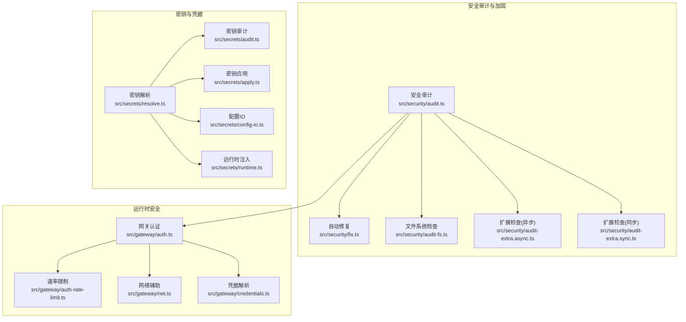
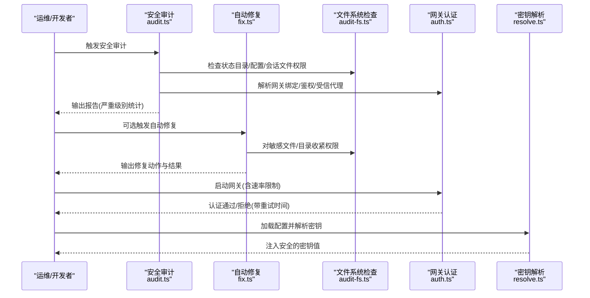
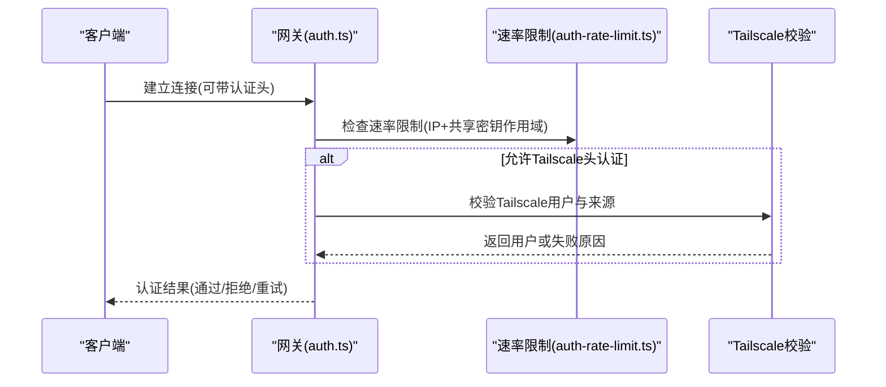
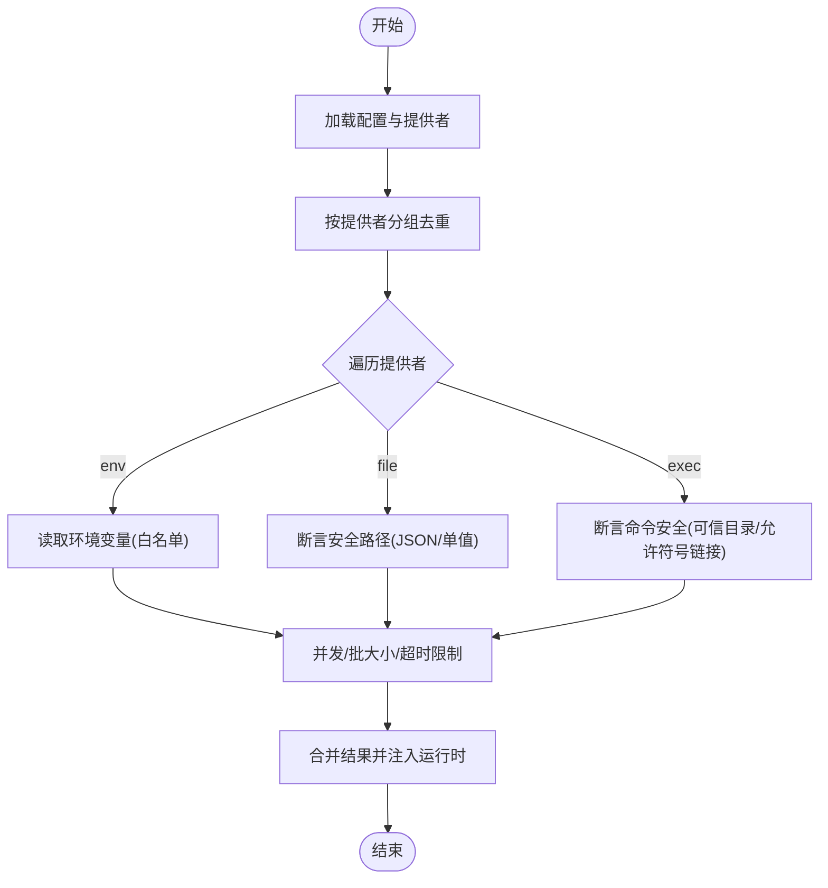
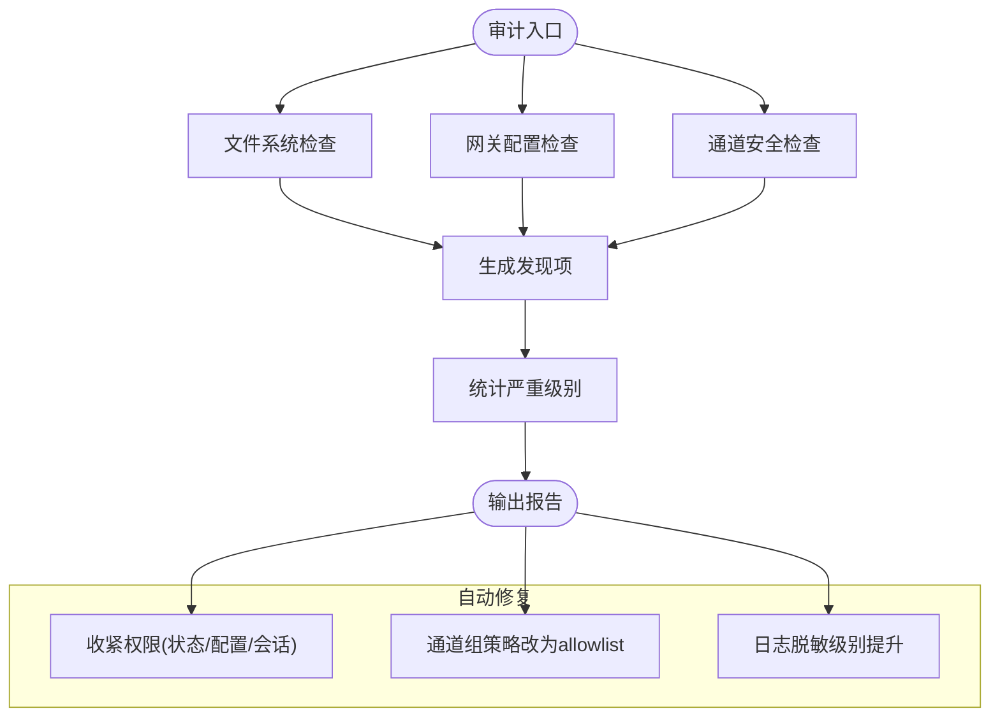
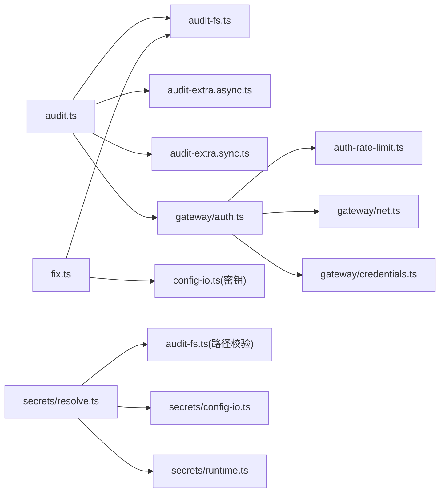

# 安全架构

<cite>
**本文引用的文件**
- [SECURITY.md](file://SECURITY.md)
- [audit.ts](file://src/security/audit.ts)
- [fix.ts](file://src/security/fix.ts)
- [audit-extra.async.ts](file://src/security/audit-extra.async.ts)
- [audit-extra.sync.ts](file://src/security/audit-extra.sync.ts)
- [audit-channel.ts](file://src/security/audit-channel.ts)
- [audit-fs.ts](file://src/security/audit-fs.ts)
- [windows-acl.ts](file://src/security/windows-acl.ts)
- [secret-equal.ts](file://src/security/secret-equal.ts)
- [auth.ts](file://src/gateway/auth.ts)
- [auth-rate-limit.ts](file://src/gateway/auth-rate-limit.ts)
- [credentials.ts](file://src/gateway/credentials.ts)
- [net.ts](file://src/gateway/net.ts)
- [resolve.ts](file://src/secrets/resolve.ts)
- [audit.ts](file://src/secrets/audit.ts)
- [runtime.ts](file://src/secrets/runtime.ts)
- [apply.ts](file://src/secrets/apply.ts)
- [config-io.ts](file://src/secrets/config-io.ts)
- [THREAT-MODEL-ATLAS.md](file://docs/security/THREAT-MODEL-ATLAS.md)
- [security.md](file://docs/gateway/security/index.md)
- [security.md](file://docs/cli/security.md)
- [secrets.md](file://docs/cli/secrets.md)
</cite>

## 目录

1. [引言](#引言)
2. [项目结构](#项目结构)
3. [核心组件](#核心组件)
4. [架构总览](#架构总览)
5. [详细组件分析](#详细组件分析)
6. [依赖关系分析](#依赖关系分析)
7. [性能考量](#性能考量)
8. [故障排查指南](#故障排查指南)
9. [结论](#结论)
10. [附录](#附录)

## 引言

本文件系统化梳理 OpenClaw 的安全架构与实践，覆盖身份认证、授权控制、数据加密、访问审计、密钥管理、凭据存储与传输安全、威胁建模与防护策略、安全配置指南、漏洞防护与合规要求，以及安全事件的检测、响应与恢复流程。内容以代码为依据，辅以可视化图示，帮助不同背景读者理解并落地安全工程。

## 项目结构

OpenClaw 将安全能力按“审计—修复—运行时—工具链”分层组织：

- 审计与加固：提供安全审计与自动修复能力（文件权限、配置风险、通道策略等）
- 运行时安全：网关认证、速率限制、代理信任、Tailscale 集成
- 密钥与凭据：安全解析、审计、应用与配置 IO
- 威胁建模：基于 MITRE ATLAS 的系统化威胁识别与缓解矩阵

图表来源

- [audit.ts](file://src/security/audit.ts#L1-L120)
- [fix.ts](file://src/security/fix.ts#L1-L120)
- [audit-fs.ts](file://src/security/audit-fs.ts#L1-L120)
- [audit-extra.async.ts](file://src/security/audit-extra.async.ts#L1-L120)
- [audit-extra.sync.ts](file://src/security/audit-extra.sync.ts#L1-L120)
- [auth.ts](file://src/gateway/auth.ts#L1-L120)
- [auth-rate-limit.ts](file://src/gateway/auth-rate-limit.ts#L1-L120)
- [net.ts](file://src/gateway/net.ts#L1-L120)
- [credentials.ts](file://src/gateway/credentials.ts#L1-L120)
- [resolve.ts](file://src/secrets/resolve.ts#L1-L120)
- [audit.ts](file://src/secrets/audit.ts#L1-L120)
- [apply.ts](file://src/secrets/apply.ts#L1-L120)
- [config-io.ts](file://src/secrets/config-io.ts#L1-L120)
- [runtime.ts](file://src/secrets/runtime.ts#L1-L120)

章节来源

- [audit.ts](file://src/security/audit.ts#L1-L120)
- [fix.ts](file://src/security/fix.ts#L1-L120)
- [auth.ts](file://src/gateway/auth.ts#L1-L120)
- [resolve.ts](file://src/secrets/resolve.ts#L1-L120)

## 核心组件

- 安全审计引擎：收集文件系统、网关配置、浏览器控制、日志脱敏、通道策略等多维发现，并汇总严重级别
- 自动修复器：对可确定、可逆且安全的配置与权限进行修复，支持 Windows ACL 与 POSIX 权限
- 网关认证与速率限制：统一解析认证模式（token/password/trusted-proxy），执行速率限制与客户端 IP 判定
- 密钥解析与审计：从环境、文件、外部命令三种提供者解析密钥，强制路径安全校验与输出限制
- 威胁建模：基于 MITRE ATLAS 的系统化威胁识别与缓解建议

章节来源

- [audit.ts](file://src/security/audit.ts#L108-L122)
- [fix.ts](file://src/security/fix.ts#L387-L478)
- [auth.ts](file://src/gateway/auth.ts#L216-L289)
- [resolve.ts](file://src/secrets/resolve.ts#L604-L715)
- [THREAT-MODEL-ATLAS.md](file://docs/security/THREAT-MODEL-ATLAS.md#L1-L120)

## 架构总览

下图展示 OpenClaw 安全架构的关键交互：审计扫描在本地态与配置态之间进行，自动修复器在不改变用户敏感值的前提下收紧权限；运行时认证在网关层统一处理，密钥解析贯穿配置加载与运行时注入。

图表来源

- [audit.ts](file://src/security/audit.ts#L131-L260)
- [fix.ts](file://src/security/fix.ts#L387-L478)
- [audit-fs.ts](file://src/security/audit-fs.ts#L1-L120)
- [auth.ts](file://src/gateway/auth.ts#L364-L488)
- [resolve.ts](file://src/secrets/resolve.ts#L604-L715)

## 详细组件分析

### 身份认证与授权控制

- 认证模式解析：支持 token/password/trusted-proxy，默认 token；可覆盖或从环境变量注入
- 速率限制：失败尝试按客户端 IP 与共享密钥作用域记录，支持返回重试等待时间
- 受信代理与客户端 IP：支持 X-Forwarded-For/X-Real-IP，严格区分本地直连与代理转发
- Tailscale 集成：在 serve 模式下允许通过 Tailscale 头部进行用户校验

图表来源

- [auth.ts](file://src/gateway/auth.ts#L364-L488)
- [auth-rate-limit.ts](file://src/gateway/auth-rate-limit.ts#L1-L120)
- [net.ts](file://src/gateway/net.ts#L1-L120)

章节来源

- [auth.ts](file://src/gateway/auth.ts#L216-L289)
- [auth.ts](file://src/gateway/auth.ts#L364-L488)
- [auth-rate-limit.ts](file://src/gateway/auth-rate-limit.ts#L1-L120)
- [net.ts](file://src/gateway/net.ts#L1-L120)

### 数据加密与凭据存储

- 密钥解析提供者：环境变量、文件(JSON/单值)、外部命令(协议化输出)
- 路径安全校验：绝对路径、不可为符号链接、不可位于易被篡改目录、不可对他人可写/可读
- 输出与并发限制：最大请求数、批大小、超时、无输出超时、最大输出字节
- 运行时注入：将解析到的密钥安全注入到配置对象，避免明文泄露

图表来源

- [resolve.ts](file://src/secrets/resolve.ts#L604-L715)
- [resolve.ts](file://src/secrets/resolve.ts#L99-L179)
- [resolve.ts](file://src/secrets/resolve.ts#L181-L246)
- [resolve.ts](file://src/secrets/resolve.ts#L471-L564)

章节来源

- [resolve.ts](file://src/secrets/resolve.ts#L604-L715)
- [runtime.ts](file://src/secrets/runtime.ts#L261-L289)

### 访问审计与自动修复

- 文件系统检查：状态目录、配置文件、包含文件、日志文件的权限与可读性
- 网关配置检查：绑定地址、鉴权模式、受信代理、mDNS 模式、Tailscale 暴露级别、Control UI 允许来源、X-Real-IP 回退
- 通道安全检查：通道组策略、允许列表、会话键约束
- 自动修复：收紧权限(POSIX/ACL)、设置日志脱敏级别、将通道组策略从 open 改为 allowlist

图表来源

- [audit.ts](file://src/security/audit.ts#L131-L260)
- [audit.ts](file://src/security/audit.ts#L262-L551)
- [audit-channel.ts](file://src/security/audit-channel.ts#L1-L120)
- [fix.ts](file://src/security/fix.ts#L387-L478)

章节来源

- [audit.ts](file://src/security/audit.ts#L131-L260)
- [audit.ts](file://src/security/audit.ts#L262-L551)
- [audit-extra.async.ts](file://src/security/audit-extra.async.ts#L922-L964)
- [fix.ts](file://src/security/fix.ts#L387-L478)

### 威胁模型与防护策略

- MITRE ATLAS 威胁矩阵：涵盖侦察、初始访问、执行、持久化、防御规避、发现、采集与外泄、影响等战术
- 关键攻击链：技能发布绕过→内容逃逸→凭据窃取；提示注入→审批绕过→远程命令执行；间接注入→外泄
- 缓解优先级：P0（VT集成、技能沙箱、输出验证）；P1（速率限制、凭据加密、URL白名单）；P2（加密通道校验、配置完整性）

章节来源

- [THREAT-MODEL-ATLAS.md](file://docs/security/THREAT-MODEL-ATLAS.md#L1-L120)
- [THREAT-MODEL-ATLAS.md](file://docs/security/THREAT-MODEL-ATLAS.md#L485-L556)

### 安全边界与信任模型

- 个人助理模型：一个受信任操作员，多个代理；会话隔离基于会话键而非多租户边界
- 插件信任：插件作为网关内受信代码，具备与网关相同的 OS 权限
- 工作区内存边界：工作区内存文件被视为受信本地状态
- 临时目录边界：仅允许 OpenClaw 管理的临时根，禁止任意系统临时路径

章节来源

- [SECURITY.md](file://SECURITY.md#L84-L194)

### 密钥管理与凭据存储

- 存储：凭据以 JSON 文件形式存放于状态目录，自动修复器会收紧其权限
- 传输：通过受信代理/HTTPS/Tailscale Serve 传输，避免明文暴露
- 应用：在运行时注入配置，避免在日志中打印明文

章节来源

- [fix.ts](file://src/security/fix.ts#L305-L385)
- [runtime.ts](file://src/secrets/runtime.ts#L261-L289)

### 安全配置指南

- 网关绑定与鉴权：默认 loopback 绑定；非 loopback 必须配置鉴权令牌或密码
- 受信代理：若使用反向代理，必须明确列出受信代理 IP 并配置用户头
- 日志脱敏：logging.redactSensitive 设置为 tools
- 通道策略：将 channels.\*.groupPolicy 从 open 改为 allowlist
- 速率限制：为非 loopback 场景配置 gateway.auth.rateLimit

章节来源

- [security.md](file://docs/gateway/security/index.md#L223-L259)
- [security.md](file://docs/cli/security.md#L43-L72)

### 漏洞防护与合规

- 漏洞披露：遵循私密披露流程，提供完整技术细节与修复建议
- 报告门槛：需包含复现步骤、影响证明、版本信息、范围说明
- 常见误报：仅提示注入、操作员授权行为、Parity 差异等不构成越界

章节来源

- [SECURITY.md](file://SECURITY.md#L1-L120)

### 安全事件检测、响应与恢复

- 检测：使用 openclaw security audit 生成报告，结合 CI/CD 的 JSON 输出与自动修复
- 响应：根据严重级别分级处置；对高危问题立即阻断暴露面（如关闭公网绑定、启用鉴权）
- 恢复：通过自动修复收紧权限与策略；必要时回滚配置变更并重新评估

章节来源

- [security.md](file://docs/cli/security.md#L43-L72)
- [fix.ts](file://src/security/fix.ts#L387-L478)

## 依赖关系分析

- 审计模块依赖文件系统检查、网关认证解析、通道安全规则与日志配置
- 修复模块依赖配置 IO、文件系统权限操作与通道策略读取
- 运行时认证依赖速率限制、网络辅助与凭据解析
- 密钥解析依赖提供者接口、路径安全校验与并发/超时控制

图表来源

- [audit.ts](file://src/security/audit.ts#L1-L120)
- [fix.ts](file://src/security/fix.ts#L1-L120)
- [resolve.ts](file://src/secrets/resolve.ts#L1-L120)
- [auth.ts](file://src/gateway/auth.ts#L1-L120)

章节来源

- [audit.ts](file://src/security/audit.ts#L1-L120)
- [fix.ts](file://src/security/fix.ts#L1-L120)
- [resolve.ts](file://src/secrets/resolve.ts#L1-L120)
- [auth.ts](file://src/gateway/auth.ts#L1-L120)

## 性能考量

- 审计并发：提供者解析支持并发限制与批量大小控制，避免资源争用
- 执行解析：外部命令解析设置超时与无输出超时，防止阻塞
- 修复幂等：权限收紧与策略修改为幂等操作，避免重复执行开销

章节来源

- [resolve.ts](file://src/secrets/resolve.ts#L604-L715)
- [fix.ts](file://src/security/fix.ts#L387-L478)

## 故障排查指南

- 审计报告为空或缺失：确认配置路径与状态目录存在且可读
- 权限修复失败：检查目标是否为符号链接、文件是否存在、当前用户 UID 是否匹配
- 速率限制导致频繁拒绝：调整 rateLimit 参数或启用受信代理
- 密钥解析失败：检查提供者配置、路径安全断言、输出格式与协议版本

章节来源

- [audit.ts](file://src/security/audit.ts#L131-L260)
- [fix.ts](file://src/security/fix.ts#L43-L184)
- [auth.ts](file://src/gateway/auth.ts#L364-L488)
- [resolve.ts](file://src/secrets/resolve.ts#L99-L179)

## 结论

OpenClaw 的安全架构以“审计先行、自动修复、运行时强控、密钥安全”为核心，结合 MITRE ATLAS 的威胁矩阵持续优化。通过严格的文件系统权限、网关认证与速率限制、密钥解析与注入、以及完善的威胁建模与缓解建议，形成端到端的安全闭环。建议在生产环境中默认启用自动修复、收紧通道策略、开启速率限制，并定期进行安全审计与渗透测试。

## 附录

- CLI 安全审计与修复：支持 JSON 输出、CI/CD 集成与自动修复
- CLI 密钥审计与迁移：强调预检与原子应用，避免明文回滚备份

章节来源

- [security.md](file://docs/cli/security.md#L43-L72)
- [secrets.md](file://docs/cli/secrets.md#L148-L164)
