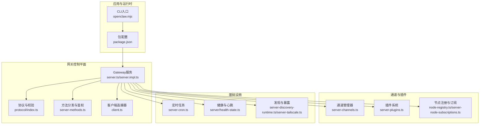
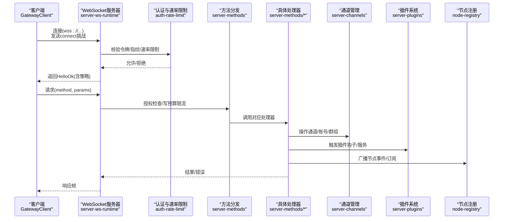
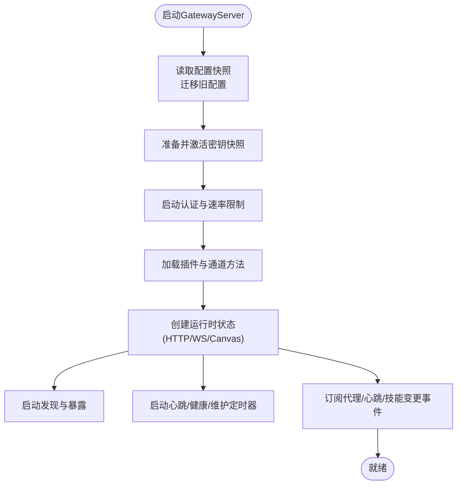
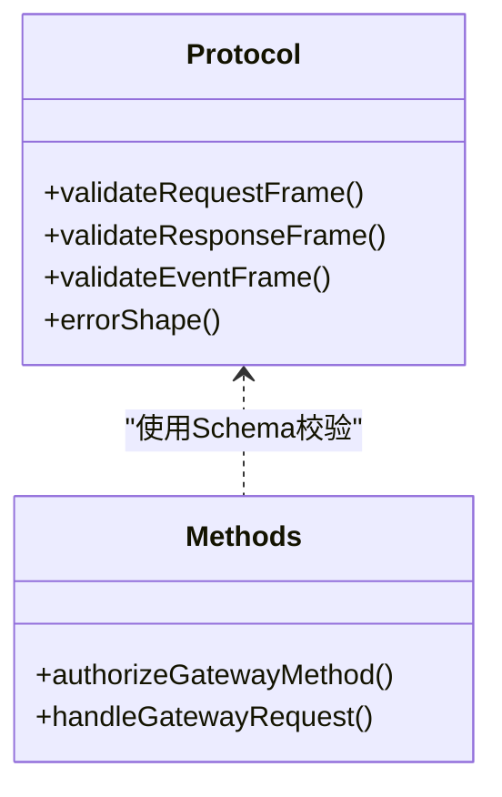
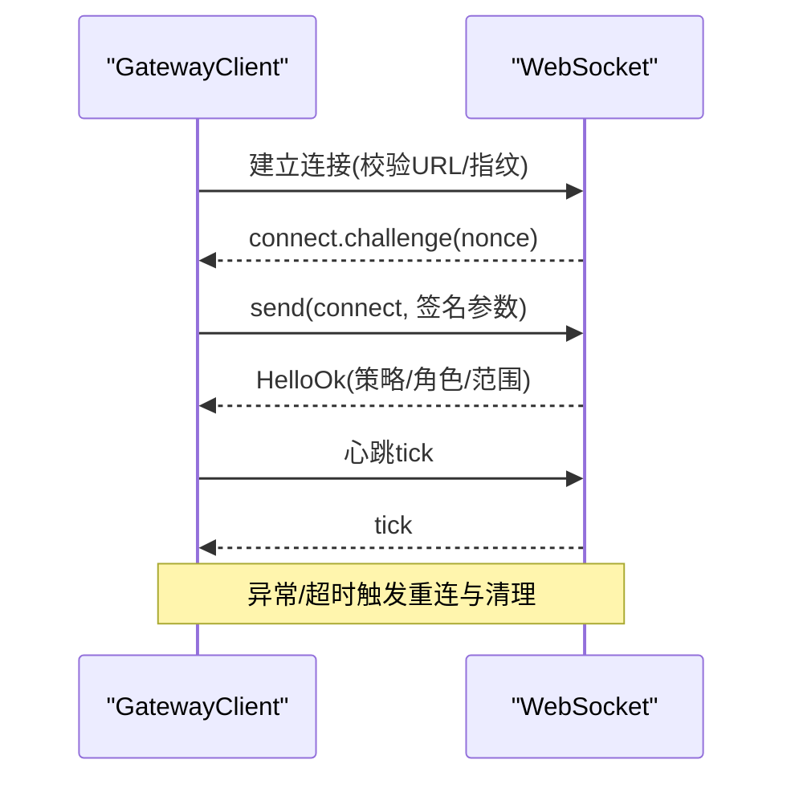
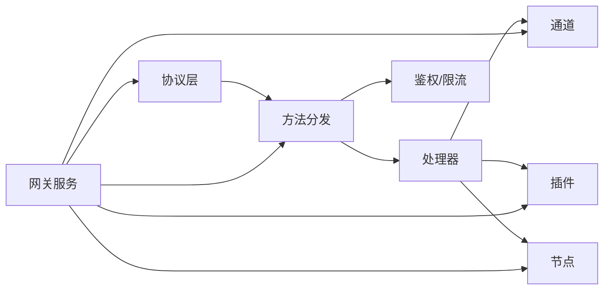

# 技术架构

<cite>
**本文引用的文件**
- [README.md](file://README.md)
- [package.json](file://package.json)
- [src/gateway/server.ts](file://src/gateway/server.ts)
- [src/gateway/server.impl.ts](file://src/gateway/server.impl.ts)
- [src/gateway/client.ts](file://src/gateway/client.ts)
- [src/gateway/server-methods.ts](file://src/gateway/server-methods.ts)
- [src/gateway/protocol/index.ts](file://src/gateway/protocol/index.ts)
</cite>

## 目录

1. [引言](#引言)
2. [项目结构](#项目结构)
3. [核心组件](#核心组件)
4. [架构总览](#架构总览)
5. [详细组件分析](#详细组件分析)
6. [依赖分析](#依赖分析)
7. [性能考量](#性能考量)
8. [故障排查指南](#故障排查指南)
9. [结论](#结论)
10. [附录](#附录)

## 引言

本技术架构文档面向OpenClaw的开发者与运维人员，系统化阐述其“网关控制平面”的整体设计、消息路由机制与会话管理等关键子系统。OpenClaw以“本地优先、多通道集成、可扩展的控制平面”为核心理念，通过统一的WebSocket协议承载控制面能力，并在安全、可观测性、可扩展性方面做出明确的设计取舍与工程实现。

## 项目结构

OpenClaw采用多模块分层组织：核心网关运行时位于src/gateway，围绕该目录构建了协议定义、服务端启动、方法分发、通道适配、插件系统、节点注册、会话管理、健康与维护任务等子系统。包级入口通过CLI脚本与打包产物提供对外服务。

图表来源

- [src/gateway/server.ts](file://src/gateway/server.ts#L1-L4)
- [src/gateway/server.impl.ts](file://src/gateway/server.impl.ts#L1-L120)
- [src/gateway/protocol/index.ts](file://src/gateway/protocol/index.ts#L1-L120)
- [src/gateway/server-methods.ts](file://src/gateway/server-methods.ts#L1-L40)
- [src/gateway/client.ts](file://src/gateway/client.ts#L1-L60)

章节来源

- [README.md](file://README.md#L185-L240)
- [package.json](file://package.json#L1-L120)

## 核心组件

- 网关服务（GatewayServer）
  - 负责加载配置、初始化认证与速率限制、启动HTTP/WS服务、挂载方法处理器、维护心跳与健康状态、调度通道与插件、暴露Canvas与Control UI、处理远程访问（Tailscale/SSH隧道）。
- 协议与校验（Protocol）
  - 定义请求/响应帧、事件帧、角色与权限模型、方法参数Schema与运行时校验函数，确保跨语言/跨平台的强一致通信契约。
- 方法分发与鉴权（Server Methods）
  - 将请求路由到具体处理器，执行角色与范围授权检查，对写类操作进行控制面写预算限流。
- 客户端连接器（GatewayClient）
  - 提供连接握手、设备令牌/共享令牌/密码认证、TLS指纹校验、重连退避、序列号与断线间隙检测、事件与请求响应处理。
- 通道与插件（Channels/Plugins）
  - 动态加载插件与通道适配器，聚合方法列表，统一注入到网关方法表中。
- 节点与订阅（Node Registry/Subscriptions）
  - 维护设备节点生命周期、能力描述、订阅关系，支持按会话或全局广播事件。
- 健康与维护（Health/Timers）
  - 定期清理去重缓存、超时终止聊天运行、维护存在版本与健康快照。
- 发现与暴露（Discovery/Tailscale）
  - 支持Bonjour/mDNS与Tailscale Serve/Funnel，结合安全策略与身份校验，提供受控的远程访问。

章节来源

- [src/gateway/server.impl.ts](file://src/gateway/server.impl.ts#L195-L260)
- [src/gateway/protocol/index.ts](file://src/gateway/protocol/index.ts#L1-L120)
- [src/gateway/server-methods.ts](file://src/gateway/server-methods.ts#L36-L95)
- [src/gateway/client.ts](file://src/gateway/client.ts#L85-L120)

## 架构总览

下图展示了OpenClaw网关控制平面的总体交互：客户端（CLI/浏览器/桌面App/移动端节点）通过WebSocket接入，经由协议层与方法分发层，调用通道、插件、节点、会话等子系统；同时，后台维护健康、心跳、定时任务与远程暴露。

图表来源

- [src/gateway/server.impl.ts](file://src/gateway/server.impl.ts#L699-L771)
- [src/gateway/server-methods.ts](file://src/gateway/server-methods.ts#L97-L149)
- [src/gateway/client.ts](file://src/gateway/client.ts#L230-L350)

章节来源

- [README.md](file://README.md#L185-L240)

## 详细组件分析

### 网关服务启动与运行时装配

- 配置与密钥
  - 读取配置快照、迁移旧配置、自动启用插件、激活运行时密钥快照并记录状态事件。
- 认证与速率限制
  - 创建通用与浏览器专用速率限制器，区分环回与非环回豁免策略。
- 插件与通道
  - 加载插件注册表与通道方法，合并到网关方法集合；为每个通道创建独立日志与运行时环境。
- 运行时状态
  - 初始化HTTP/WS服务器、Canvas Host、节点注册与订阅、Cron服务、发现与暴露、心跳与健康维护、更新检查。
- 事件与回调
  - 订阅代理事件、心跳事件、技能变更监听，恢复投递队列，安排维护定时器。

图表来源

- [src/gateway/server.impl.ts](file://src/gateway/server.impl.ts#L195-L260)
- [src/gateway/server.impl.ts](file://src/gateway/server.impl.ts#L384-L420)
- [src/gateway/server.impl.ts](file://src/gateway/server.impl.ts#L495-L520)
- [src/gateway/server.impl.ts](file://src/gateway/server.impl.ts#L556-L576)
- [src/gateway/server.impl.ts](file://src/gateway/server.impl.ts#L603-L620)
- [src/gateway/server.impl.ts](file://src/gateway/server.impl.ts#L664-L676)

章节来源

- [src/gateway/server.impl.ts](file://src/gateway/server.impl.ts#L195-L800)

### 协议与方法分发

- 协议层
  - 使用Schema与AJV进行强类型校验，定义请求/响应/事件帧、角色/范围、错误码与错误结构。
- 方法分发
  - 统一鉴权：角色解析、范围授权、管理员豁免、写操作控制面预算限流。
  - 处理器映射：将方法名映射到具体处理器，未知方法返回错误。

图表来源

- [src/gateway/protocol/index.ts](file://src/gateway/protocol/index.ts#L243-L396)
- [src/gateway/server-methods.ts](file://src/gateway/server-methods.ts#L36-L95)

章节来源

- [src/gateway/protocol/index.ts](file://src/gateway/protocol/index.ts#L1-L200)
- [src/gateway/server-methods.ts](file://src/gateway/server-methods.ts#L1-L150)

### 客户端连接与安全

- 连接流程
  - 解析URL、强制wss/环回安全策略、TLS指纹校验、握手挑战与连接参数签名、持久化设备令牌。
- 错误与重连
  - 设备令牌不匹配时清理缓存；连接失败与超时处理；指数退避重连；心跳监控与静默超时关闭。
- 数据安全
  - 严格阻止非环回明文ws；支持设备签名与角色/范围授权；支持路径环境注入与命令白名单。

图表来源

- [src/gateway/client.ts](file://src/gateway/client.ts#L107-L177)
- [src/gateway/client.ts](file://src/gateway/client.ts#L230-L350)
- [src/gateway/client.ts](file://src/gateway/client.ts#L445-L467)

章节来源

- [src/gateway/client.ts](file://src/gateway/client.ts#L1-L523)

### 通道与插件集成

- 插件系统
  - 动态注册插件服务与方法，合并到网关方法集；支持插件自动启用与变更监听。
- 通道管理
  - 为每种通道创建独立运行时环境与日志；集中启动/停止/登出通道；健康检查周期可配置。
- 技能与远程节点
  - 技能变更触发远程节点二进制刷新；延迟批处理避免频繁探测。

章节来源

- [src/gateway/server.impl.ts](file://src/gateway/server.impl.ts#L384-L420)
- [src/gateway/server.impl.ts](file://src/gateway/server.impl.ts#L548-L555)
- [src/gateway/server.impl.ts](file://src/gateway/server.impl.ts#L574-L596)

### 节点注册与订阅

- 节点生命周期
  - 注册节点、维护存在计时器、订阅/取消订阅、向会话或全部订阅者广播事件。
- 语音唤醒与移动节点
  - 监测移动节点连接状态，广播触发器变更事件。

章节来源

- [src/gateway/server.impl.ts](file://src/gateway/server.impl.ts#L521-L539)

### 健康与维护

- 维护定时器
  - 清理去重缓存、超时终止聊天运行、更新健康快照、广播心跳事件。
- 健康与存在版本
  - 维护健康版本与存在版本，用于前端与外部系统感知。

章节来源

- [src/gateway/server.impl.ts](file://src/gateway/server.impl.ts#L603-L620)
- [src/gateway/server.impl.ts](file://src/gateway/server.impl.ts#L96-L101)

### 发现与远程暴露

- 发现
  - 启动Bonjour/mDNS与广域发现，支持Tailscale模式与指纹信息。
- 远程暴露
  - Tailscale Serve/Funnel自动化，支持密码认证与退出时重置。

章节来源

- [src/gateway/server.impl.ts](file://src/gateway/server.impl.ts#L558-L571)
- [src/gateway/server.impl.ts](file://src/gateway/server.impl.ts#L792-L800)

## 依赖分析

- 关键外部依赖
  - WebSocket服务器(ws)、HTTP框架(express)、AJV(schema校验)、TypeBox(Type定义)、Cron(croner)、Tailscale相关库、通道SDK(grammy/discord.js/baileys等)。
- 内部耦合
  - 协议层被所有方法与客户端复用；方法分发依赖鉴权与速率限制；运行时状态贯穿所有子系统。
- 可能的循环依赖
  - 通过模块导出与延迟导入避免直接循环；插件与通道通过注册表间接耦合。

图表来源

- [src/gateway/server-methods.ts](file://src/gateway/server-methods.ts#L66-L95)
- [src/gateway/server.impl.ts](file://src/gateway/server.impl.ts#L384-L420)

章节来源

- [package.json](file://package.json#L151-L207)

## 性能考量

- 并发与限流
  - 控制面写操作采用预算限流，防止突发写入导致拥塞；通道与节点事件广播支持丢弃慢消费者。
- 序列化与负载
  - 客户端允许较大消息负载以支持屏幕截图等场景；AJV校验在Schema层面减少运行时错误。
- 维护与清理
  - 定时清理去重与聊天运行，避免内存泄漏；心跳监控检测静默断开。
- 远程访问
  - Tailscale Serve/Funnel在保证安全的前提下提供远程访问，避免公网直连带来的性能与安全风险。

## 故障排查指南

- 连接问题
  - 检查URL是否为wss且目标主机可信；核对TLS指纹；确认设备令牌是否被清理；查看重连退避与心跳超时。
- 认证与权限
  - 确认角色与范围是否满足方法要求；管理员范围可豁免；写操作可能被控制面预算限流。
- 配置与密钥
  - 使用doctor修复配置；检查密钥快照激活状态与警告；必要时重启以应用新配置。
- 通道与插件
  - 查看通道健康检查日志；确认插件已自动启用；关注技能变更引起的远程节点二进制刷新。
- 远程暴露
  - Tailscale模式需绑定环回地址；Funnel需要密码认证；退出时可重置暴露设置。

章节来源

- [src/gateway/client.ts](file://src/gateway/client.ts#L117-L137)
- [src/gateway/server-methods.ts](file://src/gateway/server-methods.ts#L106-L131)
- [src/gateway/server.impl.ts](file://src/gateway/server.impl.ts#L213-L247)
- [src/gateway/server.impl.ts](file://src/gateway/server.impl.ts#L556-L571)

## 结论

OpenClaw的网关控制平面以协议为中心、以方法分发为枢纽、以通道/插件/节点为扩展点，结合严格的认证与限流、完善的健康与维护机制、以及安全可控的远程暴露策略，实现了高性能、高可用与可扩展的个人AI助手控制面。其架构在本地优先与多平台集成之间取得平衡，适合从单机到远程实例的广泛部署场景。

## 附录

- 术语
  - 控制面：网关提供的统一控制与管理接口。
  - 数据面：通道与节点的实际消息与媒体传输。
- 最佳实践
  - 默认绑定环回并使用SSH隧道或Tailscale访问；启用设备令牌与角色/范围授权；定期运行doctor修复配置；合理设置通道健康检查周期与Cron任务。
