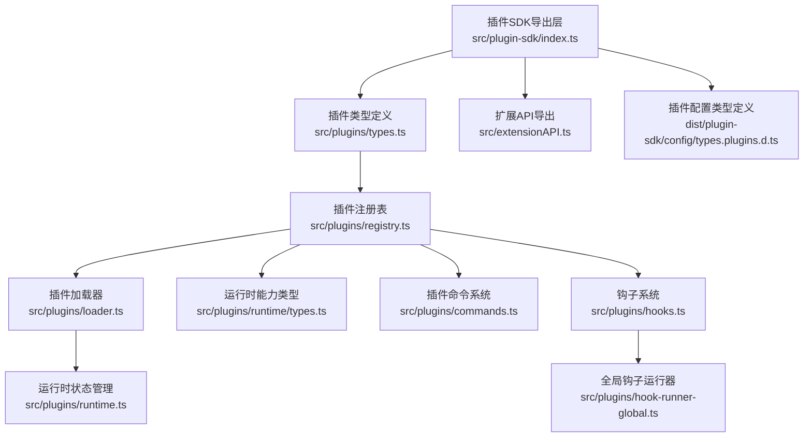
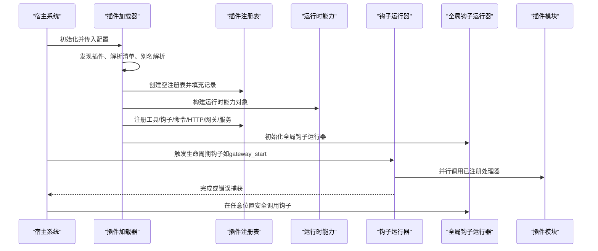
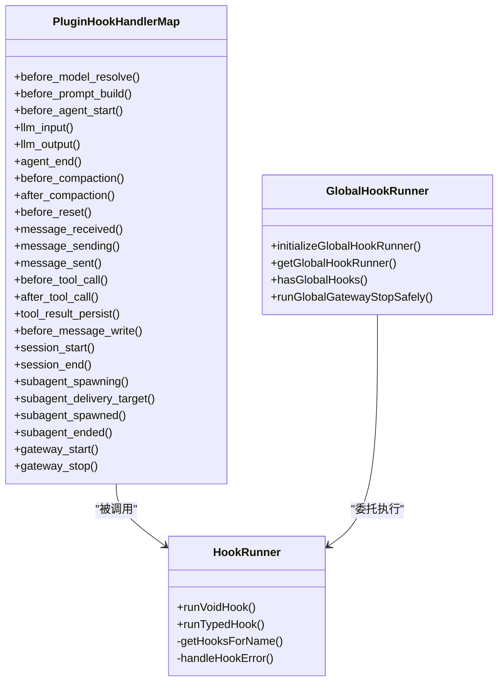
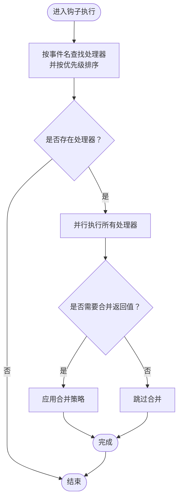
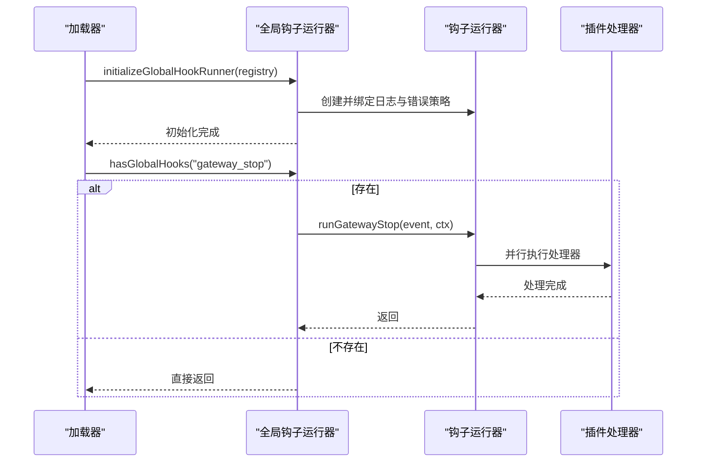
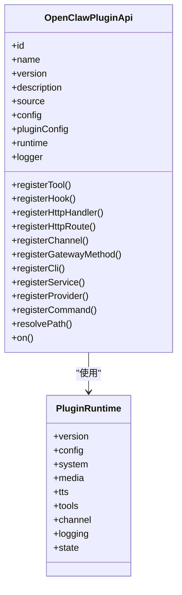
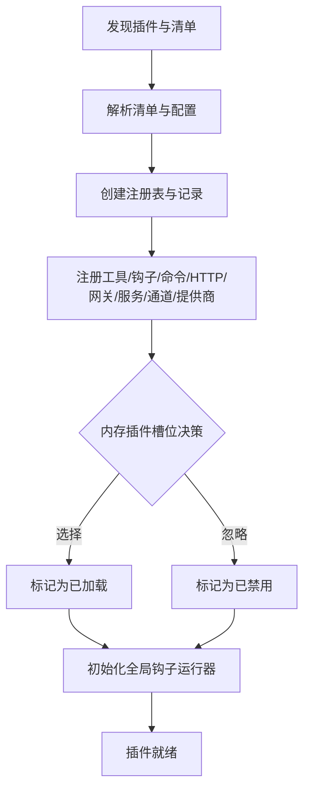
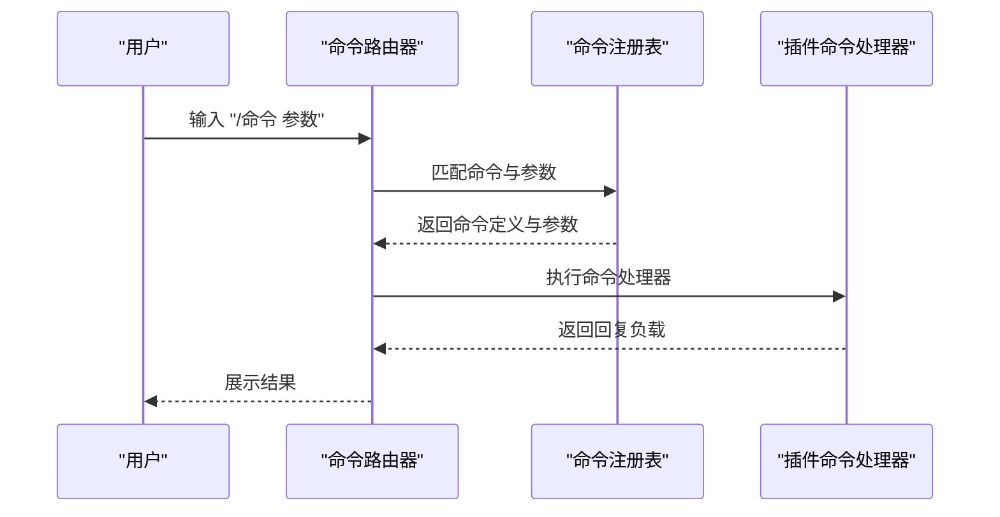
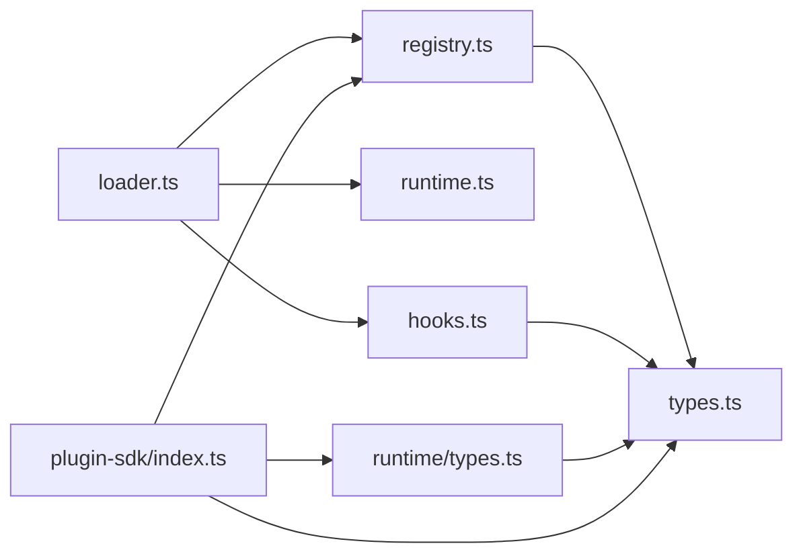

# 插件API设计

<cite>
**本文档引用的文件**
- [src/plugin-sdk/index.ts](file://src/plugin-sdk/index.ts)
- [src/plugins/types.ts](file://src/plugins/types.ts)
- [src/plugins/registry.ts](file://src/plugins/registry.ts)
- [src/plugins/hooks.ts](file://src/plugins/hooks.ts)
- [src/plugins/hook-runner-global.ts](file://src/plugins/hook-runner-global.ts)
- [src/plugins/runtime/types.ts](file://src/plugins/runtime/types.ts)
- [src/plugins/commands.ts](file://src/plugins/commands.ts)
- [src/plugins/loader.ts](file://src/plugins/loader.ts)
- [src/plugins/runtime.ts](file://src/plugins/runtime.ts)
- [src/extensionAPI.ts](file://src/extensionAPI.ts)
- [dist/plugin-sdk/config/types.plugins.d.ts](file://dist/plugin-sdk/config/types.plugins.d.ts)
</cite>

## 目录

1. [简介](#简介)
2. [项目结构](#项目结构)
3. [核心组件](#核心组件)
4. [架构总览](#架构总览)
5. [详细组件分析](#详细组件分析)
6. [依赖关系分析](#依赖关系分析)
7. [性能考量](#性能考量)
8. [故障排查指南](#故障排查指南)
9. [结论](#结论)
10. [附录](#附录)

## 简介

本文件面向OpenClaw插件开发者，系统化阐述插件SDK的接口规范与运行机制，覆盖事件钩子、回调函数、命令系统、HTTP路由与网关方法、全局钩子运行器、插件生命周期与加载流程、以及与宿主系统的数据交换协议与状态同步机制。同时提供版本兼容策略、废弃API处理建议、开发模板与测试调试要点，帮助开发者快速构建稳定、可维护的插件。

## 项目结构

OpenClaw插件体系由“插件SDK导出层”“插件类型与注册表”“钩子系统与运行器”“命令系统”“运行时能力”“加载器与生命周期”等模块组成。下图展示与插件API设计直接相关的模块关系：

图表来源

- [src/plugin-sdk/index.ts](file://src/plugin-sdk/index.ts#L1-L597)
- [src/plugins/types.ts](file://src/plugins/types.ts#L1-L764)
- [src/plugins/registry.ts](file://src/plugins/registry.ts#L1-L520)
- [src/plugins/hooks.ts](file://src/plugins/hooks.ts#L1-L754)
- [src/plugins/hook-runner-global.ts](file://src/plugins/hook-runner-global.ts#L1-L88)
- [src/plugins/runtime/types.ts](file://src/plugins/runtime/types.ts#L1-L375)
- [src/plugins/commands.ts](file://src/plugins/commands.ts#L1-L318)
- [src/plugins/loader.ts](file://src/plugins/loader.ts#L1-L726)
- [src/plugins/runtime.ts](file://src/plugins/runtime.ts#L1-L41)
- [src/extensionAPI.ts](file://src/extensionAPI.ts#L1-L15)
- [dist/plugin-sdk/config/types.plugins.d.ts](file://dist/plugin-sdk/config/types.plugins.d.ts#L1-L27)

章节来源

- [src/plugin-sdk/index.ts](file://src/plugin-sdk/index.ts#L1-L597)
- [src/plugins/types.ts](file://src/plugins/types.ts#L1-L764)
- [src/plugins/registry.ts](file://src/plugins/registry.ts#L1-L520)
- [src/plugins/hooks.ts](file://src/plugins/hooks.ts#L1-L754)
- [src/plugins/hook-runner-global.ts](file://src/plugins/hook-runner-global.ts#L1-L88)
- [src/plugins/runtime/types.ts](file://src/plugins/runtime/types.ts#L1-L375)
- [src/plugins/commands.ts](file://src/plugins/commands.ts#L1-L318)
- [src/plugins/loader.ts](file://src/plugins/loader.ts#L1-L726)
- [src/plugins/runtime.ts](file://src/plugins/runtime.ts#L1-L41)
- [src/extensionAPI.ts](file://src/extensionAPI.ts#L1-L15)
- [dist/plugin-sdk/config/types.plugins.d.ts](file://dist/plugin-sdk/config/types.plugins.d.ts#L1-L27)

## 核心组件

- 插件SDK导出层：统一暴露插件开发所需的类型、工具函数与适配器，便于跨渠道（Discord、Slack、Telegram、Signal、WhatsApp、LINE等）复用。
- 插件类型与注册表：定义插件API、钩子事件、命令、HTTP路由、网关方法、服务等抽象，并集中管理注册项与诊断信息。
- 钩子系统与运行器：提供生命周期钩子的注册、优先级排序、并行执行与错误捕获策略；支持全局钩子运行器在任意位置安全调用。
- 命令系统：管理插件自定义命令，确保与内置命令不冲突、参数安全校验与授权控制。
- 运行时能力：封装配置读写、媒体处理、TTS、工具集、通道能力、日志与状态目录等宿主能力。
- 加载器与生命周期：负责插件发现、清单解析、内存插件槽位选择、缓存与别名解析、全局钩子运行器初始化等。

章节来源

- [src/plugin-sdk/index.ts](file://src/plugin-sdk/index.ts#L1-L597)
- [src/plugins/types.ts](file://src/plugins/types.ts#L1-L764)
- [src/plugins/registry.ts](file://src/plugins/registry.ts#L1-L520)
- [src/plugins/hooks.ts](file://src/plugins/hooks.ts#L1-L754)
- [src/plugins/hook-runner-global.ts](file://src/plugins/hook-runner-global.ts#L1-L88)
- [src/plugins/runtime/types.ts](file://src/plugins/runtime/types.ts#L1-L375)
- [src/plugins/commands.ts](file://src/plugins/commands.ts#L1-L318)
- [src/plugins/loader.ts](file://src/plugins/loader.ts#L1-L726)
- [src/plugins/runtime.ts](file://src/plugins/runtime.ts#L1-L41)

## 架构总览

下图展示插件从加载到运行的端到端流程，以及与宿主系统的交互点：

图表来源

- [src/plugins/loader.ts](file://src/plugins/loader.ts#L1-L726)
- [src/plugins/registry.ts](file://src/plugins/registry.ts#L1-L520)
- [src/plugins/runtime/types.ts](file://src/plugins/runtime/types.ts#L1-L375)
- [src/plugins/hooks.ts](file://src/plugins/hooks.ts#L1-L754)
- [src/plugins/hook-runner-global.ts](file://src/plugins/hook-runner-global.ts#L1-L88)

## 详细组件分析

### 事件钩子与回调函数

- 钩子名称与上下文：涵盖模型解析前、提示构建前、代理开始、LLM输入输出、工具调用前后、消息收发、会话开始结束、子代理派生与交付、网关启动停止等。
- 类型安全：通过泛型映射确保事件与上下文类型一致，支持返回值合并（如模型/提示构建结果）。
- 执行策略：按优先级降序排列，void钩子并行执行以提升吞吐；错误可被捕获或抛出，取决于运行选项。
- 全局钩子运行器：提供全局入口，支持在插件未加载时安全检查与延迟执行。

图表来源

- [src/plugins/types.ts](file://src/plugins/types.ts#L299-L755)
- [src/plugins/hooks.ts](file://src/plugins/hooks.ts#L110-L215)
- [src/plugins/hook-runner-global.ts](file://src/plugins/hook-runner-global.ts#L18-L80)

章节来源

- [src/plugins/types.ts](file://src/plugins/types.ts#L299-L755)
- [src/plugins/hooks.ts](file://src/plugins/hooks.ts#L110-L215)
- [src/plugins/hook-runner-global.ts](file://src/plugins/hook-runner-global.ts#L18-L80)

### 回调执行流程与错误处理

- 并行执行：void钩子对同一事件的所有处理器并行触发，提升性能。
- 错误策略：可配置“捕获错误并记录”，避免单个插件异常影响整体流程。
- 合并与返回值：部分钩子支持返回值合并（如模型/提示构建），高优先级钩子覆盖低优先级结果。

图表来源

- [src/plugins/hooks.ts](file://src/plugins/hooks.ts#L110-L215)
- [src/plugins/hooks.ts](file://src/plugins/hooks.ts#L129-L173)

章节来源

- [src/plugins/hooks.ts](file://src/plugins/hooks.ts#L110-L215)
- [src/plugins/hooks.ts](file://src/plugins/hooks.ts#L129-L173)

### 异步API与全局钩子运行器

- 全局钩子运行器：在插件加载完成后初始化，提供全局可用的钩子执行入口，支持安全检查与错误回调。
- 使用场景：在不持有注册表引用的代码路径中，仍可安全地触发网关停止等钩子。

图表来源

- [src/plugins/hook-runner-global.ts](file://src/plugins/hook-runner-global.ts#L22-L80)
- [src/plugins/hooks.ts](file://src/plugins/hooks.ts#L676-L696)

章节来源

- [src/plugins/hook-runner-global.ts](file://src/plugins/hook-runner-global.ts#L22-L80)
- [src/plugins/hooks.ts](file://src/plugins/hooks.ts#L676-L696)

### 插件与宿主的数据交换协议

- 插件API对象：提供注册工具、钩子、HTTP处理器/路由、通道适配器、网关方法、CLI、服务、提供商、命令等能力，并暴露运行时与日志接口。
- 运行时能力：封装配置读写、系统命令执行、媒体处理、TTS、工具集、通道能力、会话与活动记录、提及与反应、去抖、分块与表格渲染、各渠道监控与发送等。
- 插件SDK导出层：统一导出跨渠道适配器、状态辅助、Webhook目标解析、SSRF策略、临时路径、持久化去重、命令鉴权、分片文本等工具。

图表来源

- [src/plugins/types.ts](file://src/plugins/types.ts#L245-L284)
- [src/plugins/runtime/types.ts](file://src/plugins/runtime/types.ts#L188-L375)
- [src/plugin-sdk/index.ts](file://src/plugin-sdk/index.ts#L1-L597)

章节来源

- [src/plugins/types.ts](file://src/plugins/types.ts#L245-L284)
- [src/plugins/runtime/types.ts](file://src/plugins/runtime/types.ts#L188-L375)
- [src/plugin-sdk/index.ts](file://src/plugin-sdk/index.ts#L1-L597)

### 插件生命周期管理与钩子注册

- 生命周期阶段：插件加载、激活、注册工具/钩子/命令/HTTP/网关/服务、通道适配器、提供商等。
- 钩子注册：支持内部钩子系统与类型化钩子注册，后者提供更强的类型安全与优先级控制。
- 内存插件槽位：通过配置选择唯一启用的内存插件，其余同ID插件禁用，避免冲突。

图表来源

- [src/plugins/loader.ts](file://src/plugins/loader.ts#L425-L457)
- [src/plugins/registry.ts](file://src/plugins/registry.ts#L164-L520)

章节来源

- [src/plugins/loader.ts](file://src/plugins/loader.ts#L425-L457)
- [src/plugins/registry.ts](file://src/plugins/registry.ts#L164-L520)

### 中间件支持与HTTP/Webhook集成

- HTTP处理器：插件可注册全局HTTP处理器或特定路径路由，支持路径规范化与重复路由检测。
- Webhook目标：提供Webhook目标匹配、请求体限制与读取、POST请求拒绝等安全策略。
- 网关方法：插件可注册网关方法，与核心网关方法集合进行冲突检测。

章节来源

- [src/plugins/registry.ts](file://src/plugins/registry.ts#L291-L330)
- [src/plugin-sdk/index.ts](file://src/plugin-sdk/index.ts#L122-L129)
- [src/plugin-sdk/index.ts](file://src/plugin-sdk/index.ts#L112-L114)

### 插件命令系统

- 自定义命令：插件可注册绕过LLM代理的命令，优先于内置命令与代理调用。
- 命令验证：名称合法性、保留字冲突、重复注册、参数长度与字符过滤。
- 授权与执行：默认要求授权，支持参数清理与并发执行锁，失败返回通用提示。

图表来源

- [src/plugins/commands.ts](file://src/plugins/commands.ts#L170-L196)
- [src/plugins/commands.ts](file://src/plugins/commands.ts#L230-L288)

章节来源

- [src/plugins/commands.ts](file://src/plugins/commands.ts#L170-L196)
- [src/plugins/commands.ts](file://src/plugins/commands.ts#L230-L288)

### 插件API版本兼容性与废弃策略

- 版本字段：插件定义包含版本号，用于追踪与兼容性管理。
- 废弃API：通过导出层的类型别名与注释标注废弃项，建议迁移至新接口。
- 配置模式：插件配置采用JSON Schema校验，变更需向后兼容或提供迁移策略。

章节来源

- [src/plugins/types.ts](file://src/plugins/types.ts#L230-L239)
- [src/plugin-sdk/index.ts](file://src/plugin-sdk/index.ts#L116-L117)
- [src/plugins/loader.ts](file://src/plugins/loader.ts#L106-L125)

## 依赖关系分析

- 模块耦合：插件SDK导出层聚合类型与工具，注册表与运行时类型为插件能力边界，加载器协调注册与运行。
- 外部依赖：Jiti动态加载、边界文件读取、日志子系统、配置系统、通道适配器等。
- 循环依赖：通过导出层与运行时状态管理避免循环引用。

图表来源

- [src/plugins/loader.ts](file://src/plugins/loader.ts#L1-L726)
- [src/plugins/registry.ts](file://src/plugins/registry.ts#L1-L520)
- [src/plugins/hooks.ts](file://src/plugins/hooks.ts#L1-L754)
- [src/plugins/runtime/types.ts](file://src/plugins/runtime/types.ts#L1-L375)
- [src/plugin-sdk/index.ts](file://src/plugin-sdk/index.ts#L1-L597)

章节来源

- [src/plugins/loader.ts](file://src/plugins/loader.ts#L1-L726)
- [src/plugins/registry.ts](file://src/plugins/registry.ts#L1-L520)
- [src/plugins/hooks.ts](file://src/plugins/hooks.ts#L1-L754)
- [src/plugins/runtime/types.ts](file://src/plugins/runtime/types.ts#L1-L375)
- [src/plugin-sdk/index.ts](file://src/plugin-sdk/index.ts#L1-L597)

## 性能考量

- 并行钩子执行：void钩子并行触发，减少串行等待。
- 优先级排序：高优先级钩子先执行，避免多次遍历。
- 路由与HTTP：路径规范化与冲突检测，减少运行时开销。
- 命令执行锁：防止注册期间并发修改导致的竞态。

## 故障排查指南

- 钩子错误：启用“捕获错误”策略时，错误会被记录而不中断流程；否则抛出带原因的错误。
- 命令冲突：保留命令列表与重复注册检测，避免覆盖内置功能。
- 配置校验：插件配置Schema校验失败时，返回具体错误数组，便于定位问题。
- 运行时状态：通过运行时能力的日志与状态目录接口获取诊断信息。

章节来源

- [src/plugins/hooks.ts](file://src/plugins/hooks.ts#L175-L188)
- [src/plugins/commands.ts](file://src/plugins/commands.ts#L33-L72)
- [src/plugins/loader.ts](file://src/plugins/loader.ts#L106-L125)
- [src/plugins/runtime/types.ts](file://src/plugins/runtime/types.ts#L364-L370)

## 结论

OpenClaw插件API通过类型化钩子、全局运行器、命令系统与运行时能力，提供了强大的扩展性与安全性。遵循本文档的接口规范、兼容策略与最佳实践，可高效构建稳定可靠的插件生态。

## 附录

### 开发模板与测试框架

- 开发模板：基于插件定义与注册函数，实现register/activate钩子，注册工具、钩子、命令、HTTP路由与网关方法。
- 测试框架：利用命令系统与加载器的测试辅助函数，模拟插件加载、命令匹配与执行、钩子运行与错误捕获。

章节来源

- [src/plugins/types.ts](file://src/plugins/types.ts#L230-L239)
- [src/plugins/commands.ts](file://src/plugins/commands.ts#L1-L318)
- [src/plugins/loader.ts](file://src/plugins/loader.ts#L425-L457)

### 调试工具与日志

- 插件SDK导出层：提供日志传输注册、诊断事件发射与监听等能力，便于插件侧输出诊断信息。
- 运行时日志：通过运行时能力的getChildLogger与shouldLogVerbose，实现细粒度日志分级与上下文绑定。

章节来源

- [src/plugin-sdk/index.ts](file://src/plugin-sdk/index.ts#L427-L449)
- [src/plugins/runtime/types.ts](file://src/plugins/runtime/types.ts#L364-L370)
