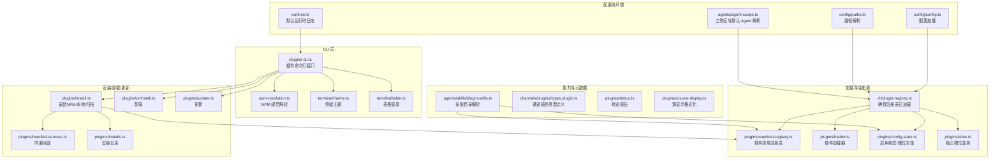
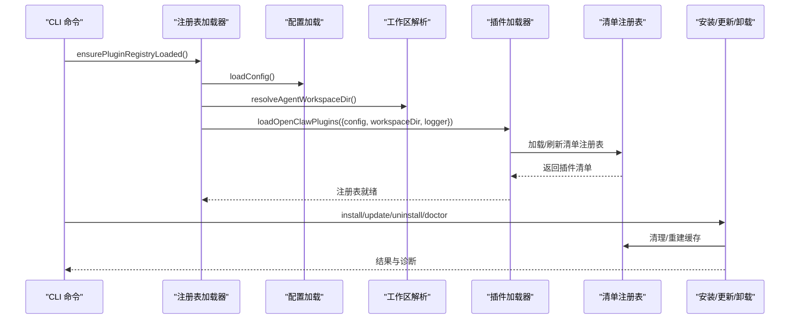
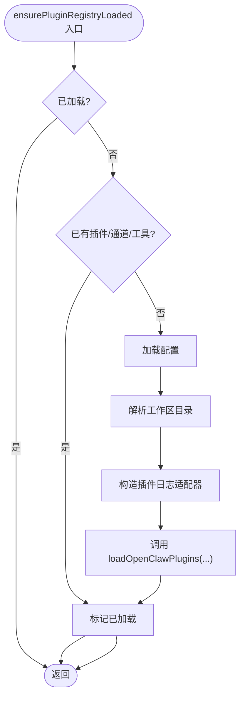
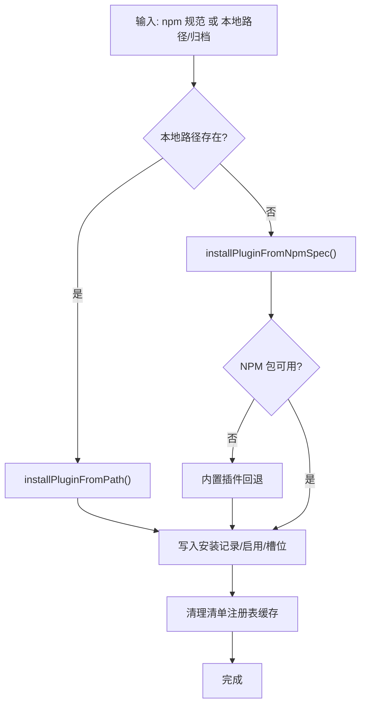
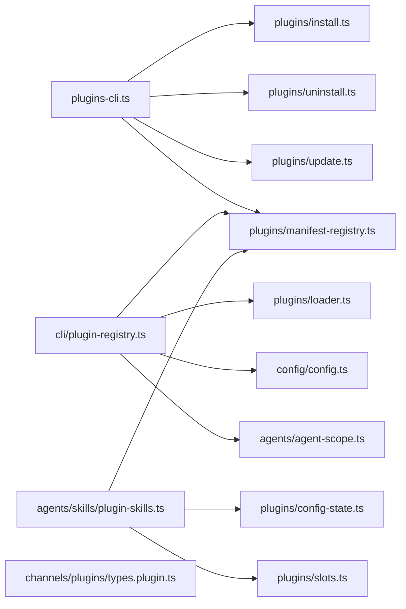

# 插件加载机制

<cite>
**本文引用的文件**
- [src/cli/plugin-registry.ts](file://src/cli/plugin-registry.ts)
- [dist/plugin-registry-CZc8lFfr.js](file://dist/plugin-registry-CZc8lFfr.js)
- [src/cli/plugins-cli.ts](file://src/cli/plugins-cli.ts)
- [src/agents/skills/plugin-skills.ts](file://src/agents/skills/plugin-skills.ts)
- [src/channels/plugins/types.plugin.ts](file://src/channels/plugins/types.plugin.ts)
- [src/plugins/loader.ts](file://src/plugins/loader.ts)
- [src/plugins/manifest-registry.ts](file://src/plugins/manifest-registry.ts)
- [src/plugins/registry.ts](file://src/plugins/registry.ts)
- [src/plugins/config-state.ts](file://src/plugins/config-state.ts)
- [src/plugins/slots.ts](file://src/plugins/slots.ts)
- [src/plugins/install.ts](file://src/plugins/install.ts)
- [src/plugins/uninstall.ts](file://src/plugins/uninstall.ts)
- [src/plugins/update.ts](file://src/plugins/update.ts)
- [src/plugins/status.ts](file://src/plugins/status.ts)
- [src/plugins/source-display.ts](file://src/plugins/source-display.ts)
- [src/plugins/bundled-sources.ts](file://src/plugins/bundled-sources.ts)
- [src/plugins/installs.ts](file://src/plugins/installs.ts)
- [src/runtime.ts](file://src/runtime.ts)
- [src/config/config.ts](file://src/config/config.ts)
- [src/config/paths.ts](file://src/config/paths.ts)
- [src/agents/agent-scope.ts](file://src/agents/agent-scope.ts)
- [src/logging.ts](file://src/logging.ts)
- [src/infra/archive.ts](file://src/infra/archive.ts)
- [src/terminal/table.ts](file://src/terminal/table.ts)
- [src/terminal/theme.ts](file://src/terminal/theme.ts)
- [src/utils.ts](file://src/utils.ts)
- [src/cli/npm-resolution.ts](file://src/cli/npm-resolution.ts)
- [src/plugins/enable.ts](file://src/plugins/enable.ts)
- [src/plugins/manifest-registry.ts](file://src/plugins/manifest-registry.ts)
</cite>

## 目录

1. [引言](#引言)
2. [项目结构](#项目结构)
3. [核心组件](#核心组件)
4. [架构总览](#架构总览)
5. [详细组件分析](#详细组件分析)
6. [依赖关系分析](#依赖关系分析)
7. [性能考虑](#性能考虑)
8. [故障排查指南](#故障排查指南)
9. [结论](#结论)
10. [附录](#附录)

## 引言

本文件系统性阐述 OpenClaw 的插件加载机制，覆盖插件发现、加载与初始化流程，插件路径扫描、依赖解析与版本校验，插件注册表与元数据管理，以及生命周期钩子。同时说明安全检查、权限验证与沙箱边界设置，并给出加载失败时的错误处理、回滚与重试策略建议，以及性能优化与并发加载的最佳实践。

## 项目结构

OpenClaw 将插件体系分为“运行时加载”“配置与状态”“清单与注册表”“安装/卸载/更新”“CLI 管理”等模块，围绕 src/plugins/\* 与 src/cli/plugins-cli.ts 构建完整的插件生命周期闭环。

图表来源

- [src/cli/plugins-cli.ts](file://src/cli/plugins-cli.ts#L1-L798)
- [src/cli/plugin-registry.ts](file://src/cli/plugin-registry.ts#L1-L40)
- [src/plugins/loader.ts](file://src/plugins/loader.ts)
- [src/plugins/manifest-registry.ts](file://src/plugins/manifest-registry.ts)
- [src/plugins/config-state.ts](file://src/plugins/config-state.ts)
- [src/plugins/slots.ts](file://src/plugins/slots.ts)
- [src/plugins/install.ts](file://src/plugins/install.ts)
- [src/plugins/uninstall.ts](file://src/plugins/uninstall.ts)
- [src/plugins/update.ts](file://src/plugins/update.ts)
- [src/plugins/bundled-sources.ts](file://src/plugins/bundled-sources.ts)
- [src/plugins/installs.ts](file://src/plugins/installs.ts)
- [src/agents/skills/plugin-skills.ts](file://src/agents/skills/plugin-skills.ts#L1-L85)
- [src/channels/plugins/types.plugin.ts](file://src/channels/plugins/types.plugin.ts#L1-L86)
- [src/plugins/status.ts](file://src/plugins/status.ts)
- [src/plugins/source-display.ts](file://src/plugins/source-display.ts)
- [src/config/config.ts](file://src/config/config.ts)
- [src/config/paths.ts](file://src/config/paths.ts)
- [src/agents/agent-scope.ts](file://src/agents/agent-scope.ts)
- [src/runtime.ts](file://src/runtime.ts)

章节来源

- [src/cli/plugin-registry.ts](file://src/cli/plugin-registry.ts#L1-L40)
- [src/cli/plugins-cli.ts](file://src/cli/plugins-cli.ts#L1-L798)
- [src/plugins/loader.ts](file://src/plugins/loader.ts)
- [src/plugins/manifest-registry.ts](file://src/plugins/manifest-registry.ts)
- [src/plugins/config-state.ts](file://src/plugins/config-state.ts)
- [src/plugins/slots.ts](file://src/plugins/slots.ts)
- [src/plugins/install.ts](file://src/plugins/install.ts)
- [src/plugins/uninstall.ts](file://src/plugins/uninstall.ts)
- [src/plugins/update.ts](file://src/plugins/update.ts)
- [src/plugins/bundled-sources.ts](file://src/plugins/bundled-sources.ts)
- [src/plugins/installs.ts](file://src/plugins/installs.ts)
- [src/agents/skills/plugin-skills.ts](file://src/agents/skills/plugin-skills.ts#L1-L85)
- [src/channels/plugins/types.plugin.ts](file://src/channels/plugins/types.plugin.ts#L1-L86)
- [src/plugins/status.ts](file://src/plugins/status.ts)
- [src/plugins/source-display.ts](file://src/plugins/source-display.ts)
- [src/config/config.ts](file://src/config/config.ts)
- [src/config/paths.ts](file://src/config/paths.ts)
- [src/agents/agent-scope.ts](file://src/agents/agent-scope.ts)
- [src/runtime.ts](file://src/runtime.ts)

## 核心组件

- 插件注册表加载器：负责在首次使用时加载并缓存插件注册表，避免重复昂贵的扫描与加载。
- 插件清单注册表：扫描工作区与全局路径，解析插件清单，构建可查询的插件集合。
- 插件加载器：根据配置与清单，按顺序加载插件，解析依赖与版本，执行生命周期钩子。
- 安装/卸载/更新：支持从 NPM、本地路径、归档包安装；支持更新与完整性校验；支持内置插件回退。
- CLI 管理：提供 list/info/enable/disable/install/uninstall/update/doctor 等命令，输出状态报告与诊断信息。
- 能力与元数据：通过类型定义与状态报告暴露插件工具、钩子、网关方法、提供商等元信息。

章节来源

- [src/cli/plugin-registry.ts](file://src/cli/plugin-registry.ts#L11-L39)
- [src/plugins/manifest-registry.ts](file://src/plugins/manifest-registry.ts)
- [src/plugins/loader.ts](file://src/plugins/loader.ts)
- [src/plugins/install.ts](file://src/plugins/install.ts)
- [src/plugins/uninstall.ts](file://src/plugins/uninstall.ts)
- [src/plugins/update.ts](file://src/plugins/update.ts)
- [src/cli/plugins-cli.ts](file://src/cli/plugins-cli.ts#L161-L798)
- [src/channels/plugins/types.plugin.ts](file://src/channels/plugins/types.plugin.ts#L49-L85)

## 架构总览

下图展示从 CLI 到加载器再到注册表与安装系统的端到端流程。

图表来源

- [src/cli/plugin-registry.ts](file://src/cli/plugin-registry.ts#L11-L39)
- [src/plugins/loader.ts](file://src/plugins/loader.ts)
- [src/plugins/manifest-registry.ts](file://src/plugins/manifest-registry.ts)
- [src/plugins/install.ts](file://src/plugins/install.ts)
- [src/plugins/update.ts](file://src/plugins/update.ts)
- [src/plugins/uninstall.ts](file://src/plugins/uninstall.ts)
- [src/cli/plugins-cli.ts](file://src/cli/plugins-cli.ts#L516-L798)

## 详细组件分析

### 组件A：插件注册表加载与缓存

职责

- 首次调用时加载插件注册表，避免重复扫描。
- 若已有插件/通道/工具注册则直接返回，提升启动性能。
- 通过配置与工作区解析确定扫描根路径。

关键流程

- 检查是否已加载。
- 若未预热，读取配置与工作区，构造日志适配器，调用加载器。
- 加载完成后标记已加载。

图表来源

- [src/cli/plugin-registry.ts](file://src/cli/plugin-registry.ts#L11-L39)
- [dist/plugin-registry-CZc8lFfr.js](file://dist/plugin-registry-CZc8lFfr.js#L11-L29)

章节来源

- [src/cli/plugin-registry.ts](file://src/cli/plugin-registry.ts#L11-L39)
- [dist/plugin-registry-CZc8lFfr.js](file://dist/plugin-registry-CZc8lFfr.js#L11-L29)

### 组件B：插件清单注册表与路径扫描

职责

- 扫描工作区、全局扩展目录与内置路径，收集插件清单。
- 支持缓存与清理，保证安装后能及时看到新插件。
- 提供插件元信息查询（名称、版本、来源、能力等）。

实现要点

- 基于工作区与配置解析扫描根路径。
- 读取插件清单文件，解析元数据与能力字段。
- 对于已安装的插件，提供来源与版本信息。

章节来源

- [src/plugins/manifest-registry.ts](file://src/plugins/manifest-registry.ts)
- [src/plugins/source-display.ts](file://src/plugins/source-display.ts)
- [src/plugins/installs.ts](file://src/plugins/installs.ts)

### 组件C：插件加载器与初始化

职责

- 依据配置与清单决定加载顺序与启用状态。
- 解析依赖与版本约束，执行生命周期钩子（如初始化）。
- 处理加载失败、回滚与重试策略（建议）。

加载流程

- 读取清单注册表。
- 应用启用状态与独占槽位规则。
- 逐个加载插件，记录状态与错误。
- 输出加载结果与诊断信息。

图表来源

- [src/plugins/loader.ts](file://src/plugins/loader.ts)
- [src/plugins/config-state.ts](file://src/plugins/config-state.ts)
- [src/plugins/slots.ts](file://src/plugins/slots.ts)
- [src/plugins/status.ts](file://src/plugins/status.ts)

章节来源

- [src/plugins/loader.ts](file://src/plugins/loader.ts)
- [src/plugins/config-state.ts](file://src/plugins/config-state.ts)
- [src/plugins/slots.ts](file://src/plugins/slots.ts)
- [src/plugins/status.ts](file://src/plugins/status.ts)

### 组件D：安装/卸载/更新与版本校验

职责

- 支持从 NPM、本地路径、归档包安装。
- 卸载时可选择保留文件或删除目录，清理配置条目与允许列表。
- 更新时进行完整性校验，支持干运行与漂移确认。
- 当 NPM 包不可用时，支持内置插件回退。

安装流程（NPM）

- 解析规范，下载/解压到目标目录。
- 记录安装记录（来源、版本、解析信息）。
- 启用插件并应用独占槽位策略。
- 清理清单注册表缓存以确保后续扫描可见。

图表来源

- [src/cli/plugins-cli.ts](file://src/cli/plugins-cli.ts#L516-L698)
- [src/plugins/install.ts](file://src/plugins/install.ts)
- [src/plugins/bundled-sources.ts](file://src/plugins/bundled-sources.ts)
- [src/plugins/installs.ts](file://src/plugins/installs.ts)
- [src/plugins/slots.ts](file://src/plugins/slots.ts)

章节来源

- [src/cli/plugins-cli.ts](file://src/cli/plugins-cli.ts#L516-L698)
- [src/plugins/install.ts](file://src/plugins/install.ts)
- [src/plugins/bundled-sources.ts](file://src/plugins/bundled-sources.ts)
- [src/plugins/installs.ts](file://src/plugins/installs.ts)
- [src/plugins/slots.ts](file://src/plugins/slots.ts)

### 组件E：插件元数据与能力管理

职责

- 通过类型定义明确插件能力边界（如通道插件的适配器集合）。
- 在技能解析中，基于启用状态与内存槽位决策选择有效技能目录。
- 在状态报告中汇总插件工具、钩子、网关方法、提供商等元信息。

章节来源

- [src/channels/plugins/types.plugin.ts](file://src/channels/plugins/types.plugin.ts#L49-L85)
- [src/agents/skills/plugin-skills.ts](file://src/agents/skills/plugin-skills.ts#L14-L84)
- [src/plugins/status.ts](file://src/plugins/status.ts)

### 组件F：安全检查、权限验证与沙箱边界

- 权限与来源：安装记录包含来源（路径/归档/NPM），便于审计与回溯。
- 沙箱边界：CLI 运行时日志统一由默认运行时输出，便于隔离与控制。
- 路径安全：安装前对本地路径进行存在性与合法性检查；支持 file: URL 形式解析。
- 内置回退：当 NPM 不可用时自动回退到内置插件，降低外部依赖风险。

章节来源

- [src/cli/plugins-cli.ts](file://src/cli/plugins-cli.ts#L516-L698)
- [src/plugins/bundled-sources.ts](file://src/plugins/bundled-sources.ts)
- [src/plugins/installs.ts](file://src/plugins/installs.ts)
- [src/runtime.ts](file://src/runtime.ts)

### 组件G：错误处理、回滚与重试策略

- 错误处理：CLI doctor 命令聚合插件错误与诊断信息，便于定位问题。
- 回滚与重试：当前实现未内置自动回滚/重试逻辑，建议在安装/更新阶段引入幂等操作与原子性（例如：先写入临时目录，校验成功后再替换）。
- 干运行：支持 dry-run，便于预演安装/更新/卸载行为。

章节来源

- [src/cli/plugins-cli.ts](file://src/cli/plugins-cli.ts#L762-L798)
- [src/plugins/update.ts](file://src/plugins/update.ts)

## 依赖关系分析

- CLI 依赖安装/卸载/更新模块与清单注册表缓存清理。
- 注册表加载器依赖配置与工作区解析，再委托加载器。
- 技能解析依赖清单注册表与启用状态/槽位决策。
- 通道插件类型定义为插件能力边界提供契约。

图表来源

- [src/cli/plugins-cli.ts](file://src/cli/plugins-cli.ts#L1-L798)
- [src/cli/plugin-registry.ts](file://src/cli/plugin-registry.ts#L1-L40)
- [src/plugins/loader.ts](file://src/plugins/loader.ts)
- [src/plugins/manifest-registry.ts](file://src/plugins/manifest-registry.ts)
- [src/plugins/config-state.ts](file://src/plugins/config-state.ts)
- [src/plugins/slots.ts](file://src/plugins/slots.ts)
- [src/agents/skills/plugin-skills.ts](file://src/agents/skills/plugin-skills.ts#L1-L85)
- [src/channels/plugins/types.plugin.ts](file://src/channels/plugins/types.plugin.ts#L1-L86)

章节来源

- [src/cli/plugins-cli.ts](file://src/cli/plugins-cli.ts#L1-L798)
- [src/cli/plugin-registry.ts](file://src/cli/plugin-registry.ts#L1-L40)
- [src/plugins/loader.ts](file://src/plugins/loader.ts)
- [src/plugins/manifest-registry.ts](file://src/plugins/manifest-registry.ts)
- [src/plugins/config-state.ts](file://src/plugins/config-state.ts)
- [src/plugins/slots.ts](file://src/plugins/slots.ts)
- [src/agents/skills/plugin-skills.ts](file://src/agents/skills/plugin-skills.ts#L1-L85)
- [src/channels/plugins/types.plugin.ts](file://src/channels/plugins/types.plugin.ts#L1-L86)

## 性能考虑

- 缓存与懒加载：注册表加载器仅在首次使用时加载，避免重复扫描。
- 清单缓存：安装/更新/卸载后清理清单注册表缓存，确保后续扫描可见最新状态。
- 并发加载：建议在加载器中采用受控并发（基于 CPU 核数与 I/O 特性），并对失败插件进行快速失败与短路。
- I/O 优化：批量读取清单与元数据，减少磁盘访问次数；对大型插件采用延迟初始化。
- 日志与可观测性：统一日志输出，便于定位瓶颈与异常。

## 故障排查指南

- 使用 doctor 命令查看插件错误与诊断信息。
- 列出插件状态，核对来源、版本与错误描述。
- 检查安装记录与允许列表，确认是否被正确启用与槽位冲突。
- 对于 NPM 安装失败，尝试内置回退或更换镜像源。
- 干运行预演安装/更新/卸载，避免破坏现有环境。

章节来源

- [src/cli/plugins-cli.ts](file://src/cli/plugins-cli.ts#L762-L798)
- [src/plugins/status.ts](file://src/plugins/status.ts)
- [src/plugins/installs.ts](file://src/plugins/installs.ts)

## 结论

OpenClaw 的插件加载机制以“注册表懒加载 + 清单缓存 + CLI 管理”为核心，实现了从发现、安装到运行的完整闭环。通过启用状态与独占槽位决策，结合类型化的插件能力定义，系统在灵活性与可控性之间取得平衡。建议在安装/更新阶段引入原子性与重试策略，进一步提升稳定性与用户体验。

## 附录

- 关键流程参考路径
  - 注册表加载入口：[src/cli/plugin-registry.ts](file://src/cli/plugin-registry.ts#L11-L39)
  - CLI 插件命令：[src/cli/plugins-cli.ts](file://src/cli/plugins-cli.ts#L161-L798)
  - 清单注册表：[src/plugins/manifest-registry.ts](file://src/plugins/manifest-registry.ts)
  - 加载器：[src/plugins/loader.ts](file://src/plugins/loader.ts)
  - 安装/卸载/更新：[src/plugins/install.ts](file://src/plugins/install.ts)、[src/plugins/uninstall.ts](file://src/plugins/uninstall.ts)、[src/plugins/update.ts](file://src/plugins/update.ts)
  - 元数据与能力：[src/channels/plugins/types.plugin.ts](file://src/channels/plugins/types.plugin.ts#L49-L85)、[src/agents/skills/plugin-skills.ts](file://src/agents/skills/plugin-skills.ts#L14-L84)
  - 状态报告：[src/plugins/status.ts](file://src/plugins/status.ts)
  - 内置回退：[src/plugins/bundled-sources.ts](file://src/plugins/bundled-sources.ts)
  - 安装记录：[src/plugins/installs.ts](file://src/plugins/installs.ts)
  - 工作区与配置：[src/config/config.ts](file://src/config/config.ts)、[src/config/paths.ts](file://src/config/paths.ts)、[src/agents/agent-scope.ts](file://src/agents/agent-scope.ts)
  - 默认运行时日志：[src/runtime.ts](file://src/runtime.ts)
  - 终端输出：[src/terminal/table.ts](file://src/terminal/table.ts)、[src/terminal/theme.ts](file://src/terminal/theme.ts)
  - 用户路径解析：[src/utils.ts](file://src/utils.ts)
  - NPM 规范解析：[src/cli/npm-resolution.ts](file://src/cli/npm-resolution.ts)
  - 启用状态与槽位：[src/plugins/config-state.ts](file://src/plugins/config-state.ts)、[src/plugins/slots.ts](file://src/plugins/slots.ts)
