# 插件生命周期管理

<cite>
**本文档引用的文件**
- [src/plugins/loader.ts](file://src/plugins/loader.ts)
- [src/plugins/registry.ts](file://src/plugins/registry.ts)
- [src/plugins/hooks.ts](file://src/plugins/hooks.ts)
- [src/plugins/hook-runner-global.ts](file://src/plugins/hook-runner-global.ts)
- [src/plugins/services.ts](file://src/plugins/services.ts)
- [src/plugins/runtime.ts](file://src/plugins/runtime.ts)
- [src/plugins/types.ts](file://src/plugins/types.ts)
- [src/plugins/config-state.ts](file://src/plugins/config-state.ts)
- [src/gateway/server-startup.ts](file://src/gateway/server-startup.ts)
- [src/gateway/config-reload.ts](file://src/gateway/config-reload.ts)
- [src/gateway/server-reload-handlers.ts](file://src/gateway/server-reload-handlers.ts)
- [src/cli/plugins-cli.ts](file://src/cli/plugins-cli.ts)
- [src/plugins/uninstall.ts](file://src/plugins/uninstall.ts)
- [src/infra/restart-sentinel.ts](file://src/infra/restart-sentinel.ts)
- [src/gateway/channel-health-monitor.ts](file://src/gateway/channel-health-monitor.ts)
- [extensions/msteams/src/store-fs.ts](file://extensions/msteams/src/store-fs.ts)
</cite>

## 目录

1. [简介](#简介)
2. [项目结构](#项目结构)
3. [核心组件](#核心组件)
4. [架构总览](#架构总览)
5. [详细组件分析](#详细组件分析)
6. [依赖关系分析](#依赖关系分析)
7. [性能考量](#性能考量)
8. [故障排查指南](#故障排查指南)
9. [结论](#结论)
10. [附录](#附录)

## 简介

本文件面向OpenClaw插件生命周期管理，系统性阐述从安装到卸载的完整流程，覆盖启动初始化、运行时管理、优雅关闭；详解状态管理、持久化存储与配置同步；解释热重载、动态更新与版本切换；并提供故障恢复、自动重启与健康检查机制，以及生命周期事件监听、状态监控与性能统计方法。

## 项目结构

OpenClaw的插件生命周期由“加载器-注册表-钩子系统-服务管理-运行时”协同完成，并在网关启动与配置热重载阶段进行集成。

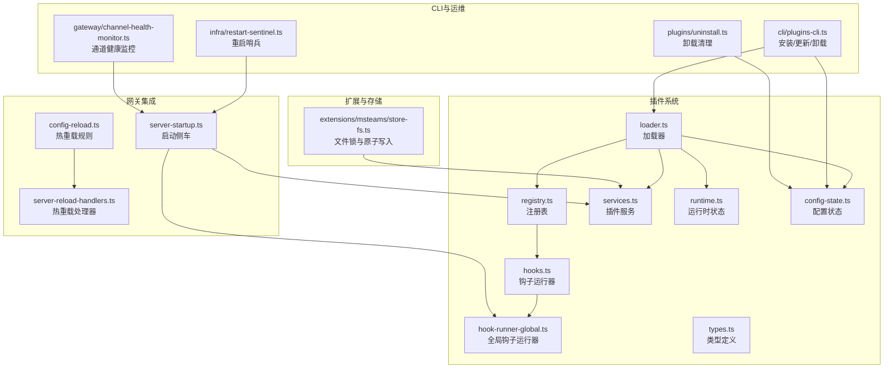

**图表来源**

- [src/plugins/loader.ts](file://src/plugins/loader.ts#L368-L717)
- [src/plugins/registry.ts](file://src/plugins/registry.ts#L164-L519)
- [src/plugins/hooks.ts](file://src/plugins/hooks.ts#L125-L751)
- [src/plugins/hook-runner-global.ts](file://src/plugins/hook-runner-global.ts#L22-L45)
- [src/plugins/services.ts](file://src/plugins/services.ts#L34-L75)
- [src/plugins/runtime.ts](file://src/plugins/runtime.ts#L23-L41)
- [src/plugins/config-state.ts](file://src/plugins/config-state.ts#L66-L262)
- [src/gateway/server-startup.ts](file://src/gateway/server-startup.ts#L153-L191)
- [src/gateway/config-reload.ts](file://src/gateway/config-reload.ts#L96-L133)
- [src/gateway/server-reload-handlers.ts](file://src/gateway/server-reload-handlers.ts#L48-L62)
- [src/cli/plugins-cli.ts](file://src/cli/plugins-cli.ts#L488-L709)
- [src/plugins/uninstall.ts](file://src/plugins/uninstall.ts#L65-L156)
- [src/infra/restart-sentinel.ts](file://src/infra/restart-sentinel.ts#L76-L128)
- [src/gateway/channel-health-monitor.ts](file://src/gateway/channel-health-monitor.ts#L53-L132)
- [extensions/msteams/src/store-fs.ts](file://extensions/msteams/src/store-fs.ts#L1-L44)

**章节来源**

- [src/plugins/loader.ts](file://src/plugins/loader.ts#L368-L717)
- [src/plugins/registry.ts](file://src/plugins/registry.ts#L164-L519)
- [src/plugins/hooks.ts](file://src/plugins/hooks.ts#L125-L751)
- [src/plugins/services.ts](file://src/plugins/services.ts#L34-L75)
- [src/gateway/server-startup.ts](file://src/gateway/server-startup.ts#L153-L191)

## 核心组件

- 加载器：负责发现、校验、实例化插件模块，构建注册表，初始化全局钩子运行器，并缓存结果以提升性能。
- 注册表：集中记录插件元数据、工具、钩子、HTTP路由、命令、服务等，支持诊断信息收集。
- 钩子系统：提供强一致的生命周期钩子执行模型（顺序合并与并行触发），并支持错误捕获与日志。
- 全局钩子运行器：在插件加载完成后初始化，供全局调用，确保跨模块一致性。
- 插件服务：启动/停止插件自定义服务，按逆序优雅关闭，失败时记录并继续关闭其他服务。
- 运行时状态：维护当前活跃插件注册表与缓存键，便于快速查询与热重载。
- 配置状态：规范化与解析插件启用策略、内存槽位、允许/拒绝列表、加载路径等。
- 网关集成：在启动阶段启动插件服务与钩子，处理热重载规则与通道重启策略。
- CLI与运维：提供安装、更新、卸载命令，配合配置变更与重启哨兵实现动态更新。
- 健康监控：对通道运行状态进行周期性检查，超限自动重启，避免雪崩。

**章节来源**

- [src/plugins/loader.ts](file://src/plugins/loader.ts#L368-L717)
- [src/plugins/registry.ts](file://src/plugins/registry.ts#L124-L162)
- [src/plugins/hooks.ts](file://src/plugins/hooks.ts#L125-L751)
- [src/plugins/hook-runner-global.ts](file://src/plugins/hook-runner-global.ts#L22-L45)
- [src/plugins/services.ts](file://src/plugins/services.ts#L34-L75)
- [src/plugins/runtime.ts](file://src/plugins/runtime.ts#L23-L41)
- [src/plugins/config-state.ts](file://src/plugins/config-state.ts#L66-L262)
- [src/gateway/server-startup.ts](file://src/gateway/server-startup.ts#L153-L191)
- [src/gateway/config-reload.ts](file://src/gateway/config-reload.ts#L96-L133)
- [src/cli/plugins-cli.ts](file://src/cli/plugins-cli.ts#L488-L709)
- [src/plugins/uninstall.ts](file://src/plugins/uninstall.ts#L65-L156)
- [src/infra/restart-sentinel.ts](file://src/infra/restart-sentinel.ts#L76-L128)
- [src/gateway/channel-health-monitor.ts](file://src/gateway/channel-health-monitor.ts#L53-L132)

## 架构总览

下图展示插件生命周期从加载到运行再到优雅关闭的关键交互：

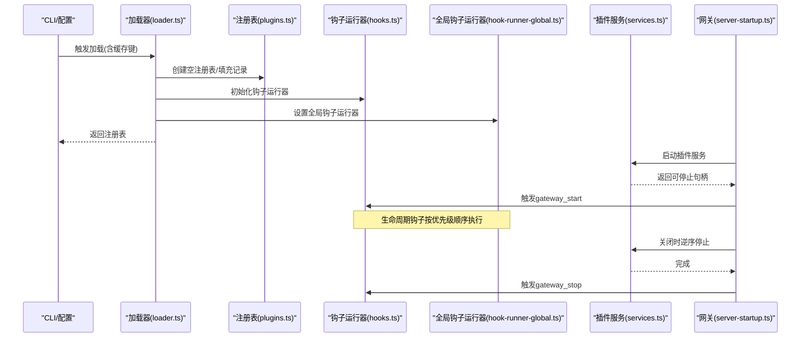

**图表来源**

- [src/plugins/loader.ts](file://src/plugins/loader.ts#L368-L717)
- [src/plugins/hooks.ts](file://src/plugins/hooks.ts#L676-L696)
- [src/plugins/hook-runner-global.ts](file://src/plugins/hook-runner-global.ts#L22-L45)
- [src/plugins/services.ts](file://src/plugins/services.ts#L34-L75)
- [src/gateway/server-startup.ts](file://src/gateway/server-startup.ts#L153-L191)

## 详细组件分析

### 组件A：插件加载与注册表

- 发现与校验：扫描候选插件，校验入口路径边界、配置模式匹配、导出接口存在性。
- 记录与诊断：为每个插件创建记录，填充工具、钩子、HTTP路由、命令、服务等清单，并收集诊断信息。
- 内存槽位决策：根据配置选择“记忆型”插件，确保唯一性与一致性。
- 缓存与激活：使用缓存键缓存注册表，设置为当前活跃注册表，初始化全局钩子运行器。

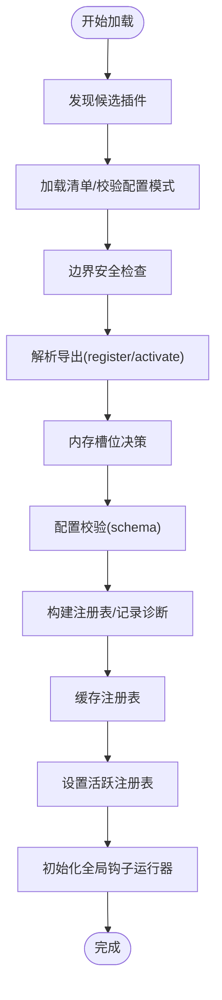

**图表来源**

- [src/plugins/loader.ts](file://src/plugins/loader.ts#L398-L717)
- [src/plugins/registry.ts](file://src/plugins/registry.ts#L164-L519)
- [src/plugins/config-state.ts](file://src/plugins/config-state.ts#L234-L262)

**章节来源**

- [src/plugins/loader.ts](file://src/plugins/loader.ts#L368-L717)
- [src/plugins/registry.ts](file://src/plugins/registry.ts#L124-L162)
- [src/plugins/config-state.ts](file://src/plugins/config-state.ts#L66-L262)

### 组件B：钩子系统与全局运行器

- 类型化钩子：通过typedHooks按名称与优先级排序，支持顺序合并与并行触发两类模式。
- 错误处理：统一捕获钩子异常，可选择抛出或仅记录，保证系统稳定性。
- 全局运行器：在插件加载后初始化，提供跨模块一致的钩子调用入口。

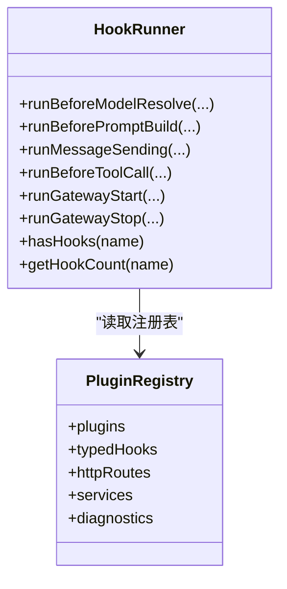

**图表来源**

- [src/plugins/hooks.ts](file://src/plugins/hooks.ts#L125-L751)
- [src/plugins/registry.ts](file://src/plugins/registry.ts#L124-L162)

**章节来源**

- [src/plugins/hooks.ts](file://src/plugins/hooks.ts#L125-L751)
- [src/plugins/hook-runner-global.ts](file://src/plugins/hook-runner-global.ts#L22-L45)

### 组件C：插件服务与优雅关闭

- 启动：遍历注册表中的服务，按顺序调用start，记录可停止句柄。
- 关闭：按逆序调用stop，忽略单个失败，确保其他服务正常关闭。
- 上下文：提供配置、工作空间、状态目录与日志器。

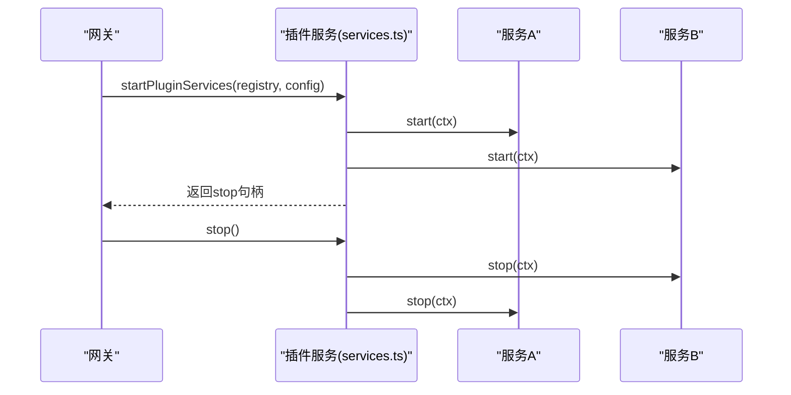

**图表来源**

- [src/plugins/services.ts](file://src/plugins/services.ts#L34-L75)
- [src/gateway/server-startup.ts](file://src/gateway/server-startup.ts#L153-L191)

**章节来源**

- [src/plugins/services.ts](file://src/plugins/services.ts#L34-L75)
- [src/gateway/server-startup.ts](file://src/gateway/server-startup.ts#L153-L191)

### 组件D：配置状态与启用策略

- 规范化：将用户配置转换为标准化结构，处理列表、槽位、条目等字段。
- 启用策略：综合允许/拒绝列表、显式开关、条目开关、默认行为与渠道联动决定是否启用。
- 内存槽位：支持禁用、指定插件或自动选择，确保唯一性与一致性。

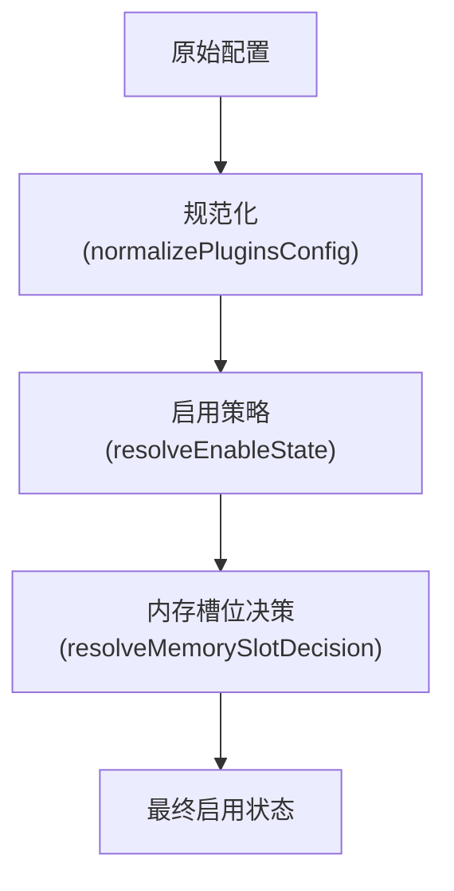

**图表来源**

- [src/plugins/config-state.ts](file://src/plugins/config-state.ts#L66-L262)

**章节来源**

- [src/plugins/config-state.ts](file://src/plugins/config-state.ts#L66-L262)

### 组件E：热重载与动态更新

- 热重载规则：基于插件贡献的前缀生成“热重载/无操作”规则，结合基础规则与通道规则。
- 应用计划：根据规则生成重载计划，必要时重启特定通道或重新加载钩子配置。
- CLI更新：支持安装/更新/卸载，更新后提示重启以应用变更。

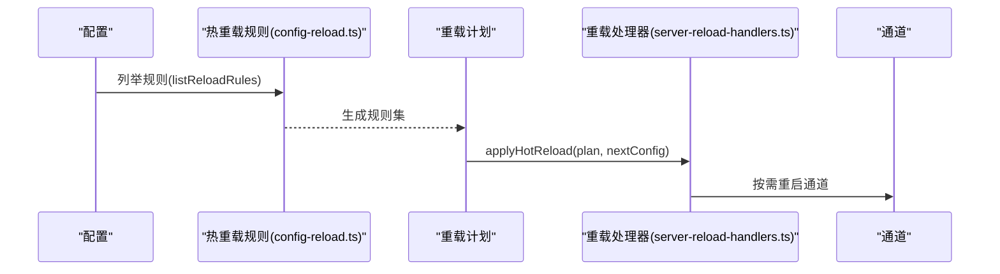

**图表来源**

- [src/gateway/config-reload.ts](file://src/gateway/config-reload.ts#L96-L133)
- [src/gateway/server-reload-handlers.ts](file://src/gateway/server-reload-handlers.ts#L48-L62)
- [src/cli/plugins-cli.ts](file://src/cli/plugins-cli.ts#L488-L709)

**章节来源**

- [src/gateway/config-reload.ts](file://src/gateway/config-reload.ts#L96-L133)
- [src/gateway/server-reload-handlers.ts](file://src/gateway/server-reload-handlers.ts#L48-L62)
- [src/cli/plugins-cli.ts](file://src/cli/plugins-cli.ts#L488-L709)

### 组件F：卸载与持久化清理

- 卸载动作：从配置中移除条目、安装记录、允许列表、加载路径与内存槽位，清理空对象。
- 槽位回退：若卸载的是当前选中的内存插件，回退到默认槽位。
- CLI反馈：输出已移除项与重启建议。

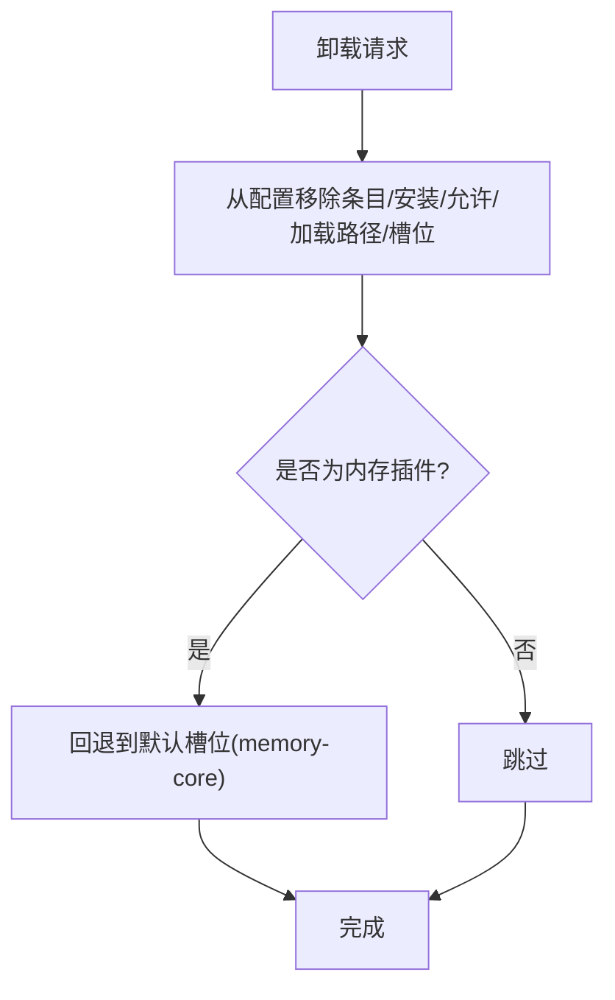

**图表来源**

- [src/plugins/uninstall.ts](file://src/plugins/uninstall.ts#L65-L156)

**章节来源**

- [src/plugins/uninstall.ts](file://src/plugins/uninstall.ts#L65-L156)
- [src/cli/plugins-cli.ts](file://src/cli/plugins-cli.ts#L488-L709)

### 组件G：健康检查与自动重启

- 周期检查：对通道运行状态进行定期快照，识别不健康实例。
- 限制策略：冷却时间、每小时重启次数上限，避免风暴。
- 自动重启：根据原因（停止/卡住/放弃重连）触发重启并记录诊断。

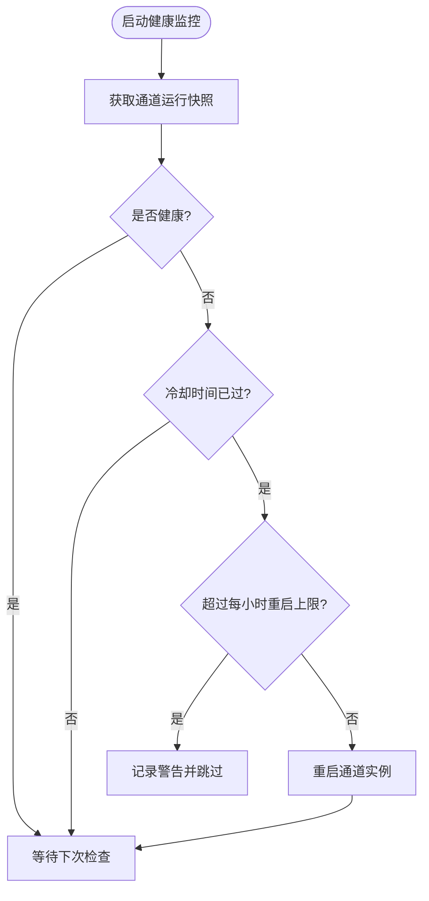

**图表来源**

- [src/gateway/channel-health-monitor.ts](file://src/gateway/channel-health-monitor.ts#L53-L132)

**章节来源**

- [src/gateway/channel-health-monitor.ts](file://src/gateway/channel-health-monitor.ts#L53-L132)

### 组件H：持久化存储与并发安全

- 原子写入：提供原子写JSON与回退读取，避免部分写入。
- 文件锁：基于重试与过期策略的文件锁，保障并发安全。
- 扩展示例：Teams扩展使用上述能力实现可靠的状态存储。

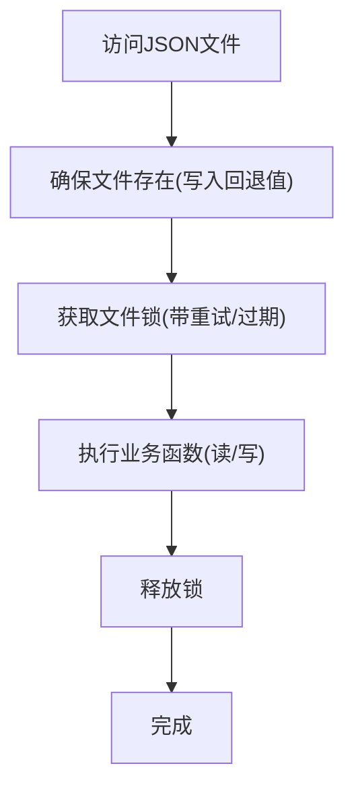

**图表来源**

- [extensions/msteams/src/store-fs.ts](file://extensions/msteams/src/store-fs.ts#L1-L44)

**章节来源**

- [extensions/msteams/src/store-fs.ts](file://extensions/msteams/src/store-fs.ts#L1-L44)

## 依赖关系分析

- 耦合度：加载器与注册表紧密耦合，共同完成插件装配；钩子运行器依赖注册表；全局钩子运行器依赖加载器初始化。
- 外部依赖：Jiti用于插件模块加载与别名解析；Node FS用于边界检查与文件操作；重启哨兵与通道健康监控作为外部集成点。
- 循环依赖：未见循环依赖迹象；运行时状态通过全局符号隔离。

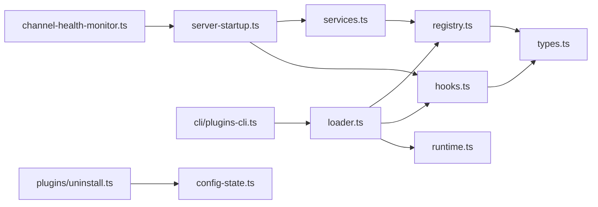

**图表来源**

- [src/plugins/loader.ts](file://src/plugins/loader.ts#L368-L717)
- [src/plugins/registry.ts](file://src/plugins/registry.ts#L164-L519)
- [src/plugins/hooks.ts](file://src/plugins/hooks.ts#L125-L751)
- [src/plugins/services.ts](file://src/plugins/services.ts#L34-L75)
- [src/plugins/runtime.ts](file://src/plugins/runtime.ts#L23-L41)
- [src/plugins/types.ts](file://src/plugins/types.ts#L1-L764)
- [src/gateway/server-startup.ts](file://src/gateway/server-startup.ts#L153-L191)
- [src/cli/plugins-cli.ts](file://src/cli/plugins-cli.ts#L488-L709)
- [src/plugins/uninstall.ts](file://src/plugins/uninstall.ts#L65-L156)
- [src/plugins/config-state.ts](file://src/plugins/config-state.ts#L66-L262)
- [src/gateway/channel-health-monitor.ts](file://src/gateway/channel-health-monitor.ts#L53-L132)

**章节来源**

- [src/plugins/loader.ts](file://src/plugins/loader.ts#L368-L717)
- [src/plugins/registry.ts](file://src/plugins/registry.ts#L164-L519)
- [src/plugins/hooks.ts](file://src/plugins/hooks.ts#L125-L751)
- [src/plugins/services.ts](file://src/plugins/services.ts#L34-L75)
- [src/gateway/server-startup.ts](file://src/gateway/server-startup.ts#L153-L191)
- [src/cli/plugins-cli.ts](file://src/cli/plugins-cli.ts#L488-L709)
- [src/plugins/uninstall.ts](file://src/plugins/uninstall.ts#L65-L156)
- [src/plugins/config-state.ts](file://src/plugins/config-state.ts#L66-L262)
- [src/gateway/channel-health-monitor.ts](file://src/gateway/channel-health-monitor.ts#L53-L132)

## 性能考量

- 并行钩子：消息发送、消息接收、会话结束等钩子采用并行触发，减少延迟。
- 顺序钩子：模型解析、提示构建、工具调用等采用顺序执行与结果合并，保证确定性。
- 缓存注册表：加载器使用缓存键缓存注册表，避免重复加载。
- 异步写入：服务启动/停止异步执行，失败不影响其他组件。
- 文件锁退避：写入重试指数退避，降低竞争冲突。

[本节为通用指导，无需具体文件分析]

## 故障排查指南

- 插件加载失败：检查入口路径边界、配置模式、导出接口是否存在；查看诊断信息与错误记录。
- 钩子异常：钩子运行器默认捕获异常并记录，必要时开启严格模式定位问题。
- 服务启动失败：查看服务start错误日志；确认依赖与权限；关注优雅关闭过程中的stop异常。
- 热重载无效：核对规则前缀与通道贡献；确认重启通道的权限与网络可达性。
- 卸载残留：确认配置清理动作与内存槽位回退；必要时手动清理状态目录。

**章节来源**

- [src/plugins/loader.ts](file://src/plugins/loader.ts#L554-L695)
- [src/plugins/hooks.ts](file://src/plugins/hooks.ts#L175-L215)
- [src/plugins/services.ts](file://src/plugins/services.ts#L56-L74)
- [src/gateway/config-reload.ts](file://src/gateway/config-reload.ts#L96-L133)
- [src/plugins/uninstall.ts](file://src/plugins/uninstall.ts#L65-L156)

## 结论

OpenClaw的插件生命周期管理通过“加载-注册-钩子-服务-运行时”的清晰分层，实现了从安装到卸载的全链路可观测与可恢复。借助热重载规则、健康监控与原子存储能力，系统在动态演进与高可用之间取得平衡。建议在生产环境启用严格的诊断与健康检查，并通过CLI与重启哨兵实现平滑的版本切换与故障恢复。

[本节为总结，无需具体文件分析]

## 附录

- 生命周期事件监听：通过全局钩子运行器在任意位置触发与订阅生命周期钩子。
- 状态监控：利用运行时注册表与诊断信息，结合健康监控与重启哨兵，形成闭环。
- 性能统计：在钩子与服务中注入计时与指标上报，结合热重载后的指标对比评估变更影响。

[本节为概念性内容，无需具体文件分析]
