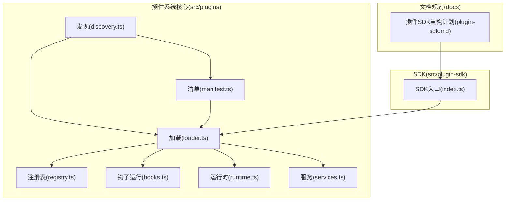
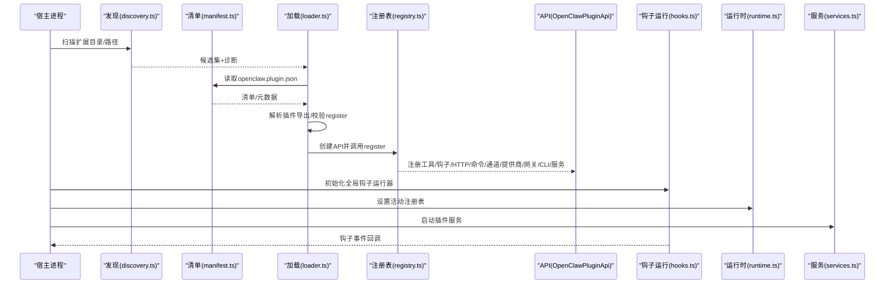
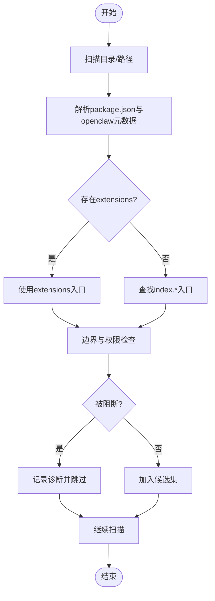
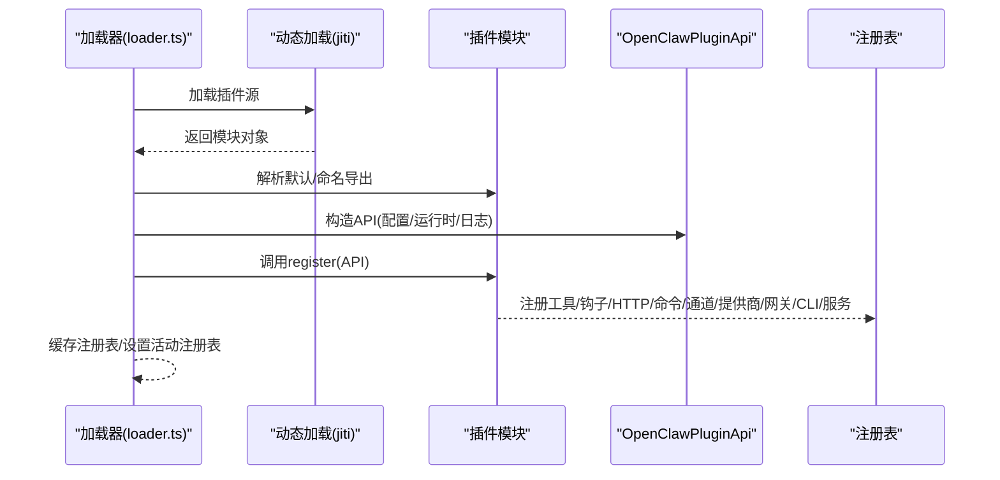
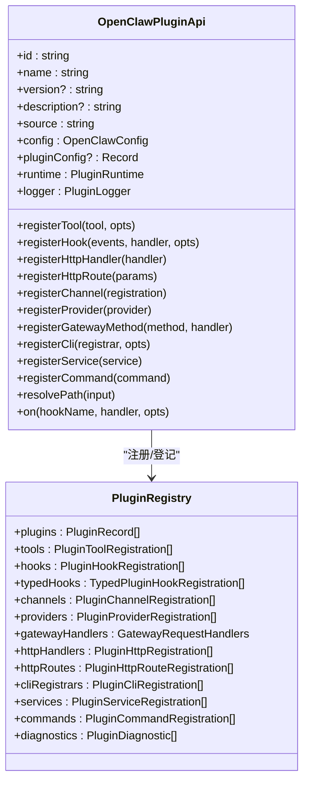
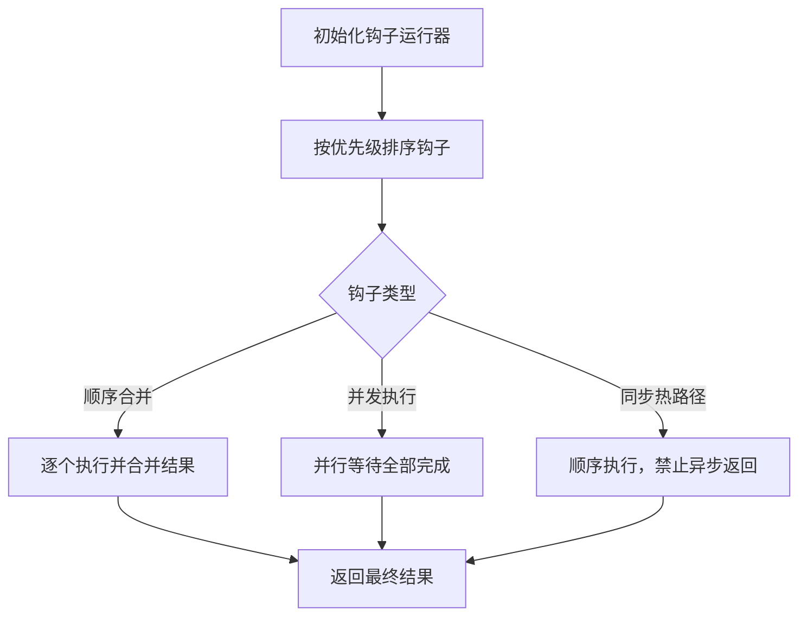
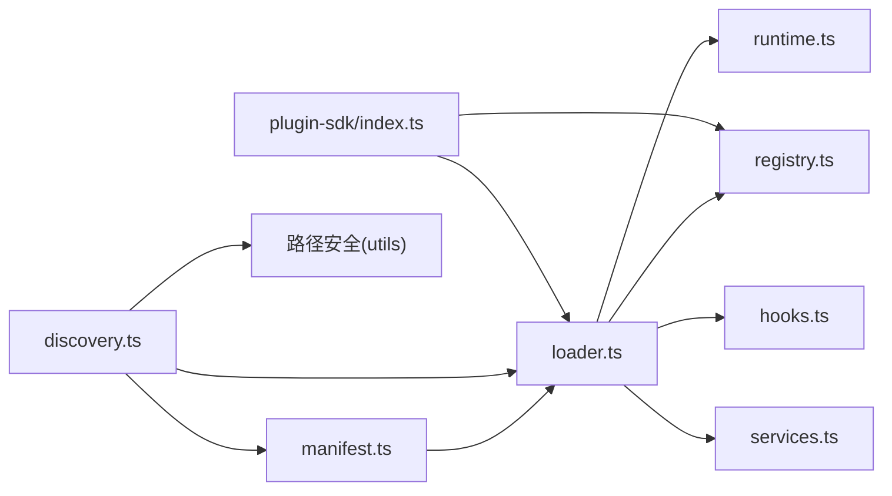

# 插件系统架构

<cite>
**本文引用的文件**
- [loader.ts](file://src/plugins/loader.ts)
- [types.ts](file://src/plugins/types.ts)
- [registry.ts](file://src/plugins/registry.ts)
- [discovery.ts](file://src/plugins/discovery.ts)
- [manifest.ts](file://src/plugins/manifest.ts)
- [hooks.ts](file://src/plugins/hooks.ts)
- [runtime.ts](file://src/plugins/runtime.ts)
- [services.ts](file://src/plugins/services.ts)
- [index.ts](file://src/plugin-sdk/index.ts)
- [plugin-sdk.md](file://docs/zh-CN/refactor/plugin-sdk.md)
</cite>

## 目录

1. [引言](#引言)
2. [项目结构](#项目结构)
3. [核心组件](#核心组件)
4. [架构总览](#架构总览)
5. [详细组件分析](#详细组件分析)
6. [依赖关系分析](#依赖关系分析)
7. [性能考量](#性能考量)
8. [故障排查指南](#故障排查指南)
9. [结论](#结论)
10. [附录](#附录)

## 引言

本文件系统性阐述 OpenClaw 插件系统的设计与实现，覆盖插件发现与加载、沙箱边界、API 接口设计、生命周期钩子、服务管理、配置校验、注册表与缓存、以及与宿主系统的交互方式。文档同时给出开发规范、SDK 使用指南与最佳实践，并提供调试、性能监控与故障排除方法。

## 项目结构

OpenClaw 插件系统由“发现—加载—注册—运行”四阶段构成，核心位于 src/plugins 及其子模块；SDK 层位于 src/plugin-sdk，用于对外提供稳定 API 与类型约束。

图示来源

- [discovery.ts](file://src/plugins/discovery.ts#L567-L635)
- [manifest.ts](file://src/plugins/manifest.ts#L45-L115)
- [loader.ts](file://src/plugins/loader.ts#L368-L717)
- [registry.ts](file://src/plugins/registry.ts#L164-L519)
- [hooks.ts](file://src/plugins/hooks.ts#L125-L751)
- [runtime.ts](file://src/plugins/runtime.ts#L23-L41)
- [services.ts](file://src/plugins/services.ts#L34-L75)
- [index.ts](file://src/plugin-sdk/index.ts#L1-L597)
- [plugin-sdk.md](file://docs/zh-CN/refactor/plugin-sdk.md#L16-L222)

章节来源

- [discovery.ts](file://src/plugins/discovery.ts#L1-L636)
- [manifest.ts](file://src/plugins/manifest.ts#L1-L167)
- [loader.ts](file://src/plugins/loader.ts#L1-L726)
- [registry.ts](file://src/plugins/registry.ts#L1-L520)
- [hooks.ts](file://src/plugins/hooks.ts#L1-L754)
- [runtime.ts](file://src/plugins/runtime.ts#L1-L42)
- [services.ts](file://src/plugins/services.ts#L1-L76)
- [index.ts](file://src/plugin-sdk/index.ts#L1-L597)
- [plugin-sdk.md](file://docs/zh-CN/refactor/plugin-sdk.md#L1-L222)

## 核心组件

- 插件发现与候选收集：扫描工作区、全局与内置扩展目录，解析 package.json 与 openclaw.plugin.json，构建候选集并进行路径安全检查。
- 清单与元数据：读取 openclaw.plugin.json，校验 id、configSchema 等关键字段，支持 UI 提示与渠道/提供商信息。
- 加载与装配：基于候选集创建注册表，解析插件导出（默认导出或命名导出），校验 register/activate 函数，构造 OpenClawPluginApi 并调用注册。
- 注册表与 API：集中管理工具、钩子、HTTP 路由、命令、通道、提供商、网关方法、CLI 注册器与服务，提供诊断与统计。
- 生命周期钩子：提供统一的钩子运行器，支持顺序合并与并发执行，覆盖代理、消息、工具、会话、子代理、网关等阶段。
- 运行时与服务：通过全局状态持有活动注册表，启动/停止插件服务，提供日志与状态目录等基础设施。
- SDK：对外暴露类型、工具函数与运行时能力，确保插件不直接导入 src/\*\*，仅通过 SDK 与运行时交互。

章节来源

- [discovery.ts](file://src/plugins/discovery.ts#L1-L636)
- [manifest.ts](file://src/plugins/manifest.ts#L1-L167)
- [loader.ts](file://src/plugins/loader.ts#L1-L726)
- [registry.ts](file://src/plugins/registry.ts#L1-L520)
- [hooks.ts](file://src/plugins/hooks.ts#L1-L754)
- [runtime.ts](file://src/plugins/runtime.ts#L1-L42)
- [services.ts](file://src/plugins/services.ts#L1-L76)
- [index.ts](file://src/plugin-sdk/index.ts#L1-L597)

## 架构总览

下图展示插件系统从发现到运行的关键交互：

图示来源

- [discovery.ts](file://src/plugins/discovery.ts#L567-L635)
- [manifest.ts](file://src/plugins/manifest.ts#L45-L115)
- [loader.ts](file://src/plugins/loader.ts#L368-L717)
- [registry.ts](file://src/plugins/registry.ts#L472-L503)
- [hooks.ts](file://src/plugins/hooks.ts#L125-L751)
- [runtime.ts](file://src/plugins/runtime.ts#L23-L41)
- [services.ts](file://src/plugins/services.ts#L34-L75)

## 详细组件分析

### 组件A：插件发现与安全边界

- 功能要点
  - 支持从配置路径、工作区、全局与内置目录发现插件。
  - 对候选源文件与根目录进行边界检查，避免逃逸与权限问题。
  - 支持 package.json 中的 extensions 字段与 index.\* 文件回退。
  - 生成诊断信息，记录阻断原因（如世界可写、可疑属主、逃逸根目录）。
- 关键流程
  - 读取 openclaw.plugin.json 与 package.json 元数据。
  - 校验路径安全性与所有权，过滤无效条目。
  - 生成候选集并去重，供加载阶段使用。

图示来源

- [discovery.ts](file://src/plugins/discovery.ts#L347-L565)
- [manifest.ts](file://src/plugins/manifest.ts#L117-L167)

章节来源

- [discovery.ts](file://src/plugins/discovery.ts#L1-L636)
- [manifest.ts](file://src/plugins/manifest.ts#L1-L167)

### 组件B：插件清单与配置校验

- 功能要点
  - openclaw.plugin.json 必须包含 id 与 configSchema；其他字段如 kind、name、description、version、uiHints 可选。
  - 支持 UI 提示（标签、帮助、高级、敏感、占位符等）。
  - 通过 schema 校验插件配置，失败时记录错误并阻止加载。
- 复杂度与性能
  - 清单读取与解析为 O(1)，配置校验复杂度取决于 schema 结构与数据规模。

章节来源

- [manifest.ts](file://src/plugins/manifest.ts#L11-L115)
- [loader.ts](file://src/plugins/loader.ts#L624-L643)

### 组件C：插件加载与注册

- 功能要点
  - 使用 jiti 动态加载插件源文件，支持 alias 将 openclaw/plugin-sdk 映射到实际 SDK 位置。
  - 解析插件导出（默认导出或命名导出），要求提供 register 或 activate。
  - 构造 OpenClawPluginApi，调用 register 并登记工具、钩子、HTTP、命令、通道、提供商、网关方法、CLI 与服务。
  - 缓存注册表，设置活动注册表，初始化全局钩子运行器。
- 错误处理
  - 对加载失败、register 抛错、配置非法等情况记录诊断并标记状态为 error。

图示来源

- [loader.ts](file://src/plugins/loader.ts#L426-L448)
- [loader.ts](file://src/plugins/loader.ts#L554-L570)
- [loader.ts](file://src/plugins/loader.ts#L666-L695)
- [registry.ts](file://src/plugins/registry.ts#L472-L503)

章节来源

- [loader.ts](file://src/plugins/loader.ts#L1-L726)
- [registry.ts](file://src/plugins/registry.ts#L164-L519)

### 组件D：注册表与 API 设计

- 功能要点
  - 注册表集中存储插件记录、工具、钩子、HTTP 路由、命令、通道、提供商、网关方法、CLI 与服务。
  - OpenClawPluginApi 提供 registerTool/registerHook/registerHttpHandler/registerHttpRoute/registerChannel/registerProvider/registerGatewayMethod/registerCli/registerService/registerCommand/resolvePath/on 等能力。
  - 对重复注册（如 HTTP 路由、网关方法、提供商）进行诊断与拦截。
- 数据结构
  - PluginRecord：记录插件基本信息、启用状态、统计字段与诊断。
  - 多类注册条目：工具、钩子、HTTP、命令、通道、提供商、网关、CLI、服务。

图示来源

- [types.ts](file://src/plugins/types.ts#L245-L284)
- [registry.ts](file://src/plugins/registry.ts#L124-L138)
- [registry.ts](file://src/plugins/registry.ts#L472-L503)

章节来源

- [types.ts](file://src/plugins/types.ts#L1-L764)
- [registry.ts](file://src/plugins/registry.ts#L1-L520)

### 组件E：生命周期钩子与运行器

- 功能要点
  - 提供统一钩子运行器，按优先级排序执行，支持顺序合并与并发执行。
  - 覆盖代理、消息、工具、会话、子代理、网关等阶段，部分钩子（如 tool_result_persist、before_message_write）为同步热路径。
  - 对异常钩子处理器进行捕获或抛出，保证宿主稳定性。
- 性能特性
  - 并发执行提升吞吐，顺序合并保障确定性结果。

图示来源

- [hooks.ts](file://src/plugins/hooks.ts#L113-L120)
- [hooks.ts](file://src/plugins/hooks.ts#L221-L255)
- [hooks.ts](file://src/plugins/hooks.ts#L466-L513)
- [hooks.ts](file://src/plugins/hooks.ts#L531-L590)

章节来源

- [hooks.ts](file://src/plugins/hooks.ts#L1-L754)

### 组件F：运行时与服务管理

- 功能要点
  - 通过全局状态保存活动注册表，支持查询与缓存键。
  - 启动插件服务，按注册顺序调用 start，收集可停止的服务句柄；停止时逆序调用 stop 并记录告警。
- 与宿主集成
  - 服务上下文包含配置、工作区、状态目录与日志器，便于插件持久化与可观测性。

章节来源

- [runtime.ts](file://src/plugins/runtime.ts#L1-L42)
- [services.ts](file://src/plugins/services.ts#L1-L76)

### 组件G：SDK 与开发规范

- SDK 范畴
  - 类型与工具：通道适配器、配置辅助、配对与新手引导、工具参数、媒体与安全策略等。
  - 运行时接口：文本分块、回复派发、路由、配对、媒体抓取与保存、提及匹配、群组策略、防抖、命令授权等。
- 开发规范
  - 插件不得直接导入 src/\*\*，必须通过 openclaw/plugin-sdk 与 api.runtime 获取能力。
  - 使用语义化版本控制，声明所需运行时版本范围。
  - 通过 CLI/网关/通道/提供商等注册点接入，遵循 schema 与 UI 提示。
- 最佳实践
  - 使用 registerService 管理长生命周期资源，确保 stop 正确释放。
  - 在钩子中避免阻塞与长时间 IO，必要时异步处理。
  - 严格校验输入与输出，利用 SDK 的 SSRF/SSRF 策略与安全工具。

章节来源

- [index.ts](file://src/plugin-sdk/index.ts#L1-L597)
- [plugin-sdk.md](file://docs/zh-CN/refactor/plugin-sdk.md#L16-L222)

## 依赖关系分析

图示来源

- [discovery.ts](file://src/plugins/discovery.ts#L1-L636)
- [manifest.ts](file://src/plugins/manifest.ts#L1-L167)
- [loader.ts](file://src/plugins/loader.ts#L1-L726)
- [registry.ts](file://src/plugins/registry.ts#L1-L520)
- [runtime.ts](file://src/plugins/runtime.ts#L1-L42)
- [hooks.ts](file://src/plugins/hooks.ts#L1-L754)
- [services.ts](file://src/plugins/services.ts#L1-L76)
- [index.ts](file://src/plugin-sdk/index.ts#L1-L597)

章节来源

- [loader.ts](file://src/plugins/loader.ts#L1-L726)
- [registry.ts](file://src/plugins/registry.ts#L1-L520)

## 性能考量

- 加载阶段
  - 使用 jiti 动态加载，减少冷启动开销；通过缓存键复用注册表，避免重复扫描与解析。
  - 并发执行钩子（如 llm*input/llm_output、message*\* 系列）提升吞吐。
- 运行阶段
  - 同步钩子（tool_result_persist、before_message_write）避免异步返回，降低调度成本。
  - 服务启动/停止采用顺序与逆序策略，确保资源有序释放。
- I/O 与安全
  - 边界文件读取与路径安全检查在加载期完成，避免运行期额外开销。
  - SDK 提供 SSRF 策略与安全工具，减少网络请求风险与错误处理成本。

## 故障排查指南

- 常见问题与定位
  - 插件未加载：检查 openclaw.plugin.json 是否存在且包含 id 与 configSchema；查看诊断信息与错误日志。
  - register 抛错：确认 register/activate 导出存在且签名正确；查看错误堆栈与诊断消息。
  - 配置非法：核对 schema 校验结果，修正配置后重试。
  - HTTP/网关冲突：注册重复路径或方法时会被拦截并记录错误。
  - 服务启动失败：查看服务 start 的异常；确认 stop 调用链路。
- 调试建议
  - 启用详细日志，观察加载与注册过程。
  - 使用 validateOnly 模式仅校验，快速定位清单与配置问题。
  - 通过 getActivePluginRegistry 获取当前注册表，核对工具/钩子/HTTP/命令等登记情况。
- 性能监控
  - 利用钩子运行器统计钩子数量与执行耗时，识别热点。
  - 监控服务启动/停止耗时与异常次数。

章节来源

- [loader.ts](file://src/plugins/loader.ts#L187-L210)
- [registry.ts](file://src/plugins/registry.ts#L269-L289)
- [services.ts](file://src/plugins/services.ts#L34-L75)
- [runtime.ts](file://src/plugins/runtime.ts#L28-L41)

## 结论

OpenClaw 插件系统通过清晰的分层与严格的边界控制，实现了可扩展、可维护、可审计的插件生态。发现—加载—注册—运行的流水线确保了稳定性与性能；SDK 与运行时分离进一步提升了外部插件的开发体验与长期演进空间。遵循本文的开发规范与最佳实践，可有效降低风险并提升系统整体质量。

## 附录

- 版本与兼容性
  - SDK 使用语义化版本控制，运行时与核心版本绑定，插件需声明所需运行时版本范围。
- 测试策略
  - 适配器级单元测试、插件黄金测试与 CI 端到端示例，确保行为一致性与回归防护。

章节来源

- [plugin-sdk.md](file://docs/zh-CN/refactor/plugin-sdk.md#L195-L222)
