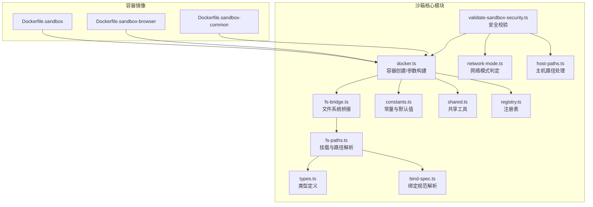
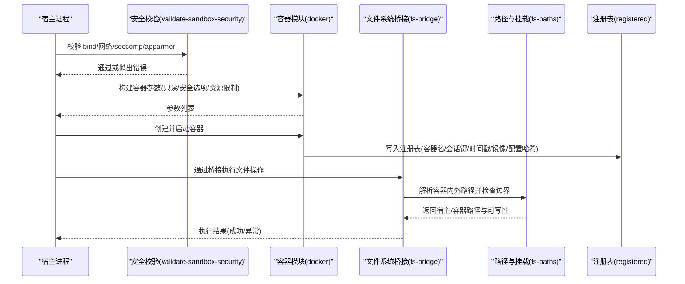
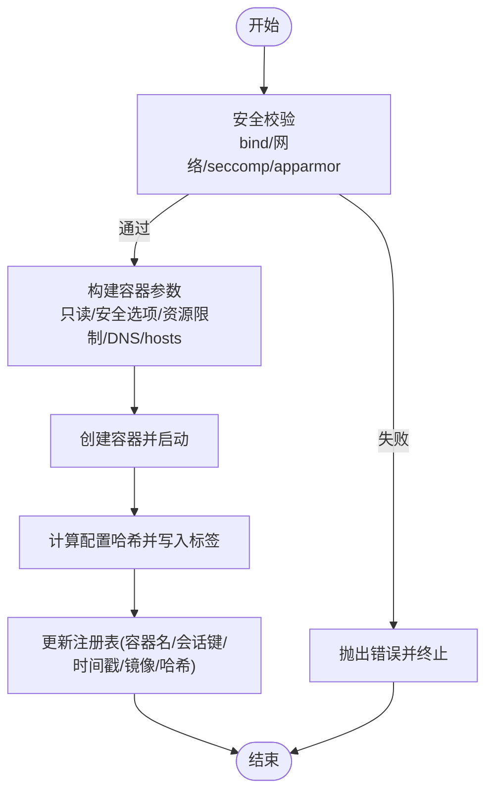
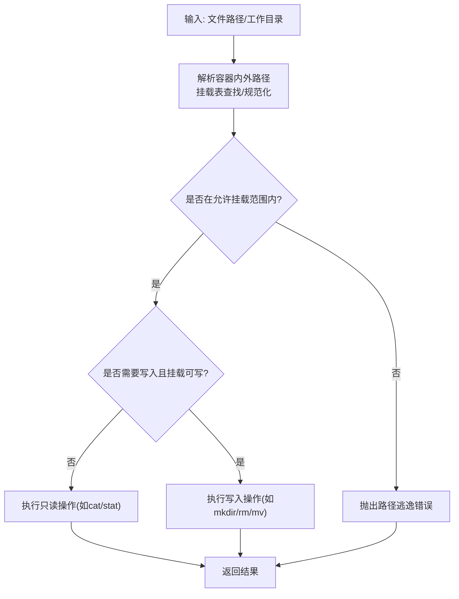
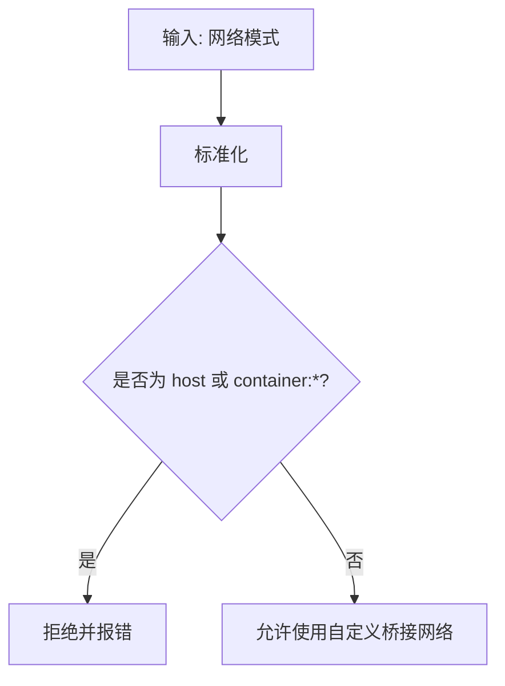
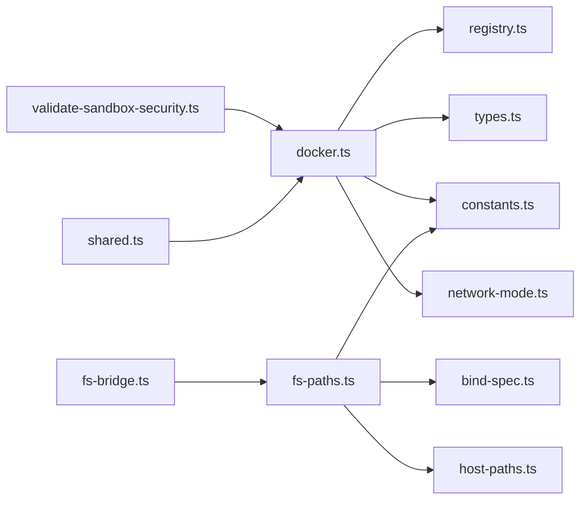

# 沙箱隔离机制

<cite>
**本文引用的文件**
- [src/agents/sandbox/validate-sandbox-security.ts](file://src/agents/sandbox/validate-sandbox-security.ts)
- [src/agents/sandbox/docker.ts](file://src/agents/sandbox/docker.ts)
- [src/agents/sandbox/fs-bridge.ts](file://src/agents/sandbox/fs-bridge.ts)
- [src/agents/sandbox/fs-paths.ts](file://src/agents/sandbox/fs-paths.ts)
- [src/agents/sandbox/types.ts](file://src/agents/sandbox/types.ts)
- [src/agents/sandbox/constants.ts](file://src/agents/sandbox/constants.ts)
- [src/agents/sandbox/network-mode.ts](file://src/agents/sandbox/network-mode.ts)
- [src/agents/sandbox/host-paths.ts](file://src/agents/sandbox/host-paths.ts)
- [src/agents/sandbox/bind-spec.ts](file://src/agents/sandbox/bind-spec.ts)
- [src/agents/sandbox/shared.ts](file://src/agents/sandbox/shared.ts)
- [src/agents/sandbox/registry.ts](file://src/agents/sandbox/registry.ts)
- [Dockerfile.sandbox](file://Dockerfile.sandbox)
- [Dockerfile.sandbox-browser](file://Dockerfile.sandbox-browser)
- [Dockerfile.sandbox-common](file://Dockerfile.sandbox-common)
</cite>

## 目录

1. [简介](#简介)
2. [项目结构](#项目结构)
3. [核心组件](#核心组件)
4. [架构总览](#架构总览)
5. [详细组件分析](#详细组件分析)
6. [依赖关系分析](#依赖关系分析)
7. [性能考量](#性能考量)
8. [故障排查指南](#故障排查指南)
9. [结论](#结论)
10. [附录](#附录)

## 简介

本文件系统性阐述 OpenClaw 插件运行时的沙箱隔离机制，覆盖进程隔离、文件系统隔离与网络访问控制；详解沙箱路径管理、工具策略配置与安全边界设置；说明插件与宿主系统的通信协议、数据交换格式与权限控制；并提供沙箱逃逸防护、资源限制与监控机制，以及调试、性能分析与安全审计方法。

## 项目结构

围绕沙箱的核心实现位于 src/agents/sandbox 目录，关键职责划分如下：

- 安全校验：bind 挂载、网络模式、安全配置（seccomp/apparmor）等
- Docker 容器生命周期与参数构建
- 文件系统桥接：容器内外路径解析、边界检查、读写操作
- 路径与挂载：挂载表构建、容器内路径解析、宿主机路径规范化
- 常量与默认值：镜像、端口、工作目录、注册表路径等
- 网络模式判定：阻止危险网络模式
- 主机路径处理：路径规范化、通过现有祖先解析真实路径
- 绑定规范解析：解析 host:container[:options]
- 共享工具：会话键 slug 化、作用域解析、代理 ID 解析
- 注册表：容器与浏览器实例的持久化记录与并发安全更新



**图表来源**

- [src/agents/sandbox/validate-sandbox-security.ts](file://src/agents/sandbox/validate-sandbox-security.ts#L1-L344)
- [src/agents/sandbox/docker.ts](file://src/agents/sandbox/docker.ts#L1-L512)
- [src/agents/sandbox/fs-bridge.ts](file://src/agents/sandbox/fs-bridge.ts#L1-L367)
- [src/agents/sandbox/fs-paths.ts](file://src/agents/sandbox/fs-paths.ts#L1-L258)
- [src/agents/sandbox/types.ts](file://src/agents/sandbox/types.ts#L1-L91)
- [src/agents/sandbox/constants.ts](file://src/agents/sandbox/constants.ts#L1-L55)
- [src/agents/sandbox/network-mode.ts](file://src/agents/sandbox/network-mode.ts#L1-L29)
- [src/agents/sandbox/host-paths.ts](file://src/agents/sandbox/host-paths.ts#L1-L44)
- [src/agents/sandbox/bind-spec.ts](file://src/agents/sandbox/bind-spec.ts#L1-L35)
- [src/agents/sandbox/shared.ts](file://src/agents/sandbox/shared.ts#L1-L47)
- [src/agents/sandbox/registry.ts](file://src/agents/sandbox/registry.ts#L1-L206)
- [Dockerfile.sandbox](file://Dockerfile.sandbox#L1-L21)
- [Dockerfile.sandbox-browser](file://Dockerfile.sandbox-browser#L1-L33)
- [Dockerfile.sandbox-common](file://Dockerfile.sandbox-common#L1-L46)

**章节来源**

- [src/agents/sandbox/validate-sandbox-security.ts](file://src/agents/sandbox/validate-sandbox-security.ts#L1-L344)
- [src/agents/sandbox/docker.ts](file://src/agents/sandbox/docker.ts#L1-L512)
- [src/agents/sandbox/fs-bridge.ts](file://src/agents/sandbox/fs-bridge.ts#L1-L367)
- [src/agents/sandbox/fs-paths.ts](file://src/agents/sandbox/fs-paths.ts#L1-L258)
- [src/agents/sandbox/types.ts](file://src/agents/sandbox/types.ts#L1-L91)
- [src/agents/sandbox/constants.ts](file://src/agents/sandbox/constants.ts#L1-L55)
- [src/agents/sandbox/network-mode.ts](file://src/agents/sandbox/network-mode.ts#L1-L29)
- [src/agents/sandbox/host-paths.ts](file://src/agents/sandbox/host-paths.ts#L1-L44)
- [src/agents/sandbox/bind-spec.ts](file://src/agents/sandbox/bind-spec.ts#L1-L35)
- [src/agents/sandbox/shared.ts](file://src/agents/sandbox/shared.ts#L1-L47)
- [src/agents/sandbox/registry.ts](file://src/agents/sandbox/registry.ts#L1-L206)
- [Dockerfile.sandbox](file://Dockerfile.sandbox#L1-L21)
- [Dockerfile.sandbox-browser](file://Dockerfile.sandbox-browser#L1-L33)
- [Dockerfile.sandbox-common](file://Dockerfile.sandbox-common#L1-L46)

## 核心组件

- 安全校验模块：对 bind 挂载源根、保留目标路径、网络模式、seccomp/apparmor 配置进行严格校验，阻断潜在逃逸与越权行为。
- Docker 容器模块：负责镜像存在性检查、容器创建参数构建（只读根文件系统、tmpfs、DNS、额外主机、PID/CPU/内存限制、ulimit、安全选项等）、容器生命周期管理与配置哈希校验。
- 文件系统桥接模块：在宿主与容器之间建立安全的文件操作通道，执行前进行路径边界检查与可写性校验，并通过容器内命令执行实际文件操作。
- 路径与挂载模块：构建挂载表，解析容器内外路径映射，处理同名/硬链接策略，确保路径不逃逸。
- 类型与常量：统一定义沙箱配置、工具策略、浏览器配置、默认端口与镜像名称等。
- 网络模式判定：阻止 host 与 container:\* 等危险网络模式。
- 主机路径处理：规范化宿主机路径，通过现有祖先解析避免符号链接绕过。
- 绑定规范解析：解析 host:container[:options] 规范，提取挂载选项。
- 共享工具：会话键 slug 化、作用域解析、代理 ID 解析。
- 注册表：以锁保护的方式读写容器与浏览器实例注册信息，支持热容器提示重建。

**章节来源**

- [src/agents/sandbox/validate-sandbox-security.ts](file://src/agents/sandbox/validate-sandbox-security.ts#L1-L344)
- [src/agents/sandbox/docker.ts](file://src/agents/sandbox/docker.ts#L259-L368)
- [src/agents/sandbox/fs-bridge.ts](file://src/agents/sandbox/fs-bridge.ts#L40-L65)
- [src/agents/sandbox/fs-paths.ts](file://src/agents/sandbox/fs-paths.ts#L60-L96)
- [src/agents/sandbox/types.ts](file://src/agents/sandbox/types.ts#L55-L91)
- [src/agents/sandbox/network-mode.ts](file://src/agents/sandbox/network-mode.ts#L8-L23)
- [src/agents/sandbox/host-paths.ts](file://src/agents/sandbox/host-paths.ts#L22-L43)
- [src/agents/sandbox/bind-spec.ts](file://src/agents/sandbox/bind-spec.ts#L7-L24)
- [src/agents/sandbox/shared.ts](file://src/agents/sandbox/shared.ts#L7-L46)
- [src/agents/sandbox/registry.ts](file://src/agents/sandbox/registry.ts#L130-L178)

## 架构总览

OpenClaw 的沙箱隔离由“安全校验—容器参数构建—容器生命周期—文件系统桥接—路径与挂载—注册表”构成的闭环体系保障。宿主侧在创建容器前进行多维度安全校验，容器内通过只读根文件系统、安全选项与资源限制强化隔离；文件系统操作经由桥接层在容器内执行，同时进行边界与可写性检查；网络模式严格限制危险配置；注册表持久化容器状态，支持并发安全更新与热容器提示。



**图表来源**

- [src/agents/sandbox/validate-sandbox-security.ts](file://src/agents/sandbox/validate-sandbox-security.ts#L328-L343)
- [src/agents/sandbox/docker.ts](file://src/agents/sandbox/docker.ts#L259-L368)
- [src/agents/sandbox/fs-bridge.ts](file://src/agents/sandbox/fs-bridge.ts#L248-L289)
- [src/agents/sandbox/fs-paths.ts](file://src/agents/sandbox/fs-paths.ts#L98-L159)
- [src/agents/sandbox/registry.ts](file://src/agents/sandbox/registry.ts#L164-L178)

## 详细组件分析

### 进程隔离与容器参数构建

- 安全校验：在构建容器参数前调用 validateSandboxSecurity，阻断危险 bind 源、保留目标路径、host 网络模式与 container:\* 命名空间加入、禁用的 seccomp/apparmor 配置。
- 只读根文件系统：通过 --read-only 强制根文件系统只读，降低恶意写入风险。
- tmpfs：支持将敏感目录挂载到内存中，减少持久化风险。
- 安全选项：cap-drop、no-new-privileges、seccomp/apparmor 策略注入，限制系统调用与强制访问控制。
- 网络：默认使用自定义桥接网络，禁止 host 与 container:\*。
- 资源限制：PID 数量、CPU 上限、内存与 swap、ulimit 等。
- 环境变量：通过环境变量净化器过滤敏感变量，仅允许白名单变量进入容器。
- 容器生命周期：镜像存在性检查、创建、启动、配置哈希校验、热容器提示重建、注册表更新。



**图表来源**

- [src/agents/sandbox/docker.ts](file://src/agents/sandbox/docker.ts#L259-L368)
- [src/agents/sandbox/validate-sandbox-security.ts](file://src/agents/sandbox/validate-sandbox-security.ts#L328-L343)
- [src/agents/sandbox/registry.ts](file://src/agents/sandbox/registry.ts#L164-L178)

**章节来源**

- [src/agents/sandbox/docker.ts](file://src/agents/sandbox/docker.ts#L259-L368)
- [src/agents/sandbox/validate-sandbox-security.ts](file://src/agents/sandbox/validate-sandbox-security.ts#L328-L343)
- [src/agents/sandbox/registry.ts](file://src/agents/sandbox/registry.ts#L164-L178)

### 文件系统隔离与路径管理

- 挂载表构建：默认挂载工作区与代理工作区，支持用户自定义 bind；去重与优先级排序确保容器内路径解析正确。
- 路径解析：支持绝对容器路径与相对宿主机路径，自动选择最匹配挂载；容器内路径规范化，宿主机路径通过现有祖先解析避免符号链接逃逸。
- 边界检查：在执行任何文件操作前，检查目标是否在允许挂载范围内，宿主机路径通过边界文件打开器进一步验证。
- 可写性校验：根据挂载属性与工作区访问级别判断是否允许写入。
- 文件操作：通过容器内 sh 命令执行 cat/mkdir/rm/mv/stat 等，确保所有操作在受控环境中完成。



**图表来源**

- [src/agents/sandbox/fs-paths.ts](file://src/agents/sandbox/fs-paths.ts#L98-L159)
- [src/agents/sandbox/fs-bridge.ts](file://src/agents/sandbox/fs-bridge.ts#L248-L289)

**章节来源**

- [src/agents/sandbox/fs-paths.ts](file://src/agents/sandbox/fs-paths.ts#L60-L96)
- [src/agents/sandbox/fs-paths.ts](file://src/agents/sandbox/fs-paths.ts#L98-L159)
- [src/agents/sandbox/fs-bridge.ts](file://src/agents/sandbox/fs-bridge.ts#L248-L289)

### 网络访问控制

- 禁止模式：host、container:\*（除非显式允许）
- 默认网络：自定义桥接网络，避免与宿主网络直接耦合
- 端口映射：浏览器沙箱暴露 CDP/VNC/noVNC 端口，但仅在启用浏览器功能时生效
- DNS/hosts：支持自定义 DNS 与额外主机映射，增强可控性



**图表来源**

- [src/agents/sandbox/network-mode.ts](file://src/agents/sandbox/network-mode.ts#L8-L23)
- [src/agents/sandbox/validate-sandbox-security.ts](file://src/agents/sandbox/validate-sandbox-security.ts#L283-L306)

**章节来源**

- [src/agents/sandbox/network-mode.ts](file://src/agents/sandbox/network-mode.ts#L1-L29)
- [src/agents/sandbox/validate-sandbox-security.ts](file://src/agents/sandbox/validate-sandbox-security.ts#L283-L306)

### 工具策略配置与安全边界

- 工具策略：默认允许 exec/process/read/write/edit/patch/image/sessions\_\* 等通用能力；默认拒绝 browser/canvas/nodes/gateway/频道等高风险能力
- 策略来源：支持来自 agent/global/default 的策略叠加与溯源
- 边界设置：通过安全校验模块阻断危险 bind、保留目标路径与禁用的安全配置；路径解析阶段再次确认边界

```mermaid
classDiagram
class SandboxToolPolicy {
+allow : string[]
+deny : string[]
}
class SandboxToolPolicySource {
+source : "agent"|"global"|"default"
+key : string
}
class SandboxToolPolicyResolved {
+allow : string[]
+deny : string[]
+sources : {allow, deny}
}
SandboxToolPolicyResolved --> SandboxToolPolicySource : "记录来源"
```

**图表来源**

- [src/agents/sandbox/types.ts](file://src/agents/sandbox/types.ts#L6-L27)

**章节来源**

- [src/agents/sandbox/types.ts](file://src/agents/sandbox/types.ts#L6-L27)
- [src/agents/sandbox/constants.ts](file://src/agents/sandbox/constants.ts#L13-L37)

### 沙箱路径管理与宿主交互

- 路径规范化：宿主机路径通过现有祖先解析，避免符号链接逃逸；容器内路径 POSIX 规范化
- 绑定规范解析：支持 host:container[:options]，解析 ro/writable 等选项
- 作用域与命名：会话键 slug 化，支持 session/agent/shared 三种作用域；容器名前缀与工作目录固定
- 注册表：持久化容器与浏览器实例，支持并发写入与回退读取

**章节来源**

- [src/agents/sandbox/host-paths.ts](file://src/agents/sandbox/host-paths.ts#L22-L43)
- [src/agents/sandbox/bind-spec.ts](file://src/agents/sandbox/bind-spec.ts#L7-L24)
- [src/agents/sandbox/shared.ts](file://src/agents/sandbox/shared.ts#L7-L46)
- [src/agents/sandbox/registry.ts](file://src/agents/sandbox/registry.ts#L130-L178)

### 容器镜像与运行时

- 基础镜像：基于 debian:bookworm-slim，最小化安装必要工具
- 浏览器镜像：额外安装 Chromium、VNC、noVNC、Xvfb 等，用于可视化与远程调试
- 通用镜像：安装 Node/npm/pnpm/bun、Go/Rust、Homebrew 等开发工具链
- 用户与工作目录：默认以 sandbox 用户运行，工作目录为 /home/sandbox

**章节来源**

- [Dockerfile.sandbox](file://Dockerfile.sandbox#L1-L21)
- [Dockerfile.sandbox-browser](file://Dockerfile.sandbox-browser#L1-L33)
- [Dockerfile.sandbox-common](file://Dockerfile.sandbox-common#L1-L46)

## 依赖关系分析

- 模块耦合
  - docker.ts 依赖 validate-sandbox-security.ts 进行安全校验
  - fs-bridge.ts 依赖 fs-paths.ts 进行路径解析与挂载表构建
  - fs-paths.ts 依赖 bind-spec.ts、host-paths.ts、constants.ts
  - network-mode.ts 与 validate-sandbox-security.ts 协作阻止危险网络模式
  - registry.ts 为 docker.ts 与 shared.ts 提供持久化支持
- 外部依赖
  - Docker CLI：容器创建、启动、查询、端口映射、标签读取
  - 文件系统与边界读取：宿主机路径边界检查与符号链接处理



**图表来源**

- [src/agents/sandbox/docker.ts](file://src/agents/sandbox/docker.ts#L115-L116)
- [src/agents/sandbox/fs-bridge.ts](file://src/agents/sandbox/fs-bridge.ts#L1-L12)
- [src/agents/sandbox/fs-paths.ts](file://src/agents/sandbox/fs-paths.ts#L1-L7)
- [src/agents/sandbox/network-mode.ts](file://src/agents/sandbox/network-mode.ts#L1-L29)
- [src/agents/sandbox/validate-sandbox-security.ts](file://src/agents/sandbox/validate-sandbox-security.ts#L8-L14)
- [src/agents/sandbox/registry.ts](file://src/agents/sandbox/registry.ts#L1-L9)
- [src/agents/sandbox/shared.ts](file://src/agents/sandbox/shared.ts#L1-L4)

**章节来源**

- [src/agents/sandbox/docker.ts](file://src/agents/sandbox/docker.ts#L115-L116)
- [src/agents/sandbox/fs-bridge.ts](file://src/agents/sandbox/fs-bridge.ts#L1-L12)
- [src/agents/sandbox/fs-paths.ts](file://src/agents/sandbox/fs-paths.ts#L1-L7)
- [src/agents/sandbox/network-mode.ts](file://src/agents/sandbox/network-mode.ts#L1-L29)
- [src/agents/sandbox/validate-sandbox-security.ts](file://src/agents/sandbox/validate-sandbox-security.ts#L8-L14)
- [src/agents/sandbox/registry.ts](file://src/agents/sandbox/registry.ts#L1-L9)
- [src/agents/sandbox/shared.ts](file://src/agents/sandbox/shared.ts#L1-L4)

## 性能考量

- 只读根文件系统与 tmpfs：减少磁盘 IO 与持久化开销，提升隔离强度
- 资源限制：PID/CPU/内存/ulimit 限制防止资源滥用与级联影响
- 热容器窗口：最近使用的容器在配置变更时提示重建，避免频繁重启带来的抖动
- 并发写入：注册表采用写锁与临时文件原子替换，降低竞争条件与数据损坏风险
- 路径解析优化：挂载表按容器/宿主机路径长度排序，减少查找成本

[本节为通用指导，无需特定文件分析]

## 故障排查指南

- 安全校验失败
  - bind 源路径非绝对或超出允许根：检查 allowedSourceRoots 与 dangerouslyAllowExternalBindSources
  - 目标路径为保留路径或覆盖系统根：调整自定义 bind，避免 shadow 沙箱挂载
  - 网络模式为 host/container:\*：改用 bridge 或 none，或设置 dangerouslyAllowContainerNamespaceJoin
  - seccomp/apparmor 为 unconfined：提供自定义策略文件或移除该设置
- 容器创建/启动异常
  - 镜像不存在：确保已拉取或构建对应镜像
  - 端口冲突：检查宿主端口占用或调整映射
  - 权限不足：确认 Docker 服务可用与用户权限
- 文件系统操作失败
  - 路径逃逸：确认路径在挂载范围内，避免 ../ 等逃逸
  - 只读挂载：确认工作区访问级别为 rw
  - 符号链接/硬链接：遵循 unlinkTarget 策略或允许最终符号链接的场景
- 注册表问题
  - 文件损坏/并发冲突：删除临时文件后重试；检查锁文件释放情况

**章节来源**

- [src/agents/sandbox/validate-sandbox-security.ts](file://src/agents/sandbox/validate-sandbox-security.ts#L199-L227)
- [src/agents/sandbox/docker.ts](file://src/agents/sandbox/docker.ts#L186-L211)
- [src/agents/sandbox/fs-bridge.ts](file://src/agents/sandbox/fs-bridge.ts#L248-L289)
- [src/agents/sandbox/registry.ts](file://src/agents/sandbox/registry.ts#L81-L108)

## 结论

OpenClaw 的沙箱隔离机制通过“安全前置校验—容器参数加固—文件系统桥接—路径边界—网络限制—注册表持久化”的完整链路，有效降低了插件运行时的逃逸与越权风险。结合资源限制与并发安全策略，既保证了安全性，也兼顾了可用性与可观测性。建议在生产环境中默认启用沙箱，合理配置工具策略与网络模式，并定期进行安全审计与性能评估。

[本节为总结，无需特定文件分析]

## 附录

- 调试与审计
  - 使用 openclaw sandbox 命令查看/重建/清理沙箱
  - 查看容器日志与端口映射，定位网络/可视化问题
  - 对比配置哈希与注册表条目，识别热容器与重建需求
- 性能分析
  - 关注 CPU/内存/磁盘 IO 与 PID 数量上限
  - 合理使用 tmpfs 缓存热点文件，减少持久化写入
- 安全审计
  - 定期检查 bind 源根、保留目标路径与网络模式
  - 校验 seccomp/apparmor 策略是否被禁用
  - 审计工具策略与默认 deny 列表，确保未引入高危能力

[本节为通用指导，无需特定文件分析]
